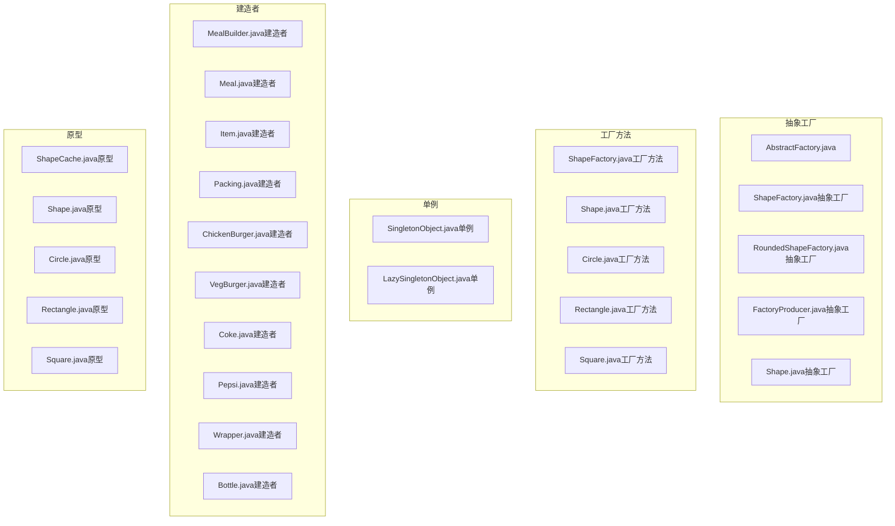
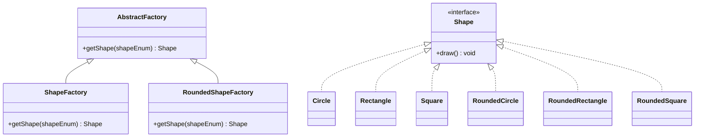
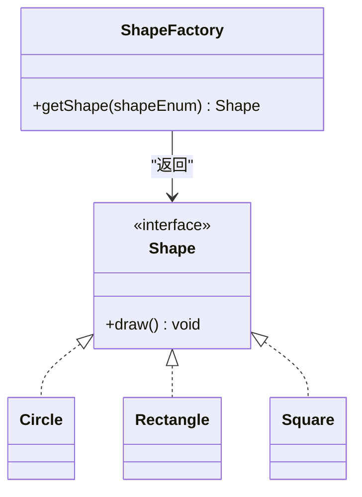
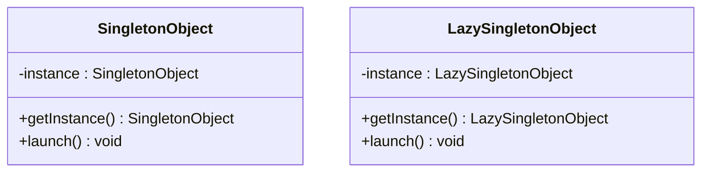
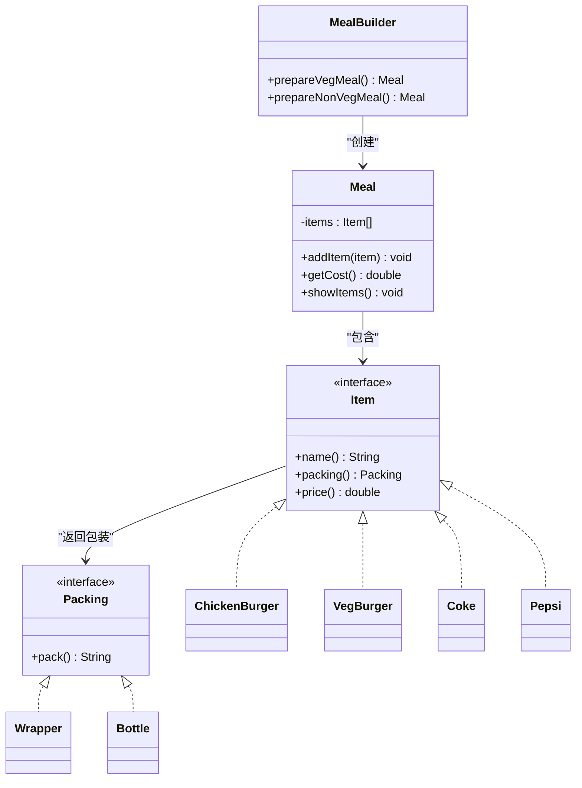
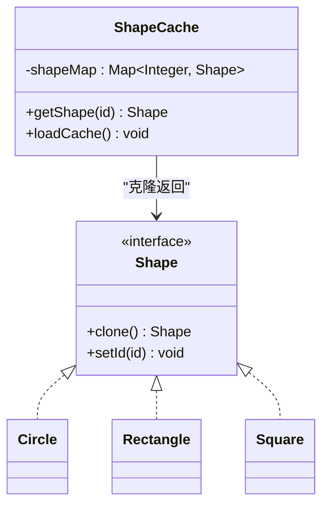
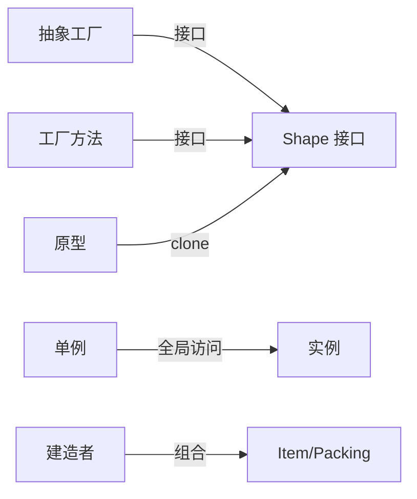

# 创建型模式详解

<cite>
**本文引用的文件**
- [AbstractFactory.java](file://creational/abstractfactory/src/main/java/com/future/rocket/gof23/abs/factory/build/AbstractFactory.java)
- [ShapeFactory.java（抽象工厂）](file://creational/abstractfactory/src/main/java/com/future/rocket/gof23/abs/factory/build/ShapeFactory.java)
- [RoundedShapeFactory.java（抽象工厂）](file://creational/abstractfactory/src/main/java/com/future/rocket/gof23/abs/factory/build/RoundedShapeFactory.java)
- [FactoryProducer.java（抽象工厂）](file://creational/abstractfactory/src/main/java/com/future/rocket/gof23/abs/factory/producer/FactoryProducer.java)
- [Shape.java（抽象工厂）](file://creational/abstractfactory/src/main/java/com/future/rocket/gof23/abs/factory/Shape.java)
- [ShapeFactory.java（工厂方法）](file://creational/factory/src/main/java/com/future/rocket/gof23/factory/build/ShapeFactory.java)
- [Shape.java（工厂方法）](file://creational/factory/src/main/java/com/future/rocket/gof23/factory/Shape.java)
- [Circle.java（工厂方法）](file://creational/factory/src/main/java/com/future/rocket/gof23/factory/impl/Circle.java)
- [Rectangle.java（工厂方法）](file://creational/factory/src/main/java/com/future/rocket/gof23/factory/impl/Rectangle.java)
- [Square.java（工厂方法）](file://creational/factory/src/main/java/com/future/rocket/gof23/factory/impl/Square.java)
- [SingletonObject.java（单例）](file://creational/singleton/src/main/java/com/future/rocket/gof23/singleton/SingletonObject.java)
- [LazySingletonObject.java（单例）](file://creational/singleton/src/main/java/com/future/rocket/gof23/singleton/LazySingletonObject.java)
- [MealBuilder.java（建造者）](file://creational/builder/src/main/java/com/future/rocket/gof23/builder/build/MealBuilder.java)
- [Meal.java（建造者）](file://creational/builder/src/main/java/com/future/rocket/gof23/builder/build/Meal.java)
- [Item.java（建造者）](file://creational/builder/src/main/java/com/future/rocket/gof23/builder/iface/Item.java)
- [Packing.java（建造者）](file://creational/builder/src/main/java/com/future/rocket/gof23/builder/iface/Packing.java)
- [ChickenBurger.java（建造者）](file://creational/builder/src/main/java/com/future/rocket/gof23/builder/impl/ChickenBurger.java)
- [VegBurger.java（建造者）](file://creational/builder/src/main/java/com/future/rocket/gof23/builder/impl/VegBurger.java)
- [Coke.java（建造者）](file://creational/builder/src/main/java/com/future/rocket/gof23/builder/impl/Coke.java)
- [Pepsi.java（建造者）](file://creational/builder/src/main/java/com/future/rocket/gof23/builder/impl/Pepsi.java)
- [Wrapper.java（建造者）](file://creational/builder/src/main/java/com/future/rocket/gof23/builder/impl/Wrapper.java)
- [Bottle.java（建造者）](file://creational/builder/src/main/java/com/future/rocket/gof23/builder/impl/Bottle.java)
- [ShapeCache.java（原型）](file://creational/prototype/src/main/java/com/future/rocket/gof23/prototype/build/ShapeCache.java)
- [Shape.java（原型）](file://creational/prototype/src/main/java/com/future/rocket/gof23/prototype/Shape.java)
- [Circle.java（原型）](file://creational/prototype/src/main/java/com/future/rocket/gof23/prototype/impl/Circle.java)
- [Rectangle.java（原型）](file://creational/prototype/src/main/java/com/future/rocket/gof23/prototype/impl/Rectangle.java)
- [Square.java（原型）](file://creational/prototype/src/main/java/com/future/rocket/gof23/prototype/impl/Square.java)
</cite>

## 目录
1. [引言](#引言)
2. [项目结构](#项目结构)
3. [核心组件](#核心组件)
4. [架构总览](#架构总览)
5. [详细组件分析](#详细组件分析)
6. [依赖分析](#依赖分析)
7. [性能考虑](#性能考虑)
8. [故障排查指南](#故障排查指南)
9. [结论](#结论)
10. [附录](#附录)

## 引言
本文件系统性梳理仓库中创建型模式的五种实现：抽象工厂、工厂方法、单例、建造者与原型。围绕每种模式的核心概念、设计意图、适用场景展开，并结合UML类图与代码片段路径进行深入解析。同时给出优缺点、性能特征、使用注意事项、实际应用案例与最佳实践，帮助不同层次读者循序渐进掌握。

## 项目结构
创建型模式相关代码位于 creational 目录下，按模式拆分为独立子模块，每个模块包含接口定义、具体实现、构建器或缓存、以及主程序入口。整体采用“按功能域分包”的组织方式，便于理解与扩展。

**图表来源**
- [AbstractFactory.java:1-9](file://creational/abstractfactory/src/main/java/com/future/rocket/gof23/abs/factory/build/AbstractFactory.java#L1-L9)
- [ShapeFactory.java（抽象工厂）:1-22](file://creational/abstractfactory/src/main/java/com/future/rocket/gof23/abs/factory/build/ShapeFactory.java#L1-L22)
- [RoundedShapeFactory.java（抽象工厂）:1-22](file://creational/abstractfactory/src/main/java/com/future/rocket/gof23/abs/factory/build/RoundedShapeFactory.java#L1-L22)
- [FactoryProducer.java（抽象工厂）:1-19](file://creational/abstractfactory/src/main/java/com/future/rocket/gof23/abs/factory/producer/FactoryProducer.java#L1-L19)
- [Shape.java（抽象工厂）:1-7](file://creational/abstractfactory/src/main/java/com/future/rocket/gof23/abs/factory/Shape.java#L1-L7)
- [ShapeFactory.java（工厂方法）:1-22](file://creational/factory/src/main/java/com/future/rocket/gof23/factory/build/ShapeFactory.java#L1-L22)
- [Shape.java（工厂方法）:1-7](file://creational/factory/src/main/java/com/future/rocket/gof23/factory/Shape.java#L1-L7)
- [Circle.java（工厂方法）:1-12](file://creational/factory/src/main/java/com/future/rocket/gof23/factory/impl/Circle.java#L1-L12)
- [Rectangle.java（工厂方法）:1-11](file://creational/factory/src/main/java/com/future/rocket/gof23/factory/impl/Rectangle.java#L1-L11)
- [Square.java（工厂方法）:1-11](file://creational/factory/src/main/java/com/future/rocket/gof23/factory/impl/Square.java#L1-L11)
- [SingletonObject.java（单例）:1-17](file://creational/singleton/src/main/java/com/future/rocket/gof23/singleton/SingletonObject.java#L1-L17)
- [LazySingletonObject.java（单例）:1-22](file://creational/singleton/src/main/java/com/future/rocket/gof23/singleton/LazySingletonObject.java#L1-L22)
- [MealBuilder.java（建造者）:1-25](file://creational/builder/src/main/java/com/future/rocket/gof23/builder/build/MealBuilder.java#L1-L25)
- [Meal.java（建造者）:1-31](file://creational/builder/src/main/java/com/future/rocket/gof23/builder/build/Meal.java#L1-L31)
- [Item.java（建造者）](file://creational/builder/src/main/java/com/future/rocket/gof23/builder/iface/Item.java)
- [Packing.java（建造者）](file://creational/builder/src/main/java/com/future/rocket/gof23/builder/iface/Packing.java)
- [ChickenBurger.java（建造者）](file://creational/builder/src/main/java/com/future/rocket/gof23/builder/impl/ChickenBurger.java)
- [VegBurger.java（建造者）](file://creational/builder/src/main/java/com/future/rocket/gof23/builder/impl/VegBurger.java)
- [Coke.java（建造者）](file://creational/builder/src/main/java/com/future/rocket/gof23/builder/impl/Coke.java)
- [Pepsi.java（建造者）](file://creational/builder/src/main/java/com/future/rocket/gof23/builder/impl/Pepsi.java)
- [Wrapper.java（建造者）](file://creational/builder/src/main/java/com/future/rocket/gof23/builder/impl/Wrapper.java)
- [Bottle.java（建造者）](file://creational/builder/src/main/java/com/future/rocket/gof23/builder/impl/Bottle.java)
- [ShapeCache.java（原型）:1-32](file://creational/prototype/src/main/java/com/future/rocket/gof23/prototype/build/ShapeCache.java#L1-L32)
- [Shape.java（原型）](file://creational/prototype/src/main/java/com/future/rocket/gof23/prototype/Shape.java)
- [Circle.java（原型）](file://creational/prototype/src/main/java/com/future/rocket/gof23/prototype/impl/Circle.java)
- [Rectangle.java（原型）](file://creational/prototype/src/main/java/com/future/rocket/gof23/prototype/impl/Rectangle.java)
- [Square.java（原型）](file://creational/prototype/src/main/java/com/future/rocket/gof23/prototype/impl/Square.java)

**章节来源**
- [AbstractFactory.java:1-9](file://creational/abstractfactory/src/main/java/com/future/rocket/gof23/abs/factory/build/AbstractFactory.java#L1-L9)
- [ShapeFactory.java（抽象工厂）:1-22](file://creational/abstractfactory/src/main/java/com/future/rocket/gof23/abs/factory/build/ShapeFactory.java#L1-L22)
- [RoundedShapeFactory.java（抽象工厂）:1-22](file://creational/abstractfactory/src/main/java/com/future/rocket/gof23/abs/factory/build/RoundedShapeFactory.java#L1-L22)
- [FactoryProducer.java（抽象工厂）:1-19](file://creational/abstractfactory/src/main/java/com/future/rocket/gof23/abs/factory/producer/FactoryProducer.java#L1-L19)
- [Shape.java（抽象工厂）:1-7](file://creational/abstractfactory/src/main/java/com/future/rocket/gof23/abs/factory/Shape.java#L1-L7)
- [ShapeFactory.java（工厂方法）:1-22](file://creational/factory/src/main/java/com/future/rocket/gof23/factory/build/ShapeFactory.java#L1-L22)
- [Shape.java（工厂方法）:1-7](file://creational/factory/src/main/java/com/future/rocket/gof23/factory/Shape.java#L1-L7)
- [Circle.java（工厂方法）:1-12](file://creational/factory/src/main/java/com/future/rocket/gof23/factory/impl/Circle.java#L1-L12)
- [Rectangle.java（工厂方法）:1-11](file://creational/factory/src/main/java/com/future/rocket/gof23/factory/impl/Rectangle.java#L1-L11)
- [Square.java（工厂方法）:1-11](file://creational/factory/src/main/java/com/future/rocket/gof23/factory/impl/Square.java#L1-L11)
- [SingletonObject.java（单例）:1-17](file://creational/singleton/src/main/java/com/future/rocket/gof23/singleton/SingletonObject.java#L1-L17)
- [LazySingletonObject.java（单例）:1-22](file://creational/singleton/src/main/java/com/future/rocket/gof23/singleton/LazySingletonObject.java#L1-L22)
- [MealBuilder.java（建造者）:1-25](file://creational/builder/src/main/java/com/future/rocket/gof23/builder/build/MealBuilder.java#L1-L25)
- [Meal.java（建造者）:1-31](file://creational/builder/src/main/java/com/future/rocket/gof23/builder/build/Meal.java#L1-L31)
- [Item.java（建造者）](file://creational/builder/src/main/java/com/future/rocket/gof23/builder/iface/Item.java)
- [Packing.java（建造者）](file://creational/builder/src/main/java/com/future/rocket/gof23/builder/iface/Packing.java)
- [ChickenBurger.java（建造者）](file://creational/builder/src/main/java/com/future/rocket/gof23/builder/impl/ChickenBurger.java)
- [VegBurger.java（建造者）](file://creational/builder/src/main/java/com/future/rocket/gof23/builder/impl/VegBurger.java)
- [Coke.java（建造者）](file://creational/builder/src/main/java/com/future/rocket/gof23/builder/impl/Coke.java)
- [Pepsi.java（建造者）](file://creational/builder/src/main/java/com/future/rocket/gof23/builder/impl/Pepsi.java)
- [Wrapper.java（建造者）](file://creational/builder/src/main/java/com/future/rocket/gof23/builder/impl/Wrapper.java)
- [Bottle.java（建造者）](file://creational/builder/src/main/java/com/future/rocket/gof23/builder/impl/Bottle.java)
- [ShapeCache.java（原型）:1-32](file://creational/prototype/src/main/java/com/future/rocket/gof23/prototype/build/ShapeCache.java#L1-L32)
- [Shape.java（原型）](file://creational/prototype/src/main/java/com/future/rocket/gof23/prototype/Shape.java)
- [Circle.java（原型）](file://creational/prototype/src/main/java/com/future/rocket/gof23/prototype/impl/Circle.java)
- [Rectangle.java（原型）](file://creational/prototype/src/main/java/com/future/rocket/gof23/prototype/impl/Rectangle.java)
- [Square.java（原型）](file://creational/prototype/src/main/java/com/future/rocket/gof23/prototype/impl/Square.java)

## 核心组件
- 抽象工厂：通过抽象工厂接口统一创建一组相关或相互依赖的对象族，避免客户端直接依赖具体实现。
- 工厂方法：在不指定具体类的情况下创建产品对象，将实例化决策推迟到子类。
- 单例：确保一个类仅有一个实例，并提供全局访问点。
- 建造者：将复杂对象的构建与其表示分离，使同样的构建过程可以创建不同的表示。
- 原型：用已有实例作为原型，通过克隆生成新对象，减少构造成本。

**章节来源**
- [AbstractFactory.java:6-8](file://creational/abstractfactory/src/main/java/com/future/rocket/gof23/abs/factory/build/AbstractFactory.java#L6-L8)
- [ShapeFactory.java（抽象工厂）:9-21](file://creational/abstractfactory/src/main/java/com/future/rocket/gof23/abs/factory/build/ShapeFactory.java#L9-L21)
- [RoundedShapeFactory.java（抽象工厂）:9-21](file://creational/abstractfactory/src/main/java/com/future/rocket/gof23/abs/factory/build/RoundedShapeFactory.java#L9-L21)
- [FactoryProducer.java（抽象工厂）:10-17](file://creational/abstractfactory/src/main/java/com/future/rocket/gof23/abs/factory/producer/FactoryProducer.java#L10-L17)
- [ShapeFactory.java（工厂方法）:11-20](file://creational/factory/src/main/java/com/future/rocket/gof23/factory/build/ShapeFactory.java#L11-L20)
- [SingletonObject.java（单例）:5-12](file://creational/singleton/src/main/java/com/future/rocket/gof23/singleton/SingletonObject.java#L5-L12)
- [LazySingletonObject.java（单例）:7-16](file://creational/singleton/src/main/java/com/future/rocket/gof23/singleton/LazySingletonObject.java#L7-L16)
- [MealBuilder.java（建造者）:10-23](file://creational/builder/src/main/java/com/future/rocket/gof23/builder/build/MealBuilder.java#L10-L23)
- [Meal.java（建造者）:15-21](file://creational/builder/src/main/java/com/future/rocket/gof23/builder/build/Meal.java#L15-L21)
- [ShapeCache.java（原型）:15-18](file://creational/prototype/src/main/java/com/future/rocket/gof23/prototype/build/ShapeCache.java#L15-L18)
- [ShapeCache.java（原型）:20-30](file://creational/prototype/src/main/java/com/future/rocket/gof23/prototype/build/ShapeCache.java#L20-L30)

## 架构总览
下图展示五种创建型模式在仓库中的组织与交互关系，突出“接口-实现-构建器/工厂/缓存”的分层职责。

```mermaid
graph TB
subgraph "抽象工厂"
AF_IF["Shape.java抽象工厂"]
AF_AF["AbstractFactory.java"]
AF_SF["ShapeFactory.java抽象工厂"]
AF_RSF["RoundedShapeFactory.java抽象工厂"]
AF_FP["FactoryProducer.java抽象工厂"]
end
subgraph "工厂方法"
FM_IF["Shape.java工厂方法"]
FM_SF["ShapeFactory.java工厂方法"]
FM_IMPL["Circle/Rectangle/Square工厂方法"]
end
subgraph "单例"
SI_S["SingletonObject.java单例"]
SI_LS["LazySingletonObject.java单例"]
end
subgraph "建造者"
BD_MB["MealBuilder.java建造者"]
BD_M["Meal.java建造者"]
BD_IT["Item.java建造者"]
BD_PK["Packing.java建造者"]
BD_IB["ChickenBurger/VegBurger建造者"]
BD_ID["Coke/Pepsi建造者"]
BD_WR["Wrapper.java建造者"]
BD_BT["Bottle.java建造者"]
end
subgraph "原型"
PR_SC["ShapeCache.java原型"]
PR_IF["Shape.java原型"]
PR_IMPL["Circle/Rectangle/Square原型"]
end
AF_AF --> AF_IF
AF_SF --> AF_IF
AF_RSF --> AF_IF
AF_FP --> AF_AF
FM_SF --> FM_IF
FM_SF --> FM_IMPL
BD_MB --> BD_M
BD_M --> BD_IT
BD_IT --> BD_PK
BD_MB --> BD_IB
BD_MB --> BD_ID
BD_IB --> BD_WR
BD_ID --> BD_BT
PR_SC --> PR_IF
PR_SC --> PR_IMPL
```

**图表来源**
- [AbstractFactory.java:6-8](file://creational/abstractfactory/src/main/java/com/future/rocket/gof23/abs/factory/build/AbstractFactory.java#L6-L8)
- [ShapeFactory.java（抽象工厂）:9-21](file://creational/abstractfactory/src/main/java/com/future/rocket/gof23/abs/factory/build/ShapeFactory.java#L9-L21)
- [RoundedShapeFactory.java（抽象工厂）:9-21](file://creational/abstractfactory/src/main/java/com/future/rocket/gof23/abs/factory/build/RoundedShapeFactory.java#L9-L21)
- [FactoryProducer.java（抽象工厂）:10-17](file://creational/abstractfactory/src/main/java/com/future/rocket/gof23/abs/factory/producer/FactoryProducer.java#L10-L17)
- [Shape.java（抽象工厂）:3-6](file://creational/abstractfactory/src/main/java/com/future/rocket/gof23/abs/factory/Shape.java#L3-L6)
- [ShapeFactory.java（工厂方法）:11-20](file://creational/factory/src/main/java/com/future/rocket/gof23/factory/build/ShapeFactory.java#L11-L20)
- [Shape.java（工厂方法）:3-6](file://creational/factory/src/main/java/com/future/rocket/gof23/factory/Shape.java#L3-L6)
- [Circle.java（工厂方法）:5-11](file://creational/factory/src/main/java/com/future/rocket/gof23/factory/impl/Circle.java#L5-L11)
- [Rectangle.java（工厂方法）:5-10](file://creational/factory/src/main/java/com/future/rocket/gof23/factory/impl/Rectangle.java#L5-L10)
- [Square.java（工厂方法）:5-10](file://creational/factory/src/main/java/com/future/rocket/gof23/factory/impl/Square.java#L5-L10)
- [MealBuilder.java（建造者）:10-23](file://creational/builder/src/main/java/com/future/rocket/gof23/builder/build/MealBuilder.java#L10-L23)
- [Meal.java（建造者）:15-21](file://creational/builder/src/main/java/com/future/rocket/gof23/builder/build/Meal.java#L15-L21)
- [Item.java（建造者）](file://creational/builder/src/main/java/com/future/rocket/gof23/builder/iface/Item.java)
- [Packing.java（建造者）](file://creational/builder/src/main/java/com/future/rocket/gof23/builder/iface/Packing.java)
- [ChickenBurger.java（建造者）](file://creational/builder/src/main/java/com/future/rocket/gof23/builder/impl/ChickenBurger.java)
- [VegBurger.java（建造者）](file://creational/builder/src/main/java/com/future/rocket/gof23/builder/impl/VegBurger.java)
- [Coke.java（建造者）](file://creational/builder/src/main/java/com/future/rocket/gof23/builder/impl/Coke.java)
- [Pepsi.java（建造者）](file://creational/builder/src/main/java/com/future/rocket/gof23/builder/impl/Pepsi.java)
- [Wrapper.java（建造者）](file://creational/builder/src/main/java/com/future/rocket/gof23/builder/impl/Wrapper.java)
- [Bottle.java（建造者）](file://creational/builder/src/main/java/com/future/rocket/gof23/builder/impl/Bottle.java)
- [ShapeCache.java（原型）:15-18](file://creational/prototype/src/main/java/com/future/rocket/gof23/prototype/build/ShapeCache.java#L15-L18)
- [Shape.java（原型）](file://creational/prototype/src/main/java/com/future/rocket/gof23/prototype/Shape.java)
- [Circle.java（原型）](file://creational/prototype/src/main/java/com/future/rocket/gof23/prototype/impl/Circle.java)
- [Rectangle.java（原型）](file://creational/prototype/src/main/java/com/future/rocket/gof23/prototype/impl/Rectangle.java)
- [Square.java（原型）](file://creational/prototype/src/main/java/com/future/rocket/gof23/prototype/impl/Square.java)

## 详细组件分析

### 抽象工厂模式
- 核心概念与设计意图
  - 定义一个创建一系列相关或相互依赖对象的接口，而无需指定它们具体的类。
  - 将“产品族”的选择权交给工厂族，客户端只依赖于抽象工厂与抽象产品接口。
- 关键类与职责
  - 抽象工厂：声明创建产品族的方法。
  - 具体工厂：实现抽象工厂，负责创建具体的产品族。
  - 抽象产品：产品的统一接口。
  - 具体产品：同一产品族的不同变体。
- UML 类图

**图表来源**
- [AbstractFactory.java:6-8](file://creational/abstractfactory/src/main/java/com/future/rocket/gof23/abs/factory/build/AbstractFactory.java#L6-L8)
- [ShapeFactory.java（抽象工厂）:9-21](file://creational/abstractfactory/src/main/java/com/future/rocket/gof23/abs/factory/build/ShapeFactory.java#L9-L21)
- [RoundedShapeFactory.java（抽象工厂）:9-21](file://creational/abstractfactory/src/main/java/com/future/rocket/gof23/abs/factory/build/RoundedShapeFactory.java#L9-L21)
- [Shape.java（抽象工厂）:3-6](file://creational/abstractfactory/src/main/java/com/future/rocket/gof23/abs/factory/Shape.java#L3-L6)
- [Circle.java（抽象工厂）](file://creational/abstractfactory/src/main/java/com/future/rocket/gof23/abs/factory/impl/Circle.java)
- [Rectangle.java（抽象工厂）](file://creational/abstractfactory/src/main/java/com/future/rocket/gof23/abs/factory/impl/Rectangle.java)
- [Square.java（抽象工厂）](file://creational/abstractfactory/src/main/java/com/future/rocket/gof23/abs/factory/impl/Square.java)
- [RoundedCircle.java（抽象工厂）](file://creational/abstractfactory/src/main/java/com/future/rocket/gof23/abs/factory/impl/RoundedCircle.java)
- [RoundedRectangle.java（抽象工厂）](file://creational/abstractfactory/src/main/java/com/future/rocket/gof23/abs/factory/impl/RoundedRectangle.java)
- [RoundedSquare.java（抽象工厂）](file://creational/abstractfactory/src/main/java/com/future/rocket/gof23/abs/factory/impl/RoundedSquare.java)

- 适用场景
  - 需要创建一组“相关或相互依赖”的对象。
  - 系统需要通过配置或运行时参数切换“产品族”。
- 优缺点
  - 优点：隔离了具体类；易于替换整个产品族；符合开闭原则。
  - 缺点：新增产品等级困难；类层次复杂度上升。
- 性能特征与注意事项
  - 通过工厂族集中创建，避免分散的 new 操作，提升可维护性。
  - 注意避免过度扩展导致工厂数量爆炸。
- 实际应用案例
  - UI 主题切换：同一套控件的不同主题（圆角/直角）。
  - 多数据库驱动：同构操作接口下的不同驱动族。
- 最佳实践
  - 明确产品族边界，避免跨族耦合。
  - 使用枚举限定产品类型，保证类型安全。

**章节来源**
- [AbstractFactory.java:6-8](file://creational/abstractfactory/src/main/java/com/future/rocket/gof23/abs/factory/build/AbstractFactory.java#L6-L8)
- [ShapeFactory.java（抽象工厂）:9-21](file://creational/abstractfactory/src/main/java/com/future/rocket/gof23/abs/factory/build/ShapeFactory.java#L9-L21)
- [RoundedShapeFactory.java（抽象工厂）:9-21](file://creational/abstractfactory/src/main/java/com/future/rocket/gof23/abs/factory/build/RoundedShapeFactory.java#L9-L21)
- [FactoryProducer.java（抽象工厂）:10-17](file://creational/abstractfactory/src/main/java/com/future/rocket/gof23/abs/factory/producer/FactoryProducer.java#L10-L17)
- [Shape.java（抽象工厂）:3-6](file://creational/abstractfactory/src/main/java/com/future/rocket/gof23/abs/factory/Shape.java#L3-L6)

### 工厂方法模式
- 核心概念与设计意图
  - 定义创建对象的接口，但让子类决定实例化哪一个类，使实例化延迟到子类。
- 关键类与职责
  - 抽象产品：统一接口。
  - 具体产品：实现抽象产品。
  - 工厂：声明创建产品的方法，返回抽象产品。
- UML 类图

**图表来源**
- [Shape.java（工厂方法）:3-6](file://creational/factory/src/main/java/com/future/rocket/gof23/factory/Shape.java#L3-L6)
- [ShapeFactory.java（工厂方法）:11-20](file://creational/factory/src/main/java/com/future/rocket/gof23/factory/build/ShapeFactory.java#L11-L20)
- [Circle.java（工厂方法）:5-11](file://creational/factory/src/main/java/com/future/rocket/gof23/factory/impl/Circle.java#L5-L11)
- [Rectangle.java（工厂方法）:5-10](file://creational/factory/src/main/java/com/future/rocket/gof23/factory/impl/Rectangle.java#L5-L10)
- [Square.java（工厂方法）:5-10](file://creational/factory/src/main/java/com/future/rocket/gof23/factory/impl/Square.java#L5-L10)

- 适用场景
  - 产品种类稳定，但希望将创建逻辑延迟到子类。
  - 需要根据输入参数动态选择具体产品。
- 优缺点
  - 优点：符合开闭原则；易于扩展新的产品。
  - 缺点：类数量增加；客户端需了解产品接口。
- 性能特征与注意事项
  - 通过工厂方法集中创建，利于缓存与池化。
  - 注意避免分支过多导致维护困难。
- 实际应用案例
  - 日志记录器：根据配置选择控制台/文件/网络日志器。
  - 数据库连接：根据驱动类型返回不同连接对象。
- 最佳实践
  - 使用枚举或配置映射产品类型，减少硬编码分支。

**章节来源**
- [ShapeFactory.java（工厂方法）:11-20](file://creational/factory/src/main/java/com/future/rocket/gof23/factory/build/ShapeFactory.java#L11-L20)
- [Shape.java（工厂方法）:3-6](file://creational/factory/src/main/java/com/future/rocket/gof23/factory/Shape.java#L3-L6)
- [Circle.java（工厂方法）:5-11](file://creational/factory/src/main/java/com/future/rocket/gof23/factory/impl/Circle.java#L5-L11)
- [Rectangle.java（工厂方法）:5-10](file://creational/factory/src/main/java/com/future/rocket/gof23/factory/impl/Rectangle.java#L5-L10)
- [Square.java（工厂方法）:5-10](file://creational/factory/src/main/java/com/future/rocket/gof23/factory/impl/Square.java#L5-L10)

### 单例模式
- 核心概念与设计意图
  - 保证一个类仅有一个实例，并提供一个访问它的全局入口。
- 关键类与职责
  - 饿汉式：类加载时即创建实例。
  - 懒汉式：首次使用时才创建实例，注意线程安全。
- UML 类图

**图表来源**
- [SingletonObject.java（单例）:5-12](file://creational/singleton/src/main/java/com/future/rocket/gof23/singleton/SingletonObject.java#L5-L12)
- [LazySingletonObject.java（单例）:7-16](file://creational/singleton/src/main/java/com/future/rocket/gof23/singleton/LazySingletonObject.java#L7-L16)

- 适用场景
  - 需要唯一资源管理器（如配置中心、线程池）。
  - 需要严格控制并发访问的共享对象。
- 优缺点
  - 优点：节省内存；全局状态一致。
  - 缺点：隐藏依赖；测试困难；并发风险。
- 性能特征与注意事项
  - 饿汉式无锁，懒汉式需同步，注意双重检查锁定与 volatile。
  - 避免反射与序列化破坏单例。
- 实际应用案例
  - 应用启动器、日志器、缓存管理器。
- 最佳实践
  - 优先使用饿汉式；若必须懒汉式，采用双重检查+volatile。
  - 谨慎暴露全局状态，必要时提供受控访问接口。

**章节来源**
- [SingletonObject.java（单例）:5-12](file://creational/singleton/src/main/java/com/future/rocket/gof23/singleton/SingletonObject.java#L5-L12)
- [LazySingletonObject.java（单例）:7-16](file://creational/singleton/src/main/java/com/future/rocket/gof23/singleton/LazySingletonObject.java#L7-L16)

### 建造者模式
- 核心概念与设计意图
  - 将复杂对象的构建与表示分离，使得同样的构建过程可以创建不同的表示。
- 关键类与职责
  - 产品：最终被构建的复杂对象。
  - 建造者：定义构建步骤与返回产品。
  - 指导者：按顺序调用建造步骤。
  - 产品部件：Item/Packing 等。
- UML 类图

**图表来源**
- [Meal.java（建造者）:8-30](file://creational/builder/src/main/java/com/future/rocket/gof23/builder/build/Meal.java#L8-L30)
- [MealBuilder.java（建造者）:8-24](file://creational/builder/src/main/java/com/future/rocket/gof23/builder/build/MealBuilder.java#L8-L24)
- [Item.java（建造者）](file://creational/builder/src/main/java/com/future/rocket/gof23/builder/iface/Item.java)
- [Packing.java（建造者）](file://creational/builder/src/main/java/com/future/rocket/gof23/builder/iface/Packing.java)
- [ChickenBurger.java（建造者）](file://creational/builder/src/main/java/com/future/rocket/gof23/builder/impl/ChickenBurger.java)
- [VegBurger.java（建造者）](file://creational/builder/src/main/java/com/future/rocket/gof23/builder/impl/VegBurger.java)
- [Coke.java（建造者）](file://creational/builder/src/main/java/com/future/rocket/gof23/builder/impl/Coke.java)
- [Pepsi.java（建造者）](file://creational/builder/src/main/java/com/future/rocket/gof23/builder/impl/Pepsi.java)
- [Wrapper.java（建造者）](file://creational/builder/src/main/java/com/future/rocket/gof23/builder/impl/Wrapper.java)
- [Bottle.java（建造者）](file://creational/builder/src/main/java/com/future/rocket/gof23/builder/impl/Bottle.java)

- 适用场景
  - 构建过程固定，但产品组合多样（如套餐）。
  - 需要逐步构建复杂对象，且各部分可独立变化。
- 优缺点
  - 优点：封装构建过程；支持不同表示。
  - 缺点：类数量较多；对产品内部结构了解要求高。
- 性能特征与注意事项
  - 利用流式聚合计算总价格，简洁高效。
  - 注意避免过度设计，简单对象无需建造者。
- 实际应用案例
  - 餐厅套餐：根据套餐类型组合不同主食与饮料。
  - 配置生成：按模板组装复杂配置对象。
- 最佳实践
  - 将构建步骤与产品表示解耦，遵循单一职责。
  - 提供默认构建策略，允许定制化覆盖。

**章节来源**
- [MealBuilder.java（建造者）:10-23](file://creational/builder/src/main/java/com/future/rocket/gof23/builder/build/MealBuilder.java#L10-L23)
- [Meal.java（建造者）:15-21](file://creational/builder/src/main/java/com/future/rocket/gof23/builder/build/Meal.java#L15-L21)
- [Item.java（建造者）](file://creational/builder/src/main/java/com/future/rocket/gof23/builder/iface/Item.java)
- [Packing.java（建造者）](file://creational/builder/src/main/java/com/future/rocket/gof23/builder/iface/Packing.java)

### 原型模式
- 核心概念与设计意图
  - 用原型实例指定创建对象的种类，并通过拷贝这些原型创建新的对象。
- 关键类与职责
  - 原型接口：定义 clone 方法。
  - 具体原型：实现 clone。
  - 原型缓存：管理已创建原型的注册与获取。
- UML 类图

**图表来源**
- [Shape.java（原型）](file://creational/prototype/src/main/java/com/future/rocket/gof23/prototype/Shape.java)
- [Circle.java（原型）](file://creational/prototype/src/main/java/com/future/rocket/gof23/prototype/impl/Circle.java)
- [Rectangle.java（原型）](file://creational/prototype/src/main/java/com/future/rocket/gof23/prototype/impl/Rectangle.java)
- [Square.java（原型）](file://creational/prototype/src/main/java/com/future/rocket/gof23/prototype/impl/Square.java)
- [ShapeCache.java（原型）:13-30](file://creational/prototype/src/main/java/com/future/rocket/gof23/prototype/build/ShapeCache.java#L13-L30)

- 适用场景
  - 对象创建成本高，但复制成本低。
  - 需要从运行时状态快速生成对象。
- 优缺点
  - 优点：降低创建成本；支持动态配置。
  - 缺点：深拷贝复杂；原型管理开销。
- 性能特征与注意事项
  - 缓存预热后，克隆速度远超新建。
  - 注意处理可变内部状态的深拷贝。
- 实际应用案例
  - 图形编辑器：复制形状并修改属性。
  - 游戏单位：批量生成相同类型的敌人。
- 最佳实践
  - 明确 clone 的语义（浅/深拷贝）。
  - 维护原型注册表，避免重复创建。

**章节来源**
- [ShapeCache.java（原型）:15-18](file://creational/prototype/src/main/java/com/future/rocket/gof23/prototype/build/ShapeCache.java#L15-L18)
- [ShapeCache.java（原型）:20-30](file://creational/prototype/src/main/java/com/future/rocket/gof23/prototype/build/ShapeCache.java#L20-L30)
- [Shape.java（原型）](file://creational/prototype/src/main/java/com/future/rocket/gof23/prototype/Shape.java)
- [Circle.java（原型）](file://creational/prototype/src/main/java/com/future/rocket/gof23/prototype/impl/Circle.java)
- [Rectangle.java（原型）](file://creational/prototype/src/main/java/com/future/rocket/gof23/prototype/impl/Rectangle.java)
- [Square.java（原型）](file://creational/prototype/src/main/java/com/future/rocket/gof23/prototype/impl/Square.java)

## 依赖分析
- 模块内聚与耦合
  - 抽象工厂：通过抽象接口隔离具体实现，耦合度低。
  - 工厂方法：面向接口编程，扩展性强。
  - 单例：全局状态带来隐式耦合，需谨慎使用。
  - 建造者：产品与部件解耦，构建流程清晰。
  - 原型：依赖 clone 能力，需统一接口设计。
- 外部依赖与集成点
  - 未见外部框架依赖，均为纯 Java 实现。
- 循环依赖
  - 各模块间无循环依赖，结构清晰。

**图表来源**
- [Shape.java（抽象工厂）:3-6](file://creational/abstractfactory/src/main/java/com/future/rocket/gof23/abs/factory/Shape.java#L3-L6)
- [Shape.java（工厂方法）:3-6](file://creational/factory/src/main/java/com/future/rocket/gof23/factory/Shape.java#L3-L6)
- [Item.java（建造者）](file://creational/builder/src/main/java/com/future/rocket/gof23/builder/iface/Item.java)
- [Packing.java（建造者）](file://creational/builder/src/main/java/com/future/rocket/gof23/builder/iface/Packing.java)
- [Shape.java（原型）](file://creational/prototype/src/main/java/com/future/rocket/gof23/prototype/Shape.java)

**章节来源**
- [AbstractFactory.java:6-8](file://creational/abstractfactory/src/main/java/com/future/rocket/gof23/abs/factory/build/AbstractFactory.java#L6-L8)
- [ShapeFactory.java（抽象工厂）:9-21](file://creational/abstractfactory/src/main/java/com/future/rocket/gof23/abs/factory/build/ShapeFactory.java#L9-L21)
- [ShapeFactory.java（工厂方法）:11-20](file://creational/factory/src/main/java/com/future/rocket/gof23/factory/build/ShapeFactory.java#L11-L20)
- [Meal.java（建造者）:15-21](file://creational/builder/src/main/java/com/future/rocket/gof23/builder/build/Meal.java#L15-L21)
- [ShapeCache.java（原型）:15-18](file://creational/prototype/src/main/java/com/future/rocket/gof23/prototype/build/ShapeCache.java#L15-L18)

## 性能考虑
- 抽象工厂与工厂方法
  - 通过集中创建减少分支判断次数，提升可维护性；新增产品时需修改工厂，注意扩展成本。
- 单例
  - 饿汉式零开销；懒汉式需同步，建议双重检查+volatile，避免频繁加锁。
- 建造者
  - 列表聚合与流式求和效率较高；构建步骤越多，调用链越长，注意避免过度设计。
- 原型
  - 缓存预热后克隆成本低；深拷贝可能带来额外开销，需评估对象结构复杂度。

## 故障排查指南
- 抽象工厂/工厂方法
  - 症状：返回空对象或类型错误。
  - 排查：确认枚举值匹配与分支覆盖；检查具体工厂是否正确实现。
- 单例
  - 症状：多实例或并发问题。
  - 排查：确认懒汉式双重检查与 volatile；避免反射与序列化破坏。
- 建造者
  - 症状：产品属性缺失或顺序错误。
  - 排查：检查指导者构建顺序与部件装配；核对 Item/Packing 接口实现。
- 原型
  - 症状：克隆后状态异常。
  - 排查：确认 clone 实现与内部状态复制；核对缓存键与 id 设置。

**章节来源**
- [ShapeFactory.java（抽象工厂）:11-20](file://creational/abstractfactory/src/main/java/com/future/rocket/gof23/abs/factory/build/ShapeFactory.java#L11-L20)
- [ShapeFactory.java（工厂方法）:11-20](file://creational/factory/src/main/java/com/future/rocket/gof23/factory/build/ShapeFactory.java#L11-L20)
- [LazySingletonObject.java（单例）:7-16](file://creational/singleton/src/main/java/com/future/rocket/gof23/singleton/LazySingletonObject.java#L7-L16)
- [MealBuilder.java（建造者）:10-23](file://creational/builder/src/main/java/com/future/rocket/gof23/builder/build/MealBuilder.java#L10-L23)
- [ShapeCache.java（原型）:15-18](file://creational/prototype/src/main/java/com/future/rocket/gof23/prototype/build/ShapeCache.java#L15-L18)

## 结论
本仓库以最小实现展示了五种创建型模式的关键要点：抽象工厂与工厂方法强调“接口隔离与延迟实例化”，单例强调“唯一性与全局访问”，建造者强调“构建流程与产品多样性”，原型强调“克隆与缓存”。结合 UML 与代码路径，读者可据此在实际项目中按需选择与演进。

## 附录
- 学习路径建议
  - 初学者：先理解接口与继承，再学习工厂方法与抽象工厂，最后掌握单例与建造者，原型作为进阶。
  - 进阶者：关注线程安全、缓存策略、深浅拷贝与构建流程优化。
- 参考实现路径
  - 抽象工厂：[AbstractFactory.java:6-8](file://creational/abstractfactory/src/main/java/com/future/rocket/gof23/abs/factory/build/AbstractFactory.java#L6-L8)，[ShapeFactory.java（抽象工厂）:9-21](file://creational/abstractfactory/src/main/java/com/future/rocket/gof23/abs/factory/build/ShapeFactory.java#L9-L21)，[FactoryProducer.java（抽象工厂）:10-17](file://creational/abstractfactory/src/main/java/com/future/rocket/gof23/abs/factory/producer/FactoryProducer.java#L10-L17)
  - 工厂方法：[ShapeFactory.java（工厂方法）:11-20](file://creational/factory/src/main/java/com/future/rocket/gof23/factory/build/ShapeFactory.java#L11-L20)，[Circle.java（工厂方法）:5-11](file://creational/factory/src/main/java/com/future/rocket/gof23/factory/impl/Circle.java#L5-L11)
  - 单例：[SingletonObject.java（单例）:5-12](file://creational/singleton/src/main/java/com/future/rocket/gof23/singleton/SingletonObject.java#L5-L12)，[LazySingletonObject.java（单例）:7-16](file://creational/singleton/src/main/java/com/future/rocket/gof23/singleton/LazySingletonObject.java#L7-L16)
  - 建造者：[MealBuilder.java（建造者）:10-23](file://creational/builder/src/main/java/com/future/rocket/gof23/builder/build/MealBuilder.java#L10-L23)，[Meal.java（建造者）:15-21](file://creational/builder/src/main/java/com/future/rocket/gof23/builder/build/Meal.java#L15-L21)
  - 原型：[ShapeCache.java（原型）:15-18](file://creational/prototype/src/main/java/com/future/rocket/gof23/prototype/build/ShapeCache.java#L15-L18)，[Circle.java（原型）](file://creational/prototype/src/main/java/com/future/rocket/gof23/prototype/impl/Circle.java)