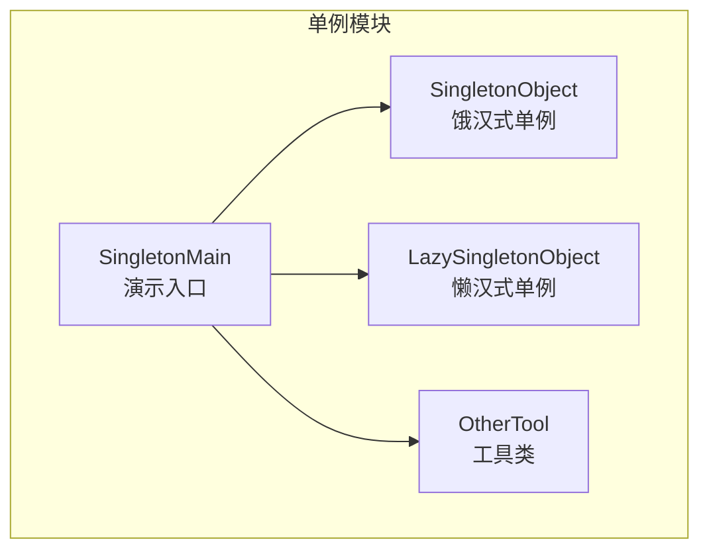
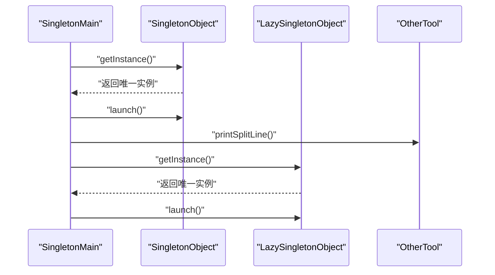
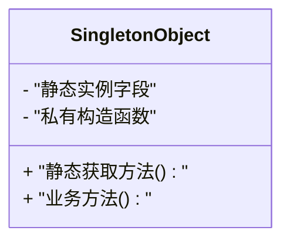
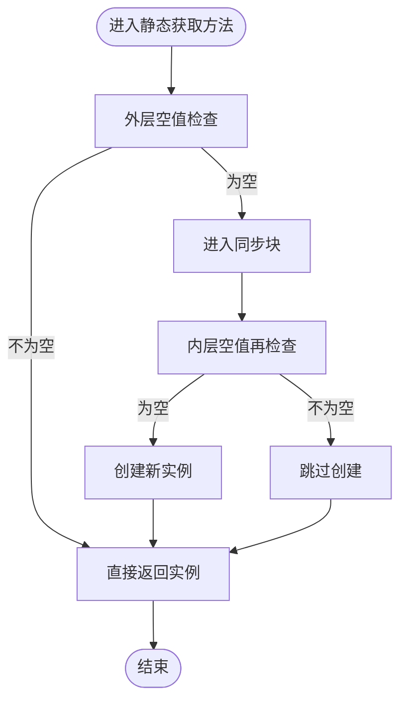
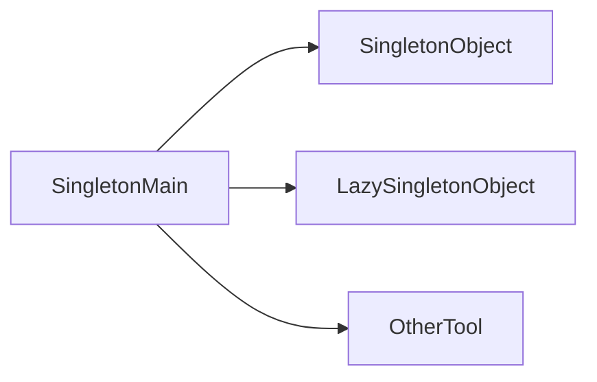

# 单例模式

<cite>
**本文引用的文件**
- [SingletonObject.java](file://creational/singleton/src/main/java/com/future/rocket/gof23/singleton/SingletonObject.java)
- [LazySingletonObject.java](file://creational/singleton/src/main/java/com/future/rocket/gof23/singleton/LazySingletonObject.java)
- [SingletonMain.java](file://creational/singleton/src/main/java/com/future/rocket/gof23/singleton/SingletonMain.java)
- [OtherTool.java](file://common/src/main/java/com/future/rocket/gof23/common/OtherTool.java)
- [readme.md](file://creational/singleton/readme.md)
</cite>

## 目录
1. [引言](#引言)
2. [项目结构](#项目结构)
3. [核心组件](#核心组件)
4. [架构总览](#架构总览)
5. [详细组件分析](#详细组件分析)
6. [依赖关系分析](#依赖关系分析)
7. [性能考量](#性能考量)
8. [故障排查指南](#故障排查指南)
9. [结论](#结论)
10. [附录](#附录)

## 引言
本篇文档围绕单例模式展开，系统阐述其核心概念、设计意图与实现方式，并结合仓库中的具体实现，对比饿汉式与懒汉式的差异，讨论线程安全问题及常见解决方案（如双重检查锁定、静态内部类等），并给出适用场景、潜在问题与替代方案建议。读者可据此在实际工程中正确选择与实现单例，兼顾正确性、性能与可维护性。

## 项目结构
该模块位于“创建型”设计模式下的“单例”目录，包含两个核心类：饿汉式单例与懒汉式单例，以及一个演示入口类。整体结构清晰，便于理解两种实现思路的差异与适用场景。

图表来源
- [SingletonObject.java:1-17](file://creational/singleton/src/main/java/com/future/rocket/gof23/singleton/SingletonObject.java#L1-L17)
- [LazySingletonObject.java:1-22](file://creational/singleton/src/main/java/com/future/rocket/gof23/singleton/LazySingletonObject.java#L1-L22)
- [SingletonMain.java:1-16](file://creational/singleton/src/main/java/com/future/rocket/gof23/singleton/SingletonMain.java#L1-L16)
- [OtherTool.java:1-12](file://common/src/main/java/com/future/rocket/gof23/common/OtherTool.java#L1-L12)

章节来源
- [SingletonObject.java:1-17](file://creational/singleton/src/main/java/com/future/rocket/gof23/singleton/SingletonObject.java#L1-L17)
- [LazySingletonObject.java:1-22](file://creational/singleton/src/main/java/com/future/rocket/gof23/singleton/LazySingletonObject.java#L1-L22)
- [SingletonMain.java:1-16](file://creational/singleton/src/main/java/com/future/rocket/gof23/singleton/SingletonMain.java#L1-L16)
- [OtherTool.java:1-12](file://common/src/main/java/com/future/rocket/gof23/common/OtherTool.java#L1-L12)
- [readme.md:1-9](file://creational/singleton/readme.md#L1-L9)

## 核心组件
- 饿汉式单例（SingletonObject）
  - 特点：类加载时即创建唯一实例，线程安全；调用效率高但可能造成资源浪费。
  - 关键点：静态字段持有实例，构造函数私有化，提供静态获取方法。
- 懒汉式单例（LazySingletonObject）
  - 特点：首次使用时才创建实例，延迟初始化；需处理并发安全问题。
  - 关键点：静态字段延迟初始化，双重检查锁定（DCL）保证线程安全，同步块内再次校验避免竞态条件。
- 演示入口（SingletonMain）
  - 调用两类单例的获取方法并执行业务动作，展示两种实现的使用方式。
- 工具类（OtherTool）
  - 提供分隔线打印，用于演示输出的可读性。

章节来源
- [SingletonObject.java:3-17](file://creational/singleton/src/main/java/com/future/rocket/gof23/singleton/SingletonObject.java#L3-L17)
- [LazySingletonObject.java:3-22](file://creational/singleton/src/main/java/com/future/rocket/gof23/singleton/LazySingletonObject.java#L3-L22)
- [SingletonMain.java:5-16](file://creational/singleton/src/main/java/com/future/rocket/gof23/singleton/SingletonMain.java#L5-L16)
- [OtherTool.java:3-12](file://common/src/main/java/com/future/rocket/gof23/common/OtherTool.java#L3-L12)

## 架构总览
下图展示了演示入口如何通过静态工厂方法访问两类单例对象，并调用其业务方法。

图表来源
- [SingletonMain.java:7-14](file://creational/singleton/src/main/java/com/future/rocket/gof23/singleton/SingletonMain.java#L7-L14)
- [SingletonObject.java:10-16](file://creational/singleton/src/main/java/com/future/rocket/gof23/singleton/SingletonObject.java#L10-L16)
- [LazySingletonObject.java:7-20](file://creational/singleton/src/main/java/com/future/rocket/gof23/singleton/LazySingletonObject.java#L7-L20)
- [OtherTool.java:8-10](file://common/src/main/java/com/future/rocket/gof23/common/OtherTool.java#L8-L10)

## 详细组件分析

### 饿汉式单例（SingletonObject）
- 设计要点
  - 类加载时即创建实例，避免了运行期的同步开销。
  - 构造函数私有化，防止外部直接实例化。
  - 提供静态获取方法，直接返回已存在的实例。
- 线程安全
  - 由于实例在类加载阶段创建，不存在多线程竞争，天然线程安全。
- 性能特征
  - 首次调用无需同步，调用效率高；但可能在不需要时提前占用内存。
- 适用场景
  - 实例创建成本低、生命周期长、全局共享的资源管理器或配置中心。

图表来源
- [SingletonObject.java:3-17](file://creational/singleton/src/main/java/com/future/rocket/gof23/singleton/SingletonObject.java#L3-L17)

章节来源
- [SingletonObject.java:3-17](file://creational/singleton/src/main/java/com/future/rocket/gof23/singleton/SingletonObject.java#L3-L17)

### 懒汉式单例（LazySingletonObject）
- 设计要点
  - 延迟初始化，首次访问时才创建实例。
  - 使用双重检查锁定（DCL）：外层判断避免不必要的同步，内层再次判断确保只创建一次。
  - 同步块内再次校验，防止指令重排序导致的竞态条件。
- 线程安全
  - 外层非空判断减少同步开销；内层同步块确保多线程下仅创建一次。
  - 注意：若未采用合适的内存可见性保障（如 volatile），在某些旧版本 JVM 上仍可能出现问题。
- 性能特征
  - 首次访问需要同步，后续调用无同步开销；适合实例创建成本较高或使用频率较低的场景。
- 适用场景
  - 资源昂贵、按需初始化、多线程环境下的全局服务。

图表来源
- [LazySingletonObject.java:7-16](file://creational/singleton/src/main/java/com/future/rocket/gof23/singleton/LazySingletonObject.java#L7-L16)

章节来源
- [LazySingletonObject.java:3-22](file://creational/singleton/src/main/java/com/future/rocket/gof23/singleton/LazySingletonObject.java#L3-L22)

### 演示入口（SingletonMain）
- 功能：分别获取两类单例并调用其业务方法，展示两种实现的使用方式。
- 输出：通过工具类打印分隔线，增强可读性。

图表来源
- [SingletonMain.java:7-14](file://creational/singleton/src/main/java/com/future/rocket/gof23/singleton/SingletonMain.java#L7-L14)
- [OtherTool.java:8-10](file://common/src/main/java/com/future/rocket/gof23/common/OtherTool.java#L8-L10)

章节来源
- [SingletonMain.java:5-16](file://creational/singleton/src/main/java/com/future/rocket/gof23/singleton/SingletonMain.java#L5-L16)
- [OtherTool.java:3-12](file://common/src/main/java/com/future/rocket/gof23/common/OtherTool.java#L3-L12)

## 依赖关系分析
- SingletonMain 依赖两类单例类与其业务方法。
- SingletonMain 依赖 OtherTool 的输出辅助功能。
- 两类单例类彼此独立，均通过静态工厂方法提供全局唯一实例。

图表来源
- [SingletonMain.java:3-14](file://creational/singleton/src/main/java/com/future/rocket/gof23/singleton/SingletonMain.java#L3-L14)
- [OtherTool.java:3-12](file://common/src/main/java/com/future/rocket/gof23/common/OtherTool.java#L3-L12)

章节来源
- [SingletonMain.java:3-14](file://creational/singleton/src/main/java/com/future/rocket/gof23/singleton/SingletonMain.java#L3-L14)
- [OtherTool.java:3-12](file://common/src/main/java/com/future/rocket/gof23/common/OtherTool.java#L3-L12)

## 性能考量
- 饿汉式
  - 优点：无同步开销，首次调用快；缺点：可能提前占用内存。
  - 适合：实例创建成本低、全局常驻的资源。
- 懒汉式
  - 优点：延迟初始化，节省内存；缺点：首次访问需同步，后续调用无同步。
  - 适合：实例创建成本高、按需使用的全局服务。
- 双重检查锁定（DCL）
  - 在多线程环境下显著降低同步成本；需注意内存可见性与指令重排序问题。
- 静态内部类
  - 利用类加载机制保证线程安全，同时保持延迟初始化与高效访问，是推荐的实现方式之一。

## 故障排查指南
- 现象：懒汉式在多线程下出现重复创建实例
  - 排查：确认是否使用了双重检查锁定并在关键字段上具备内存可见性保障（如 volatile）。
  - 解决：采用 DCL 并确保字段可见性，或改用静态内部类实现。
- 现象：饿汉式内存占用过高
  - 排查：评估实例是否真的需要在类加载时创建。
  - 解决：改为懒汉式或按需创建策略。
- 现象：序列化破坏单例
  - 排查：若单例类实现了序列化接口，需提供自定义的序列化控制逻辑。
  - 解决：在单例类中提供序列化控制方法，确保反序列化后仍返回同一实例。
- 现象：反射攻击
  - 排查：通过反射强行调用私有构造函数可能导致多个实例。
  - 解决：在私有构造函数中检测并阻止重复实例化，或在类加载时就禁止反射访问。

## 结论
单例模式通过“唯一实例+全局访问点”的设计，有效管理全局共享资源。饿汉式实现简单、线程安全且调用高效，适合轻量级全局资源；懒汉式实现延迟初始化、节省内存，但需谨慎处理并发与内存可见性问题。在现代 Java 中，推荐优先采用静态内部类实现，兼顾延迟初始化与线程安全。同时，应根据业务场景权衡性能与内存占用，并考虑替代方案（如依赖注入容器、枚举单例等）以提升可测试性与可维护性。

## 附录
- 模式简介（来自模块说明）
  - 该模式由单一类负责创建对象，确保仅生成一个实例，并提供直接访问其唯一对象的方式，无需重新实例化。
- 术语
  - 唯一实例：全局范围内仅存在一个对象实例。
  - 全局访问点：提供静态方法获取唯一实例。
  - 双重检查锁定（DCL）：外层非空检查 + 同步块内再次检查，以降低同步成本。
  - 静态内部类：利用类加载机制实现延迟初始化与线程安全。

章节来源
- [readme.md:3-7](file://creational/singleton/readme.md#L3-L7)