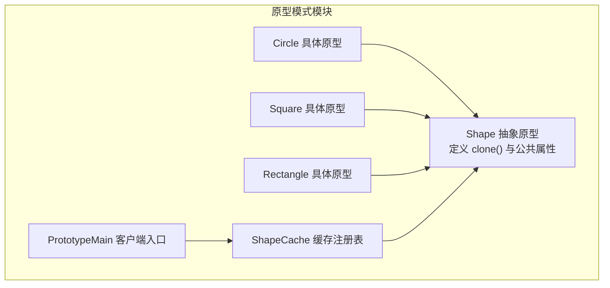
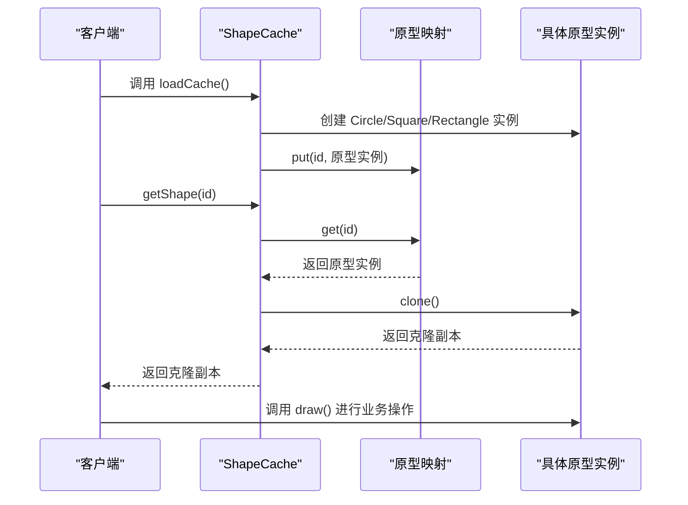
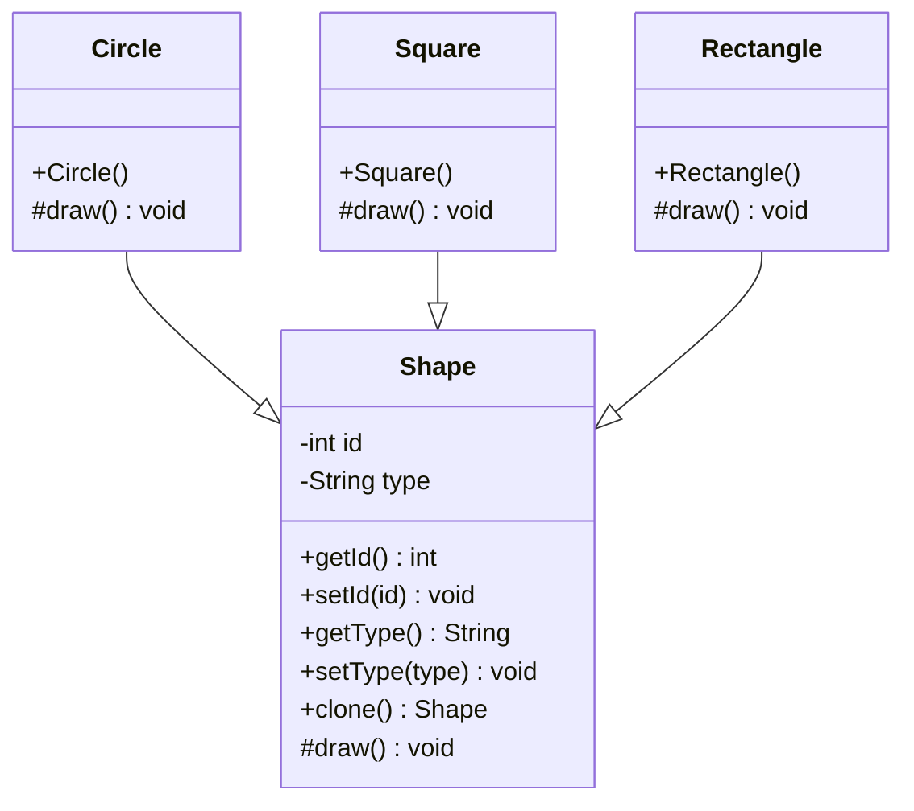
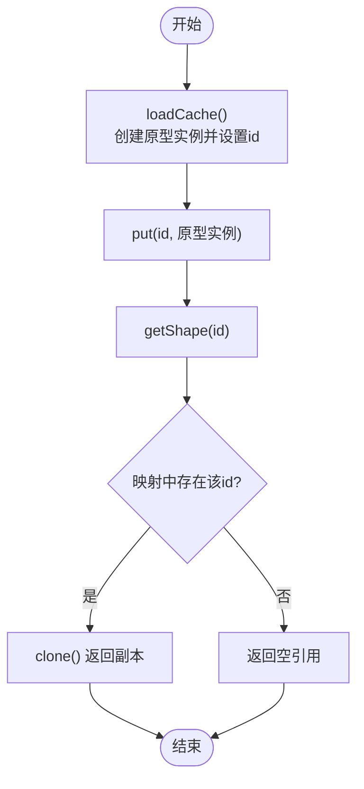
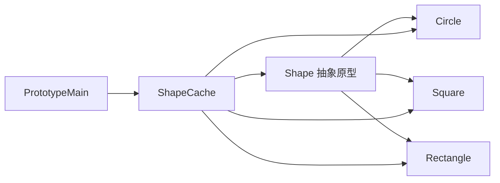
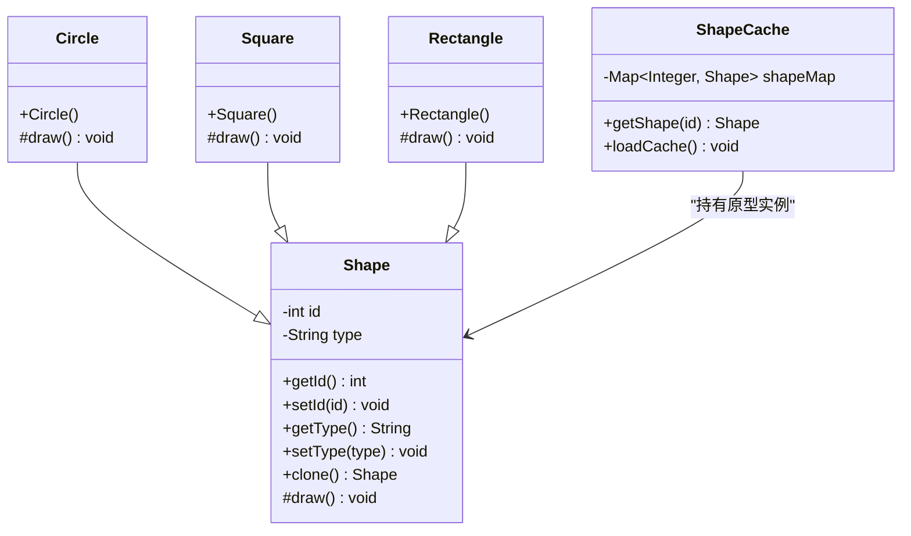

# 原型模式

<cite>
**本文引用的文件**
- [Shape.java](file://creational/prototype/src/main/java/com/future/rocket/gof23/prototype/Shape.java)
- [Circle.java](file://creational/prototype/src/main/java/com/future/rocket/gof23/prototype/impl/Circle.java)
- [Square.java](file://creational/prototype/src/main/java/com/future/rocket/gof23/prototype/impl/Square.java)
- [Rectangle.java](file://creational/prototype/src/main/java/com/future/rocket/gof23/prototype/impl/Rectangle.java)
- [ShapeCache.java](file://creational/prototype/src/main/java/com/future/rocket/gof23/prototype/build/ShapeCache.java)
- [PrototypeMain.java](file://creational/prototype/src/main/java/com/future/rocket/gof23/prototype/PrototypeMain.java)
- [readme.md](file://creational/prototype/readme.md)
</cite>

## 目录
1. [引言](#引言)
2. [项目结构](#项目结构)
3. [核心组件](#核心组件)
4. [架构总览](#架构总览)
5. [详细组件分析](#详细组件分析)
6. [依赖分析](#依赖分析)
7. [性能考量](#性能考量)
8. [故障排查指南](#故障排查指南)
9. [结论](#结论)
10. [附录](#附录)

## 引言
本文件系统性阐述原型模式的设计意图、核心概念与实现细节，结合仓库中的具体代码示例，深入解析抽象原型类、具体原型实现以及缓存机制，并对浅拷贝与深拷贝进行对比说明。同时给出适用场景、性能优化建议与内存管理策略，帮助读者在面对“对象创建成本较高”的情形时，能够正确选择并落地原型模式。

## 项目结构
原型模式示例位于“创建型模式”下的“prototype”模块中，采用分层组织：抽象原型类定义通用接口与克隆行为；具体原型实现各自绘制逻辑；缓存类负责原型注册与按需获取；入口类演示客户端使用流程。

图表来源
- [Shape.java:1-35](file://creational/prototype/src/main/java/com/future/rocket/gof23/prototype/Shape.java#L1-L35)
- [Circle.java:1-16](file://creational/prototype/src/main/java/com/future/rocket/gof23/prototype/impl/Circle.java#L1-L16)
- [Square.java:1-16](file://creational/prototype/src/main/java/com/future/rocket/gof23/prototype/impl/Square.java#L1-L16)
- [Rectangle.java:1-16](file://creational/prototype/src/main/java/com/future/rocket/gof23/prototype/impl/Rectangle.java#L1-L16)
- [ShapeCache.java:1-32](file://creational/prototype/src/main/java/com/future/rocket/gof23/prototype/build/ShapeCache.java#L1-L32)
- [PrototypeMain.java:1-22](file://creational/prototype/src/main/java/com/future/rocket/gof23/prototype/PrototypeMain.java#L1-L22)

章节来源
- [readme.md:1-8](file://creational/prototype/readme.md#L1-L8)

## 核心组件
- 抽象原型 Shape：定义公共属性（id、type），抽象绘制方法，提供标准克隆入口。
- 具体原型 Circle/Square/Rectangle：继承抽象原型，设置类型并实现绘制逻辑。
- 缓存注册表 ShapeCache：维护原型映射，提供加载与按 id 获取克隆对象的能力。
- 客户端入口 PrototypeMain：演示加载缓存与使用克隆对象的完整流程。

章节来源
- [Shape.java:1-35](file://creational/prototype/src/main/java/com/future/rocket/gof23/prototype/Shape.java#L1-L35)
- [Circle.java:1-16](file://creational/prototype/src/main/java/com/future/rocket/gof23/prototype/impl/Circle.java#L1-L16)
- [Square.java:1-16](file://creational/prototype/src/main/java/com/future/rocket/gof23/prototype/impl/Square.java#L1-L16)
- [Rectangle.java:1-16](file://creational/prototype/src/main/java/com/future/rocket/gof23/prototype/impl/Rectangle.java#L1-L16)
- [ShapeCache.java:1-32](file://creational/prototype/src/main/java/com/future/rocket/gof23/prototype/build/ShapeCache.java#L1-L32)
- [PrototypeMain.java:1-22](file://creational/prototype/src/main/java/com/future/rocket/gof23/prototype/PrototypeMain.java#L1-L22)

## 架构总览
原型模式通过“复制现有对象”替代“重新构造”，在需要大量相似对象且创建成本较高时尤为高效。该实现采用浅拷贝作为默认克隆策略，通过缓存注册表集中管理原型，客户端仅通过 id 获取即可获得独立副本。

图表来源
- [ShapeCache.java:20-30](file://creational/prototype/src/main/java/com/future/rocket/gof23/prototype/build/ShapeCache.java#L20-L30)
- [Shape.java:26-33](file://creational/prototype/src/main/java/com/future/rocket/gof23/prototype/Shape.java#L26-L33)
- [Circle.java:11-14](file://creational/prototype/src/main/java/com/future/rocket/gof23/prototype/impl/Circle.java#L11-L14)
- [Square.java:11-14](file://creational/prototype/src/main/java/com/future/rocket/gof23/prototype/impl/Square.java#L11-L14)
- [Rectangle.java:11-14](file://creational/prototype/src/main/java/com/future/rocket/gof23/prototype/impl/Rectangle.java#L11-L14)
- [PrototypeMain.java:7-19](file://creational/prototype/src/main/java/com/future/rocket/gof23/prototype/PrototypeMain.java#L7-L19)

## 详细组件分析

### 抽象原型类 Shape
- 设计要点
  - 继承 Cloneable 接口，提供统一的 clone() 方法，返回类型为 Shape，确保多态性。
  - 内部持有 id 与 type 等基础属性，便于区分不同原型实例。
  - 提供受保护的抽象 draw() 方法，具体子类实现各自的绘制逻辑。
- 克隆行为
  - 默认采用浅拷贝：复制当前对象的所有字段到新对象，若字段为引用类型，则新旧对象共享同一引用。
  - 若字段为基本类型或不可变对象（如字符串），则表现为值独立。
- 错误处理
  - 显式声明抛出异常的分支，保证在不支持克隆的情况下抛出断言错误，避免静默失败。

图表来源
- [Shape.java:1-35](file://creational/prototype/src/main/java/com/future/rocket/gof23/prototype/Shape.java#L1-L35)
- [Circle.java:1-16](file://creational/prototype/src/main/java/com/future/rocket/gof23/prototype/impl/Circle.java#L1-L16)
- [Square.java:1-16](file://creational/prototype/src/main/java/com/future/rocket/gof23/prototype/impl/Square.java#L1-L16)
- [Rectangle.java:1-16](file://creational/prototype/src/main/java/com/future/rocket/gof23/prototype/impl/Rectangle.java#L1-L16)

章节来源
- [Shape.java:1-35](file://creational/prototype/src/main/java/com/future/rocket/gof23/prototype/Shape.java#L1-L35)

### 具体原型实现
- Circle/Square/Rectangle
  - 各自构造函数设置类型标识，覆盖受保护的 draw() 方法，输出对应图形的绘制提示。
  - 由于继承自 Shape，天然具备 clone() 能力，可直接用于缓存与克隆。

章节来源
- [Circle.java:1-16](file://creational/prototype/src/main/java/com/future/rocket/gof23/prototype/impl/Circle.java#L1-L16)
- [Square.java:1-16](file://creational/prototype/src/main/java/com/future/rocket/gof23/prototype/impl/Square.java#L1-L16)
- [Rectangle.java:1-16](file://creational/prototype/src/main/java/com/future/rocket/gof23/prototype/impl/Rectangle.java#L1-L16)

### 缓存注册表 ShapeCache
- 注册表结构
  - 使用静态 HashMap 存储 id 到原型实例的映射，键为整数 id，值为 Shape 实例。
- 加载流程
  - loadCache() 中创建 Circle/Square/Rectangle 实例并设置唯一 id，随后放入映射。
- 获取流程
  - getShape(id) 从映射取出原型实例后调用 clone() 返回副本，确保客户端拿到独立对象。
- 并发与生命周期
  - 当前实现为静态字段，适合单例式缓存；若扩展为多线程环境，需考虑并发安全与缓存失效策略。

图表来源
- [ShapeCache.java:20-30](file://creational/prototype/src/main/java/com/future/rocket/gof23/prototype/build/ShapeCache.java#L20-L30)

章节来源
- [ShapeCache.java:1-32](file://creational/prototype/src/main/java/com/future/rocket/gof23/prototype/build/ShapeCache.java#L1-L32)

### 客户端使用方式
- 典型流程
  - 调用 ShapeCache.loadCache() 预热缓存。
  - 通过 ShapeCache.getShape(id) 获取指定原型的克隆副本。
  - 对副本调用 draw() 执行业务操作。
- 输出验证
  - 客户端打印各副本对象与调用绘制方法，验证克隆后的独立性与功能可用性。

章节来源
- [PrototypeMain.java:1-22](file://creational/prototype/src/main/java/com/future/rocket/gof23/prototype/PrototypeMain.java#L1-L22)

## 依赖分析
- 组件耦合
  - 具体原型仅依赖抽象原型 Shape，耦合度低，易于扩展新形状。
  - ShapeCache 依赖具体原型类以完成初始化，但对外仅暴露 getShape() 与 loadCache()，形成稳定的接口边界。
- 导入关系
  - ShapeCache 显式导入 Circle/Square/Rectangle 类以便初始化，体现了“注册表”职责。
- 可能的循环依赖
  - 当前结构无循环依赖，抽象与具体分离清晰。

图表来源
- [Shape.java:1-35](file://creational/prototype/src/main/java/com/future/rocket/gof23/prototype/Shape.java#L1-L35)
- [Circle.java:1-16](file://creational/prototype/src/main/java/com/future/rocket/gof23/prototype/impl/Circle.java#L1-L16)
- [Square.java:1-16](file://creational/prototype/src/main/java/com/future/rocket/gof23/prototype/impl/Square.java#L1-L16)
- [Rectangle.java:1-16](file://creational/prototype/src/main/java/com/future/rocket/gof23/prototype/impl/Rectangle.java#L1-L16)
- [ShapeCache.java:1-32](file://creational/prototype/src/main/java/com/future/rocket/gof23/prototype/build/ShapeCache.java#L1-L32)
- [PrototypeMain.java:1-22](file://creational/prototype/src/main/java/com/future/rocket/gof23/prototype/PrototypeMain.java#L1-L22)

## 性能考量
- 浅拷贝 vs 深拷贝
  - 浅拷贝：复制对象本身与所有字段，若字段为引用类型则共享同一引用。本实现默认采用浅拷贝，简单高效，适用于字段均为不可变或基本类型的场景。
  - 深拷贝：递归复制对象及其所有引用字段，确保完全独立。适用于字段包含可变对象的情形，但会带来额外的复制开销与复杂度。
- 何时使用原型模式
  - 当对象创建成本高（如昂贵的初始化、IO、网络请求等）时，优先考虑通过克隆已有实例的方式复用已有的昂贵状态。
  - 当需要批量生成相似对象且只需少量差异时，原型模式能显著减少重复初始化的开销。
- 内存管理策略
  - 缓存注册表应控制容量与生命周期，避免长期持有不再使用的原型导致内存泄漏。
  - 对包含可变引用字段的对象，若使用浅拷贝，需确保客户端不会无意间修改共享状态；必要时改为深拷贝或在 clone() 中显式复制引用对象。
  - 在多线程环境下，缓存访问需考虑同步或使用线程安全的数据结构。

## 故障排查指南
- 克隆失败
  - 症状：调用 clone() 抛出断言错误。
  - 原因：未实现 Cloneable 接口或在 clone() 中未正确处理异常。
  - 处理：确认类已实现 Cloneable，并在 clone() 中妥善处理异常分支。
- 获取不到原型
  - 症状：getShape(id) 返回空。
  - 原因：未先调用 loadCache() 初始化映射，或 id 不存在。
  - 处理：确保在使用前调用 loadCache()，并检查 id 是否正确。
- 绘制结果异常
  - 症状：多个副本共享了可变引用字段，导致绘制结果相互影响。
  - 原因：浅拷贝未复制引用对象。
  - 处理：在 clone() 中实现深拷贝，或在构造副本后重置相关字段，确保独立性。

章节来源
- [Shape.java:26-33](file://creational/prototype/src/main/java/com/future/rocket/gof23/prototype/Shape.java#L26-L33)
- [ShapeCache.java:15-18](file://creational/prototype/src/main/java/com/future/rocket/gof23/prototype/build/ShapeCache.java#L15-L18)

## 结论
原型模式通过“复制现有对象”实现高性能的对象创建，尤其适合对象初始化成本高、需要批量生成相似对象的场景。本实现以 Shape 为抽象原型，Circle/Square/Rectangle 为具体原型，配合 ShapeCache 的注册表与克隆机制，形成了简洁而实用的原型模式范式。在实际工程中，应根据字段是否包含可变引用选择浅拷贝或深拷贝，并结合缓存容量与生命周期策略进行性能与内存优化。

## 附录
- UML 类图（基于源码）

图表来源
- [Shape.java:1-35](file://creational/prototype/src/main/java/com/future/rocket/gof23/prototype/Shape.java#L1-L35)
- [Circle.java:1-16](file://creational/prototype/src/main/java/com/future/rocket/gof23/prototype/impl/Circle.java#L1-L16)
- [Square.java:1-16](file://creational/prototype/src/main/java/com/future/rocket/gof23/prototype/impl/Square.java#L1-L16)
- [Rectangle.java:1-16](file://creational/prototype/src/main/java/com/future/rocket/gof23/prototype/impl/Rectangle.java#L1-L16)
- [ShapeCache.java:1-32](file://creational/prototype/src/main/java/com/future/rocket/gof23/prototype/build/ShapeCache.java#L1-L32)