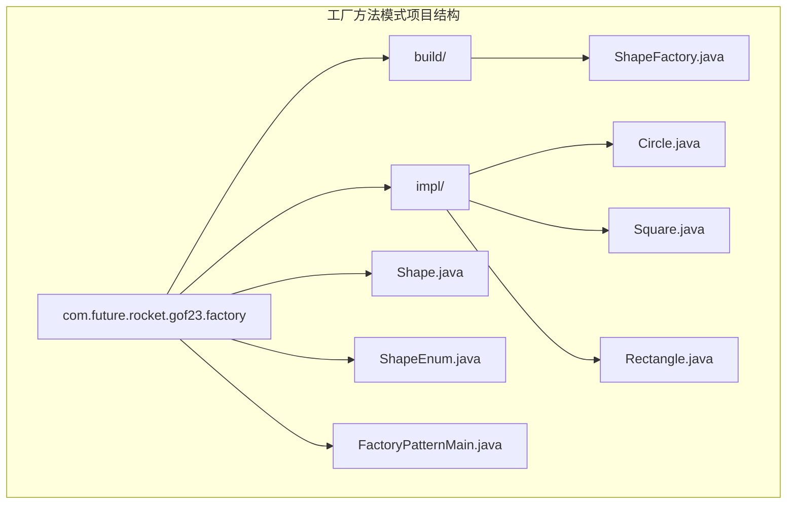
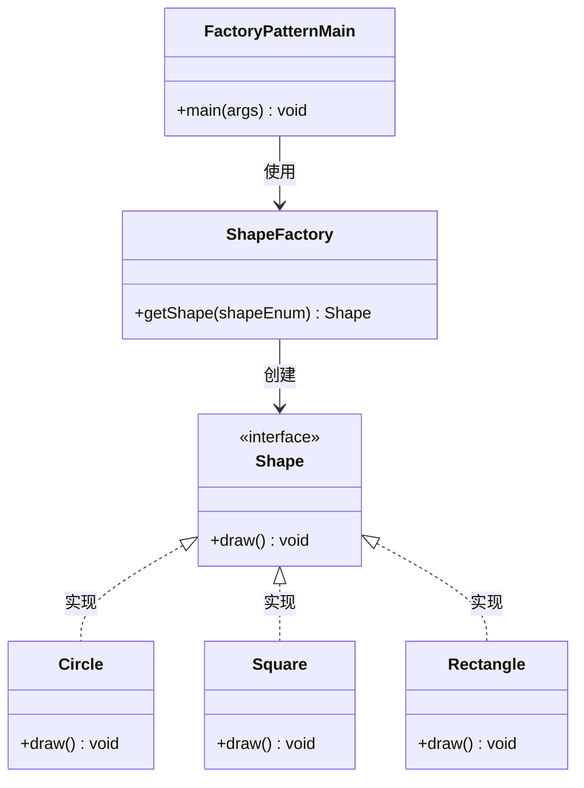
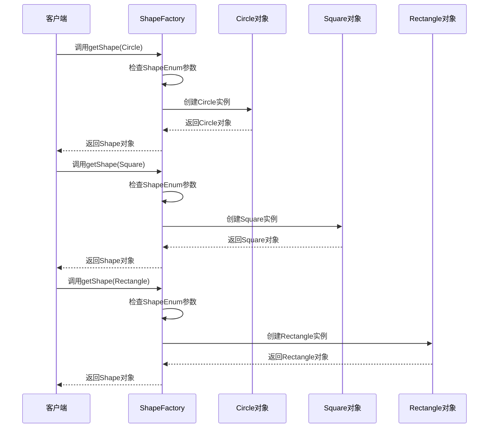
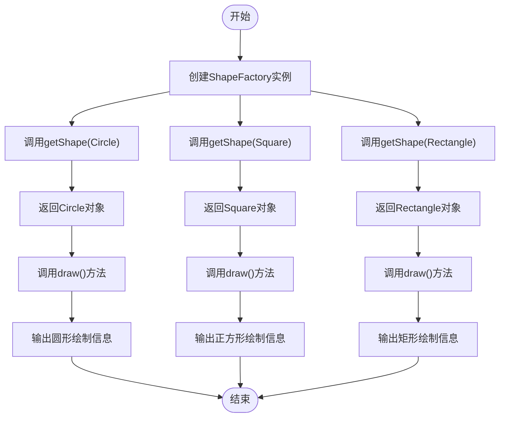
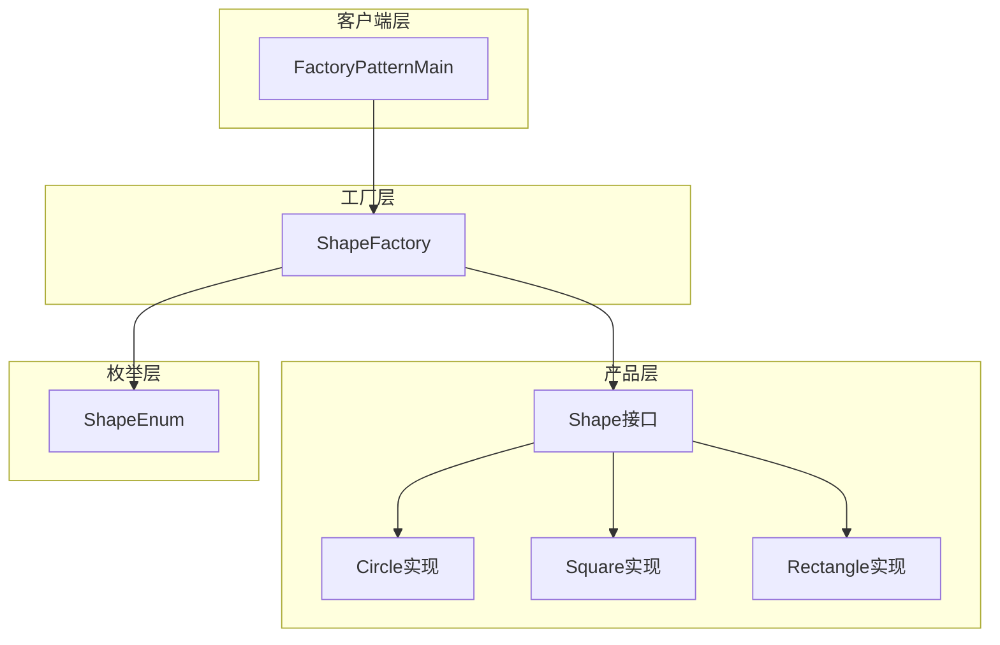

# 工厂方法模式

<cite>
**本文档引用的文件**
- [ShapeFactory.java](file://creational/factory/src/main/java/com/future/rocket/gof23/factory/build/ShapeFactory.java)
- [Shape.java](file://creational/factory/src/main/java/com/future/rocket/gof23/factory/Shape.java)
- [Circle.java](file://creational/factory/src/main/java/com/future/rocket/gof23/factory/impl/Circle.java)
- [Square.java](file://creational/factory/src/main/java/com/future/rocket/gof23/factory/impl/Square.java)
- [Rectangle.java](file://creational/factory/src/main/java/com/future/rocket/gof23/factory/impl/Rectangle.java)
- [ShapeEnum.java](file://creational/factory/src/main/java/com/future/rocket/gof23/factory/ShapeEnum.java)
- [FactoryPatternMain.java](file://creational/factory/src/main/java/com/future/rocket/gof23/factory/FactoryPatternMain.java)
- [AbstractFactory.java](file://creational/abstractfactory/src/main/java/com/future/rocket/gof23/abs/factory/build/AbstractFactory.java)
- [ShapeFactory.java](file://creational/abstractfactory/src/main/java/com/future/rocket/gof23/abs/factory/build/ShapeFactory.java)
- [Shape.java](file://creational/abstractfactory/src/main/java/com/future/rocket/gof23/abs/factory/Shape.java)
- [Circle.java](file://creational/abstractfactory/src/main/java/com/future/rocket/gof23/abs/factory/impl/Circle.java)
- [readme.md](file://creational/factory/readme.md)
- [readme.md](file://creational/abstractfactory/readme.md)
</cite>

## 目录
1. [引言](#引言)
2. [项目结构](#项目结构)
3. [核心组件](#核心组件)
4. [架构概览](#架构概览)
5. [详细组件分析](#详细组件分析)
6. [依赖关系分析](#依赖关系分析)
7. [性能考量](#性能考量)
8. [故障排除指南](#故障排除指南)
9. [结论](#结论)
10. [附录](#附录)

## 引言

工厂方法模式是GoF设计模式中的创建型模式之一，它提供了一种创建对象的最佳方式。在工厂方法模式中，当客户端需要创建对象时，不再直接使用new操作符，而是通过工厂类来创建对象。这种模式将对象的创建过程封装起来，使得客户端不需要了解具体的创建细节，只需要知道如何使用这些对象即可。

工厂方法模式的核心思想是定义一个用于创建对象的接口，让子类决定实例化哪一个类。工厂方法使一个类的实例化延迟到其子类。

## 项目结构

工厂方法模式的实现位于`creational/factory`目录下，采用标准的Java包结构组织代码：

**图表来源**
- [ShapeFactory.java:1-22](file://creational/factory/src/main/java/com/future/rocket/gof23/factory/build/ShapeFactory.java#L1-L22)
- [Shape.java:1-7](file://creational/factory/src/main/java/com/future/rocket/gof23/factory/Shape.java#L1-L7)
- [Circle.java:1-12](file://creational/factory/src/main/java/com/future/rocket/gof23/factory/impl/Circle.java#L1-L12)

**章节来源**
- [readme.md:1-5](file://creational/factory/readme.md#L1-L5)

## 核心组件

工厂方法模式由四个核心组件构成：

### 抽象产品接口（Shape）
抽象产品接口定义了所有具体产品必须实现的公共接口。在本实现中，Shape接口只包含一个draw()方法，用于描述图形的绘制行为。

### 具体产品实现
系统提供了三种具体的形状实现：
- **Circle**：圆形实现
- **Square**：正方形实现  
- **Rectangle**：矩形实现

每种具体产品都实现了Shape接口的draw()方法，提供各自独特的绘制逻辑。

### 工厂类（ShapeFactory）
工厂类负责根据传入的参数创建相应的具体产品对象。它包含一个工厂方法getShape()，该方法接收ShapeEnum枚举值作为参数，返回对应的Shape对象。

### 客户端代码（FactoryPatternMain）
客户端代码展示了如何使用工厂方法模式。它创建工厂实例，调用工厂方法获取不同类型的形状对象，并调用draw()方法执行绘制操作。

**章节来源**
- [Shape.java:1-7](file://creational/factory/src/main/java/com/future/rocket/gof23/factory/Shape.java#L1-L7)
- [Circle.java:1-12](file://creational/factory/src/main/java/com/future/rocket/gof23/factory/impl/Circle.java#L1-L12)
- [Square.java:1-11](file://creational/factory/src/main/java/com/future/rocket/gof23/factory/impl/Square.java#L1-L11)
- [Rectangle.java:1-11](file://creational/factory/src/main/java/com/future/rocket/gof23/factory/impl/Rectangle.java#L1-L11)
- [ShapeFactory.java:1-22](file://creational/factory/src/main/java/com/future/rocket/gof23/factory/build/ShapeFactory.java#L1-L22)
- [FactoryPatternMain.java:1-22](file://creational/factory/src/main/java/com/future/rocket/gof23/factory/FactoryPatternMain.java#L1-L22)

## 架构概览

工厂方法模式的架构体现了松耦合的设计原则：

**图表来源**
- [Shape.java:1-7](file://creational/factory/src/main/java/com/future/rocket/gof23/factory/Shape.java#L1-L7)
- [Circle.java:1-12](file://creational/factory/src/main/java/com/future/rocket/gof23/factory/impl/Circle.java#L1-L12)
- [Square.java:1-11](file://creational/factory/src/main/java/com/future/rocket/gof23/factory/impl/Square.java#L1-L11)
- [Rectangle.java:1-11](file://creational/factory/src/main/java/com/future/rocket/gof23/factory/impl/Rectangle.java#L1-L11)
- [ShapeFactory.java:1-22](file://creational/factory/src/main/java/com/future/rocket/gof23/factory/build/ShapeFactory.java#L1-L22)
- [FactoryPatternMain.java:1-22](file://creational/factory/src/main/java/com/future/rocket/gof23/factory/FactoryPatternMain.java#L1-L22)

## 详细组件分析

### 工厂方法实现机制

工厂方法的核心在于其创建逻辑的封装和延迟：

**图表来源**
- [ShapeFactory.java:11-20](file://creational/factory/src/main/java/com/future/rocket/gof23/factory/build/ShapeFactory.java#L11-L20)
- [FactoryPatternMain.java:12-19](file://creational/factory/src/main/java/com/future/rocket/gof23/factory/FactoryPatternMain.java#L12-L19)

工厂方法的实现机制体现了以下特点：

1. **参数驱动的对象创建**：通过ShapeEnum枚举值控制创建哪种具体产品
2. **条件判断逻辑**：使用if-else语句根据枚举值选择相应的构造函数
3. **多态性应用**：所有具体产品都实现相同的Shape接口，支持多态调用
4. **延迟绑定**：实际创建的具体类型在运行时确定

### 多态性应用分析

多态性是工厂方法模式的核心优势之一：

**图表来源**
- [ShapeFactory.java:11-20](file://creational/factory/src/main/java/com/future/rocket/gof23/factory/build/ShapeFactory.java#L11-L20)
- [Circle.java:8-10](file://creational/factory/src/main/java/com/future/rocket/gof23/factory/impl/Circle.java#L8-L10)
- [Square.java:7-9](file://creational/factory/src/main/java/com/future/rocket/gof23/factory/impl/Square.java#L7-L9)
- [Rectangle.java:7-9](file://creational/factory/src/main/java/com/future/rocket/gof23/factory/impl/Rectangle.java#L7-L9)

### 产品创建流程详解

每个具体产品的创建过程都遵循统一的模式：

1. **接口定义**：所有产品实现Shape接口
2. **实现方法**：每个产品提供自己的draw()实现
3. **工厂创建**：工厂方法根据参数返回相应的产品实例
4. **客户端使用**：客户端通过统一接口调用draw()方法

**章节来源**
- [ShapeFactory.java:11-20](file://creational/factory/src/main/java/com/future/rocket/gof23/factory/build/ShapeFactory.java#L11-L20)
- [Circle.java:5-11](file://creational/factory/src/main/java/com/future/rocket/gof23/factory/impl/Circle.java#L5-L11)
- [Square.java:5-10](file://creational/factory/src/main/java/com/future/rocket/gof23/factory/impl/Square.java#L5-L10)
- [Rectangle.java:5-10](file://creational/factory/src/main/java/com/future/rocket/gof23/factory/impl/Rectangle.java#L5-L10)

## 依赖关系分析

工厂方法模式的依赖关系体现了清晰的层次结构：

**图表来源**
- [FactoryPatternMain.java:1-22](file://creational/factory/src/main/java/com/future/rocket/gof23/factory/FactoryPatternMain.java#L1-L22)
- [ShapeFactory.java:1-22](file://creational/factory/src/main/java/com/future/rocket/gof23/factory/build/ShapeFactory.java#L1-L22)
- [Shape.java:1-7](file://creational/factory/src/main/java/com/future/rocket/gof23/factory/Shape.java#L1-L7)
- [Circle.java:1-12](file://creational/factory/src/main/java/com/future/rocket/gof23/factory/impl/Circle.java#L1-L12)
- [Square.java:1-11](file://creational/factory/src/main/java/com/future/rocket/gof23/factory/impl/Square.java#L1-L11)
- [Rectangle.java:1-11](file://creational/factory/src/main/java/com/future/rocket/gof23/factory/impl/Rectangle.java#L1-L11)
- [ShapeEnum.java:1-8](file://creational/factory/src/main/java/com/future/rocket/gof23/factory/ShapeEnum.java#L1-L8)

### 与抽象工厂模式的区别

为了更好地理解工厂方法模式，我们将其与抽象工厂模式进行对比分析：

| 特征 | 工厂方法模式 | 抽象工厂模式 |
|------|-------------|-------------|
| **设计意图** | 定义创建对象的接口，让子类决定实例化哪个类 | 为创建一组相关或相互依赖的对象提供一个接口 |
| **工厂数量** | 每个产品类型有一个工厂类 | 一个工厂类创建多个产品族 |
| **继承关系** | 工厂类继承抽象工厂类 | 工厂类实现抽象工厂接口 |
| **复杂度** | 简单，易于理解和维护 | 复杂，需要管理多个产品族 |
| **扩展性** | 易于添加新的产品类型 | 需要修改抽象工厂接口，扩展相对困难 |

**章节来源**
- [AbstractFactory.java:1-9](file://creational/abstractfactory/src/main/java/com/future/rocket/gof23/abs/factory/build/AbstractFactory.java#L1-L9)
- [ShapeFactory.java:1-22](file://creational/abstractfactory/src/main/java/com/future/rocket/gof23/abs/factory/build/ShapeFactory.java#L1-L22)

## 性能考量

工厂方法模式在性能方面具有以下特点：

### 优点
1. **运行时性能**：工厂方法调用开销小，主要是简单的条件判断
2. **内存效率**：避免了不必要的对象创建，按需创建
3. **类型安全**：编译时检查确保返回正确的对象类型
4. **缓存友好**：对象创建逻辑简单，易于优化

### 潜在问题
1. **条件分支膨胀**：随着产品种类增加，if-else语句会变得冗长
2. **重复代码**：每个产品都有相似的创建逻辑
3. **测试复杂性**：需要为每个产品类型编写测试用例

## 故障排除指南

### 常见问题及解决方案

#### 1. 空指针异常
**问题**：当传入不支持的ShapeEnum时，工厂方法可能返回null
**解决方案**：在工厂方法中添加默认分支，抛出IllegalArgumentException异常

#### 2. 类型转换错误
**问题**：客户端期望特定类型的对象但得到其他类型
**解决方案**：在工厂方法中添加类型检查，确保返回正确的对象类型

#### 3. 扩展困难
**问题**：添加新产品的过程中容易引入bug
**解决方案**：使用switch语句替代if-else，或采用映射表来管理产品创建

**章节来源**
- [ShapeFactory.java:11-20](file://creational/factory/src/main/java/com/future/rocket/gof23/factory/build/ShapeFactory.java#L11-L20)

## 结论

工厂方法模式作为一种经典的创建型设计模式，在GoF23设计模式中占据重要地位。通过将对象创建过程封装在工厂类中，它实现了客户端与具体产品类之间的解耦，提高了代码的可维护性和扩展性。

### 主要优势
1. **降低耦合度**：客户端不需要了解具体产品的创建细节
2. **提高可扩展性**：新增产品类型无需修改现有代码
3. **支持多态性**：通过统一接口处理不同的产品实例
4. **简化客户端代码**：客户端只需关心如何使用产品，而不关心如何创建

### 适用场景
- 当需要将对象创建与使用分离时
- 当系统需要支持多种产品类型时
- 当需要延迟对象创建时机时
- 当需要提供统一的创建接口时

### 设计权衡
虽然工厂方法模式提供了诸多优势，但在某些情况下可能不是最佳选择：
- 对于简单的对象创建，过度设计可能增加复杂度
- 当产品类型很少变化时，可能不需要引入工厂模式
- 对于大量相似对象的创建，可能需要考虑其他模式如原型模式

## 附录

### 实际应用案例

工厂方法模式在现实世界中有广泛的应用：

1. **数据库连接池**：不同数据库厂商提供不同的连接实现
2. **图形界面组件**：不同操作系统提供不同的UI组件实现
3. **日志记录器**：不同场景需要不同类型的日志处理器
4. **支付网关**：不同支付方式有不同的处理逻辑

### 扩展性分析

#### 添加新产品类型的步骤
1. 创建新的具体产品类，实现Shape接口
2. 在ShapeEnum中添加新的枚举值
3. 在工厂方法中添加相应的创建逻辑
4. 更新客户端代码以使用新的产品类型

#### 最佳实践建议
- 使用枚举类型替代字符串常量，提高类型安全性
- 考虑使用配置文件或反射机制动态加载产品类
- 为工厂方法添加适当的异常处理机制
- 考虑使用依赖注入框架管理工厂实例