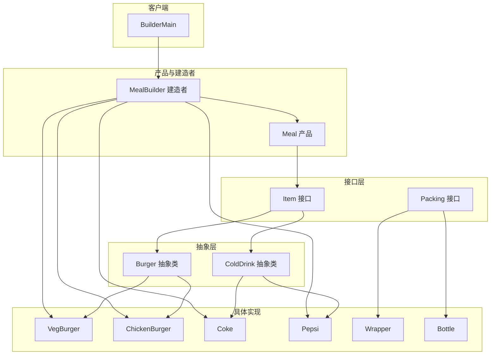
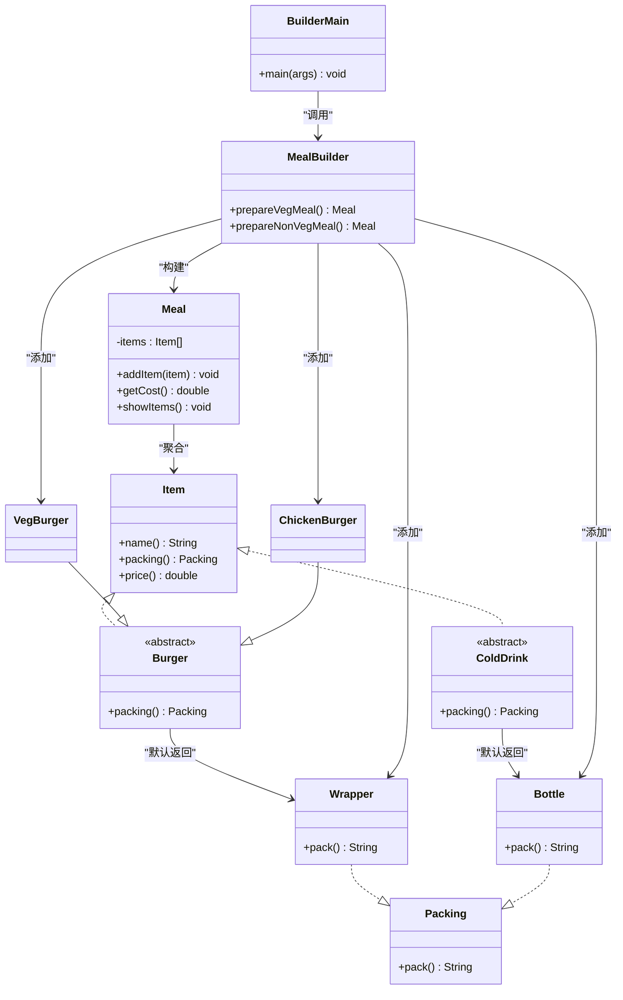
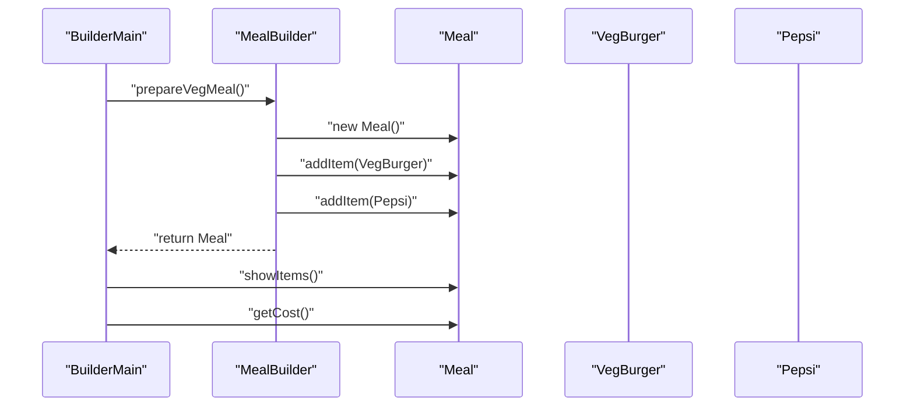
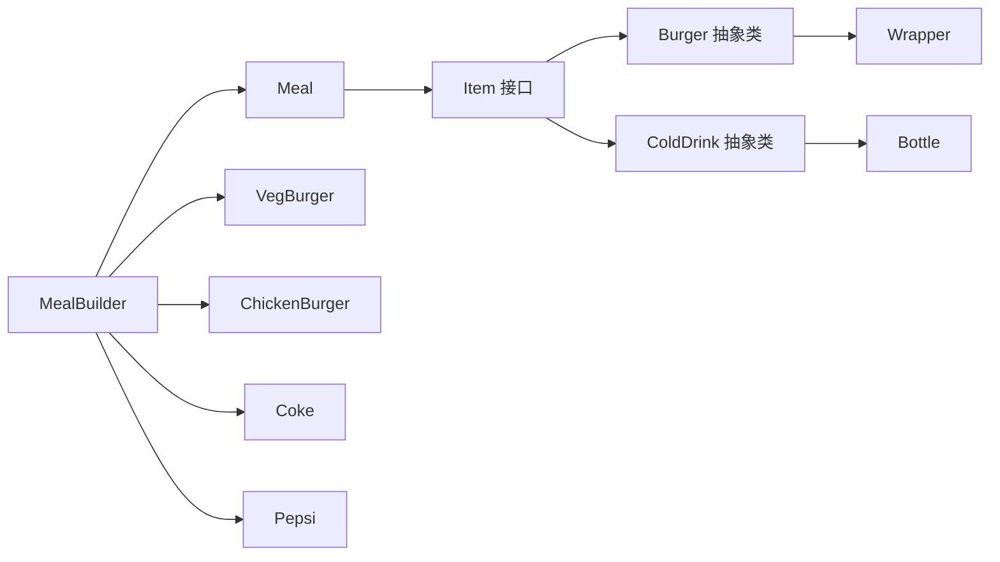

# 建造者模式

<cite>
**本文引用的文件**
- [Meal.java](file://creational/builder/src/main/java/com/future/rocket/gof23/builder/build/Meal.java)
- [MealBuilder.java](file://creational/builder/src/main/java/com/future/rocket/gof23/builder/build/MealBuilder.java)
- [Item.java](file://creational/builder/src/main/java/com/future/rocket/gof23/builder/iface/Item.java)
- [Packing.java](file://creational/builder/src/main/java/com/future/rocket/gof23/builder/iface/Packing.java)
- [Burger.java](file://creational/builder/src/main/java/com/future/rocket/gof23/builder/impl/Burger.java)
- [ColdDrink.java](file://creational/builder/src/main/java/com/future/rocket/gof23/builder/impl/ColdDrink.java)
- [Wrapper.java](file://creational/builder/src/main/java/com/future/rocket/gof23/builder/impl/Wrapper.java)
- [Bottle.java](file://creational/builder/src/main/java/com/future/rocket/gof23/builder/impl/Bottle.java)
- [VegBurger.java](file://creational/builder/src/main/java/com/future/rocket/gof23/builder/impl/VegBurger.java)
- [ChickenBurger.java](file://creational/builder/src/main/java/com/future/rocket/gof23/builder/impl/ChickenBurger.java)
- [Coke.java](file://creational/builder/src/main/java/com/future/rocket/gof23/builder/impl/Coke.java)
- [Pepsi.java](file://creational/builder/src/main/java/com/future/rocket/gof23/builder/impl/Pepsi.java)
- [BuilderMain.java](file://creational/builder/src/main/java/com/future/rocket/gof23/builder/BuilderMain.java)
- [readme.md](file://creational/builder/readme.md)
</cite>

## 目录
1. [引言](#引言)
2. [项目结构](#项目结构)
3. [核心组件](#核心组件)
4. [架构总览](#架构总览)
5. [详细组件分析](#详细组件分析)
6. [依赖分析](#依赖分析)
7. [性能考虑](#性能考虑)
8. [故障排查指南](#故障排查指南)
9. [结论](#结论)
10. [附录](#附录)

## 引言
本文件系统化阐述建造者模式在该仓库中的实现与应用，围绕“分步构建复杂对象”的设计意图展开，重点解析以下内容：
- 核心概念与UML类图映射
- MealBuilder建造者类、Meal产品类及具体组件（Burger、ColdDrink、包装类）的职责与协作
- 分步构建流程与Director角色的可选存在性
- 完整的代码实现分析：建造步骤定义、产品组装过程、客户端使用方式
- 与抽象工厂模式的区别与适用场景
- 实际应用案例、扩展性设计与性能优化建议

## 项目结构
该建造者模式示例位于“创建型模式”下的builder模块中，采用接口+抽象类+具体实现的层次化组织方式：
- 接口层：Item、Packing
- 抽象层：Burger、ColdDrink
- 具体实现层：VegBurger、ChickenBurger、Coke、Pepsi、Wrapper、Bottle
- 产品类：Meal
- 建造者类：MealBuilder
- 客户端入口：BuilderMain

图表来源
- [Meal.java:1-31](file://creational/builder/src/main/java/com/future/rocket/gof23/builder/build/Meal.java#L1-L31)
- [MealBuilder.java:1-25](file://creational/builder/src/main/java/com/future/rocket/gof23/builder/build/MealBuilder.java#L1-L25)
- [Item.java:1-8](file://creational/builder/src/main/java/com/future/rocket/gof23/builder/iface/Item.java#L1-L8)
- [Packing.java:1-6](file://creational/builder/src/main/java/com/future/rocket/gof23/builder/iface/Packing.java#L1-L6)
- [Burger.java:1-12](file://creational/builder/src/main/java/com/future/rocket/gof23/builder/impl/Burger.java#L1-L12)
- [ColdDrink.java:1-13](file://creational/builder/src/main/java/com/future/rocket/gof23/builder/impl/ColdDrink.java#L1-L13)
- [Wrapper.java:1-11](file://creational/builder/src/main/java/com/future/rocket/gof23/builder/impl/Wrapper.java#L1-L11)
- [Bottle.java:1-11](file://creational/builder/src/main/java/com/future/rocket/gof23/builder/impl/Bottle.java#L1-L11)
- [VegBurger.java:1-14](file://creational/builder/src/main/java/com/future/rocket/gof23/builder/impl/VegBurger.java#L1-L14)
- [ChickenBurger.java:1-14](file://creational/builder/src/main/java/com/future/rocket/gof23/builder/impl/ChickenBurger.java#L1-L14)
- [Coke.java:1-14](file://creational/builder/src/main/java/com/future/rocket/gof23/builder/impl/Coke.java#L1-L14)
- [Pepsi.java:1-14](file://creational/builder/src/main/java/com/future/rocket/gof23/builder/impl/Pepsi.java#L1-L14)
- [BuilderMain.java:1-25](file://creational/builder/src/main/java/com/future/rocket/gof23/builder/BuilderMain.java#L1-L25)

章节来源
- [readme.md:1-9](file://creational/builder/readme.md#L1-L9)

## 核心组件
- Item接口：统一声明产品项的名称、包装与价格等行为，作为所有具体商品的契约。
- Packing接口：统一声明包装策略，用于封装不同商品的包装类型。
- 抽象类Burger与ColdDrink：分别继承Item，提供默认包装策略（如Burger默认使用Wrapper，ColdDrink默认使用Bottle），体现“按类型约定默认装配”的思想。
- 具体实现：VegBurger、ChickenBurger、Coke、Pepsi覆盖名称与价格；Wrapper、Bottle实现Packing接口。
- 产品类Meal：聚合多个Item，提供添加、计价与展示能力。
- 建造者类MealBuilder：定义“套餐”级别的构建步骤（如准备素食套餐、非素食套餐），内部通过addItem逐步组装Meal。
- 客户端BuilderMain：演示如何通过MealBuilder获取不同套餐并打印明细与总价。

章节来源
- [Item.java:1-8](file://creational/builder/src/main/java/com/future/rocket/gof23/builder/iface/Item.java#L1-L8)
- [Packing.java:1-6](file://creational/builder/src/main/java/com/future/rocket/gof23/builder/iface/Packing.java#L1-L6)
- [Burger.java:1-12](file://creational/builder/src/main/java/com/future/rocket/gof23/builder/impl/Burger.java#L1-L12)
- [ColdDrink.java:1-13](file://creational/builder/src/main/java/com/future/rocket/gof23/builder/impl/ColdDrink.java#L1-L13)
- [Wrapper.java:1-11](file://creational/builder/src/main/java/com/future/rocket/gof23/builder/impl/Wrapper.java#L1-L11)
- [Bottle.java:1-11](file://creational/builder/src/main/java/com/future/rocket/gof23/builder/impl/Bottle.java#L1-L11)
- [VegBurger.java:1-14](file://creational/builder/src/main/java/com/future/rocket/gof23/builder/impl/VegBurger.java#L1-L14)
- [ChickenBurger.java:1-14](file://creational/builder/src/main/java/com/future/rocket/gof23/builder/impl/ChickenBurger.java#L1-L14)
- [Coke.java:1-14](file://creational/builder/src/main/java/com/future/rocket/gof23/builder/impl/Coke.java#L1-L14)
- [Pepsi.java:1-14](file://creational/builder/src/main/java/com/future/rocket/gof23/builder/impl/Pepsi.java#L1-L14)
- [Meal.java:1-31](file://creational/builder/src/main/java/com/future/rocket/gof23/builder/build/Meal.java#L1-L31)
- [MealBuilder.java:1-25](file://creational/builder/src/main/java/com/future/rocket/gof23/builder/build/MealBuilder.java#L1-L25)
- [BuilderMain.java:1-25](file://creational/builder/src/main/java/com/future/rocket/gof23/builder/BuilderMain.java#L1-L25)

## 架构总览
下图展示了建造者模式在本项目中的UML类图映射与交互关系，强调“分步构建、独立装配、最终产品”的核心思想。

图表来源
- [Item.java:1-8](file://creational/builder/src/main/java/com/future/rocket/gof23/builder/iface/Item.java#L1-L8)
- [Packing.java:1-6](file://creational/builder/src/main/java/com/future/rocket/gof23/builder/iface/Packing.java#L1-L6)
- [Burger.java:1-12](file://creational/builder/src/main/java/com/future/rocket/gof23/builder/impl/Burger.java#L1-L12)
- [ColdDrink.java:1-13](file://creational/builder/src/main/java/com/future/rocket/gof23/builder/impl/ColdDrink.java#L1-L13)
- [Wrapper.java:1-11](file://creational/builder/src/main/java/com/future/rocket/gof23/builder/impl/Wrapper.java#L1-L11)
- [Bottle.java:1-11](file://creational/builder/src/main/java/com/future/rocket/gof23/builder/impl/Bottle.java#L1-L11)
- [VegBurger.java:1-14](file://creational/builder/src/main/java/com/future/rocket/gof23/builder/impl/VegBurger.java#L1-L14)
- [ChickenBurger.java:1-14](file://creational/builder/src/main/java/com/future/rocket/gof23/builder/impl/ChickenBurger.java#L1-L14)
- [Meal.java:1-31](file://creational/builder/src/main/java/com/future/rocket/gof23/builder/build/Meal.java#L1-L31)
- [MealBuilder.java:1-25](file://creational/builder/src/main/java/com/future/rocket/gof23/builder/build/MealBuilder.java#L1-L25)
- [BuilderMain.java:1-25](file://creational/builder/src/main/java/com/future/rocket/gof23/builder/BuilderMain.java#L1-L25)

## 详细组件分析

### MealBuilder 建造者类
- 职责：定义“套餐”的构建步骤，封装复杂组合逻辑，屏蔽底层组件细节。
- 关键方法：
  - prepareVegMeal：构建一个素食套餐，包含素食汉堡与一种冷饮（如Pepsi）。
  - prepareNonVegMeal：构建一个非素食套餐，包含鸡肉汉堡与一种可乐（如Coke）。
- 设计要点：通过addItem逐步向Meal添加Item，最终返回完整产品；与具体Item实现解耦，便于扩展新套餐或新组件。

章节来源
- [MealBuilder.java:1-25](file://creational/builder/src/main/java/com/future/rocket/gof23/builder/build/MealBuilder.java#L1-L25)

### Meal 产品类
- 职责：聚合多个Item，提供统一的展示与计价能力。
- 关键方法：
  - addItem：将具体Item加入产品集合。
  - getCost：基于Item.price累加得到总价。
  - showItems：遍历并打印每个Item的名称、包装与价格。
- 设计要点：产品类本身不关心构建步骤，仅负责承载与呈现；与Item接口解耦，支持任意Item组合。

章节来源
- [Meal.java:1-31](file://creational/builder/src/main/java/com/future/rocket/gof23/builder/build/Meal.java#L1-L31)

### 抽象组件与具体组件
- 抽象类Burger与ColdDrink：
  - 统一实现Item接口，并在packing()中返回各自默认包装（Wrapper、Bottle），体现“按类型约定默认装配”。
- 具体实现：
  - VegBurger、ChickenBurger：覆盖name与price，体现不同汉堡的差异化特征。
  - Coke、Pepsi：覆盖name与price，体现不同冷饮的差异化特征。
  - Wrapper、Bottle：实现Packing接口，提供包装描述字符串。
- 设计要点：通过抽象类与接口分离“通用行为”和“差异化行为”，提升可扩展性与可维护性。

章节来源
- [Burger.java:1-12](file://creational/builder/src/main/java/com/future/rocket/gof23/builder/impl/Burger.java#L1-L12)
- [ColdDrink.java:1-13](file://creational/builder/src/main/java/com/future/rocket/gof23/builder/impl/ColdDrink.java#L1-L13)
- [VegBurger.java:1-14](file://creational/builder/src/main/java/com/future/rocket/gof23/builder/impl/VegBurger.java#L1-L14)
- [ChickenBurger.java:1-14](file://creational/builder/src/main/java/com/future/rocket/gof23/builder/impl/ChickenBurger.java#L1-L14)
- [Coke.java:1-14](file://creational/builder/src/main/java/com/future/rocket/gof23/builder/impl/Coke.java#L1-L14)
- [Pepsi.java:1-14](file://creational/builder/src/main/java/com/future/rocket/gof23/builder/impl/Pepsi.java#L1-L14)
- [Wrapper.java:1-11](file://creational/builder/src/main/java/com/future/rocket/gof23/builder/impl/Wrapper.java#L1-L11)
- [Bottle.java:1-11](file://creational/builder/src/main/java/com/future/rocket/gof23/builder/impl/Bottle.java#L1-L11)

### 分步构建流程与Director角色
- 分步构建流程（以prepareVegMeal为例）：
  1) 创建Meal实例
  2) 添加VegBurger到Meal
  3) 添加Pepsi到Meal
  4) 返回完成的Meal
- Director角色：在本示例中，BuilderMain直接调用MealBuilder的方法，未显式定义Director类。若需要引入Director，可将其作为“指导者”，负责控制构建顺序与条件分支，使客户端仅需关注高层流程，不关心具体构建细节。

图表来源
- [BuilderMain.java:1-25](file://creational/builder/src/main/java/com/future/rocket/gof23/builder/BuilderMain.java#L1-L25)
- [MealBuilder.java:1-25](file://creational/builder/src/main/java/com/future/rocket/gof23/builder/build/MealBuilder.java#L1-L25)
- [Meal.java:1-31](file://creational/builder/src/main/java/com/future/rocket/gof23/builder/build/Meal.java#L1-L31)
- [VegBurger.java:1-14](file://creational/builder/src/main/java/com/future/rocket/gof23/builder/impl/VegBurger.java#L1-L14)
- [Pepsi.java:1-14](file://creational/builder/src/main/java/com/future/rocket/gof23/builder/impl/Pepsi.java#L1-L14)

### 客户端使用方式
- 客户端通过创建MealBuilder实例，调用预定义的套餐构建方法，获得Meal后进行展示与计价。
- 示例流程：
  1) 实例化MealBuilder
  2) 调用prepareVegMeal或prepareNonVegMeal
  3) 调用showItems与getCost输出结果
- 优点：客户端无需了解Item的具体实现，只需按“套餐”维度进行消费。

章节来源
- [BuilderMain.java:1-25](file://creational/builder/src/main/java/com/future/rocket/gof23/builder/BuilderMain.java#L1-L25)

## 依赖分析
- 松耦合设计：
  - MealBuilder对具体Item实现无直接依赖，仅依赖Item接口与Packing接口，便于替换与扩展。
  - Burger与ColdDrink通过默认包装策略与Packing接口解耦，新增包装类型不影响现有Item。
- 可能的循环依赖：
  - 当前实现未见循环依赖；若未来扩展中出现相互引用，应通过接口隔离与依赖注入避免。
- 外部依赖：
  - 本示例为纯Java实现，无外部框架依赖，便于移植与测试。

图表来源
- [MealBuilder.java:1-25](file://creational/builder/src/main/java/com/future/rocket/gof23/builder/build/MealBuilder.java#L1-L25)
- [Meal.java:1-31](file://creational/builder/src/main/java/com/future/rocket/gof23/builder/build/Meal.java#L1-L31)
- [Burger.java:1-12](file://creational/builder/src/main/java/com/future/rocket/gof23/builder/impl/Burger.java#L1-L12)
- [ColdDrink.java:1-13](file://creational/builder/src/main/java/com/future/rocket/gof23/builder/impl/ColdDrink.java#L1-L13)
- [Wrapper.java:1-11](file://creational/builder/src/main/java/com/future/rocket/gof23/builder/impl/Wrapper.java#L1-L11)
- [Bottle.java:1-11](file://creational/builder/src/main/java/com/future/rocket/gof23/builder/impl/Bottle.java#L1-L11)
- [VegBurger.java:1-14](file://creational/builder/src/main/java/com/future/rocket/gof23/builder/impl/VegBurger.java#L1-L14)
- [ChickenBurger.java:1-14](file://creational/builder/src/main/java/com/future/rocket/gof23/builder/impl/ChickenBurger.java#L1-L14)
- [Coke.java:1-14](file://creational/builder/src/main/java/com/future/rocket/gof23/builder/impl/Coke.java#L1-L14)
- [Pepsi.java:1-14](file://creational/builder/src/main/java/com/future/rocket/gof23/builder/impl/Pepsi.java#L1-L14)

## 性能考虑
- 时间复杂度：
  - addItem与showItems均为O(n)，n为Meal中Item数量；getCost为O(n)。
- 空间复杂度：
  - Meal持有List<Item>，空间开销与Item数量线性相关。
- 优化建议：
  - 若Item数量较大且频繁遍历，可考虑缓存getCost结果或延迟计算。
  - 包装策略简单，性能开销可忽略；如需扩展更多包装类型，保持Packing接口轻量，避免复杂逻辑。
  - 在Builder中批量添加时，可考虑一次性传入集合以减少多次addItem的调用成本（需权衡内存与可读性）。

## 故障排查指南
- 常见问题与定位：
  - 无法显示Item详情：检查Item实现是否正确覆盖name与price；确认showItems遍历逻辑。
  - 价格异常：核对Item.price实现与getCost累加逻辑；确保没有重复添加或遗漏。
  - 包装信息错误：确认Burger默认使用Wrapper、ColdDrink默认使用Bottle；自定义Item需正确返回对应Packing。
- 调试建议：
  - 在Builder中打印中间状态（如添加的Item名称），验证构建顺序。
  - 使用单元测试覆盖不同套餐组合，确保showItems与getCost一致性。

章节来源
- [Meal.java:1-31](file://creational/builder/src/main/java/com/future/rocket/gof23/builder/build/Meal.java#L1-L31)
- [Burger.java:1-12](file://creational/builder/src/main/java/com/future/rocket/gof23/builder/impl/Burger.java#L1-L12)
- [ColdDrink.java:1-13](file://creational/builder/src/main/java/com/future/rocket/gof23/builder/impl/ColdDrink.java#L1-L13)

## 结论
本示例以简洁清晰的方式实现了建造者模式：通过MealBuilder封装复杂构建步骤，Meal作为最终产品承载多个Item，Burger与ColdDrink提供默认包装策略，Item与Packing接口保证了扩展性与可维护性。该模式适用于“分步构建复杂对象”的场景，尤其当对象由多个部件组成且构建顺序或条件较为复杂时。若需要更强的流程控制与复用，可引入Director角色以进一步解耦客户端与构建细节。

## 附录

### 与抽象工厂模式的区别与选择
- 抽象工厂：面向“产品族”的创建，一次调用返回一组相关或相互依赖的对象；强调“产品族”而非“构建步骤”。
- 建造者：面向“复杂对象”的分步构建，强调“步骤顺序与装配过程”；适合需要控制构建流程与参数组合的场景。
- 选择建议：
  - 需要“按步骤组装复杂对象”且对象由多个部件构成：优先建造者。
  - 需要“同时创建一组相关产品”且产品之间存在强耦合关系：优先抽象工厂。

### 实际应用案例
- 餐厅套餐构建：类似本示例，通过MealBuilder定义“套餐模板”，支持多种组合。
- 订单生成：订单由商品、优惠、配送信息等多部分组成，可用建造者按步骤装配。
- 配置对象：如数据库连接池配置、Web服务配置等，可通过建造者逐步设置参数。

### 扩展性设计
- 新增Item：实现Item接口并覆盖name与price；如需自定义包装，实现Packing接口并在抽象类中重写packing()。
- 新增套餐：在MealBuilder中新增方法，按需组合现有Item。
- 新增包装策略：实现Packing接口并替换抽象类中的默认返回值，或在具体Item中覆盖packing()。