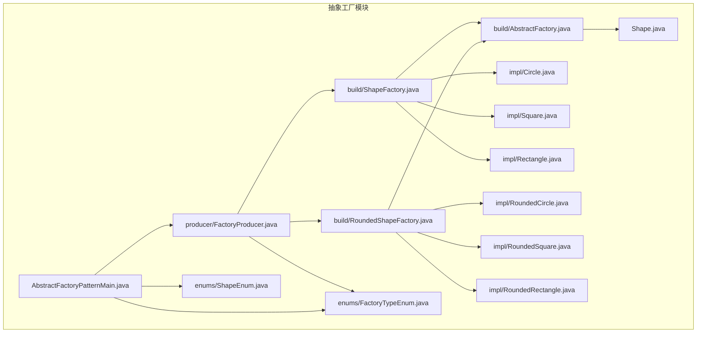
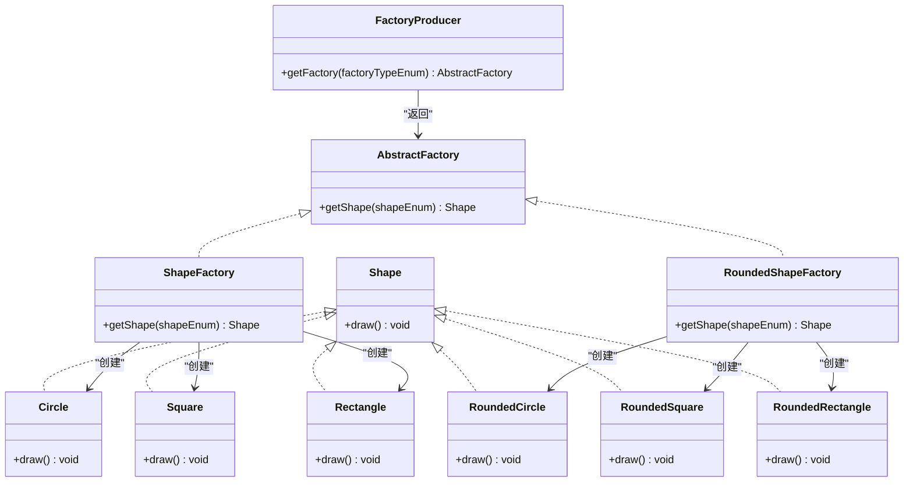
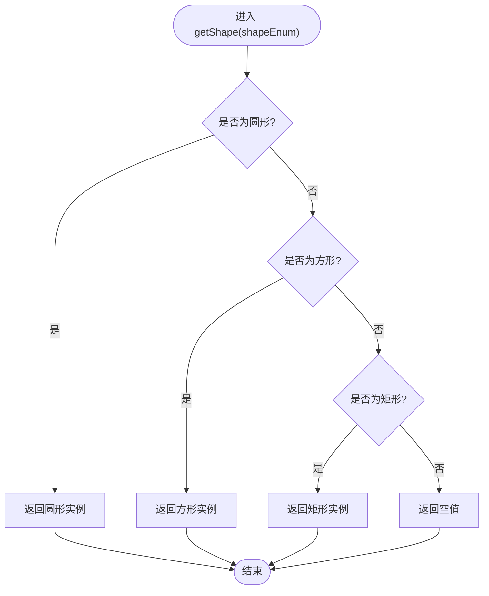
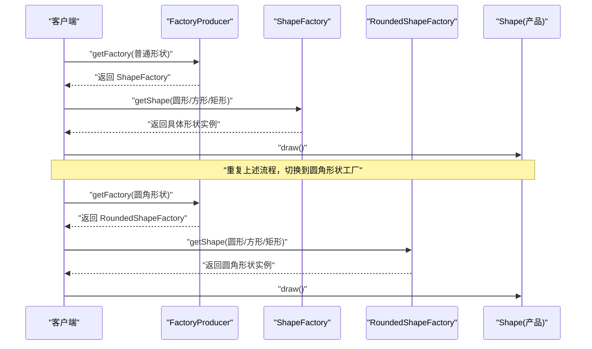
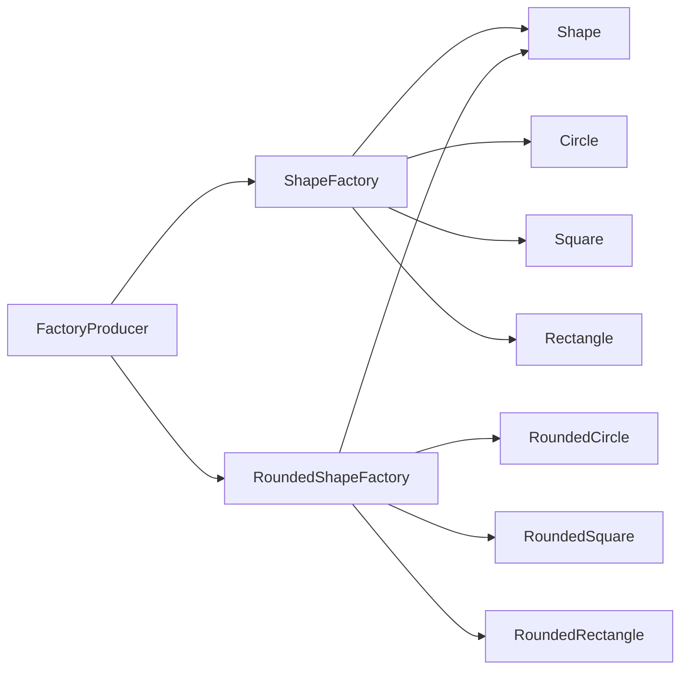

# 抽象工厂模式

<cite>
**本文引用的文件**
- [AbstractFactory.java](file://creational/abstractfactory/src/main/java/com/future/rocket/gof23/abs/factory/build/AbstractFactory.java)
- [ShapeFactory.java](file://creational/abstractfactory/src/main/java/com/future/rocket/gof23/abs/factory/build/ShapeFactory.java)
- [RoundedShapeFactory.java](file://creational/abstractfactory/src/main/java/com/future/rocket/gof23/abs/factory/build/RoundedShapeFactory.java)
- [Shape.java](file://creational/abstractfactory/src/main/java/com/future/rocket/gof23/abs/factory/Shape.java)
- [FactoryProducer.java](file://creational/abstractfactory/src/main/java/com/future/rocket/gof23/abs/factory/producer/FactoryProducer.java)
- [FactoryTypeEnum.java](file://creational/abstractfactory/src/main/java/com/future/rocket/gof23/abs/factory/enums/FactoryTypeEnum.java)
- [ShapeEnum.java](file://creational/abstractfactory/src/main/java/com/future/rocket/gof23/abs/factory/enums/ShapeEnum.java)
- [Circle.java](file://creational/abstractfactory/src/main/java/com/future/rocket/gof23/abs/factory/impl/Circle.java)
- [Square.java](file://creational/abstractfactory/src/main/java/com/future/rocket/gof23/abs/factory/impl/Square.java)
- [Rectangle.java](file://creational/abstractfactory/src/main/java/com/future/rocket/gof23/abs/factory/impl/Rectangle.java)
- [RoundedCircle.java](file://creational/abstractfactory/src/main/java/com/future/rocket/gof23/abs/factory/impl/RoundedCircle.java)
- [RoundedSquare.java](file://creational/abstractfactory/src/main/java/com/future/rocket/gof23/abs/factory/impl/RoundedSquare.java)
- [RoundedRectangle.java](file://creational/abstractfactory/src/main/java/com/future/rocket/gof23/abs/factory/impl/RoundedRectangle.java)
- [AbstractFactoryPatternMain.java](file://creational/abstractfactory/src/main/java/com/future/rocket/gof23/abs/factory/AbstractFactoryPatternMain.java)
- [readme.md](file://creational/abstractfactory/readme.md)
</cite>

## 目录
1. [引言](#引言)
2. [项目结构](#项目结构)
3. [核心组件](#核心组件)
4. [架构总览](#架构总览)
5. [详细组件分析](#详细组件分析)
6. [依赖分析](#依赖分析)
7. [性能考虑](#性能考虑)
8. [故障排查指南](#故障排查指南)
9. [结论](#结论)
10. [附录](#附录)

## 引言
本篇文档围绕抽象工厂（Abstract Factory）模式展开，系统阐述其核心概念、设计意图与UML类图，并结合仓库中的具体实现进行逐层解析。我们将重点分析抽象工厂接口、具体工厂实现（普通形状工厂与圆角形状工厂）、产品层次结构（Shape及其具体实现），以及工厂生产者（FactoryProducer）与工厂类型枚举（FactoryTypeEnum）的设计。同时给出客户端调用流程、与工厂方法模式的区别、适用场景、优缺点与最佳实践。

## 项目结构
该模块位于“创建型模式”下的抽象工厂目录中，采用按功能分层组织：构建层（build）存放抽象工厂与具体工厂；产品接口与实现位于独立包；枚举用于约束工厂与产品类型；生产者负责根据类型返回对应工厂；主程序演示客户端调用流程。

图表来源
- [AbstractFactory.java:1-9](file://creational/abstractfactory/src/main/java/com/future/rocket/gof23/abs/factory/build/AbstractFactory.java#L1-L9)
- [ShapeFactory.java:1-22](file://creational/abstractfactory/src/main/java/com/future/rocket/gof23/abs/factory/build/ShapeFactory.java#L1-L22)
- [RoundedShapeFactory.java:1-22](file://creational/abstractfactory/src/main/java/com/future/rocket/gof23/abs/factory/build/RoundedShapeFactory.java#L1-L22)
- [Shape.java:1-7](file://creational/abstractfactory/src/main/java/com/future/rocket/gof23/abs/factory/Shape.java#L1-L7)
- [FactoryProducer.java:1-19](file://creational/abstractfactory/src/main/java/com/future/rocket/gof23/abs/factory/producer/FactoryProducer.java#L1-L19)
- [FactoryTypeEnum.java:1-7](file://creational/abstractfactory/src/main/java/com/future/rocket/gof23/abs/factory/enums/FactoryTypeEnum.java#L1-L7)
- [ShapeEnum.java:1-8](file://creational/abstractfactory/src/main/java/com/future/rocket/gof23/abs/factory/enums/ShapeEnum.java#L1-L8)
- [Circle.java:1-13](file://creational/abstractfactory/src/main/java/com/future/rocket/gof23/abs/factory/impl/Circle.java#L1-L13)
- [Square.java:1-12](file://creational/abstractfactory/src/main/java/com/future/rocket/gof23/abs/factory/impl/Square.java#L1-L12)
- [Rectangle.java:1-11](file://creational/abstractfactory/src/main/java/com/future/rocket/gof23/abs/factory/impl/Rectangle.java#L1-L11)
- [RoundedCircle.java:1-13](file://creational/abstractfactory/src/main/java/com/future/rocket/gof23/abs/factory/impl/RoundedCircle.java#L1-L13)
- [RoundedSquare.java:1-12](file://creational/abstractfactory/src/main/java/com/future/rocket/gof23/abs/factory/impl/RoundedSquare.java#L1-L12)
- [RoundedRectangle.java:1-11](file://creational/abstractfactory/src/main/java/com/future/rocket/gof23/abs/factory/impl/RoundedRectangle.java#L1-L11)
- [AbstractFactoryPatternMain.java:1-34](file://creational/abstractfactory/src/main/java/com/future/rocket/gof23/abs/factory/AbstractFactoryPatternMain.java#L1-L34)

章节来源
- [readme.md:1-10](file://creational/abstractfactory/readme.md#L1-L10)

## 核心组件
- 抽象工厂接口：定义统一的产品族创建入口，屏蔽具体工厂差异。
- 具体工厂：分别为普通形状工厂与圆角形状工厂，分别生产不同风格的形状产品。
- 产品接口与实现：统一的绘制行为接口与多种具体形状实现。
- 工厂生产者：根据工厂类型枚举返回对应的工厂实例。
- 枚举：限定工厂类型与产品类型，提升类型安全与可扩展性。
- 客户端：通过工厂生产者获取工厂，再由工厂创建产品并使用。

章节来源
- [AbstractFactory.java:1-9](file://creational/abstractfactory/src/main/java/com/future/rocket/gof23/abs/factory/build/AbstractFactory.java#L1-L9)
- [ShapeFactory.java:1-22](file://creational/abstractfactory/src/main/java/com/future/rocket/gof23/abs/factory/build/ShapeFactory.java#L1-L22)
- [RoundedShapeFactory.java:1-22](file://creational/abstractfactory/src/main/java/com/future/rocket/gof23/abs/factory/build/RoundedShapeFactory.java#L1-L22)
- [Shape.java:1-7](file://creational/abstractfactory/src/main/java/com/future/rocket/gof23/abs/factory/Shape.java#L1-L7)
- [FactoryProducer.java:1-19](file://creational/abstractfactory/src/main/java/com/future/rocket/gof23/abs/factory/producer/FactoryProducer.java#L1-L19)
- [FactoryTypeEnum.java:1-7](file://creational/abstractfactory/src/main/java/com/future/rocket/gof23/abs/factory/enums/FactoryTypeEnum.java#L1-L7)
- [ShapeEnum.java:1-8](file://creational/abstractfactory/src/main/java/com/future/rocket/gof23/abs/factory/enums/ShapeEnum.java#L1-L8)
- [AbstractFactoryPatternMain.java:1-34](file://creational/abstractfactory/src/main/java/com/future/rocket/gof23/abs/factory/AbstractFactoryPatternMain.java#L1-L34)

## 架构总览
抽象工厂模式通过“超级工厂”（工厂生产者）选择并返回一个具体的工厂，再由该工厂创建同一产品族内的多个产品。在本实现中，工厂生产者依据工厂类型枚举返回普通形状工厂或圆角形状工厂；每个工厂依据产品类型枚举创建对应的具体形状对象。

图表来源
- [AbstractFactory.java:1-9](file://creational/abstractfactory/src/main/java/com/future/rocket/gof23/abs/factory/build/AbstractFactory.java#L1-L9)
- [ShapeFactory.java:1-22](file://creational/abstractfactory/src/main/java/com/future/rocket/gof23/abs/factory/build/ShapeFactory.java#L1-L22)
- [RoundedShapeFactory.java:1-22](file://creational/abstractfactory/src/main/java/com/future/rocket/gof23/abs/factory/build/RoundedShapeFactory.java#L1-L22)
- [Shape.java:1-7](file://creational/abstractfactory/src/main/java/com/future/rocket/gof23/abs/factory/Shape.java#L1-L7)
- [Circle.java:1-13](file://creational/abstractfactory/src/main/java/com/future/rocket/gof23/abs/factory/impl/Circle.java#L1-L13)
- [Square.java:1-12](file://creational/abstractfactory/src/main/java/com/future/rocket/gof23/abs/factory/impl/Square.java#L1-L12)
- [Rectangle.java:1-11](file://creational/abstractfactory/src/main/java/com/future/rocket/gof23/abs/factory/impl/Rectangle.java#L1-L11)
- [RoundedCircle.java:1-13](file://creational/abstractfactory/src/main/java/com/future/rocket/gof23/abs/factory/impl/RoundedCircle.java#L1-L13)
- [RoundedSquare.java:1-12](file://creational/abstractfactory/src/main/java/com/future/rocket/gof23/abs/factory/impl/RoundedSquare.java#L1-L12)
- [RoundedRectangle.java:1-11](file://creational/abstractfactory/src/main/java/com/future/rocket/gof23/abs/factory/impl/RoundedRectangle.java#L1-L11)
- [FactoryProducer.java:1-19](file://creational/abstractfactory/src/main/java/com/future/rocket/gof23/abs/factory/producer/FactoryProducer.java#L1-L19)

## 详细组件分析

### 抽象工厂接口（AbstractFactory）
- 角色与职责：定义创建产品族的统一接口，屏蔽具体工厂差异。
- 关键点：返回类型为产品接口，确保客户端只面向接口编程。
- 复杂度：O(1)，仅一次方法调用。
- 错误处理：若传入未知产品类型，返回空值，需在客户端侧做好判空处理。

章节来源
- [AbstractFactory.java:1-9](file://creational/abstractfactory/src/main/java/com/future/rocket/gof23/abs/factory/build/AbstractFactory.java#L1-L9)

### 具体工厂实现
- 普通形状工厂（ShapeFactory）
  - 职责：根据产品类型枚举创建普通圆形、方形与矩形。
  - 设计要点：内部使用分支逻辑匹配产品类型，清晰直观。
  - 扩展性：新增产品时需修改分支逻辑，违反开闭原则，但可通过策略或注册表优化。
- 圆角形状工厂（RoundedShapeFactory）
  - 职责：根据产品类型枚举创建圆角圆形、圆角方形与圆角矩形。
  - 设计要点：与普通工厂一一对应，形成完整的产品族。

图表来源
- [ShapeFactory.java:1-22](file://creational/abstractfactory/src/main/java/com/future/rocket/gof23/abs/factory/build/ShapeFactory.java#L1-L22)
- [RoundedShapeFactory.java:1-22](file://creational/abstractfactory/src/main/java/com/future/rocket/gof23/abs/factory/build/RoundedShapeFactory.java#L1-L22)

章节来源
- [ShapeFactory.java:1-22](file://creational/abstractfactory/src/main/java/com/future/rocket/gof23/abs/factory/build/ShapeFactory.java#L1-L22)
- [RoundedShapeFactory.java:1-22](file://creational/abstractfactory/src/main/java/com/future/rocket/gof23/abs/factory/build/RoundedShapeFactory.java#L1-L22)

### 产品层次结构（Shape 及其实现）
- 产品接口（Shape）：统一声明绘制行为，保证多态一致性。
- 具体产品：
  - 普通形状：圆形、方形、矩形
  - 圆角形状：圆角圆形、圆角方形、圆角矩形
- 设计要点：所有产品实现均遵循同一接口，便于替换与扩展。

章节来源
- [Shape.java:1-7](file://creational/abstractfactory/src/main/java/com/future/rocket/gof23/abs/factory/Shape.java#L1-L7)
- [Circle.java:1-13](file://creational/abstractfactory/src/main/java/com/future/rocket/gof23/abs/factory/impl/Circle.java#L1-L13)
- [Square.java:1-12](file://creational/abstractfactory/src/main/java/com/future/rocket/gof23/abs/factory/impl/Square.java#L1-L12)
- [Rectangle.java:1-11](file://creational/abstractfactory/src/main/java/com/future/rocket/gof23/abs/factory/impl/Rectangle.java#L1-L11)
- [RoundedCircle.java:1-13](file://creational/abstractfactory/src/main/java/com/future/rocket/gof23/abs/factory/impl/RoundedCircle.java#L1-L13)
- [RoundedSquare.java:1-12](file://creational/abstractfactory/src/main/java/com/future/rocket/gof23/abs/factory/impl/RoundedSquare.java#L1-L12)
- [RoundedRectangle.java:1-11](file://creational/abstractfactory/src/main/java/com/future/rocket/gof23/abs/factory/impl/RoundedRectangle.java#L1-L11)

### 工厂生产者（FactoryProducer）与工厂类型枚举（FactoryTypeEnum）
- 工厂生产者：依据工厂类型枚举返回对应的具体工厂实例，充当“超级工厂”的角色。
- 工厂类型枚举：限定可用的工厂类型集合，提升类型安全与可读性。
- 设计要点：新增工厂类型时，只需扩展枚举与生产者的分支逻辑，保持客户端不变。

章节来源
- [FactoryProducer.java:1-19](file://creational/abstractfactory/src/main/java/com/future/rocket/gof23/abs/factory/producer/FactoryProducer.java#L1-L19)
- [FactoryTypeEnum.java:1-7](file://creational/abstractfactory/src/main/java/com/future/rocket/gof23/abs/factory/enums/FactoryTypeEnum.java#L1-L7)

### 客户端调用流程（AbstractFactoryPatternMain）
- 步骤概览：
  1) 创建工厂生产者
  2) 获取普通形状工厂
  3) 基于工厂创建圆形、方形、矩形产品
  4) 调用各产品绘制方法
  5) 切换到圆角形状工厂，重复步骤3-4
- 流程可视化：

图表来源
- [AbstractFactoryPatternMain.java:1-34](file://creational/abstractfactory/src/main/java/com/future/rocket/gof23/abs/factory/AbstractFactoryPatternMain.java#L1-L34)
- [FactoryProducer.java:1-19](file://creational/abstractfactory/src/main/java/com/future/rocket/gof23/abs/factory/producer/FactoryProducer.java#L1-L19)
- [ShapeFactory.java:1-22](file://creational/abstractfactory/src/main/java/com/future/rocket/gof23/abs/factory/build/ShapeFactory.java#L1-L22)
- [RoundedShapeFactory.java:1-22](file://creational/abstractfactory/src/main/java/com/future/rocket/gof23/abs/factory/build/RoundedShapeFactory.java#L1-L22)

章节来源
- [AbstractFactoryPatternMain.java:1-34](file://creational/abstractfactory/src/main/java/com/future/rocket/gof23/abs/factory/AbstractFactoryPatternMain.java#L1-L34)

## 依赖分析
- 组件耦合：
  - 具体工厂依赖产品接口（Shape），满足面向接口编程。
  - 工厂生产者依赖具体工厂类与工厂类型枚举，承担选择逻辑。
  - 客户端仅依赖抽象工厂与枚举，降低对具体实现的耦合。
- 可能的循环依赖：当前结构未发现循环导入。
- 外部依赖：无第三方库依赖，纯Java实现。

图表来源
- [FactoryProducer.java:1-19](file://creational/abstractfactory/src/main/java/com/future/rocket/gof23/abs/factory/producer/FactoryProducer.java#L1-L19)
- [ShapeFactory.java:1-22](file://creational/abstractfactory/src/main/java/com/future/rocket/gof23/abs/factory/build/ShapeFactory.java#L1-L22)
- [RoundedShapeFactory.java:1-22](file://creational/abstractfactory/src/main/java/com/future/rocket/gof23/abs/factory/build/RoundedShapeFactory.java#L1-L22)
- [Shape.java:1-7](file://creational/abstractfactory/src/main/java/com/future/rocket/gof23/abs/factory/Shape.java#L1-L7)

章节来源
- [FactoryProducer.java:1-19](file://creational/abstractfactory/src/main/java/com/future/rocket/gof23/abs/factory/producer/FactoryProducer.java#L1-L19)
- [ShapeFactory.java:1-22](file://creational/abstractfactory/src/main/java/com/future/rocket/gof23/abs/factory/build/ShapeFactory.java#L1-L22)
- [RoundedShapeFactory.java:1-22](file://creational/abstractfactory/src/main/java/com/future/rocket/gof23/abs/factory/build/RoundedShapeFactory.java#L1-L22)
- [Shape.java:1-7](file://creational/abstractfactory/src/main/java/com/future/rocket/gof23/abs/factory/Shape.java#L1-L7)

## 性能考虑
- 时间复杂度：工厂创建与产品绘制均为O(1)，整体性能优异。
- 空间复杂度：按需创建产品，无额外缓存结构，空间占用低。
- 可扩展性：新增产品需修改具体工厂的分支逻辑，存在维护成本；建议引入注册表或反射机制以减少硬编码分支。

## 故障排查指南
- 返回空值问题：当传入未知产品类型时，工厂可能返回空值。客户端应在调用前进行判空处理。
- 类型不匹配：确保传入的工厂类型与产品类型枚举一致，避免跨工厂族创建产品。
- 枚举扩展：新增工厂或产品类型时，需同步更新生产者与对应工厂的分支逻辑，防止遗漏。

章节来源
- [ShapeFactory.java:1-22](file://creational/abstractfactory/src/main/java/com/future/rocket/gof23/abs/factory/build/ShapeFactory.java#L1-L22)
- [RoundedShapeFactory.java:1-22](file://creational/abstractfactory/src/main/java/com/future/rocket/gof23/abs/factory/build/RoundedShapeFactory.java#L1-L22)
- [FactoryProducer.java:1-19](file://creational/abstractfactory/src/main/java/com/future/rocket/gof23/abs/factory/producer/FactoryProducer.java#L1-L19)

## 结论
抽象工厂模式通过“超级工厂”统一管理产品族的创建，使客户端与具体工厂解耦，便于扩展新的产品族。本实现以清晰的接口与枚举约束，展示了典型的产品族创建流程。在工程实践中，应重视枚举扩展与工厂分支的维护，必要时采用更灵活的注册机制以提升可维护性。

## 附录

### 与工厂方法模式的区别与适用场景
- 工厂方法模式：针对单一产品等级结构，通过子类决定实例化哪个具体类。
- 抽象工厂模式：针对多个相互关联的产品等级结构，强调产品族的一致性与配套性。
- 适用场景：
  - 抽象工厂：需要在同一主题下提供一组相关或相互依赖的对象（如不同外观风格的UI控件）。
  - 工厂方法：只需要替换某一种具体产品，而无需改变产品族。

### 实际应用案例
- UI主题系统：同一套主题（如Windows、MacOS）下的按钮、文本框等控件组合。
- 数据访问层：同一数据库驱动下的Statement、Connection、ResultSet等对象族。
- 游戏资源：不同美术风格（写实、卡通）下的角色、武器、场景元素组合。

### 优缺点分析
- 优点：
  - 保证同一产品族内对象的一致性与兼容性。
  - 将客户端与具体类解耦，易于扩展新的产品族。
- 缺点：
  - 新增产品族时需改动所有具体工厂，工作量较大。
  - 对于简单场景，可能过度设计，增加复杂度。

### 最佳实践
- 使用枚举限定工厂与产品类型，提升类型安全与可读性。
- 在工厂内部尽量避免大量分支，必要时引入注册表或配置驱动。
- 明确产品族边界，避免跨族混用产品导致的运行时错误。
- 客户端仅依赖抽象接口与枚举，不直接依赖具体工厂与产品实现。