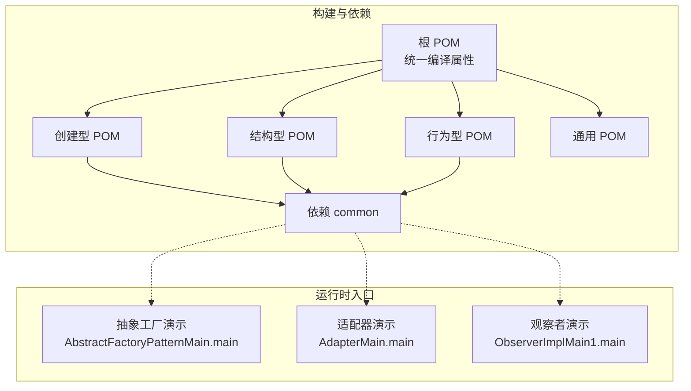
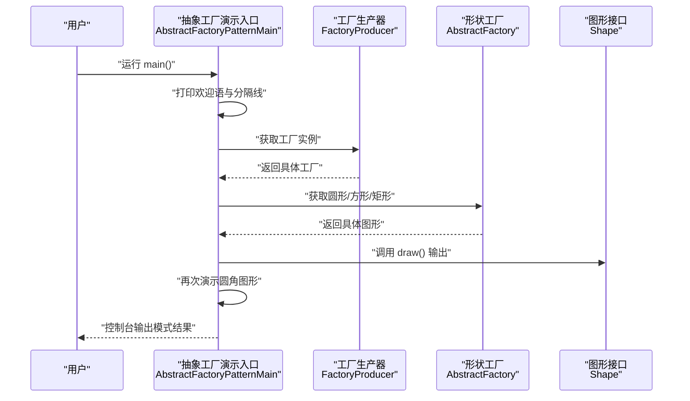
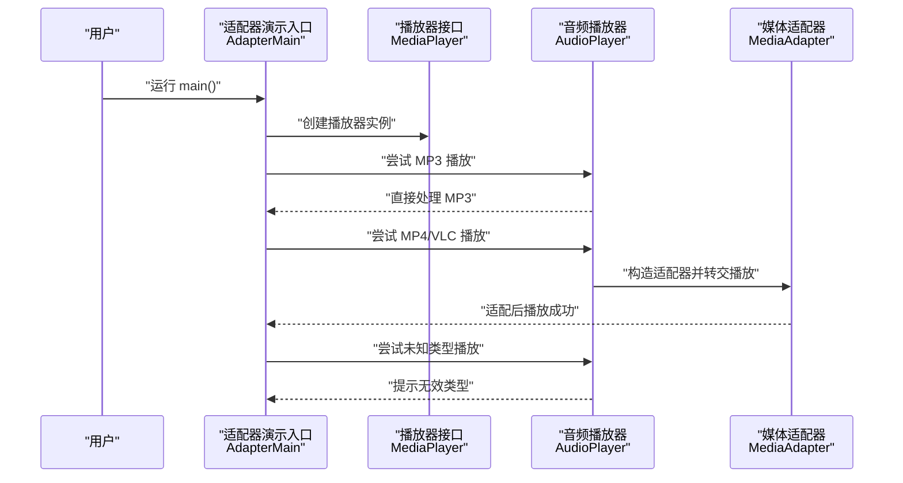
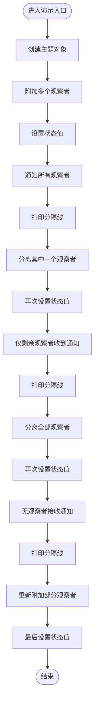
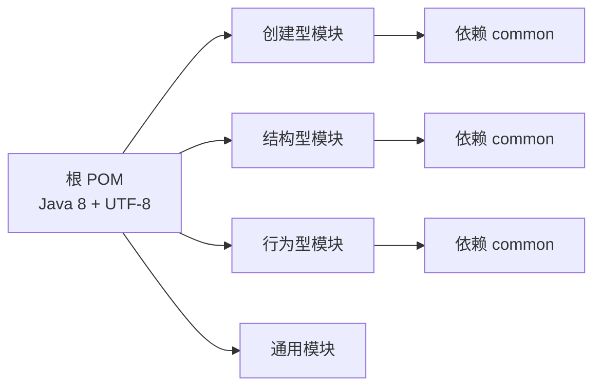

# 快速开始

<cite>
**本文引用的文件**
- [pom.xml](file://pom.xml)
- [readme.md](file://readme.md)
- [creational/pom.xml](file://creational/pom.xml)
- [behavioral/pom.xml](file://behavioral/pom.xml)
- [structural/pom.xml](file://structural/pom.xml)
- [common/src/main/java/com/future/rocket/gof23/common/OtherTool.java](file://common/src/main/java/com/future/rocket/gof23/common/OtherTool.java)
- [creational/abstractfactory/src/main/java/com/future/rocket/gof23/abs/factory/AbstractFactoryPatternMain.java](file://creational/abstractfactory/src/main/java/com/future/rocket/gof23/abs/factory/AbstractFactoryPatternMain.java)
- [behavioral/observer/src/main/java/com/future/rocket/gof23/observer/impl1/ObserverImplMain1.java](file://behavioral/observer/src/main/java/com/future/rocket/gof23/observer/impl1/ObserverImplMain1.java)
- [behavioral/observer/src/main/java/com/future/rocket/gof23/observer/impl1/Subject.java](file://behavioral/observer/src/main/java/com/future/rocket/gof23/observer/impl1/Subject.java)
- [structural/adapter/src/main/java/com/future/rocket/gof23/adapter/AdapterMain.java](file://structural/adapter/src/main/java/com/future/rocket/gof23/adapter/AdapterMain.java)
- [structural/adapter/src/main/java/com/future/rocket/gof23/adapter/impl/AudioPlayer.java](file://structural/adapter/src/main/java/com/future/rocket/gof23/adapter/impl/AudioPlayer.java)
</cite>

## 目录
1. [引言](#引言)
2. [项目结构](#项目结构)
3. [核心组件](#核心组件)
4. [架构总览](#架构总览)
5. [详细组件分析](#详细组件分析)
6. [依赖分析](#依赖分析)
7. [性能考虑](#性能考虑)
8. [故障排除指南](#故障排除指南)
9. [结论](#结论)
10. [附录](#附录)

## 引言
本指南面向首次接触 gof23Rockets 项目的开发者，帮助你在本地快速搭建环境、编译构建并运行各设计模式演示程序。项目采用多模块 Maven 结构，按“创建型”“结构型”“行为型”三大类组织示例，每个子模块均提供独立的 main 入口用于演示对应设计模式。

## 项目结构
- 顶层聚合工程定义统一的 Java 版本属性与模块划分。
- 三个一级模块分别代表三大类设计模式：creational（创建型）、structural（结构型）、behavioral（行为型）。
- common 模块提供通用工具类，供各模块复用。
- 各模式子模块内包含 src/main/java 的实现与 src/test/java 的测试（如存在），并通过各自的 pom.xml 管理依赖与编译属性。

```mermaid
graph TB
Root["根工程<br/>gof23 (pom)"] --> C["创建型<br/>creational (pom)"]
Root --> S["结构型<br/>structural (pom)"]
Root --> B["行为型<br/>behavioral (pom)"]
Root --> CM["通用模块<br/>common (pom)"]
C --> CAF["抽象工厂<br/>abstractfactory"]
C --> CF["工厂方法<br/>factory"]
C --> CS["单例<br/>singleton"]
C --> CB["建造者<br/>builder"]
C --> CP["原型<br/>prototype"]
S --> SA["适配器<br/>adapter"]
S --> SB["桥接<br/>bridge"]
S --> SC["组合<br/>composite"]
S --> SD["装饰器<br/>decorator"]
S --> SF["享元<br/>flyweight"]
S --> SP["代理<br/>proxy"]
S --> SDAO["数据访问对象<br/>daoPattern"]
S --> SFC["前端控制器<br/>frontController"]
S --> SSL["服务定位器<br/>serviceLocator"]
S --> STO["值对象传输<br/>transferObject"]
B --> BA["责任链<br/>chain"]
B --> BC["命令<br/>command"]
B --> BI["解释器<br/>interpreter"]
B --> BO["迭代器<br/>iterator"]
B --> BM["中介者<br/>mediator"]
B --> BME["备忘录<br/>memento"]
B --> BMS["模型视图控制器<br/>mvc"]
B --> BNO["空对象<br/>nullobject"]
B --> BS["策略<br/>strategy"]
B --> BT["模板方法<br/>template"]
B --> BV["访问者<br/>visitor"]
B --> BB["业务委托<br/>businessDelegate"]
B --> BCE["复合实体<br/>compositeEntity"]
B --> BIF["拦截过滤器<br/>interceptingFilter"]
```

图表来源
- [pom.xml:11-16](file://pom.xml#L11-L16)
- [creational/pom.xml:14-20](file://creational/pom.xml#L14-L20)
- [structural/pom.xml:14-26](file://structural/pom.xml#L14-L26)
- [behavioral/pom.xml:15-32](file://behavioral/pom.xml#L15-L32)

章节来源
- [pom.xml:1-24](file://pom.xml#L1-L24)
- [creational/pom.xml:1-36](file://creational/pom.xml#L1-L36)
- [structural/pom.xml:1-42](file://structural/pom.xml#L1-L42)
- [behavioral/pom.xml:1-48](file://behavioral/pom.xml#L1-L48)
- [readme.md:1-7](file://readme.md#L1-L7)

## 核心组件
- 通用工具 OtherTool：提供统一的分隔线打印能力，便于在控制台输出中区分不同模式的演示片段。
- 各模式模块的 main 入口：每个子模块均提供一个以“...Main”命名的类，作为该模式的演示入口，直接运行即可看到模式的行为效果。

章节来源
- [common/src/main/java/com/future/rocket/gof23/common/OtherTool.java:1-12](file://common/src/main/java/com/future/rocket/gof23/common/OtherTool.java#L1-L12)

## 架构总览
从构建与运行角度，系统遵循“多模块聚合 + 子模块独立演示”的架构：
- 聚合工程统一管理 Java 编译版本与编码格式。
- 各模式子模块通过继承父 POM 的编译属性，确保一致性。
- common 模块被多个子模块依赖，作为跨模块共享的基础工具。

图表来源
- [pom.xml:18-22](file://pom.xml#L18-L22)
- [creational/pom.xml:28-34](file://creational/pom.xml#L28-L34)
- [structural/pom.xml:34-40](file://structural/pom.xml#L34-L40)
- [behavioral/pom.xml:40-46](file://behavioral/pom.xml#L40-L46)
- [creational/abstractfactory/src/main/java/com/future/rocket/gof23/abs/factory/AbstractFactoryPatternMain.java:9-34](file://creational/abstractfactory/src/main/java/com/future/rocket/gof23/abs/factory/AbstractFactoryPatternMain.java#L9-L34)
- [structural/adapter/src/main/java/com/future/rocket/gof23/adapter/AdapterMain.java:7-17](file://structural/adapter/src/main/java/com/future/rocket/gof23/adapter/AdapterMain.java#L7-L17)
- [behavioral/observer/src/main/java/com/future/rocket/gof23/observer/impl1/ObserverImplMain1.java:5-28](file://behavioral/observer/src/main/java/com/future/rocket/gof23/observer/impl1/ObserverImplMain1.java#L5-L28)

## 详细组件分析

### 运行流程概览（以典型模式为例）
下面以“抽象工厂”“适配器”“观察者”三个模式的 main 执行为主线，展示从入口到输出的调用序列。

图表来源
- [creational/abstractfactory/src/main/java/com/future/rocket/gof23/abs/factory/AbstractFactoryPatternMain.java:11-32](file://creational/abstractfactory/src/main/java/com/future/rocket/gof23/abs/factory/AbstractFactoryPatternMain.java#L11-L32)

章节来源
- [creational/abstractfactory/src/main/java/com/future/rocket/gof23/abs/factory/AbstractFactoryPatternMain.java:1-34](file://creational/abstractfactory/src/main/java/com/future/rocket/gof23/abs/factory/AbstractFactoryPatternMain.java#L1-L34)

### 适配器模式（Adapter）调用流程
适配器模式通过统一播放器接口适配多种媒体类型，并在不支持的类型时进行降级处理。

图表来源
- [structural/adapter/src/main/java/com/future/rocket/gof23/adapter/AdapterMain.java:9-15](file://structural/adapter/src/main/java/com/future/rocket/gof23/adapter/AdapterMain.java#L9-L15)
- [structural/adapter/src/main/java/com/future/rocket/gof23/adapter/impl/AudioPlayer.java:9-19](file://structural/adapter/src/main/java/com/future/rocket/gof23/adapter/impl/AudioPlayer.java#L9-L19)

章节来源
- [structural/adapter/src/main/java/com/future/rocket/gof23/adapter/AdapterMain.java:1-17](file://structural/adapter/src/main/java/com/future/rocket/gof23/adapter/AdapterMain.java#L1-L17)
- [structural/adapter/src/main/java/com/future/rocket/gof23/adapter/impl/AudioPlayer.java:1-21](file://structural/adapter/src/main/java/com/future/rocket/gof23/adapter/impl/AudioPlayer.java#L1-L21)

### 观察者模式（Observer）状态变更流程
观察者模式通过主题对象的状态变化驱动多个观察者的更新，演示了附加、分离与批量分离观察者的行为。

图表来源
- [behavioral/observer/src/main/java/com/future/rocket/gof23/observer/impl1/ObserverImplMain1.java:7-26](file://behavioral/observer/src/main/java/com/future/rocket/gof23/observer/impl1/ObserverImplMain1.java#L7-L26)
- [behavioral/observer/src/main/java/com/future/rocket/gof23/observer/impl1/Subject.java:16-41](file://behavioral/observer/src/main/java/com/future/rocket/gof23/observer/impl1/Subject.java#L16-L41)

章节来源
- [behavioral/observer/src/main/java/com/future/rocket/gof23/observer/impl1/ObserverImplMain1.java:1-28](file://behavioral/observer/src/main/java/com/future/rocket/gof23/observer/impl1/ObserverImplMain1.java#L1-L28)
- [behavioral/observer/src/main/java/com/future/rocket/gof23/observer/impl1/Subject.java:1-43](file://behavioral/observer/src/main/java/com/future/rocket/gof23/observer/impl1/Subject.java#L1-L43)

## 依赖分析
- 统一编译属性：根 POM 与各子模块 POM 均设置源码与目标字节码版本为 8，编码统一为 UTF-8。
- 模块间依赖：创建型、结构型、行为型三大模块均依赖 common 模块，以便复用通用工具。
- 运行入口：各模式子模块的 main 类位于各自 src/main/java 下，直接可运行。

图表来源
- [pom.xml:18-22](file://pom.xml#L18-L22)
- [creational/pom.xml:28-34](file://creational/pom.xml#L28-L34)
- [structural/pom.xml:34-40](file://structural/pom.xml#L34-L40)
- [behavioral/pom.xml:40-46](file://behavioral/pom.xml#L40-L46)

章节来源
- [pom.xml:18-22](file://pom.xml#L18-L22)
- [creational/pom.xml:28-34](file://creational/pom.xml#L28-L34)
- [structural/pom.xml:34-40](file://structural/pom.xml#L34-L40)
- [behavioral/pom.xml:40-46](file://behavioral/pom.xml#L40-L46)

## 性能考虑
- 控制台输出为主：演示程序以 System.out 输出为主，I/O 开销极低，适合快速验证设计思想。
- 无外部依赖：演示模块未引入额外第三方库，避免运行时类冲突与启动时间开销。
- 小步快跑：建议每次只运行一个模式的 main，便于聚焦理解单一设计模式。

## 故障排除指南
- Java 版本不匹配
  - 现象：编译报错或运行时报类版本错误。
  - 处理：确保本地 JDK 版本为 8；若使用 IDE，请检查项目 SDK 与编译级别设置一致。
  - 参考来源
    - [pom.xml:19-20](file://pom.xml#L19-L20)
    - [creational/pom.xml:23-24](file://creational/pom.xml#L23-L24)
    - [structural/pom.xml:29-30](file://structural/pom.xml#L29-L30)
    - [behavioral/pom.xml:35-36](file://behavioral/pom.xml#L35-L36)
- 编码问题导致中文乱码
  - 现象：控制台输出中文显示异常。
  - 处理：确认项目与 IDE 的文件编码均为 UTF-8；必要时在运行参数中显式指定编码。
  - 参考来源
    - [pom.xml:21](file://pom.xml#L21)
    - [creational/pom.xml:26](file://creational/pom.xml#L26)
    - [structural/pom.xml:32](file://structural/pom.xml#L32)
    - [behavioral/pom.xml:38](file://behavioral/pom.xml#L38)
- 无法找到 main 类
  - 现象：IDE 或命令行提示找不到或无法加载主类。
  - 处理：确认已执行 Maven 完整构建（mvn clean install），并在对应模块目录下运行 main；或直接在 IDE 中右键运行对应类。
- 依赖缺失导致类找不到
  - 现象：运行时抛出 NoClassDefFoundError。
  - 处理：先在根目录执行 mvn clean install，确保 common 模块先安装，再逐个模块运行 main。
  - 参考来源
    - [creational/pom.xml:30-33](file://creational/pom.xml#L30-L33)
    - [structural/pom.xml:35-39](file://structural/pom.xml#L35-L39)
    - [behavioral/pom.xml:41-45](file://behavioral/pom.xml#L41-L45)

## 结论
通过本指南，你可以在本地快速完成环境准备、项目构建与各设计模式演示的运行。建议按照“创建型 → 结构型 → 行为型”的顺序逐一运行 main 入口，配合 common 模块的统一输出风格，逐步加深对 23 种设计模式的理解。

## 附录

### 环境配置要求
- Java 版本：JDK 8（源码与目标兼容版本均为 8）
- Maven：推荐使用 Maven 3.6+，确保能正确解析多模块工程
- 开发工具：任意支持 Maven 的 IDE（如 IntelliJ IDEA、Eclipse、VS Code）

章节来源
- [pom.xml:19-22](file://pom.xml#L19-L22)
- [creational/pom.xml:23-26](file://creational/pom.xml#L23-L26)
- [structural/pom.xml:29-32](file://structural/pom.xml#L29-L32)
- [behavioral/pom.xml:35-38](file://behavioral/pom.xml#L35-L38)

### 克隆、编译与运行步骤
- 克隆仓库至本地后，在根目录执行：
  - mvn clean install
- 在任一模式子模块运行其 main 入口类（例如）：
  - 抽象工厂：运行 AbstractFactoryPatternMain.main
  - 适配器：运行 AdapterMain.main
  - 观察者：运行 ObserverImplMain1.main

章节来源
- [creational/abstractfactory/src/main/java/com/future/rocket/gof23/abs/factory/AbstractFactoryPatternMain.java:11-32](file://creational/abstractfactory/src/main/java/com/future/rocket/gof23/abs/factory/AbstractFactoryPatternMain.java#L11-L32)
- [structural/adapter/src/main/java/com/future/rocket/gof23/adapter/AdapterMain.java:9-15](file://structural/adapter/src/main/java/com/future/rocket/gof23/adapter/AdapterMain.java#L9-L15)
- [behavioral/observer/src/main/java/com/future/rocket/gof23/observer/impl1/ObserverImplMain1.java:7-26](file://behavioral/observer/src/main/java/com/future/rocket/gof23/observer/impl1/ObserverImplMain1.java#L7-L26)

### 设计模式演示清单与入口
- 创建型
  - 抽象工厂：AbstractFactoryPatternMain.main
  - 工厂方法：FactoryPatternMain.main
  - 单例：SingletonMain.main
  - 建造者：BuilderMain.main
  - 原型：PrototypeMain.main
- 结构型
  - 适配器：AdapterMain.main
  - 桥接：BridgeMain.main
  - 组合：CompositeMain.java
  - 装饰器：DecoratorMain.java
  - 享元：TestFlyweightMain.java
  - 代理：ProxyMain.main
  - 数据访问对象：DaoMain.java
  - 前端控制器：FrontControllerMain.java
  - 服务定位器：ServiceLocatorMain.java
  - 值对象传输：TransferObjectMain.java
- 行为型
  - 责任链：ChainMain.java
  - 命令：CommandMain.java
  - 解释器：InterpreterMain.java
  - 迭代器：IteratorMain.java
  - 中介者：MediatorMain.java
  - 备忘录：MementoMain.java
  - 模型视图控制器：MvcMain.java
  - 空对象：NullObjectMail.java
  - 策略：StrategyMain.java
  - 模板方法：TemplateMain.java
  - 访问者：VisitorMain.java
  - 业务委托：BusinessDelegateMain.java
  - 复合实体：CompositeEntityMain.java
  - 拦截过滤器：InterceptorFilterMain.java

### 学习路径建议
- 第一轮：从创建型入手，理解对象创建的不同策略
- 第二轮：进入结构型，掌握类与对象的组合方式
- 第三轮：深入行为型，体会对象间的交互与职责分配
- 每轮完成后，对照 common 的输出风格，记录关键行为差异