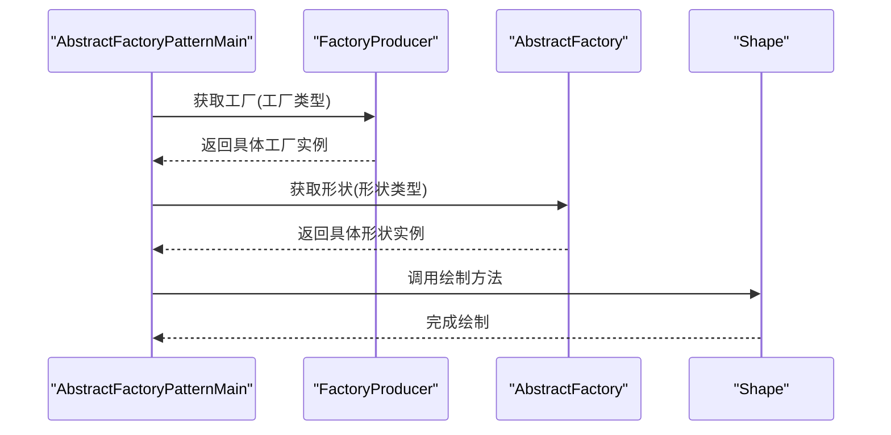
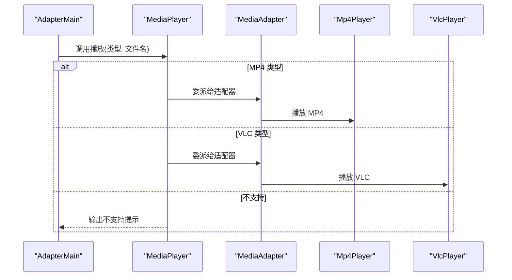
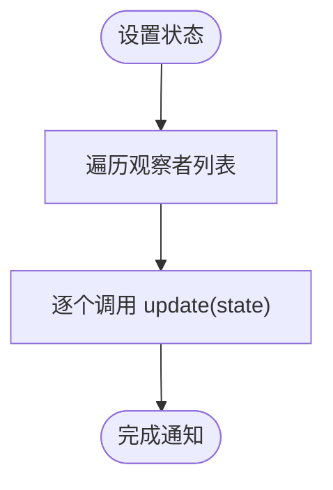
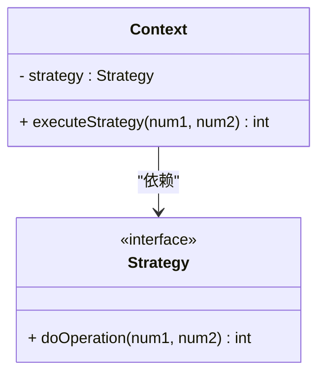
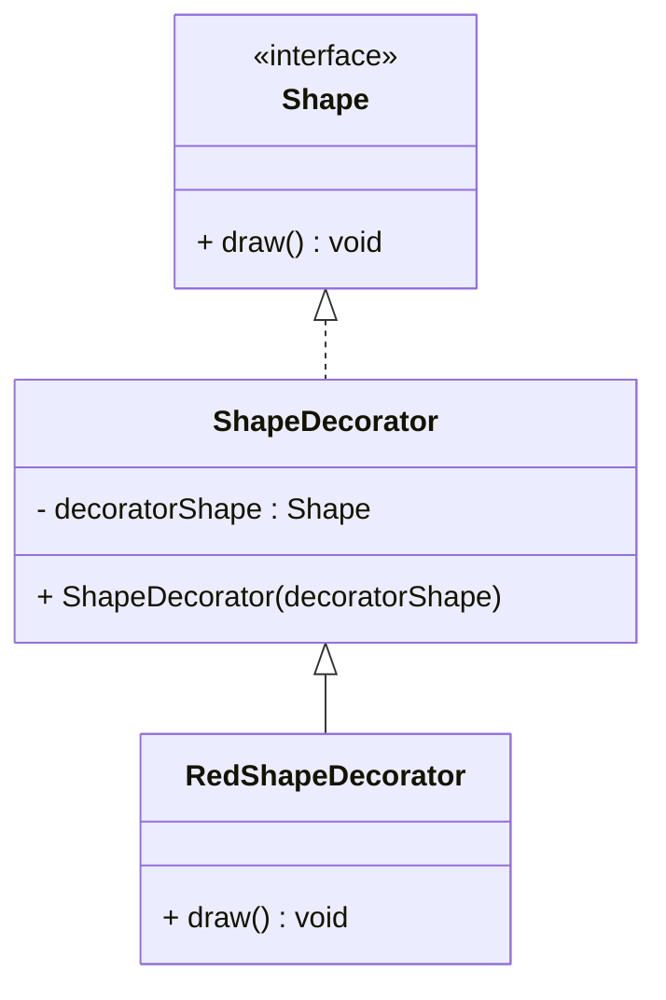
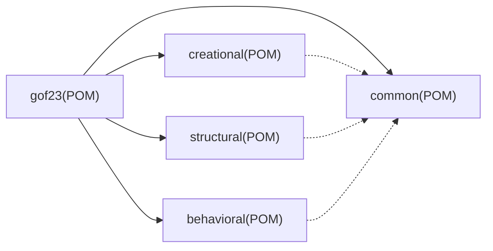

# 扩展与定制指南

<cite>
**本文引用的文件**
- [pom.xml](file://pom.xml)
- [readme.md](file://readme.md)
- [creational/pom.xml](file://creational/pom.xml)
- [structural/pom.xml](file://structural/pom.xml)
- [behavioral/pom.xml](file://behavioral/pom.xml)
- [common/OtherTool.java](file://common/src/main/java/com/future/rocket/gof23/common/OtherTool.java)
- [creational/abstractfactory/AbstractFactoryPatternMain.java](file://creational/abstractfactory/src/main/java/com/future/rocket/gof23/abs/factory/AbstractFactoryPatternMain.java)
- [behavioral/observer/impl1/ObserverImplMain1.java](file://behavioral/observer/src/main/java/com/future/rocket/gof23/observer/impl1/ObserverImplMain1.java)
- [behavioral/observer/impl1/Subject.java](file://behavioral/observer/src/main/java/com/future/rocket/gof23/observer/impl1/Subject.java)
- [structural/adapter/AdapterMain.java](file://structural/adapter/src/main/java/com/future/rocket/gof23/adapter/AdapterMain.java)
- [structural/adapter/struct/MediaAdapter.java](file://structural/adapter/src/main/java/com/future/rocket/gof23/adapter/struct/MediaAdapter.java)
- [behavioral/strategy/context/Context.java](file://behavioral/strategy/src/main/java/com/future/rocket/gof23/strategy/context/Context.java)
- [structural/decorator/struct/ShapeDecorator.java](file://structural/decorator/src/main/java/com/future/rocket/gof23/decorator/struct/ShapeDecorator.java)
</cite>

## 目录
1. [简介](#简介)
2. [项目结构](#项目结构)
3. [核心组件](#核心组件)
4. [架构总览](#架构总览)
5. [详细组件分析](#详细组件分析)
6. [依赖分析](#依赖分析)
7. [性能考虑](#性能考虑)
8. [故障排除指南](#故障排除指南)
9. [结论](#结论)
10. [附录](#附录)

## 简介
本指南面向希望在 gog23Rockets 项目基础上进行扩展与定制的开发者。项目采用多模块 Maven 架构，按设计模式类型划分为创建型、结构型与行为型三大领域，并通过公共模块提供通用工具。文档将从模块化架构出发，给出新增设计模式实现的步骤、模板与最佳实践；说明配置与构建策略；提供版本与分支管理建议；以及插件与第三方集成的指导；最后涵盖贡献流程、代码规范与调试技巧。

## 项目结构
项目采用分层模块化组织：
- 根 POM 定义聚合模块与全局属性（Java 版本、编码等）
- 一级模块：common、creational、structural、behavioral
- 二级模块：各设计模式子模块（如 abstractfactory、adapter、observer 等）

```mermaid
graph TB
ROOT["根模块<br/>gof23"] --> COMMON["公共模块<br/>common"]
ROOT --> CRE["创建型模块<br/>creational"]
ROOT --> STRU["结构型模块<br/>structural"]
ROOT --> BEHV["行为型模块<br/>behavioral"]
CRE --> C_AF["抽象工厂<br/>abstractfactory"]
CRE --> C_F["工厂方法<br/>factory"]
CRE --> C_S["单例<br/>singleton"]
CRE --> C_B["建造者<br/>builder"]
CRE --> C_P["原型<br/>prototype"]
STRU --> S_A["适配器<br/>adapter"]
STRU --> S_B["桥接<br/>bridge"]
STRU --> S_D["装饰器<br/>decorator"]
STRU --> S_C["组合<br/>composite"]
STRU --> S_F["享元<br/>flyweight"]
STRU --> S_P["代理<br/>proxy"]
STRU --> S_DAO["DAO 模式<br/>daoPattern"]
STRU --> S_FC["前端控制器<br/>frontController"]
STRU --> S_SL["服务定位器<br/>serviceLocator"]
STRU --> S_TO["值对象<br/>transferObject"]
BEHV --> B_CH["责任链<br/>chain"]
BEHV --> B_CMD["命令<br/>command"]
BEHV --> B_INT["解释器<br/>interpreter"]
BEHV --> B_IT["迭代器<br/>iterator"]
BEHV --> B_MED["中介者<br/>mediator"]
BEHV --> B_MEM["备忘录<br/>memento"]
BEHV --> B_OBS["观察者<br/>observer"]
BEHV --> B_STA["状态<br/>state"]
BEHV --> B_NU["空对象<br/>nullobject"]
BEHV --> B_STR["策略<br/>strategy"]
BEHV --> B_TPL["模板方法<br/>template"]
BEHV --> B_VIS["访问者<br/>visitor"]
BEHV --> B_MVC["MVC<br/>mvc"]
BEHV --> B_BD["业务委托<br/>businessDelegate"]
BEHV --> B_CE["复合实体<br/>compositeEntity"]
BEHV --> B_IF["拦截过滤器<br/>interceptingFilter"]
```

图表来源
- [pom.xml:11-16](file://pom.xml#L11-L16)
- [creational/pom.xml:14-20](file://creational/pom.xml#L14-L20)
- [structural/pom.xml:14-26](file://structural/pom.xml#L14-L26)
- [behavioral/pom.xml:15-32](file://behavioral/pom.xml#L15-L32)

章节来源
- [pom.xml:1-24](file://pom.xml#L1-L24)
- [readme.md:1-7](file://readme.md#L1-L7)

## 核心组件
- 公共工具模块：提供统一的输出分隔线等通用能力，供各模式模块复用。
- 各模式主入口：每个模式通常包含一个 main 类用于演示调用链路与行为展示。
- 接口与实现：遵循“接口/抽象类 + 多个实现”的分层设计，便于替换与扩展。

章节来源
- [common/OtherTool.java:1-12](file://common/src/main/java/com/future/rocket/gof23/common/OtherTool.java#L1-L12)
- [creational/abstractfactory/AbstractFactoryPatternMain.java:1-34](file://creational/abstractfactory/src/main/java/com/future/rocket/gof23/abs/factory/AbstractFactoryPatternMain.java#L1-L34)
- [behavioral/observer/impl1/ObserverImplMain1.java:1-28](file://behavioral/observer/src/main/java/com/future/rocket/gof23/observer/impl1/ObserverImplMain1.java#L1-L28)
- [structural/adapter/AdapterMain.java:1-17](file://structural/adapter/src/main/java/com/future/rocket/gof23/adapter/AdapterMain.java#L1-L17)

## 架构总览
项目整体采用“父 POM 聚合 + 子模块拆分”的多模块架构。公共模块被创建型、结构型、行为型模块作为依赖引入，确保跨模块共享工具与常量。各模式模块内部遵循一致的包结构：iface（接口）、impl（实现）、struct（结构型组合类）、enums（枚举）、client/manager/target（场景入口）等，便于扩展与维护。

```mermaid
graph TB
subgraph "公共层"
COMMON["common<br/>OtherTool"]
end
subgraph "创建型"
C_AF["abstractfactory"]
C_F["factory"]
C_S["singleton"]
C_B["builder"]
C_P["prototype"]
end
subgraph "结构型"
S_A["adapter"]
S_B["bridge"]
S_D["decorator"]
S_C["composite"]
S_F["flyweight"]
S_P["proxy"]
S_DAO["daoPattern"]
S_FC["frontController"]
S_SL["serviceLocator"]
S_TO["transferObject"]
end
subgraph "行为型"
B_OBS["observer"]
B_STR["strategy"]
B_CMD["command"]
B_STATE["state"]
B_VIS["visitor"]
B_MVC["mvc"]
B_TPL["template"]
B_MEM["memento"]
B_MED["mediator"]
B_INT["interpreter"]
B_IT["iterator"]
B_CH["chain"]
B_NU["nullobject"]
B_BD["businessDelegate"]
B_CE["compositeEntity"]
B_IF["interceptingFilter"]
end
COMMON --> C_AF
COMMON --> C_F
COMMON --> C_S
COMMON --> C_B
COMMON --> C_P
COMMON --> S_A
COMMON --> S_B
COMMON --> S_D
COMMON --> S_C
COMMON --> S_F
COMMON --> S_P
COMMON --> S_DAO
COMMON --> S_FC
COMMON --> S_SL
COMMON --> S_TO
COMMON --> B_OBS
COMMON --> B_STR
COMMON --> B_CMD
COMMON --> B_STATE
COMMON --> B_VIS
COMMON --> B_MVC
COMMON --> B_TPL
COMMON --> B_MEM
COMMON --> B_MED
COMMON --> B_INT
COMMON --> B_IT
COMMON --> B_CH
COMMON --> B_NU
COMMON --> B_BD
COMMON --> B_CE
COMMON --> B_IF
```

图表来源
- [pom.xml:11-16](file://pom.xml#L11-L16)
- [creational/pom.xml:28-34](file://creational/pom.xml#L28-L34)
- [structural/pom.xml:34-40](file://structural/pom.xml#L34-L40)
- [behavioral/pom.xml:40-46](file://behavioral/pom.xml#L40-L46)

## 详细组件分析

### 创建型：抽象工厂模式
- 设计要点：通过工厂接口屏蔽具体产品族的创建细节，客户端仅依赖抽象工厂与抽象产品。
- 扩展路径：新增产品族时，在 producer 中注册新工厂类型，在 enums 中扩展枚举项，再在对应模块中添加新产品的实现类。

图表来源
- [creational/abstractfactory/AbstractFactoryPatternMain.java:15-22](file://creational/abstractfactory/src/main/java/com/future/rocket/gof23/abs/factory/AbstractFactoryPatternMain.java#L15-L22)
- [creational/abstractfactory/src/main/java/com/future/rocket/gof23/abs/factory/build/AbstractFactory.java](file://creational/abstractfactory/src/main/java/com/future/rocket/gof23/abs/factory/build/AbstractFactory.java)

章节来源
- [creational/abstractfactory/AbstractFactoryPatternMain.java:1-34](file://creational/abstractfactory/src/main/java/com/future/rocket/gof23/abs/factory/AbstractFactoryPatternMain.java#L1-L34)
- [creational/abstractfactory/src/main/java/com/future/rocket/gof23/abs/factory/build/AbstractFactory.java:1-9](file://creational/abstractfactory/src/main/java/com/future/rocket/gof23/abs/factory/build/AbstractFactory.java#L1-L9)

### 结构型：适配器模式
- 设计要点：通过适配器包装不兼容接口，使客户端以统一接口使用不同能力。
- 扩展路径：新增媒体类型时，在适配器构造函数中增加类型分支，并在播放方法中扩展处理逻辑。

图表来源
- [structural/adapter/AdapterMain.java:10-14](file://structural/adapter/src/main/java/com/future/rocket/gof23/adapter/AdapterMain.java#L10-L14)
- [structural/adapter/struct/MediaAdapter.java:13-32](file://structural/adapter/src/main/java/com/future/rocket/gof23/adapter/struct/MediaAdapter.java#L13-L32)

章节来源
- [structural/adapter/AdapterMain.java:1-17](file://structural/adapter/src/main/java/com/future/rocket/gof23/adapter/AdapterMain.java#L1-L17)
- [structural/adapter/struct/MediaAdapter.java:1-33](file://structural/adapter/src/main/java/com/future/rocket/gof23/adapter/struct/MediaAdapter.java#L1-L33)

### 行为型：观察者模式
- 设计要点：主题维护观察者列表，状态变化时通知所有观察者；支持附加/分离/清空。
- 扩展路径：新增观察者类型时，实现观察者接口并在主题中进行 attach/detach 管理。

图表来源
- [behavioral/observer/impl1/Subject.java:37-41](file://behavioral/observer/src/main/java/com/future/rocket/gof23/observer/impl1/Subject.java#L37-L41)

章节来源
- [behavioral/observer/impl1/ObserverImplMain1.java:1-28](file://behavioral/observer/src/main/java/com/future/rocket/gof23/observer/impl1/ObserverImplMain1.java#L1-L28)
- [behavioral/observer/impl1/Subject.java:1-43](file://behavioral/observer/src/main/java/com/future/rocket/gof23/observer/impl1/Subject.java#L1-L43)

### 行为型：策略模式
- 设计要点：上下文持有策略接口引用，在运行期委托具体策略执行算法。
- 扩展路径：新增算法时，实现策略接口并在上下文中注入。

图表来源
- [behavioral/strategy/context/Context.java:1-16](file://behavioral/strategy/src/main/java/com/future/rocket/gof23/strategy/context/Context.java#L1-L16)

章节来源
- [behavioral/strategy/context/Context.java:1-16](file://behavioral/strategy/src/main/java/com/future/rocket/gof23/strategy/context/Context.java#L1-L16)

### 结构型：装饰器模式
- 设计要点：装饰器实现与被装饰对象相同的接口，持有一个被装饰对象引用，通过组合实现增强。
- 扩展路径：新增装饰维度时，继承装饰器基类并实现相应增强逻辑。

图表来源
- [structural/decorator/struct/ShapeDecorator.java:1-13](file://structural/decorator/src/main/java/com/future/rocket/gof23/decorator/struct/ShapeDecorator.java#L1-L13)

章节来源
- [structural/decorator/struct/ShapeDecorator.java:1-13](file://structural/decorator/src/main/java/com/future/rocket/gof23/decorator/struct/ShapeDecorator.java#L1-L13)

## 依赖分析
- 根 POM 聚合四大模块，统一编译参数与打包方式。
- 各模式模块均依赖公共模块，保证工具与常量的一致性。
- 模块间无直接耦合，通过接口与抽象类解耦，利于独立演进。

图表来源
- [pom.xml:11-16](file://pom.xml#L11-L16)
- [creational/pom.xml:28-34](file://creational/pom.xml#L28-L34)
- [structural/pom.xml:34-40](file://structural/pom.xml#L34-L40)
- [behavioral/pom.xml:40-46](file://behavioral/pom.xml#L40-L46)

章节来源
- [pom.xml:1-24](file://pom.xml#L1-L24)
- [creational/pom.xml:1-36](file://creational/pom.xml#L1-L36)
- [structural/pom.xml:1-42](file://structural/pom.xml#L1-L42)
- [behavioral/pom.xml:1-48](file://behavioral/pom.xml#L1-L48)

## 性能考虑
- 模块化带来的编译与测试隔离：新增模块可独立构建与验证，减少全量编译时间。
- 接口抽象降低运行时开销：通过接口与策略模式避免硬编码分支，提升可替换性与可测试性。
- 日志与输出控制：公共工具提供统一输出格式，便于在生产环境收敛日志级别。

## 故障排除指南
- 构建失败（找不到公共类）
  - 检查公共模块是否已安装且版本一致
  - 确认各模块对公共模块的依赖声明正确
- 运行时异常（不支持的类型）
  - 在适配器或工厂等选择逻辑中检查枚举与分支覆盖
- 观察者未收到通知
  - 确认 attach/detach 调用顺序与主题状态变更时机
- 日志输出不符合预期
  - 使用公共工具输出分隔线，便于定位模块边界

## 结论
gof23Rockets 的模块化架构为扩展与定制提供了清晰的边界与路径。遵循本文提供的模板与最佳实践，可在不破坏现有结构的前提下快速新增设计模式实现，并通过统一的配置与依赖管理保障构建与运行稳定。

## 附录

### 新增设计模式实现步骤
- 在对应类型模块下创建子目录，按 iface/impl/struct/enums/client 等层次组织
- 在主入口类中演示调用链路，必要时引入公共工具输出分隔线
- 在父模块 POM 中注册新增模块，确保公共依赖生效
- 编写最小可运行示例，验证接口契约与行为一致性

章节来源
- [common/OtherTool.java:8-10](file://common/src/main/java/com/future/rocket/gof23/common/OtherTool.java#L8-L10)
- [pom.xml:11-16](file://pom.xml#L11-L16)

### 配置与构建定制
- Java 版本与编码：在根 POM 与各模块 POM 统一设置编译参数
- 依赖管理：通过父 POM 统一版本，避免重复声明
- 构建策略：优先使用模块级构建，必要时使用根模块聚合构建

章节来源
- [pom.xml:18-22](file://pom.xml#L18-L22)
- [creational/pom.xml:22-26](file://creational/pom.xml#L22-L26)
- [structural/pom.xml:28-32](file://structural/pom.xml#L28-L32)
- [behavioral/pom.xml:34-38](file://behavioral/pom.xml#L34-L38)

### 版本与分支管理建议
- 版本号：采用语义化版本，主版本号用于破坏性变更，次版本号用于向后兼容的功能新增，修订号用于修复
- 分支策略：使用特性分支开发新模式，合并前进行模块内构建与测试；发布前在根模块进行全量构建校验

### 插件开发与第三方集成指导
- 插件化思路：将可变行为抽象为接口，通过 SPI 或配置加载具体实现
- 第三方集成：在公共模块封装第三方 SDK 的适配器，保持上层接口稳定

### 贡献流程与代码规范
- 提交前：在目标模块执行构建与测试，确保通过
- 提交流程：新建特性分支，提交 PR 并在 CI 中验证
- 代码规范：遵循现有包结构与命名约定，保持接口与实现分离，避免在公共模块引入外部依赖