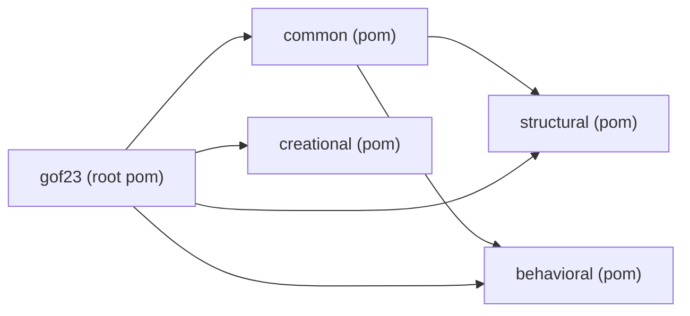
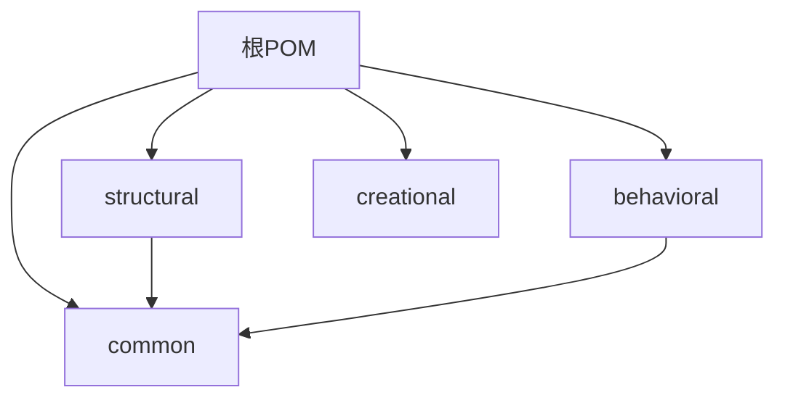
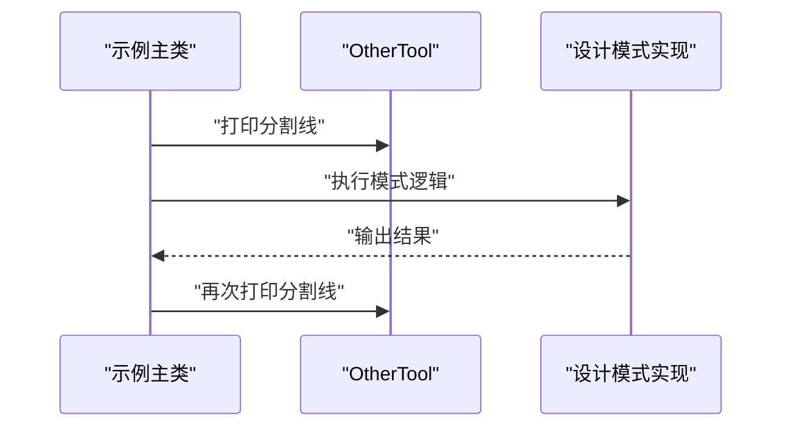
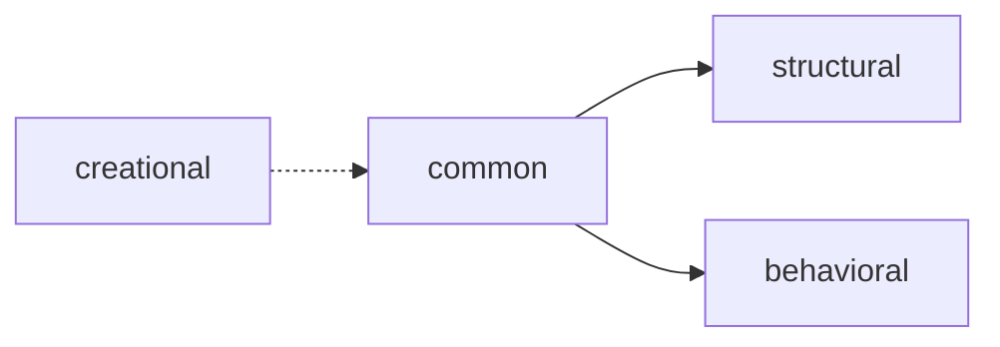

# 技术栈与环境配置

<cite>
**本文引用的文件**
- [pom.xml](file://pom.xml)
- [readme.md](file://readme.md)
- [common/pom.xml](file://common/pom.xml)
- [creational/pom.xml](file://creational/pom.xml)
- [structural/pom.xml](file://structural/pom.xml)
- [behavioral/pom.xml](file://behavioral/pom.xml)
- [creational/abstractfactory/pom.xml](file://creational/abstractfactory/pom.xml)
- [behavioral/observer/pom.xml](file://behavioral/observer/pom.xml)
- [structural/adapter/pom.xml](file://structural/adapter/pom.xml)
- [creational/abstractfactory/src/main/java/com/future/rocket/gof23/abs/factory/AbstractFactoryPatternMain.java](file://creational/abstractfactory/src/main/java/com/future/rocket/gof23/abs/factory/AbstractFactoryPatternMain.java)
- [behavioral/observer/src/main/java/com/future/rocket/gof23/observer/impl1/ObserverImplMain1.java](file://behavioral/observer/src/main/java/com/future/rocket/gof23/observer/impl1/ObserverImplMain1.java)
- [structural/adapter/src/main/java/com/future/rocket/gof23/adapter/AdapterMain.java](file://structural/adapter/src/main/java/com/future/rocket/gof23/adapter/AdapterMain.java)
</cite>

## 目录
1. [引言](#引言)
2. [项目结构](#项目结构)
3. [核心组件](#核心组件)
4. [架构总览](#架构总览)
5. [详细组件分析](#详细组件分析)
6. [依赖分析](#依赖分析)
7. [性能考虑](#性能考虑)
8. [故障排查指南](#故障排查指南)
9. [结论](#结论)
10. [附录](#附录)

## 引言
本文件聚焦于gof23Rockets项目的技术栈与环境配置，系统阐述以下内容：
- Java版本要求与兼容性
- Maven构建配置与多模块依赖管理
- 模块化结构设计与模块间依赖关系
- 编译配置、构建流程与打包发布策略
- IDE开发环境推荐与最佳实践
- 版本兼容性与升级注意事项

本项目以Maven多模块组织方式呈现，根POM声明顶层聚合模块，四大领域模块（创建型、结构型、行为型、通用）分别管理其子模块，所有模块统一采用Java 8编译目标。

**章节来源**
- [readme.md:1-7](file://readme.md#L1-L7)

## 项目结构
项目采用分层聚合的多模块Maven结构：
- 根POM负责定义全局属性与模块清单
- 四大领域模块作为聚合器，管理各自子模块
- 各具体设计模式示例模块仅包含源码与自身POM
- 通用模块提供跨模块共享工具

```mermaid
graph TB
ROOT["根聚合模块<br/>gof23 (pom)"] --> CREAT["创建型模块<br/>creational (pom)"]
ROOT --> COMMON["通用模块<br/>common (pom)"]
ROOT --> STRUCT["结构型模块<br/>structural (pom)"]
ROOT --> BEHAV["行为型模块<br/>behavioral (pom)"]
CREAT --> CREAT_SUB1["abstractfactory"]
CREAT --> CREAT_SUB2["factory"]
CREAT --> CREAT_SUB3["singleton"]
CREAT --> CREAT_SUB4["builder"]
CREAT --> CREAT_SUB5["prototype"]
STRUCT --> STRUCT_SUB1["adapter"]
STRUCT --> STRUCT_SUB2["bridge"]
STRUCT --> STRUCT_SUB3["filter"]
STRUCT --> STRUCT_SUB4["composite"]
STRUCT --> STRUCT_SUB5["decorator"]
STRUCT --> STRUCT_SUB6["flyweight"]
STRUCT --> STRUCT_SUB7["proxy"]
STRUCT --> STRUCT_SUB8["daoPattern"]
STRUCT --> STRUCT_SUB9["frontController"]
STRUCT --> STRUCT_SUB10["serviceLocator"]
STRUCT --> STRUCT_SUB11["transferObject"]
BEHAV --> BEHAV_SUB1["chain"]
BEHAV --> BEHAV_SUB2["command"]
BEHAV --> BEHAV_SUB3["interpreter"]
BEHAV --> BEHAV_SUB4["iterator"]
BEHAV --> BEHAV_SUB5["mediator"]
BEHAV --> BEHAV_SUB6["memento"]
BEHAV --> BEHAV_SUB7["observer"]
BEHAV --> BEHAV_SUB8["state"]
BEHAV --> BEHAV_SUB9["nullobject"]
BEHAV --> BEHAV_SUB10["strategy"]
BEHAV --> BEHAV_SUB11["template"]
BEHAV --> BEHAV_SUB12["visitor"]
BEHAV --> BEHAV_SUB13["mvc"]
BEHAV --> BEHAV_SUB14["businessDelegate"]
BEHAV --> BEHAV_SUB15["compositeEntity"]
BEHAV --> BEHAV_SUB16["interceptingFilter"]
```

**图表来源**
- [pom.xml:11-16](file://pom.xml#L11-L16)
- [creational/pom.xml:14-20](file://creational/pom.xml#L14-L20)
- [structural/pom.xml:14-26](file://structural/pom.xml#L14-L26)
- [behavioral/pom.xml:15-32](file://behavioral/pom.xml#L15-L32)

**章节来源**
- [pom.xml:1-24](file://pom.xml#L1-L24)
- [creational/pom.xml:1-36](file://creational/pom.xml#L1-L36)
- [structural/pom.xml:1-42](file://structural/pom.xml#L1-L42)
- [behavioral/pom.xml:1-48](file://behavioral/pom.xml#L1-L48)
- [common/pom.xml:1-20](file://common/pom.xml#L1-L20)

## 核心组件
- 根POM
  - 聚合四大领域模块与通用模块
  - 统一设置Java编译版本为8，编码为UTF-8
- 领域模块
  - 创建型：抽象工厂、工厂、单例、建造者、原型
  - 结构型：适配器、桥接、过滤器、组合、装饰、享元、代理、DAO、前端控制器、服务定位器、值对象传输
  - 行为型：责任链、命令、解释器、迭代器、中介者、备忘录、观察者、状态、空对象、策略、模板、访问者、MVC、业务委托、复合实体、拦截过滤
  - 通用模块：提供跨模块复用的工具类
- 示例入口
  - 各模块均提供独立的main类用于演示对应设计模式

**章节来源**
- [pom.xml:18-22](file://pom.xml#L18-L22)
- [creational/pom.xml:28-34](file://creational/pom.xml#L28-L34)
- [structural/pom.xml:34-40](file://structural/pom.xml#L34-L40)
- [behavioral/pom.xml:40-46](file://behavioral/pom.xml#L40-L46)

## 架构总览
从构建与运行视角看，项目遵循“根聚合 -> 领域聚合 -> 具体模块”的层次化依赖关系；通用模块被行为型与结构型模块显式依赖，创建型模块通过父级聚合间接共享通用能力。

**图表来源**
- [creational/pom.xml:28-34](file://creational/pom.xml#L28-L34)
- [structural/pom.xml:34-40](file://structural/pom.xml#L34-L40)
- [behavioral/pom.xml:40-46](file://behavioral/pom.xml#L40-L46)

## 详细组件分析

### Java版本与编译配置
- 统一使用Java 8作为源码与目标版本
- 字符集统一为UTF-8
- 所有模块POM均显式声明上述属性，确保构建一致性

**章节来源**
- [pom.xml:18-22](file://pom.xml#L18-L22)
- [creational/abstractfactory/pom.xml:14-18](file://creational/abstractfactory/pom.xml#L14-L18)
- [behavioral/observer/pom.xml:14-18](file://behavioral/observer/pom.xml#L14-L18)
- [structural/adapter/pom.xml:14-18](file://structural/adapter/pom.xml#L14-L18)

### 多模块与依赖管理
- 根POM声明四大模块与通用模块
- 结构型与行为型模块显式依赖通用模块
- 创建型模块通过父级聚合间接共享通用模块能力
- 各具体模块不直接依赖其他模块，保持高内聚低耦合

**图表来源**
- [pom.xml:11-16](file://pom.xml#L11-L16)
- [creational/pom.xml:28-34](file://creational/pom.xml#L28-L34)
- [structural/pom.xml:34-40](file://structural/pom.xml#L34-L40)
- [behavioral/pom.xml:40-46](file://behavioral/pom.xml#L40-L46)

**章节来源**
- [pom.xml:11-16](file://pom.xml#L11-L16)
- [creational/pom.xml:28-34](file://creational/pom.xml#L28-L34)
- [structural/pom.xml:34-40](file://structural/pom.xml#L34-L40)
- [behavioral/pom.xml:40-46](file://behavioral/pom.xml#L40-L46)

### 示例入口与运行路径
- 创建型示例入口：调用通用工具类并展示抽象工厂创建不同形状
- 结构型示例入口：播放器适配多种媒体格式
- 行为型示例入口：观察者主题状态变化与订阅管理

**图表来源**
- [creational/abstractfactory/src/main/java/com/future/rocket/gof23/abs/factory/AbstractFactoryPatternMain.java:9-34](file://creational/abstractfactory/src/main/java/com/future/rocket/gof23/abs/factory/AbstractFactoryPatternMain.java#L9-L34)
- [behavioral/observer/src/main/java/com/future/rocket/gof23/observer/impl1/ObserverImplMain1.java:5-28](file://behavioral/observer/src/main/java/com/future/rocket/gof23/observer/impl1/ObserverImplMain1.java#L5-L28)
- [structural/adapter/src/main/java/com/future/rocket/gof23/adapter/AdapterMain.java:7-17](file://structural/adapter/src/main/java/com/future/rocket/gof23/adapter/AdapterMain.java#L7-L17)

**章节来源**
- [creational/abstractfactory/src/main/java/com/future/rocket/gof23/abs/factory/AbstractFactoryPatternMain.java:9-34](file://creational/abstractfactory/src/main/java/com/future/rocket/gof23/abs/factory/AbstractFactoryPatternMain.java#L9-L34)
- [behavioral/observer/src/main/java/com/future/rocket/gof23/observer/impl1/ObserverImplMain1.java:5-28](file://behavioral/observer/src/main/java/com/future/rocket/gof23/observer/impl1/ObserverImplMain1.java#L5-L28)
- [structural/adapter/src/main/java/com/future/rocket/gof23/adapter/AdapterMain.java:7-17](file://structural/adapter/src/main/java/com/future/rocket/gof23/adapter/AdapterMain.java#L7-L17)

## 依赖分析
- 跨模块依赖
  - 结构型与行为型模块显式依赖通用模块，体现“可复用工具”在多个领域中的应用
- 内部模块依赖
  - 各具体模块彼此无直接依赖，避免循环依赖与紧耦合
- 父子继承
  - 子模块继承根POM与领域POM的属性，减少重复配置

**图表来源**
- [creational/pom.xml:28-34](file://creational/pom.xml#L28-L34)
- [structural/pom.xml:34-40](file://structural/pom.xml#L34-L40)
- [behavioral/pom.xml:40-46](file://behavioral/pom.xml#L40-L46)

**章节来源**
- [creational/pom.xml:28-34](file://creational/pom.xml#L28-L34)
- [structural/pom.xml:34-40](file://structural/pom.xml#L34-L40)
- [behavioral/pom.xml:40-46](file://behavioral/pom.xml#L40-L46)

## 性能考虑
- 构建性能
  - 使用统一Java 8目标，避免多版本并行带来的兼容成本
  - 模块拆分清晰，便于增量编译与并行构建
- 运行性能
  - 示例代码以演示为主，未引入第三方运行时依赖，避免额外开销
- 可维护性
  - 显式依赖与清晰的模块边界降低维护复杂度

## 故障排查指南
- 编译错误（Java版本不匹配）
  - 症状：编译报错提示源/目标版本不兼容
  - 排查：确认IDE与Maven使用相同Java版本（建议JDK 8）
  - 参考：根POM与各模块POM中统一的Java 8属性
- 依赖缺失
  - 症状：无法解析common包或类
  - 排查：先构建通用模块，再构建依赖它的结构型/行为型模块
- 运行入口问题
  - 症状：找不到主类或main方法
  - 排查：确认当前模块存在对应的示例主类，并正确设置运行配置

**章节来源**
- [pom.xml:18-22](file://pom.xml#L18-L22)
- [creational/pom.xml:28-34](file://creational/pom.xml#L28-L34)
- [structural/pom.xml:34-40](file://structural/pom.xml#L34-L40)
- [behavioral/pom.xml:40-46](file://behavioral/pom.xml#L40-L46)

## 结论
gof23Rockets项目以简洁明确的多模块Maven架构组织设计模式示例，统一采用Java 8编译目标，通过显式依赖通用模块实现跨领域的复用。该配置降低了学习成本，提升了可维护性与可扩展性。对于后续升级，需谨慎评估Java版本迁移对现有模块的影响。

## 附录

### 环境与工具要求
- Java版本：JDK 8（源码与目标版本一致）
- 构建工具：Maven（建议使用较新稳定版本）
- IDE：推荐支持Maven多模块工程的IDE（如IntelliJ IDEA或Eclipse）

### 构建与运行流程
- 构建顺序建议
  - 先构建通用模块，再构建结构型与行为型模块，最后构建创建型模块（通过父级聚合）
- 运行方式
  - 在任一具体模块中运行其示例主类，即可看到对应设计模式的演示输出

### 版本兼容性与升级注意事项
- 当前版本
  - Java 8（源码与目标）
  - Maven聚合与模块化结构
- 升级建议
  - 若计划迁移到更高Java版本，需同步更新所有模块的编译属性，并验证示例代码与第三方依赖的兼容性
  - 建议在升级前进行全量构建与测试，确保模块间依赖与运行入口正常