# 最佳实践与设计原则

<cite>
**本文引用的文件**
- [readme.md](file://readme.md)
- [pom.xml](file://pom.xml)
- [SingletonObject.java](file://creational/singleton/src/main/java/com/future/rocket/gof23/singleton/SingletonObject.java)
- [Subject.java](file://behavioral/observer/src/main/java/com/future/rocket/gof23/observer/impl1/Subject.java)
- [MediaAdapter.java](file://structural/adapter/src/main/java/com/future/rocket/gof23/adapter/struct/MediaAdapter.java)
- [Broker.java](file://behavioral/command/src/main/java/com/future/rocket/gof23/command/invoker/Broker.java)
- [ShapeFactory.java](file://creational/factory/src/main/java/com/future/rocket/gof23/factory/build/ShapeFactory.java)
- [ShapeDecorator.java](file://structural/decorator/src/main/java/com/future/rocket/gof23/decorator/struct/ShapeDecorator.java)
- [Game.java](file://behavioral/template/src/main/java/com/future/rocket/gof23/template/abs/Game.java)
- [AbstractFactory.java](file://creational/abstractfactory/src/main/java/com/future/rocket/gof23/abs/factory/build/AbstractFactory.java)
- [Context.java](file://behavioral/strategy/src/main/java/com/future/rocket/gof23/strategy/context/Context.java)
- [ShapeFactory.java](file://structural/flyweight/src/main/java/com/future/rocket/gof23/flyweight/factory/ShapeFactory.java)
- [State.java](file://behavioral/state/src/main/java/com/future/rocket/gof23/state/iface/State.java)
- [MealBuilder.java](file://creational/builder/src/main/java/com/future/rocket/gof23/builder/build/MealBuilder.java)
- [ProxyImage.java](file://structural/proxy/src/main/java/com/future/rocket/gof23/proxy/struct/ProxyImage.java)
</cite>

## 目录
1. 引言
2. 项目结构
3. 核心组件
4. 架构总览
5. 详细组件分析
6. 依赖分析
7. 性能考量
8. 故障排查指南
9. 结论
10. 附录

## 引言
本指南围绕 gog23Rockets 项目，系统梳理 23 种设计模式在工程中的落地方式与最佳实践。项目以 Maven 多模块组织，按“创建型、结构型、行为型”三大类划分，每个模式均配有清晰的接口与实现，便于学习与复用。本文将从设计原则、模式选择决策树、质量保障与测试策略、性能优化、重构与演进路径、团队协作与代码评审等方面，给出可操作的建议。

## 项目结构
- 模块划分：顶层 POM 聚合四个一级模块（creational、structural、behavioral、common），分别对应 23 种模式的分组实现。
- 设计风格：统一采用接口+实现的分层结构，便于替换与扩展；多数示例通过“主方法入口”展示调用流程。
- 命名规范：包名遵循 com.future.rocket.gof23.<pattern>/... 的命名约定，清晰表达领域与层次。

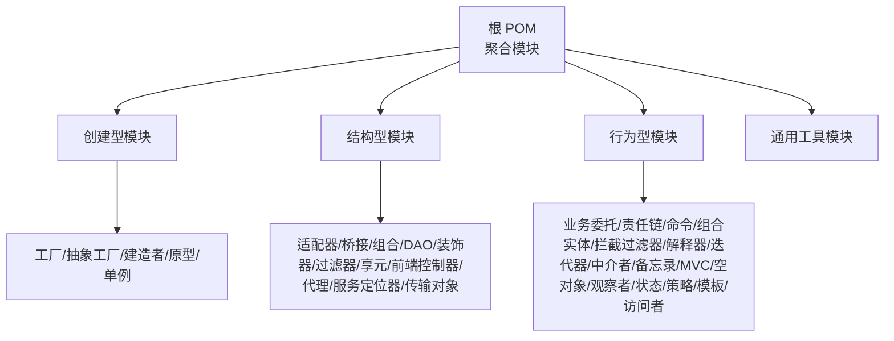

图表来源
- [pom.xml:11-16](file://pom.xml#L11-L16)

章节来源
- [pom.xml:1-24](file://pom.xml#L1-24)
- [readme.md:1-7](file://readme.md#L1-L7)

## 核心组件
本节聚焦于各模式的关键类与职责边界，帮助快速把握“做什么、如何做、何时用”。

- 单例（创建型）
  - 典型角色：实例持有者、获取入口、对外行为
  - 关键点：延迟初始化与线程安全的取舍；演示中采用饿汉式，适合演示场景
  - 参考路径：[SingletonObject.java:1-17](file://creational/singleton/src/main/java/com/future/rocket/gof23/singleton/SingletonObject.java#L1-L17)

- 观察者（行为型）
  - 典型角色：主题（Subject）、观察者（Observer）集合、通知机制
  - 关键点：状态变更触发通知；解耦发布与订阅双方
  - 参考路径：[Subject.java:1-43](file://behavioral/observer/src/main/java/com/future/rocket/gof23/observer/impl1/Subject.java#L1-L43)

- 适配器（结构型）
  - 典型角色：目标接口（MediaPlayer）、适配器（MediaAdapter）、被适配者（AdvancedMediaPlayer）
  - 关键点：通过构造期/运行时选择具体被适配者；对客户端屏蔽差异
  - 参考路径：[MediaAdapter.java:1-33](file://structural/adapter/src/main/java/com/future/rocket/gof23/adapter/struct/MediaAdapter.java#L1-L33)

- 命令（行为型）
  - 典型角色：请求封装（Order）、调用者（Broker）、接收者（Stock）
  - 关键点：将“请求”作为一等对象，支持排队、回放、撤销等扩展
  - 参考路径：[Broker.java:1-19](file://behavioral/command/src/main/java/com/future/rocket/gof23/command/invoker/Broker.java#L1-L19)

- 工厂（创建型）
  - 典型角色：工厂（ShapeFactory）、产品族（Circle/Square/Rectangle）
  - 关键点：将“创建”从使用端剥离；抽象工厂扩展为同一产品族的多工厂
  - 参考路径：[ShapeFactory.java:1-22](file://creational/factory/src/main/java/com/future/rocket/gof23/factory/build/ShapeFactory.java#L1-L22)
  - 抽象工厂参考：[AbstractFactory.java:1-9](file://creational/abstractfactory/src/main/java/com/future/rocket/gof23/abs/factory/build/AbstractFactory.java#L1-L9)

- 装饰器（结构型）
  - 典型角色：基础接口（Shape）、装饰器基类（ShapeDecorator）
  - 关键点：动态叠加职责，避免类爆炸；装饰器持有被装饰对象
  - 参考路径：[ShapeDecorator.java:1-13](file://structural/decorator/src/main/java/com/future/rocket/gof23/decorator/struct/ShapeDecorator.java#L1-L13)

- 模板方法（行为型）
  - 典型角色：抽象类（Game）、具体步骤实现
  - 关键点：固定算法骨架，子类决定具体步骤；强调“稳定与变化分离”
  - 参考路径：[Game.java:1-14](file://behavioral/template/src/main/java/com/future/rocket/gof23/template/abs/Game.java#L1-L14)

- 策略（行为型）
  - 典型角色：上下文（Context）、策略接口（Strategy）
  - 关键点：运行期切换算法；与工厂/注入结合实现策略选择
  - 参考路径：[Context.java:1-16](file://behavioral/strategy/src/main/java/com/future/rocket/gof23/strategy/context/Context.java#L1-L16)

- 享元（结构型）
  - 典型角色：享元工厂（ShapeFactory）、内部状态（颜色）、缓存
  - 关键点：共享内部状态，减少对象数量；并发安全的缓存策略
  - 参考路径：[ShapeFactory.java:1-18](file://structural/flyweight/src/main/java/com/future/rocket/gof23/flyweight/factory/ShapeFactory.java#L1-L18)

- 状态（行为型）
  - 典型角色：状态接口（State）、上下文（Context）
  - 关键点：将状态转换逻辑封装到状态类；避免巨大条件分支
  - 参考路径：[State.java:1-8](file://behavioral/state/src/main/java/com/future/rocket/gof23/state/iface/State.java#L1-L8)

- 建造者（创建型）
  - 典型角色：构建器（MealBuilder）、产品（Meal）
  - 关键点：分步构建复杂对象；与工厂配合区分“创建 vs 组装”
  - 参考路径：[MealBuilder.java:1-25](file://creational/builder/src/main/java/com/future/rocket/gof23/builder/build/MealBuilder.java#L1-L25)

- 代理（结构型）
  - 典型角色：代理（ProxyImage）、真实主题（RealImage）
  - 关键点：延迟加载、权限控制、日志统计等横切关注点
  - 参考路径：[ProxyImage.java:1-21](file://structural/proxy/src/main/java/com/future/rocket/gof23/proxy/struct/ProxyImage.java#L1-L21)

章节来源
- [SingletonObject.java:1-17](file://creational/singleton/src/main/java/com/future/rocket/gof23/singleton/SingletonObject.java#L1-L17)
- [Subject.java:1-43](file://behavioral/observer/src/main/java/com/future/rocket/gof23/observer/impl1/Subject.java#L1-L43)
- [MediaAdapter.java:1-33](file://structural/adapter/src/main/java/com/future/rocket/gof23/adapter/struct/MediaAdapter.java#L1-L33)
- [Broker.java:1-19](file://behavioral/command/src/main/java/com/future/rocket/gof23/command/invoker/Broker.java#L1-L19)
- [ShapeFactory.java:1-22](file://creational/factory/src/main/java/com/future/rocket/gof23/factory/build/ShapeFactory.java#L1-L22)
- [AbstractFactory.java:1-9](file://creational/abstractfactory/src/main/java/com/future/rocket/gof23/abs/factory/build/AbstractFactory.java#L1-L9)
- [ShapeDecorator.java:1-13](file://structural/decorator/src/main/java/com/future/rocket/gof23/decorator/struct/ShapeDecorator.java#L1-L13)
- [Game.java:1-14](file://behavioral/template/src/main/java/com/future/rocket/gof23/template/abs/Game.java#L1-L14)
- [Context.java:1-16](file://behavioral/strategy/src/main/java/com/future/rocket/gof23/strategy/context/Context.java#L1-L16)
- [ShapeFactory.java:1-18](file://structural/flyweight/src/main/java/com/future/rocket/gof23/flyweight/factory/ShapeFactory.java#L1-L18)
- [State.java:1-8](file://behavioral/state/src/main/java/com/future/rocket/gof23/state/iface/State.java#L1-L8)
- [MealBuilder.java:1-25](file://creational/builder/src/main/java/com/future/rocket/gof23/builder/build/MealBuilder.java#L1-L25)
- [ProxyImage.java:1-21](file://structural/proxy/src/main/java/com/future/rocket/gof23/proxy/struct/ProxyImage.java#L1-L21)

## 架构总览
下图展示了典型模式在系统中的交互关系与职责分工，体现“接口隔离、依赖倒置、开闭原则”的设计思想。

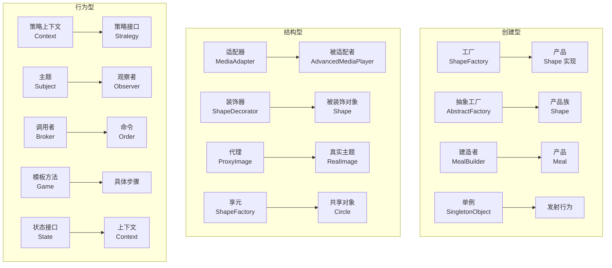

图表来源
- [ShapeFactory.java:1-22](file://creational/factory/src/main/java/com/future/rocket/gof23/factory/build/ShapeFactory.java#L1-L22)
- [AbstractFactory.java:1-9](file://creational/abstractfactory/src/main/java/com/future/rocket/gof23/abs/factory/build/AbstractFactory.java#L1-L9)
- [MealBuilder.java:1-25](file://creational/builder/src/main/java/com/future/rocket/gof23/builder/build/MealBuilder.java#L1-L25)
- [SingletonObject.java:1-17](file://creational/singleton/src/main/java/com/future/rocket/gof23/singleton/SingletonObject.java#L1-L17)
- [MediaAdapter.java:1-33](file://structural/adapter/src/main/java/com/future/rocket/gof23/adapter/struct/MediaAdapter.java#L1-L33)
- [ShapeDecorator.java:1-13](file://structural/decorator/src/main/java/com/future/rocket/gof23/decorator/struct/ShapeDecorator.java#L1-L13)
- [ProxyImage.java:1-21](file://structural/proxy/src/main/java/com/future/rocket/gof23/proxy/struct/ProxyImage.java#L1-L21)
- [ShapeFactory.java:1-18](file://structural/flyweight/src/main/java/com/future/rocket/gof23/flyweight/factory/ShapeFactory.java#L1-L18)
- [Context.java:1-16](file://behavioral/strategy/src/main/java/com/future/rocket/gof23/strategy/context/Context.java#L1-L16)
- [Subject.java:1-43](file://behavioral/observer/src/main/java/com/future/rocket/gof23/observer/impl1/Subject.java#L1-L43)
- [Broker.java:1-19](file://behavioral/command/src/main/java/com/future/rocket/gof23/command/invoker/Broker.java#L1-L19)
- [Game.java:1-14](file://behavioral/template/src/main/java/com/future/rocket/gof23/template/abs/Game.java#L1-L14)
- [State.java:1-8](file://behavioral/state/src/main/java/com/future/rocket/gof23/state/iface/State.java#L1-L8)

## 详细组件分析

### 单例模式
- 设计要点
  - 保持全局唯一实例，提供静态获取入口
  - 在演示场景中采用饿汉式，简洁直观；生产环境需考虑延迟初始化与并发安全
- 使用建议
  - 仅在确需全局共享状态或昂贵资源时使用
  - 避免过度使用导致测试困难与隐式耦合
- 适用场景
  - 配置中心、日志记录器、线程池等

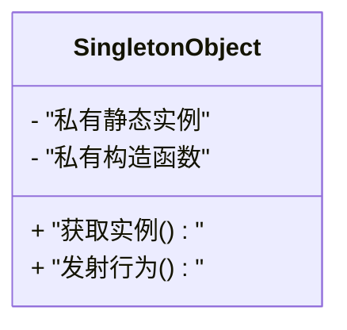

图表来源
- [SingletonObject.java:1-17](file://creational/singleton/src/main/java/com/future/rocket/gof23/singleton/SingletonObject.java#L1-L17)

章节来源
- [SingletonObject.java:1-17](file://creational/singleton/src/main/java/com/future/rocket/gof23/singleton/SingletonObject.java#L1-L17)

### 观察者模式
- 设计要点
  - 主题维护观察者列表，状态变化时批量通知
  - 支持附加/移除观察者，便于动态调整监听范围
- 使用建议
  - 将通知与业务解耦；避免循环依赖与内存泄漏
- 适用场景
  - 事件驱动、UI 刷新、指标上报

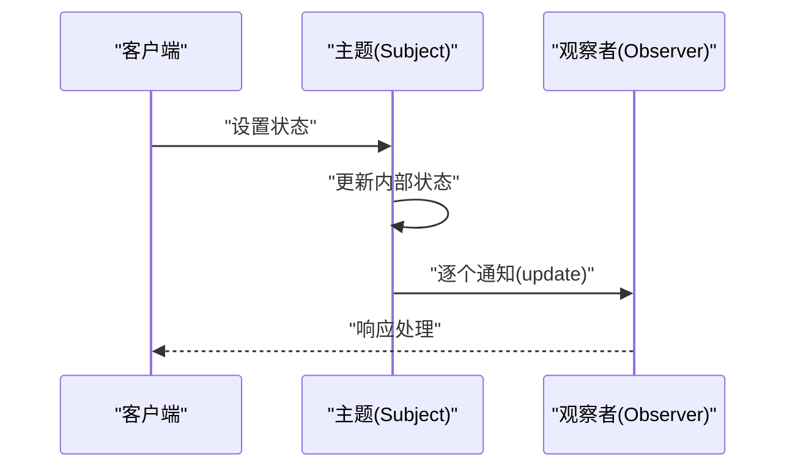

图表来源
- [Subject.java:1-43](file://behavioral/observer/src/main/java/com/future/rocket/gof23/observer/impl1/Subject.java#L1-L43)

章节来源
- [Subject.java:1-43](file://behavioral/observer/src/main/java/com/future/rocket/gof23/observer/impl1/Subject.java#L1-L43)

### 适配器模式
- 设计要点
  - 通过适配器将不兼容接口转换为目标接口
  - 适配器在构造期根据类型选择具体被适配者
- 使用建议
  - 优先使用组合而非继承；避免适配器膨胀
- 适用场景
  - 第三方库集成、遗留系统对接、协议转换

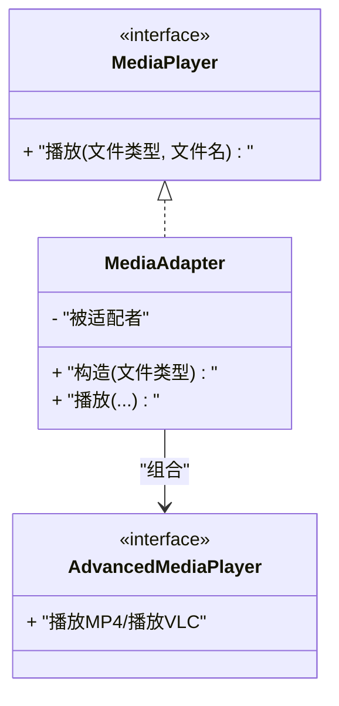

图表来源
- [MediaAdapter.java:1-33](file://structural/adapter/src/main/java/com/future/rocket/gof23/adapter/struct/MediaAdapter.java#L1-L33)

章节来源
- [MediaAdapter.java:1-33](file://structural/adapter/src/main/java/com/future/rocket/gof23/adapter/struct/MediaAdapter.java#L1-L33)

### 命令模式
- 设计要点
  - 将请求封装为对象，支持队列化、日志化与撤销
  - 调用者仅依赖命令接口，降低耦合
- 使用建议
  - 与宏命令、命令栈结合实现批量与撤销
- 适用场景
  - 撤销重做、异步执行、脚本化

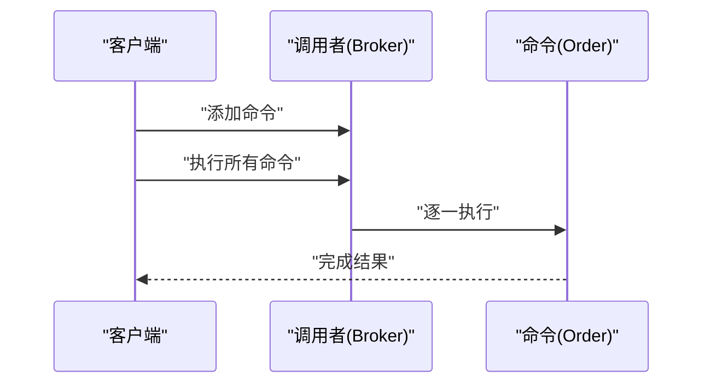

图表来源
- [Broker.java:1-19](file://behavioral/command/src/main/java/com/future/rocket/gof23/command/invoker/Broker.java#L1-L19)

章节来源
- [Broker.java:1-19](file://behavioral/command/src/main/java/com/future/rocket/gof23/command/invoker/Broker.java#L1-L19)

### 工厂与抽象工厂
- 设计要点
  - 工厂负责单一产品族的创建；抽象工厂负责多个产品族
  - 通过枚举/配置驱动产品选择，利于扩展
- 使用建议
  - 与策略/注入结合，实现运行期策略切换
- 适用场景
  - UI 主题、数据库驱动、跨平台渲染

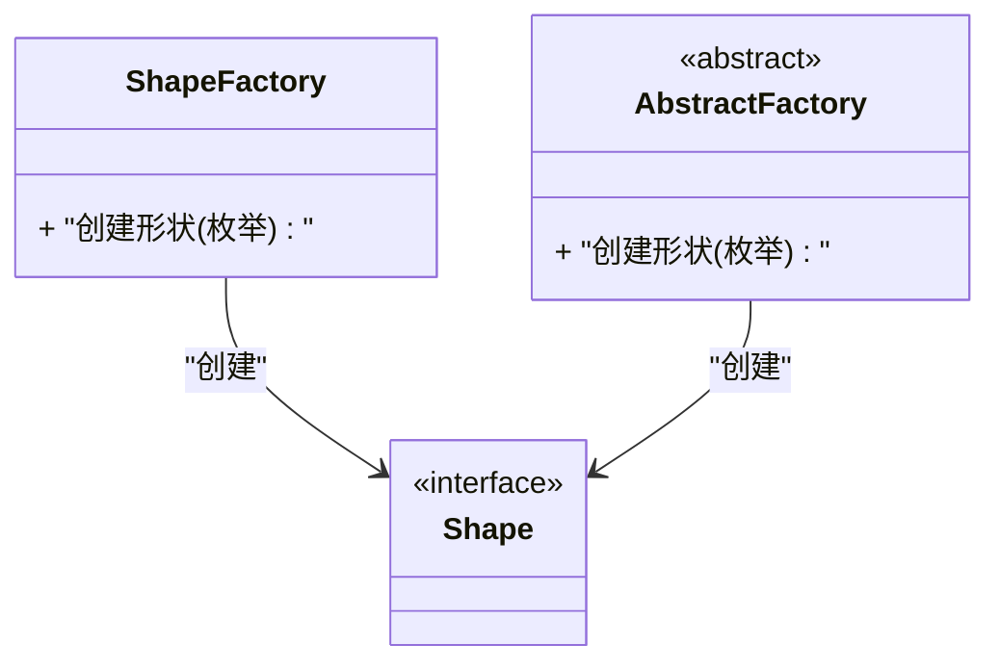

图表来源
- [ShapeFactory.java:1-22](file://creational/factory/src/main/java/com/future/rocket/gof23/factory/build/ShapeFactory.java#L1-L22)
- [AbstractFactory.java:1-9](file://creational/abstractfactory/src/main/java/com/future/rocket/gof23/abs/factory/build/AbstractFactory.java#L1-L9)

章节来源
- [ShapeFactory.java:1-22](file://creational/factory/src/main/java/com/future/rocket/gof23/factory/build/ShapeFactory.java#L1-L22)
- [AbstractFactory.java:1-9](file://creational/abstractfactory/src/main/java/com/future/rocket/gof23/abs/factory/build/AbstractFactory.java#L1-L9)

### 装饰器模式
- 设计要点
  - 通过组合叠加职责，避免类爆炸
  - 装饰器持有被装饰对象，形成链式调用
- 使用建议
  - 明确职责边界，避免过度装饰导致性能与可读性下降
- 适用场景
  - 权限校验、日志、缓存、压缩

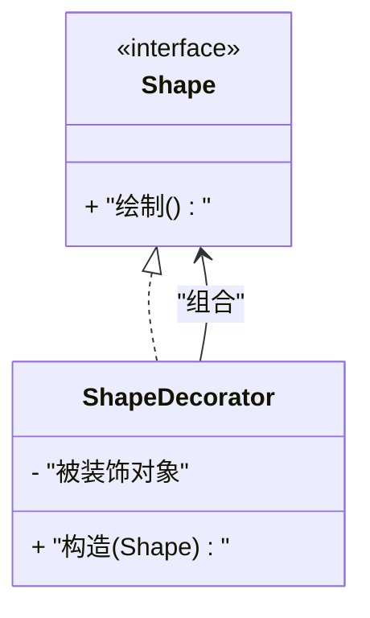

图表来源
- [ShapeDecorator.java:1-13](file://structural/decorator/src/main/java/com/future/rocket/gof23/decorator/struct/ShapeDecorator.java#L1-L13)

章节来源
- [ShapeDecorator.java:1-13](file://structural/decorator/src/main/java/com/future/rocket/gof23/decorator/struct/ShapeDecorator.java#L1-L13)

### 模板方法模式
- 设计要点
  - 固定算法骨架，子类实现可变步骤
  - 通过“钩子”控制扩展点
- 使用建议
  - 将不变逻辑上移，可变逻辑下沉
- 适用场景
  - 框架扩展点、工作流引擎

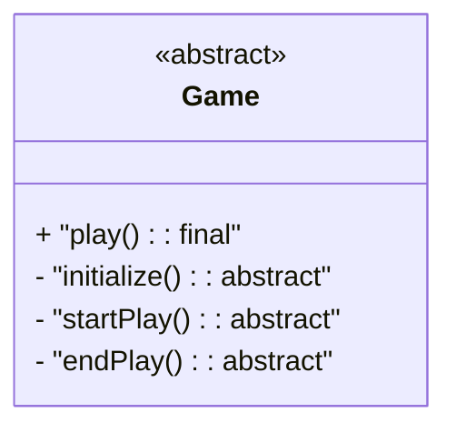

图表来源
- [Game.java:1-14](file://behavioral/template/src/main/java/com/future/rocket/gof23/template/abs/Game.java#L1-L14)

章节来源
- [Game.java:1-14](file://behavioral/template/src/main/java/com/future/rocket/gof23/template/abs/Game.java#L1-L14)

### 策略模式
- 设计要点
  - 上下文持有策略接口，运行期切换算法
  - 与工厂/DI 结合，实现策略注册与选择
- 使用建议
  - 对策略进行编号/标签管理，便于灰度与回滚
- 适用场景
  - 计算策略、路由策略、推荐策略

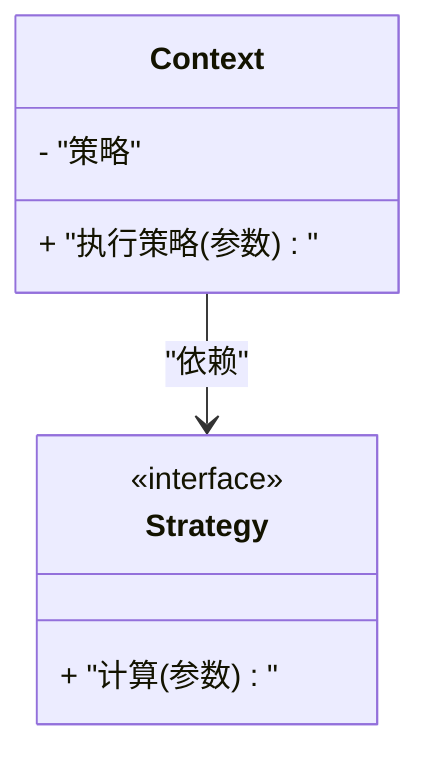

图表来源
- [Context.java:1-16](file://behavioral/strategy/src/main/java/com/future/rocket/gof23/strategy/context/Context.java#L1-L16)

章节来源
- [Context.java:1-16](file://behavioral/strategy/src/main/java/com/future/rocket/gof23/strategy/context/Context.java#L1-L16)

### 享元模式
- 设计要点
  - 共享内部状态，外部状态由调用方传入
  - 使用并发安全缓存提升性能
- 使用建议
  - 区分内外部状态；避免缓存成为热点
- 适用场景
  - 文字渲染、连接池、线程池

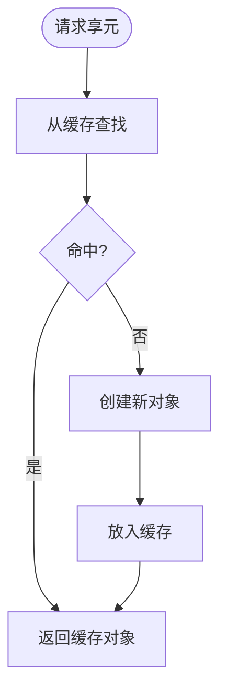

图表来源
- [ShapeFactory.java:1-18](file://structural/flyweight/src/main/java/com/future/rocket/gof23/flyweight/factory/ShapeFactory.java#L1-L18)

章节来源
- [ShapeFactory.java:1-18](file://structural/flyweight/src/main/java/com/future/rocket/gof23/flyweight/factory/ShapeFactory.java#L1-L18)

### 状态模式
- 设计要点
  - 将状态转换逻辑封装到状态类
  - 通过上下文传递状态，避免巨大条件分支
- 使用建议
  - 使用状态机库或枚举+映射表，增强可维护性
- 适用场景
  - 游戏状态、工作流状态、协议状态机

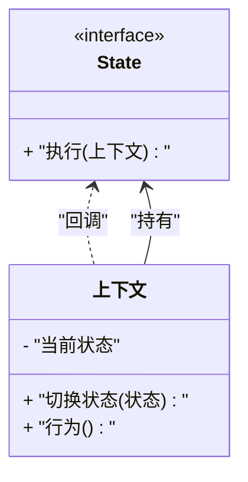

图表来源
- [State.java:1-8](file://behavioral/state/src/main/java/com/future/rocket/gof23/state/iface/State.java#L1-L8)

章节来源
- [State.java:1-8](file://behavioral/state/src/main/java/com/future/rocket/gof23/state/iface/State.java#L1-L8)

### 建造者模式
- 设计要点
  - 分步构建复杂对象，逐步组装
  - 与工厂结合，明确“创建 vs 组装”的职责
- 使用建议
  - 提供默认套餐与自定义套餐两条路径
- 适用场景
  - 复杂对象构建、配置项装配

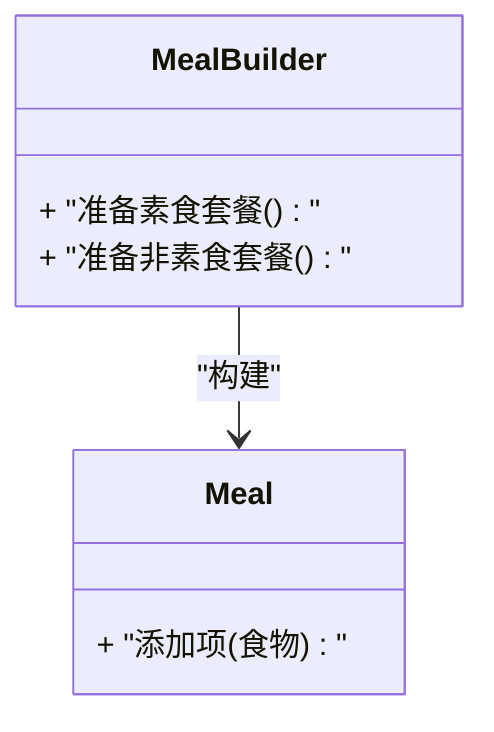

图表来源
- [MealBuilder.java:1-25](file://creational/builder/src/main/java/com/future/rocket/gof23/builder/build/MealBuilder.java#L1-L25)

章节来源
- [MealBuilder.java:1-25](file://creational/builder/src/main/java/com/future/rocket/gof23/builder/build/MealBuilder.java#L1-L25)

### 代理模式
- 设计要点
  - 通过代理延迟加载、控制访问、增强功能
  - 注意代理层级过深导致的性能与调试成本
- 使用建议
  - 与 AOP/拦截器结合，统一横切关注点
- 适用场景
  - 缓存代理、远程代理、安全代理

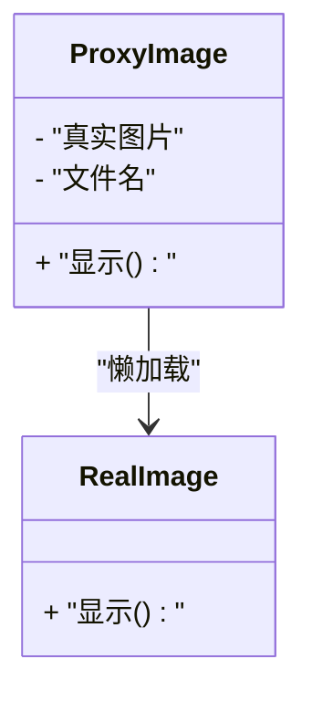

图表来源
- [ProxyImage.java:1-21](file://structural/proxy/src/main/java/com/future/rocket/gof23/proxy/struct/ProxyImage.java#L1-L21)

章节来源
- [ProxyImage.java:1-21](file://structural/proxy/src/main/java/com/future/rocket/gof23/proxy/struct/ProxyImage.java#L1-L21)

## 依赖分析
- 内聚与耦合
  - 各模式内部高内聚，模块间低耦合；通过接口隔离具体实现
- 外部依赖
  - 项目为示例工程，未引入额外第三方依赖，便于移植与教学
- 循环依赖
  - 未发现直接循环依赖；若扩展业务层，应避免跨模块循环导入

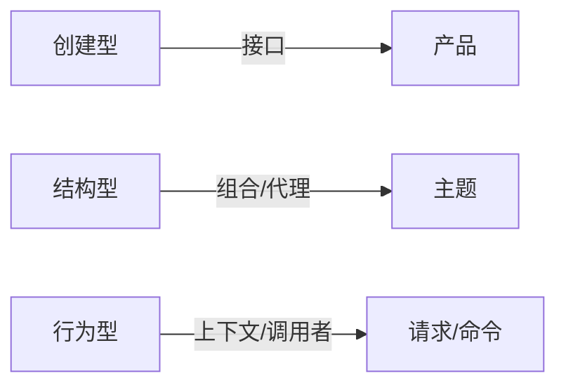

图表来源
- [ShapeFactory.java:1-22](file://creational/factory/src/main/java/com/future/rocket/gof23/factory/build/ShapeFactory.java#L1-L22)
- [MediaAdapter.java:1-33](file://structural/adapter/src/main/java/com/future/rocket/gof23/adapter/struct/MediaAdapter.java#L1-L33)
- [Broker.java:1-19](file://behavioral/command/src/main/java/com/future/rocket/gof23/command/invoker/Broker.java#L1-L19)

章节来源
- [pom.xml:1-24](file://pom.xml#L1-L24)

## 性能考量
- 单例
  - 饿汉式无锁，启动即占用内存；如需延迟可改用双检/静态内部类
- 享元
  - 并发缓存可提升命中率；注意缓存淘汰策略与内存上限
- 代理
  - 懒加载减少初始化成本；但可能增加首次调用延迟
- 观察者
  - 大量观察者时注意通知开销；可采用异步通知或批处理
- 工厂/抽象工厂
  - 产品创建频繁时可引入对象池；注意生命周期管理
- 策略/模板
  - 运行期选择与反射结合会带来轻微开销；可用枚举或常量映射替代

## 故障排查指南
- 常见问题
  - 单例并发问题：检查是否需要延迟初始化与同步
  - 适配器类型不匹配：确认文件类型枚举与被适配者映射
  - 观察者未移除：导致内存泄漏；确保 detach/detachAllObserver 的调用
  - 代理未初始化：懒加载需显式触发一次 display
- 排查步骤
  - 打印关键路径日志（状态变更、命令执行、适配器选择）
  - 使用单元测试覆盖边界条件（空输入、异常类型）
  - 通过最小可复现案例定位问题

章节来源
- [Subject.java:1-43](file://behavioral/observer/src/main/java/com/future/rocket/gof23/observer/impl1/Subject.java#L1-L43)
- [MediaAdapter.java:1-33](file://structural/adapter/src/main/java/com/future/rocket/gof23/adapter/struct/MediaAdapter.java#L1-L33)
- [ProxyImage.java:1-21](file://structural/proxy/src/main/java/com/future/rocket/gof23/proxy/struct/ProxyImage.java#L1-L21)

## 结论
gof23Rockets 以清晰的模块划分与稳定的接口设计，为 23 种设计模式提供了可直接复用的范式。遵循“接口隔离、依赖倒置、开闭原则”，在工程实践中可显著提升可维护性与可扩展性。建议在团队中推广“先模式后实现”的设计流程，并结合测试与性能评估持续优化。

## 附录

### 模式选择决策树（简化版）
- 需要全局唯一实例？→ 单例
- 需要延迟/惰性创建？→ 工厂/建造者
- 需要动态切换算法？→ 策略
- 需要固定流程骨架？→ 模板方法
- 需要封装请求/支持队列/撤销？→ 命令
- 需要解耦接口差异？→ 适配器
- 需要叠加职责而不改类结构？→ 装饰器
- 需要共享内部状态？→ 享元
- 需要将状态转换逻辑封装？→ 状态
- 需要集中管理横切关注点？→ 代理

### 应用场景判断标准
- 可扩展性：优先选择策略、模板、适配器、装饰器
- 可维护性：优先选择单例（谨慎）、享元、代理
- 可测试性：优先选择工厂、策略、命令（便于桩件替换）

### 代码质量保证与测试策略
- 单元测试
  - 针对核心流程（工厂创建、策略执行、命令队列、适配器选择）编写用例
  - 边界用例：空输入、非法类型、并发访问
- 集成测试
  - 模拟真实调用链（如 Broker -> Order -> Receiver），验证一致性
- 性能测试
  - 重点测试享元缓存命中率、代理懒加载首耗时、观察者通知吞吐

### 重构指导与演进路径
- 早期阶段
  - 以“可运行”为目标，优先实现核心流程与最小可测单元
- 成长期
  - 引入策略/模板/适配器，拆分可变部分；抽取公共接口
- 成熟期
  - 引入代理/AOP 统一横切关注点；引入缓存/池化优化热点路径

### 团队协作与代码评审最佳实践
- 规范
  - 统一包名与类名；每个模块至少包含“接口、实现、入口类”
- 评审清单
  - 是否符合单一职责；接口是否稳定；是否存在硬编码；是否考虑并发与异常
- 版本与文档
  - 每个模式保留“README/示例入口/单元测试”，形成知识资产