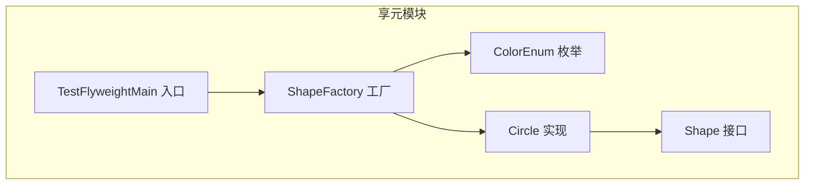
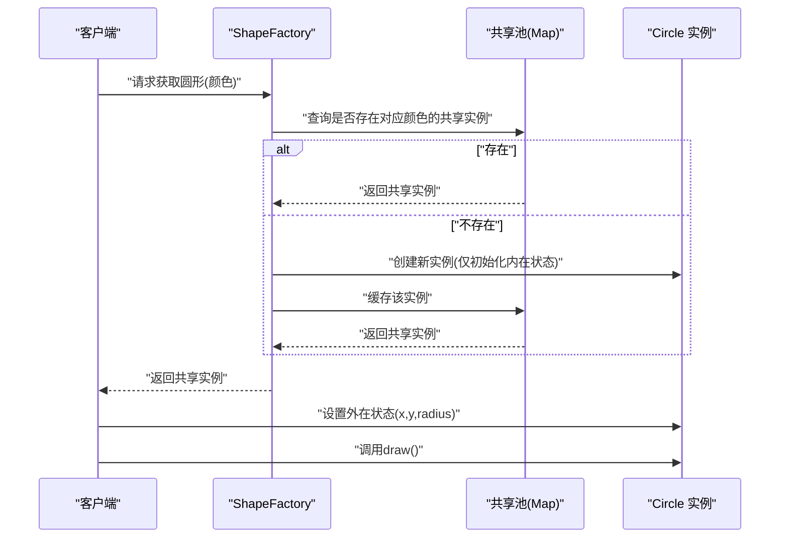
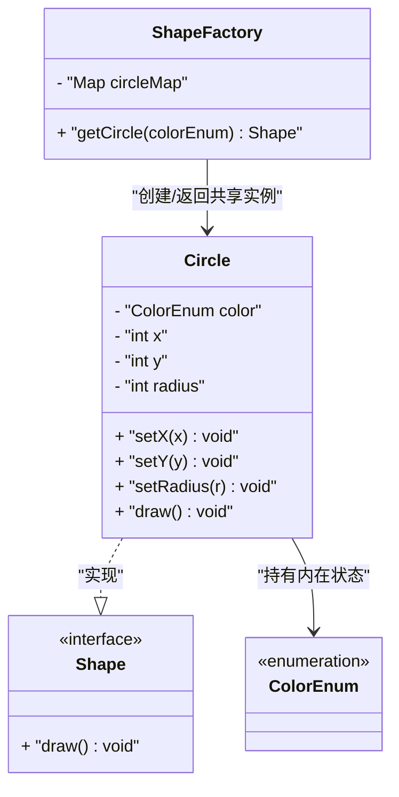
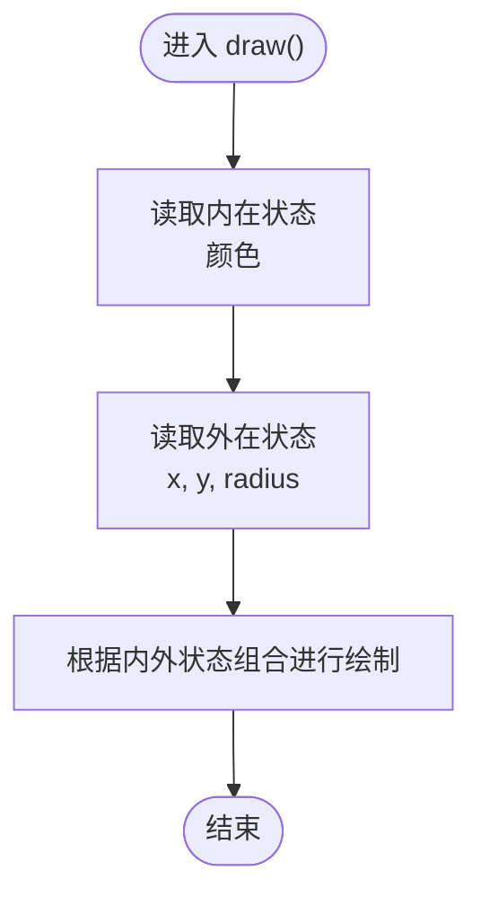
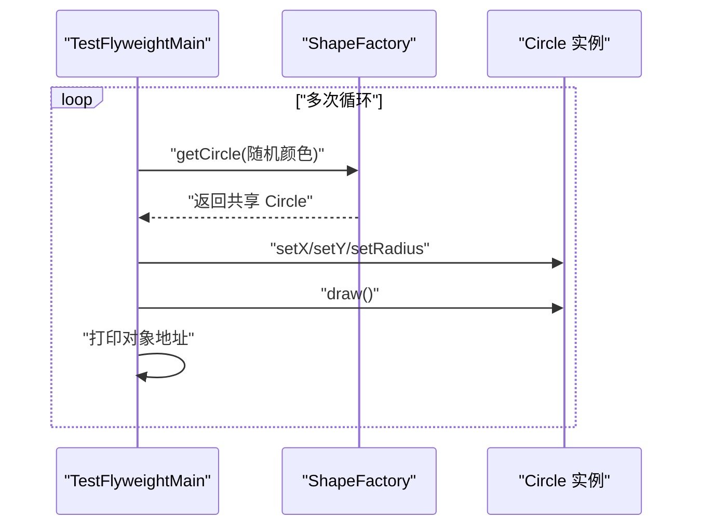
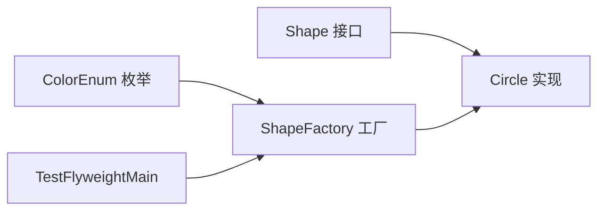

# 享元模式

<cite>
**本文引用的文件**
- [ShapeFactory.java](file://structural/flyweight/src/main/java/com/future/rocket/gof23/flyweight/factory/ShapeFactory.java)
- [Circle.java](file://structural/flyweight/src/main/java/com/future/rocket/gof23/flyweight/impl/Circle.java)
- [Shape.java](file://structural/flyweight/src/main/java/com/future/rocket/gof23/flyweight/iface/Shape.java)
- [ColorEnum.java](file://structural/flyweight/src/main/java/com/future/rocket/gof23/flyweight/enums/ColorEnum.java)
- [TestFlyweightMain.java](file://structural/flyweight/src/main/java/com/future/rocket/gof23/flyweight/TestFlyweightMain.java)
- [readme.md](file://structural/flyweight/readme.md)
</cite>

## 目录
1. [引言](#引言)
2. [项目结构](#项目结构)
3. [核心组件](#核心组件)
4. [架构总览](#架构总览)
5. [详细组件分析](#详细组件分析)
6. [依赖关系分析](#依赖关系分析)
7. [性能考量](#性能考量)
8. [故障排查指南](#故障排查指南)
9. [结论](#结论)
10. [附录](#附录)

## 引言
本文件系统性阐述享元（Flyweight）模式在图形绘制系统中的应用与实现，重点说明如何通过“内在状态”与“外在状态”的分离，实现大量细粒度对象的高效复用与内存优化。文档基于仓库中的图形绘制示例，解析 ShapeFactory 工厂的共享机制、Circle 类对内在/外在状态的处理方式，并给出内存使用对比与性能优化建议，帮助读者在大规模对象场景下正确运用享元模式。

## 项目结构
享元模式示例位于 structural/flyweight 模块中，采用接口-实现-工厂-枚举-测试入口的经典分层组织：
- 接口层：定义统一的绘制能力
- 实现层：具体图形（Circle）
- 工厂层：负责对象池化与共享
- 枚举层：定义可共享的内在状态集合
- 测试入口：演示对象复用与外在状态注入

图表来源
- [ShapeFactory.java:10-17](file://structural/flyweight/src/main/java/com/future/rocket/gof23/flyweight/factory/ShapeFactory.java#L10-L17)
- [Circle.java:6-40](file://structural/flyweight/src/main/java/com/future/rocket/gof23/flyweight/impl/Circle.java#L6-L40)
- [Shape.java:3-5](file://structural/flyweight/src/main/java/com/future/rocket/gof23/flyweight/iface/Shape.java#L3-L5)
- [ColorEnum.java:3-9](file://structural/flyweight/src/main/java/com/future/rocket/gof23/flyweight/enums/ColorEnum.java#L3-L9)
- [TestFlyweightMain.java:14-32](file://structural/flyweight/src/main/java/com/future/rocket/gof23/flyweight/TestFlyweightMain.java#L14-L32)

章节来源
- [readme.md:1-8](file://structural/flyweight/readme.md#L1-L8)
- [ShapeFactory.java:10-17](file://structural/flyweight/src/main/java/com/future/rocket/gof23/flyweight/factory/ShapeFactory.java#L10-L17)
- [Circle.java:6-40](file://structural/flyweight/src/main/java/com/future/rocket/gof23/flyweight/impl/Circle.java#L6-L40)
- [Shape.java:3-5](file://structural/flyweight/src/main/java/com/future/rocket/gof23/flyweight/iface/Shape.java#L3-L5)
- [ColorEnum.java:3-9](file://structural/flyweight/src/main/java/com/future/rocket/gof23/flyweight/enums/ColorEnum.java#L3-L9)
- [TestFlyweightMain.java:14-32](file://structural/flyweight/src/main/java/com/future/rocket/gof23/flyweight/TestFlyweightMain.java#L14-L32)

## 核心组件
- Shape 接口：定义统一的绘制行为，作为享元对象的抽象契约。
- Circle 实现：承载内在状态（颜色）与外在状态（坐标、半径），通过 setter 注入外在状态后执行绘制。
- ShapeFactory 工厂：维护一个线程安全的内在状态到对象实例的映射，实现对象池与共享。
- ColorEnum 枚举：定义可共享的内在状态集合，确保对象复用的键值稳定。
- TestFlyweightMain：演示如何从工厂获取共享对象，注入随机外在状态并调用绘制。

章节来源
- [Shape.java:3-5](file://structural/flyweight/src/main/java/com/future/rocket/gof23/flyweight/iface/Shape.java#L3-L5)
- [Circle.java:6-40](file://structural/flyweight/src/main/java/com/future/rocket/gof23/flyweight/impl/Circle.java#L6-L40)
- [ShapeFactory.java:10-17](file://structural/flyweight/src/main/java/com/future/rocket/gof23/flyweight/factory/ShapeFactory.java#L10-L17)
- [ColorEnum.java:3-9](file://structural/flyweight/src/main/java/com/future/rocket/gof23/flyweight/enums/ColorEnum.java#L3-L9)
- [TestFlyweightMain.java:14-32](file://structural/flyweight/src/main/java/com/future/rocket/gof23/flyweight/TestFlyweightMain.java#L14-L32)

## 架构总览
享元模式通过“内在状态共享 + 外在状态注入”的方式，将大量对象的公共部分抽取为共享实例，显著降低内存占用与对象创建成本。整体流程如下：

图表来源
- [ShapeFactory.java:14-16](file://structural/flyweight/src/main/java/com/future/rocket/gof23/flyweight/factory/ShapeFactory.java#L14-L16)
- [Circle.java:14-28](file://structural/flyweight/src/main/java/com/future/rocket/gof23/flyweight/impl/Circle.java#L14-L28)
- [TestFlyweightMain.java:20-27](file://structural/flyweight/src/main/java/com/future/rocket/gof23/flyweight/TestFlyweightMain.java#L20-L27)

## 详细组件分析

### ShapeFactory 工厂设计与对象池
- 设计要点
  - 使用并发安全的映射结构存储“内在状态→共享实例”的键值对，避免重复创建。
  - 通过惰性创建策略，在首次访问时才构造对象，提升启动阶段的资源利用率。
  - 返回的是共享实例，后续调用者可直接注入外在状态并复用同一对象。
- 线程安全
  - 采用并发容器保证多线程环境下的读写一致性，避免竞态条件导致的重复创建或数据不一致。
- 性能特性
  - 命中共享池时为 O(1) 查找；未命中时为 O(1) 创建+缓存，整体开销极低。

图表来源
- [ShapeFactory.java:10-17](file://structural/flyweight/src/main/java/com/future/rocket/gof23/flyweight/factory/ShapeFactory.java#L10-L17)
- [Circle.java:6-40](file://structural/flyweight/src/main/java/com/future/rocket/gof23/flyweight/impl/Circle.java#L6-L40)
- [Shape.java:3-5](file://structural/flyweight/src/main/java/com/future/rocket/gof23/flyweight/iface/Shape.java#L3-L5)
- [ColorEnum.java:3-9](file://structural/flyweight/src/main/java/com/future/rocket/gof23/flyweight/enums/ColorEnum.java#L3-L9)

章节来源
- [ShapeFactory.java:10-17](file://structural/flyweight/src/main/java/com/future/rocket/gof23/flyweight/factory/ShapeFactory.java#L10-L17)

### Circle 类：内在状态与外在状态的分离
- 内在状态（共享）
  - 颜色：由 ColorEnum 表示，作为工厂的键值，决定对象是否复用。
  - Circle 的构造函数仅接收内在状态，避免在构造阶段引入外在状态。
- 外在状态（非共享）
  - 坐标 x、y 与半径 radius：通过 setter 注入，每次绘制时动态变化。
- 绘制流程
  - draw() 方法同时使用内在状态（颜色）与外在状态（坐标、半径），完成一次完整渲染。
- 可观测性
  - toString() 输出内在状态与对象地址，便于验证对象复用与唯一性。

图表来源
- [Circle.java:30-33](file://structural/flyweight/src/main/java/com/future/rocket/gof23/flyweight/impl/Circle.java#L30-L33)

章节来源
- [Circle.java:6-40](file://structural/flyweight/src/main/java/com/future/rocket/gof23/flyweight/impl/Circle.java#L6-L40)

### 测试入口：对象复用与外在状态注入
- 随机颜色选择：从预定义的枚举数组中随机挑选，确保工厂可复用不同颜色的共享实例。
- 外在状态注入：循环中为每个共享 Circle 设置不同的坐标与半径，模拟真实场景。
- 输出验证：打印对象地址与绘制结果，直观体现对象复用与状态分离的效果。

图表来源
- [TestFlyweightMain.java:19-32](file://structural/flyweight/src/main/java/com/future/rocket/gof23/flyweight/TestFlyweightMain.java#L19-L32)
- [ShapeFactory.java:14-16](file://structural/flyweight/src/main/java/com/future/rocket/gof23/flyweight/factory/ShapeFactory.java#L14-L16)

章节来源
- [TestFlyweightMain.java:14-54](file://structural/flyweight/src/main/java/com/future/rocket/gof23/flyweight/TestFlyweightMain.java#L14-L54)

## 依赖关系分析
- 接口-实现解耦：Shape 接口隔离了具体图形类型，Circle 实现仅关注内在/外在状态的组合使用。
- 工厂-实现耦合：ShapeFactory 与 Circle 存在直接依赖，但通过接口与枚举解耦了业务逻辑与状态模型。
- 枚举-工厂耦合：ColorEnum 作为工厂的键类型，确保共享键的稳定性与可枚举性。
- 客户端-工厂耦合：TestFlyweightMain 仅依赖工厂接口，实现对底层实现细节的屏蔽。

图表来源
- [Shape.java:3-5](file://structural/flyweight/src/main/java/com/future/rocket/gof23/flyweight/iface/Shape.java#L3-L5)
- [Circle.java:6-40](file://structural/flyweight/src/main/java/com/future/rocket/gof23/flyweight/impl/Circle.java#L6-L40)
- [ShapeFactory.java:10-17](file://structural/flyweight/src/main/java/com/future/rocket/gof23/flyweight/factory/ShapeFactory.java#L10-L17)
- [ColorEnum.java:3-9](file://structural/flyweight/src/main/java/com/future/rocket/gof23/flyweight/enums/ColorEnum.java#L3-L9)
- [TestFlyweightMain.java:14-32](file://structural/flyweight/src/main/java/com/future/rocket/gof23/flyweight/TestFlyweightMain.java#L14-L32)

章节来源
- [ShapeFactory.java:10-17](file://structural/flyweight/src/main/java/com/future/rocket/gof23/flyweight/factory/ShapeFactory.java#L10-L17)
- [Circle.java:6-40](file://structural/flyweight/src/main/java/com/future/rocket/gof23/flyweight/impl/Circle.java#L6-L40)
- [Shape.java:3-5](file://structural/flyweight/src/main/java/com/future/rocket/gof23/flyweight/iface/Shape.java#L3-L5)
- [ColorEnum.java:3-9](file://structural/flyweight/src/main/java/com/future/rocket/gof23/flyweight/enums/ColorEnum.java#L3-L9)
- [TestFlyweightMain.java:14-32](file://structural/flyweight/src/main/java/com/future/rocket/gof23/flyweight/TestFlyweightMain.java#L14-L32)

## 性能考量
- 内存使用对比
  - 传统方案：每种颜色与位置组合均创建独立对象，对象数量随颜色与位置组合呈乘法增长，内存占用高。
  - 享元方案：仅按颜色创建共享对象，位置等外在状态按需注入，对象数量接近颜色种类数，内存占用显著下降。
- 时间复杂度
  - 获取共享对象：O(1) 平均查找与创建（含缓存）。
  - 绘制操作：O(1)，仅涉及少量字段读取与输出。
- 线程安全
  - 使用并发容器保证多线程环境下的稳定性，避免重复创建与数据竞争。
- 适用场景
  - 大量同构对象且仅有少量可变状态的场景（如图形绘制、文本样式、游戏元素等）。
- 优化建议
  - 将可共享的内在状态收敛到有限枚举或常量集，提升复用率。
  - 对外在状态进行批量注入与延迟计算，减少频繁调用带来的开销。
  - 在高频绘制场景中，优先使用共享对象并尽量减少对象生命周期内的状态变更次数。

## 故障排查指南
- 现象：颜色不生效或绘制异常
  - 排查点：确认传入工厂的颜色枚举值与 Circle 构造时使用的内在状态一致；检查外在状态注入顺序与范围。
  - 参考路径：[Circle.java:14-28](file://structural/flyweight/src/main/java/com/future/rocket/gof23/flyweight/impl/Circle.java#L14-L28)
- 现象：对象地址不一致导致误判复用
  - 排查点：验证工厂是否返回同一共享实例；确认枚举键值稳定且无额外包装。
  - 参考路径：[ShapeFactory.java:14-16](file://structural/flyweight/src/main/java/com/future/rocket/gof23/flyweight/factory/ShapeFactory.java#L14-L16)
- 现象：多线程环境下出现重复创建
  - 排查点：确认工厂使用并发容器；避免在外部自行创建同键对象。
  - 参考路径：[ShapeFactory.java:12](file://structural/flyweight/src/main/java/com/future/rocket/gof23/flyweight/factory/ShapeFactory.java#L12)

章节来源
- [Circle.java:14-28](file://structural/flyweight/src/main/java/com/future/rocket/gof23/flyweight/impl/Circle.java#L14-L28)
- [ShapeFactory.java:12-16](file://structural/flyweight/src/main/java/com/future/rocket/gof23/flyweight/factory/ShapeFactory.java#L12-L16)

## 结论
享元模式通过“内在状态共享 + 外在状态注入”的设计，有效降低了大量细粒度对象的内存占用与创建成本。在图形绘制系统中，ColorEnum 作为内在状态键，Circle 作为共享载体，配合 ShapeFactory 的对象池与并发缓存，实现了高性能、可扩展的渲染架构。结合本文的实现要点与优化建议，可在大规模对象场景中稳定落地享元模式。

## 附录
- 应用场景
  - 图形绘制：颜色、字体、纹理等可共享，坐标、尺寸等可变。
  - 文本编辑：字符样式可共享，光标位置可变。
  - 游戏开发：角色外观可共享，位置与朝向可变。
- 最佳实践
  - 明确区分内在/外在状态，确保内在状态不可变且可枚举。
  - 使用工厂集中管理共享对象，避免分散创建。
  - 在多线程环境中使用并发容器，保障线程安全。
  - 通过测试入口验证对象复用与状态注入的正确性。