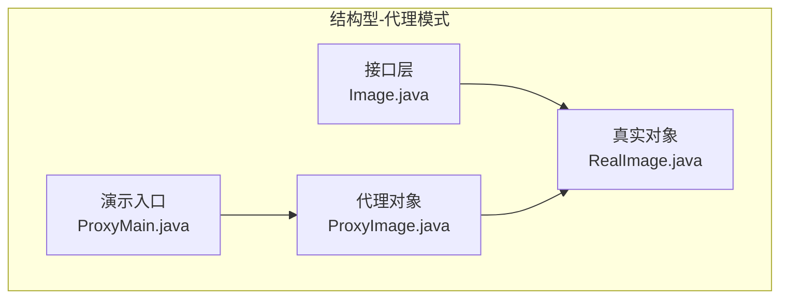
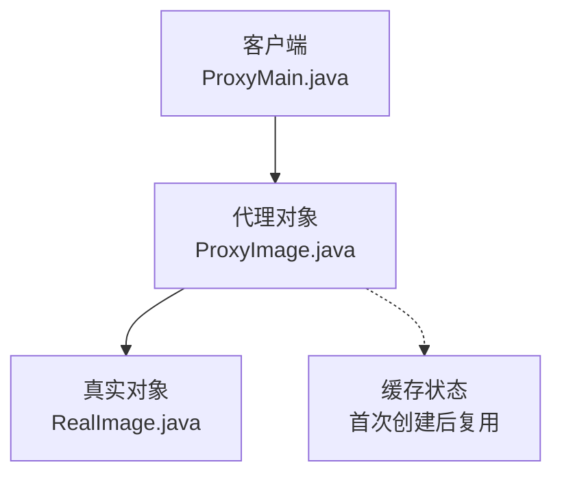
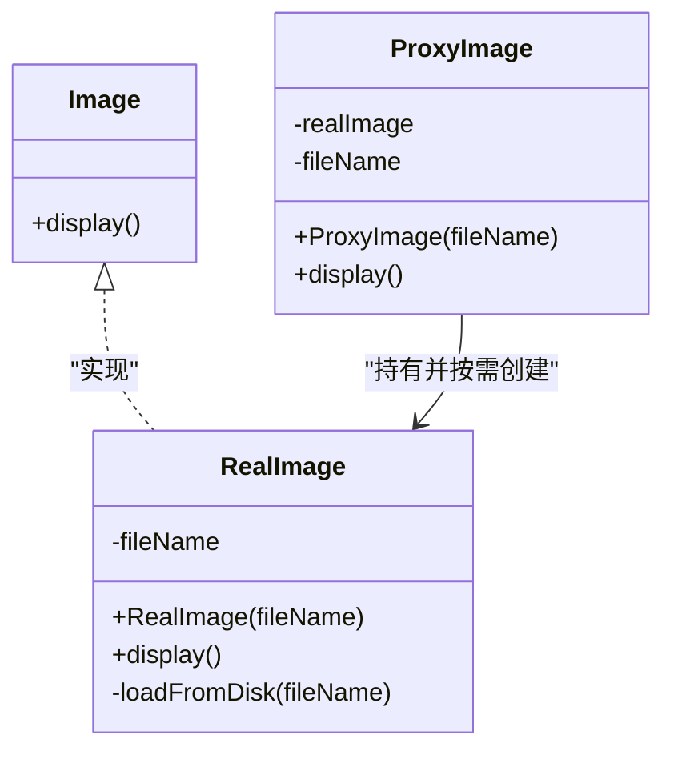
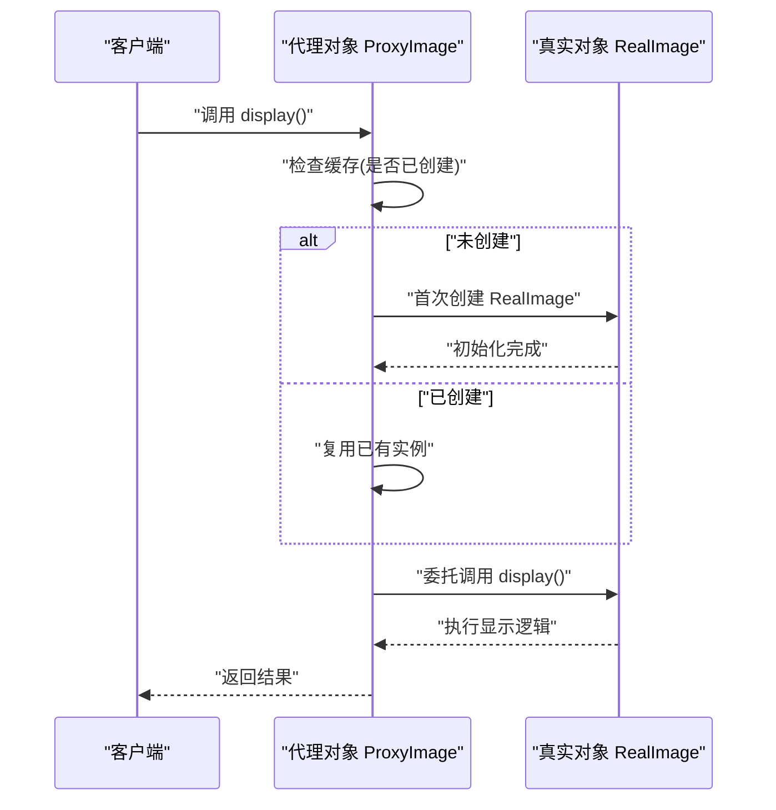
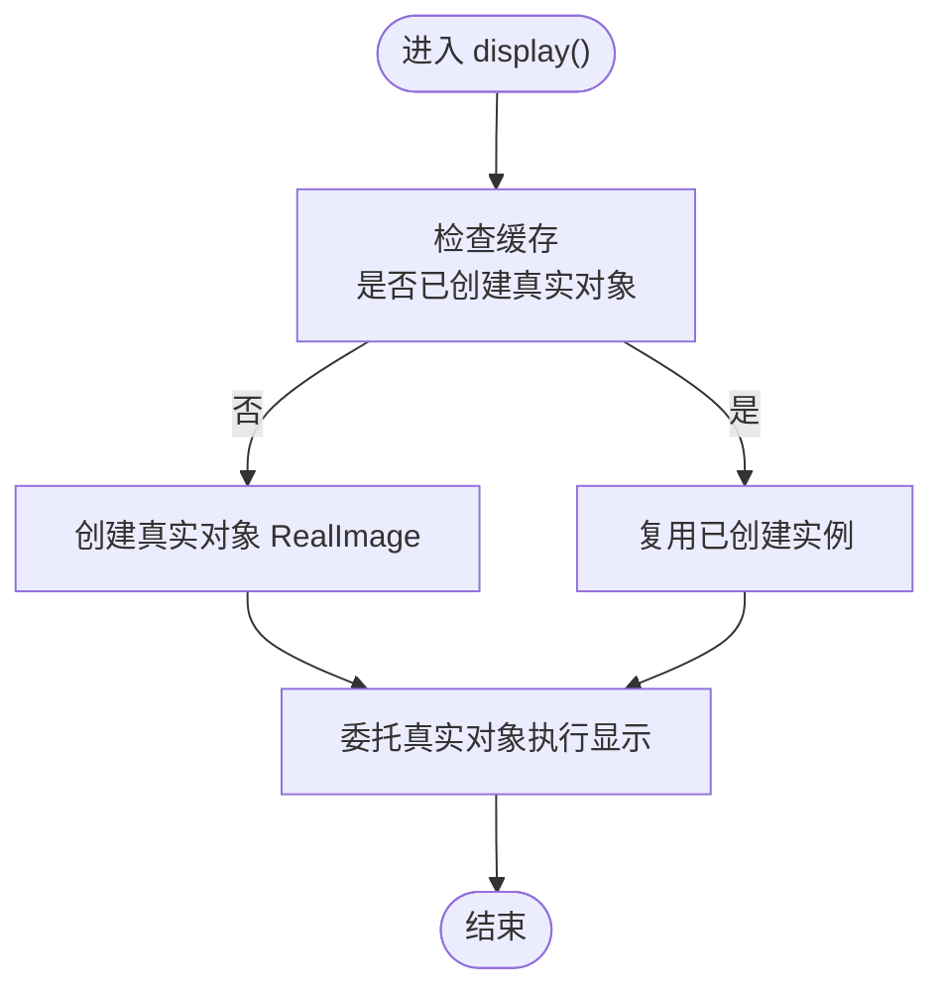
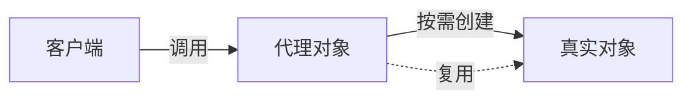

# 代理模式

<cite>
**本文引用的文件**
- [Image.java](file://structural/proxy/src/main/java/com/future/rocket/gof23/proxy/iface/Image.java)
- [RealImage.java](file://structural/proxy/src/main/java/com/future/rocket/gof23/proxy/impl/RealImage.java)
- [ProxyImage.java](file://structural/proxy/src/main/java/com/future/rocket/gof23/proxy/struct/ProxyImage.java)
- [ProxyMain.java](file://structural/proxy/src/main/java/com/future/rocket/gof23/proxy/ProxyMain.java)
- [readme.md（代理模式）](file://structural/proxy/readme.md)
- [Shape.java](file://structural/decorator/src/main/java/com/future/rocket/gof23/decorator/iface/Shape.java)
- [Circle.java](file://structural/decorator/src/main/java/com/future/rocket/gof23/decorator/impl/Circle.java)
- [ShapeDecorator.java](file://structural/decorator/src/main/java/com/future/rocket/gof23/decorator/struct/ShapeDecorator.java)
- [RedShapeDecorator.java](file://structural/decorator/src/main/java/com/future/rocket/gof23/decorator/struct/RedShapeDecorator.java)
- [DecoratorMain.java](file://structural/decorator/src/main/java/com/future/rocket/gof23/decorator/DecoratorMain.java)
- [readme.md（装饰器模式）](file://structural/decorator/readme.md)
- [readme.md（工程说明）](file://readme.md)
</cite>

## 目录
1. [引言](#引言)
2. [项目结构](#项目结构)
3. [核心组件](#核心组件)
4. [架构总览](#架构总览)
5. [详细组件分析](#详细组件分析)
6. [依赖关系分析](#依赖关系分析)
7. [性能考量](#性能考量)
8. [故障排查指南](#故障排查指南)
9. [结论](#结论)
10. [附录](#附录)

## 引言
本文件围绕代理模式展开，系统性阐述代理模式如何为其他对象提供代表或占位符以控制对原对象的访问，并结合图像代理系统的具体实现，展示延迟加载与访问控制机制。我们将深入解析 ProxyImage 代理类的设计，说明其如何在不修改客户端代码的前提下增强 RealImage 的功能；同时对比代理模式与装饰器模式的区别，明确何时选择代理模式而非装饰器模式。最后提供完整的类图、序列图与流程图，帮助读者从概念到实现全面掌握代理模式。

## 项目结构
本仓库将设计模式按类型划分为三类：创建型、结构型与行为型。代理模式属于结构型设计模式之一，本次分析聚焦于 structural/proxy 子模块，其中包含接口定义、真实对象与代理对象的实现，以及主程序入口用于演示代理行为。

图表来源
- [Image.java:1-7](file://structural/proxy/src/main/java/com/future/rocket/gof23/proxy/iface/Image.java#L1-L7)
- [RealImage.java:1-23](file://structural/proxy/src/main/java/com/future/rocket/gof23/proxy/impl/RealImage.java#L1-L23)
- [ProxyImage.java:1-21](file://structural/proxy/src/main/java/com/future/rocket/gof23/proxy/struct/ProxyImage.java#L1-L21)
- [ProxyMain.java:1-18](file://structural/proxy/src/main/java/com/future/rocket/gof23/proxy/ProxyMain.java#L1-L18)

章节来源
- [readme.md（工程说明）:1-9](file://readme.md#L1-L9)
- [readme.md（代理模式）:1-10](file://structural/proxy/readme.md#L1-L10)

## 核心组件
- 接口层：定义统一的行为契约，确保客户端仅面向抽象编程，便于替换真实对象与代理对象。
- 真实对象：承担实际业务逻辑，如加载与显示图像资源。
- 代理对象：持有真实对象的引用，在首次调用时按需创建真实对象，实现延迟加载与访问控制。
- 演示入口：通过主程序验证代理对象的行为，展示重复调用时的缓存效果。

章节来源
- [Image.java:1-7](file://structural/proxy/src/main/java/com/future/rocket/gof23/proxy/iface/Image.java#L1-L7)
- [RealImage.java:1-23](file://structural/proxy/src/main/java/com/future/rocket/gof23/proxy/impl/RealImage.java#L1-L23)
- [ProxyImage.java:1-21](file://structural/proxy/src/main/java/com/future/rocket/gof23/proxy/struct/ProxyImage.java#L1-L21)
- [ProxyMain.java:1-18](file://structural/proxy/src/main/java/com/future/rocket/gof23/proxy/ProxyMain.java#L1-L18)

## 架构总览
代理模式的核心在于“以代理对象替代真实对象”，在客户端与真实对象之间引入一层间接访问，从而实现延迟加载、访问控制、缓存复用等功能。下图展示了代理模式在本项目中的整体架构与交互关系。

图表来源
- [ProxyMain.java:1-18](file://structural/proxy/src/main/java/com/future/rocket/gof23/proxy/ProxyMain.java#L1-L18)
- [ProxyImage.java:1-21](file://structural/proxy/src/main/java/com/future/rocket/gof23/proxy/struct/ProxyImage.java#L1-L21)
- [RealImage.java:1-23](file://structural/proxy/src/main/java/com/future/rocket/gof23/proxy/impl/RealImage.java#L1-L23)

## 详细组件分析

### 接口层：Image
- 角色：定义统一的对外行为接口，使客户端无需关心具体实现细节。
- 设计要点：最小化接口，避免泄露内部实现；保证代理与真实对象的一致性。

章节来源
- [Image.java:1-7](file://structural/proxy/src/main/java/com/future/rocket/gof23/proxy/iface/Image.java#L1-L7)

### 真实对象：RealImage
- 角色：承载核心业务逻辑，负责资源加载与显示。
- 延迟加载：构造函数中执行磁盘加载，随后才可显示。
- 访问控制：通过接口暴露有限方法，避免直接操作底层细节。

章节来源
- [RealImage.java:1-23](file://structural/proxy/src/main/java/com/future/rocket/gof23/proxy/impl/RealImage.java#L1-L23)

### 代理对象：ProxyImage
- 角色：在客户端与真实对象之间充当中介，实现延迟加载与缓存复用。
- 关键逻辑：
  - 首次调用 display 时检查缓存，若为空则创建真实对象。
  - 后续调用直接复用已创建的真实对象，避免重复初始化。
- 设计优势：对客户端透明，无需修改调用方代码即可增强功能。

图表来源
- [Image.java:1-7](file://structural/proxy/src/main/java/com/future/rocket/gof23/proxy/iface/Image.java#L1-L7)
- [RealImage.java:1-23](file://structural/proxy/src/main/java/com/future/rocket/gof23/proxy/impl/RealImage.java#L1-L23)
- [ProxyImage.java:1-21](file://structural/proxy/src/main/java/com/future/rocket/gof23/proxy/struct/ProxyImage.java#L1-L21)

### 代理调用序列：延迟加载与访问控制

图表来源
- [ProxyImage.java:14-19](file://structural/proxy/src/main/java/com/future/rocket/gof23/proxy/struct/ProxyImage.java#L14-L19)
- [RealImage.java:18-21](file://structural/proxy/src/main/java/com/future/rocket/gof23/proxy/impl/RealImage.java#L18-L21)

### 代理流程图：按需创建与复用

图表来源
- [ProxyImage.java:14-19](file://structural/proxy/src/main/java/com/future/rocket/gof23/proxy/struct/ProxyImage.java#L14-L19)

### 与装饰器模式的对比
- 目标不同：
  - 代理模式：以“替代”为核心，隐藏真实对象，控制访问与生命周期。
  - 装饰器模式：以“增强”为核心，在不改变接口的前提下叠加行为。
- 结构差异：
  - 代理对象通常只持有一个真实对象引用，且不改变接口签名。
  - 装饰器对象通常包装另一个同接口对象，并在调用前后附加额外逻辑。
- 适用场景：
  - 代理：远程代理、虚拟代理（延迟加载）、保护代理（权限控制）、缓存代理。
  - 装饰器：UI 组件样式增强、日志记录、事务包装等。

章节来源
- [readme.md（代理模式）:1-10](file://structural/proxy/readme.md#L1-L10)
- [readme.md（装饰器模式）:1-7](file://structural/decorator/readme.md#L1-L7)
- [Shape.java:1-6](file://structural/decorator/src/main/java/com/future/rocket/gof23/decorator/iface/Shape.java#L1-L6)
- [ShapeDecorator.java:1-13](file://structural/decorator/src/main/java/com/future/rocket/gof23/decorator/struct/ShapeDecorator.java#L1-L13)
- [RedShapeDecorator.java:1-21](file://structural/decorator/src/main/java/com/future/rocket/gof23/decorator/struct/RedShapeDecorator.java#L1-L21)
- [DecoratorMain.java:1-29](file://structural/decorator/src/main/java/com/future/rocket/gof23/decorator/DecoratorMain.java#L1-L29)

## 依赖关系分析
- 接口与实现解耦：客户端仅依赖接口，代理与真实对象均实现同一接口，便于替换。
- 代理对真实对象的依赖：代理持有真实对象引用，但仅在必要时创建，体现延迟加载。
- 客户端与代理的耦合度低：客户端通过代理调用，无需感知真实对象的存在与创建时机。

图表来源
- [ProxyImage.java:7-19](file://structural/proxy/src/main/java/com/future/rocket/gof23/proxy/struct/ProxyImage.java#L7-L19)
- [RealImage.java:1-23](file://structural/proxy/src/main/java/com/future/rocket/gof23/proxy/impl/RealImage.java#L1-L23)

章节来源
- [ProxyImage.java:1-21](file://structural/proxy/src/main/java/com/future/rocket/gof23/proxy/struct/ProxyImage.java#L1-L21)
- [RealImage.java:1-23](file://structural/proxy/src/main/java/com/future/rocket/gof23/proxy/impl/RealImage.java#L1-L23)

## 性能考量
- 延迟加载带来的收益：首次访问时才创建真实对象，减少启动开销与内存占用。
- 缓存复用：代理缓存真实对象，后续调用无需重复初始化，提升响应速度。
- 注意事项：
  - 避免在代理中引入不必要的同步锁，除非真实对象本身线程不安全。
  - 对于频繁调用的场景，应评估代理层的额外开销（如空值判断）。
  - 在高并发环境下，需关注真实对象的创建与初始化是否需要加锁或幂等处理。

## 故障排查指南
- 症状：首次调用耗时较长
  - 可能原因：真实对象初始化涉及磁盘 IO 或网络请求。
  - 处理建议：确认初始化逻辑是否必要；若可异步化，考虑后台加载策略。
- 症状：重复调用仍出现重复初始化
  - 可能原因：代理缓存未生效或存在多实例。
  - 处理建议：检查代理对象的缓存字段与构造方式；确保单例或共享实例。
- 症状：客户端无法感知真实对象变化
  - 可能原因：代理屏蔽了真实对象的内部状态。
  - 处理建议：根据需求决定是否暴露真实对象或提供受控访问接口。

## 结论
代理模式通过引入代理对象，在客户端与真实对象之间建立间接层，实现了延迟加载、访问控制与缓存复用等能力。在本项目中，ProxyImage 以极简设计展示了代理的核心思想：在不修改客户端代码的前提下，增强 RealImage 的生命周期管理与访问控制。与装饰器模式相比，代理更强调“替代与控制”，而装饰器更强调“增强与组合”。选择代理模式还是装饰器模式，应基于具体需求：当需要控制访问、延迟初始化或引入缓存时，优先考虑代理模式。

## 附录
- 代理模式应用场景举例：
  - 远程代理：隐藏远程服务调用细节。
  - 虚拟代理：延迟加载大资源（如图片、视频）。
  - 保护代理：基于权限控制访问真实对象。
  - 缓存代理：对昂贵操作的结果进行缓存。
- 实现注意事项：
  - 明确代理与真实对象的职责边界，避免过度代理导致复杂度上升。
  - 在多线程环境中确保代理缓存的线程安全。
  - 保持接口一致性，避免客户端感知到实现差异。