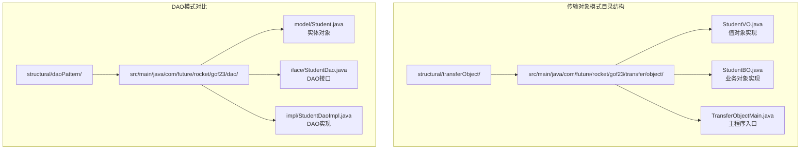
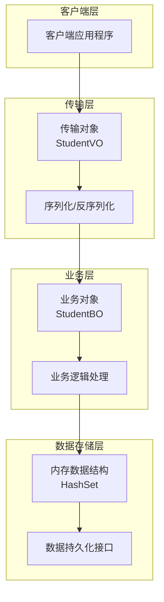
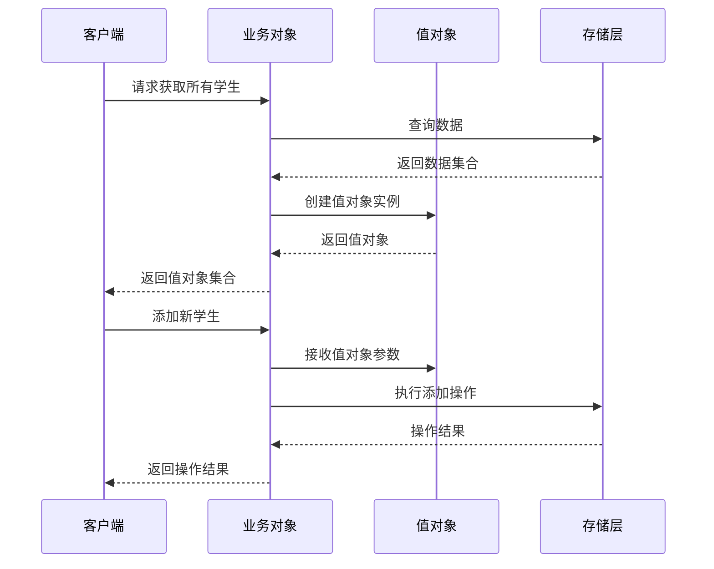
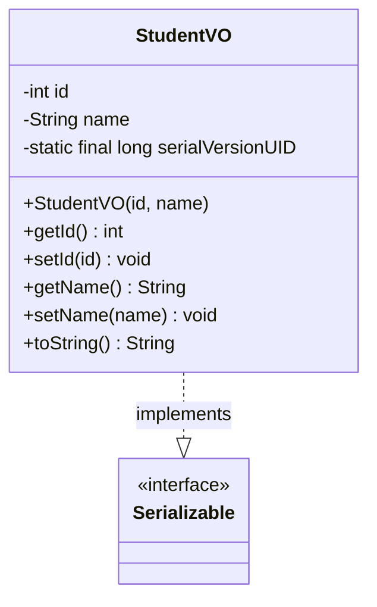
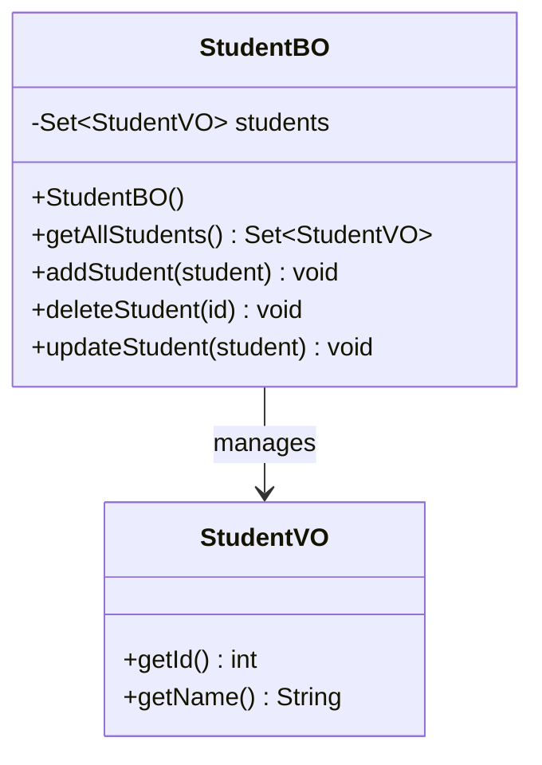
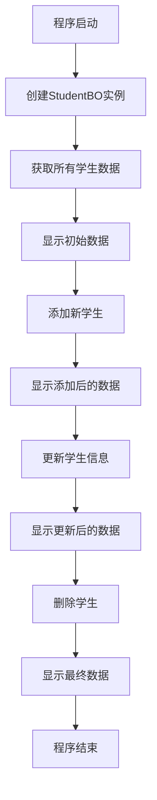
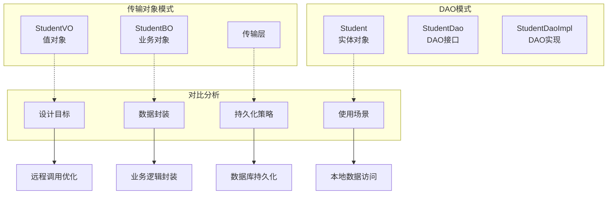

# 传输对象模式

<cite>
**本文档引用的文件**
- [StudentVO.java](file://structural/transferObject/src/main/java/com/future/rocket/gof23/transfer/object/StudentVO.java)
- [StudentBO.java](file://structural/transferObject/src/main/java/com/future/rocket/gof23/transfer/object/StudentBO.java)
- [TransferObjectMain.java](file://structural/transferObject/src/main/java/com/future/rocket/gof23/transfer/object/TransferObjectMain.java)
- [Student.java](file://structural/daoPattern/src/main/java/com/future/rocket/gof23/dao/model/Student.java)
- [StudentDao.java](file://structural/daoPattern/src/main/java/com/future/rocket/gof23/dao/iface/StudentDao.java)
- [StudentDaoImpl.java](file://structural/daoPattern/src/main/java/com/future/rocket/gof23/dao/impl/StudentDaoImpl.java)
</cite>

## 目录
1. [引言](#引言)
2. [项目结构](#项目结构)
3. [核心组件](#核心组件)
4. [架构概览](#架构概览)
5. [详细组件分析](#详细组件分析)
6. [依赖关系分析](#依赖关系分析)
7. [性能考虑](#性能考虑)
8. [故障排除指南](#故障排除指南)
9. [结论](#结论)
10. [附录](#附录)

## 引言

传输对象模式（Transfer Object Pattern）是一种用于远程调用中数据传输的设计模式。该模式通过创建轻量级的数据传输对象来减少网络传输开销，提高系统性能。在分布式系统中，传输对象模式特别重要，因为它能够：

- 减少网络往返次数
- 降低序列化和反序列化的成本
- 提供数据封装和验证
- 支持批量数据传输
- 简化客户端与服务器之间的通信

本项目通过学生业务对象（StudentBO）和值对象（StudentVO）的实现，展示了传输对象模式在实际应用中的最佳实践。

## 项目结构

传输对象模式位于结构型设计模式的范畴内，具体实现位于 `structural/transferObject` 目录中。该项目采用标准的Maven项目结构，包含以下关键文件：

**图表来源**
- [StudentVO.java:1-39](file://structural/transferObject/src/main/java/com/future/rocket/gof23/transfer/object/StudentVO.java#L1-L39)
- [StudentBO.java:1-37](file://structural/transferObject/src/main/java/com/future/rocket/gof23/transfer/object/StudentBO.java#L1-L37)
- [TransferObjectMain.java:1-23](file://structural/transferObject/src/main/java/com/future/rocket/gof23/transfer/object/TransferObjectMain.java#L1-L23)

**章节来源**
- [StudentVO.java:1-39](file://structural/transferObject/src/main/java/com/future/rocket/gof23/transfer/object/StudentVO.java#L1-L39)
- [StudentBO.java:1-37](file://structural/transferObject/src/main/java/com/future/rocket/gof23/transfer/object/StudentBO.java#L1-L37)
- [TransferObjectMain.java:1-23](file://structural/transferObject/src/main/java/com/future/rocket/gof23/transfer/object/TransferObjectMain.java#L1-L23)

## 核心组件

传输对象模式的核心由三个主要组件构成：

### 值对象（Value Object）
值对象是不可变的数据容器，专门用于在系统边界之间传输数据。在本实现中，StudentVO类提供了：
- 简洁的数据字段（id和name）
- 标准的getter和setter方法
- 序列化支持
- 易于比较和缓存的特性

### 业务对象（Business Object）
业务对象负责处理业务逻辑和数据操作。StudentBO类实现了：
- 数据集合的管理
- CRUD操作的封装
- 业务规则的执行
- 与值对象的交互

### 主程序入口
TransferObjectMain作为演示程序，展示了传输对象模式的实际应用场景和使用方式。

**章节来源**
- [StudentVO.java:5-38](file://structural/transferObject/src/main/java/com/future/rocket/gof23/transfer/object/StudentVO.java#L5-L38)
- [StudentBO.java:6-36](file://structural/transferObject/src/main/java/com/future/rocket/gof23/transfer/object/StudentBO.java#L6-L36)
- [TransferObjectMain.java:5-22](file://structural/transferObject/src/main/java/com/future/rocket/gof23/transfer/object/TransferObjectMain.java#L5-L22)

## 架构概览

传输对象模式的架构设计体现了清晰的分层和职责分离：

**图表来源**
- [StudentVO.java:5-38](file://structural/transferObject/src/main/java/com/future/rocket/gof23/transfer/object/StudentVO.java#L5-L38)
- [StudentBO.java:6-36](file://structural/transferObject/src/main/java/com/future/rocket/gof23/transfer/object/StudentBO.java#L6-L36)

### 数据流图

**图表来源**
- [TransferObjectMain.java:10-20](file://structural/transferObject/src/main/java/com/future/rocket/gof23/transfer/object/TransferObjectMain.java#L10-L20)
- [StudentBO.java:17-27](file://structural/transferObject/src/main/java/com/future/rocket/gof23/transfer/object/StudentBO.java#L17-L27)

## 详细组件分析

### StudentVO 值对象分析

StudentVO是传输对象模式的核心实现，具有以下设计特点：

#### 类结构设计

**图表来源**
- [StudentVO.java:5-38](file://structural/transferObject/src/main/java/com/future/rocket/gof23/transfer/object/StudentVO.java#L5-L38)

#### 设计原则分析

1. **最小化数据结构**：只包含必要的字段（id和name），避免冗余信息
2. **可序列化支持**：实现Serializable接口，支持网络传输
3. **不可变性设计**：虽然提供了setter方法，但整体设计理念偏向不可变
4. **简单构造函数**：提供带参数的构造函数，便于快速创建实例

#### 性能优化特性
- **轻量级设计**：字段数量最少化，减少序列化开销
- **基本数据类型**：使用int和String等基础类型，提高传输效率
- **固定大小**：对象大小相对固定，便于内存管理和缓存

**章节来源**
- [StudentVO.java:5-38](file://structural/transferObject/src/main/java/com/future/rocket/gof23/transfer/object/StudentVO.java#L5-L38)

### StudentBO 业务对象分析

StudentBO实现了完整的业务逻辑处理，展示了传输对象模式在实际应用中的使用方式：

#### 业务逻辑结构

**图表来源**
- [StudentBO.java:6-36](file://structural/transferObject/src/main/java/com/future/rocket/gof23/transfer/object/StudentBO.java#L6-L36)

#### 核心功能实现

1. **数据初始化**：构造函数中预加载了3个示例学生数据
2. **查询操作**：getAllStudents()方法返回当前所有学生数据
3. **添加操作**：addStudent()方法接收StudentVO参数并添加到集合中
4. **删除操作**：deleteStudent()方法根据id删除指定学生
5. **更新操作**：updateStudent()方法修改现有学生的姓名

#### 数据访问逻辑
业务对象内部使用HashSet来存储StudentVO实例，提供了：
- O(1)的平均查找时间复杂度
- 自动去重功能
- 线程安全考虑（在单线程环境下使用）

**章节来源**
- [StudentBO.java:6-36](file://structural/transferObject/src/main/java/com/future/rocket/gof23/transfer/object/StudentBO.java#L6-L36)

### TransferObjectMain 主程序分析

主程序演示了传输对象模式的完整使用流程：

#### 程序执行流程

**图表来源**
- [TransferObjectMain.java:7-21](file://structural/transferObject/src/main/java/com/future/rocket/gof23/transfer/object/TransferObjectMain.java#L7-L21)

#### 关键操作步骤
1. **初始化阶段**：创建StudentBO实例并显示初始数据
2. **添加操作**：通过new StudentVO()创建值对象并添加到业务对象
3. **更新操作**：修改值对象的属性后更新到业务对象
4. **删除操作**：根据id删除指定的学生记录

**章节来源**
- [TransferObjectMain.java:5-22](file://structural/transferObject/src/main/java/com/future/rocket/gof23/transfer/object/TransferObjectMain.java#L5-L22)

## 依赖关系分析

传输对象模式与DAO模式存在密切的对比关系，两者都涉及数据的封装和传输，但在设计目标和实现方式上有显著差异：

**图表来源**
- [StudentVO.java:5-38](file://structural/transferObject/src/main/java/com/future/rocket/gof23/transfer/object/StudentVO.java#L5-L38)
- [StudentBO.java:6-36](file://structural/transferObject/src/main/java/com/future/rocket/gof23/transfer/object/StudentBO.java#L6-L36)
- [Student.java:5-44](file://structural/daoPattern/src/main/java/com/future/rocket/gof23/dao/model/Student.java#L5-L44)
- [StudentDao.java:7-16](file://structural/daoPattern/src/main/java/com/future/rocket/gof23/dao/iface/StudentDao.java#L7-L16)

### 与实体对象的区别

| 特征 | StudentVO（值对象） | Student（实体对象） |
|------|---------------------|-------------------|
| **设计目的** | 远程调用数据传输 | 内存中的业务实体 |
| **持久化** | 不直接持久化 | 可以持久化到数据库 |
| **状态管理** | 轻量级，易比较 | 复杂状态，包含业务逻辑 |
| **生命周期** | 短暂，传输用 | 长期存在，业务用 |
| **序列化** | 实现Serializable | 可能需要持久化支持 |

### 选择原则

选择传输对象模式还是实体对象模式的决策因素：

1. **网络传输需求**：需要跨网络传输时优先选择传输对象
2. **性能要求**：对性能敏感的应用使用传输对象
3. **数据量大小**：大数据量传输时使用传输对象
4. **业务复杂度**：简单数据传输使用传输对象，复杂业务逻辑使用实体对象

**章节来源**
- [StudentVO.java:5-38](file://structural/transferObject/src/main/java/com/future/rocket/gof23/transfer/object/StudentVO.java#L5-L38)
- [StudentBO.java:6-36](file://structural/transferObject/src/main/java/com/future/rocket/gof23/transfer/object/StudentBO.java#L6-L36)
- [Student.java:5-44](file://structural/daoPattern/src/main/java/com/future/rocket/gof23/dao/model/Student.java#L5-L44)
- [StudentDao.java:7-16](file://structural/daoPattern/src/main/java/com/future/rocket/gof23/dao/iface/StudentDao.java#L7-L16)

## 性能考虑

传输对象模式在性能优化方面具有显著优势，以下是关键的性能考量：

### 序列化优化

1. **最小化字段数量**：值对象只包含必要字段，减少序列化开销
2. **使用基本数据类型**：int和String等基础类型序列化效率高
3. **固定大小对象**：避免动态大小的对象导致的序列化复杂性

### 内存管理

1. **对象池化**：对于频繁创建的值对象，可以考虑使用对象池减少GC压力
2. **缓存策略**：对于热点数据，可以实现缓存机制提高访问速度
3. **内存占用控制**：监控值对象的内存占用，避免内存泄漏

### 网络传输优化

1. **批量传输**：支持批量数据传输，减少网络往返次数
2. **压缩算法**：对于大量数据，可以考虑使用压缩算法
3. **连接复用**：在客户端和服务端之间复用连接

### 并发性能

1. **线程安全**：值对象应该是线程安全的，避免并发访问问题
2. **无锁设计**：在可能的情况下使用无锁数据结构
3. **读写分离**：对于读多写少的场景，可以考虑读写分离策略

## 故障排除指南

### 常见问题及解决方案

#### 序列化问题
- **问题**：反序列化失败或版本不兼容
- **解决方案**：确保serialVersionUID一致，使用稳定的序列化格式

#### 数据一致性问题
- **问题**：并发更新导致的数据不一致
- **解决方案**：实现适当的并发控制机制，如乐观锁或悲观锁

#### 内存泄漏问题
- **问题**：大量值对象导致的内存占用过高
- **解决方案**：及时清理不再使用的值对象，监控内存使用情况

#### 网络超时问题
- **问题**：大对象传输导致的网络超时
- **解决方案**：优化对象大小，实现分页传输，增加超时配置

### 调试技巧

1. **日志记录**：在关键节点添加详细的日志记录
2. **性能监控**：监控序列化/反序列化时间和内存使用
3. **单元测试**：编写针对值对象的单元测试，确保数据完整性

**章节来源**
- [StudentVO.java:5-38](file://structural/transferObject/src/main/java/com/future/rocket/gof23/transfer/object/StudentVO.java#L5-L38)
- [StudentBO.java:6-36](file://structural/transferObject/src/main/java/com/future/rocket/gof23/transfer/object/StudentBO.java#L6-L36)

## 结论

传输对象模式通过创建轻量级的数据传输对象，在远程调用中实现了高效的数据传递。本项目的实现展示了以下关键优势：

1. **简洁性**：值对象设计简单明了，易于理解和维护
2. **性能优化**：通过减少字段数量和使用基本数据类型，提高了传输效率
3. **可扩展性**：业务对象提供了清晰的扩展点，支持功能增强
4. **实用性**：主程序演示了完整的使用流程，便于学习和应用

在实际应用中，传输对象模式最适合以下场景：
- 远程服务调用
- 微服务架构中的数据传输
- 需要高性能数据传输的应用
- 对网络带宽敏感的系统

通过合理的设计和实现，传输对象模式能够显著提升系统的整体性能和用户体验。

## 附录

### 最佳实践建议

1. **字段设计**：只包含必要的字段，避免过度设计
2. **命名规范**：使用清晰的命名约定，提高代码可读性
3. **错误处理**：实现完善的异常处理机制
4. **文档完善**：为每个值对象添加详细的文档说明
5. **测试覆盖**：确保有足够的单元测试和集成测试

### 扩展方向

1. **泛型支持**：可以考虑实现泛型的传输对象基类
2. **验证机制**：添加数据验证和约束检查
3. **缓存集成**：与缓存系统集成，提高访问速度
4. **监控集成**：添加性能监控和指标收集