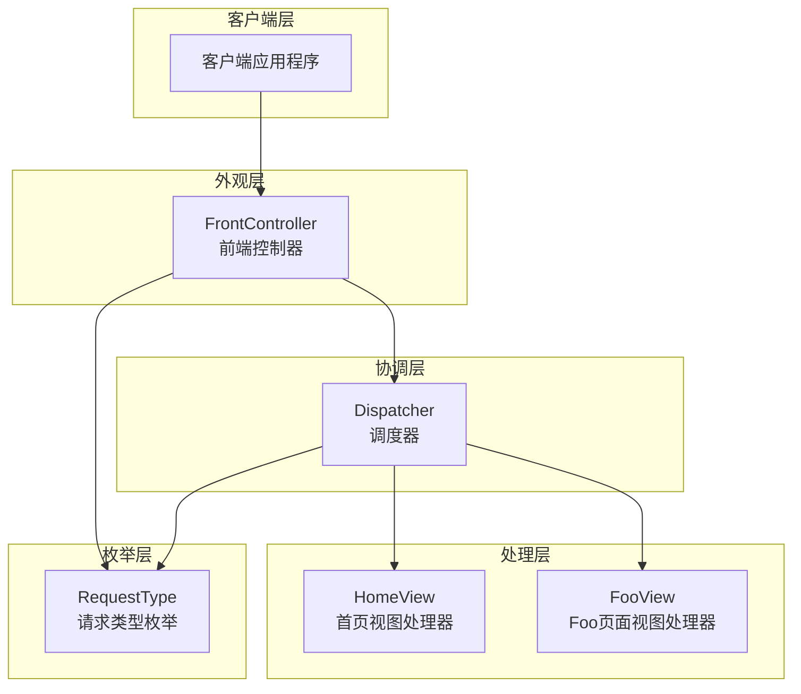
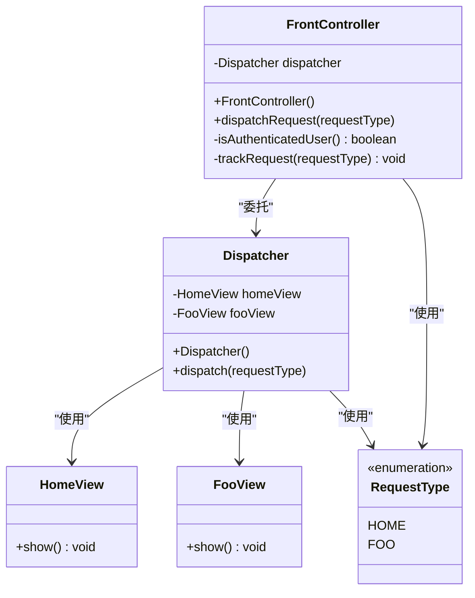
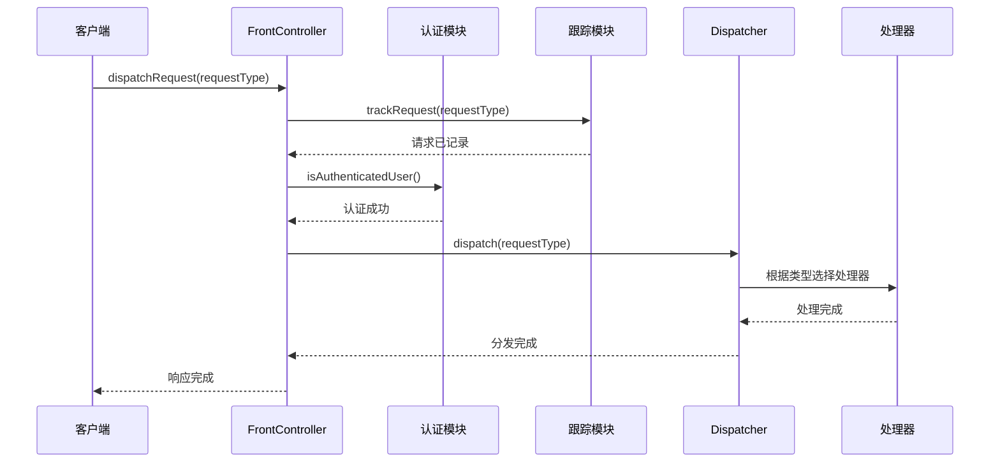
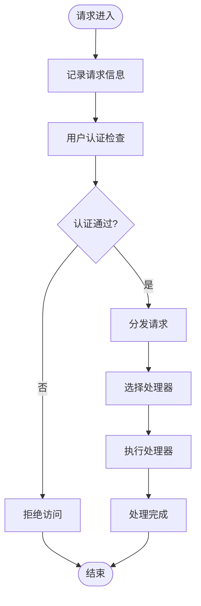
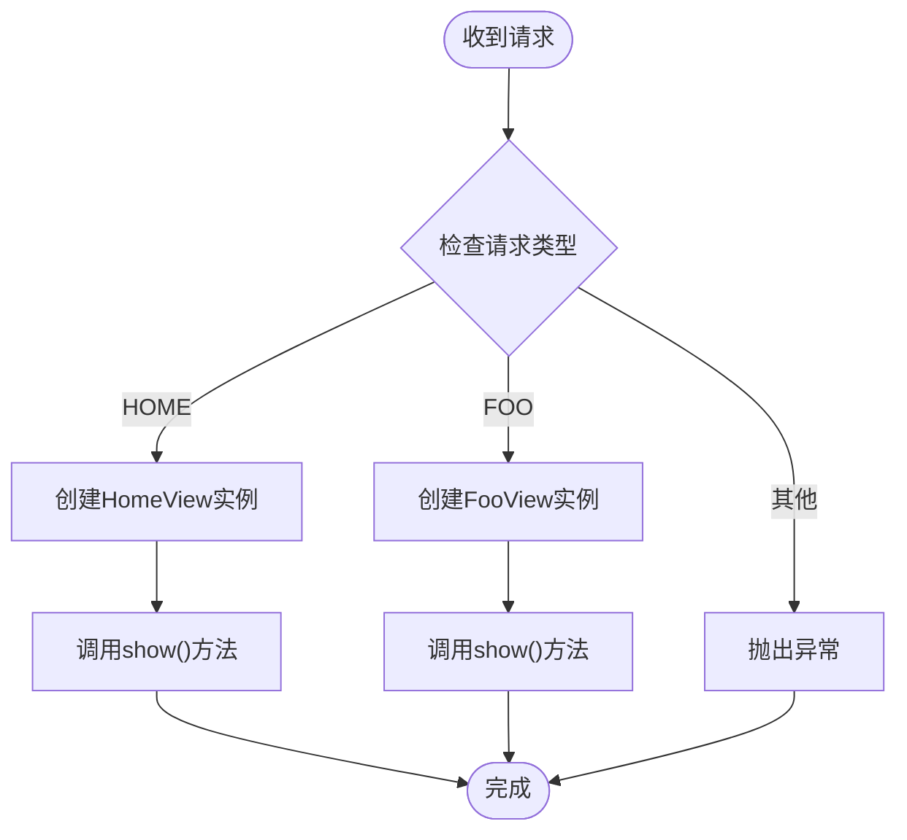
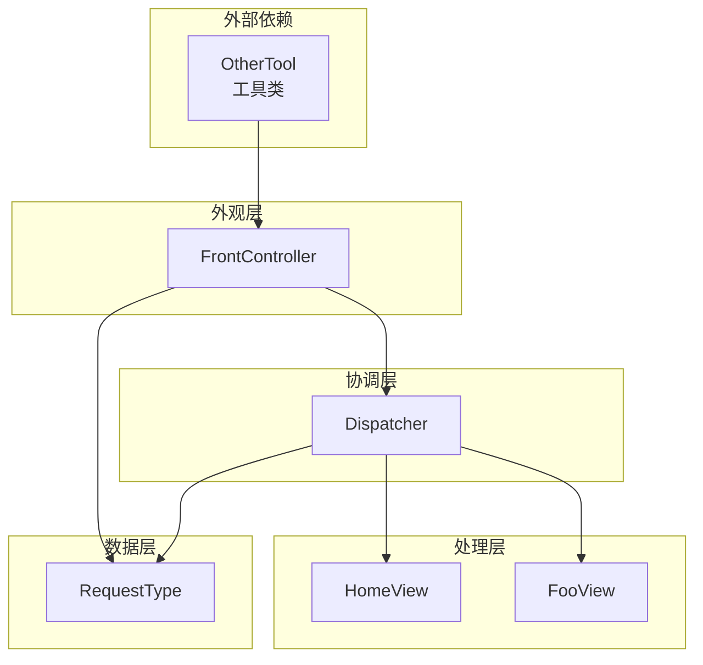

# 外观模式

<cite>
**本文档引用的文件**
- [FrontController.java](file://structural/frontController/src/main/java/com/future/rocket/gof23/frontController/controller/FrontController.java)
- [Dispatcher.java](file://structural/frontController/src/main/java/com/future/rocket/gof23/frontController/dispatcher/Dispatcher.java)
- [HomeView.java](file://structural/frontController/src/main/java/com/future/rocket/gof23/frontController/handler/HomeView.java)
- [FooView.java](file://structural/frontController/src/main/java/com/future/rocket/gof23/frontController/handler/FooView.java)
- [RequestType.java](file://structural/frontController/src/main/java/com/future/rocket/gof23/frontController/enums/RequestType.java)
- [FrontControllerMain.java](file://structural/frontController/src/main/java/com/future/rocket/gof23/frontController/FrontControllerMain.java)
- [OtherTool.java](file://common/src/main/java/com/future/rocket/gof23/common/OtherTool.java)
- [readme.md](file://structural/frontController/readme.md)
</cite>

## 目录
1. [引言](#引言)
2. [项目结构](#项目结构)
3. [核心组件](#核心组件)
4. [架构概览](#架构概览)
5. [详细组件分析](#详细组件分析)
6. [依赖分析](#依赖分析)
7. [性能考虑](#性能考虑)
8. [故障排除指南](#故障排除指南)
9. [结论](#结论)
10. [附录](#附录)

## 引言

外观模式（Facade Pattern）是一种结构型设计模式，它为复杂的子系统提供了一个简化的统一接口。在本项目中，前端控制器系统完美地展示了外观模式的应用。该系统通过一个单一的入口点（Front Controller）来处理所有客户端请求，将认证、日志记录、请求跟踪等通用功能集中在一处，避免了在每个处理器中重复实现这些功能。

前端控制器系统的核心价值在于：
- **简化客户端交互**：客户端只需与单一入口点通信
- **集中化处理**：将横切关注点（认证、日志、跟踪）统一管理
- **解耦合**：隐藏子系统的复杂性，降低客户端与子系统之间的耦合度
- **可扩展性**：新增处理器时无需修改现有客户端代码

## 项目结构

前端控制器系统采用清晰的分层架构，每个组件都有明确的职责分工：

**图表来源**
- [FrontController.java:1-29](file://structural/frontController/src/main/java/com/future/rocket/gof23/frontController/controller/FrontController.java#L1-L29)
- [Dispatcher.java:1-26](file://structural/frontController/src/main/java/com/future/rocket/gof23/frontController/dispatcher/Dispatcher.java#L1-L26)
- [HomeView.java:1-9](file://structural/frontController/src/main/java/com/future/rocket/gof23/frontController/handler/HomeView.java#L1-L9)
- [FooView.java:1-9](file://structural/frontController/src/main/java/com/future/rocket/gof23/frontController/handler/FooView.java#L1-L9)
- [RequestType.java:1-7](file://structural/frontController/src/main/java/com/future/rocket/gof23/frontController/enums/RequestType.java#L1-L7)

**章节来源**
- [FrontController.java:1-29](file://structural/frontController/src/main/java/com/future/rocket/gof23/frontController/controller/FrontController.java#L1-L29)
- [Dispatcher.java:1-26](file://structural/frontController/src/main/java/com/future/rocket/gof23/frontController/dispatcher/Dispatcher.java#L1-L26)
- [HomeView.java:1-9](file://structural/frontController/src/main/java/com/future/rocket/gof23/frontController/handler/HomeView.java#L1-L9)
- [FooView.java:1-9](file://structural/frontController/src/main/java/com/future/rocket/gof23/frontController/handler/FooView.java#L1-L9)
- [RequestType.java:1-7](file://structural/frontController/src/main/java/com/future/rocket/gof23/frontController/enums/RequestType.java#L1-L7)

## 核心组件

### FrontController（前端控制器）

FrontController是外观模式的核心，它充当了整个系统的外观角色。该类的主要职责包括：

- **请求接收**：作为所有客户端请求的单一入口点
- **通用功能处理**：集中处理认证、日志记录、请求跟踪等横切关注点
- **请求分发**：将请求委托给Dispatcher进行具体的处理

**图表来源**
- [FrontController.java:6-28](file://structural/frontController/src/main/java/com/future/rocket/gof23/frontController/controller/FrontController.java#L6-L28)
- [Dispatcher.java:7-25](file://structural/frontController/src/main/java/com/future/rocket/gof23/frontController/dispatcher/Dispatcher.java#L7-L25)
- [HomeView.java:3-8](file://structural/frontController/src/main/java/com/future/rocket/gof23/frontController/handler/HomeView.java#L3-L8)
- [FooView.java:3-8](file://structural/frontController/src/main/java/com/future/rocket/gof23/frontController/handler/FooView.java#L3-L8)
- [RequestType.java:3-6](file://structural/frontController/src/main/java/com/future/rocket/gof23/frontController/enums/RequestType.java#L3-L6)

**章节来源**
- [FrontController.java:13-27](file://structural/frontController/src/main/java/com/future/rocket/gof23/frontController/controller/FrontController.java#L13-L27)

### Dispatcher（调度器）

Dispatcher负责根据请求类型将请求分发到相应的处理器。它持有所有处理器的实例，并根据RequestType枚举值进行决策。

**章节来源**
- [Dispatcher.java:16-24](file://structural/frontController/src/main/java/com/future/rocket/gof23/frontController/dispatcher/Dispatcher.java#L16-L24)

### 视图处理器

系统包含两个简单的视图处理器：
- **HomeView**：处理主页请求
- **FooView**：处理Foo页面请求

这两个处理器都实现了统一的show()方法接口，体现了外观模式中简化接口的特点。

**章节来源**
- [HomeView.java:5-7](file://structural/frontController/src/main/java/com/future/rocket/gof23/frontController/handler/HomeView.java#L5-L7)
- [FooView.java:5-7](file://structural/frontController/src/main/java/com/future/rocket/gof23/frontController/handler/FooView.java#L5-L7)

## 架构概览

前端控制器系统遵循外观模式的经典架构，通过单一入口点简化了客户端与复杂子系统的交互：

**图表来源**
- [FrontController.java:13-18](file://structural/frontController/src/main/java/com/future/rocket/gof23/frontController/controller/FrontController.java#L13-L18)
- [Dispatcher.java:16-24](file://structural/frontController/src/main/java/com/future/rocket/gof23/frontController/dispatcher/Dispatcher.java#L16-L24)

## 详细组件分析

### FrontController 设计分析

FrontController的设计体现了外观模式的核心原则：

#### 请求处理流程

**图表来源**
- [FrontController.java:13-27](file://structural/frontController/src/main/java/com/future/rocket/gof23/frontController/controller/FrontController.java#L13-L27)

#### 设计特点

1. **单一职责**：FrontController只负责协调和分发，不直接处理业务逻辑
2. **封装性**：内部的认证、跟踪、分发逻辑对外部透明
3. **扩展性**：新增处理器时只需修改Dispatcher，不影响客户端代码

**章节来源**
- [FrontController.java:9-27](file://structural/frontController/src/main/java/com/future/rocket/gof23/frontController/controller/FrontController.java#L9-L27)

### Dispatcher 协调机制

Dispatcher作为FrontController的助手，承担着请求分发的重要职责：

#### 决策逻辑

**图表来源**
- [Dispatcher.java:16-24](file://structural/frontController/src/main/java/com/future/rocket/gof23/frontController/dispatcher/Dispatcher.java#L16-L24)

**章节来源**
- [Dispatcher.java:11-24](file://structural/frontController/src/main/java/com/future/rocket/gof23/frontController/dispatcher/Dispatcher.java#L11-L24)

### 视图处理器实现

HomeView和FooView虽然简单，但它们体现了外观模式中"简化接口"的核心思想：

#### 统一接口设计

两个视图处理器都提供了相同的show()方法，这使得调用方不需要关心具体的实现细节，只需要知道如何显示内容即可。

**章节来源**
- [HomeView.java:5-7](file://structural/frontController/src/main/java/com/future/rocket/gof23/frontController/handler/HomeView.java#L5-L7)
- [FooView.java:5-7](file://structural/frontController/src/main/java/com/future/rocket/gof23/frontController/handler/FooView.java#L5-L7)

## 依赖分析

前端控制器系统的依赖关系清晰且层次分明：

**图表来源**
- [FrontControllerMain.java:3-16](file://structural/frontController/src/main/java/com/future/rocket/gof23/frontController/FrontControllerMain.java#L3-L16)
- [FrontController.java:3-4](file://structural/frontController/src/main/java/com/future/rocket/gof23/frontController/controller/FrontController.java#L3-L4)
- [Dispatcher.java:4-5](file://structural/frontController/src/main/java/com/future/rocket/gof23/frontController/dispatcher/Dispatcher.java#L4-L5)

### 依赖关系特点

1. **单向依赖**：依赖关系从上层向下层传递，符合外观模式的层次结构
2. **低耦合**：上层组件不直接依赖下层的具体实现，只依赖抽象接口
3. **可替换性**：下层组件可以独立替换而不影响上层组件

**章节来源**
- [FrontControllerMain.java:3-16](file://structural/frontController/src/main/java/com/future/rocket/gof23/frontController/FrontControllerMain.java#L3-L16)

## 性能考虑

在外观模式的实现中，需要考虑以下几个方面的性能因素：

### 1. 对象创建开销

- **处理器缓存**：当前实现每次请求都会创建新的处理器实例，可以考虑使用对象池或单例模式来减少对象创建开销
- **延迟初始化**：只有在真正需要时才创建处理器实例

### 2. 分发效率

- **查找算法**：当前使用简单的if-else分支，当处理器数量增加时可以考虑使用映射表或工厂模式
- **反射优化**：如果需要动态加载处理器，可以考虑缓存反射结果

### 3. 线程安全

- **共享状态**：确保FrontController和Dispatcher实例在多线程环境下的安全性
- **处理器状态**：处理器对象应该是无状态的，避免线程安全问题

## 故障排除指南

### 常见问题及解决方案

#### 1. 请求类型错误

**问题描述**：当传入未知的RequestType时会抛出IllegalArgumentException异常

**解决方案**：
- 在Dispatcher中添加默认处理器
- 使用工厂模式动态创建处理器
- 实现请求类型验证机制

#### 2. 认证失败

**问题描述**：isAuthenticatedUser()方法返回false导致请求被拒绝

**解决方案**：
- 实现完整的认证逻辑
- 添加认证失败的错误处理
- 提供认证重试机制

#### 3. 处理器未找到

**问题描述**：当请求类型与处理器不匹配时出现异常

**解决方案**：
- 实现处理器注册机制
- 添加处理器存在性检查
- 提供默认处理器回退

**章节来源**
- [Dispatcher.java:21-23](file://structural/frontController/src/main/java/com/future/rocket/gof23/frontController/dispatcher/Dispatcher.java#L21-L23)
- [FrontController.java:20-23](file://structural/frontController/src/main/java/com/future/rocket/gof23/frontController/controller/FrontController.java#L20-L23)

## 结论

前端控制器系统完美地展示了外观模式在Web应用中的典型应用场景。通过FrontController作为单一入口点，系统成功地：

1. **简化了客户端交互**：客户端只需与FrontController通信，无需了解底层复杂性
2. **集中化处理横切关注点**：认证、日志、跟踪等功能统一管理
3. **提高了系统的可维护性**：修改处理器不影响客户端代码
4. **增强了系统的扩展性**：新增处理器时只需修改Dispatcher配置

外观模式的核心价值在于为复杂的子系统提供简化的统一接口，使客户端能够以最简单的方式与系统交互，同时保持系统的内部结构完整性和可扩展性。

## 附录

### 设计模式选择原则

#### 何时使用外观模式

1. **复杂子系统**：当系统包含多个复杂的子系统时
2. **简化接口需求**：客户端需要简单易用的接口
3. **模块化要求**：需要将系统功能模块化组织
4. **第三方集成**：需要为复杂的第三方API提供简化接口

#### 实现注意事项

1. **职责分离**：确保外观类只负责协调，不承担具体业务逻辑
2. **接口设计**：提供简洁明了的公共接口
3. **错误处理**：妥善处理子系统调用过程中的异常
4. **性能考虑**：避免过度包装导致性能下降
5. **可测试性**：确保外观模式不会影响系统的可测试性

### 扩展建议

1. **添加更多处理器**：可以轻松添加新的视图处理器而无需修改客户端代码
2. **实现拦截器链**：可以添加认证、日志、缓存等拦截器
3. **支持异步处理**：可以为耗时操作提供异步处理能力
4. **实现负载均衡**：可以为多个处理器实例提供负载均衡机制