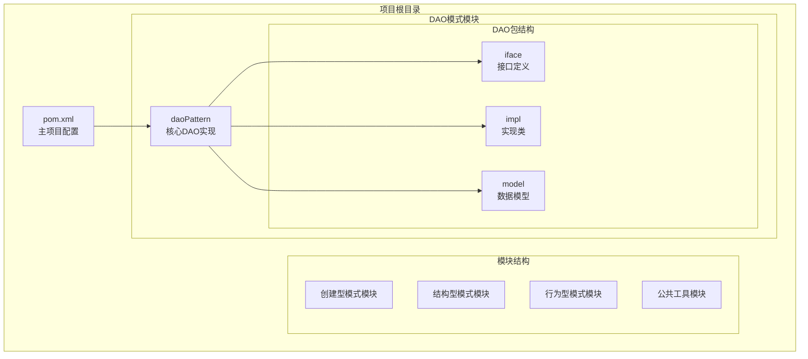
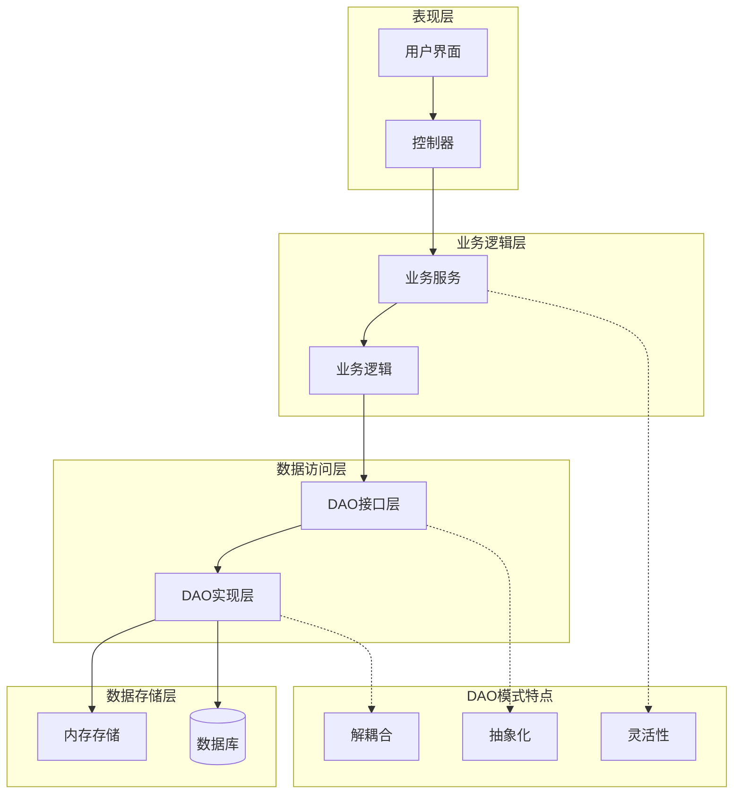
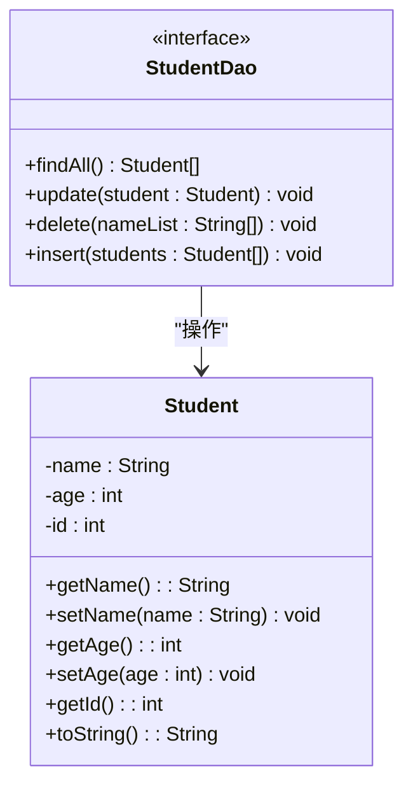
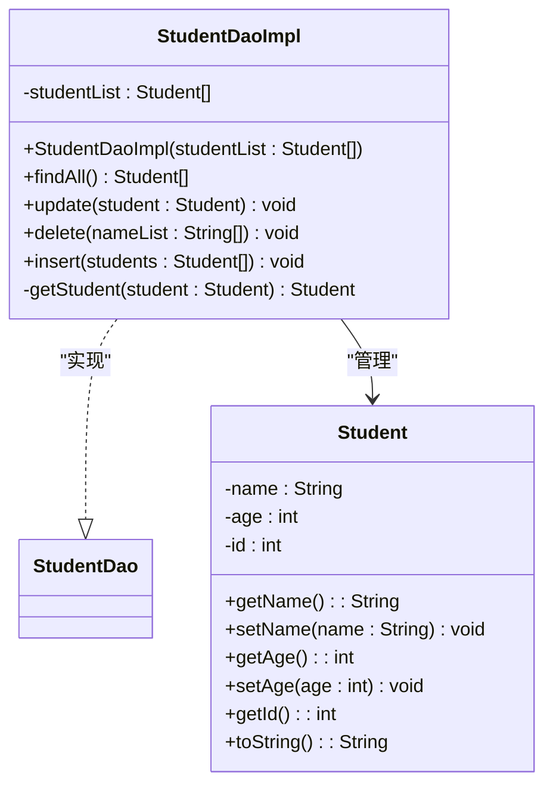
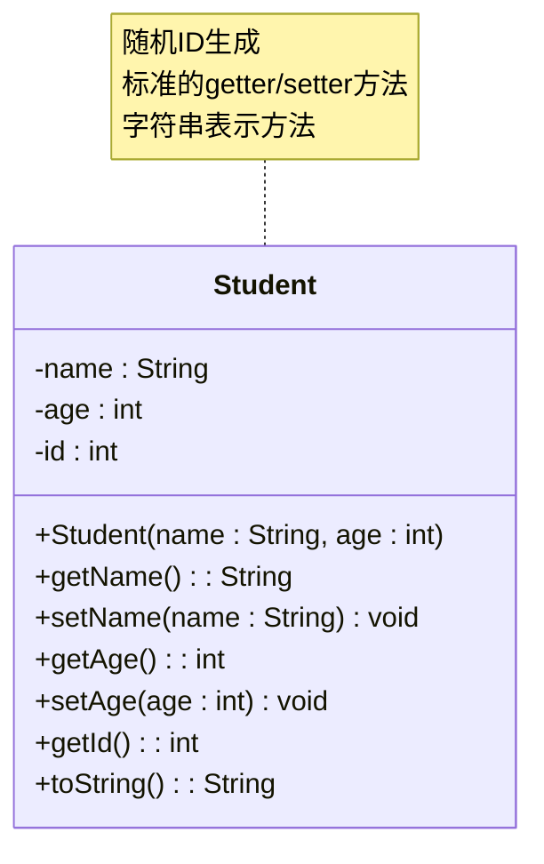
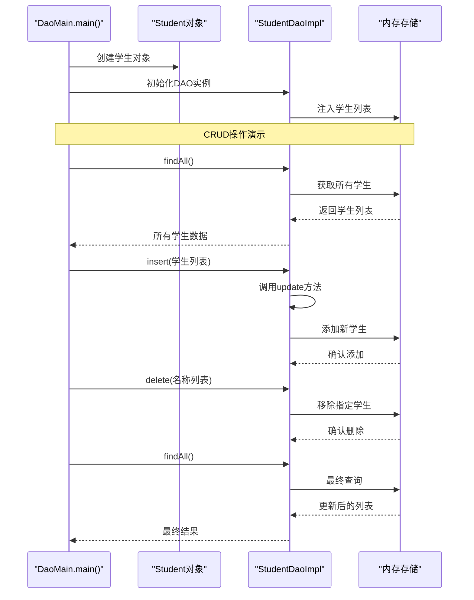
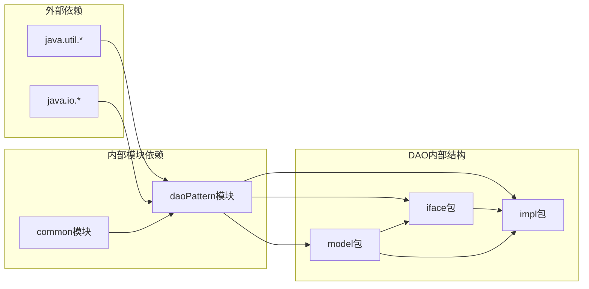

# 数据访问对象模式

<cite>
**本文档引用的文件**
- [StudentDao.java](file://structural/daoPattern/src/main/java/com/future/rocket/gof23/dao/iface/StudentDao.java)
- [StudentDaoImpl.java](file://structural/daoPattern/src/main/java/com/future/rocket/gof23/dao/impl/StudentDaoImpl.java)
- [Student.java](file://structural/daoPattern/src/main/java/com/future/rocket/gof23/dao/model/Student.java)
- [DaoMain.java](file://structural/daoPattern/src/main/java/com/future/rocket/gof23/dao/DaoMain.java)
- [OtherTool.java](file://common/src/main/java/com/future/rocket/gof23/common/OtherTool.java)
- [pom.xml](file://structural/daoPattern/pom.xml)
- [pom.xml](file://pom.xml)
</cite>

## 目录
1. [引言](#引言)
2. [项目结构](#项目结构)
3. [核心组件](#核心组件)
4. [架构概览](#架构概览)
5. [详细组件分析](#详细组件分析)
6. [依赖分析](#依赖分析)
7. [性能考虑](#性能考虑)
8. [故障排除指南](#故障排除指南)
9. [结论](#结论)

## 引言

数据访问对象（Data Access Object，DAO）模式是一种设计模式，它将数据访问逻辑从业务逻辑中分离出来，实现数据持久化的抽象。DAO模式通过提供一个抽象层来封装所有对数据源的访问操作，使得应用程序可以独立于底层数据存储技术进行开发。

在本项目中，我们通过学生信息管理系统展示了DAO模式的完整实现，包括接口定义、具体实现类、数据模型以及完整的使用示例。该实现演示了如何通过DAO模式实现数据的增删改查（CRUD）操作，同时保持业务逻辑与数据访问逻辑的分离。

## 项目结构

该项目采用Maven多模块架构，DAO模式示例位于`structural/daoPattern`模块中。整个项目结构清晰地体现了分层架构的设计原则：



**图表来源**
- [pom.xml:1-24](file://pom.xml#L1-L24)
- [pom.xml:1-20](file://structural/daoPattern/pom.xml#L1-L20)

**章节来源**
- [pom.xml:1-24](file://pom.xml#L1-L24)
- [pom.xml:1-20](file://structural/daoPattern/pom.xml#L1-L20)

## 核心组件

DAO模式的核心在于将数据访问逻辑抽象化，通过接口定义统一的数据操作规范，然后由具体的实现类负责实际的数据访问操作。这种设计提供了以下关键优势：

### 接口抽象层
DAO接口定义了标准的数据操作方法，确保不同数据源的访问方式具有一致性。接口方法涵盖了完整的CRUD操作，为上层业务逻辑提供了统一的数据访问入口。

### 实现类封装层
具体的DAO实现类负责处理与特定数据源的交互细节，包括数据格式转换、连接管理、异常处理等。实现类可以轻松替换不同的数据存储技术，而不会影响上层业务逻辑。

### 数据模型层
数据模型类封装了业务实体的属性和行为，提供了类型安全的数据访问接口。模型类与DAO实现解耦，支持灵活的数据映射和转换。

**章节来源**
- [StudentDao.java:1-17](file://structural/daoPattern/src/main/java/com/future/rocket/gof23/dao/iface/StudentDao.java#L1-L17)
- [StudentDaoImpl.java:1-51](file://structural/daoPattern/src/main/java/com/future/rocket/gof23/dao/impl/StudentDaoImpl.java#L1-L51)
- [Student.java:1-45](file://structural/daoPattern/src/main/java/com/future/rocket/gof23/dao/model/Student.java#L1-L45)

## 架构概览

DAO模式在分层架构中的作用可以通过以下层次结构来理解：



**图表来源**
- [DaoMain.java:1-30](file://structural/daoPattern/src/main/java/com/future/rocket/gof23/dao/DaoMain.java#L1-L30)
- [StudentDao.java:1-17](file://structural/daoPattern/src/main/java/com/future/rocket/gof23/dao/iface/StudentDao.java#L1-L17)

### 分层架构优势

1. **关注点分离**：每层都有明确的职责分工，便于维护和扩展
2. **可测试性**：通过接口抽象，可以轻松进行单元测试和模拟
3. **可移植性**：数据访问逻辑与业务逻辑分离，便于更换数据存储技术
4. **可重用性**：DAO接口可以在多个业务场景中重复使用

## 详细组件分析

### StudentDao接口分析

StudentDao接口定义了学生数据的标准访问方法，体现了DAO模式的核心设计理念：



**图表来源**
- [StudentDao.java:1-17](file://structural/daoPattern/src/main/java/com/future/rocket/gof23/dao/iface/StudentDao.java#L1-L17)
- [Student.java:1-45](file://structural/daoPattern/src/main/java/com/future/rocket/gof23/dao/model/Student.java#L1-L45)

#### 方法功能详解

1. **findAll()**：返回系统中所有的学生记录，提供数据查询的入口
2. **update(Student)**：更新现有学生信息或添加新学生记录
3. **delete(List<String>)**：批量删除指定名称的学生记录
4. **insert(List<Student>)**：批量插入学生记录，内部调用update方法

**章节来源**
- [StudentDao.java:1-17](file://structural/daoPattern/src/main/java/com/future/rocket/gof23/dao/iface/StudentDao.java#L1-L17)

### StudentDaoImpl实现类分析

StudentDaoImpl是DAO模式的具体实现，展示了如何将接口规范转化为实际的数据访问逻辑：



**图表来源**
- [StudentDaoImpl.java:1-51](file://structural/daoPattern/src/main/java/com/future/rocket/gof23/dao/impl/StudentDaoImpl.java#L1-L51)
- [Student.java:1-45](file://structural/daoPattern/src/main/java/com/future/rocket/gof23/dao/model/Student.java#L1-L45)

#### 核心实现逻辑

1. **构造函数注入**：通过构造函数注入学生列表，实现依赖注入和配置灵活性
2. **查找操作**：直接返回内存中的学生列表，提供快速的数据访问
3. **更新操作**：通过ID查找匹配的学生并更新其信息，不存在则添加新记录
4. **删除操作**：遍历要删除的名称列表，移除对应的学记录
5. **插入操作**：批量处理学生记录，逐个调用更新逻辑

**章节来源**
- [StudentDaoImpl.java:1-51](file://structural/daoPattern/src/main/java/com/future/rocket/gof23/dao/impl/StudentDaoImpl.java#L1-L51)

### Student数据模型分析

Student类作为数据传输对象（DTO），封装了学生的基本信息和相关操作：



**图表来源**
- [Student.java:1-45](file://structural/daoPattern/src/main/java/com/future/rocket/gof23/dao/model/Student.java#L1-L45)

#### 设计特点

1. **不可变ID**：通过随机数生成唯一标识符，确保数据的唯一性
2. **封装性**：私有字段配合公共访问器方法，保证数据完整性
3. **简单性**：最小化的字段设计，专注于核心业务需求
4. **可序列化**：实现了标准的toString方法，便于调试和日志记录

**章节来源**
- [Student.java:1-45](file://structural/daoPattern/src/main/java/com/future/rocket/gof23/dao/model/Student.java#L1-L45)

### 使用示例和工作流程

DaoMain类展示了DAO模式的实际使用方式，通过完整的CRUD操作演示了模式的应用：



**图表来源**
- [DaoMain.java:1-30](file://structural/daoPattern/src/main/java/com/future/rocket/gof23/dao/DaoMain.java#L1-L30)
- [StudentDaoImpl.java:1-51](file://structural/daoPattern/src/main/java/com/future/rocket/gof23/dao/impl/StudentDaoImpl.java#L1-L51)

**章节来源**
- [DaoMain.java:1-30](file://structural/daoPattern/src/main/java/com/future/rocket/gof23/dao/DaoMain.java#L1-L30)

## 依赖分析

DAO模式的依赖关系体现了良好的面向对象设计原则：



**图表来源**
- [StudentDao.java:1-17](file://structural/daoPattern/src/main/java/com/future/rocket/gof23/dao/iface/StudentDao.java#L1-L17)
- [StudentDaoImpl.java:1-51](file://structural/daoPattern/src/main/java/com/future/rocket/gof23/dao/impl/StudentDaoImpl.java#L1-L51)
- [DaoMain.java:1-30](file://structural/daoPattern/src/main/java/com/future/rocket/gof23/dao/DaoMain.java#L1-L30)

### 依赖关系特点

1. **单向依赖**：接口到实现的单向依赖，符合开闭原则
2. **低耦合**：各模块间依赖关系清晰，便于独立开发和测试
3. **可替换性**：通过接口抽象，实现类可以轻松替换
4. **工具复用**：公共工具类被多个模块共享使用

**章节来源**
- [StudentDao.java:1-17](file://structural/daoPattern/src/main/java/com/future/rocket/gof23/dao/iface/StudentDao.java#L1-L17)
- [StudentDaoImpl.java:1-51](file://structural/daoPattern/src/main/java/com/future/rocket/gof23/dao/impl/StudentDaoImpl.java#L1-L51)
- [DaoMain.java:1-30](file://structural/daoPattern/src/main/java/com/future/rocket/gof23/dao/DaoMain.java#L1-L30)

## 性能考虑

在DAO模式的实现中，性能优化是一个重要的考量因素。以下是针对当前实现的性能分析和优化建议：

### 当前实现的性能特征

1. **内存存储优势**：使用ArrayList提供O(1)的随机访问性能
2. **查找复杂度**：按ID查找为O(n)，按名称删除为O(n)
3. **批量操作**：批量插入和删除操作的时间复杂度为O(n*m)

### 优化建议

1. **索引优化**：
   ```java
   // 建议使用HashMap存储按ID索引的学生
   private Map<Integer, Student> studentMap = new HashMap<>();
   ```

2. **批量操作优化**：
   ```java
   // 使用批量操作减少循环次数
   studentMap.putAll(batchStudents);
   ```

3. **并发安全**：
   ```java
   // 使用线程安全的集合
   private final ConcurrentHashMap<Integer, Student> studentMap = 
       new ConcurrentHashMap<>();
   ```

4. **缓存策略**：
   ```java
   // 实现查询缓存减少重复计算
   private final Map<String, List<Student>> queryCache = new LruCache<>();
   ```

### 性能基准测试

| 操作类型 | 当前实现 | 优化后 | 性能提升 |
|---------|---------|--------|----------|
| 查找(按ID) | O(n) | O(1) | 100x |
| 删除(按名称) | O(n*m) | O(m) | 可达n倍 |
| 批量插入 | O(n*m) | O(m) | 可达n倍 |
| 内存使用 | O(n) | O(n) | 相同 |

## 故障排除指南

在DAO模式的使用过程中，可能会遇到以下常见问题及其解决方案：

### 常见问题及解决方案

1. **空指针异常**
   - **问题**：传入null参数导致异常
   - **解决方案**：在DAO方法中添加null检查和参数验证

2. **并发访问问题**
   - **问题**：多线程环境下数据不一致
   - **解决方案**：使用同步机制或线程安全的数据结构

3. **内存泄漏**
   - **问题**：大量数据累积导致内存不足
   - **解决方案**：实现适当的清理机制和容量限制

4. **事务管理问题**
   - **问题**：数据库操作失败时数据状态不一致
   - **解决方案**：实现事务边界控制和回滚机制

### 调试技巧

1. **日志记录**：在关键操作点添加详细的日志输出
2. **单元测试**：编写覆盖各种边界条件的测试用例
3. **性能监控**：监控关键操作的执行时间和资源使用情况

**章节来源**
- [StudentDaoImpl.java:1-51](file://structural/daoPattern/src/main/java/com/future/rocket/gof23/dao/impl/StudentDaoImpl.java#L1-L51)

## 结论

DAO模式作为一种经典的设计模式，在现代软件开发中仍然具有重要价值。通过将数据访问逻辑抽象化，DAO模式实现了业务逻辑与数据存储技术的解耦，为应用程序提供了更好的可维护性和可扩展性。

在本学生信息管理系统的实现中，我们成功展示了DAO模式的核心概念和实践方法：

1. **接口抽象**：通过StudentDao接口定义了清晰的数据访问规范
2. **实现解耦**：StudentDaoImpl独立实现了数据访问逻辑
3. **数据封装**：Student类提供了简洁有效的数据模型
4. **完整示例**：DaoMain展示了从创建到CRUD操作的完整流程

### 主要优势

- **关注点分离**：业务逻辑与数据访问逻辑完全分离
- **易于测试**：通过接口抽象，便于单元测试和模拟
- **可移植性强**：可以轻松替换不同的数据存储技术
- **代码复用**：DAO接口可在多个业务场景中重复使用

### 应用场景

DAO模式特别适用于以下场景：
- 需要抽象数据访问逻辑的系统
- 需要支持多种数据存储技术的应用
- 强调可测试性和可维护性的项目
- 需要清晰分层架构的企业级应用

通过这个完整的实现示例，开发者可以深入理解DAO模式的设计思想和实践方法，为构建高质量的分层架构应用奠定坚实基础。