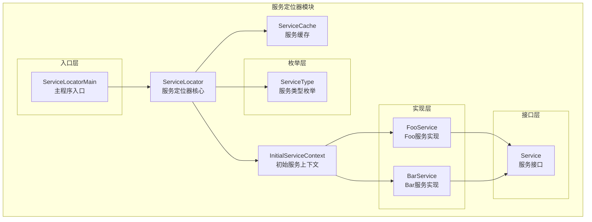
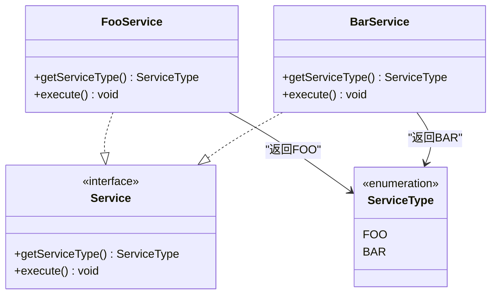
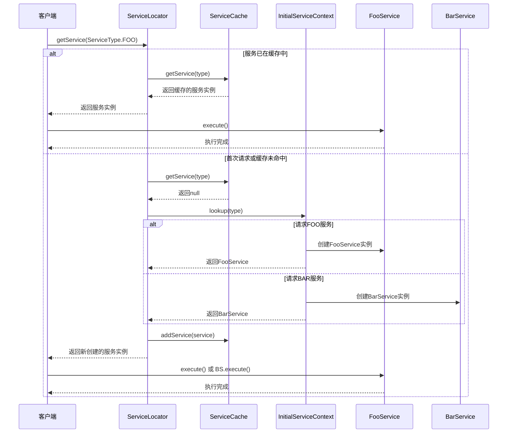
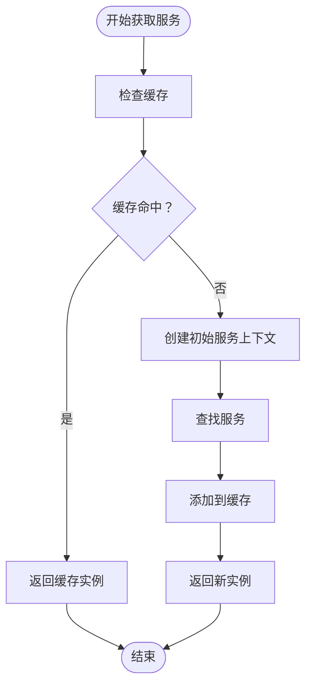
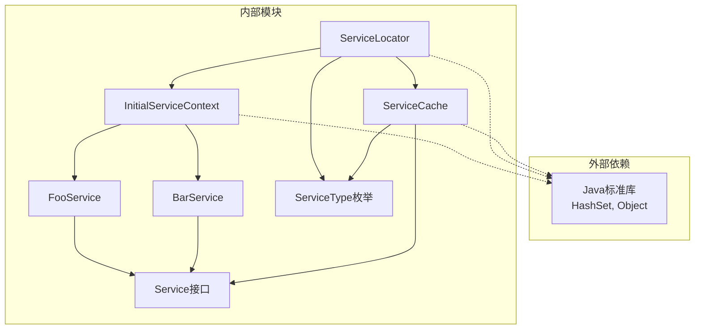

# 服务定位器模式

<cite>
**本文档引用的文件**
- [ServiceLocator.java](file://structural/serviceLocator/src/main/java/com/future/rocket/gof23/service/locator/ServiceLocator.java)
- [ServiceCache.java](file://structural/serviceLocator/src/main/java/com/future/rocket/gof23/service/locator/cache/ServiceCache.java)
- [InitialServiceContext.java](file://structural/serviceLocator/src/main/java/com/future/rocket/gof23/service/locator/context/InitialServiceContext.java)
- [Service.java](file://structural/serviceLocator/src/main/java/com/future/rocket/gof23/service/locator/iface/Service.java)
- [FooService.java](file://structural/serviceLocator/src/main/java/com/future/rocket/gof23/service/locator/impl/FooService.java)
- [BarService.java](file://structural/serviceLocator/src/main/java/com/future/rocket/gof23/service/locator/impl/BarService.java)
- [ServiceType.java](file://structural/serviceLocator/src/main/java/com/future/rocket/gof23/service/locator/enums/ServiceType.java)
- [ServiceLocatorMain.java](file://structural/serviceLocator/src/main/java/com/future/rocket/gof23/service/locator/ServiceLocatorMain.java)
</cite>

## 目录
1. [简介](#简介)
2. [项目结构](#项目结构)
3. [核心组件](#核心组件)
4. [架构概览](#架构概览)
5. [详细组件分析](#详细组件分析)
6. [依赖关系分析](#依赖关系分析)
7. [性能考虑](#性能考虑)
8. [故障排除指南](#故障排除指南)
9. [结论](#结论)

## 简介

服务定位器模式（Service Locator Pattern）是一种行为设计模式，它提供了一种集中化的服务访问点，实现了服务的延迟初始化和缓存管理。该模式通过一个中央注册表来管理应用程序中各种服务的生命周期，避免了客户端直接依赖于具体的服务实现类。

在本项目中，服务定位器模式通过以下核心机制实现：
- **集中化服务访问**：所有服务请求都通过ServiceLocator统一处理
- **延迟初始化**：仅在首次请求时创建服务实例
- **缓存管理**：服务实例在内存中缓存，避免重复创建
- **服务注册与发现**：通过InitialServiceContext实现服务的动态查找和创建

## 项目结构

服务定位器模式的实现位于`structural/serviceLocator`目录下，采用清晰的分层架构：

**图表来源**
- [ServiceLocator.java:1-28](file://structural/serviceLocator/src/main/java/com/future/rocket/gof23/service/locator/ServiceLocator.java#L1-L28)
- [ServiceCache.java:1-30](file://structural/serviceLocator/src/main/java/com/future/rocket/gof23/service/locator/cache/ServiceCache.java#L1-L30)
- [InitialServiceContext.java:1-19](file://structural/serviceLocator/src/main/java/com/future/rocket/gof23/service/locator/context/InitialServiceContext.java#L1-L19)

**章节来源**
- [ServiceLocator.java:1-28](file://structural/serviceLocator/src/main/java/com/future/rocket/gof23/service/locator/ServiceLocator.java#L1-L28)
- [ServiceCache.java:1-30](file://structural/serviceLocator/src/main/java/com/future/rocket/gof23/service/locator/cache/ServiceCache.java#L1-L30)
- [InitialServiceContext.java:1-19](file://structural/serviceLocator/src/main/java/com/future/rocket/gof23/service/locator/context/InitialServiceContext.java#L1-L19)

## 核心组件

### 服务接口定义

服务接口定义了所有服务必须实现的标准方法：

**图表来源**
- [Service.java:1-9](file://structural/serviceLocator/src/main/java/com/future/rocket/gof23/service/locator/iface/Service.java#L1-L9)
- [FooService.java:1-18](file://structural/serviceLocator/src/main/java/com/future/rocket/gof23/service/locator/impl/FooService.java#L1-L18)
- [BarService.java:1-18](file://structural/serviceLocator/src/main/java/com/future/rocket/gof23/service/locator/impl/BarService.java#L1-L18)
- [ServiceType.java:1-7](file://structural/serviceLocator/src/main/java/com/future/rocket/gof23/service/locator/enums/ServiceType.java#L1-L7)

### 服务定位器核心

ServiceLocator是整个模式的核心组件，负责协调服务的获取、缓存和管理：

**章节来源**
- [ServiceLocator.java:1-28](file://structural/serviceLocator/src/main/java/com/future/rocket/gof23/service/locator/ServiceLocator.java#L1-L28)

### 服务缓存机制

ServiceCache实现了服务实例的内存缓存，确保服务的单例特性和性能优化：

**章节来源**
- [ServiceCache.java:1-30](file://structural/serviceLocator/src/main/java/com/future/rocket/gof23/service/locator/cache/ServiceCache.java#L1-L30)

### 初始服务上下文

InitialServiceContext提供了服务的动态查找和创建能力：

**章节来源**
- [InitialServiceContext.java:1-19](file://structural/serviceLocator/src/main/java/com/future/rocket/gof23/service/locator/context/InitialServiceContext.java#L1-L19)

## 架构概览

服务定位器模式的整体架构展示了从客户端到服务实例的完整调用链：

**图表来源**
- [ServiceLocator.java:15-26](file://structural/serviceLocator/src/main/java/com/future/rocket/gof23/service/locator/ServiceLocator.java#L15-L26)
- [ServiceCache.java:21-28](file://structural/serviceLocator/src/main/java/com/future/rocket/gof23/service/locator/cache/ServiceCache.java#L21-L28)
- [InitialServiceContext.java:9-17](file://structural/serviceLocator/src/main/java/com/future/rocket/gof23/service/locator/context/InitialServiceContext.java#L9-L17)

## 详细组件分析

### ServiceLocator 组件分析

ServiceLocator是服务定位器模式的核心控制器，负责协调整个服务获取流程：

#### 关键特性
- **延迟初始化**：仅在需要时创建服务实例
- **智能缓存**：检查缓存后再进行服务创建
- **统一接口**：为所有服务提供一致的访问方式

#### 处理流程

**图表来源**
- [ServiceLocator.java:15-26](file://structural/serviceLocator/src/main/java/com/future/rocket/gof23/service/locator/ServiceLocator.java#L15-L26)

**章节来源**
- [ServiceLocator.java:8-27](file://structural/serviceLocator/src/main/java/com/future/rocket/gof23/service/locator/ServiceLocator.java#L8-L27)

### ServiceCache 缓存机制分析

ServiceCache实现了基于HashSet的服务缓存系统，提供高效的服务实例管理：

#### 数据结构设计
- **存储容器**：使用HashSet确保唯一性
- **查找算法**：线性搜索遍历所有缓存项
- **时间复杂度**：O(n)，其中n为缓存中的服务数量

#### 性能特征
- **优点**：实现简单，内存占用低
- **缺点**：随着服务数量增加，查找性能线性下降

**章节来源**
- [ServiceCache.java:9-29](file://structural/serviceLocator/src/main/java/com/future/rocket/gof23/service/locator/cache/ServiceCache.java#L9-L29)

### InitialServiceContext 服务发现系统

InitialServiceContext实现了服务的动态查找和创建机制：

#### 服务注册策略
- **条件判断**：根据ServiceType选择对应的服务实现
- **工厂模式**：每个服务类型对应一个具体的工厂方法
- **扩展性**：易于添加新的服务类型

#### 错误处理
- **未知类型**：对不支持的服务类型抛出IllegalArgumentException
- **类型安全**：编译时检查确保返回正确的服务类型

**章节来源**
- [InitialServiceContext.java:7-18](file://structural/serviceLocator/src/main/java/com/future/rocket/gof23/service/locator/context/InitialServiceContext.java#L7-L18)

### 具体服务实现

#### FooService 实现
FooService代表了第一种服务类型的实现，具有以下特点：
- **标识符**：返回ServiceType.FOO
- **执行逻辑**：简单的执行方法，用于演示服务功能
- **接口实现**：完全符合Service接口规范

#### BarService 实现
BarService代表了第二种服务类型的实现：
- **标识符**：返回ServiceType.BAR  
- **执行逻辑**：与FooService类似，但代表不同的业务功能
- **接口实现**：同样完全符合Service接口规范

**章节来源**
- [FooService.java:6-17](file://structural/serviceLocator/src/main/java/com/future/rocket/gof23/service/locator/impl/FooService.java#L6-L17)
- [BarService.java:6-17](file://structural/serviceLocator/src/main/java/com/future/rocket/gof23/service/locator/impl/BarService.java#L6-L17)

## 依赖关系分析

服务定位器模式的依赖关系展现了清晰的层次化架构：

**图表来源**
- [ServiceLocator.java:3-6](file://structural/serviceLocator/src/main/java/com/future/rocket/gof23/service/locator/ServiceLocator.java#L3-L6)
- [ServiceCache.java:3-4](file://structural/serviceLocator/src/main/java/com/future/rocket/gof23/service/locator/cache/ServiceCache.java#L3-L4)
- [InitialServiceContext.java:3-5](file://structural/serviceLocator/src/main/java/com/future/rocket/gof23/service/locator/context/InitialServiceContext.java#L3-L5)

### 耦合度分析

- **低耦合**：客户端仅依赖Service接口，不关心具体实现
- **可扩展性**：新增服务类型只需修改InitialServiceContext
- **维护性**：集中式的错误处理和日志记录

### 循环依赖检测

该实现避免了循环依赖问题：
- ServiceLocator依赖ServiceCache和InitialServiceContext
- ServiceCache依赖Service接口
- InitialServiceContext依赖具体服务实现
- 形成单向依赖链，无循环依赖

**章节来源**
- [ServiceLocator.java:1-28](file://structural/serviceLocator/src/main/java/com/future/rocket/gof23/service/locator/ServiceLocator.java#L1-L28)
- [ServiceCache.java:1-30](file://structural/serviceLocator/src/main/java/com/future/rocket/gof23/service/locator/cache/ServiceCache.java#L1-L30)
- [InitialServiceContext.java:1-19](file://structural/serviceLocator/src/main/java/com/future/rocket/gof23/service/locator/context/InitialServiceContext.java#L1-L19)

## 性能考虑

### 时间复杂度分析

| 操作 | 时间复杂度 | 空间复杂度 | 说明 |
|------|------------|------------|------|
| 获取服务 | O(n) | O(n) | n为缓存中的服务数量 |
| 添加服务 | O(1) | O(1) | HashSet插入操作 |
| 查找服务 | O(n) | O(1) | 线性搜索遍历 |

### 内存使用分析

- **缓存开销**：每个服务实例占用内存空间
- **对象数量**：每种服务类型最多缓存一个实例
- **垃圾回收**：服务实例随应用生命周期存在

### 优化建议

1. **缓存策略优化**
   - 使用HashMap替换HashSet以实现O(1)查找
   - 实现LRU缓存淘汰机制

2. **并发安全性**
   - 添加synchronized关键字
   - 使用ConcurrentHashMap替代HashSet

3. **延迟加载增强**
   - 实现按需加载而非按请求加载
   - 支持异步初始化

## 故障排除指南

### 常见问题及解决方案

#### 1. 服务类型未知异常
**症状**：抛出IllegalArgumentException
**原因**：请求了不受支持的服务类型
**解决**：检查ServiceType枚举值是否正确

#### 2. 缓存未命中问题
**症状**：每次请求都重新创建服务实例
**原因**：服务类型比较失败或缓存逻辑错误
**解决**：验证服务类型枚举的一致性

#### 3. 内存泄漏风险
**症状**：应用运行时间越长内存占用越大
**原因**：服务实例不会被释放
**解决**：实现服务实例的生命周期管理

**章节来源**
- [InitialServiceContext.java:16](file://structural/serviceLocator/src/main/java/com/future/rocket/gof23/service/locator/context/InitialServiceContext.java#L16)
- [ServiceCache.java:21-28](file://structural/serviceLocator/src/main/java/com/future/rocket/gof23/service/locator/cache/ServiceCache.java#L21-L28)

### 调试技巧

1. **日志输出**：利用System.out.println跟踪服务获取流程
2. **断点调试**：在关键方法处设置断点观察变量状态
3. **单元测试**：为每个组件编写独立的测试用例

## 结论

服务定位器模式通过集中化的服务管理实现了以下优势：

### 主要优势
- **降低耦合度**：客户端不直接依赖具体服务实现
- **提高可测试性**：便于模拟和替换服务实现
- **简化客户端代码**：统一的服务访问接口
- **支持延迟初始化**：按需创建服务实例

### 设计权衡

#### 适用场景
- **企业级应用**：需要集中管理大量服务的系统
- **插件架构**：支持动态加载和卸载服务的系统
- **微服务架构**：服务发现和管理的场景

#### 局限性
- **隐藏依赖**：服务依赖关系不够透明
- **性能开销**：额外的查找和缓存管理成本
- **测试复杂性**：需要模拟服务定位器的行为

### 最佳实践建议

1. **明确职责边界**：确保每个服务都有清晰的功能定义
2. **实现生命周期管理**：提供服务的创建、销毁和重置机制
3. **支持配置驱动**：允许通过配置文件管理服务注册
4. **提供监控能力**：跟踪服务的使用情况和性能指标

服务定位器模式为企业级应用提供了强大的服务管理能力，通过合理的架构设计和性能优化，可以在保证功能完整性的同时实现高效的系统运行。