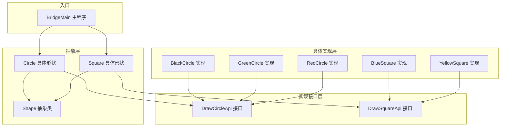
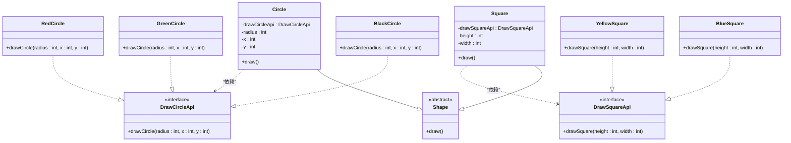
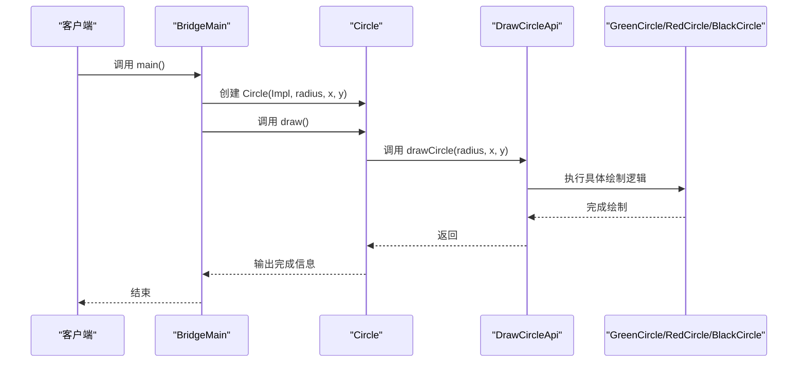
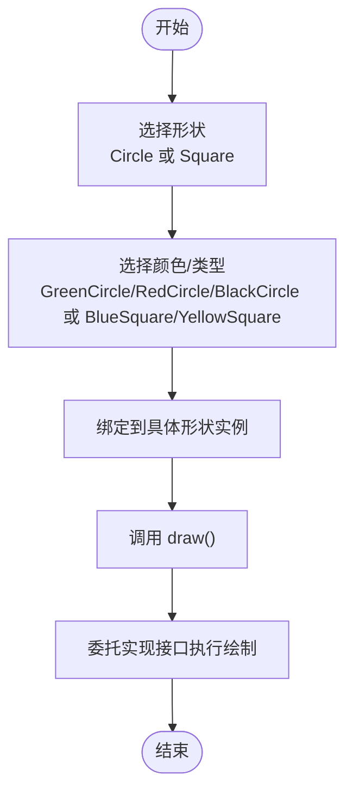
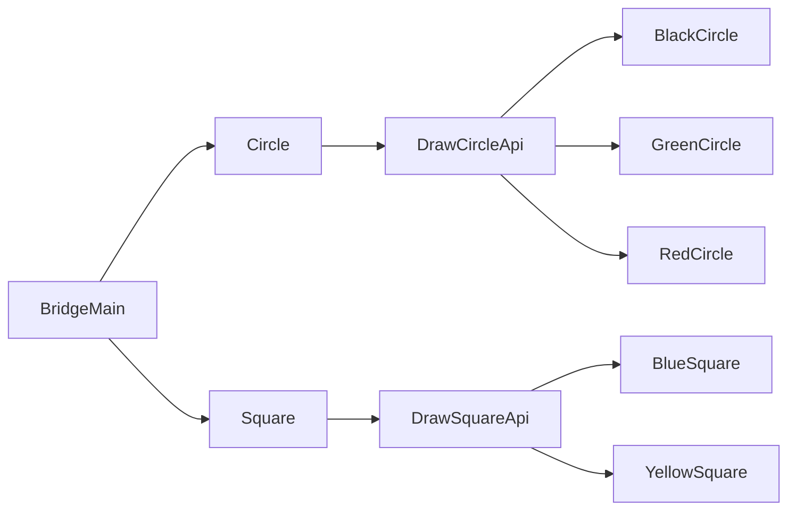

# 桥接模式

<cite>
**本文引用的文件**
- [BridgeMain.java](file://structural/bridge/src/main/java/com/future/rocket/gof23/bridge/BridgeMain.java)
- [Shape.java](file://structural/bridge/src/main/java/com/future/rocket/gof23/bridge/struct/base/Shape.java)
- [Circle.java](file://structural/bridge/src/main/java/com/future/rocket/gof23/bridge/struct/Circle.java)
- [Square.java](file://structural/bridge/src/main/java/com/future/rocket/gof23/bridge/struct/Square.java)
- [DrawCircleApi.java](file://structural/bridge/src/main/java/com/future/rocket/gof23/bridge/iface/DrawCircleApi.java)
- [DrawSquareApi.java](file://structural/bridge/src/main/java/com/future/rocket/gof23/bridge/iface/DrawSquareApi.java)
- [BlackCircle.java](file://structural/bridge/src/main/java/com/future/rocket/gof23/bridge/impl/circle/BlackCircle.java)
- [GreenCircle.java](file://structural/bridge/src/main/java/com/future/rocket/gof23/bridge/impl/circle/GreenCircle.java)
- [RedCircle.java](file://structural/bridge/src/main/java/com/future/rocket/gof23/bridge/impl/circle/RedCircle.java)
- [BlueSquare.java](file://structural/bridge/src/main/java/com/future/rocket/gof23/bridge/impl/square/BlueSquare.java)
- [YellowSquare.java](file://structural/bridge/src/main/java/com/future/rocket/gof23/bridge/impl/square/YellowSquare.java)
- [OtherTool.java](file://common/src/main/java/com/future/rocket/gof23/common/OtherTool.java)
- [readme.md](file://structural/bridge/readme.md)
</cite>

## 目录
1. [引言](#引言)
2. [项目结构](#项目结构)
3. [核心组件](#核心组件)
4. [架构总览](#架构总览)
5. [详细组件分析](#详细组件分析)
6. [依赖分析](#依赖分析)
7. [性能考虑](#性能考虑)
8. [故障排除指南](#故障排除指南)
9. [结论](#结论)
10. [附录](#附录)

## 引言
本文件系统化阐述桥接模式的设计原理与在“形状绘制系统”中的应用。桥接模式通过将抽象部分与实现部分解耦，使两者可以独立变化，从而避免继承层次的爆炸性增长。本文以圆形与方形的绘制为例，展示如何通过“形状抽象层”与“绘制实现层”的分离，实现颜色与形状的自由组合扩展，并给出完整的类图、时序图与流程图，帮助读者从概念到实现全面掌握该模式。

## 项目结构
桥接模式示例位于 structural/bridge 模块中，采用分层组织：
- 抽象层：struct/base/Shape（抽象形状）
- 形状实现层：struct/Circle.java、struct/Square.java（具体形状）
- 实现接口层：iface/DrawCircleApi.java、iface/DrawSquareApi.java（绘制API接口）
- 具体实现层：impl/circle/*、impl/square/*（不同颜色/类型的绘制实现）
- 示例入口：BridgeMain.java（演示组合调用）

图表来源
- [Shape.java:1-6](file://structural/bridge/src/main/java/com/future/rocket/gof23/bridge/struct/base/Shape.java#L1-L6)
- [Circle.java:1-25](file://structural/bridge/src/main/java/com/future/rocket/gof23/bridge/struct/Circle.java#L1-L25)
- [Square.java:1-24](file://structural/bridge/src/main/java/com/future/rocket/gof23/bridge/struct/Square.java#L1-L24)
- [DrawCircleApi.java:1-6](file://structural/bridge/src/main/java/com/future/rocket/gof23/bridge/iface/DrawCircleApi.java#L1-L6)
- [DrawSquareApi.java:1-6](file://structural/bridge/src/main/java/com/future/rocket/gof23/bridge/iface/DrawSquareApi.java#L1-L6)
- [BlackCircle.java:1-11](file://structural/bridge/src/main/java/com/future/rocket/gof23/bridge/impl/circle/BlackCircle.java#L1-L11)
- [GreenCircle.java:1-12](file://structural/bridge/src/main/java/com/future/rocket/gof23/bridge/impl/circle/GreenCircle.java#L1-L12)
- [RedCircle.java:1-12](file://structural/bridge/src/main/java/com/future/rocket/gof23/bridge/impl/circle/RedCircle.java#L1-L12)
- [BlueSquare.java:1-11](file://structural/bridge/src/main/java/com/future/rocket/gof23/bridge/impl/square/BlueSquare.java#L1-L11)
- [YellowSquare.java:1-11](file://structural/bridge/src/main/java/com/future/rocket/gof23/bridge/impl/square/YellowSquare.java#L1-L11)
- [BridgeMain.java:1-31](file://structural/bridge/src/main/java/com/future/rocket/gof23/bridge/BridgeMain.java#L1-L31)

章节来源
- [readme.md:1-11](file://structural/bridge/readme.md#L1-L11)

## 核心组件
- 抽象形状 Shape：定义统一的绘制接口，不直接绑定具体绘制实现。
- 具体形状 Circle、Square：持有对应绘制接口实例，将绘制委托给实现层。
- 绘制接口 DrawCircleApi、DrawSquareApi：定义形状对应的绘制能力签名。
- 具体实现 BlackCircle、GreenCircle、RedCircle、BlueSquare、YellowSquare：实现绘制细节，关注颜色/尺寸等实现特性。
- 主程序 BridgeMain：演示如何通过组合方式创建不同颜色的圆形与方形并执行绘制。

章节来源
- [Shape.java:1-6](file://structural/bridge/src/main/java/com/future/rocket/gof23/bridge/struct/base/Shape.java#L1-L6)
- [Circle.java:1-25](file://structural/bridge/src/main/java/com/future/rocket/gof23/bridge/struct/Circle.java#L1-L25)
- [Square.java:1-24](file://structural/bridge/src/main/java/com/future/rocket/gof23/bridge/struct/Square.java#L1-L24)
- [DrawCircleApi.java:1-6](file://structural/bridge/src/main/java/com/future/rocket/gof23/bridge/iface/DrawCircleApi.java#L1-L6)
- [DrawSquareApi.java:1-6](file://structural/bridge/src/main/java/com/future/rocket/gof23/bridge/iface/DrawSquareApi.java#L1-L6)
- [BlackCircle.java:1-11](file://structural/bridge/src/main/java/com/future/rocket/gof23/bridge/impl/circle/BlackCircle.java#L1-L11)
- [GreenCircle.java:1-12](file://structural/bridge/src/main/java/com/future/rocket/gof23/bridge/impl/circle/GreenCircle.java#L1-L12)
- [RedCircle.java:1-12](file://structural/bridge/src/main/java/com/future/rocket/gof23/bridge/impl/circle/RedCircle.java#L1-L12)
- [BlueSquare.java:1-11](file://structural/bridge/src/main/java/com/future/rocket/gof23/bridge/impl/square/BlueSquare.java#L1-L11)
- [YellowSquare.java:1-11](file://structural/bridge/src/main/java/com/future/rocket/gof23/bridge/impl/square/YellowSquare.java#L1-L11)
- [BridgeMain.java:1-31](file://structural/bridge/src/main/java/com/future/rocket/gof23/bridge/BridgeMain.java#L1-L31)

## 架构总览
桥接模式通过“抽象-实现”两条独立的继承树实现解耦：
- 抽象层：Shape 及其子类（Circle、Square）负责形状语义与行为。
- 实现层：DrawCircleApi/DrawSquareApi 及其实现类负责绘制细节。
- 组合关系：具体形状对象持有一个实现接口实例，运行时动态绑定实现。

图表来源
- [Shape.java:1-6](file://structural/bridge/src/main/java/com/future/rocket/gof23/bridge/struct/base/Shape.java#L1-L6)
- [Circle.java:1-25](file://structural/bridge/src/main/java/com/future/rocket/gof23/bridge/struct/Circle.java#L1-L25)
- [Square.java:1-24](file://structural/bridge/src/main/java/com/future/rocket/gof23/bridge/struct/Square.java#L1-L24)
- [DrawCircleApi.java:1-6](file://structural/bridge/src/main/java/com/future/rocket/gof23/bridge/iface/DrawCircleApi.java#L1-L6)
- [DrawSquareApi.java:1-6](file://structural/bridge/src/main/java/com/future/rocket/gof23/bridge/iface/DrawSquareApi.java#L1-L6)
- [BlackCircle.java:1-11](file://structural/bridge/src/main/java/com/future/rocket/gof23/bridge/impl/circle/BlackCircle.java#L1-L11)
- [GreenCircle.java:1-12](file://structural/bridge/src/main/java/com/future/rocket/gof23/bridge/impl/circle/GreenCircle.java#L1-L12)
- [RedCircle.java:1-12](file://structural/bridge/src/main/java/com/future/rocket/gof23/bridge/impl/circle/RedCircle.java#L1-L12)
- [BlueSquare.java:1-11](file://structural/bridge/src/main/java/com/future/rocket/gof23/bridge/impl/square/BlueSquare.java#L1-L11)
- [YellowSquare.java:1-11](file://structural/bridge/src/main/java/com/future/rocket/gof23/bridge/impl/square/YellowSquare.java#L1-L11)

## 详细组件分析

### 抽象层：Shape 与具体形状
- Shape 抽象类仅定义统一的绘制接口，不涉及任何实现细节，确保抽象不受实现变化影响。
- Circle 与 Square 分别持有对应绘制接口实例，将绘制动作委托给实现层，从而实现“形状语义”与“绘制实现”的分离。

图表来源
- [BridgeMain.java:14-29](file://structural/bridge/src/main/java/com/future/rocket/gof23/bridge/BridgeMain.java#L14-L29)
- [Circle.java:19-23](file://structural/bridge/src/main/java/com/future/rocket/gof23/bridge/struct/Circle.java#L19-L23)
- [DrawCircleApi.java:3-5](file://structural/bridge/src/main/java/com/future/rocket/gof23/bridge/iface/DrawCircleApi.java#L3-L5)
- [GreenCircle.java:5-11](file://structural/bridge/src/main/java/com/future/rocket/gof23/bridge/impl/circle/GreenCircle.java#L5-L11)
- [RedCircle.java:5-11](file://structural/bridge/src/main/java/com/future/rocket/gof23/bridge/impl/circle/RedCircle.java#L5-L11)
- [BlackCircle.java:5-10](file://structural/bridge/src/main/java/com/future/rocket/gof23/bridge/impl/circle/BlackCircle.java#L5-L10)

章节来源
- [Shape.java:3-5](file://structural/bridge/src/main/java/com/future/rocket/gof23/bridge/struct/base/Shape.java#L3-L5)
- [Circle.java:6-23](file://structural/bridge/src/main/java/com/future/rocket/gof23/bridge/struct/Circle.java#L6-L23)
- [Square.java:6-22](file://structural/bridge/src/main/java/com/future/rocket/gof23/bridge/struct/Square.java#L6-L22)

### 实现接口层：DrawCircleApi 与 DrawSquareApi
- DrawCircleApi 定义圆的绘制签名，DrawSquareApi 定义方的绘制签名。
- 通过接口隔离，具体形状无需关心底层绘制实现，只需持有对应接口即可。

章节来源
- [DrawCircleApi.java:3-5](file://structural/bridge/src/main/java/com/future/rocket/gof23/bridge/iface/DrawCircleApi.java#L3-L5)
- [DrawSquareApi.java:3-5](file://structural/bridge/src/main/java/com/future/rocket/gof23/bridge/iface/DrawSquareApi.java#L3-L5)

### 具体实现层：颜色与形状的组合扩展
- 圆形实现：BlackCircle、GreenCircle、RedCircle 实现 DrawCircleApi。
- 方形实现：BlueSquare、YellowSquare 实现 DrawSquareApi。
- 组合扩展：任意形状可与任意实现组合，无需新增继承层级，避免了“形状×颜色”的继承爆炸。

图表来源
- [Circle.java:19-23](file://structural/bridge/src/main/java/com/future/rocket/gof23/bridge/struct/Circle.java#L19-L23)
- [Square.java:18-22](file://structural/bridge/src/main/java/com/future/rocket/gof23/bridge/struct/Square.java#L18-L22)
- [BlackCircle.java:5-10](file://structural/bridge/src/main/java/com/future/rocket/gof23/bridge/impl/circle/BlackCircle.java#L5-L10)
- [GreenCircle.java:5-11](file://structural/bridge/src/main/java/com/future/rocket/gof23/bridge/impl/circle/GreenCircle.java#L5-L11)
- [RedCircle.java:5-11](file://structural/bridge/src/main/java/com/future/rocket/gof23/bridge/impl/circle/RedCircle.java#L5-L11)
- [BlueSquare.java:5-10](file://structural/bridge/src/main/java/com/future/rocket/gof23/bridge/impl/square/BlueSquare.java#L5-L10)
- [YellowSquare.java:5-10](file://structural/bridge/src/main/java/com/future/rocket/gof23/bridge/impl/square/YellowSquare.java#L5-L10)

章节来源
- [BlackCircle.java:5-10](file://structural/bridge/src/main/java/com/future/rocket/gof23/bridge/impl/circle/BlackCircle.java#L5-L10)
- [GreenCircle.java:5-11](file://structural/bridge/src/main/java/com/future/rocket/gof23/bridge/impl/circle/GreenCircle.java#L5-L11)
- [RedCircle.java:5-11](file://structural/bridge/src/main/java/com/future/rocket/gof23/bridge/impl/circle/RedCircle.java#L5-L11)
- [BlueSquare.java:5-10](file://structural/bridge/src/main/java/com/future/rocket/gof23/bridge/impl/square/BlueSquare.java#L5-L10)
- [YellowSquare.java:5-10](file://structural/bridge/src/main/java/com/future/rocket/gof23/bridge/impl/square/YellowSquare.java#L5-L10)

### 主程序：演示组合扩展
- BridgeMain 展示了如何通过构造函数注入不同的实现，创建不同颜色的圆形与不同尺寸的方形，并调用 draw() 完成绘制。
- 使用工具类输出分隔线，便于观察不同组合的输出结果。

章节来源
- [BridgeMain.java:14-29](file://structural/bridge/src/main/java/com/future/rocket/gof23/bridge/BridgeMain.java#L14-L29)
- [OtherTool.java:8-10](file://common/src/main/java/com/future/rocket/gof23/common/OtherTool.java#L8-L10)

## 依赖分析
- 抽象层对实现层无直接依赖，仅通过接口交互，降低耦合度。
- 具体形状依赖对应绘制接口，实现层实现接口，形成稳定的桥接关系。
- 主程序依赖具体形状与具体实现，但通过组合注入，可在不修改主程序的情况下扩展新实现。

图表来源
- [BridgeMain.java:3-9](file://structural/bridge/src/main/java/com/future/rocket/gof23/bridge/BridgeMain.java#L3-L9)
- [Circle.java:3-4](file://structural/bridge/src/main/java/com/future/rocket/gof23/bridge/struct/Circle.java#L3-L4)
- [Square.java:3-4](file://structural/bridge/src/main/java/com/future/rocket/gof23/bridge/struct/Square.java#L3-L4)
- [DrawCircleApi.java:3-5](file://structural/bridge/src/main/java/com/future/rocket/gof23/bridge/iface/DrawCircleApi.java#L3-L5)
- [DrawSquareApi.java:3-5](file://structural/bridge/src/main/java/com/future/rocket/gof23/bridge/iface/DrawSquareApi.java#L3-L5)
- [BlackCircle.java](file://structural/bridge/src/main/java/com/future/rocket/gof23/bridge/impl/circle/BlackCircle.java#L3)
- [GreenCircle.java](file://structural/bridge/src/main/java/com/future/rocket/gof23/bridge/impl/circle/GreenCircle.java#L3)
- [RedCircle.java](file://structural/bridge/src/main/java/com/future/rocket/gof23/bridge/impl/circle/RedCircle.java#L3)
- [BlueSquare.java](file://structural/bridge/src/main/java/com/future/rocket/gof23/bridge/impl/square/BlueSquare.java#L3)
- [YellowSquare.java](file://structural/bridge/src/main/java/com/future/rocket/gof23/bridge/impl/square/YellowSquare.java#L3)

## 性能考虑
- 运行时开销：桥接模式引入一次方法调用转发（形状到实现接口），通常为常数级开销，对性能影响可忽略。
- 内存占用：每种实现作为独立对象存在，组合扩展不会增加继承层级，内存占用与实现数量线性相关。
- 可维护性：通过接口与组合，替换或新增实现的成本低，有利于长期演进与性能优化。

## 故障排除指南
- 症状：调用 draw() 后无输出或输出异常
  - 排查：确认传入的实现对象是否正确初始化，接口签名是否匹配。
  - 参考：检查具体实现类的 draw 方法实现与接口签名一致性。
- 症状：编译错误或运行时找不到类
  - 排查：确认包路径与导入是否正确，模块依赖是否完整。
- 症状：组合扩展后行为不符合预期
  - 排查：验证构造函数参数顺序与含义，确保形状与实现接口匹配。

章节来源
- [Circle.java:12-23](file://structural/bridge/src/main/java/com/future/rocket/gof23/bridge/struct/Circle.java#L12-L23)
- [Square.java:12-22](file://structural/bridge/src/main/java/com/future/rocket/gof23/bridge/struct/Square.java#L12-L22)
- [BlackCircle.java:7-9](file://structural/bridge/src/main/java/com/future/rocket/gof23/bridge/impl/circle/BlackCircle.java#L7-L9)
- [GreenCircle.java:8-9](file://structural/bridge/src/main/java/com/future/rocket/gof23/bridge/impl/circle/GreenCircle.java#L8-L9)
- [RedCircle.java:8-9](file://structural/bridge/src/main/java/com/future/rocket/gof23/bridge/impl/circle/RedCircle.java#L8-L9)
- [BlueSquare.java:7-8](file://structural/bridge/src/main/java/com/future/rocket/gof23/bridge/impl/square/BlueSquare.java#L7-L8)
- [YellowSquare.java:7-8](file://structural/bridge/src/main/java/com/future/rocket/gof23/bridge/impl/square/YellowSquare.java#L7-L8)

## 结论
桥接模式通过“抽象-实现”分离，实现了形状语义与绘制实现的独立演化。在本示例中，Circle 与 Square 仅关注形状语义，绘制细节由实现接口承担；通过组合而非继承，避免了“形状×颜色”的继承爆炸，提升了系统的可扩展性与可维护性。该模式适用于需要在两个维度上独立扩展的场景，是结构型模式中的经典范例。

## 附录
- 应用场景建议
  - 需要在多个维度上独立扩展：如图形系统中的“形状×颜色”、“设备×协议”等。
  - 希望减少继承层次复杂度，提升代码复用与可测试性。
- 最佳实践
  - 明确抽象与实现的边界，保持接口稳定。
  - 使用组合注入，避免在抽象层硬编码实现细节。
  - 对实现层进行单元测试，确保绘制逻辑的正确性与稳定性。