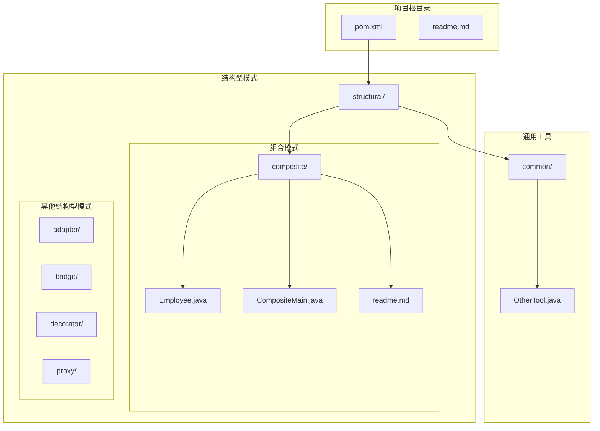
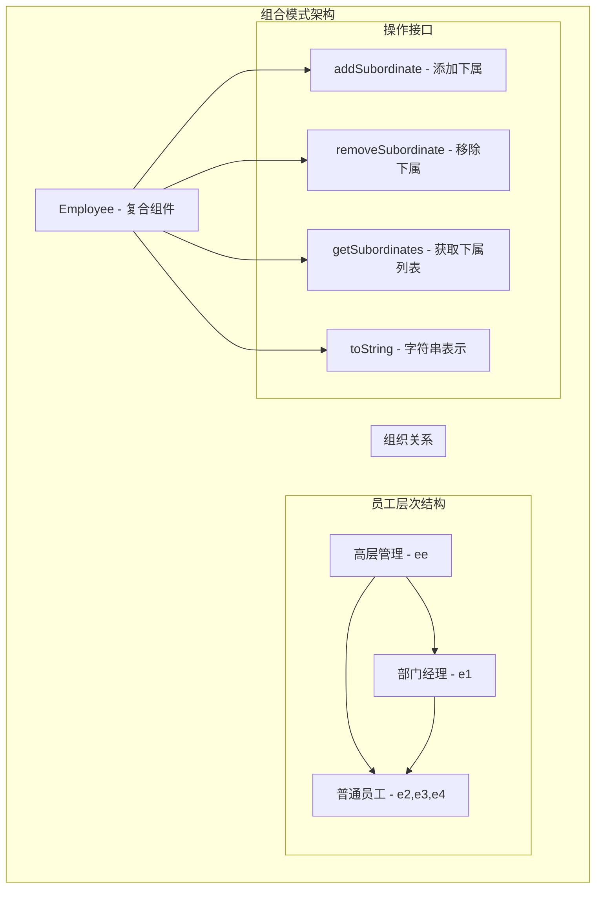
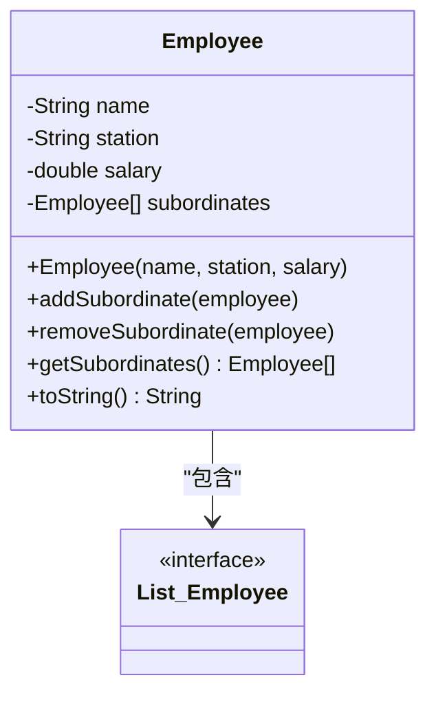
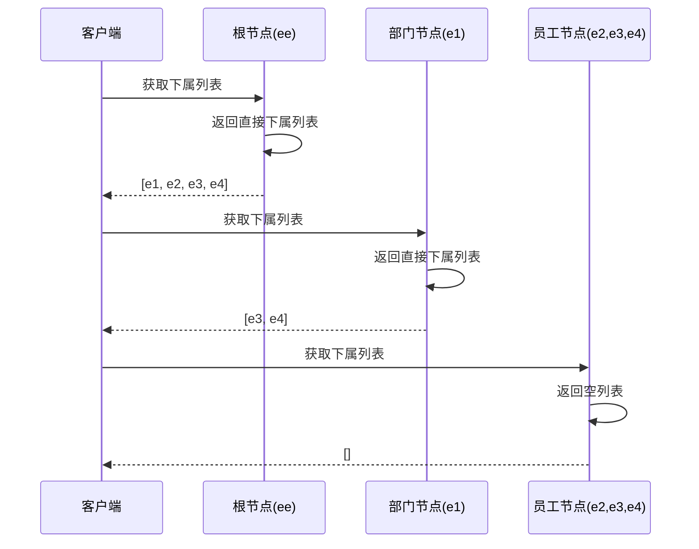
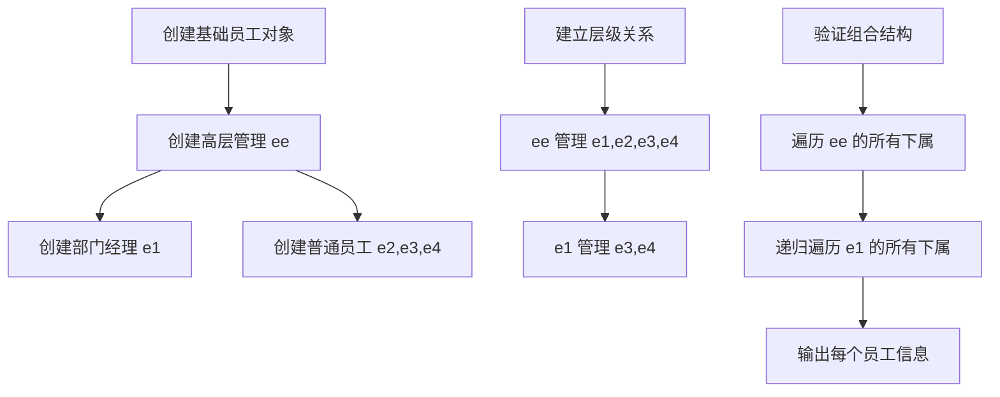
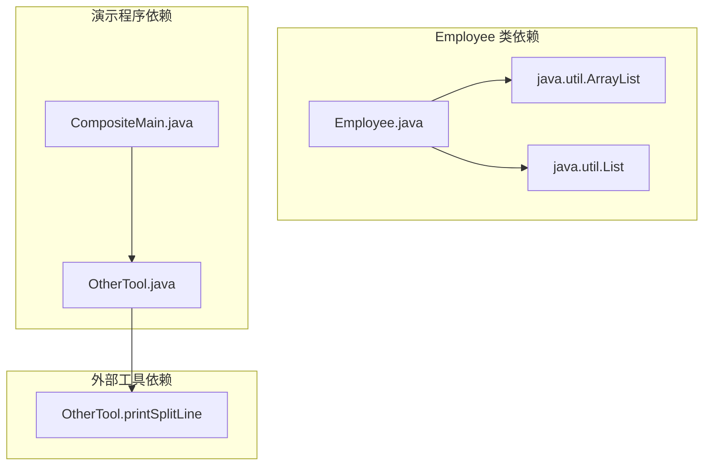

# 组合模式

<cite>
**本文档引用的文件**
- [Employee.java](file://structural/composite/src/main/java/com/future/rocket/gof23/composite/Employee.java)
- [CompositeMain.java](file://structural/composite/src/main/java/com/future/rocket/gof23/composite/CompositeMain.java)
- [OtherTool.java](file://common/src/main/java/com/future/rocket/gof23/common/OtherTool.java)
- [readme.md](file://structural/composite/readme.md)
</cite>

## 目录
1. [引言](#引言)
2. [项目结构](#项目结构)
3. [核心组件](#核心组件)
4. [架构概览](#架构概览)
5. [详细组件分析](#详细组件分析)
6. [依赖分析](#依赖分析)
7. [性能考虑](#性能考虑)
8. [故障排除指南](#故障排除指南)
9. [结论](#结论)
10. [附录](#附录)

## 引言

组合模式（Composite Pattern）是一种结构型设计模式，它允许您将对象组合成树形结构以表示"部分-整体"的层次结构。该模式使得客户端对单个对象和组合对象的使用具有一致性。在本项目中，我们通过员工组织结构的实际示例来演示组合模式的核心概念和实现方式。

组合模式的核心思想是：
- 将对象组合成树形结构以表示部分-整体的层次结构
- 客户端可以统一处理单个对象和组合对象
- 通过递归组合实现透明的层次遍历

## 项目结构

该项目采用模块化组织方式，组合模式位于结构型设计模式目录下：

**图表来源**
- [Employee.java:1-40](file://structural/composite/src/main/java/com/future/rocket/gof23/composite/Employee.java#L1-L40)
- [CompositeMain.java:1-36](file://structural/composite/src/main/java/com/future/rocket/gof23/composite/CompositeMain.java#L1-L36)

**章节来源**
- [readme.md:1-8](file://structural/composite/readme.md#L1-L8)

## 核心组件

组合模式在本项目中的实现主要由以下核心组件构成：

### Employee 类（复合组件）

Employee 类是组合模式的核心实现，它同时充当：
- **叶子节点**：表示单个员工对象
- **组合节点**：可以包含多个下属员工

该类的关键特性：
- 包含员工基本信息（姓名、职位、薪资）
- 维护下属员工列表
- 提供添加、移除、获取下属的方法
- 实现统一的字符串表示方法

### CompositeMain 类（演示入口）

CompositeMain 类展示了组合模式的实际应用场景：
- 创建多层员工组织结构
- 展示递归组合的层次遍历
- 验证统一接口的一致性

**章节来源**
- [Employee.java:6-39](file://structural/composite/src/main/java/com/future/rocket/gof23/composite/Employee.java#L6-L39)
- [CompositeMain.java:5-35](file://structural/composite/src/main/java/com/future/rocket/gof23/composite/CompositeMain.java#L5-L35)

## 架构概览

组合模式的架构设计体现了"部分-整体"的层次结构：

**图表来源**
- [Employee.java:13-38](file://structural/composite/src/main/java/com/future/rocket/gof23/composite/Employee.java#L13-L38)
- [CompositeMain.java:9-33](file://structural/composite/src/main/java/com/future/rocket/gof23/composite/CompositeMain.java#L9-L33)

## 详细组件分析

### Employee 类深度分析

Employee 类实现了组合模式的核心逻辑：

#### 数据结构设计

**图表来源**
- [Employee.java:8-11](file://structural/composite/src/main/java/com/future/rocket/gof23/composite/Employee.java#L8-L11)
- [Employee.java:20-38](file://structural/composite/src/main/java/com/future/rocket/gof23/composite/Employee.java#L20-L38)

#### 关键方法实现分析

1. **构造函数**：初始化员工基本信息和空的下属列表
2. **addSubordinate 方法**：向当前员工添加直接下属
3. **removeSubordinate 方法**：从当前员工移除指定下属
4. **getSubordinates 方法**：返回当前员工的所有直接下属
5. **toString 方法**：提供统一的对象表示格式

#### 递归组合的实现机制

组合模式通过以下方式实现透明的递归组合：

**图表来源**
- [CompositeMain.java:19-33](file://structural/composite/src/main/java/com/future/rocket/gof23/composite/CompositeMain.java#L19-L33)

**章节来源**
- [Employee.java:13-38](file://structural/composite/src/main/java/com/future/rocket/gof23/composite/Employee.java#L13-L38)
- [CompositeMain.java:9-33](file://structural/composite/src/main/java/com/future/rocket/gof23/composite/CompositeMain.java#L9-L33)

### 组合模式的层次结构构建

通过 CompositeMain 类，我们可以看到完整的层次结构构建过程：

**图表来源**
- [CompositeMain.java:9-33](file://structural/composite/src/main/java/com/future/rocket/gof23/composite/CompositeMain.java#L9-L33)

**章节来源**
- [CompositeMain.java:6-34](file://structural/composite/src/main/java/com/future/rocket/gof23/composite/CompositeMain.java#L6-L34)

## 依赖分析

组合模式的依赖关系相对简单，主要涉及内部依赖：

**图表来源**
- [Employee.java:3-4](file://structural/composite/src/main/java/com/future/rocket/gof23/composite/Employee.java#L3-L4)
- [CompositeMain.java](file://structural/composite/src/main/java/com/future/rocket/gof23/composite/CompositeMain.java#L3)
- [OtherTool.java:8-10](file://common/src/main/java/com/future/rocket/gof23/common/OtherTool.java#L8-L10)

**章节来源**
- [Employee.java:3-4](file://structural/composite/src/main/java/com/future/rocket/gof23/composite/Employee.java#L3-L4)
- [CompositeMain.java](file://structural/composite/src/main/java/com/future/rocket/gof23/composite/CompositeMain.java#L3)
- [OtherTool.java:3-11](file://common/src/main/java/com/future/rocket/gof23/common/OtherTool.java#L3-L11)

## 性能考虑

组合模式在实际应用中的性能特征：

### 时间复杂度分析

1. **添加下属操作**：O(1) - 使用动态数组的尾部插入
2. **移除下属操作**：O(n) - 需要线性搜索匹配的员工
3. **获取下属列表**：O(1) - 直接返回内部列表引用
4. **递归遍历**：O(n) - n为树中节点总数

### 空间复杂度分析

- **内存占用**：每个 Employee 对象约占用 32-48 字节（取决于 JVM 实现）
- **树形存储**：空间复杂度为 O(n)，n 为员工总数
- **递归深度**：最大深度等于组织层级数

### 性能优化建议

1. **使用合适的集合类型**：对于频繁删除操作，可考虑使用 LinkedList
2. **缓存常用查询结果**：对频繁访问的子树结果进行缓存
3. **避免过深的递归**：对于超大组织结构，考虑使用迭代替代递归
4. **延迟加载策略**：只在需要时才加载子节点信息

## 故障排除指南

### 常见问题及解决方案

#### 1. 空指针异常
**问题描述**：在获取下属列表时可能遇到空指针异常
**解决方案**：确保在使用前检查列表是否为空，或在构造函数中初始化空列表

#### 2. 循环引用问题
**问题描述**：可能出现员工相互作为下属的情况
**解决方案**：在添加下属时进行循环检测，确保不会形成环状结构

#### 3. 内存泄漏风险
**问题描述**：大量嵌套对象可能导致内存占用过高
**解决方案**：及时清理不再使用的对象引用，定期进行垃圾回收

#### 4. 性能瓶颈
**问题描述**：深层递归可能导致栈溢出
**解决方案**：使用迭代方式替代递归，或增加递归深度限制

**章节来源**
- [Employee.java](file://structural/composite/src/main/java/com/future/rocket/gof23/composite/Employee.java#L17)
- [CompositeMain.java:28-33](file://structural/composite/src/main/java/com/future/rocket/gof23/composite/CompositeMain.java#L28-L33)

## 结论

组合模式通过将对象组合成树形结构，成功解决了"部分-整体"层次结构的统一处理问题。在本项目的员工组织结构示例中，Employee 类完美实现了复合组件的设计，既能够表示单个员工，又能够表示包含多个下属的管理层。

### 主要优势

1. **统一接口**：客户端无需区分处理单个对象还是组合对象
2. **透明递归**：通过递归组合实现层次结构的透明访问
3. **扩展性强**：可以轻松添加新的员工类型或组织层级
4. **维护简便**：统一的数据结构简化了业务逻辑的实现

### 设计注意事项

1. **职责分离**：确保复合组件的职责清晰，避免过度复杂化
2. **一致性原则**：所有子节点应遵循相同的接口规范
3. **性能权衡**：在递归深度和性能之间找到平衡点
4. **错误处理**：完善边界条件和异常情况的处理机制

组合模式特别适用于需要处理层次结构的场景，如文件系统、组织架构、GUI 组件等。通过合理的设计和实现，可以构建出既灵活又高效的层次化系统。

## 附录

### 组合模式与其他相关模式的区别

#### 组合模式 vs 聚合模式

| 特征 | 组合模式 | 聚合模式 |
|------|----------|----------|
| 关系强度 | 强关联（拥有关系） | 弱关联（包含关系） |
| 生命周期 | 共同存在 | 独立存在 |
| 销毁行为 | 父对象销毁时子对象也销毁 | 子对象独立销毁 |
| 示例 | 员工与其下属 | 员工与其工作台 |

#### 何时选择组合模式

1. **层次结构需求**：需要表示"部分-整体"的层次关系
2. **统一操作需求**：希望对单个对象和组合对象使用相同接口
3. **递归处理需求**：需要递归遍历整个层次结构
4. **动态组合需求**：需要在运行时动态添加或移除组件

#### 应用场景

1. **组织架构管理**：公司层级结构的建模和管理
2. **文件系统**：目录和文件的层次化管理
3. **GUI 组件**：界面元素的嵌套组合
4. **数学表达式**：算术表达式的树形结构表示
5. **游戏场景**：场景元素的层次化组织