# 结构型模式详解

<cite>
**本文引用的文件**
- [AdapterMain.java](file://structural/adapter/src/main/java/com/future/rocket/gof23/adapter/AdapterMain.java)
- [MediaAdapter.java](file://structural/adapter/src/main/java/com/future/rocket/gof23/adapter/struct/MediaAdapter.java)
- [BridgeMain.java](file://structural/bridge/src/main/java/com/future/rocket/gof23/bridge/BridgeMain.java)
- [Circle.java](file://structural/bridge/src/main/java/com/future/rocket/gof23/bridge/struct/Circle.java)
- [CompositeMain.java](file://structural/composite/src/main/java/com/future/rocket/gof23/composite/CompositeMain.java)
- [Employee.java](file://structural/composite/src/main/java/com/future/rocket/gof23/composite/Employee.java)
- [DaoMain.java](file://structural/daoPattern/src/main/java/com/future/rocket/gof23/dao/DaoMain.java)
- [StudentDaoImpl.java](file://structural/daoPattern/src/main/java/com/future/rocket/gof23/dao/impl/StudentDaoImpl.java)
- [DecoratorMain.java](file://structural/decorator/src/main/java/com/future/rocket/gof23/decorator/DecoratorMain.java)
- [RedShapeDecorator.java](file://structural/decorator/src/main/java/com/future/rocket/gof23/decorator/struct/RedShapeDecorator.java)
- [FilterMain.java](file://structural/filter/src/main/java/com/future/rocket/gof23/filter/FilterMain.java)
- [TestFlyweightMain.java](file://structural/flyweight/src/main/java/com/future/rocket/gof23/flyweight/TestFlyweightMain.java)
- [ProxyMain.java](file://structural/proxy/src/main/java/com/future/rocket/gof23/proxy/ProxyMain.java)
- [ServiceLocatorMain.java](file://structural/serviceLocator/src/main/java/com/future/rocket/gof23/service/locator/ServiceLocatorMain.java)
- [TransferObjectMain.java](file://structural/transferObject/src/main/java/com/future/rocket/gof23/transfer/object/TransferObjectMain.java)
</cite>

## 目录
1. [引言](#引言)
2. [项目结构](#项目结构)
3. [核心组件](#核心组件)
4. [架构总览](#架构总览)
5. [详细组件分析](#详细组件分析)
6. [依赖分析](#依赖分析)
7. [性能考量](#性能考量)
8. [故障排查指南](#故障排查指南)
9. [结论](#结论)
10. [附录](#附录)

## 引言
本文件面向希望系统掌握结构型设计模式的开发者，围绕仓库中已实现的11种结构型模式（适配器、桥接、组合、装饰器、外观、享元、代理、DAO、服务定位器、传输对象、过滤器）进行深入解析。内容涵盖模式的结构设计、类关系与协作机制，结合实际代码路径与UML图示，帮助不同层次读者快速理解与应用。

## 项目结构
结构型模式示例位于 structural 目录下，每个模式独立成子模块，采用按功能分层组织：接口层、实现层、结构扩展层、入口主程序等。整体风格统一，便于对比学习。

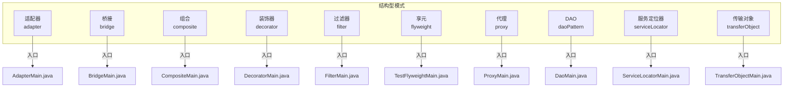

图表来源
- [AdapterMain.java:1-17](file://structural/adapter/src/main/java/com/future/rocket/gof23/adapter/AdapterMain.java#L1-L17)
- [BridgeMain.java:1-31](file://structural/bridge/src/main/java/com/future/rocket/gof23/bridge/BridgeMain.java#L1-L31)
- [CompositeMain.java:1-36](file://structural/composite/src/main/java/com/future/rocket/gof23/composite/CompositeMain.java#L1-L36)
- [DecoratorMain.java:1-29](file://structural/decorator/src/main/java/com/future/rocket/gof23/decorator/DecoratorMain.java#L1-L29)
- [FilterMain.java:1-50](file://structural/filter/src/main/java/com/future/rocket/gof23/filter/FilterMain.java#L1-L50)
- [TestFlyweightMain.java:1-54](file://structural/flyweight/src/main/java/com/future/rocket/gof23/flyweight/TestFlyweightMain.java#L1-L54)
- [ProxyMain.java:1-18](file://structural/proxy/src/main/java/com/future/rocket/gof23/proxy/ProxyMain.java#L1-L18)
- [DaoMain.java:1-30](file://structural/daoPattern/src/main/java/com/future/rocket/gof23/dao/DaoMain.java#L1-L30)
- [ServiceLocatorMain.java:1-26](file://structural/serviceLocator/src/main/java/com/future/rocket/gof23/service/locator/ServiceLocatorMain.java#L1-L26)
- [TransferObjectMain.java:1-23](file://structural/transferObject/src/main/java/com/future/rocket/gof23/transfer/object/TransferObjectMain.java#L1-L23)

章节来源
- [AdapterMain.java:1-17](file://structural/adapter/src/main/java/com/future/rocket/gof23/adapter/AdapterMain.java#L1-L17)
- [BridgeMain.java:1-31](file://structural/bridge/src/main/java/com/future/rocket/gof23/bridge/BridgeMain.java#L1-L31)
- [CompositeMain.java:1-36](file://structural/composite/src/main/java/com/future/rocket/gof23/composite/CompositeMain.java#L1-L36)
- [DecoratorMain.java:1-29](file://structural/decorator/src/main/java/com/future/rocket/gof23/decorator/DecoratorMain.java#L1-L29)
- [FilterMain.java:1-50](file://structural/filter/src/main/java/com/future/rocket/gof23/filter/FilterMain.java#L1-L50)
- [TestFlyweightMain.java:1-54](file://structural/flyweight/src/main/java/com/future/rocket/gof23/flyweight/TestFlyweightMain.java#L1-L54)
- [ProxyMain.java:1-18](file://structural/proxy/src/main/java/com/future/rocket/gof23/proxy/ProxyMain.java#L1-L18)
- [DaoMain.java:1-30](file://structural/daoPattern/src/main/java/com/future/rocket/gof23/dao/DaoMain.java#L1-L30)
- [ServiceLocatorMain.java:1-26](file://structural/serviceLocator/src/main/java/com/future/rocket/gof23/service/locator/ServiceLocatorMain.java#L1-L26)
- [TransferObjectMain.java:1-23](file://structural/transferObject/src/main/java/com/future/rocket/gof23/transfer/object/TransferObjectMain.java#L1-L23)

## 核心组件
- 适配器：通过适配器类将旧接口封装为新接口，使客户端能以统一方式调用不同播放器能力。
- 桥接：将抽象部分与实现部分分离，使它们可以独立扩展；示例中通过绘制API与形状类解耦。
- 组合：树形结构表示“整体-部分”层次，支持统一遍历与操作。
- 装饰器：在不改变原对象的前提下，动态地给对象添加职责。
- 外观：对外提供简化的统一接口，隐藏内部复杂性。
- 享元：通过共享细粒度对象减少内存占用，强调内在状态与外在状态区分。
- 代理：控制对真实对象的访问，常用于延迟加载、权限控制或日志统计。
- DAO：数据访问对象，隔离业务与持久化细节。
- 服务定位器：集中管理服务实例，提供缓存与延迟初始化能力。
- 传输对象：在远程或分层之间传递数据对象，降低调用次数。
- 过滤器：对集合数据进行条件筛选，支持与/或组合。

章节来源
- [MediaAdapter.java:1-33](file://structural/adapter/src/main/java/com/future/rocket/gof23/adapter/struct/MediaAdapter.java#L1-L33)
- [Circle.java:1-25](file://structural/bridge/src/main/java/com/future/rocket/gof23/bridge/struct/Circle.java#L1-L25)
- [Employee.java:1-40](file://structural/composite/src/main/java/com/future/rocket/gof23/composite/Employee.java#L1-L40)
- [RedShapeDecorator.java:1-21](file://structural/decorator/src/main/java/com/future/rocket/gof23/decorator/struct/RedShapeDecorator.java#L1-L21)
- [StudentDaoImpl.java:1-51](file://structural/daoPattern/src/main/java/com/future/rocket/gof23/dao/impl/StudentDaoImpl.java#L1-L51)
- [FilterMain.java:1-50](file://structural/filter/src/main/java/com/future/rocket/gof23/filter/FilterMain.java#L1-L50)
- [TestFlyweightMain.java:1-54](file://structural/flyweight/src/main/java/com/future/rocket/gof23/flyweight/TestFlyweightMain.java#L1-L54)
- [ProxyMain.java:1-18](file://structural/proxy/src/main/java/com/future/rocket/gof23/proxy/ProxyMain.java#L1-L18)
- [ServiceLocatorMain.java:1-26](file://structural/serviceLocator/src/main/java/com/future/rocket/gof23/service/locator/ServiceLocatorMain.java#L1-L26)
- [TransferObjectMain.java:1-23](file://structural/transferObject/src/main/java/com/future/rocket/gof23/transfer/object/TransferObjectMain.java#L1-L23)

## 架构总览
以下图示展示各模式在系统中的角色与交互关系（概念性示意，非特定源码映射）：

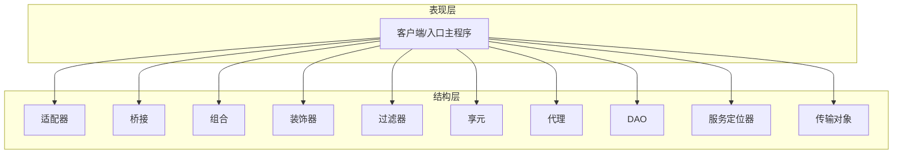

## 详细组件分析

### 适配器模式
- 设计要点
  - 客户端仅依赖统一接口，通过适配器屏蔽具体实现差异。
  - 适配器内部根据目标类型选择对应高级播放器并转发调用。
- 关键类与协作
  - 入口主程序负责构造播放器并发起播放请求。
  - 适配器持有高级播放器实例，并在统一接口中完成协议转换。
- UML 类图

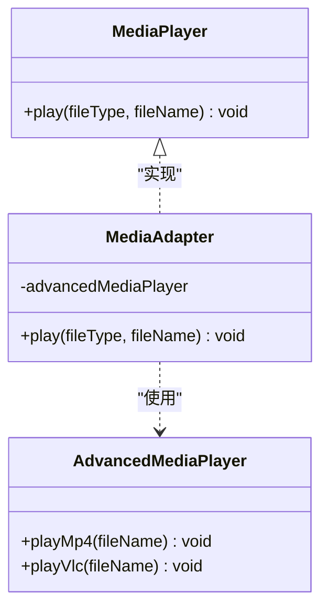

图表来源
- [AdapterMain.java:1-17](file://structural/adapter/src/main/java/com/future/rocket/gof23/adapter/AdapterMain.java#L1-L17)
- [MediaAdapter.java:1-33](file://structural/adapter/src/main/java/com/future/rocket/gof23/adapter/struct/MediaAdapter.java#L1-L33)

- 序列图（播放流程）

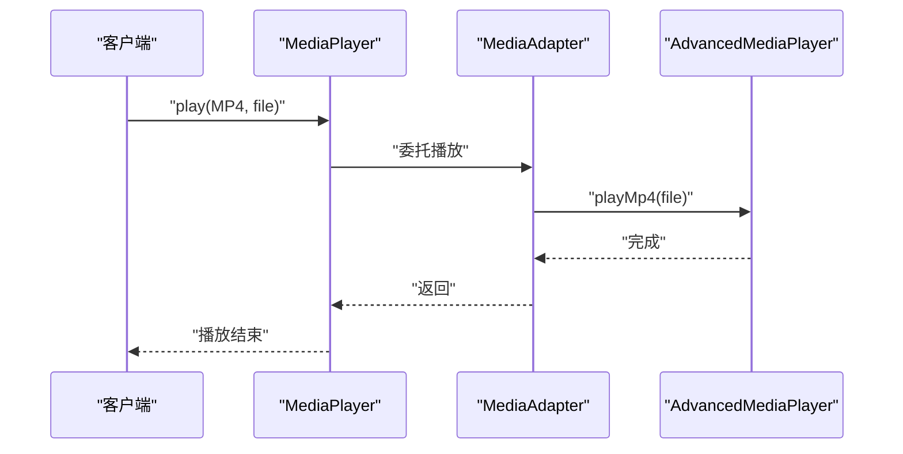

图表来源
- [AdapterMain.java:1-17](file://structural/adapter/src/main/java/com/future/rocket/gof23/adapter/AdapterMain.java#L1-L17)
- [MediaAdapter.java:1-33](file://structural/adapter/src/main/java/com/future/rocket/gof23/adapter/struct/MediaAdapter.java#L1-L33)

章节来源
- [AdapterMain.java:1-17](file://structural/adapter/src/main/java/com/future/rocket/gof23/adapter/AdapterMain.java#L1-L17)
- [MediaAdapter.java:1-33](file://structural/adapter/src/main/java/com/future/rocket/gof23/adapter/struct/MediaAdapter.java#L1-L33)

### 桥接模式
- 设计要点
  - 抽象与实现分离：形状类只关心绘制行为，具体绘制由绘制API实现。
  - 可自由组合形状与颜色实现，避免类爆炸。
- 关键类与协作
  - 形状类持有绘制API引用，在draw时委托实现。
  - 主程序通过组合不同实现来演示解耦效果。
- UML 类图

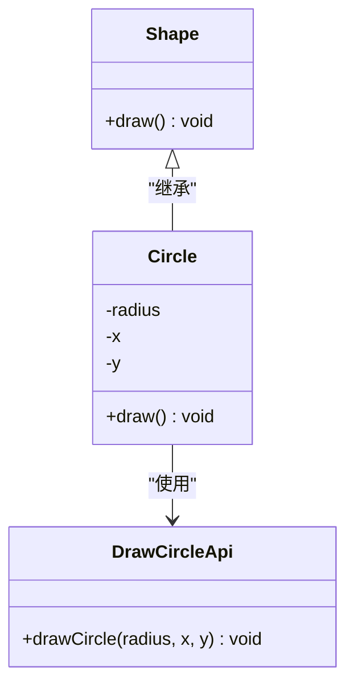

图表来源
- [BridgeMain.java:1-31](file://structural/bridge/src/main/java/com/future/rocket/gof23/bridge/BridgeMain.java#L1-L31)
- [Circle.java:1-25](file://structural/bridge/src/main/java/com/future/rocket/gof23/bridge/struct/Circle.java#L1-L25)

- 序列图（绘制流程）

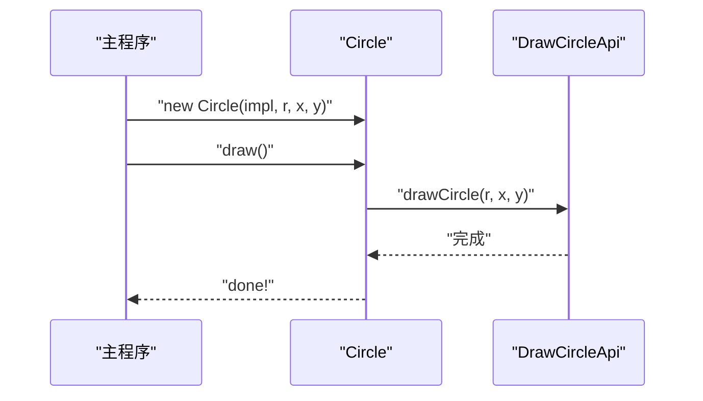

图表来源
- [BridgeMain.java:1-31](file://structural/bridge/src/main/java/com/future/rocket/gof23/bridge/BridgeMain.java#L1-L31)
- [Circle.java:1-25](file://structural/bridge/src/main/java/com/future/rocket/gof23/bridge/struct/Circle.java#L1-L25)

章节来源
- [BridgeMain.java:1-31](file://structural/bridge/src/main/java/com/future/rocket/gof23/bridge/BridgeMain.java#L1-L31)
- [Circle.java:1-25](file://structural/bridge/src/main/java/com/future/rocket/gof23/bridge/struct/Circle.java#L1-L25)

### 组合模式
- 设计要点
  - 将对象组合成树形结构以表示“整体-部分”的层次结构。
  - 客户端对单个对象和组合对象的使用具有一致性。
- 关键类与协作
  - 员工类维护下属列表，支持增删与遍历。
  - 主程序构建层级关系并递归打印。
- UML 类图

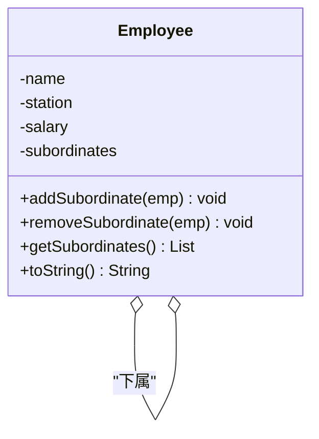

图表来源
- [CompositeMain.java:1-36](file://structural/composite/src/main/java/com/future/rocket/gof23/composite/CompositeMain.java#L1-L36)
- [Employee.java:1-40](file://structural/composite/src/main/java/com/future/rocket/gof23/composite/Employee.java#L1-L40)

- 流程图（打印子级）

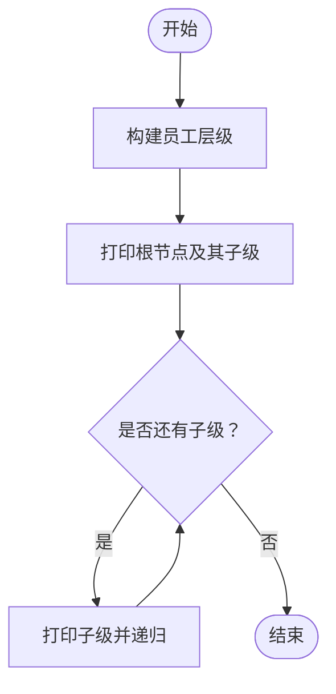

图表来源
- [CompositeMain.java:1-36](file://structural/composite/src/main/java/com/future/rocket/gof23/composite/CompositeMain.java#L1-L36)

章节来源
- [CompositeMain.java:1-36](file://structural/composite/src/main/java/com/future/rocket/gof23/composite/CompositeMain.java#L1-L36)
- [Employee.java:1-40](file://structural/composite/src/main/java/com/future/rocket/gof23/composite/Employee.java#L1-L40)

### 装饰器模式
- 设计要点
  - 在不修改被装饰对象的前提下，动态叠加职责。
  - 装饰器持有被装饰对象并在其方法前后增强行为。
- 关键类与协作
  - 装饰器在draw后执行额外逻辑（如设置颜色）。
  - 主程序依次展示基础图形与装饰后的图形。
- UML 类图

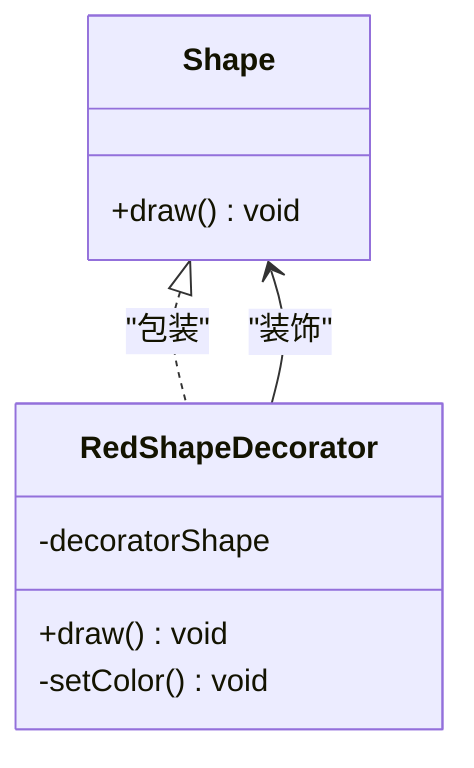

图表来源
- [DecoratorMain.java:1-29](file://structural/decorator/src/main/java/com/future/rocket/gof23/decorator/DecoratorMain.java#L1-L29)
- [RedShapeDecorator.java:1-21](file://structural/decorator/src/main/java/com/future/rocket/gof23/decorator/struct/RedShapeDecorator.java#L1-L21)

- 序列图（装饰绘制）

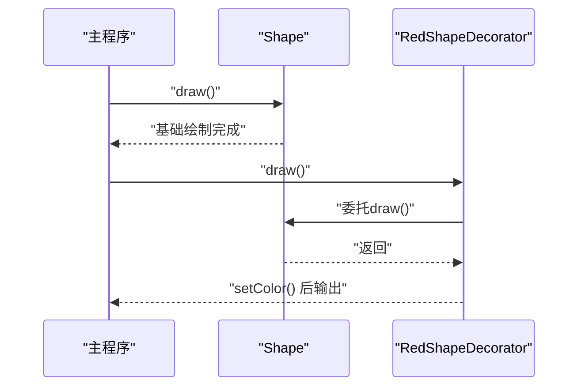

图表来源
- [DecoratorMain.java:1-29](file://structural/decorator/src/main/java/com/future/rocket/gof23/decorator/DecoratorMain.java#L1-L29)
- [RedShapeDecorator.java:1-21](file://structural/decorator/src/main/java/com/future/rocket/gof23/decorator/struct/RedShapeDecorator.java#L1-L21)

章节来源
- [DecoratorMain.java:1-29](file://structural/decorator/src/main/java/com/future/rocket/gof23/decorator/DecoratorMain.java#L1-L29)
- [RedShapeDecorator.java:1-21](file://structural/decorator/src/main/java/com/future/rocket/gof23/decorator/struct/RedShapeDecorator.java#L1-L21)

### 外观模式
- 设计要点
  - 对外提供统一入口，隐藏内部复杂流程。
  - 示例可参考前端控制器模块（frontController），但此处不展开具体实现文件。
- 实践建议
  - 将多个子系统的调用封装为高层接口，简化客户端使用。

[本节为概念性说明，不直接分析具体文件]

### 享元模式
- 设计要点
  - 通过共享对象减少内存占用；区分内在状态（可共享）与外在状态（随环境变化）。
  - 工厂负责对象复用与创建。
- 关键类与协作
  - 主程序循环生成圆对象，设置随机位置与半径，体现外在状态变化。
- UML 类图

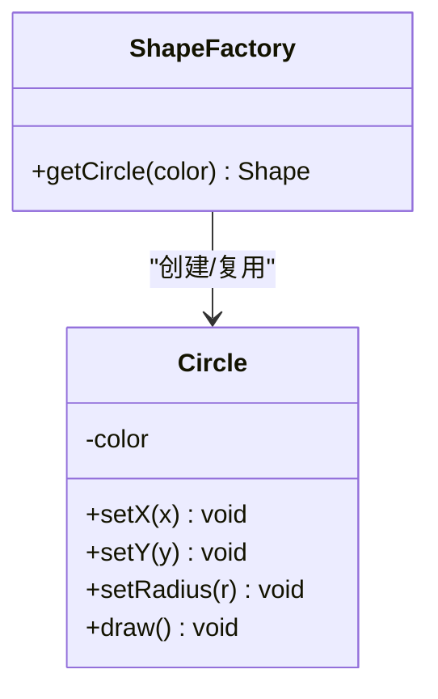

图表来源
- [TestFlyweightMain.java:1-54](file://structural/flyweight/src/main/java/com/future/rocket/gof23/flyweight/TestFlyweightMain.java#L1-L54)

- 序列图（享元绘制）

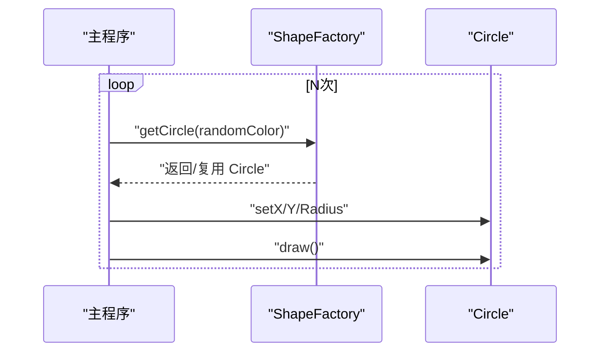

图表来源
- [TestFlyweightMain.java:1-54](file://structural/flyweight/src/main/java/com/future/rocket/gof23/flyweight/TestFlyweightMain.java#L1-L54)

章节来源
- [TestFlyweightMain.java:1-54](file://structural/flyweight/src/main/java/com/future/rocket/gof23/flyweight/TestFlyweightMain.java#L1-L54)

### 代理模式
- 设计要点
  - 控制对真实对象的访问，典型场景包括延迟加载、权限校验、日志统计。
  - 示例展示代理图像对象的重复显示，体现缓存与复用。
- 关键类与协作
  - 代理持有真实对象引用，在必要时触发加载与显示。
- UML 类图

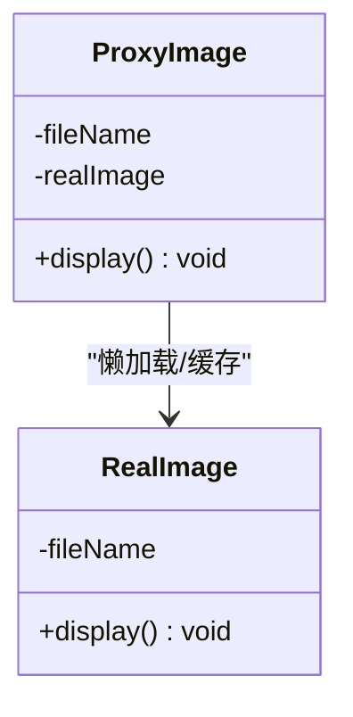

图表来源
- [ProxyMain.java:1-18](file://structural/proxy/src/main/java/com/future/rocket/gof23/proxy/ProxyMain.java#L1-L18)

- 序列图（代理显示）

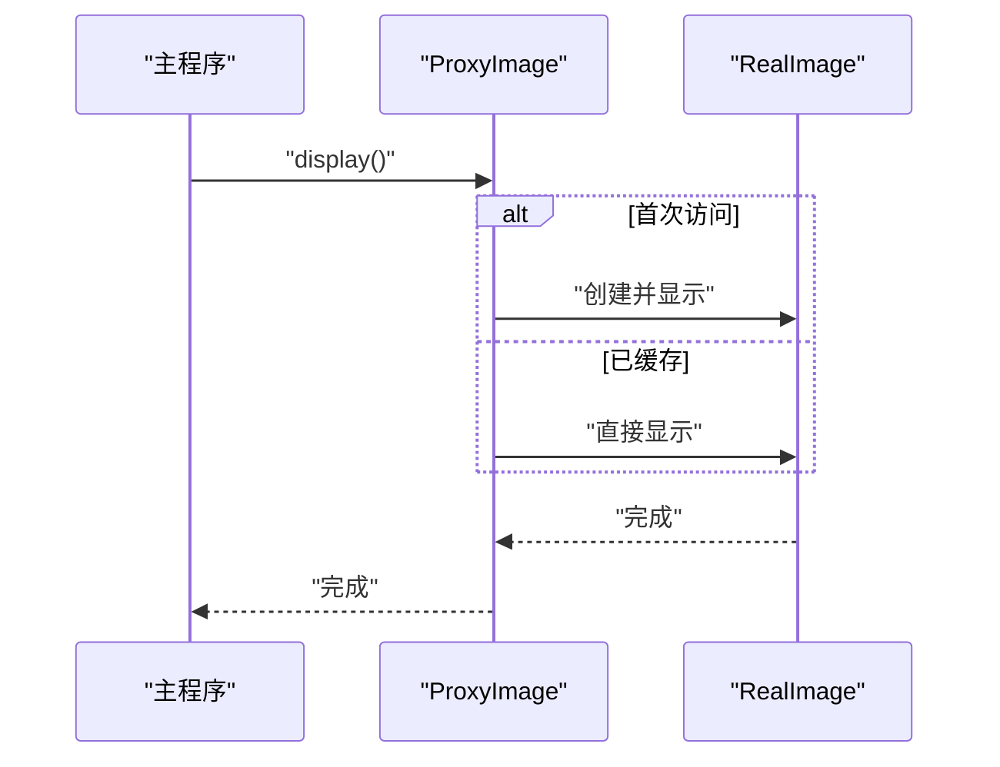

图表来源
- [ProxyMain.java:1-18](file://structural/proxy/src/main/java/com/future/rocket/gof23/proxy/ProxyMain.java#L1-L18)

章节来源
- [ProxyMain.java:1-18](file://structural/proxy/src/main/java/com/future/rocket/gof23/proxy/ProxyMain.java#L1-L18)

### DAO 模式
- 设计要点
  - 将数据访问逻辑封装到独立对象中，隔离业务与持久化细节。
  - 提供统一的数据操作接口（查询、插入、更新、删除）。
- 关键类与协作
  - 数据访问实现持有数据集合，执行增删改查。
  - 主程序演示完整生命周期操作。
- UML 类图

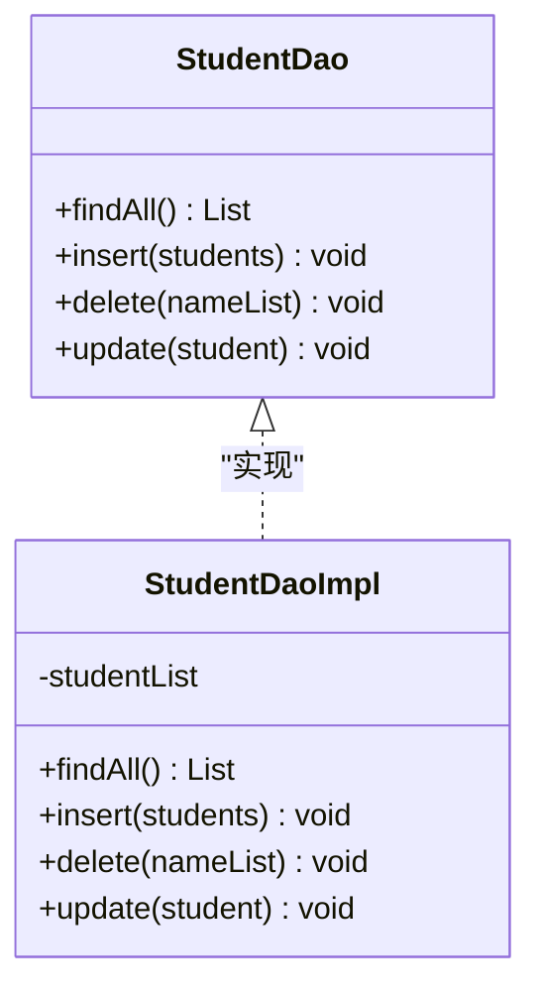

图表来源
- [DaoMain.java:1-30](file://structural/daoPattern/src/main/java/com/future/rocket/gof23/dao/DaoMain.java#L1-L30)
- [StudentDaoImpl.java:1-51](file://structural/daoPattern/src/main/java/com/future/rocket/gof23/dao/impl/StudentDaoImpl.java#L1-L51)

- 序列图（DAO 生命周期）

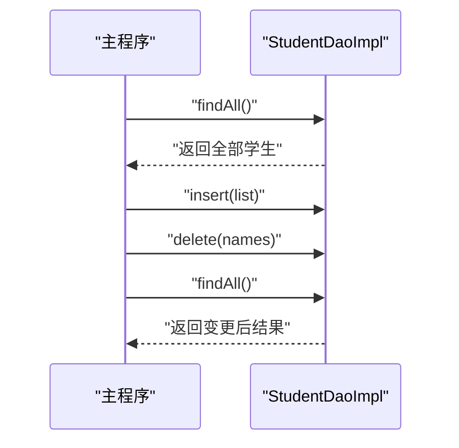

图表来源
- [DaoMain.java:1-30](file://structural/daoPattern/src/main/java/com/future/rocket/gof23/dao/DaoMain.java#L1-L30)
- [StudentDaoImpl.java:1-51](file://structural/daoPattern/src/main/java/com/future/rocket/gof23/dao/impl/StudentDaoImpl.java#L1-L51)

章节来源
- [DaoMain.java:1-30](file://structural/daoPattern/src/main/java/com/future/rocket/gof23/dao/DaoMain.java#L1-L30)
- [StudentDaoImpl.java:1-51](file://structural/daoPattern/src/main/java/com/future/rocket/gof23/dao/impl/StudentDaoImpl.java#L1-L51)

### 服务定位器模式
- 设计要点
  - 集中管理服务实例，提供延迟初始化与缓存能力，减少重复查找成本。
- 关键类与协作
  - 主程序多次请求同一服务，验证缓存与延迟初始化效果。
- UML 类图

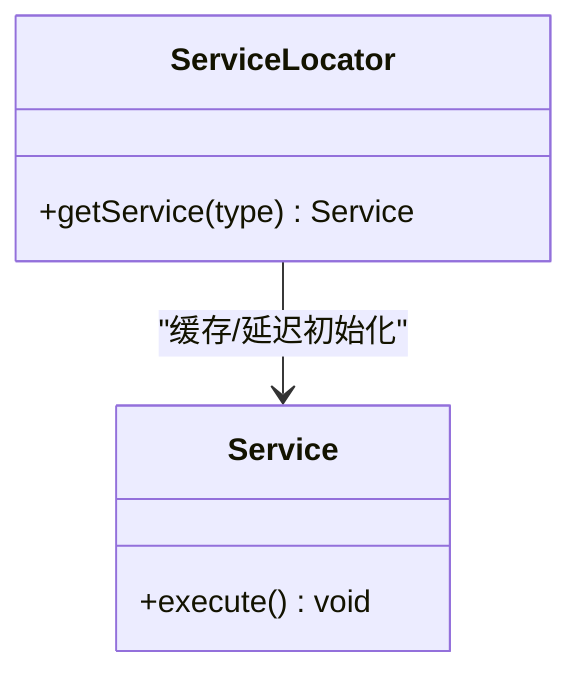

图表来源
- [ServiceLocatorMain.java:1-26](file://structural/serviceLocator/src/main/java/com/future/rocket/gof23/service/locator/ServiceLocatorMain.java#L1-L26)

- 序列图（服务定位器）

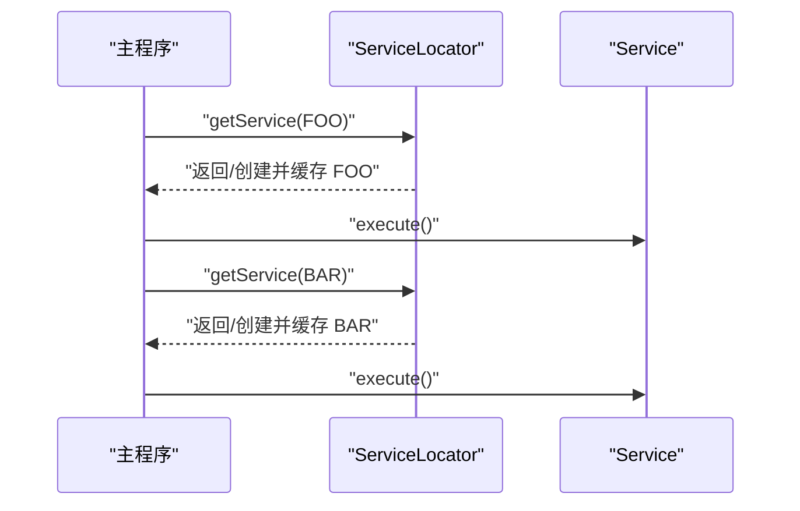

图表来源
- [ServiceLocatorMain.java:1-26](file://structural/serviceLocator/src/main/java/com/future/rocket/gof23/service/locator/ServiceLocatorMain.java#L1-L26)

章节来源
- [ServiceLocatorMain.java:1-26](file://structural/serviceLocator/src/main/java/com/future/rocket/gof23/service/locator/ServiceLocatorMain.java#L1-L26)

### 传输对象模式
- 设计要点
  - 在远程或分层之间传递数据对象，降低调用次数与网络开销。
  - 示例中通过业务对象与值对象配合实现数据封装与传输。
- 关键类与协作
  - 主程序演示新增、更新、删除与查询的完整流程。
- UML 类图

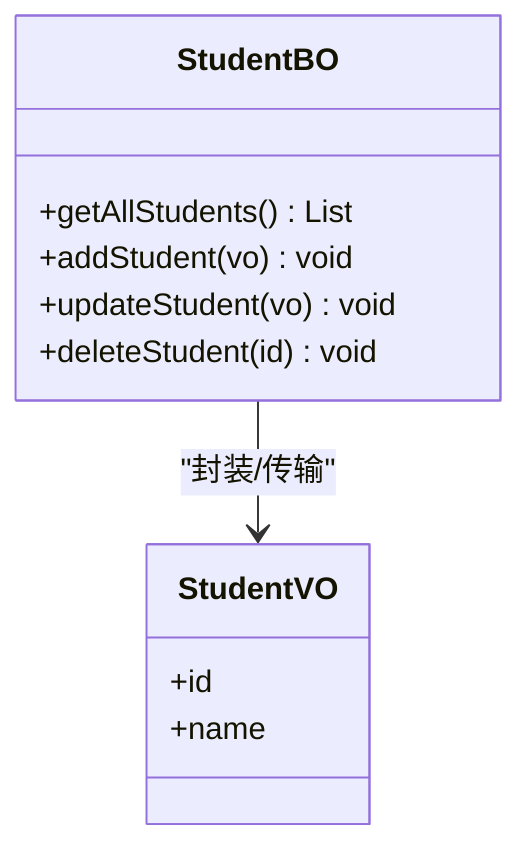

图表来源
- [TransferObjectMain.java:1-23](file://structural/transferObject/src/main/java/com/future/rocket/gof23/transfer/object/TransferObjectMain.java#L1-L23)

- 序列图（传输对象）

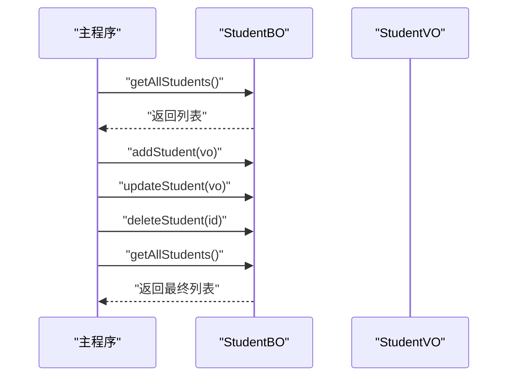

图表来源
- [TransferObjectMain.java:1-23](file://structural/transferObject/src/main/java/com/future/rocket/gof23/transfer/object/TransferObjectMain.java#L1-L23)

章节来源
- [TransferObjectMain.java:1-23](file://structural/transferObject/src/main/java/com/future/rocket/gof23/transfer/object/TransferObjectMain.java#L1-L23)

### 过滤器模式
- 设计要点
  - 对集合数据进行条件筛选，支持与/或组合，形成可扩展的过滤链。
- 关键类与协作
  - 主程序构造多种条件，分别输出满足条件的结果集。
- UML 类图

```mermaid
classDiagram
class Criteria {
+meetCriteria(persons) List
}
class CriteriaMale {
+meetCriteria(persons) List
}
class CriteriaFemale {
+meetCriteria(persons) List
}
class AndCriteria {
+meetCriteria(persons) List
}
class OrCriteria {
+meetCriteria(persons) List
}
Criteria <|.. CriteriaMale
Criteria <|.. CriteriaFemale
Criteria <|.. AndCriteria
Criteria <|.. OrCriteria
```

图表来源
- [FilterMain.java:1-50](file://structural/filter/src/main/java/com/future/rocket/gof23/filter/FilterMain.java#L1-L50)

- 序列图（过滤流程）

```mermaid
sequenceDiagram
participant M as "主程序"
participant C1 as "CriteriaMale"
participant C2 as "AndCriteria"
participant C3 as "OrCriteria"
M->>C1 : "meetCriteria(persons)"
C1-->>M : "返回男性列表"
M->>C2 : "meetCriteria(persons)"
C2-->>M : "返回单身男性列表"
M->>C3 : "meetCriteria(persons)"
C3-->>M : "返回单身或女性列表"
```

图表来源
- [FilterMain.java:1-50](file://structural/filter/src/main/java/com/future/rocket/gof23/filter/FilterMain.java#L1-L50)

章节来源
- [FilterMain.java:1-50](file://structural/filter/src/main/java/com/future/rocket/gof23/filter/FilterMain.java#L1-L50)

## 依赖分析
- 内聚性
  - 每个模式模块内聚度高，接口与实现清晰分离，便于独立演进。
- 耦合性
  - 大多为单向依赖（如适配器使用高级播放器、装饰器包装形状），耦合可控。
  - 享元工厂与具体对象存在复用关系，属于合理的共享耦合。
- 外部依赖
  - 示例均保持最小外部依赖，主要依赖通用工具类（如打印分割线）。

```mermaid
graph LR
AD["适配器"] --> AP["高级播放器"]
DE["装饰器"] --> SH["形状"]
BR["桥接"] --> DC["绘制API"]
FW["享元"] --> CF["工厂"]
PR["代理"] --> RI["真实图像"]
DAO["DAO"] --> SDI["数据实现"]
SL["服务定位器"] --> SV["服务"]
FL["过滤器"] --> CR["条件"]
TO["传输对象"] --> BO["业务对象"]
```

图表来源
- [MediaAdapter.java:1-33](file://structural/adapter/src/main/java/com/future/rocket/gof23/adapter/struct/MediaAdapter.java#L1-L33)
- [RedShapeDecorator.java:1-21](file://structural/decorator/src/main/java/com/future/rocket/gof23/decorator/struct/RedShapeDecorator.java#L1-L21)
- [Circle.java:1-25](file://structural/bridge/src/main/java/com/future/rocket/gof23/bridge/struct/Circle.java#L1-L25)
- [TestFlyweightMain.java:1-54](file://structural/flyweight/src/main/java/com/future/rocket/gof23/flyweight/TestFlyweightMain.java#L1-L54)
- [ProxyMain.java:1-18](file://structural/proxy/src/main/java/com/future/rocket/gof23/proxy/ProxyMain.java#L1-L18)
- [StudentDaoImpl.java:1-51](file://structural/daoPattern/src/main/java/com/future/rocket/gof23/dao/impl/StudentDaoImpl.java#L1-L51)
- [ServiceLocatorMain.java:1-26](file://structural/serviceLocator/src/main/java/com/future/rocket/gof23/service/locator/ServiceLocatorMain.java#L1-L26)
- [FilterMain.java:1-50](file://structural/filter/src/main/java/com/future/rocket/gof23/filter/FilterMain.java#L1-L50)
- [TransferObjectMain.java:1-23](file://structural/transferObject/src/main/java/com/future/rocket/gof23/transfer/object/TransferObjectMain.java#L1-L23)

## 性能考量
- 适配器
  - 优点：接口统一，易于扩展；缺点：可能引入一层间接调用，带来微小开销。
- 桥接
  - 优点：抽象与实现分离，利于扩展；缺点：增加对象数量，需权衡内存与灵活性。
- 组合
  - 优点：统一处理叶子与分支；缺点：深层遍历可能带来时间成本。
- 装饰器
  - 优点：动态增强；缺点：装饰层数过多会增加调用栈深度。
- 享元
  - 优点：显著降低内存占用；缺点：需要区分内外状态，逻辑复杂度上升。
- 代理
  - 优点：延迟加载、缓存命中快；缺点：首次加载可能有额外成本。
- DAO
  - 优点：数据访问集中；缺点：在高频写入场景需注意一致性与并发。
- 服务定位器
  - 优点：缓存减少查找成本；缺点：全局状态可能带来测试与调试复杂度。
- 传输对象
  - 优点：减少调用次数；缺点：序列化/反序列化带来CPU开销。
- 过滤器
  - 优点：组合灵活；缺点：多重条件组合可能导致时间复杂度上升。

[本节提供一般性指导，不直接分析具体文件]

## 故障排查指南
- 适配器
  - 症状：播放失败或抛出不支持类型异常。
  - 排查：确认适配器构造参数与目标类型匹配，检查高级播放器可用性。
- 桥接
  - 症状：绘制结果不符合预期。
  - 排查：确认形状与绘制API组合正确，坐标与半径参数有效。
- 组合
  - 症状：遍历时出现空指针或无限递归。
  - 排查：确保子节点集合初始化与边界条件判断。
- 装饰器
  - 症状：装饰后行为异常。
  - 排查：检查装饰器顺序与被装饰对象引用。
- 享元
  - 症状：外在状态错乱。
  - 排查：区分内外状态，避免共享对象污染。
- 代理
  - 症状：重复加载或缓存未生效。
  - 排查：确认代理缓存策略与懒加载时机。
- DAO
  - 症状：数据更新未生效或删除异常。
  - 排查：核对主键匹配与集合操作逻辑。
- 服务定位器
  - 症状：服务重复创建或缓存失效。
  - 排查：检查缓存键与延迟初始化策略。
- 传输对象
  - 症状：数据丢失或类型不一致。
  - 排查：核对值对象字段与业务对象映射。
- 过滤器
  - 症状：过滤结果为空或错误。
  - 排查：逐项验证条件实现与组合逻辑。

章节来源
- [MediaAdapter.java:1-33](file://structural/adapter/src/main/java/com/future/rocket/gof23/adapter/struct/MediaAdapter.java#L1-L33)
- [Circle.java:1-25](file://structural/bridge/src/main/java/com/future/rocket/gof23/bridge/struct/Circle.java#L1-L25)
- [Employee.java:1-40](file://structural/composite/src/main/java/com/future/rocket/gof23/composite/Employee.java#L1-L40)
- [RedShapeDecorator.java:1-21](file://structural/decorator/src/main/java/com/future/rocket/gof23/decorator/struct/RedShapeDecorator.java#L1-L21)
- [TestFlyweightMain.java:1-54](file://structural/flyweight/src/main/java/com/future/rocket/gof23/flyweight/TestFlyweightMain.java#L1-L54)
- [ProxyMain.java:1-18](file://structural/proxy/src/main/java/com/future/rocket/gof23/proxy/ProxyMain.java#L1-L18)
- [StudentDaoImpl.java:1-51](file://structural/daoPattern/src/main/java/com/future/rocket/gof23/dao/impl/StudentDaoImpl.java#L1-L51)
- [ServiceLocatorMain.java:1-26](file://structural/serviceLocator/src/main/java/com/future/rocket/gof23/service/locator/ServiceLocatorMain.java#L1-L26)
- [TransferObjectMain.java:1-23](file://structural/transferObject/src/main/java/com/future/rocket/gof23/transfer/object/TransferObjectMain.java#L1-L23)
- [FilterMain.java:1-50](file://structural/filter/src/main/java/com/future/rocket/gof23/filter/FilterMain.java#L1-L50)

## 结论
本文件基于仓库中的结构型模式实现，从类关系、协作机制、UML图示与序列图等维度进行了系统梳理。通过对比不同模式的适用场景与性能影响，帮助读者在实际工程中做出合理的设计权衡。建议初学者先从适配器、装饰器、组合与过滤器入手，再逐步扩展到桥接、享元、代理与DAO等更复杂的模式。

## 附录
- 学习路径建议
  - 初学者：适配器 → 装饰器 → 组合 → 过滤器 → 代理
  - 进阶者：桥接 → 享元 → DAO → 传输对象 → 服务定位器 → 外观
- 最佳实践
  - 明确内外状态划分（享元）
  - 控制装饰层数与代理粒度
  - 使用工厂与缓存提升性能（DAO、服务定位器、享元）
  - 统一接口与清晰职责边界（适配器、桥接、组合、过滤器）