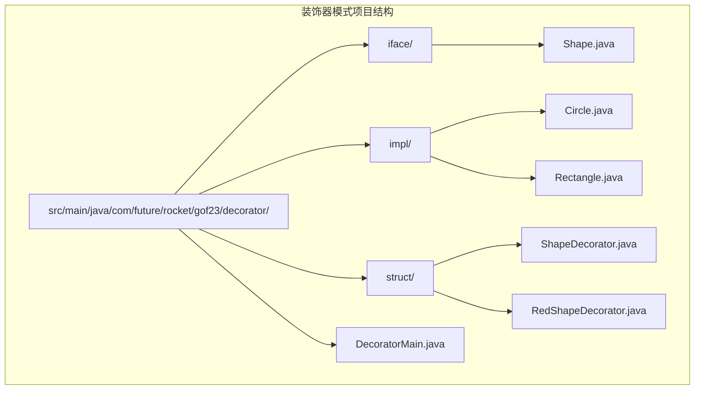
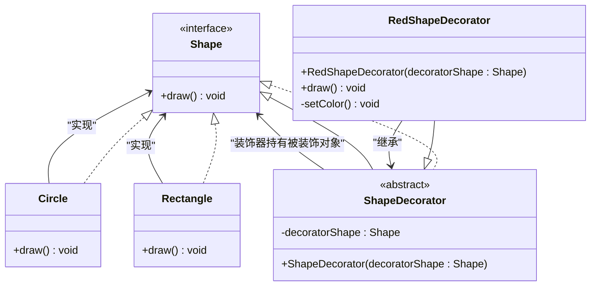
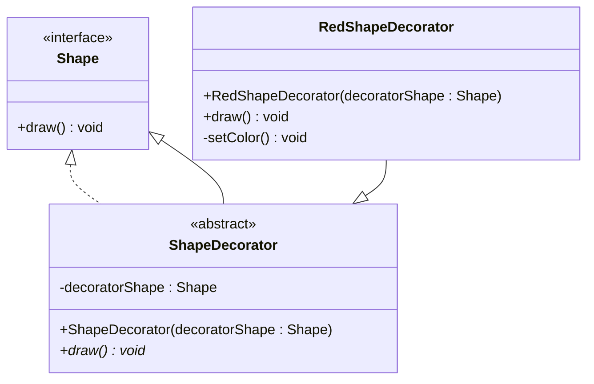
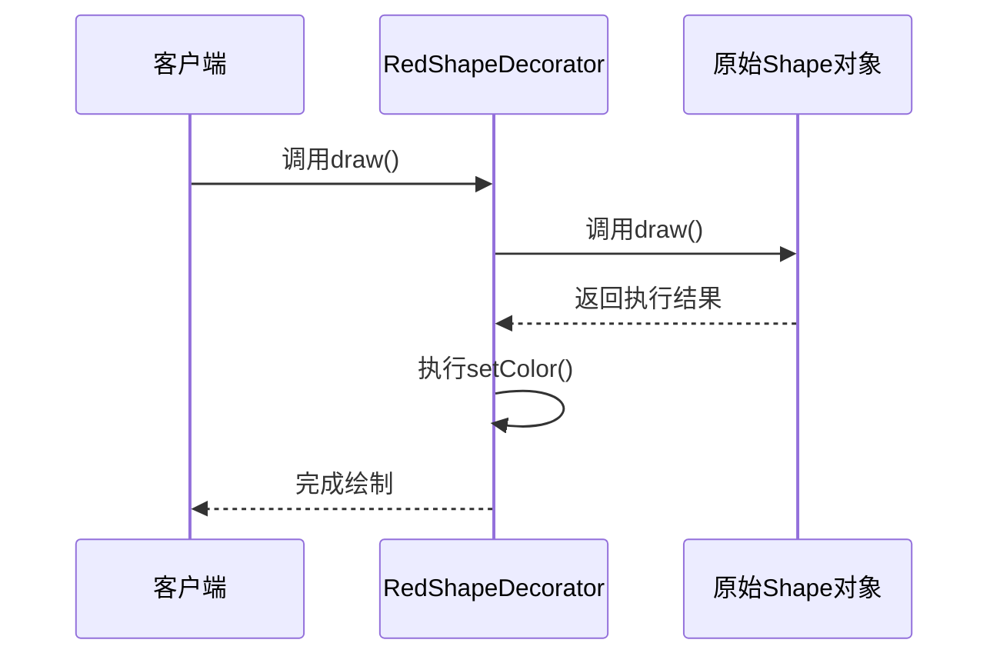
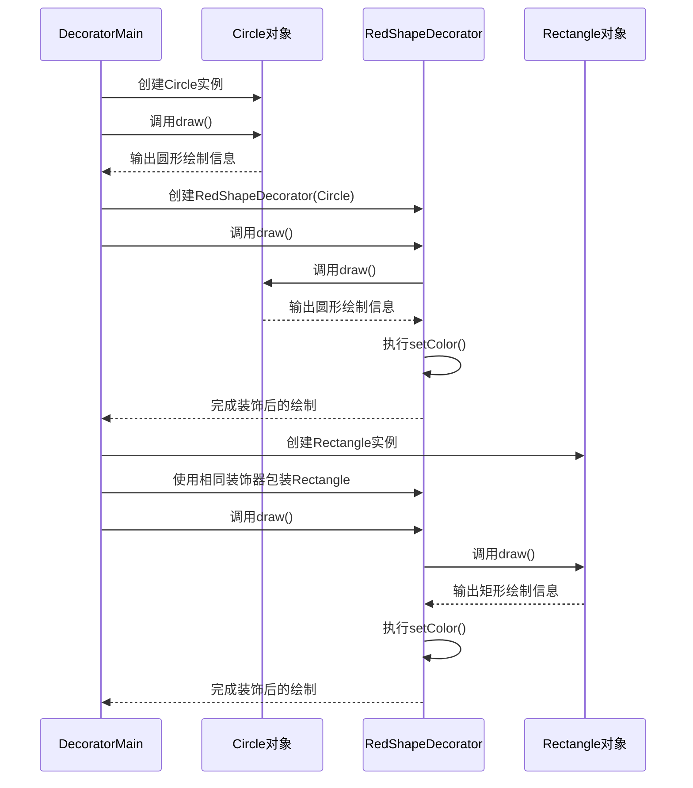
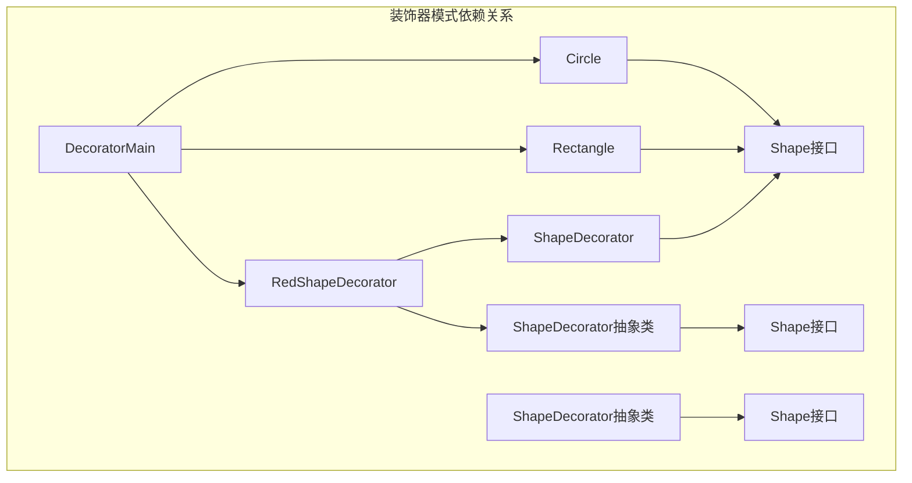
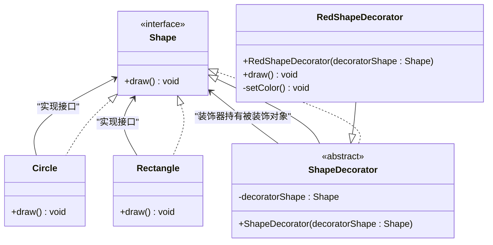

# 装饰器模式

<cite>
**本文引用的文件**
- [Shape.java](file://structural/decorator/src/main/java/com/future/rocket/gof23/decorator/iface/Shape.java)
- [ShapeDecorator.java](file://structural/decorator/src/main/java/com/future/rocket/gof23/decorator/struct/ShapeDecorator.java)
- [RedShapeDecorator.java](file://structural/decorator/src/main/java/com/future/rocket/gof23/decorator/struct/RedShapeDecorator.java)
- [Circle.java](file://structural/decorator/src/main/java/com/future/rocket/gof23/decorator/impl/Circle.java)
- [Rectangle.java](file://structural/decorator/src/main/java/com/future/rocket/gof23/decorator/impl/Rectangle.java)
- [DecoratorMain.java](file://structural/decorator/src/main/java/com/future/rocket/gof23/decorator/DecoratorMain.java)
- [readme.md](file://structural/decorator/readme.md)
</cite>

## 目录
1. [引言](#引言)
2. [项目结构](#项目结构)
3. [核心组件](#核心组件)
4. [架构概览](#架构概览)
5. [详细组件分析](#详细组件分析)
6. [依赖分析](#依赖分析)
7. [性能考虑](#性能考虑)
8. [故障排除指南](#故障排除指南)
9. [结论](#结论)
10. [附录](#附录)

## 引言
装饰器模式是一种结构型设计模式，它允许在不修改原始类结构的情况下为对象动态添加新的功能。该模式通过使用"装饰者"类包裹原始对象来扩展其功能，使得可以在运行时以灵活、可扩展的方式增强对象的功能，而不必修改其基本代码结构。

装饰器模式的核心思想是：
- 通过组合而非继承来扩展对象功能
- 在运行时动态地为对象添加职责
- 保持原有对象的接口不变
- 支持多个装饰器的组合使用

## 项目结构
装饰器模式的实现位于structural/decorator模块中，采用标准的Java包结构组织：

**图表来源**
- [DecoratorMain.java:1-29](file://structural/decorator/src/main/java/com/future/rocket/gof23/decorator/DecoratorMain.java#L1-L29)
- [Shape.java:1-6](file://structural/decorator/src/main/java/com/future/rocket/gof23/decorator/iface/Shape.java#L1-L6)

**章节来源**
- [DecoratorMain.java:1-29](file://structural/decorator/src/main/java/com/future/rocket/gof23/decorator/DecoratorMain.java#L1-L29)
- [readme.md:1-7](file://structural/decorator/readme.md#L1-L7)

## 核心组件
装饰器模式的实现包含以下核心组件：

### 接口层
- **Shape接口**：定义了所有图形对象必须实现的draw方法
- **ShapeDecorator抽象类**：实现了Shape接口，持有被装饰的对象引用

### 实现层
- **Circle类**：具体的图形实现之一
- **Rectangle类**：具体的图形实现之二
- **RedShapeDecorator类**：具体的装饰器实现，负责为图形添加红色功能

### 应用入口
- **DecoratorMain类**：演示装饰器模式的使用方式

**章节来源**
- [Shape.java:1-6](file://structural/decorator/src/main/java/com/future/rocket/gof23/decorator/iface/Shape.java#L1-L6)
- [ShapeDecorator.java:1-13](file://structural/decorator/src/main/java/com/future/rocket/gof23/decorator/struct/ShapeDecorator.java#L1-L13)
- [RedShapeDecorator.java:1-21](file://structural/decorator/src/main/java/com/future/rocket/gof23/decorator/struct/RedShapeDecorator.java#L1-L21)
- [Circle.java:1-12](file://structural/decorator/src/main/java/com/future/rocket/gof23/decorator/impl/Circle.java#L1-L12)
- [Rectangle.java:1-11](file://structural/decorator/src/main/java/com/future/rocket/gof23/decorator/impl/Rectangle.java#L1-L11)

## 架构概览
装饰器模式的架构遵循"组合优于继承"的设计原则，通过装饰器类包装原始对象来实现功能扩展：

**图表来源**
- [Shape.java:1-6](file://structural/decorator/src/main/java/com/future/rocket/gof23/decorator/iface/Shape.java#L1-L6)
- [ShapeDecorator.java:1-13](file://structural/decorator/src/main/java/com/future/rocket/gof23/decorator/struct/ShapeDecorator.java#L1-L13)
- [RedShapeDecorator.java:1-21](file://structural/decorator/src/main/java/com/future/rocket/gof23/decorator/struct/RedShapeDecorator.java#L1-L21)
- [Circle.java:1-12](file://structural/decorator/src/main/java/com/future/rocket/gof23/decorator/impl/Circle.java#L1-L12)
- [Rectangle.java:1-11](file://structural/decorator/src/main/java/com/future/rocket/gof23/decorator/impl/Rectangle.java#L1-L11)

## 详细组件分析

### Shape接口分析
Shape接口定义了所有图形对象的基本行为，采用最小接口设计原则，只包含一个draw方法。这种设计确保了装饰器模式的通用性，任何实现了Shape接口的对象都可以被装饰器包装。

**章节来源**
- [Shape.java:1-6](file://structural/decorator/src/main/java/com/future/rocket/gof23/decorator/iface/Shape.java#L1-L6)

### ShapeDecorator抽象装饰器分析
ShapeDecorator抽象类是装饰器模式的核心实现，具有以下特点：

#### 设计要点
- **组合关系**：持有被装饰对象的引用（decoratorShape）
- **接口实现**：实现Shape接口，确保装饰器本身也是可绘制的对象
- **构造函数**：接受任意Shape类型的对象作为参数
- **代理模式**：通过委托调用被装饰对象的方法

#### 继承层次

**图表来源**
- [ShapeDecorator.java:1-13](file://structural/decorator/src/main/java/com/future/rocket/gof23/decorator/struct/ShapeDecorator.java#L1-L13)
- [RedShapeDecorator.java:1-21](file://structural/decorator/src/main/java/com/future/rocket/gof23/decorator/struct/RedShapeDecorator.java#L1-L21)

**章节来源**
- [ShapeDecorator.java:1-13](file://structural/decorator/src/main/java/com/future/rocket/gof23/decorator/struct/ShapeDecorator.java#L1-L13)

### RedShapeDecorator具体装饰器分析
RedShapeDecorator是装饰器模式的具体实现，展示了如何为图形对象添加颜色功能：

#### 核心功能
- **功能扩展**：在调用被装饰对象draw方法后，执行额外的颜色设置逻辑
- **方法重写**：覆盖draw方法，实现装饰器特有的行为
- **私有方法**：setColor方法封装了具体的颜色设置逻辑

#### 执行流程

**图表来源**
- [RedShapeDecorator.java:11-15](file://structural/decorator/src/main/java/com/future/rocket/gof23/decorator/struct/RedShapeDecorator.java#L11-L15)

**章节来源**
- [RedShapeDecorator.java:1-21](file://structural/decorator/src/main/java/com/future/rocket/gof23/decorator/struct/RedShapeDecorator.java#L1-L21)

### 具体图形实现分析
#### Circle类
Circle类提供了圆形的绘制实现，展示了装饰器模式如何与具体实现配合工作。

#### Rectangle类  
Rectangle类提供了矩形的绘制实现，同样可以被装饰器包装以添加额外功能。

**章节来源**
- [Circle.java:1-12](file://structural/decorator/src/main/java/com/future/rocket/gof23/decorator/impl/Circle.java#L1-L12)
- [Rectangle.java:1-11](file://structural/decorator/src/main/java/com/future/rocket/gof23/decorator/impl/Rectangle.java#L1-L11)

### 装饰器链构建和执行
DecoratorMain演示了装饰器模式的实际应用，展示了如何构建和执行装饰器链：

#### 基本使用流程
1. 创建原始的Shape对象（Circle或Rectangle）
2. 使用RedShapeDecorator包装原始对象
3. 调用draw方法，观察装饰器如何扩展功能

#### 装饰器链执行序列

**图表来源**
- [DecoratorMain.java:15-27](file://structural/decorator/src/main/java/com/future/rocket/gof23/decorator/DecoratorMain.java#L15-L27)

**章节来源**
- [DecoratorMain.java:1-29](file://structural/decorator/src/main/java/com/future/rocket/gof23/decorator/DecoratorMain.java#L1-L29)

## 依赖分析
装饰器模式的依赖关系体现了清晰的层次结构和单一职责原则：

**图表来源**
- [DecoratorMain.java:3-7](file://structural/decorator/src/main/java/com/future/rocket/gof23/decorator/DecoratorMain.java#L3-L7)
- [ShapeDecorator.java:3](file://structural/decorator/src/main/java/com/future/rocket/gof23/decorator/struct/ShapeDecorator.java#L3)
- [RedShapeDecorator.java:3](file://structural/decorator/src/main/java/com/future/rocket/gof23/decorator/struct/RedShapeDecorator.java#L3)

### 关键依赖特性
- **向上兼容**：所有装饰器都实现了Shape接口，保持了与原始对象相同的接口
- **向下委托**：装饰器通过组合关系委托调用被装饰对象的方法
- **无循环依赖**：依赖关系呈树状结构，避免了循环引用问题

**章节来源**
- [DecoratorMain.java:3-7](file://structural/decorator/src/main/java/com/future/rocket/gof23/decorator/DecoratorMain.java#L3-L7)
- [ShapeDecorator.java:3](file://structural/decorator/src/main/java/com/future/rocket/gof23/decorator/struct/ShapeDecorator.java#L3)
- [RedShapeDecorator.java:3](file://structural/decorator/src/main/java/com/future/rocket/gof23/decorator/struct/RedShapeDecorator.java#L3)

## 性能考虑
装饰器模式在运行时的性能特征：

### 时间复杂度
- **装饰器调用**：O(n)，其中n为装饰器层数
- **方法调用开销**：每个装饰器增加一次方法调用开销
- **内存分配**：每个装饰器对象需要额外的内存空间

### 空间复杂度
- **对象数量**：装饰器数量等于装饰层数
- **内存占用**：每个装饰器对象包含对被装饰对象的引用

### 性能优化建议
1. **避免过度装饰**：合理控制装饰器层数，避免过深的装饰链
2. **缓存装饰结果**：对于昂贵的操作，考虑缓存装饰结果
3. **选择合适的装饰器**：根据实际需求选择必要的装饰器

## 故障排除指南
### 常见问题及解决方案

#### 问题1：装饰器未正确执行
**症状**：装饰器的额外功能没有生效
**原因**：装饰器未正确委托到被装饰对象
**解决方案**：检查装饰器的draw方法是否调用了decoratorShape.draw()

#### 问题2：装饰器链顺序错误
**症状**：装饰效果不符合预期
**原因**：装饰器的嵌套顺序不正确
**解决方案**：按照期望的效果顺序正确嵌套装饰器

#### 问题3：内存泄漏
**症状**：程序运行时间越长内存占用越大
**原因**：装饰器对象未正确释放
**解决方案**：确保装饰器对象的生命周期管理

**章节来源**
- [RedShapeDecorator.java:12-15](file://structural/decorator/src/main/java/com/future/rocket/gof23/decorator/struct/RedShapeDecorator.java#L12-L15)

## 结论
装饰器模式通过组合而非继承的方式实现了对象功能的动态扩展，具有以下优势：

### 主要优势
1. **灵活性**：支持运行时动态添加功能
2. **可扩展性**：可以轻松添加新的装饰器
3. **组合性**：支持多个装饰器的组合使用
4. **向后兼容**：不修改原有代码结构

### 适用场景
- 需要在运行时动态添加功能的系统
- 需要组合多种行为的场景
- 不希望使用继承来扩展功能的情况

### 设计原则
- **组合优于继承**：优先使用组合而非继承
- **单一职责**：每个装饰器只负责单一功能
- **接口隔离**：保持接口的简洁性和稳定性

装饰器模式为面向对象设计提供了强大的扩展机制，特别适用于需要灵活功能组合的应用场景。

## 附录

### UML类图完整版

**图表来源**
- [Shape.java:1-6](file://structural/decorator/src/main/java/com/future/rocket/gof23/decorator/iface/Shape.java#L1-L6)
- [ShapeDecorator.java:1-13](file://structural/decorator/src/main/java/com/future/rocket/gof23/decorator/struct/ShapeDecorator.java#L1-L13)
- [RedShapeDecorator.java:1-21](file://structural/decorator/src/main/java/com/future/rocket/gof23/decorator/struct/RedShapeDecorator.java#L1-L21)
- [Circle.java:1-12](file://structural/decorator/src/main/java/com/future/rocket/gof23/decorator/impl/Circle.java#L1-L12)
- [Rectangle.java:1-11](file://structural/decorator/src/main/java/com/future/rocket/gof23/decorator/impl/Rectangle.java#L1-L11)

### 装饰器模式最佳实践
1. **保持接口稳定**：装饰器应该保持与被装饰对象相同的接口
2. **单一职责原则**：每个装饰器只负责单一功能扩展
3. **避免过度设计**：不要为简单场景使用复杂的装饰器模式
4. **合理控制装饰层数**：避免过深的装饰链影响性能