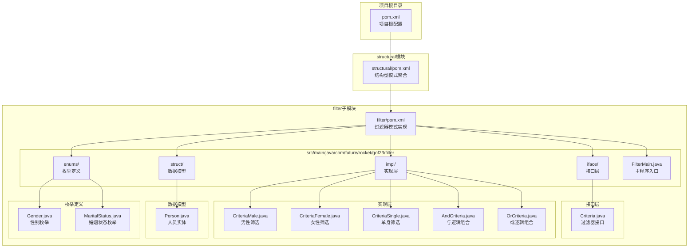
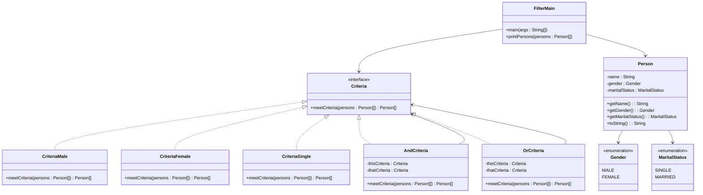
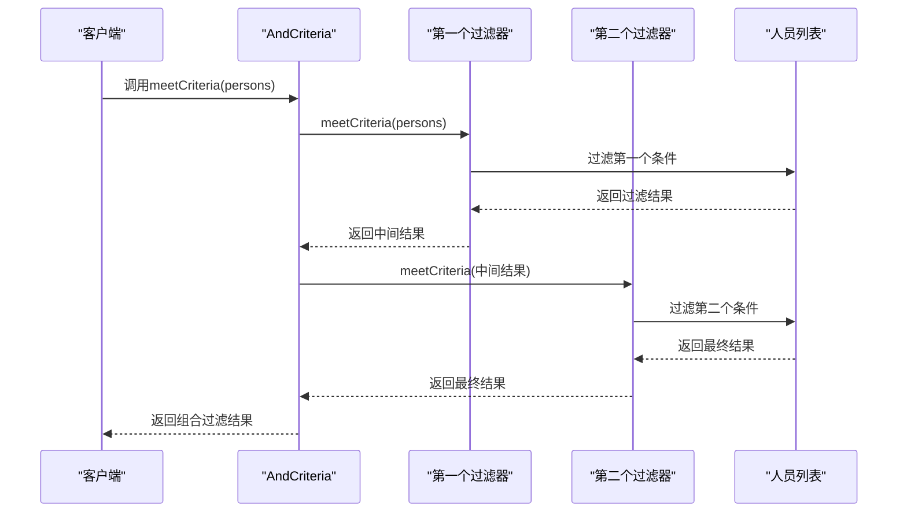
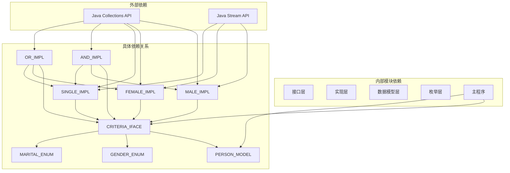

# 过滤器模式

<cite>
**本文档引用的文件**
- [Criteria.java](file://structural/filter/src/main/java/com/future/rocket/gof23/filter/iface/Criteria.java)
- [Person.java](file://structural/filter/src/main/java/com/future/rocket/gof23/filter/struct/Person.java)
- [AndCriteria.java](file://structural/filter/src/main/java/com/future/rocket/gof23/filter/impl/AndCriteria.java)
- [OrCriteria.java](file://structural/filter/src/main/java/com/future/rocket/gof23/filter/impl/OrCriteria.java)
- [CriteriaMale.java](file://structural/filter/src/main/java/com/future/rocket/gof23/filter/impl/CriteriaMale.java)
- [CriteriaFemale.java](file://structural/filter/src/main/java/com/future/rocket/gof23/filter/impl/CriteriaFemale.java)
- [CriteriaSingle.java](file://structural/filter/src/main/java/com/future/rocket/gof23/filter/impl/CriteriaSingle.java)
- [Gender.java](file://structural/filter/src/main/java/com/future/rocket/gof23/filter/enums/Gender.java)
- [MaritalStatus.java](file://structural/filter/src/main/java/com/future/rocket/gof23/filter/enums/MaritalStatus.java)
- [FilterMain.java](file://structural/filter/src/main/java/com/future/rocket/gof23/filter/FilterMain.java)
- [pom.xml](file://structural/filter/pom.xml)
- [pom.xml](file://pom.xml)
</cite>

## 目录
1. [简介](#简介)
2. [项目结构](#项目结构)
3. [核心组件](#核心组件)
4. [架构概览](#架构概览)
5. [详细组件分析](#详细组件分析)
6. [依赖关系分析](#依赖关系分析)
7. [性能考虑](#性能考虑)
8. [故障排除指南](#故障排除指南)
9. [结论](#结论)

## 简介

过滤器模式（Filter Pattern）是一种行为型设计模式，它允许开发人员使用不同的标准来过滤一组对象，通过逻辑组合多个过滤条件来实现复杂的数据查询功能。该模式通过定义一个统一的过滤接口，使得各种具体的过滤器可以独立实现，并且可以通过组合的方式构建复杂的过滤逻辑。

在本项目中，我们实现了一个基于人员信息的筛选系统，展示了如何使用过滤器模式来实现灵活的数据查询机制。系统支持性别筛选、婚姻状况筛选以及这些条件的逻辑组合，为实际的数据处理场景提供了强大的工具。

## 项目结构

该项目采用Maven多模块架构，过滤器模式作为结构型模式的一个具体实现案例。整个项目结构清晰，遵循Java项目的标准组织方式。

**图表来源**
- [pom.xml:1-20](file://structural/filter/pom.xml#L1-L20)
- [pom.xml:1-24](file://pom.xml#L1-L24)

**章节来源**
- [pom.xml:1-20](file://structural/filter/pom.xml#L1-L20)
- [pom.xml:1-24](file://pom.xml#L1-L24)

## 核心组件

过滤器模式的核心在于定义一个统一的接口，让所有具体的过滤器都实现相同的方法签名，从而实现可互换性和可组合性。在本项目中，核心组件包括：

### 接口层设计

**Criteria接口**是整个过滤器模式的核心抽象，定义了统一的过滤方法签名：
- 方法：meetCriteria(List<Person> persons)
- 返回值：过滤后的人员列表
- 参数：待过滤的人员集合

这个接口的设计体现了开闭原则，新的过滤条件只需要实现这个接口即可无缝集成到现有系统中。

### 数据模型层

**Person实体类**代表了被过滤的数据对象，包含了以下关键属性：
- 姓名（name）
- 性别（gender）
- 婚姻状态（maritalStatus）

每个属性都有对应的getter方法，确保了数据的封装性和访问控制。

### 枚举定义

系统使用两个枚举来定义过滤条件的取值范围：
- **Gender枚举**：包含MALE和FEMALE两个值
- **MaritalStatus枚举**：包含SINGLE和MARRIED两个值

这种设计确保了类型安全，避免了字符串比较可能带来的错误。

**章节来源**
- [Criteria.java:1-10](file://structural/filter/src/main/java/com/future/rocket/gof23/filter/iface/Criteria.java#L1-L10)
- [Person.java:1-38](file://structural/filter/src/main/java/com/future/rocket/gof23/filter/struct/Person.java#L1-L38)
- [Gender.java:1-7](file://structural/filter/src/main/java/com/future/rocket/gof23/filter/enums/Gender.java#L1-L7)
- [MaritalStatus.java:1-7](file://structural/filter/src/main/java/com/future/rocket/gof23/filter/enums/MaritalStatus.java#L1-L7)

## 架构概览

过滤器模式的架构设计体现了高内聚、低耦合的设计原则。整个系统由接口层、实现层、数据模型层和枚举层组成，各层职责明确，相互独立。

**图表来源**
- [Criteria.java:1-10](file://structural/filter/src/main/java/com/future/rocket/gof23/filter/iface/Criteria.java#L1-L10)
- [Person.java:1-38](file://structural/filter/src/main/java/com/future/rocket/gof23/filter/struct/Person.java#L1-L38)
- [CriteriaMale.java:1-20](file://structural/filter/src/main/java/com/future/rocket/gof23/filter/impl/CriteriaMale.java#L1-L20)
- [CriteriaFemale.java:1-19](file://structural/filter/src/main/java/com/future/rocket/gof23/filter/impl/CriteriaFemale.java#L1-L19)
- [CriteriaSingle.java:1-19](file://structural/filter/src/main/java/com/future/rocket/gof23/filter/impl/CriteriaSingle.java#L1-L19)
- [AndCriteria.java:1-24](file://structural/filter/src/main/java/com/future/rocket/gof23/filter/impl/AndCriteria.java#L1-L24)
- [OrCriteria.java:1-30](file://structural/filter/src/main/java/com/future/rocket/gof23/filter/impl/OrCriteria.java#L1-L30)

## 详细组件分析

### 具体过滤器实现

#### 基础过滤器

**CriteriaMale类**实现了按性别筛选的功能：
- 使用Java 8 Stream API进行数据过滤
- 通过Person对象的getGender()方法获取性别信息
- 使用函数式编程风格，代码简洁高效

**CriteriaFemale类**与CriteriaMale类似，但筛选条件相反：
- 同样使用Stream API进行过滤
- 通过Gender.FEMALE常量进行比较

**CriteriaSingle类**实现了按婚姻状况筛选的功能：
- 使用Stream API过滤MaritalStatus.SINGLE
- 展示了如何对不同属性进行筛选

#### 组合过滤器

**AndCriteria类**实现了逻辑与（AND）操作：
- 接受两个Criteria实例作为参数
- 首先应用第一个过滤器，然后在结果上应用第二个过滤器
- 实现了链式调用的效果

**OrCriteria类**实现了逻辑或（OR）操作：
- 接受两个Criteria实例作为参数
- 分别对原始数据应用两个过滤器
- 合并结果并去除重复项

**图表来源**
- [AndCriteria.java:18-22](file://structural/filter/src/main/java/com/future/rocket/gof23/filter/impl/AndCriteria.java#L18-L22)

**章节来源**
- [CriteriaMale.java:1-20](file://structural/filter/src/main/java/com/future/rocket/gof23/filter/impl/CriteriaMale.java#L1-L20)
- [CriteriaFemale.java:1-19](file://structural/filter/src/main/java/com/future/rocket/gof23/filter/impl/CriteriaFemale.java#L1-L19)
- [CriteriaSingle.java:1-19](file://structural/filter/src/main/java/com/future/rocket/gof23/filter/impl/CriteriaSingle.java#L1-L19)
- [AndCriteria.java:1-24](file://structural/filter/src/main/java/com/future/rocket/gof23/filter/impl/AndCriteria.java#L1-L24)
- [OrCriteria.java:1-30](file://structural/filter/src/main/java/com/future/rocket/gof23/filter/impl/OrCriteria.java#L1-L30)

### 数据模型设计

**Person实体类**采用了不可变对象的设计模式：
- 所有字段都是final类型的
- 在构造函数中初始化所有字段
- 提供getter方法用于访问数据
- 实现了toString()方法便于调试输出

这种设计确保了线程安全性，避免了数据被意外修改。

**章节来源**
- [Person.java:1-38](file://structural/filter/src/main/java/com/future/rocket/gof23/filter/struct/Person.java#L1-L38)

### 主程序演示

**FilterMain类**展示了如何使用各种过滤器：
- 创建测试数据集
- 实例化各种过滤器
- 演示组合过滤器的使用
- 输出过滤结果

该程序提供了完整的使用示例，展示了过滤器模式的实际应用场景。

**章节来源**
- [FilterMain.java:1-50](file://structural/filter/src/main/java/com/future/rocket/gof23/filter/FilterMain.java#L1-L50)

## 依赖关系分析

过滤器模式的依赖关系设计体现了良好的分层架构和解耦原则。

**图表来源**
- [Criteria.java:1-10](file://structural/filter/src/main/java/com/future/rocket/gof23/filter/iface/Criteria.java#L1-L10)
- [CriteriaMale.java:1-20](file://structural/filter/src/main/java/com/future/rocket/gof23/filter/impl/CriteriaMale.java#L1-L20)
- [CriteriaFemale.java:1-19](file://structural/filter/src/main/java/com/future/rocket/gof23/filter/impl/CriteriaFemale.java#L1-L19)
- [CriteriaSingle.java:1-19](file://structural/filter/src/main/java/com/future/rocket/gof23/filter/impl/CriteriaSingle.java#L1-L19)
- [AndCriteria.java:1-24](file://structural/filter/src/main/java/com/future/rocket/gof23/filter/impl/AndCriteria.java#L1-L24)
- [OrCriteria.java:1-30](file://structural/filter/src/main/java/com/future/rocket/gof23/filter/impl/OrCriteria.java#L1-L30)

### 耦合度分析

- **低耦合**：所有实现类都只依赖于Criteria接口，而不是具体的实现类
- **高内聚**：每个类都专注于单一职责，功能明确
- **可扩展性**：新增过滤条件只需实现Criteria接口
- **可重用性**：过滤器可以在不同的场景中重复使用

**章节来源**
- [pom.xml:1-20](file://structural/filter/pom.xml#L1-L20)

## 性能考虑

在实现过滤器模式时，需要考虑以下几个方面的性能优化：

### 时间复杂度分析

- **基础过滤器**：O(n)时间复杂度，其中n是人员数量
- **And组合过滤器**：O(n) + O(m)时间复杂度，其中m是第一个过滤器的结果数量
- **Or组合过滤器**：O(n) + O(k)时间复杂度，其中k是第二个过滤器的结果数量

### 空间复杂度分析

- **基础过滤器**：O(m)空间复杂度，其中m是满足条件的人员数量
- **组合过滤器**：O(m + k)空间复杂度

### 优化建议

1. **延迟执行**：可以考虑使用Stream的惰性求值特性，避免不必要的计算
2. **缓存机制**：对于频繁使用的过滤结果，可以考虑添加缓存
3. **并行处理**：对于大量数据，可以使用并行Stream来提高性能
4. **内存管理**：及时释放不再使用的过滤结果，避免内存泄漏

### 复杂查询实现技巧

1. **条件组合**：通过AndCriteria和OrCriteria的嵌套组合实现复杂的逻辑表达式
2. **性能监控**：在关键路径添加性能监控，识别瓶颈
3. **数据预处理**：对输入数据进行适当的预处理，减少过滤成本
4. **索引策略**：对于大型数据集，考虑建立适当的索引来加速过滤

## 故障排除指南

### 常见问题及解决方案

**问题1：过滤结果为空**
- 检查输入数据是否正确
- 验证过滤条件是否合理
- 确认枚举值是否匹配

**问题2：性能问题**
- 检查是否有不必要的过滤步骤
- 考虑使用更高效的过滤算法
- 评估数据量大小和过滤复杂度

**问题3：内存溢出**
- 检查过滤结果的大小
- 考虑使用流式处理而非一次性加载
- 及时清理不需要的对象引用

**问题4：并发安全问题**
- 确保Person对象的不可变性
- 避免在过滤过程中修改原始数据
- 使用线程安全的数据结构

### 调试技巧

1. **日志记录**：在关键节点添加详细的日志信息
2. **单元测试**：为每个过滤器编写单元测试
3. **边界测试**：测试空列表、单元素列表等边界情况
4. **性能测试**：测量不同数据规模下的性能表现

**章节来源**
- [FilterMain.java:42-47](file://structural/filter/src/main/java/com/future/rocket/gof23/filter/FilterMain.java#L42-L47)

## 结论

过滤器模式为数据筛选和查询提供了优雅而强大的解决方案。通过定义统一的接口和实现可组合的过滤器，系统具有了高度的灵活性和可扩展性。

### 主要优势

1. **可扩展性**：新增过滤条件无需修改现有代码
2. **可重用性**：过滤器可以在不同场景中重复使用
3. **可组合性**：通过逻辑运算符组合复杂的过滤条件
4. **类型安全**：使用枚举确保了类型安全
5. **线程安全**：不可变对象设计保证了线程安全

### 应用场景

过滤器模式适用于以下场景：
- 数据库查询的条件构建
- API响应数据的筛选
- 日志文件的条件过滤
- 配置文件的条件解析
- 业务规则的动态组合

### 最佳实践

1. **保持简单**：每个过滤器应该专注于单一职责
2. **接口设计**：确保接口方法签名简洁明了
3. **错误处理**：在过滤过程中妥善处理异常情况
4. **性能优化**：根据数据规模选择合适的过滤策略
5. **测试覆盖**：为所有过滤器编写充分的测试用例

通过本项目的实现，我们可以看到过滤器模式在实际应用中的强大功能和灵活性，为构建复杂的数据处理系统提供了坚实的基础。