# 适配器模式

<cite>
**本文档引用的文件**
- [FileType.java](file://structural/adapter/src/main/java/com/future/rocket/gof23/adapter/enums/FileType.java)
- [MediaPlayer.java](file://structural/adapter/src/main/java/com/future/rocket/gof23/adapter/iface/MediaPlayer.java)
- [AdvancedMediaPlayer.java](file://structural/adapter/src/main/java/com/future/rocket/gof23/adapter/iface/AdvancedMediaPlayer.java)
- [AudioPlayer.java](file://structural/adapter/src/main/java/com/future/rocket/gof23/adapter/impl/AudioPlayer.java)
- [Mp4Player.java](file://structural/adapter/src/main/java/com/future/rocket/gof23/adapter/impl/Mp4Player.java)
- [VlcPlayer.java](file://structural/adapter/src/main/java/com/future/rocket/gof23/adapter/impl/VlcPlayer.java)
- [MediaAdapter.java](file://structural/adapter/src/main/java/com/future/rocket/gof23/adapter/struct/MediaAdapter.java)
- [AdapterMain.java](file://structural/adapter/src/main/java/com/future/rocket/gof23/adapter/AdapterMain.java)
</cite>

## 目录
1. [引言](#引言)
2. [项目结构](#项目结构)
3. [核心组件](#核心组件)
4. [架构概览](#架构概览)
5. [详细组件分析](#详细组件分析)
6. [依赖关系分析](#依赖关系分析)
7. [性能考虑](#性能考虑)
8. [故障排除指南](#故障排除指南)
9. [结论](#结论)
10. [附录](#附录)

## 引言

适配器模式是一种结构型设计模式，它允许不兼容的接口协同工作。该模式通过创建一个适配器类来包装现有类，使其接口与客户端期望的接口相匹配。在本项目中，我们通过音频播放器系统的实际代码示例，展示了如何使用适配器模式将不同格式的媒体文件（MP3、MP4、VLC）统一到一个一致的播放接口中。

适配器模式的核心思想是"桥接两个不兼容的接口"，这种设计模式属于结构型模式范畴，因为它结合了两个独立接口的能力。通过适配器模式，我们可以避免修改现有的代码结构，同时又能实现新功能的需求。

## 项目结构

该项目采用标准的Maven项目结构，遵循Java项目的最佳实践。适配器模式相关的代码组织清晰，按照功能模块进行分层：

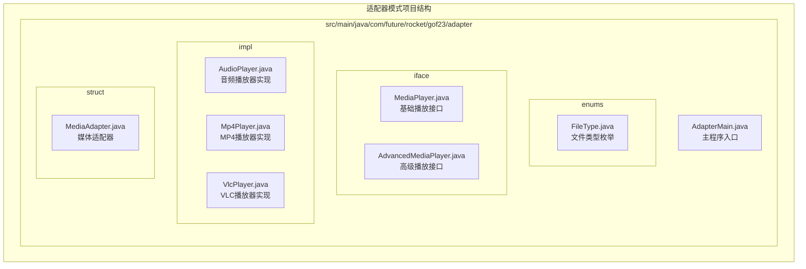

**图表来源**
- [AdapterMain.java:1-17](file://structural/adapter/src/main/java/com/future/rocket/gof23/adapter/AdapterMain.java#L1-L17)
- [FileType.java:1-8](file://structural/adapter/src/main/java/com/future/rocket/gof23/adapter/enums/FileType.java#L1-L8)

**章节来源**
- [AdapterMain.java:1-17](file://structural/adapter/src/main/java/com/future/rocket/gof23/adapter/AdapterMain.java#L1-L17)
- [readme.md:1-8](file://structural/adapter/readme.md#L1-L8)

## 核心组件

适配器模式的实现由以下核心组件构成：

### 接口层次结构

系统采用双接口设计模式：
- **基础接口** (`MediaPlayer`): 定义客户端期望的标准播放方法
- **高级接口** (`AdvancedMediaPlayer`): 提供特定格式的播放能力

### 实现层次结构

- **客户端实现** (`AudioPlayer`): 实现基础接口，处理通用的MP3播放
- **具体适配器** (`MediaAdapter`): 实现基础接口，包装高级播放器
- **具体播放器** (`Mp4Player`, `VlcPlayer`): 实现高级接口，提供特定格式支持

### 枚举定义

`FileType`枚举定义了系统支持的所有媒体格式，为适配器的选择提供了统一的标识符。

**章节来源**
- [MediaPlayer.java:1-8](file://structural/adapter/src/main/java/com/future/rocket/gof23/adapter/iface/MediaPlayer.java#L1-L8)
- [AdvancedMediaPlayer.java:1-7](file://structural/adapter/src/main/java/com/future/rocket/gof23/adapter/iface/AdvancedMediaPlayer.java#L1-L7)
- [AudioPlayer.java:1-21](file://structural/adapter/src/main/java/com/future/rocket/gof23/adapter/impl/AudioPlayer.java#L1-L21)
- [MediaAdapter.java:1-33](file://structural/adapter/src/main/java/com/future/rocket/gof23/adapter/struct/MediaAdapter.java#L1-L33)
- [FileType.java:1-8](file://structural/adapter/src/main/java/com/future/rocket/gof23/adapter/enums/FileType.java#L1-L8)

## 架构概览

适配器模式的架构设计体现了"对象适配器"的实现方式，通过组合而非继承来实现接口转换：

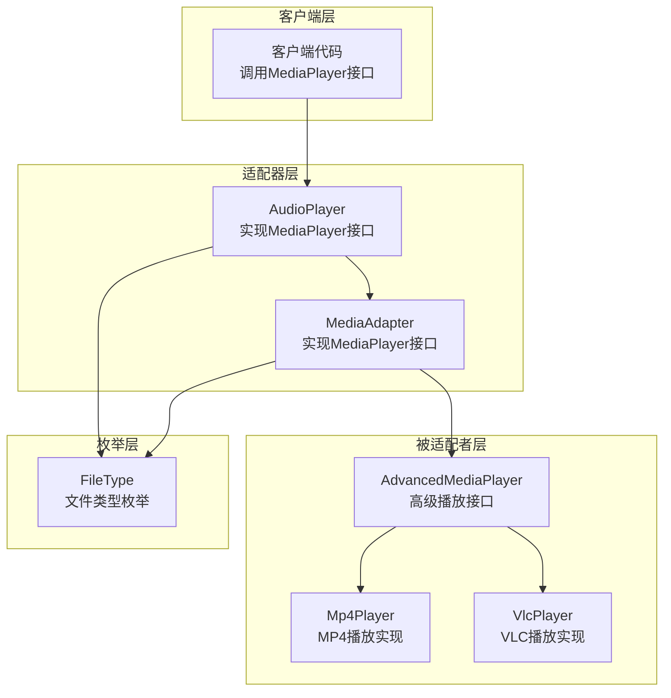

**图表来源**
- [AudioPlayer.java:7-20](file://structural/adapter/src/main/java/com/future/rocket/gof23/adapter/impl/AudioPlayer.java#L7-L20)
- [MediaAdapter.java:9-33](file://structural/adapter/src/main/java/com/future/rocket/gof23/adapter/struct/MediaAdapter.java#L9-L33)
- [Mp4Player.java:5-16](file://structural/adapter/src/main/java/com/future/rocket/gof23/adapter/impl/Mp4Player.java#L5-L16)
- [VlcPlayer.java:5-16](file://structural/adapter/src/main/java/com/future/rocket/gof23/adapter/impl/VlcPlayer.java#L5-L16)

## 详细组件分析

### 类型安全的文件格式管理

`FileType`枚举提供了类型安全的文件格式标识，确保在整个系统中使用一致的格式标识符：

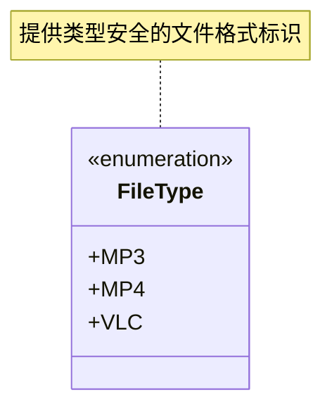

**图表来源**
- [FileType.java:3-7](file://structural/adapter/src/main/java/com/future/rocket/gof23/adapter/enums/FileType.java#L3-L7)

### 基础播放接口设计

`MediaPlayer`接口定义了客户端期望的标准播放方法，采用统一的参数签名：

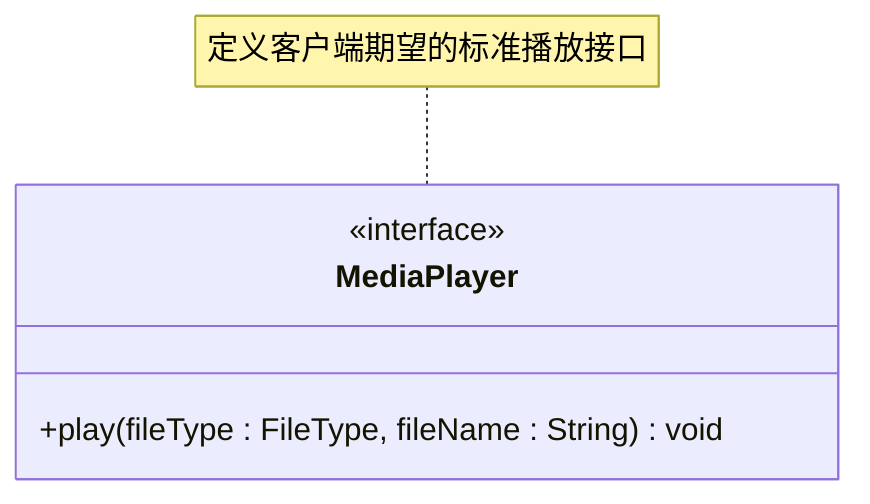

**图表来源**
- [MediaPlayer.java:5-7](file://structural/adapter/src/main/java/com/future/rocket/gof23/adapter/iface/MediaPlayer.java#L5-L7)

### 高级播放接口设计

`AdvancedMediaPlayer`接口提供了特定格式的播放能力，分离了通用性和专用性：

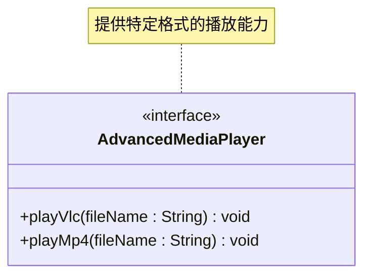

**图表来源**
- [AdvancedMediaPlayer.java:3-6](file://structural/adapter/src/main/java/com/future/rocket/gof23/adapter/iface/AdvancedMediaPlayer.java#L3-L6)

### 音频播放器实现

`AudioPlayer`类实现了基础播放接口，负责处理MP3格式的直接播放，并通过适配器处理其他格式：

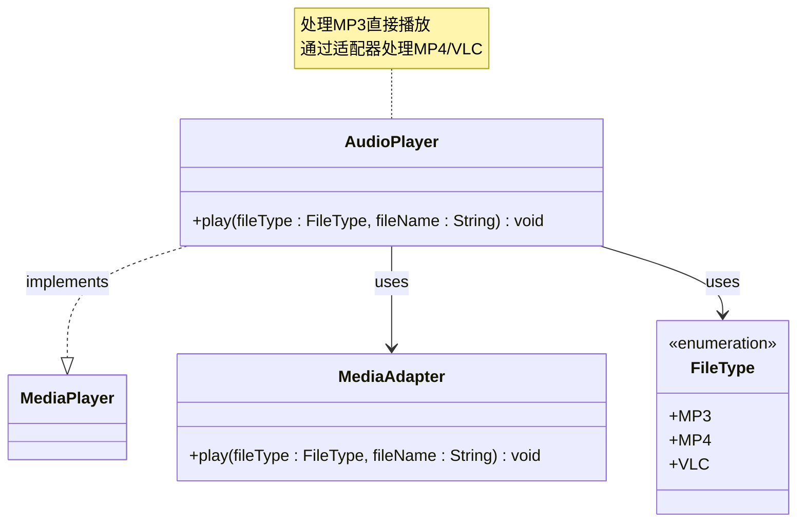

**图表来源**
- [AudioPlayer.java:7-20](file://structural/adapter/src/main/java/com/future/rocket/gof23/adapter/impl/AudioPlayer.java#L7-L20)
- [MediaAdapter.java:9-33](file://structural/adapter/src/main/java/com/future/rocket/gof23/adapter/struct/MediaAdapter.java#L9-L33)

### 媒体适配器实现

`MediaAdapter`类是适配器模式的核心实现，通过组合模式包装不同的播放器：

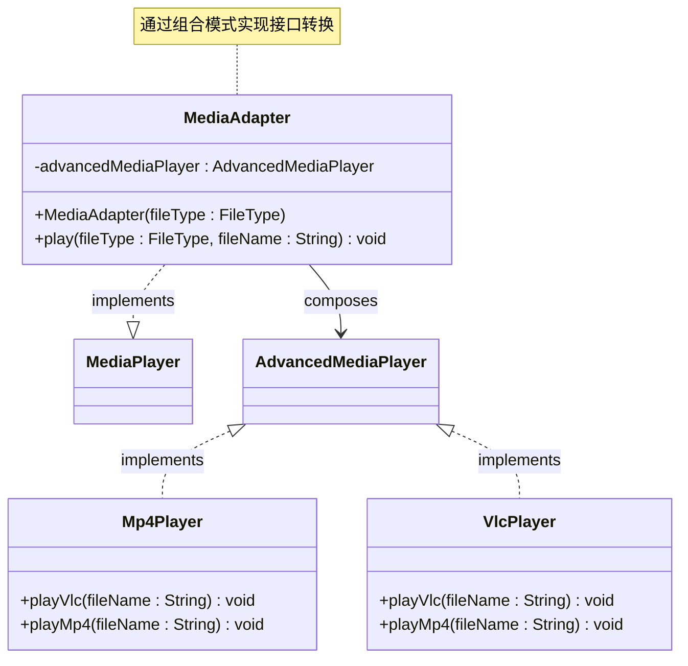

**图表来源**
- [MediaAdapter.java:9-33](file://structural/adapter/src/main/java/com/future/rocket/gof23/adapter/struct/MediaAdapter.java#L9-L33)
- [Mp4Player.java:5-16](file://structural/adapter/src/main/java/com/future/rocket/gof23/adapter/impl/Mp4Player.java#L5-L16)
- [VlcPlayer.java:5-16](file://structural/adapter/src/main/java/com/future/rocket/gof23/adapter/impl/VlcPlayer.java#L5-L16)

### 具体播放器实现

`Mp4Player`和`VlcPlayer`类分别实现了高级播放接口，提供特定格式的播放功能：

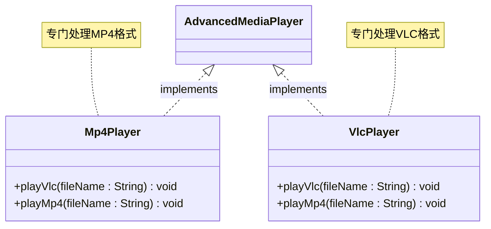

**图表来源**
- [Mp4Player.java:5-16](file://structural/adapter/src/main/java/com/future/rocket/gof23/adapter/impl/Mp4Player.java#L5-L16)
- [VlcPlayer.java:5-16](file://structural/adapter/src/main/java/com/future/rocket/gof23/adapter/impl/VlcPlayer.java#L5-L16)

### 适配器模式的实现流程

下面的序列图展示了适配器模式在音频播放过程中的工作流程：

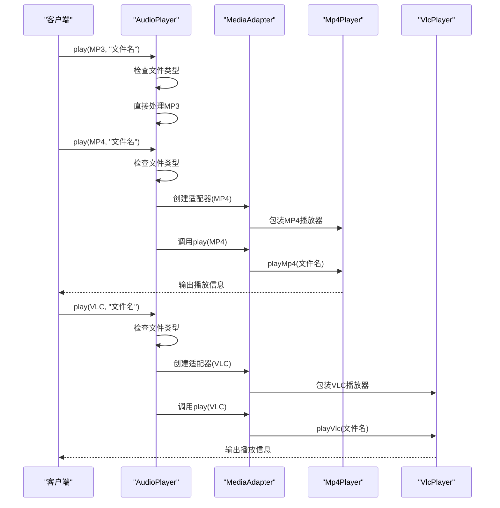

**图表来源**
- [AdapterMain.java:9-15](file://structural/adapter/src/main/java/com/future/rocket/gof23/adapter/AdapterMain.java#L9-L15)
- [AudioPlayer.java:10-19](file://structural/adapter/src/main/java/com/future/rocket/gof23/adapter/impl/AudioPlayer.java#L10-L19)
- [MediaAdapter.java:23-32](file://structural/adapter/src/main/java/com/future/rocket/gof23/adapter/struct/MediaAdapter.java#L23-L32)

### 文件类型处理流程

适配器模式的核心在于如何处理不同的文件类型：

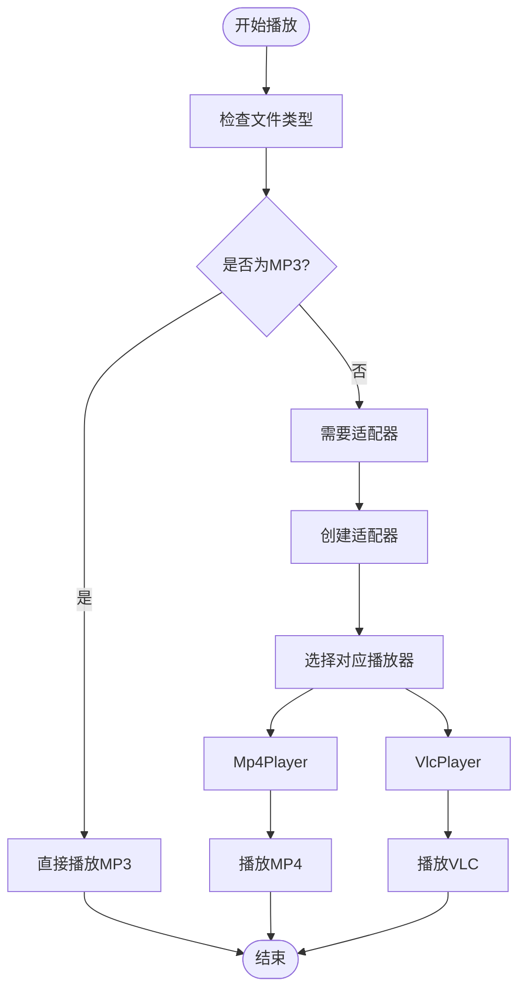

**图表来源**
- [AudioPlayer.java:10-19](file://structural/adapter/src/main/java/com/future/rocket/gof23/adapter/impl/AudioPlayer.java#L10-L19)
- [MediaAdapter.java:13-21](file://structural/adapter/src/main/java/com/future/rocket/gof23/adapter/struct/MediaAdapter.java#L13-L21)

**章节来源**
- [AudioPlayer.java:1-21](file://structural/adapter/src/main/java/com/future/rocket/gof23/adapter/impl/AudioPlayer.java#L1-L21)
- [MediaAdapter.java:1-33](file://structural/adapter/src/main/java/com/future/rocket/gof23/adapter/struct/MediaAdapter.java#L1-L33)
- [Mp4Player.java:1-16](file://structural/adapter/src/main/java/com/future/rocket/gof23/adapter/impl/Mp4Player.java#L1-L16)
- [VlcPlayer.java:1-16](file://structural/adapter/src/main/java/com/future/rocket/gof23/adapter/impl/VlcPlayer.java#L1-L16)

## 依赖关系分析

适配器模式的依赖关系体现了清晰的层次结构和解耦设计：

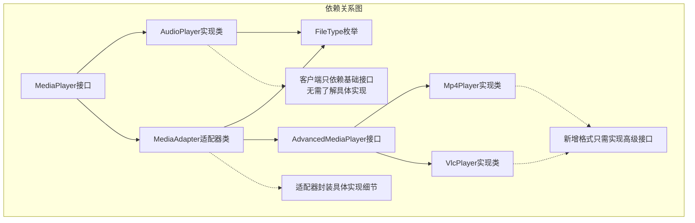

**图表来源**
- [AudioPlayer.java:3-5](file://structural/adapter/src/main/java/com/future/rocket/gof23/adapter/impl/AudioPlayer.java#L3-L5)
- [MediaAdapter.java:3-7](file://structural/adapter/src/main/java/com/future/rocket/gof23/adapter/struct/MediaAdapter.java#L3-L7)
- [Mp4Player.java:3](file://structural/adapter/src/main/java/com/future/rocket/gof23/adapter/impl/Mp4Player.java#L3)
- [VlcPlayer.java:3](file://structural/adapter/src/main/java/com/future/rocket/gof23/adapter/impl/VlcPlayer.java#L3)

### 设计模式特性分析

该实现体现了以下设计模式特性：

1. **单一职责原则**: 每个类都有明确的职责分工
2. **开闭原则**: 对扩展开放，对修改封闭
3. **里氏替换原则**: 子类可以替换父类使用
4. **依赖倒置原则**: 高层模块不依赖低层模块

**章节来源**
- [MediaPlayer.java:1-8](file://structural/adapter/src/main/java/com/future/rocket/gof23/adapter/iface/MediaPlayer.java#L1-L8)
- [AdvancedMediaPlayer.java:1-7](file://structural/adapter/src/main/java/com/future/rocket/gof23/adapter/iface/AdvancedMediaPlayer.java#L1-L7)
- [AudioPlayer.java:1-21](file://structural/adapter/src/main/java/com/future/rocket/gof23/adapter/impl/AudioPlayer.java#L1-L21)

## 性能考虑

### 内存使用优化

1. **对象创建成本**: 适配器模式会增加额外的对象创建开销
2. **内存占用**: 每次播放新的文件类型都会创建相应的适配器实例
3. **缓存策略**: 可以考虑实现适配器缓存来减少重复创建

### 执行效率分析

1. **调用链长度**: 适配器增加了方法调用的层级深度
2. **分支判断**: 文件类型检查会产生额外的条件判断开销
3. **接口转换**: 类型转换操作带来一定的性能损耗

### 扩展性权衡

1. **新增格式成本**: 添加新格式的播放器实现相对简单
2. **向后兼容性**: 现有客户端代码无需修改即可支持新格式
3. **维护复杂度**: 需要维护多个播放器实现类

## 故障排除指南

### 常见问题及解决方案

1. **UnsupportedOperationException异常**
   - 触发条件: 传入不支持的文件类型
   - 解决方案: 在构造函数中添加完整的类型检查

2. **NullPointerException异常**
   - 角色: 当传入null文件类型时可能触发
   - 解决方案: 在play方法中添加null检查

3. **类型转换错误**
   - 触发条件: 适配器类型选择错误
   - 解决方案: 使用枚举类型确保类型安全

### 调试建议

1. **日志记录**: 在关键方法中添加详细的日志输出
2. **单元测试**: 为每个播放器实现编写独立的测试用例
3. **边界测试**: 测试null值、空字符串等边界情况

**章节来源**
- [MediaAdapter.java:18-20](file://structural/adapter/src/main/java/com/future/rocket/gof23/adapter/struct/MediaAdapter.java#L18-L20)
- [AudioPlayer.java:16-18](file://structural/adapter/src/main/java/com/future/rocket/gof23/adapter/impl/AudioPlayer.java#L16-L18)

## 结论

适配器模式在本项目中的实现展现了其作为结构型设计模式的核心价值：通过最小的修改成本实现接口的兼容性。该实现具有以下优势：

1. **类型安全性**: 使用枚举确保文件类型的正确性
2. **扩展性**: 新增媒体格式只需实现高级接口
3. **解耦性**: 客户端代码与具体实现分离
4. **可维护性**: 清晰的职责分工便于维护

同时，该实现也体现了适配器模式的设计权衡：虽然增加了代码的复杂度，但获得了更好的扩展性和维护性。对于需要频繁扩展功能或需要与第三方库集成的场景，适配器模式是一个理想的选择。

## 附录

### 适用场景总结

适配器模式最适合以下场景：
- 需要兼容不兼容的接口
- 需要扩展现有系统的功能
- 需要与第三方库集成
- 需要保持向后兼容性

### 最佳实践建议

1. **接口设计**: 确保基础接口简洁明了
2. **错误处理**: 完善的异常处理机制
3. **文档编写**: 详细的API文档和使用说明
4. **测试覆盖**: 全面的单元测试和集成测试