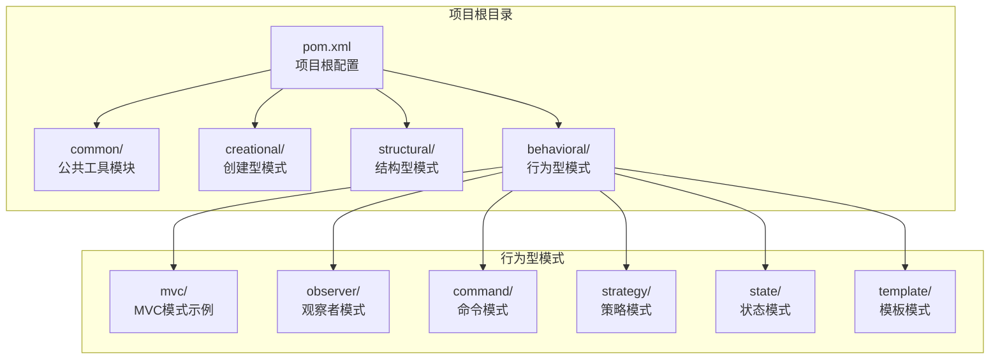
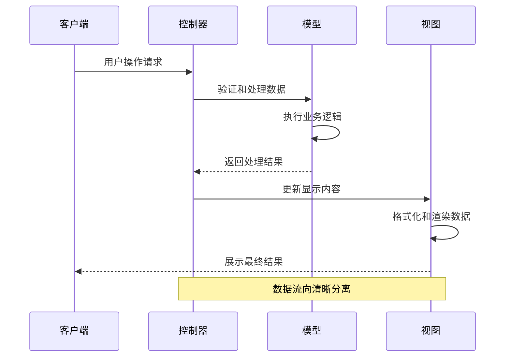
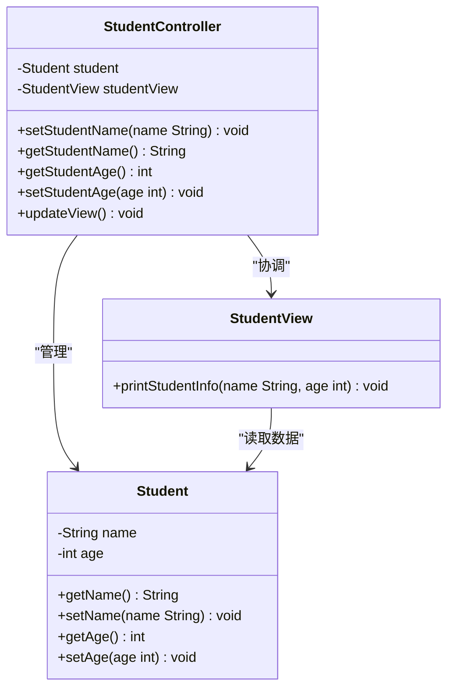
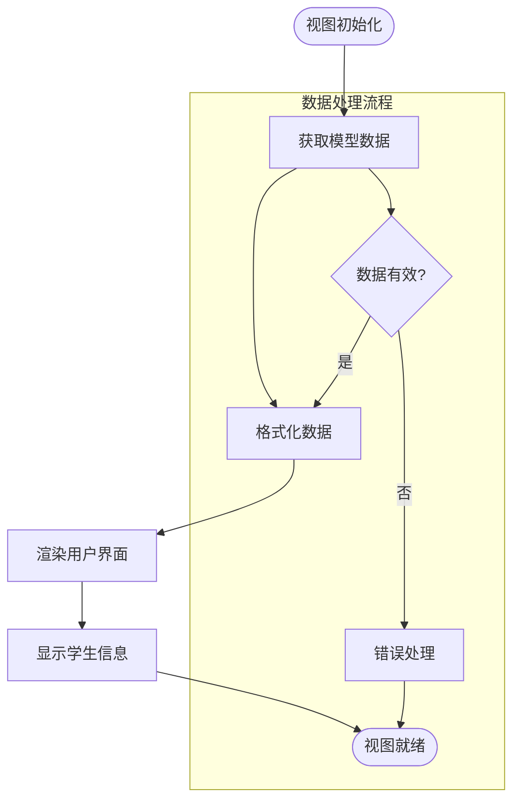
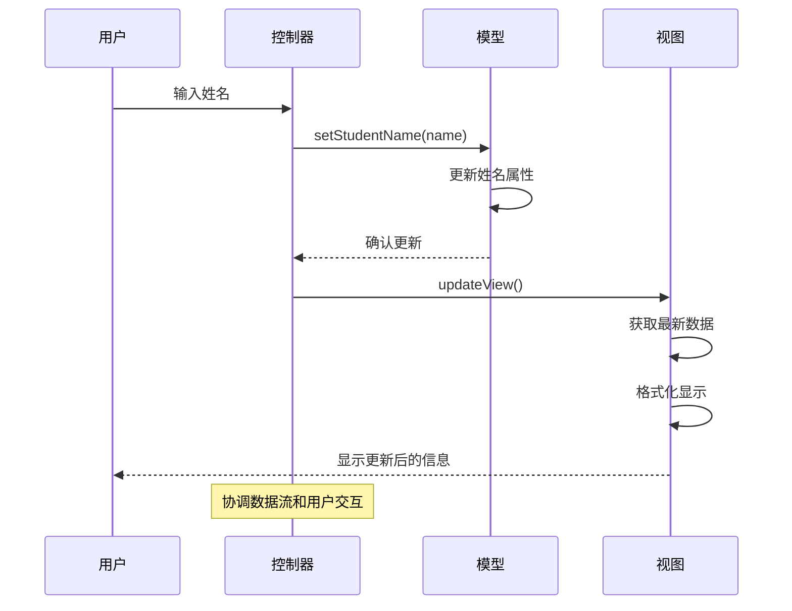
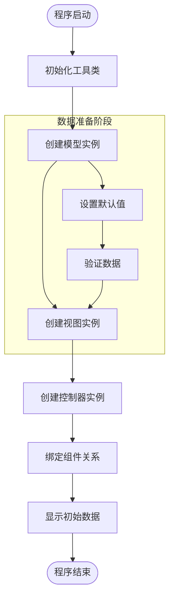
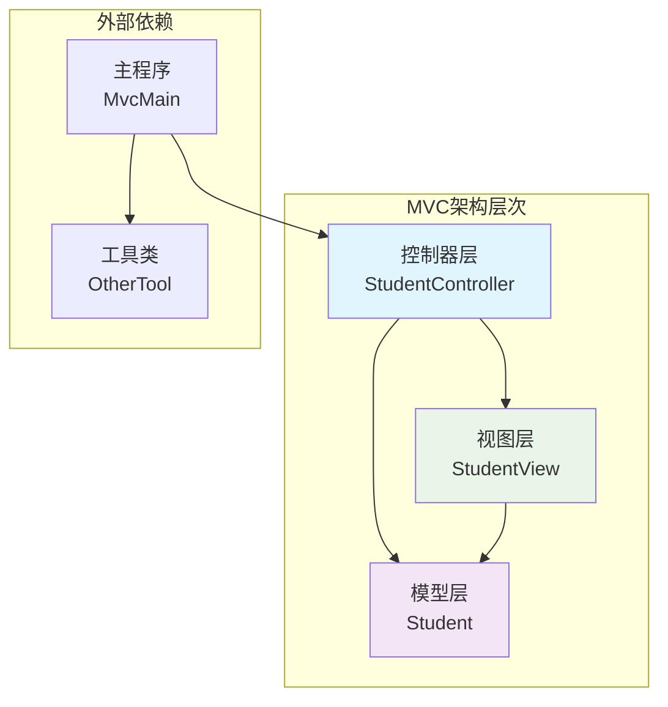

# MVC模式

<cite>
**本文档引用的文件**
- [StudentController.java](file://behavioral/mvc/src/main/java/com/future/rocket/gof23/mvc/controller/StudentController.java)
- [Student.java](file://behavioral/mvc/src/main/java/com/future/rocket/gof23/mvc/model/Student.java)
- [StudentView.java](file://behavioral/mvc/src/main/java/com/future/rocket/gof23/mvc/view/StudentView.java)
- [MvcMain.java](file://behavioral/mvc/src/main/java/com/future/rocket/gof23/mvc/MvcMain.java)
- [readme.md](file://behavioral/mvc/readme.md)
- [pom.xml](file://pom.xml)
- [readme.md](file://readme.md)
- [OtherTool.java](file://common/src/main/java/com/future/rocket/gof23/common/OtherTool.java)
</cite>

## 目录
1. [引言](#引言)
2. [项目结构](#项目结构)
3. [核心组件](#核心组件)
4. [架构概览](#架构概览)
5. [详细组件分析](#详细组件分析)
6. [依赖关系分析](#依赖关系分析)
7. [性能考虑](#性能考虑)
8. [故障排除指南](#故障排除指南)
9. [结论](#结论)
10. [附录](#附录)

## 引言

MVC（Model-View-Controller）架构模式是软件工程中最重要和最广泛使用的架构设计模式之一。该模式通过将应用程序分为三个核心组件来实现关注点分离和职责明确划分，从而提高代码的可维护性、可扩展性和复用性。

在本项目中，我们通过一个简单但完整的学生成绩管理系统来演示MVC模式的实际应用。该系统展示了如何将数据管理、用户界面展示和用户交互处理分离到不同的组件中，实现了清晰的职责分工和松耦合的架构设计。

## 项目结构

该项目采用Maven多模块架构，按照设计模式的类型进行组织。MVC模式位于行为型模式模块中，体现了其作为架构模式的重要地位。

**图表来源**
- [pom.xml:1-24](file://pom.xml#L1-L24)
- [readme.md:1-9](file://readme.md#L1-L9)

**章节来源**
- [pom.xml:1-24](file://pom.xml#L1-L24)
- [readme.md:1-9](file://readme.md#L1-L9)

## 核心组件

MVC架构模式的核心在于将应用程序的三个主要方面分离到独立的组件中：

### 模型（Model）
模型层负责管理应用程序的数据和业务逻辑。在我们的学生成绩管理系统中，模型层承担着以下职责：
- 维护学生的基本信息（姓名、年龄）
- 提供数据访问和修改方法
- 封装业务规则和数据验证逻辑

### 视图（View）
视图层专注于数据的展示和用户界面的呈现。其特点包括：
- 仅关注如何显示数据，不处理业务逻辑
- 提供用户友好的界面元素
- 监听控制器的指令，响应用户交互

### 控制器（Controller）
控制器作为中介层，协调模型和视图之间的交互：
- 处理用户输入和交互事件
- 将用户操作转换为模型操作
- 更新视图以反映数据变化

**章节来源**
- [readme.md:3-22](file://behavioral/mvc/readme.md#L3-L22)

## 架构概览

MVC模式的完整数据流向展示了三个组件之间的协作机制：

**图表来源**
- [StudentController.java:16-34](file://behavioral/mvc/src/main/java/com/future/rocket/gof23/mvc/controller/StudentController.java#L16-L34)
- [Student.java:8-22](file://behavioral/mvc/src/main/java/com/future/rocket/gof23/mvc/model/Student.java#L8-L22)
- [StudentView.java:5-7](file://behavioral/mvc/src/main/java/com/future/rocket/gof23/mvc/view/StudentView.java#L5-L7)

## 详细组件分析

### 模型组件分析

模型组件是MVC架构中的数据核心，负责维护应用程序的状态和业务逻辑。

**图表来源**
- [Student.java:3-23](file://behavioral/mvc/src/main/java/com/future/rocket/gof23/mvc/model/Student.java#L3-L23)
- [StudentController.java:6-35](file://behavioral/mvc/src/main/java/com/future/rocket/gof23/mvc/controller/StudentController.java#L6-L35)
- [StudentView.java:3-8](file://behavioral/mvc/src/main/java/com/future/rocket/gof23/mvc/view/StudentView.java#L3-L8)

#### 模型数据结构分析

Student类采用了简单的数据封装设计，提供了标准的getter和setter方法：
- **数据完整性**：通过私有字段确保数据封装
- **访问控制**：提供受控的访问接口
- **简单性**：避免了复杂的业务逻辑，专注于数据存储

#### 模型更新通知机制

虽然当前实现相对简单，但模型层具备了通知机制的基础：
- 可以在setter方法中添加属性变更通知
- 支持观察者模式的集成
- 便于扩展更复杂的数据同步机制

**章节来源**
- [Student.java:1-24](file://behavioral/mvc/src/main/java/com/future/rocket/gof23/mvc/model/Student.java#L1-L24)

### 视图组件分析

视图组件负责用户界面的展示和数据的可视化呈现。

**图表来源**
- [StudentView.java:5-7](file://behavioral/mvc/src/main/java/com/future/rocket/gof23/mvc/view/StudentView.java#L5-L7)

#### 视图刷新策略

当前视图实现采用直接输出的方式，适用于简单的控制台应用：
- **即时刷新**：每次调用都立即显示最新数据
- **简单高效**：避免了复杂的UI更新机制
- **易于测试**：纯函数式的输出便于单元测试

**章节来源**
- [StudentView.java:1-9](file://behavioral/mvc/src/main/java/com/future/rocket/gof23/mvc/view/StudentView.java#L1-L9)

### 控制器组件分析

控制器作为MVC架构的协调中心，连接模型和视图两个关键组件。

**图表来源**
- [StudentController.java:16-34](file://behavioral/mvc/src/main/java/com/future/rocket/gof23/mvc/controller/StudentController.java#L16-L34)

#### 控制器路由机制

控制器实现了简单的路由功能，将用户操作映射到相应的业务逻辑：
- **参数验证**：确保传入的数据类型正确
- **业务逻辑封装**：隐藏底层实现细节
- **职责单一**：专注于协调而非业务实现

**章节来源**
- [StudentController.java:1-36](file://behavioral/mvc/src/main/java/com/future/rocket/gof23/mvc/controller/StudentController.java#L1-L36)

### 主程序入口分析

主程序展示了MVC模式的完整工作流程和组件集成方式。

**图表来源**
- [MvcMain.java:10-24](file://behavioral/mvc/src/main/java/com/future/rocket/gof23/mvc/MvcMain.java#L10-L24)

**章节来源**
- [MvcMain.java:1-26](file://behavioral/mvc/src/main/java/com/future/rocket/gof23/mvc/MvcMain.java#L1-L26)

## 依赖关系分析

MVC模式的组件间依赖关系体现了清晰的关注点分离：

**图表来源**
- [StudentController.java:3-4](file://behavioral/mvc/src/main/java/com/future/rocket/gof23/mvc/controller/StudentController.java#L3-L4)
- [MvcMain.java:3-6](file://behavioral/mvc/src/main/java/com/future/rocket/gof23/mvc/MvcMain.java#L3-L6)

### 组件耦合度分析

- **低耦合设计**：各组件间通过接口交互，减少直接依赖
- **单向依赖**：控制器依赖模型和视图，但反向依赖较少
- **可替换性**：任一组件可以在不影响其他组件的情况下进行修改

**章节来源**
- [StudentController.java:1-36](file://behavioral/mvc/src/main/java/com/future/rocket/gof23/mvc/controller/StudentController.java#L1-L36)

## 性能考虑

### 内存使用优化

- **对象生命周期**：合理管理模型、视图和控制器对象的创建和销毁
- **数据缓存策略**：在需要时实现数据缓存以减少重复计算
- **资源释放**：确保及时释放不再使用的资源

### 扩展性设计

- **插件化架构**：支持新的视图类型和控制器类型的动态加载
- **配置驱动**：通过配置文件控制组件的行为和外观
- **异步处理**：对于耗时操作采用异步处理避免阻塞主线程

## 故障排除指南

### 常见问题诊断

1. **数据不一致问题**
   - 检查模型层的数据同步机制
   - 验证控制器的更新逻辑
   - 确认视图的刷新时机

2. **组件通信失败**
   - 验证组件间的依赖注入是否正确
   - 检查接口契约的一致性
   - 确认异常处理机制的有效性

3. **性能问题**
   - 分析组件间的调用频率
   - 识别潜在的循环依赖
   - 评估内存使用情况

**章节来源**
- [StudentController.java:16-34](file://behavioral/mvc/src/main/java/com/future/rocket/gof23/mvc/controller/StudentController.java#L16-L34)

## 结论

MVC架构模式通过将应用程序分为模型、视图和控制器三个核心组件，实现了清晰的关注点分离和职责明确划分。在本学生成绩管理系统中，我们成功展示了这一模式的核心理念和实际应用。

### 主要优势

- **可维护性**：组件职责明确，便于单独维护和修改
- **可扩展性**：支持新功能的添加和现有功能的扩展
- **可测试性**：组件间松耦合，便于单元测试和集成测试
- **团队协作**：不同开发者可以并行开发不同的组件

### 适用场景

MVC模式特别适用于：
- Web应用程序开发
- 桌面应用程序界面设计
- 移动应用的用户界面架构
- 需要清晰职责分离的大型项目

## 附录

### MVC模式与其他架构模式的区别

#### 与MVVM模式的区别

| 特征 | MVC | MVVM |
|------|-----|------|
| **数据绑定** | 单向数据流 | 双向数据绑定 |
| **复杂度** | 相对简单 | 更加复杂 |
| **适用场景** | 中小型应用 | 大型复杂应用 |
| **学习曲线** | 较平缓 | 较陡峭 |

#### 与MVP模式的区别

| 特征 | MVC | MVP |
|------|-----|-----|
| **视图职责** | 仅负责显示 | 保持空壳，无业务逻辑 |
| **测试友好性** | 中等 | 更友好 |
| **复杂度** | 简单 | 中等 |
| **适用场景** | 一般应用 | 需要严格测试的应用 |

#### 与命令模式的关系

MVC中的控制器与命令模式有相似之处：
- **封装操作**：都通过封装操作来简化调用
- **解耦设计**：都实现了调用者与接收者的解耦
- **扩展性**：都支持动态添加新的操作类型

### 从单层应用到分层架构的思维转变

#### 初学者常见误区

1. **过度集中**：试图在一个类中处理所有功能
2. **忽视职责分离**：不区分业务逻辑和界面逻辑
3. **缺乏设计模式**：凭直觉编码，缺乏架构指导

#### 专家级架构设计要点

1. **关注点分离**：明确每个组件的职责边界
2. **接口设计**：通过清晰的接口契约实现松耦合
3. **可扩展性**：预留扩展点，支持未来需求变化
4. **性能优化**：平衡功能实现与性能要求

### 实践建议

1. **从小处着手**：从简单的MVC实现开始，逐步增加复杂度
2. **重视测试**：为每个组件编写单元测试和集成测试
3. **文档记录**：详细记录架构决策和设计原理
4. **持续改进**：根据实际使用反馈不断优化架构设计