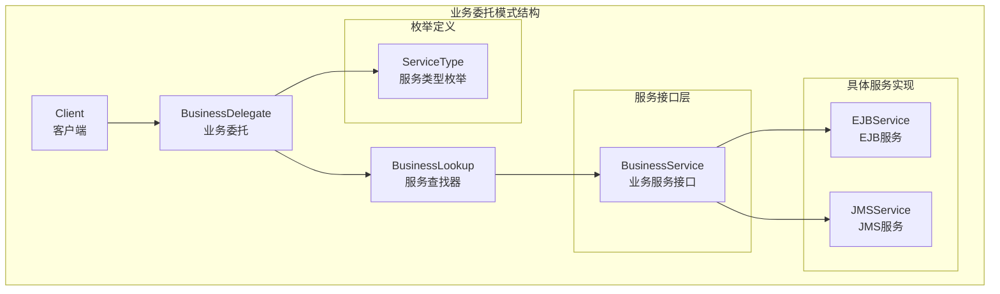
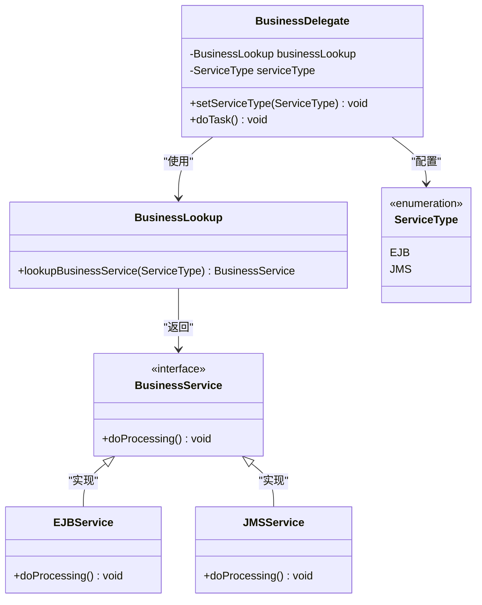
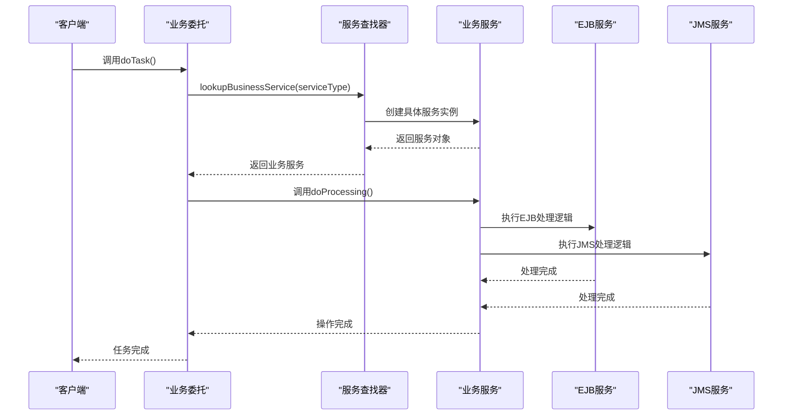
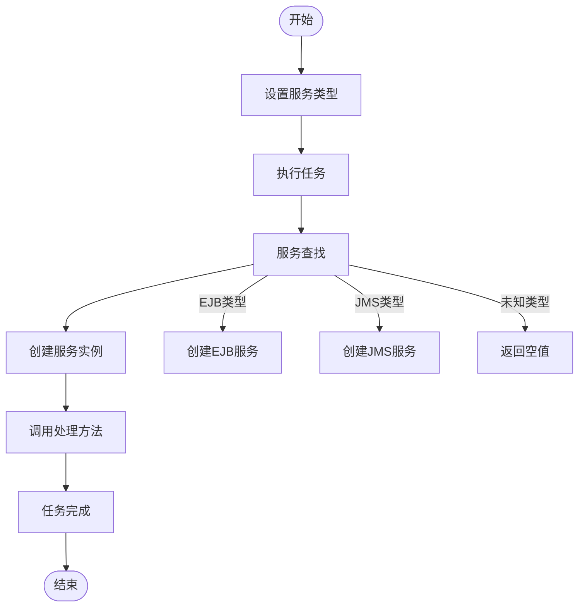
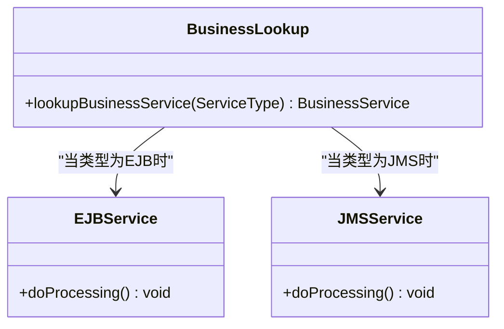
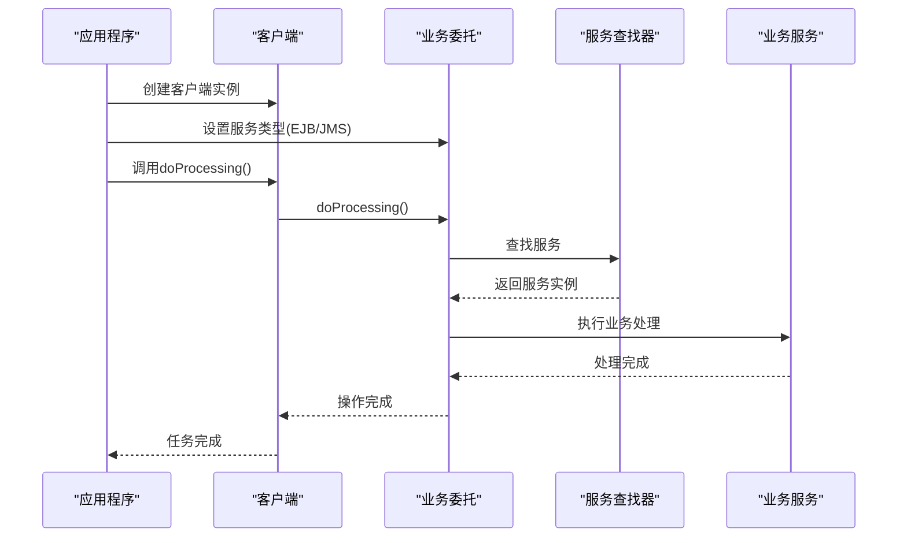
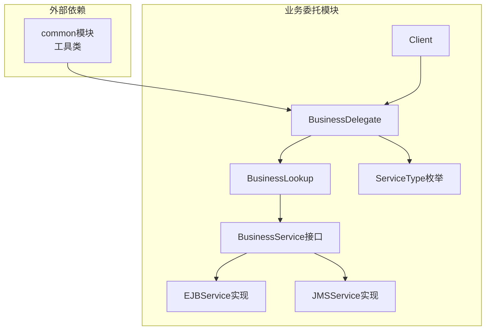

# 业务委托模式

<cite>
**本文档引用的文件**
- [Client.java](file://behavioral/businessDelegate/src/main/java/com/future/rocket/gof23/business/delegate/client/Client.java)
- [BusinessDelegate.java](file://behavioral/businessDelegate/src/main/java/com/future/rocket/gof23/business/delegate/delegate/BusinessDelegate.java)
- [ServiceType.java](file://behavioral/businessDelegate/src/main/java/com/future/rocket/gof23/business/delegate/enums/ServiceType.java)
- [BusinessService.java](file://behavioral/businessDelegate/src/main/java/com/future/rocket/gof23/business/delegate/iface/BusinessService.java)
- [EJBService.java](file://behavioral/businessDelegate/src/main/java/com/future/rocket/gof23/business/delegate/impl/EJBService.java)
- [JMSService.java](file://behavioral/businessDelegate/src/main/java/com/future/rocket/gof23/business/delegate/impl/JMSService.java)
- [BusinessLookup.java](file://behavioral/businessDelegate/src/main/java/com/future/rocket/gof23/business/delegate/lookup/BusinessLookup.java)
- [BusinessDelegateMain.java](file://behavioral/businessDelegate/src/main/java/com/future/rocket/gof23/business/delegate/BusinessDelegateMain.java)
- [pom.xml](file://behavioral/businessDelegate/pom.xml)
</cite>

## 目录
1. [引言](#引言)
2. [项目结构](#项目结构)
3. [核心组件](#核心组件)
4. [架构概览](#架构概览)
5. [详细组件分析](#详细组件分析)
6. [依赖关系分析](#依赖关系分析)
7. [性能考虑](#性能考虑)
8. [故障排除指南](#故障排除指南)
9. [结论](#结论)
10. [附录](#附录)

## 引言

业务委托模式是一种行为型设计模式，旨在为企业级应用程序提供统一的服务访问接口。该模式的核心目标是隐藏服务查找、定位和调用的复杂性，为客户端提供简化的接口体验。

在现代企业应用中，系统通常需要与多种不同类型的服务进行交互，如EJB（Enterprise JavaBeans）、JMS（Java Message Service）等。这些服务可能有不同的访问方式、配置要求和生命周期管理。业务委托模式通过引入一个中间层来封装这些复杂性，使得客户端代码可以专注于业务逻辑而非技术细节。

该模式特别适用于以下场景：
- 需要在不同服务类型之间进行切换
- 要求统一的服务访问接口
- 需要简化客户端与服务端的耦合度
- 希望实现服务发现和动态绑定

## 项目结构

业务委托模式的实现遵循标准的分层架构，将关注点分离到不同的包中：

**图表来源**
- [BusinessDelegate.java:1-20](file://behavioral/businessDelegate/src/main/java/com/future/rocket/gof23/business/delegate/delegate/BusinessDelegate.java#L1-L20)
- [BusinessLookup.java:1-21](file://behavioral/businessDelegate/src/main/java/com/future/rocket/gof23/business/delegate/lookup/BusinessLookup.java#L1-L21)
- [BusinessService.java:1-6](file://behavioral/businessDelegate/src/main/java/com/future/rocket/gof23/business/delegate/iface/BusinessService.java#L1-L6)

**章节来源**
- [BusinessDelegateMain.java:1-22](file://behavioral/businessDelegate/src/main/java/com/future/rocket/gof23/business/delegate/BusinessDelegateMain.java#L1-L22)
- [pom.xml:1-28](file://behavioral/businessDelegate/pom.xml#L1-L28)

## 核心组件

### 业务委托类（BusinessDelegate）

业务委托类是整个模式的核心，它充当客户端与具体服务之间的中介。该类的主要职责包括：

- 接收客户端的任务请求
- 管理服务类型的选择
- 协调服务查找和执行过程
- 提供统一的业务操作接口

**图表来源**
- [BusinessDelegate.java:1-20](file://behavioral/businessDelegate/src/main/java/com/future/rocket/gof23/business/delegate/delegate/BusinessDelegate.java#L1-L20)
- [BusinessLookup.java:1-21](file://behavioral/businessDelegate/src/main/java/com/future/rocket/gof23/business/delegate/lookup/BusinessLookup.java#L1-L21)
- [BusinessService.java:1-6](file://behavioral/businessDelegate/src/main/java/com/future/rocket/gof23/business/delegate/iface/BusinessService.java#L1-L6)
- [EJBService.java:1-12](file://behavioral/businessDelegate/src/main/java/com/future/rocket/gof23/business/delegate/impl/EJBService.java#L1-L12)
- [JMSService.java:1-11](file://behavioral/businessDelegate/src/main/java/com/future/rocket/gof23/business/delegate/impl/JMSService.java#L1-L11)
- [ServiceType.java:1-7](file://behavioral/businessDelegate/src/main/java/com/future/rocket/gof23/business/delegate/enums/ServiceType.java#L1-L7)

**章节来源**
- [BusinessDelegate.java:1-20](file://behavioral/businessDelegate/src/main/java/com/future/rocket/gof23/business/delegate/delegate/BusinessDelegate.java#L1-L20)

### 客户端类（Client）

客户端类代表了业务委托模式的使用者。它通过注入业务委托实例来执行业务操作，完全不需要了解底层服务的具体实现细节。

**章节来源**
- [Client.java:1-15](file://behavioral/businessDelegate/src/main/java/com/future/rocket/gof23/business/delegate/client/Client.java#L1-L15)

### 服务接口（BusinessService）

业务服务接口定义了所有具体服务必须实现的标准方法。这种接口抽象确保了不同服务类型的统一访问方式。

**章节来源**
- [BusinessService.java:1-6](file://behavioral/businessDelegate/src/main/java/com/future/rocket/gof23/business/delegate/iface/BusinessService.java#L1-L6)

### 具体服务实现

#### EJB服务实现

EJB服务实现了业务服务接口，提供了企业级JavaBean风格的服务功能。

**章节来源**
- [EJBService.java:1-12](file://behavioral/businessDelegate/src/main/java/com/future/rocket/gof23/business/delegate/impl/EJBService.java#L1-L12)

#### JMS服务实现

JMS服务同样实现了业务服务接口，提供了消息驱动的企业服务功能。

**章节来源**
- [JMSService.java:1-11](file://behavioral/businessDelegate/src/main/java/com/future/rocket/gof23/business/delegate/impl/JMSService.java#L1-L11)

### 服务查找器（BusinessLookup）

服务查找器负责根据指定的服务类型创建相应的服务实例。它实现了简单的工厂模式，根据枚举值返回对应的服务对象。

**章节来源**
- [BusinessLookup.java:1-21](file://behavioral/businessDelegate/src/main/java/com/future/rocket/gof23/business/delegate/lookup/BusinessLookup.java#L1-L21)

### 服务类型枚举（ServiceType）

服务类型枚举定义了系统支持的所有服务类型，当前包括EJB和JMS两种类型。

**章节来源**
- [ServiceType.java:1-7](file://behavioral/businessDelegate/src/main/java/com/future/rocket/gof23/business/delegate/enums/ServiceType.java#L1-L7)

## 架构概览

业务委托模式的整体架构体现了清晰的关注点分离和依赖倒置原则：

**图表来源**
- [BusinessDelegateMain.java:10-20](file://behavioral/businessDelegate/src/main/java/com/future/rocket/gof23/business/delegate/BusinessDelegateMain.java#L10-L20)
- [BusinessDelegate.java:15-18](file://behavioral/businessDelegate/src/main/java/com/future/rocket/gof23/business/delegate/delegate/BusinessDelegate.java#L15-L18)
- [BusinessLookup.java:10-19](file://behavioral/businessDelegate/src/main/java/com/future/rocket/gof23/business/delegate/lookup/BusinessLookup.java#L10-L19)

该序列图展示了完整的业务委托流程，从客户端发起请求到最终完成操作的全过程。

## 详细组件分析

### 业务委托类深度分析

业务委托类是整个模式的关键组件，它实现了以下核心功能：

#### 控制流分析

**图表来源**
- [BusinessDelegate.java:15-18](file://behavioral/businessDelegate/src/main/java/com/future/rocket/gof23/business/delegate/delegate/BusinessDelegate.java#L15-L18)
- [BusinessLookup.java:10-19](file://behavioral/businessDelegate/src/main/java/com/future/rocket/gof23/business/delegate/lookup/BusinessLookup.java#L10-L19)

#### 设计模式应用

业务委托类结合了多种设计模式：

1. **外观模式（Facade Pattern）**：为复杂的子系统提供简化的统一接口
2. **工厂模式（Factory Pattern）**：根据类型参数创建相应的产品实例
3. **策略模式（Strategy Pattern）**：允许在运行时选择不同的服务实现

**章节来源**
- [BusinessDelegate.java:1-20](file://behavioral/businessDelegate/src/main/java/com/future/rocket/gof23/business/delegate/delegate/BusinessDelegate.java#L1-L20)

### 服务查找器分析

服务查找器实现了简单的工厂模式，根据服务类型返回相应的服务实例：

**图表来源**
- [BusinessLookup.java:10-19](file://behavioral/businessDelegate/src/main/java/com/future/rocket/gof23/business/delegate/lookup/BusinessLookup.java#L10-L19)

**章节来源**
- [BusinessLookup.java:1-21](file://behavioral/businessDelegate/src/main/java/com/future/rocket/gof23/business/delegate/lookup/BusinessLookup.java#L1-L21)

### 客户端交互流程

客户端通过业务委托类执行业务操作，完全不需要了解底层服务的实现细节：

**图表来源**
- [BusinessDelegateMain.java:13-19](file://behavioral/businessDelegate/src/main/java/com/future/rocket/gof23/business/delegate/BusinessDelegateMain.java#L13-L19)
- [Client.java:11-13](file://behavioral/businessDelegate/src/main/java/com/future/rocket/gof23/business/delegate/client/Client.java#L11-L13)

**章节来源**
- [Client.java:1-15](file://behavioral/businessDelegate/src/main/java/com/future/rocket/gof23/business/delegate/client/Client.java#L1-L15)
- [BusinessDelegateMain.java:1-22](file://behavioral/businessDelegate/src/main/java/com/future/rocket/gof23/business/delegate/BusinessDelegateMain.java#L1-L22)

## 依赖关系分析

业务委托模式的依赖关系体现了良好的面向对象设计原则：

**图表来源**
- [pom.xml:20-26](file://behavioral/businessDelegate/pom.xml#L20-L26)
- [BusinessDelegate.java:3-5](file://behavioral/businessDelegate/src/main/java/com/future/rocket/gof23/business/delegate/delegate/BusinessDelegate.java#L3-L5)

### 内部依赖关系

系统内部的依赖关系遵循依赖倒置原则，高层模块不依赖于低层模块：

- **客户端**依赖于**业务委托**接口（抽象）
- **业务委托**依赖于**服务查找器**（抽象）
- **服务查找器**依赖于**业务服务接口**（抽象）
- **具体服务实现**依赖于**业务服务接口**（抽象）

这种设计确保了系统的可扩展性和可维护性。

**章节来源**
- [pom.xml:1-28](file://behavioral/businessDelegate/pom.xml#L1-L28)

## 性能考虑

在企业级应用中，业务委托模式的性能优化可以从以下几个方面考虑：

### 缓存策略

虽然当前实现没有内置缓存机制，但在生产环境中建议实现以下缓存策略：

1. **服务实例缓存**：避免重复创建相同类型的服务实例
2. **查找结果缓存**：缓存服务查找的结果以减少重复查找开销
3. **连接池管理**：对于需要网络连接的服务，实现连接池以提高性能

### 异步处理

对于耗时较长的服务操作，可以考虑实现异步处理机制：

- 使用线程池处理长时间运行的操作
- 实现回调机制通知操作完成状态
- 支持超时控制和重试机制

### 负载均衡

在多服务实例部署场景下，可以实现负载均衡策略：

- 基于轮询的负载分配
- 基于权重的智能分配
- 健康检查和故障转移

## 故障排除指南

### 常见问题及解决方案

#### 服务类型配置错误

**问题描述**：当设置不支持的服务类型时，服务查找器会返回空值。

**解决方案**：
- 在业务委托类中添加类型验证逻辑
- 实现默认服务回退机制
- 提供详细的错误日志和异常信息

#### 服务实例创建失败

**问题描述**：某些服务在创建过程中可能出现异常。

**解决方案**：
- 实现服务实例的延迟创建和初始化
- 添加服务可用性检测机制
- 实现优雅降级和故障转移

#### 性能问题

**问题描述**：频繁的服务查找和实例创建导致性能下降。

**解决方案**：
- 实现服务实例缓存机制
- 优化服务查找算法
- 考虑使用单例模式管理共享资源

**章节来源**
- [BusinessLookup.java:16-18](file://behavioral/businessDelegate/src/main/java/com/future/rocket/gof23/business/delegate/lookup/BusinessLookup.java#L16-L18)

## 结论

业务委托模式为企业级应用程序提供了一个优雅的解决方案，通过引入中间层来隐藏服务访问的复杂性。该模式的主要优势包括：

1. **简化客户端代码**：客户端无需了解底层服务的实现细节
2. **提高可扩展性**：易于添加新的服务类型和实现
3. **增强可维护性**：关注点分离，职责明确
4. **支持动态切换**：可以在运行时切换不同的服务实现

在实际应用中，可以根据具体需求对现有实现进行扩展，如添加缓存机制、异步处理、负载均衡等功能。同时，应该注意保持模式的核心原则不变，即通过抽象接口隐藏复杂性，提供统一的访问入口。

## 附录

### 学习路径建议

#### 初学者学习路径

1. **理解基本概念**：掌握业务委托模式的核心思想和应用场景
2. **分析现有实现**：深入理解当前代码结构和各组件职责
3. **扩展功能**：添加缓存、异常处理等实用功能
4. **实践应用**：在实际项目中应用该模式解决具体问题

#### 专家级应用指导

1. **分布式架构设计**：考虑微服务架构下的业务委托模式应用
2. **云原生适配**：结合容器化和云平台特性优化模式实现
3. **性能优化策略**：实现高级缓存、负载均衡和监控机制
4. **安全加固**：添加认证授权和数据加密等安全措施

### 相关设计模式对比

#### 与外观模式的关系

业务委托模式与外观模式密切相关，都提供简化的统一接口。主要区别在于：
- **外观模式**：主要关注简化复杂子系统的使用
- **业务委托模式**：更注重服务发现和动态绑定

#### 与代理模式的关系

两者都涉及间接访问，但侧重点不同：
- **代理模式**：主要关注控制对真实对象的访问
- **业务委托模式**：主要关注服务的查找和调用