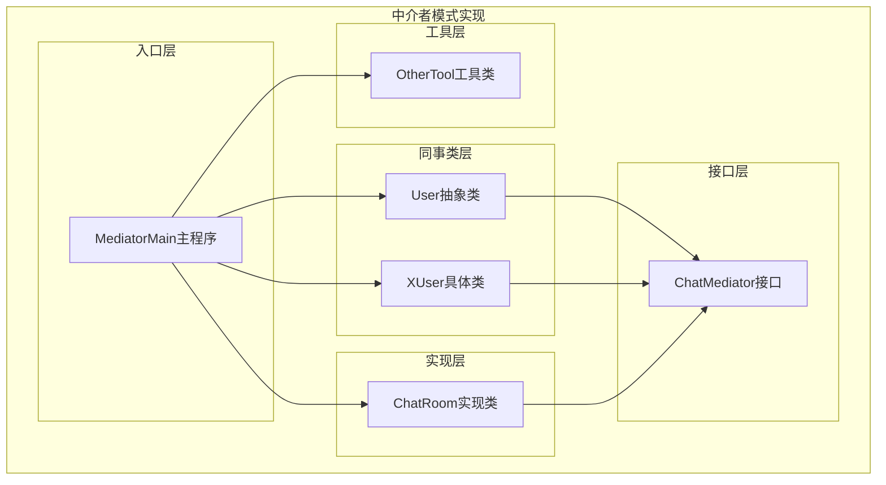
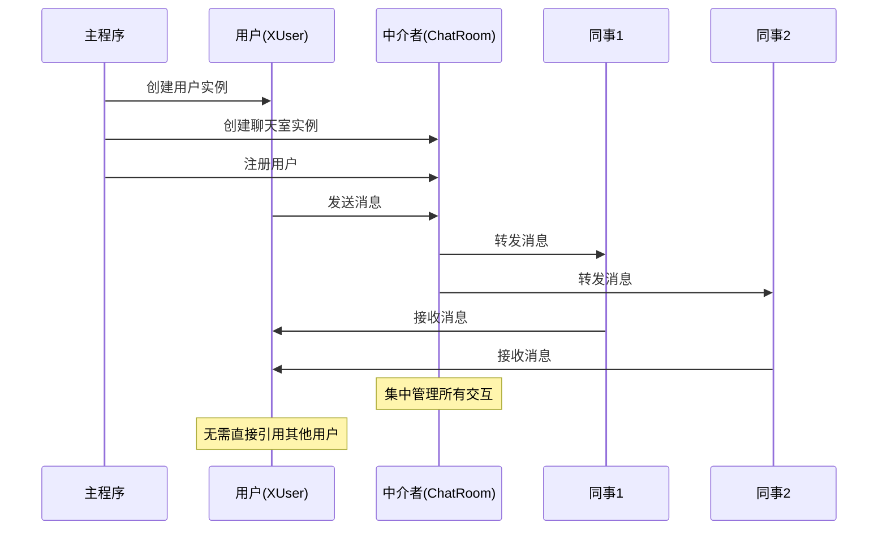
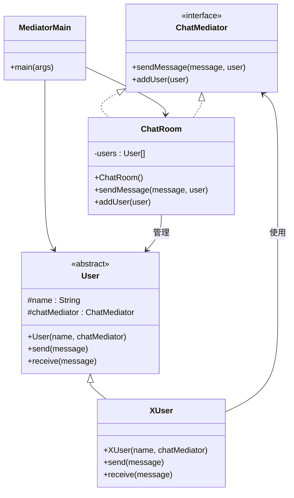
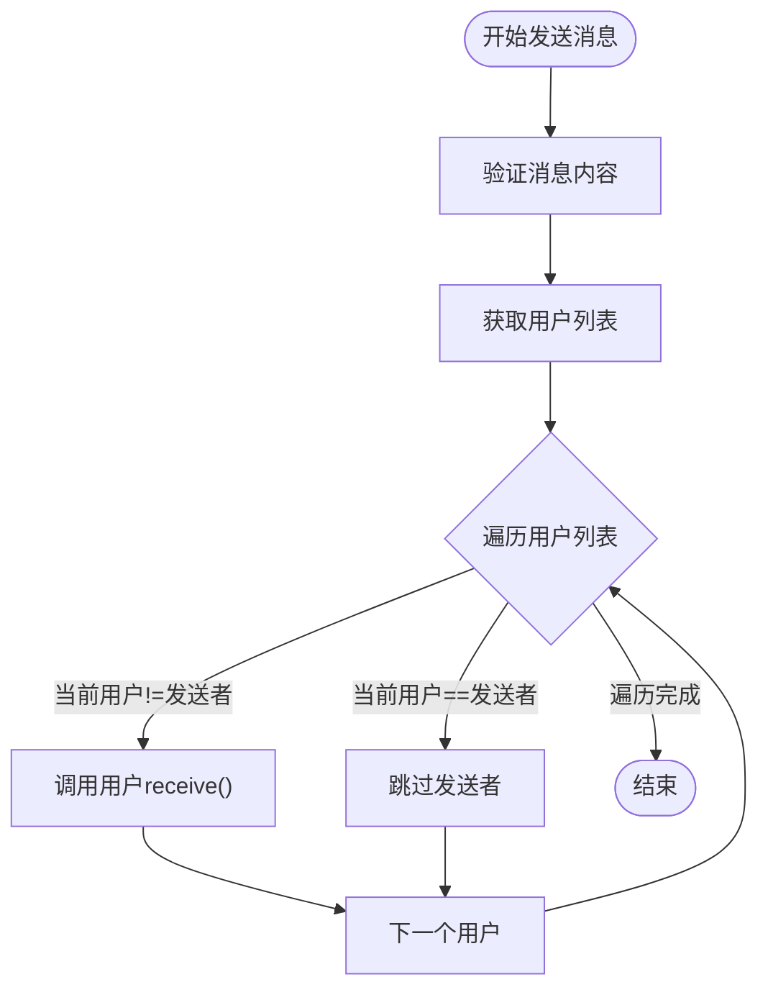
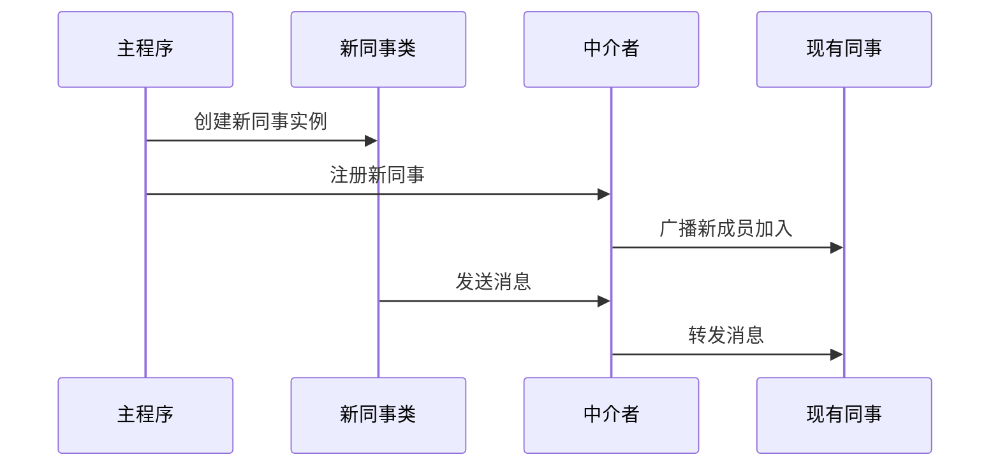
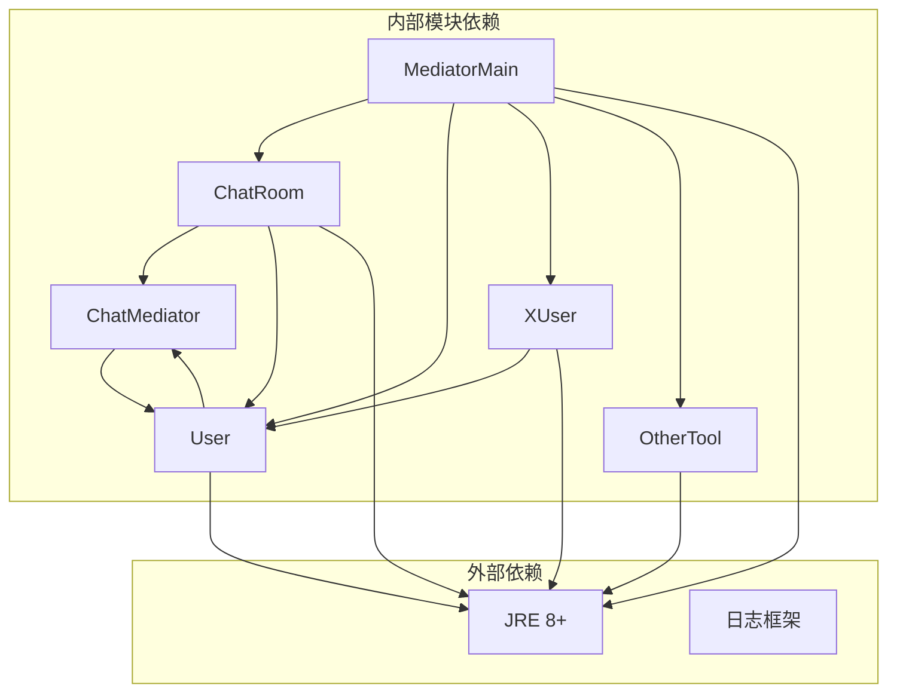

# 中介者模式

<cite>
**本文档引用的文件**
- [MediatorMain.java](file://behavioral/mediator/src/main/java/com/future/rocket/gof23/mediator/MediatorMain.java)
- [User.java](file://behavioral/mediator/src/main/java/com/future/rocket/gof23/mediator/colleague/User.java)
- [XUser.java](file://behavioral/mediator/src/main/java/com/future/rocket/gof23/mediator/colleague/XUser.java)
- [ChatMediator.java](file://behavioral/mediator/src/main/java/com/future/rocket/gof23/mediator/iface/ChatMediator.java)
- [ChatRoom.java](file://behavioral/mediator/src/main/java/com/future/rocket/gof23/mediator/impl/ChatRoom.java)
- [OtherTool.java](file://common/src/main/java/com/future/rocket/gof23/common/OtherTool.java)
</cite>

## 目录
1. [引言](#引言)
2. [项目结构](#项目结构)
3. [核心组件](#核心组件)
4. [架构概览](#架构概览)
5. [详细组件分析](#详细组件分析)
6. [依赖分析](#依赖分析)
7. [性能考虑](#性能考虑)
8. [故障排除指南](#故障排除指南)
9. [结论](#结论)
10. [附录](#附录)

## 引言

中介者模式是一种行为型设计模式，它通过引入一个中介对象来封装一系列对象之间的交互，从而避免对象之间需要显式引用彼此。这种模式的核心价值在于：

- **降低耦合度**：同事类之间不再直接相互引用，而是通过中介者进行通信
- **简化复杂性**：将复杂的多对多关系转换为简单的星型拓扑结构
- **提高可维护性**：集中管理对象间的交互逻辑，便于修改和扩展
- **增强可扩展性**：可以轻松添加新的同事类或修改交互规则

在本项目中，我们通过一个聊天室系统的实现来展示中介者模式的实际应用，包括普通用户和X用户的同事类，以及聊天室中介者的协作机制。

## 项目结构

中介者模式的实现位于行为型设计模式的mediator模块中，采用清晰的分层架构：



**图表来源**
- [MediatorMain.java:1-29](file://behavioral/mediator/src/main/java/com/future/rocket/gof23/mediator/MediatorMain.java#L1-L29)
- [ChatMediator.java:1-9](file://behavioral/mediator/src/main/java/com/future/rocket/gof23/mediator/iface/ChatMediator.java#L1-L9)
- [ChatRoom.java:1-26](file://behavioral/mediator/src/main/java/com/future/rocket/gof23/mediator/impl/ChatRoom.java#L1-L26)
- [User.java:1-17](file://behavioral/mediator/src/main/java/com/future/rocket/gof23/mediator/colleague/User.java#L1-L17)
- [XUser.java:1-24](file://behavioral/mediator/src/main/java/com/future/rocket/gof23/mediator/colleague/XUser.java#L1-L24)

**章节来源**
- [MediatorMain.java:1-29](file://behavioral/mediator/src/main/java/com/future/rocket/gof23/mediator/MediatorMain.java#L1-L29)
- [ChatMediator.java:1-9](file://behavioral/mediator/src/main/java/com/future/rocket/gof23/mediator/iface/ChatMediator.java#L1-L9)

## 核心组件

### 中介者接口（ChatMediator）

中介者接口定义了所有中介者必须实现的基本功能：
- `sendMessage(String message, User user)`：发送消息给其他同事
- `addUser(User user)`：向中介者注册新的同事

### 具体中介者实现（ChatRoom）

ChatRoom是中介者的具体实现，负责：
- 维护同事对象列表
- 实现消息广播机制
- 管理同事对象的生命周期

### 抽象同事类（User）

User抽象类定义了所有同事的基本属性和行为：
- `name`：同事名称
- `chatMediator`：持有的中介者引用
- `send(String message)`：发送消息的抽象方法
- `receive(String message)`：接收消息的抽象方法

### 具体同事类（XUser）

XUser是User的具体实现，展示了如何使用中介者进行通信：
- 重写send方法，通过中介者转发消息
- 重写receive方法，处理接收到的消息
- 添加时间戳增强用户体验

**章节来源**
- [ChatMediator.java:5-8](file://behavioral/mediator/src/main/java/com/future/rocket/gof23/mediator/iface/ChatMediator.java#L5-L8)
- [ChatRoom.java:9-25](file://behavioral/mediator/src/main/java/com/future/rocket/gof23/mediator/impl/ChatRoom.java#L9-L25)
- [User.java:5-16](file://behavioral/mediator/src/main/java/com/future/rocket/gof23/mediator/colleague/User.java#L5-L16)
- [XUser.java:7-23](file://behavioral/mediator/src/main/java/com/future/rocket/gof23/mediator/colleague/XUser.java#L7-L23)

## 架构概览

中介者模式的架构遵循"星型"拓扑结构，所有同事类都通过中介者进行通信：

```mermaid
graph TB
subgraph "中介者模式架构"
subgraph "中介者"
CR[ChatRoom<br/>消息路由中心]
end
subgraph "同事类"
U1[User A<br/>Leo]
U2[User B<br/>Foo]
U3[User C<br/>Lin]
end
subgraph "交互流程"
S[发送消息]
R[接收消息]
B[消息广播]
end
end
U1 --> |send()| CR
U2 --> |send()| CR
U3 --> |send()| CR
CR --> |sendMessage()| U1
CR --> |sendMessage()| U2
CR --> |sendMessage()| U3
U1 -.->|receive()| U2
U2 -.->|receive()| U3
U3 -.->|receive()| U1
style CR fill:#e1f5fe
style U1 fill:#f3e5f5
style U2 fill:#f3e5f5
style U3 fill:#f3e5f5
```

**图表来源**
- [ChatRoom.java:12-19](file://behavioral/mediator/src/main/java/com/future/rocket/gof23/mediator/impl/ChatRoom.java#L12-L19)
- [XUser.java:14-16](file://behavioral/mediator/src/main/java/com/future/rocket/gof23/mediator/colleague/XUser.java#L14-L16)

### 消息传递序列图



**图表来源**
- [MediatorMain.java:14-27](file://behavioral/mediator/src/main/java/com/future/rocket/gof23/mediator/MediatorMain.java#L14-L27)
- [ChatRoom.java:12-19](file://behavioral/mediator/src/main/java/com/future/rocket/gof23/mediator/impl/ChatRoom.java#L12-L19)
- [XUser.java:14-22](file://behavioral/mediator/src/main/java/com/future/rocket/gof23/mediator/colleague/XUser.java#L14-L22)

## 详细组件分析

### 类层次结构分析



**图表来源**
- [ChatMediator.java:5-8](file://behavioral/mediator/src/main/java/com/future/rocket/gof23/mediator/iface/ChatMediator.java#L5-L8)
- [User.java:5-16](file://behavioral/mediator/src/main/java/com/future/rocket/gof23/mediator/colleague/User.java#L5-L16)
- [XUser.java:7-23](file://behavioral/mediator/src/main/java/com/future/rocket/gof23/mediator/colleague/XUser.java#L7-L23)
- [ChatRoom.java:9-25](file://behavioral/mediator/src/main/java/com/future/rocket/gof23/mediator/impl/ChatRoom.java#L9-L25)

### 关键算法流程

#### 消息广播算法



**图表来源**
- [ChatRoom.java:13-19](file://behavioral/mediator/src/main/java/com/future/rocket/gof23/mediator/impl/ChatRoom.java#L13-L19)

### 扩展新同事类的策略

要添加新的同事类，需要遵循以下步骤：

1. **继承User抽象类**：确保新类具有基本的名称和中介者引用
2. **实现抽象方法**：根据需求重写send和receive方法
3. **利用中介者**：通过chatMediator属性与系统交互
4. **注册到中介者**：在主程序中添加到ChatRoom实例



**图表来源**
- [MediatorMain.java:20-22](file://behavioral/mediator/src/main/java/com/future/rocket/gof23/mediator/MediatorMain.java#L20-L22)
- [ChatRoom.java:21-24](file://behavioral/mediator/src/main/java/com/future/rocket/gof23/mediator/impl/ChatRoom.java#L21-L24)

**章节来源**
- [User.java:9-16](file://behavioral/mediator/src/main/java/com/future/rocket/gof23/mediator/colleague/User.java#L9-L16)
- [XUser.java:9-23](file://behavioral/mediator/src/main/java/com/future/rocket/gof23/mediator/colleague/XUser.java#L9-L23)
- [MediatorMain.java:16-22](file://behavioral/mediator/src/main/java/com/future/rocket/gof23/mediator/MediatorMain.java#L16-L22)

## 依赖分析

### 组件依赖关系



**图表来源**
- [MediatorMain.java:3-7](file://behavioral/mediator/src/main/java/com/future/rocket/gof23/mediator/MediatorMain.java#L3-L7)
- [ChatRoom.java:3-4](file://behavioral/mediator/src/main/java/com/future/rocket/gof23/mediator/impl/ChatRoom.java#L3-L4)
- [User.java:3](file://behavioral/mediator/src/main/java/com/future/rocket/gof23/mediator/colleague/User.java#L3)

### 耦合度分析

- **低内聚高耦合问题**：ChatRoom类直接依赖User具体类型而非抽象类型
- **接口隔离**：ChatMediator接口设计良好，符合接口隔离原则
- **依赖倒置**：同事类依赖抽象接口，符合依赖倒置原则

**章节来源**
- [ChatRoom.java:3-4](file://behavioral/mediator/src/main/java/com/future/rocket/gof23/mediator/impl/ChatRoom.java#L3-L4)
- [ChatMediator.java:3](file://behavioral/mediator/src/main/java/com/future/rocket/gof23/mediator/iface/ChatMediator.java#L3)

## 性能考虑

### 时间复杂度分析

- **消息广播**：O(n)，其中n为在线用户数量
- **用户注册**：O(1)
- **内存使用**：O(n)存储用户引用

### 优化建议

1. **延迟初始化**：仅在需要时创建用户列表
2. **弱引用**：使用WeakReference避免内存泄漏
3. **异步处理**：对于大量用户时考虑异步消息处理
4. **缓存策略**：缓存活跃用户列表减少查找开销

### 扩展性考虑

- **并发安全**：在多线程环境中需要同步机制
- **负载均衡**：支持分布式部署
- **持久化**：支持消息历史记录
- **过滤机制**：支持消息过滤和权限控制

## 故障排除指南

### 常见问题及解决方案

#### 1. 空指针异常
**症状**：NullPointerException在send或receive方法中
**原因**：中介者引用未正确初始化
**解决**：确保构造函数中正确传入ChatMediator参数

#### 2. 内存泄漏
**症状**：应用程序运行时间越长内存占用越大
**原因**：用户列表持续增长但不清理
**解决**：实现用户注销机制或使用弱引用

#### 3. 死锁问题
**症状**：多线程环境下程序无响应
**原因**：多个用户同时发送消息导致锁竞争
**解决**：使用线程安全的数据结构和适当的同步机制

**章节来源**
- [XUser.java:9-11](file://behavioral/mediator/src/main/java/com/future/rocket/gof23/mediator/colleague/XUser.java#L9-L11)
- [ChatRoom.java:10](file://behavioral/mediator/src/main/java/com/future/rocket/gof23/mediator/impl/ChatRoom.java#L10)

## 结论

中介者模式通过引入中介者对象成功地将复杂的多对多关系简化为简单的星型拓扑结构。在聊天室系统中，这种模式展现了其核心价值：

- **解耦效果显著**：同事类之间完全解耦，通过中介者进行通信
- **易于扩展**：可以轻松添加新的同事类而无需修改现有代码
- **集中管理**：所有交互逻辑集中在中介者中，便于维护
- **灵活性强**：可以灵活地修改消息路由策略

对于GUI组件、多对多关系管理和事件驱动系统，中介者模式提供了优雅的解决方案。它特别适用于：

- **GUI组件通信**：按钮、文本框、菜单等组件间的协调
- **事件驱动系统**：事件发布订阅模式中的事件路由器
- **协议栈实现**：网络协议各层间的协调机制
- **游戏引擎**：游戏对象间的通信管理

## 附录

### 设计模式应用场景

#### GUI组件中的应用
```java
// 示例：按钮点击事件的中介者模式
public class ButtonMediator {
    private List<Component> components;
    
    public void onButtonClick(Button button) {
        // 通过中介者协调组件状态
        components.forEach(comp -> comp.updateState(button));
    }
}
```

#### 多对多关系管理
```java
// 示例：学生选课系统的中介者
public class CourseRegistrationMediator {
    private List<Student> students;
    private List<Course> courses;
    
    public void registerStudent(Student student, Course course) {
        // 协调学生和课程的关系
        student.register(course);
        course.enroll(student);
    }
}
```

#### 事件驱动系统
```java
// 示例：事件总线的中介者实现
public class EventBusMediator {
    private Map<String, List<EventHandler>> handlers;
    
    public void publishEvent(String eventType, Event event) {
        handlers.get(eventType).forEach(handler -> handler.handle(event));
    }
}
```

### 最佳实践

1. **保持中介者简单**：避免中介者变得过于复杂
2. **合理划分职责**：中介者只负责协调，不承担业务逻辑
3. **设计稳定的接口**：中介者接口应保持稳定
4. **考虑性能影响**：大规模系统中要注意中介者的性能瓶颈
5. **测试策略**：为中介者编写单元测试和集成测试