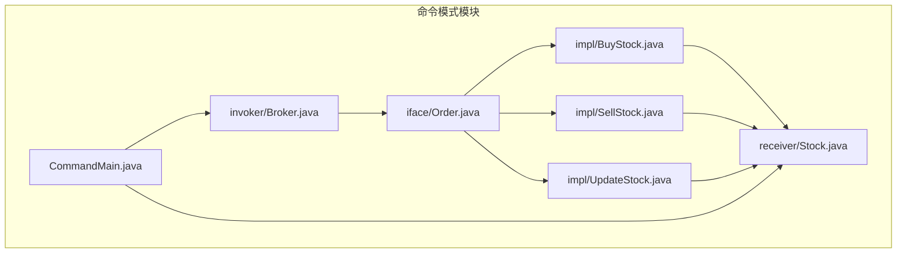
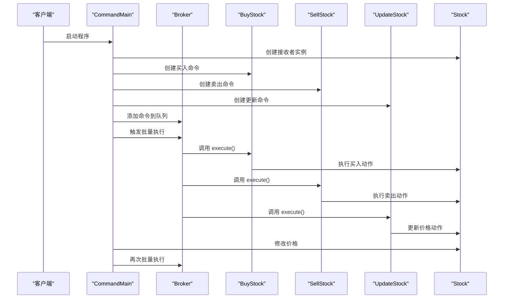
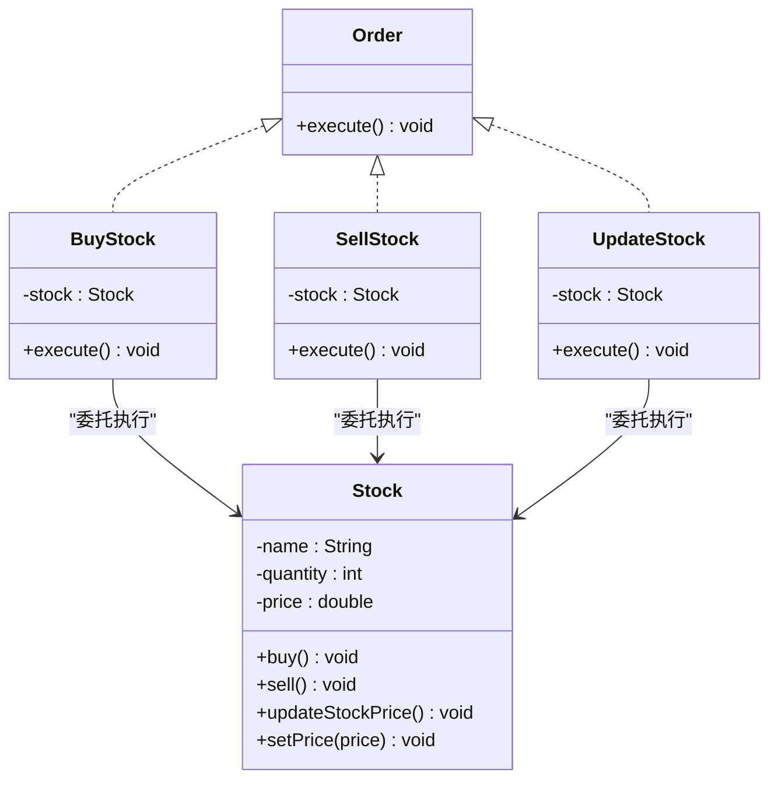
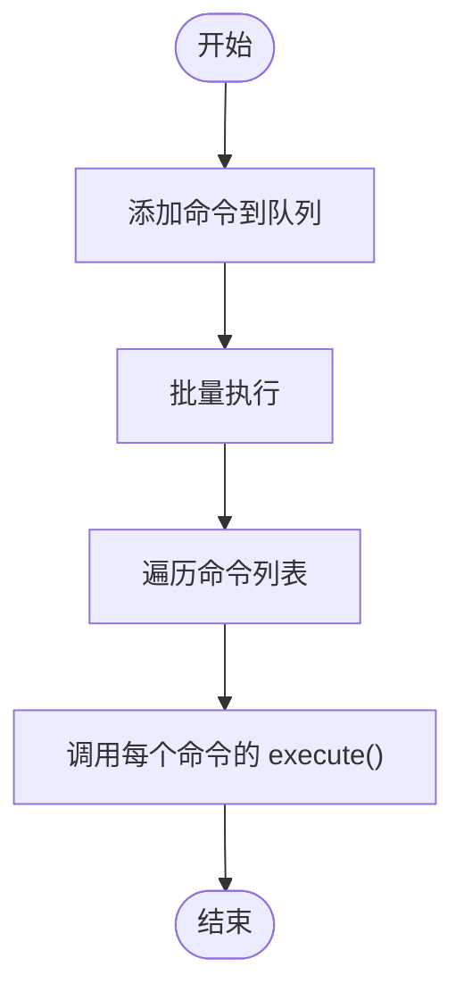
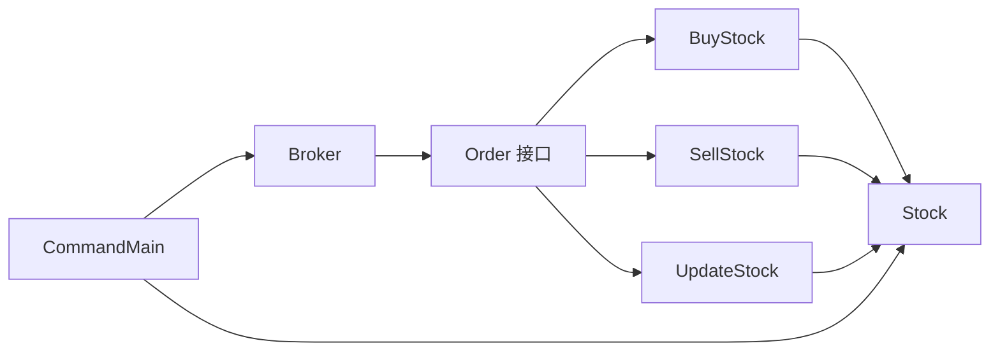
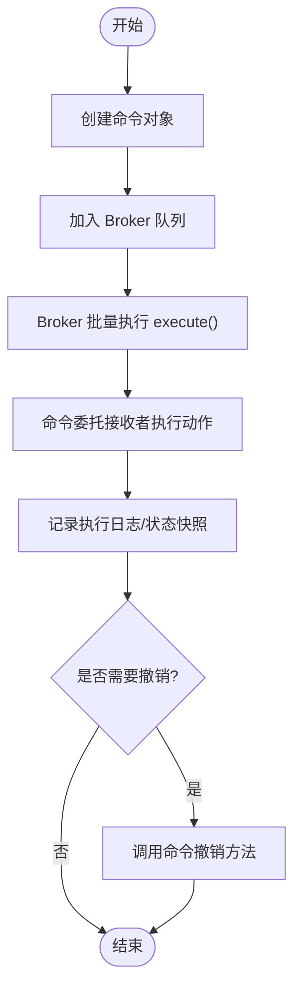

# 命令模式

<cite>
**本文引用的文件**
- [Order.java](file://behavioral/command/src/main/java/com/future/rocket/gof23/command/iface/Order.java)
- [BuyStock.java](file://behavioral/command/src/main/java/com/future/rocket/gof23/command/impl/BuyStock.java)
- [SellStock.java](file://behavioral/command/src/main/java/com/future/rocket/gof23/command/impl/SellStock.java)
- [UpdateStock.java](file://behavioral/command/src/main/java/com/future/rocket/gof23/command/impl/UpdateStock.java)
- [Broker.java](file://behavioral/command/src/main/java/com/future/rocket/gof23/command/invoker/Broker.java)
- [Stock.java](file://behavioral/command/src/main/java/com/future/rocket/gof23/command/receiver/Stock.java)
- [CommandMain.java](file://behavioral/command/src/main/java/com/future/rocket/gof23/command/CommandMain.java)
- [readme.md](file://behavioral/command/readme.md)
</cite>

## 目录
1. [引言](#引言)
2. [项目结构](#项目结构)
3. [核心组件](#核心组件)
4. [架构总览](#架构总览)
5. [详细组件分析](#详细组件分析)
6. [依赖关系分析](#依赖关系分析)
7. [性能考量](#性能考量)
8. [故障排查指南](#故障排查指南)
9. [结论](#结论)
10. [附录](#附录)

## 引言
本文件围绕命令模式在股票交易系统中的实现展开，系统性阐述“将请求封装为对象”的设计思想与实践方法。命令模式通过将请求封装为命令对象，使得：
- 不同的请求可被参数化；
- 请求可被排队、记录日志；
- 支持可撤销的操作；
- 在异步处理、事务管理和批处理场景中具备良好扩展性。

本仓库提供了清晰的代码示例：订单接口、具体命令（买入、卖出、更新）、调用者（经纪人）与接收者（股票），并演示了完整的命令执行与价格更新流程。

## 项目结构
命令模式模块位于 behavioral/command 目录下，采用按职责分层的组织方式：
- iface：命令接口 Order
- impl：具体命令 BuyStock、SellStock、UpdateStock
- invoker：调用者 Broker（负责接收命令并触发执行）
- receiver：接收者 Stock（持有状态并执行业务动作）
- CommandMain：示例入口，展示如何组装命令并批量执行

图表来源
- [Order.java:1-6](file://behavioral/command/src/main/java/com/future/rocket/gof23/command/iface/Order.java#L1-L6)
- [BuyStock.java:1-18](file://behavioral/command/src/main/java/com/future/rocket/gof23/command/impl/BuyStock.java#L1-L18)
- [SellStock.java:1-18](file://behavioral/command/src/main/java/com/future/rocket/gof23/command/impl/SellStock.java#L1-L18)
- [UpdateStock.java:1-18](file://behavioral/command/src/main/java/com/future/rocket/gof23/command/impl/UpdateStock.java#L1-L18)
- [Broker.java:1-19](file://behavioral/command/src/main/java/com/future/rocket/gof23/command/invoker/Broker.java#L1-L19)
- [Stock.java:1-30](file://behavioral/command/src/main/java/com/future/rocket/gof23/command/receiver/Stock.java#L1-L30)
- [CommandMain.java:1-32](file://behavioral/command/src/main/java/com/future/rocket/gof23/command/CommandMain.java#L1-L32)

章节来源
- [readme.md:1-11](file://behavioral/command/readme.md#L1-L11)

## 核心组件
- 订单接口 Order：定义统一的执行入口 execute()，作为所有命令的抽象契约。
- 具体命令：
  - BuyStock：封装买入动作，委托接收者执行。
  - SellStock：封装卖出动作，委托接收者执行。
  - UpdateStock：封装更新价格的动作，委托接收者执行。
- 调用者 Broker：维护命令列表，负责批量触发执行。
- 接收者 Stock：持有股票名称、数量与价格等状态，实现具体的业务动作。
- 示例入口 CommandMain：创建接收者与命令，交由调用者批量执行，并演示状态变更后再次执行的效果。

章节来源
- [Order.java:1-6](file://behavioral/command/src/main/java/com/future/rocket/gof23/command/iface/Order.java#L1-L6)
- [BuyStock.java:1-18](file://behavioral/command/src/main/java/com/future/rocket/gof23/command/impl/BuyStock.java#L1-L18)
- [SellStock.java:1-18](file://behavioral/command/src/main/java/com/future/rocket/gof23/command/impl/SellStock.java#L1-L18)
- [UpdateStock.java:1-18](file://behavioral/command/src/main/java/com/future/rocket/gof23/command/impl/UpdateStock.java#L1-L18)
- [Broker.java:1-19](file://behavioral/command/src/main/java/com/future/rocket/gof23/command/invoker/Broker.java#L1-L19)
- [Stock.java:1-30](file://behavioral/command/src/main/java/com/future/rocket/gof23/command/receiver/Stock.java#L1-L30)
- [CommandMain.java:1-32](file://behavioral/command/src/main/java/com/future/rocket/gof23/command/CommandMain.java#L1-L32)

## 架构总览
命令模式在本系统中的交互流程如下：
- 客户端（示例入口）创建接收者 Stock，并基于 Stock 创建多个具体命令（买入、卖出、更新）。
- 将这些命令加入调用者 Broker 的命令队列。
- Broker 批量触发命令的 execute()，由具体命令转发到 Stock 执行对应业务。
- 当 Stock 状态（如价格）发生变化时，再次触发 Broker 批量执行，体现“请求可重放”的特性。

图表来源
- [CommandMain.java:16-29](file://behavioral/command/src/main/java/com/future/rocket/gof23/command/CommandMain.java#L16-L29)
- [Broker.java:15-17](file://behavioral/command/src/main/java/com/future/rocket/gof23/command/invoker/Broker.java#L15-L17)
- [BuyStock.java:14-16](file://behavioral/command/src/main/java/com/future/rocket/gof23/command/impl/BuyStock.java#L14-L16)
- [SellStock.java:14-16](file://behavioral/command/src/main/java/com/future/rocket/gof23/command/impl/SellStock.java#L14-L16)
- [UpdateStock.java:14-16](file://behavioral/command/src/main/java/com/future/rocket/gof23/command/impl/UpdateStock.java#L14-L16)
- [Stock.java:14-24](file://behavioral/command/src/main/java/com/future/rocket/gof23/command/receiver/Stock.java#L14-L24)

## 详细组件分析

### 订单接口 Order
- 职责：定义命令的统一执行入口 execute()。
- 设计要点：通过接口隔离“请求”与“执行”，便于扩展新的命令类型而不影响调用方。

章节来源
- [Order.java:1-6](file://behavioral/command/src/main/java/com/future/rocket/gof23/command/iface/Order.java#L1-L6)

### 具体命令类
- BuyStock：封装买入动作，内部持有 Stock 引用，在 execute() 中调用 Stock.buy()。
- SellStock：封装卖出动作，内部持有 Stock 引用，在 execute() 中调用 Stock.sell()。
- UpdateStock：封装更新价格动作，内部持有 Stock 引用，在 execute() 中调用 Stock.updateStockPrice()。

图表来源
- [Order.java:1-6](file://behavioral/command/src/main/java/com/future/rocket/gof23/command/iface/Order.java#L1-L6)
- [BuyStock.java:6-16](file://behavioral/command/src/main/java/com/future/rocket/gof23/command/impl/BuyStock.java#L6-L16)
- [SellStock.java:6-16](file://behavioral/command/src/main/java/com/future/rocket/gof23/command/impl/SellStock.java#L6-L16)
- [UpdateStock.java:6-16](file://behavioral/command/src/main/java/com/future/rocket/gof23/command/impl/UpdateStock.java#L6-L16)
- [Stock.java:3-29](file://behavioral/command/src/main/java/com/future/rocket/gof23/command/receiver/Stock.java#L3-L29)

章节来源
- [BuyStock.java:1-18](file://behavioral/command/src/main/java/com/future/rocket/gof23/command/impl/BuyStock.java#L1-L18)
- [SellStock.java:1-18](file://behavioral/command/src/main/java/com/future/rocket/gof23/command/impl/SellStock.java#L1-L18)
- [UpdateStock.java:1-18](file://behavioral/command/src/main/java/com/future/rocket/gof23/command/impl/UpdateStock.java#L1-L18)

### 调用者 Broker
- 职责：维护命令列表，提供添加命令与批量执行的方法。
- 执行策略：遍历命令列表，逐个调用 execute()，实现“请求排队”和“批量处理”。

图表来源
- [Broker.java:9-17](file://behavioral/command/src/main/java/com/future/rocket/gof23/command/invoker/Broker.java#L9-L17)

章节来源
- [Broker.java:1-19](file://behavioral/command/src/main/java/com/future/rocket/gof23/command/invoker/Broker.java#L1-L19)

### 接收者 Stock
- 职责：持有股票状态（名称、数量、价格），并实现具体的业务动作（买入、卖出、更新价格）。
- 状态管理：通过 setPrice() 可动态修改价格，配合 Broker 的批量执行，体现“请求可重放、状态可变”的特性。

章节来源
- [Stock.java:1-30](file://behavioral/command/src/main/java/com/future/rocket/gof23/command/receiver/Stock.java#L1-L30)

### 示例入口 CommandMain
- 职责：演示命令模式的使用流程，包括创建接收者、创建命令、添加到 Broker 并执行，以及状态变更后的再次执行。

章节来源
- [CommandMain.java:1-32](file://behavioral/command/src/main/java/com/future/rocket/gof23/command/CommandMain.java#L1-L32)

## 依赖关系分析
- Order 是所有命令的抽象基座，BuyStock、SellStock、UpdateStock 都实现该接口。
- 具体命令依赖接收者 Stock，通过持有 Stock 引用来完成业务动作。
- Broker 依赖 Order 接口，不关心具体命令类型，从而实现“解耦调用方与命令实现”。
- CommandMain 作为示例入口，协调 Broker 与 Stock 的交互。

图表来源
- [Order.java:1-6](file://behavioral/command/src/main/java/com/future/rocket/gof23/command/iface/Order.java#L1-L6)
- [BuyStock.java:3-4](file://behavioral/command/src/main/java/com/future/rocket/gof23/command/impl/BuyStock.java#L3-L4)
- [SellStock.java:3-4](file://behavioral/command/src/main/java/com/future/rocket/gof23/command/impl/SellStock.java#L3-L4)
- [UpdateStock.java:3-4](file://behavioral/command/src/main/java/com/future/rocket/gof23/command/impl/UpdateStock.java#L3-L4)
- [Broker.java](file://behavioral/command/src/main/java/com/future/rocket/gof23/command/invoker/Broker.java#L3)
- [CommandMain.java:3-7](file://behavioral/command/src/main/java/com/future/rocket/gof23/command/CommandMain.java#L3-L7)

章节来源
- [Broker.java:1-19](file://behavioral/command/src/main/java/com/future/rocket/gof23/command/invoker/Broker.java#L1-L19)
- [CommandMain.java:1-32](file://behavioral/command/src/main/java/com/future/rocket/gof23/command/CommandMain.java#L1-L32)

## 性能考量
- 时间复杂度
  - 批量执行：O(n)，n 为命令数量；Broker 遍历命令列表并逐一调用 execute()。
  - 单次执行：O(1)，具体命令仅转发到接收者执行对应动作。
- 空间复杂度
  - 命令队列存储：O(n)，Broker 维护命令列表。
- 可扩展性
  - 新增命令：实现 Order 接口并注入接收者，无需修改 Broker 或现有命令。
- 异步与并发
  - 当前实现为同步顺序执行；若需异步处理，可在 Broker 中引入线程池或消息队列，将命令入队而非立即执行。
- 事务与回滚
  - 当前未实现撤销机制；若需支持撤销，建议在命令中引入“撤销操作”方法，并在 Broker 中维护撤销栈，以便回滚已执行命令。

[本节为通用性能讨论，不直接分析特定文件]

## 故障排查指南
- 常见问题
  - 命令未执行：检查 Broker 是否正确添加命令并调用批量执行方法。
  - 动作无输出：确认接收者 Stock 的状态是否正确初始化，以及命令是否正确转发到 Stock。
  - 价格未更新：确认是否调用了 Stock 的价格设置方法，并再次触发 Broker 的批量执行。
- 调试建议
  - 在命令的 execute() 中增加日志或断点，验证执行路径。
  - 在 Broker 的批量执行处增加日志，确认命令列表非空且顺序正确。
  - 在 Stock 的业务方法中增加日志，确认状态变化是否生效。

章节来源
- [Broker.java:15-17](file://behavioral/command/src/main/java/com/future/rocket/gof23/command/invoker/Broker.java#L15-L17)
- [Stock.java:22-28](file://behavioral/command/src/main/java/com/future/rocket/gof23/command/receiver/Stock.java#L22-L28)
- [CommandMain.java:27-28](file://behavioral/command/src/main/java/com/future/rocket/gof23/command/CommandMain.java#L27-L28)

## 结论
本实现完整体现了命令模式的核心思想：将请求封装为对象，通过调用者统一调度，接收者专注执行业务。该模式在以下方面表现突出：
- 参数化请求：通过命令对象可灵活组合与传递；
- 请求排队与日志：Broker 可缓存命令并在合适时机执行；
- 可撤销能力：当前实现未包含撤销机制，但可通过引入撤销方法与撤销栈实现；
- 异步处理与批处理：可扩展为异步执行与事务管理；
- 易于扩展：新增命令无需改动现有代码，符合开闭原则。

[本节为总结性内容，不直接分析特定文件]

## 附录

### 命令执行流程图（含撤销机制建议）
以下为命令执行与撤销的流程示意，便于理解撤销操作的实现思路：

[本图为概念性流程图，不直接映射到具体源码文件]

### 撤销操作的实现机制（建议方案）
- 在命令中增加撤销方法（如 undo()），用于恢复到执行前的状态。
- Broker 维护一个撤销栈，每次成功执行命令后将其压入栈中。
- 当需要撤销时，从栈顶弹出命令并调用其撤销方法，必要时更新日志或状态。
- 注意：撤销方法应与执行方法成对出现，确保状态一致性。

[本节为扩展性建议，不直接分析特定文件]

### 扩展新命令类型的指导
- 步骤
  - 实现 Order 接口，定义 execute() 与必要的撤销方法（如需撤销）。
  - 注入接收者依赖，将业务逻辑委托给接收者。
  - 在示例入口中创建命令并添加到 Broker，即可参与批量执行。
- 最佳实践
  - 命令对象尽量保持无状态或仅持有必要上下文；
  - 将业务逻辑集中在接收者中，命令仅负责编排与转发；
  - 对可能失败的操作，结合日志与异常处理，便于追踪与恢复。

[本节为通用指导，不直接分析特定文件]