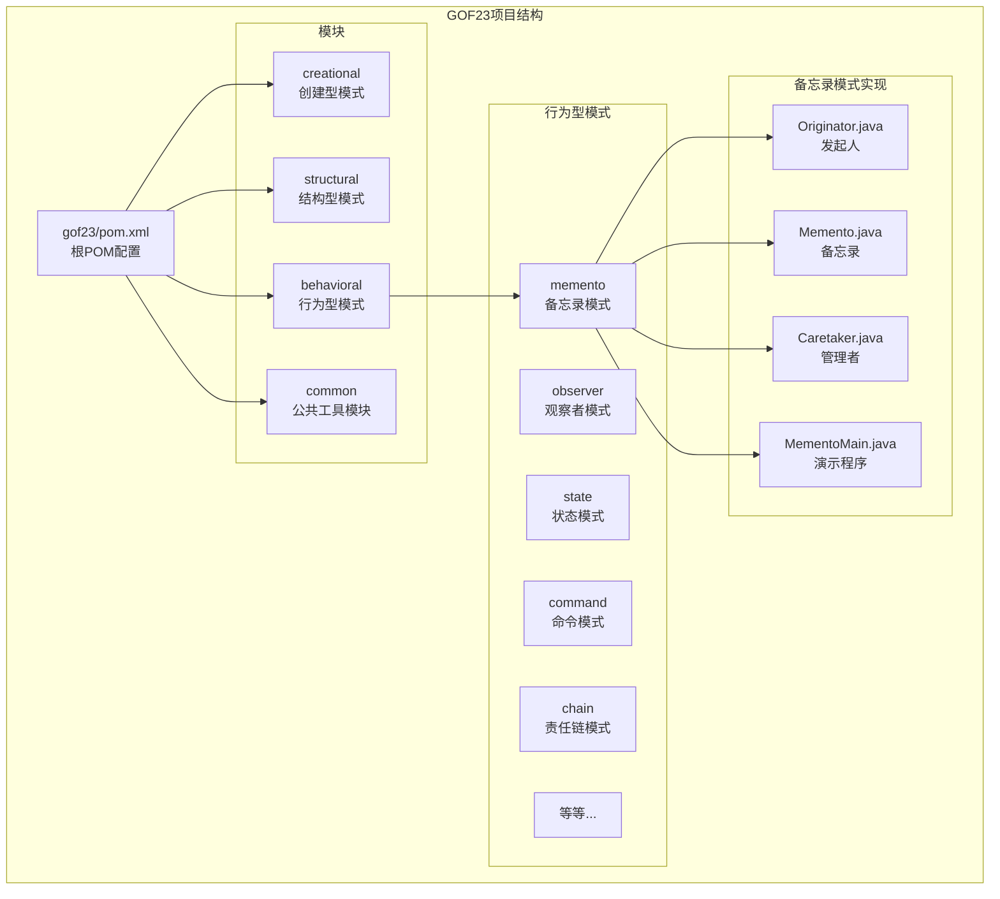
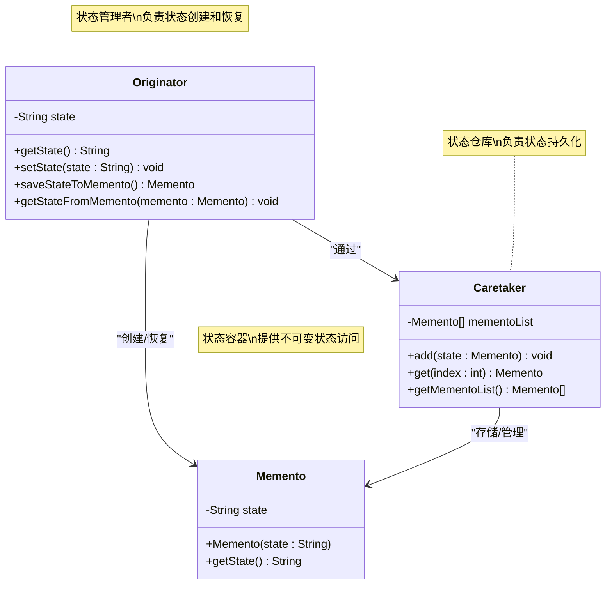
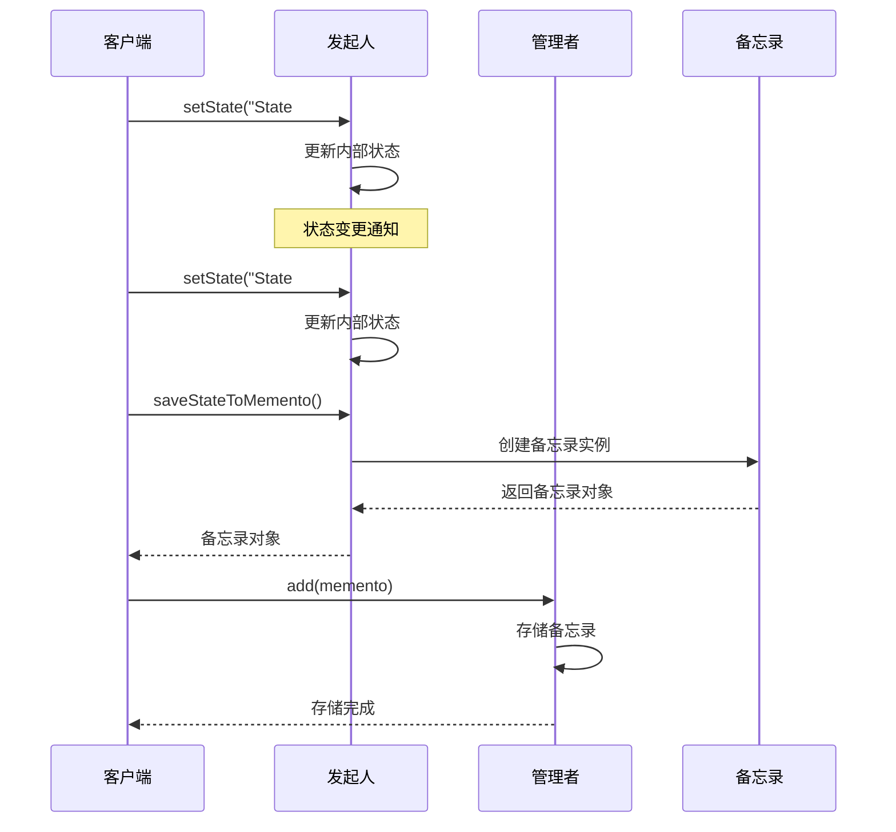
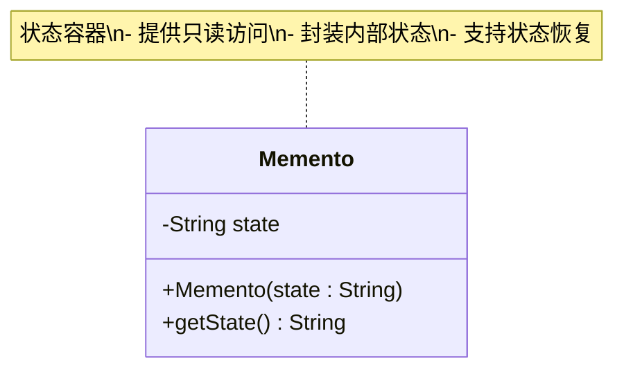
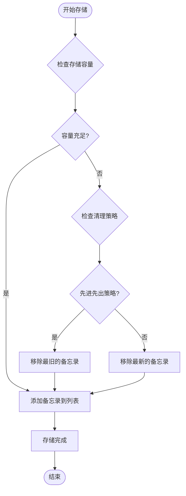
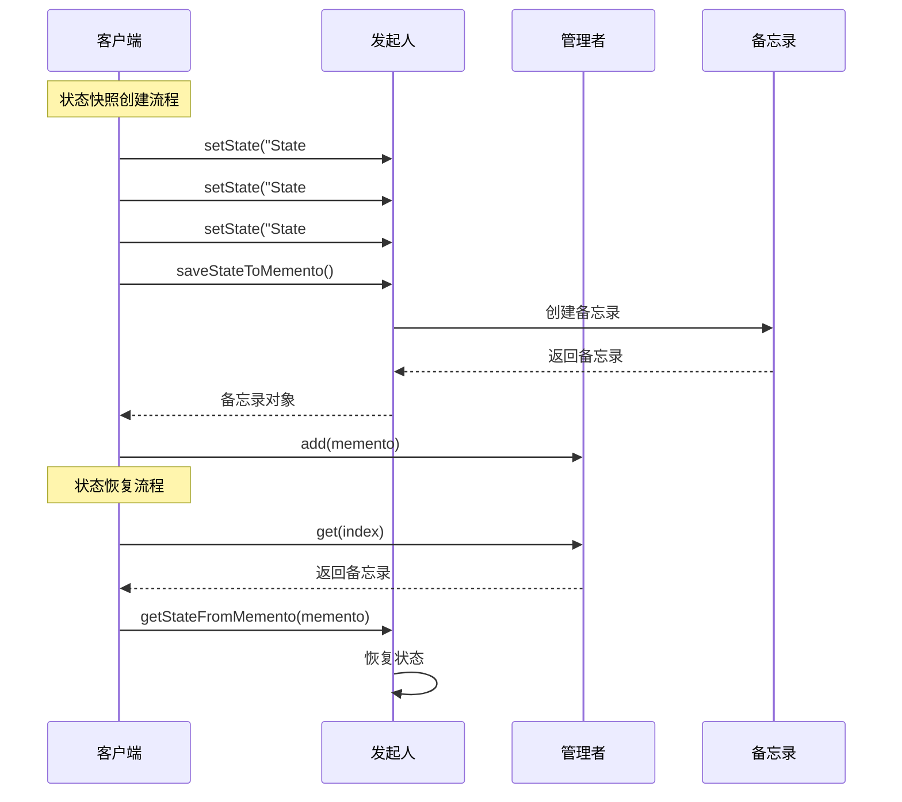
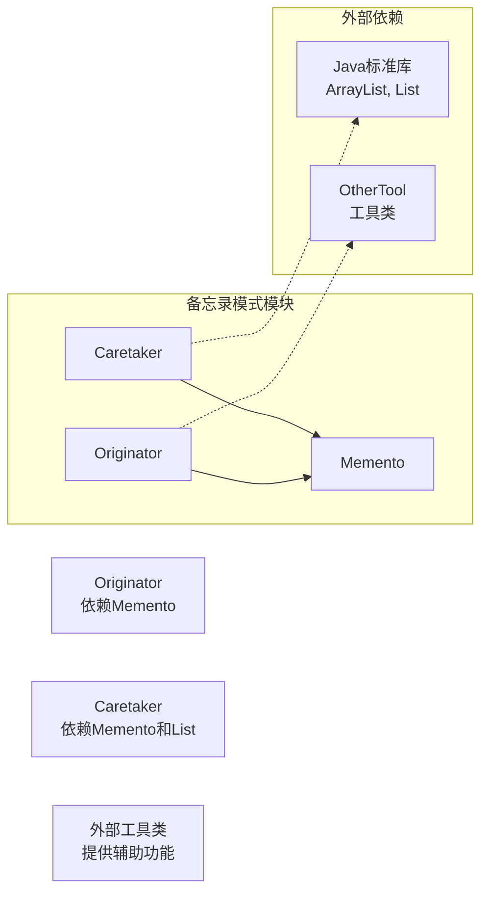
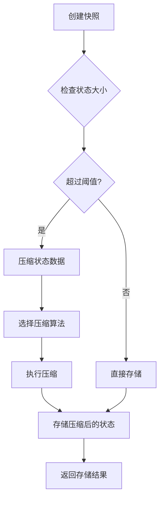

# 备忘录模式

<cite>
**本文档引用的文件**
- [Originator.java](file://behavioral/memento/src/main/java/com/future/rocket/gof23/memento/Originator.java)
- [Memento.java](file://behavioral/memento/src/main/java/com/future/rocket/gof23/memento/Memento.java)
- [Caretaker.java](file://behavioral/memento/src/main/java/com/future/rocket/gof23/memento/Caretaker.java)
- [MementoMain.java](file://behavioral/memento/src/main/java/com/future/rocket/gof23/memento/MementoMain.java)
- [readme.md](file://behavioral/memento/readme.md)
- [OtherTool.java](file://common/src/main/java/com/future/rocket/gof23/common/OtherTool.java)
- [pom.xml](file://behavioral/memento/pom.xml)
- [behavioral/pom.xml](file://behavioral/pom.xml)
- [gof23/pom.xml](file://pom.xml)
</cite>

## 目录
1. [引言](#引言)
2. [项目结构](#项目结构)
3. [核心组件](#核心组件)
4. [架构概览](#架构概览)
5. [详细组件分析](#详细组件分析)
6. [依赖关系分析](#依赖关系分析)
7. [性能考虑](#性能考虑)
8. [故障排除指南](#故障排除指南)
9. [结论](#结论)
10. [附录](#附录)

## 引言

备忘录模式（Memento Pattern）是一种行为型设计模式，它允许在不破坏封装性的前提下，捕获一个对象的内部状态，并在该对象之外保存这个状态，以便以后可以将该对象恢复到原先保存的状态。这种模式在需要实现撤销操作、游戏存档、事务回滚等场景中具有重要价值。

在本项目中，备忘录模式通过三个核心角色协作实现：
- **发起人（Originator）**：负责创建备忘录以记录其当前状态，使用备忘录来恢复之前的状态
- **备忘录（Memento）**：存储对象的内部状态，提供恢复功能
- **管理者（Caretaker）**：负责保存备忘录对象，不修改或操作备忘录的内容

## 项目结构

该项目采用模块化的Maven项目结构，备忘录模式位于行为型设计模式模块中：

**图表来源**
- [gof23/pom.xml:1-24](file://pom.xml#L1-L24)
- [behavioral/pom.xml:1-48](file://behavioral/pom.xml#L1-L48)
- [pom.xml:11-16](file://pom.xml#L11-L16)

**章节来源**
- [pom.xml:1-24](file://pom.xml#L1-L24)
- [behavioral/pom.xml:15-32](file://behavioral/pom.xml#L15-L32)

## 核心组件

备忘录模式由三个核心组件构成，每个组件都有明确的职责分工：

### 发起人（Originator）组件

发起人是状态的管理者，负责创建备忘录以记录其当前状态，也负责使用备忘录来恢复之前的状态。在本实现中，发起人维护着内部状态并通过方法与备忘录进行交互。

### 备忘录（Memento）组件

备忘录存储对象的内部状态并提供恢复功能。它通常是一个封装类，不允许外界直接修改其内容，确保了封装性。

### 管理者（Caretaker）组件

管理者负责保存备忘录对象，但不会修改或操作备忘录的内容。它提供存储机制，如栈或列表，用于存放多个备忘录。

**章节来源**
- [Originator.java:3-23](file://behavioral/memento/src/main/java/com/future/rocket/gof23/memento/Originator.java#L3-L23)
- [Memento.java:3-13](file://behavioral/memento/src/main/java/com/future/rocket/gof23/memento/Memento.java#L3-L13)
- [Caretaker.java:6-19](file://behavioral/memento/src/main/java/com/future/rocket/gof23/memento/Caretaker.java#L6-L19)

## 架构概览

备忘录模式的架构遵循单一职责原则，每个组件都有明确的职责边界：

**图表来源**
- [Originator.java:3-23](file://behavioral/memento/src/main/java/com/future/rocket/gof23/memento/Originator.java#L3-L23)
- [Memento.java:3-13](file://behavioral/memento/src/main/java/com/future/rocket/gof23/memento/Memento.java#L3-L13)
- [Caretaker.java:6-19](file://behavioral/memento/src/main/java/com/future/rocket/gof23/memento/Caretaker.java#L6-L19)

## 详细组件分析

### 发起人（Originator）组件深度分析

发起人是备忘录模式的核心协调者，负责管理对象的状态生命周期：

**图表来源**
- [MementoMain.java:10-24](file://behavioral/memento/src/main/java/com/future/rocket/gof23/memento/MementoMain.java#L10-L24)
- [Originator.java:14-22](file://behavioral/memento/src/main/java/com/future/rocket/gof23/memento/Originator.java#L14-L22)

发起人的关键方法包括：
- **状态设置方法**：负责更新内部状态并提供状态变更通知
- **状态保存方法**：创建备忘录实例以捕获当前状态
- **状态恢复方法**：从备忘录中恢复之前的状态

**章节来源**
- [Originator.java:6-22](file://behavioral/memento/src/main/java/com/future/rocket/gof23/memento/Originator.java#L6-L22)

### 备忘录（Memento）组件深度分析

备忘录作为状态容器，提供了不可变的状态访问接口：

**图表来源**
- [Memento.java:3-13](file://behavioral/memento/src/main/java/com/future/rocket/gof23/memento/Memento.java#L3-L13)

备忘录的设计特点：
- **封装性**：内部状态通过构造函数初始化，外部无法直接修改
- **不可变性**：提供只读的访问接口，防止状态被意外修改
- **轻量级**：仅存储必要的状态信息，避免额外的元数据

**章节来源**
- [Memento.java:4-12](file://behavioral/memento/src/main/java/com/future/rocket/gof23/memento/Memento.java#L4-L12)

### 管理者（Caretaker）组件深度分析

管理者负责备忘录的生命周期管理，提供灵活的存储策略：

**图表来源**
- [Caretaker.java:7-10](file://behavioral/memento/src/main/java/com/future/rocket/gof23/memento/Caretaker.java#L7-L10)

管理者的职责包括：
- **存储管理**：维护备忘录列表，支持添加和获取操作
- **生命周期管理**：负责备忘录对象的创建和销毁
- **内存管理**：通过适当的清理策略控制内存使用

**章节来源**
- [Caretaker.java:8-18](file://behavioral/memento/src/main/java/com/future/rocket/gof23/memento/Caretaker.java#L8-L18)

### 状态快照创建和恢复流程

备忘录模式的核心流程包括状态快照的创建和恢复过程：

**图表来源**
- [MementoMain.java:12-29](file://behavioral/memento/src/main/java/com/future/rocket/gof23/memento/MementoMain.java#L12-L29)

**章节来源**
- [MementoMain.java:10-30](file://behavioral/memento/src/main/java/com/future/rocket/gof23/memento/MementoMain.java#L10-L30)

## 依赖关系分析

备忘录模式的依赖关系相对简单，遵循低耦合高内聚的设计原则：

**图表来源**
- [Caretaker.java:3-4](file://behavioral/memento/src/main/java/com/future/rocket/gof23/memento/Caretaker.java#L3-L4)
- [MementoMain.java:3](file://behavioral/memento/src/main/java/com/future/rocket/gof23/memento/MementoMain.java#L3)

**章节来源**
- [Caretaker.java:3-4](file://behavioral/memento/src/main/java/com/future/rocket/gof23/memento/Caretaker.java#L3-L4)
- [MementoMain.java:3](file://behavioral/memento/src/main/java/com/future/rocket/gof23/memento/MementoMain.java#L3)

## 性能考虑

在实现备忘录模式时，需要考虑以下性能因素：

### 内存管理策略

1. **快照数量控制**：通过限制备忘录列表的大小来控制内存使用
2. **垃圾回收策略**：及时释放不再使用的备忘录对象
3. **延迟加载**：对于大型对象，考虑使用延迟加载机制

### 快照大小控制

**图表来源**
- [Caretaker.java:7-10](file://behavioral/memento/src/main/java/com/future/rocket/gof23/memento/Caretaker.java#L7-L10)

### 性能优化技巧

1. **增量快照**：只保存状态的变化部分，而非完整状态
2. **异步存储**：将快照存储操作异步化，避免阻塞主线程
3. **缓存策略**：对频繁访问的快照进行缓存
4. **序列化优化**：选择合适的序列化方式以平衡性能和空间

## 故障排除指南

### 常见问题及解决方案

#### 状态不一致问题
**问题描述**：恢复状态后发现对象状态不正确
**解决方案**：
- 确保备忘录的不可变性
- 验证状态恢复的完整性
- 检查并发访问的安全性

#### 内存泄漏问题
**问题描述**：长时间运行后内存使用持续增长
**解决方案**：
- 实现适当的清理策略
- 监控备忘录对象的生命周期
- 使用弱引用避免循环引用

#### 性能问题
**问题描述**：快照创建和恢复操作耗时过长
**解决方案**：
- 优化状态序列化过程
- 实现增量快照机制
- 考虑使用更高效的数据结构

**章节来源**
- [Caretaker.java:7-18](file://behavioral/memento/src/main/java/com/future/rocket/gof23/memento/Caretaker.java#L7-L18)

## 结论

备忘录模式作为一种重要的行为型设计模式，在需要状态管理和恢复的场景中发挥着关键作用。通过发起人、备忘录和管理者的明确分工，该模式实现了状态的封装性和可恢复性。

### 主要优势
- **封装性**：保持对象的内部状态不被外部直接访问
- **灵活性**：支持多种状态恢复策略
- **可扩展性**：易于扩展到复杂的状态管理系统

### 适用场景
- **撤销操作**：文本编辑器、图形软件的撤销功能
- **游戏存档**：游戏进度保存和恢复
- **事务回滚**：数据库事务的回滚机制
- **配置管理**：应用程序配置的版本控制

### 最佳实践建议
1. **合理设计状态范围**：只保存必要的状态信息
2. **实现适当的清理策略**：避免内存泄漏
3. **考虑并发安全性**：在多线程环境中确保状态一致性
4. **优化性能表现**：平衡内存使用和操作效率

## 附录

### 深拷贝与浅拷贝的选择原则

在实现备忘录模式时，需要根据具体需求选择合适的数据复制策略：

#### 浅拷贝适用场景
- **基本数据类型**：字符串、数字等不可变对象
- **简单对象结构**：不需要深层复制的对象
- **性能敏感场景**：对性能要求较高的应用

#### 深拷贝适用场景
- **复杂对象结构**：包含嵌套对象和集合的对象
- **可变对象引用**：对象内部包含可变引用类型
- **安全敏感场景**：需要完全隔离状态副本的场景

### 不同经验水平的开发者指导

#### 初学者指导
1. **理解基本概念**：掌握备忘录模式的核心思想
2. **从简单示例开始**：使用简单的状态对象进行练习
3. **关注封装性**：确保状态的正确封装
4. **实践调试技巧**：学会调试状态恢复过程

#### 中级开发者指导
1. **实现内存管理**：学习如何控制快照数量和大小
2. **优化性能表现**：掌握序列化和反序列化的优化技巧
3. **处理并发问题**：了解多线程环境下的状态管理
4. **扩展应用场景**：将模式应用到实际项目中

#### 高级开发者指导
1. **设计模式组合**：与其他设计模式结合使用
2. **系统架构考虑**：从整体架构角度设计状态管理系统
3. **性能调优**：深入研究内存和CPU性能优化
4. **可靠性设计**：实现容错和故障恢复机制

**章节来源**
- [readme.md:3-22](file://behavioral/memento/readme.md#L3-L22)