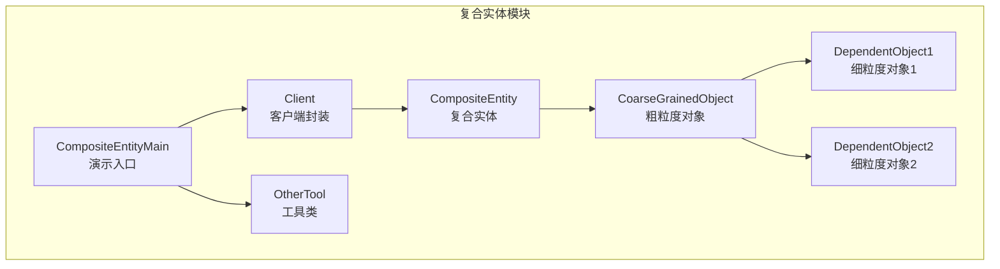
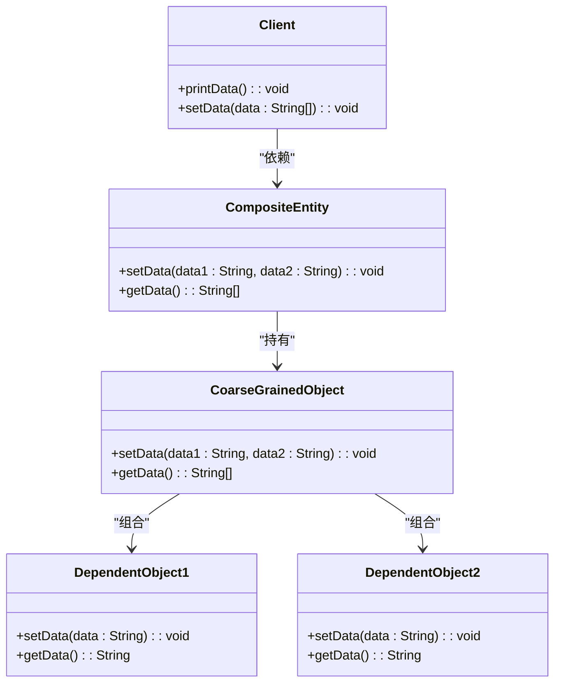
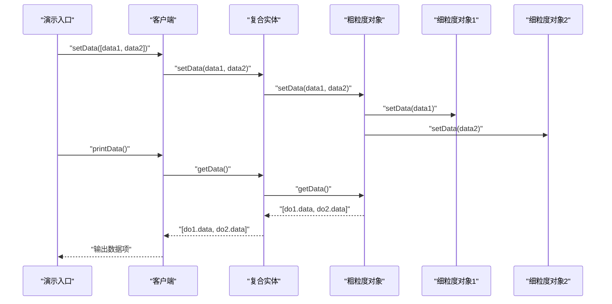
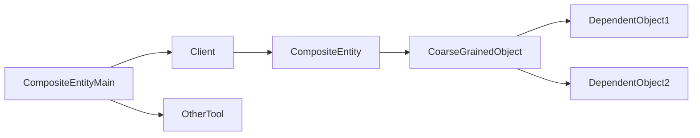

# 复合实体模式

<cite>
**本文引用的文件**
- [CompositeEntity.java](file://behavioral/compositeEntity/src/main/java/com/future/rocket/gof23/composite/entity/composite/CompositeEntity.java)
- [CoarseGrainedObject.java](file://behavioral/compositeEntity/src/main/java/com/future/rocket/gof23/composite/entity/dependency/CoarseGrainedObject.java)
- [DependentObject1.java](file://behavioral/compositeEntity/src/main/java/com/future/rocket/gof23/composite/entity/dependency/DependentObject1.java)
- [DependentObject2.java](file://behavioral/compositeEntity/src/main/java/com/future/rocket/gof23/composite/entity/dependency/DependentObject2.java)
- [Client.java](file://behavioral/compositeEntity/src/main/java/com/future/rocket/gof23/composite/entity/client/Client.java)
- [CompositeEntityMain.java](file://behavioral/compositeEntity/src/main/java/com/future/rocket/gof23/composite/entity/CompositeEntityMain.java)
- [OtherTool.java](file://common/src/main/java/com/future/rocket/gof23/common/OtherTool.java)
- [readme.md](file://behavioral/compositeEntity/readme.md)
</cite>

## 目录
1. [引言](#引言)
2. [项目结构](#项目结构)
3. [核心组件](#核心组件)
4. [架构总览](#架构总览)
5. [详细组件分析](#详细组件分析)
6. [依赖关系分析](#依赖关系分析)
7. [性能考量](#性能考量)
8. [故障排查指南](#故障排查指南)
9. [结论](#结论)
10. [附录](#附录)

## 引言
复合实体模式是一种用于持久化机制的设计模式，主要在企业级应用（如 EJB）中使用。该模式通过一个“主实体”（复合实体）统一管理一组“从属实体”（依赖对象），从而简化客户端与复杂实体关系的交互，减少数据库访问次数，提升整体性能。本仓库提供了该模式的最小可运行实现，展示了复合实体、粗粒度对象与细粒度对象之间的层次关系与协作方式。

## 项目结构
复合实体模式的实现位于行为型模式目录下，采用按功能分层的组织方式：
- composite 包：复合实体类，作为对外暴露的统一接口
- dependency 包：粗粒度对象与两个细粒度对象，负责具体的数据存储与同步
- client 包：客户端封装，屏蔽内部细节，提供易用的 API
- CompositeEntityMain：演示程序，展示从创建到使用的完整流程

图表来源
- [CompositeEntity.java:1-19](file://behavioral/compositeEntity/src/main/java/com/future/rocket/gof23/composite/entity/composite/CompositeEntity.java#L1-L19)
- [CoarseGrainedObject.java:1-17](file://behavioral/compositeEntity/src/main/java/com/future/rocket/gof23/composite/entity/dependency/CoarseGrainedObject.java#L1-L17)
- [DependentObject1.java:1-14](file://behavioral/compositeEntity/src/main/java/com/future/rocket/gof23/composite/entity/dependency/DependentObject1.java#L1-L14)
- [DependentObject2.java:1-15](file://behavioral/compositeEntity/src/main/java/com/future/rocket/gof23/composite/entity/dependency/DependentObject2.java#L1-L15)
- [Client.java:1-25](file://behavioral/compositeEntity/src/main/java/com/future/rocket/gof23/composite/entity/client/Client.java#L1-L25)
- [CompositeEntityMain.java:1-22](file://behavioral/compositeEntity/src/main/java/com/future/rocket/gof23/composite/entity/CompositeEntityMain.java#L1-L22)
- [OtherTool.java:1-12](file://common/src/main/java/com/future/rocket/gof23/common/OtherTool.java#L1-L12)

章节来源
- [CompositeEntityMain.java:1-22](file://behavioral/compositeEntity/src/main/java/com/future/rocket/gof23/composite/entity/CompositeEntityMain.java#L1-L22)
- [readme.md:1-23](file://behavioral/compositeEntity/readme.md#L1-L23)

## 核心组件
- 复合实体（CompositeEntity）
  - 作为对外统一入口，持有粗粒度对象实例，向客户端暴露统一的读写接口
  - 将客户端请求委托给粗粒度对象，实现对内部依赖对象的透明管理
- 粗粒度对象（CoarseGrainedObject）
  - 组合两个细粒度对象，负责协调它们的状态同步
  - 提供统一的设置与获取方法，确保数据一致性
- 细粒度对象（DependentObject1/2）
  - 具体的数据承载者，各自维护独立状态
  - 不直接参与持久化，由复合实体统一代理
- 客户端（Client）
  - 面向业务的封装，隐藏内部结构，提供简洁的 API
  - 对外仅暴露字符串数组形式的数据交换，内部完成拆分与转发
- 演示入口（CompositeEntityMain）
  - 展示从创建到使用的完整流程，便于理解各组件协作

章节来源
- [CompositeEntity.java:1-19](file://behavioral/compositeEntity/src/main/java/com/future/rocket/gof23/composite/entity/composite/CompositeEntity.java#L1-L19)
- [CoarseGrainedObject.java:1-17](file://behavioral/compositeEntity/src/main/java/com/future/rocket/gof23/composite/entity/dependency/CoarseGrainedObject.java#L1-L17)
- [DependentObject1.java:1-14](file://behavioral/compositeEntity/src/main/java/com/future/rocket/gof23/composite/entity/dependency/DependentObject1.java#L1-L14)
- [DependentObject2.java:1-15](file://behavioral/compositeEntity/src/main/java/com/future/rocket/gof23/composite/entity/dependency/DependentObject2.java#L1-L15)
- [Client.java:1-25](file://behavioral/compositeEntity/src/main/java/com/future/rocket/gof23/composite/entity/client/Client.java#L1-L25)
- [CompositeEntityMain.java:1-22](file://behavioral/compositeEntity/src/main/java/com/future/rocket/gof23/composite/entity/CompositeEntityMain.java#L1-L22)

## 架构总览
复合实体模式的核心思想是“以主控实体统一管理从属实体”，通过粗粒度对象协调多个细粒度对象，使客户端只需与复合实体交互即可完成复杂的读写操作。这种设计减少了客户端对内部细节的感知，提升了系统的内聚性与可维护性。

图表来源
- [CompositeEntity.java:1-19](file://behavioral/compositeEntity/src/main/java/com/future/rocket/gof23/composite/entity/composite/CompositeEntity.java#L1-L19)
- [CoarseGrainedObject.java:1-17](file://behavioral/compositeEntity/src/main/java/com/future/rocket/gof23/composite/entity/dependency/CoarseGrainedObject.java#L1-L17)
- [DependentObject1.java:1-14](file://behavioral/compositeEntity/src/main/java/com/future/rocket/gof23/composite/entity/dependency/DependentObject1.java#L1-L14)
- [DependentObject2.java:1-15](file://behavioral/compositeEntity/src/main/java/com/future/rocket/gof23/composite/entity/dependency/DependentObject2.java#L1-L15)
- [Client.java:1-25](file://behavioral/compositeEntity/src/main/java/com/future/rocket/gof23/composite/entity/client/Client.java#L1-L25)

## 详细组件分析

### 复合实体（CompositeEntity）
- 角色定位：对外统一入口，屏蔽内部依赖对象细节
- 关键职责
  - 接收客户端的设置与读取请求
  - 委托给粗粒度对象执行实际操作
- 设计要点
  - 保持与客户端的低耦合，避免客户端感知内部结构
  - 通过粗粒度对象实现对多个细粒度对象的一致性控制

章节来源
- [CompositeEntity.java:1-19](file://behavioral/compositeEntity/src/main/java/com/future/rocket/gof23/composite/entity/composite/CompositeEntity.java#L1-L19)

### 粗粒度对象（CoarseGrainedObject）
- 角色定位：复合实体的内部协调者，组合多个细粒度对象
- 关键职责
  - 在设置阶段同时更新两个细粒度对象
  - 在读取阶段聚合返回两个细粒度对象的状态
- 数据一致性
  - 保证两个细粒度对象在一次操作中保持一致状态
  - 通过单一入口集中处理读写逻辑，降低并发风险

章节来源
- [CoarseGrainedObject.java:1-17](file://behavioral/compositeEntity/src/main/java/com/future/rocket/gof23/composite/entity/dependency/CoarseGrainedObject.java#L1-L17)

### 细粒度对象（DependentObject1/2）
- 角色定位：具体数据承载单元，各自维护独立状态
- 关键职责
  - 提供基本的读写能力
  - 不直接参与持久化，由复合实体统一代理
- 设计要点
  - 结构简单，职责单一，便于扩展与替换
  - 通过粗粒度对象实现跨对象的一致性

章节来源
- [DependentObject1.java:1-14](file://behavioral/compositeEntity/src/main/java/com/future/rocket/gof23/composite/entity/dependency/DependentObject1.java#L1-L14)
- [DependentObject2.java:1-15](file://behavioral/compositeEntity/src/main/java/com/future/rocket/gof23/composite/entity/dependency/DependentObject2.java#L1-L15)

### 客户端（Client）
- 角色定位：面向业务的封装，隐藏内部结构
- 关键职责
  - 对外提供字符串数组形式的数据交换
  - 内部完成拆分与转发，调用复合实体执行操作
- 错误处理
  - 对输入参数进行校验，确保数组长度符合预期
  - 抛出明确的异常信息，便于问题定位

章节来源
- [Client.java:1-25](file://behavioral/compositeEntity/src/main/java/com/future/rocket/gof23/composite/entity/client/Client.java#L1-L25)

### 演示入口（CompositeEntityMain）
- 角色定位：展示复合实体模式的使用流程
- 关键职责
  - 创建粗粒度对象与复合实体
  - 构造客户端并执行数据设置与打印
  - 展示多次操作后的状态变化

章节来源
- [CompositeEntityMain.java:1-22](file://behavioral/compositeEntity/src/main/java/com/future/rocket/gof23/composite/entity/CompositeEntityMain.java#L1-L22)

### 使用序列图

图表来源
- [CompositeEntityMain.java:1-22](file://behavioral/compositeEntity/src/main/java/com/future/rocket/gof23/composite/entity/CompositeEntityMain.java#L1-L22)
- [Client.java:1-25](file://behavioral/compositeEntity/src/main/java/com/future/rocket/gof23/composite/entity/client/Client.java#L1-L25)
- [CompositeEntity.java:1-19](file://behavioral/compositeEntity/src/main/java/com/future/rocket/gof23/composite/entity/composite/CompositeEntity.java#L1-L19)
- [CoarseGrainedObject.java:1-17](file://behavioral/compositeEntity/src/main/java/com/future/rocket/gof23/composite/entity/dependency/CoarseGrainedObject.java#L1-L17)
- [DependentObject1.java:1-14](file://behavioral/compositeEntity/src/main/java/com/future/rocket/gof23/composite/entity/dependency/DependentObject1.java#L1-L14)
- [DependentObject2.java:1-15](file://behavioral/compositeEntity/src/main/java/com/future/rocket/gof23/composite/entity/dependency/DependentObject2.java#L1-L15)

## 依赖关系分析
- 组件内聚与耦合
  - 复合实体与粗粒度对象之间为强内聚的组合关系
  - 粗粒度对象与两个细粒度对象之间为组合关系，体现“整体—部分”的层次结构
  - 客户端仅依赖复合实体，避免直接接触内部细节，降低耦合
- 外部依赖
  - 演示入口依赖工具类用于格式化输出
  - 客户端依赖复合实体，体现“高层模块不依赖底层模块”的依赖倒置原则

图表来源
- [Client.java:1-25](file://behavioral/compositeEntity/src/main/java/com/future/rocket/gof23/composite/entity/client/Client.java#L1-L25)
- [CompositeEntity.java:1-19](file://behavioral/compositeEntity/src/main/java/com/future/rocket/gof23/composite/entity/composite/CompositeEntity.java#L1-L19)
- [CoarseGrainedObject.java:1-17](file://behavioral/compositeEntity/src/main/java/com/future/rocket/gof23/composite/entity/dependency/CoarseGrainedObject.java#L1-L17)
- [DependentObject1.java:1-14](file://behavioral/compositeEntity/src/main/java/com/future/rocket/gof23/composite/entity/dependency/DependentObject1.java#L1-L14)
- [DependentObject2.java:1-15](file://behavioral/compositeEntity/src/main/java/com/future/rocket/gof23/composite/entity/dependency/DependentObject2.java#L1-L15)
- [CompositeEntityMain.java:1-22](file://behavioral/compositeEntity/src/main/java/com/future/rocket/gof23/composite/entity/CompositeEntityMain.java#L1-L22)
- [OtherTool.java:1-12](file://common/src/main/java/com/future/rocket/gof23/common/OtherTool.java#L1-L12)

## 性能考量
- 减少数据库访问次数
  - 通过复合实体统一管理多个从属对象，避免客户端频繁发起独立请求
  - 粗粒度对象在一次操作中协调多个细粒度对象，降低网络往返与事务开销
- 数据一致性与原子性
  - 在设置阶段，粗粒度对象确保两个细粒度对象在同一事务中被更新
  - 读取阶段聚合返回，避免部分更新导致的数据不一致
- 扩展性与替换成本
  - 细粒度对象结构简单，易于替换或扩展新的子对象
  - 复合实体作为统一入口，变更影响面可控

## 故障排查指南
- 参数校验错误
  - 客户端对输入数组长度进行校验，若不符合预期会抛出明确异常
  - 建议在调用前确认数据格式，避免因参数不匹配引发异常
- 状态不一致
  - 若发现读取结果与预期不符，检查复合实体是否正确委托粗粒度对象
  - 确认粗粒度对象在设置阶段是否同时更新了两个细粒度对象
- 输出格式问题
  - 演示入口使用工具类输出分隔线，便于区分不同操作的结果
  - 如需自定义输出，可在客户端或演示入口调整格式化逻辑

章节来源
- [Client.java:1-25](file://behavioral/compositeEntity/src/main/java/com/future/rocket/gof23/composite/entity/client/Client.java#L1-L25)
- [CompositeEntityMain.java:1-22](file://behavioral/compositeEntity/src/main/java/com/future/rocket/gof23/composite/entity/CompositeEntityMain.java#L1-L22)
- [OtherTool.java:1-12](file://common/src/main/java/com/future/rocket/gof23/common/OtherTool.java#L1-L12)

## 结论
复合实体模式通过“主控实体统一管理从属实体”的方式，显著简化了客户端与复杂实体关系的交互，提升了系统的内聚性与可维护性。在本实现中，复合实体将客户端请求委托给粗粒度对象，后者协调两个细粒度对象，确保数据一致性与原子性。该模式特别适用于需要批量更新与聚合读取的场景，能够有效减少数据库访问次数并提升整体性能。

## 附录
- 与组合模式的区别与选择原则
  - 组合模式强调“树形结构的递归遍历与统一处理”，关注的是层次结构的表达与操作
  - 复合实体模式强调“主控实体对从属实体的统一管理与一致性控制”，关注的是数据一致性与性能优化
  - 选择原则
    - 当需要表达树形结构并进行统一操作时，优先考虑组合模式
    - 当需要统一管理一组相关实体并保证一致性与性能时，优先考虑复合实体模式
- 在分布式系统、数据复制与缓存策略中的应用
  - 分布式系统：复合实体可作为服务端的统一入口，协调多个下游服务或数据源
  - 数据复制：通过粗粒度对象在本地进行批量更新，减少跨节点的事务开销
  - 缓存策略：复合实体可作为缓存的统一入口，确保缓存命中与失效的一致性
- 实体生命周期管理与数据同步策略
  - 生命周期：复合实体负责从属实体的创建、更新与销毁，客户端仅感知复合实体
  - 同步策略：在设置阶段进行批量同步，在读取阶段进行聚合返回，确保一致性
- 性能优化建议
  - 尽量减少客户端对内部结构的感知，避免频繁的细粒度调用
  - 在粗粒度对象中合并多次操作，减少网络往返与事务开销
  - 对于高并发场景，确保复合实体的线程安全与锁策略合理