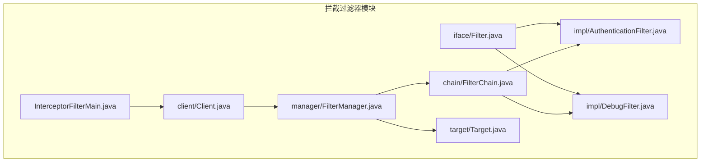
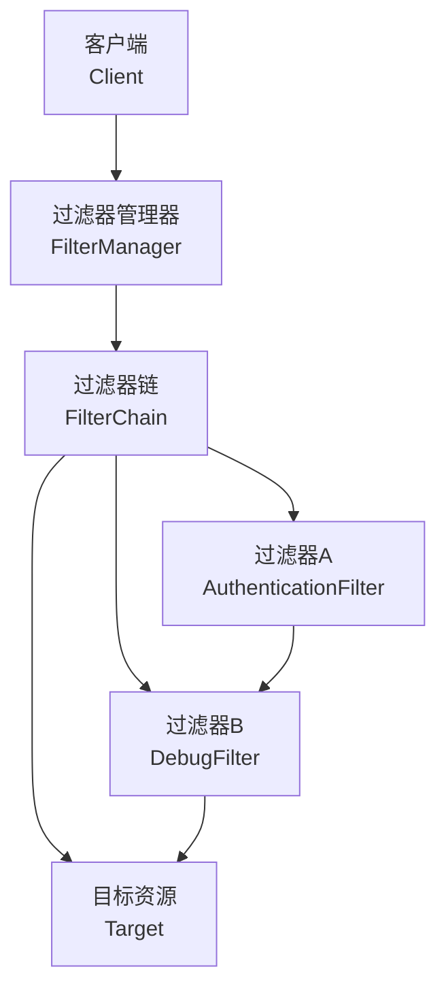
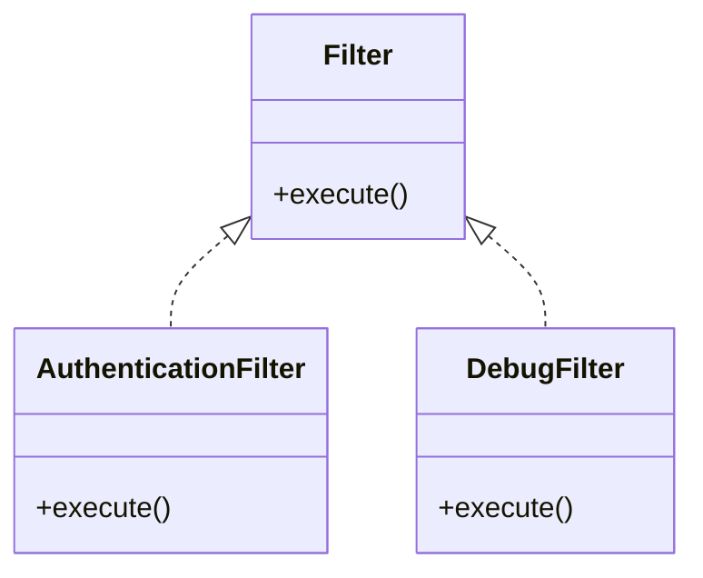
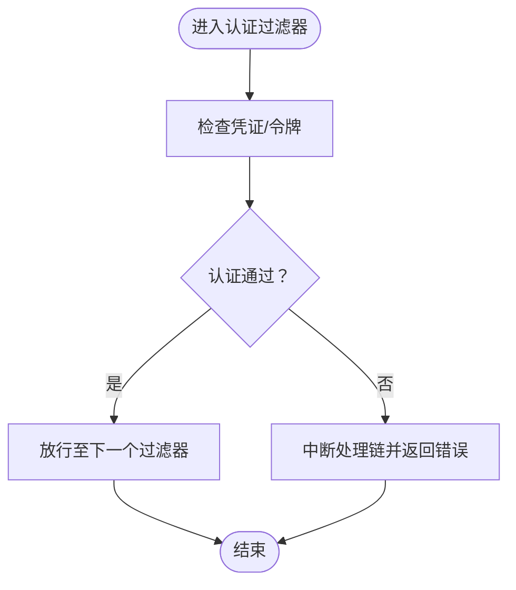
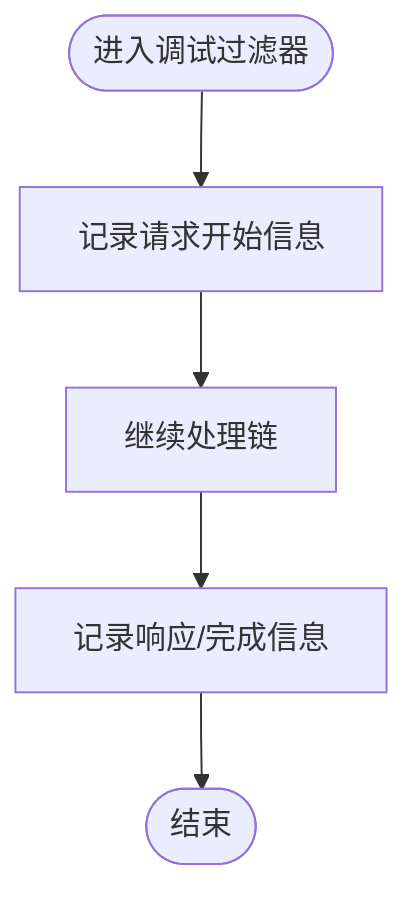
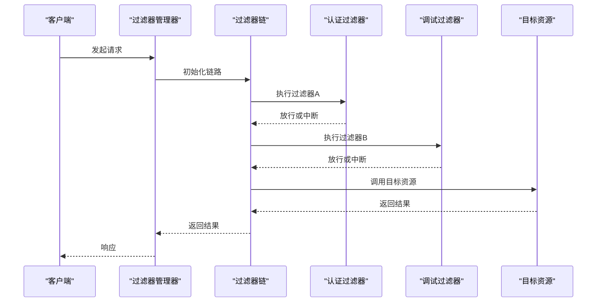
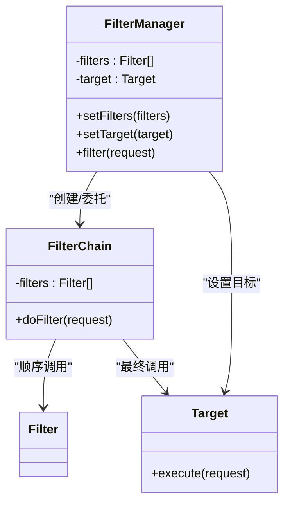
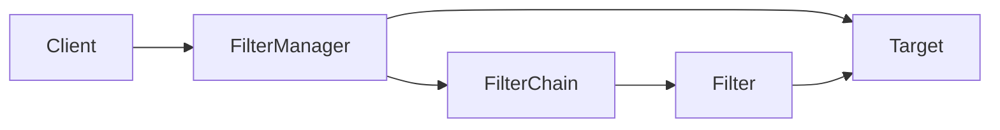

# 拦截过滤器模式

<cite>
**本文引用的文件**
- [Filter.java](file://behavioral/interceptingFilter/src/main/java/com/future/rocket/gof23/interceptor/filter/iface/Filter.java)
- [AuthenticationFilter.java](file://behavioral/interceptingFilter/src/main/java/com/future/rocket/gof23/interceptor/filter/impl/AuthenticationFilter.java)
- [DebugFilter.java](file://behavioral/interceptingFilter/src/main/java/com/future/rocket/gof23/interceptor/filter/impl/DebugFilter.java)
- [FilterChain.java](file://behavioral/interceptingFilter/src/main/java/com/future/rocket/gof23/interceptor/filter/chain/FilterChain.java)
- [FilterManager.java](file://behavioral/interceptingFilter/src/main/java/com/future/rocket/gof23/interceptor/filter/manager/FilterManager.java)
- [Target.java](file://behavioral/interceptingFilter/src/main/java/com/future/rocket/gof23/interceptor/filter/target/Target.java)
- [Client.java](file://behavioral/interceptingFilter/src/main/java/com/future/rocket/gof23/interceptor/filter/client/Client.java)
- [InterceptorFilterMain.java](file://behavioral/interceptingFilter/src/main/java/com/future/rocket/gof23/interceptor/filter/InterceptorFilterMain.java)
</cite>

## 目录
1. [引言](#引言)
2. [项目结构](#项目结构)
3. [核心组件](#核心组件)
4. [架构总览](#架构总览)
5. [详细组件分析](#详细组件分析)
6. [依赖关系分析](#依赖关系分析)
7. [性能考虑](#性能考虑)
8. [故障排查指南](#故障排查指南)
9. [结论](#结论)
10. [附录](#附录)

## 引言
本技术文档围绕拦截过滤器模式展开，系统阐述其设计原理与实现细节：在请求到达目标资源之前与之后分别执行预处理与后处理逻辑，从而实现横切关注点（如安全、日志、性能监控等）的模块化与可插拔化。文档将深入解析请求处理链的组成与执行顺序，涵盖过滤器接口、具体过滤器（认证、调试）、过滤器链与过滤器管理器的设计，并给出请求拦截的完整时序图与流程图。同时，结合实际代码文件，说明注册机制、异常处理与性能优化策略，并讨论该模式与AOP（面向切面编程）的关系，为初学者提供从简单过滤到复杂处理链的学习路径，为专家提供高性能中间件与微服务架构的设计指导。

## 项目结构
拦截过滤器示例位于行为型模式下的 interceptingFilter 模块中，采用按职责分层的组织方式：
- iface：定义过滤器接口
- impl：具体过滤器实现（认证、调试）
- chain：过滤器链
- manager：过滤器管理器
- target：目标资源
- client：客户端入口
- 主程序入口：示例运行类

图表来源
- [Filter.java:1-200](file://behavioral/interceptingFilter/src/main/java/com/future/rocket/gof23/interceptor/filter/iface/Filter.java#L1-L200)
- [AuthenticationFilter.java:1-200](file://behavioral/interceptingFilter/src/main/java/com/future/rocket/gof23/interceptor/filter/impl/AuthenticationFilter.java#L1-L200)
- [DebugFilter.java:1-200](file://behavioral/interceptingFilter/src/main/java/com/future/rocket/gof23/interceptor/filter/impl/DebugFilter.java#L1-L200)
- [FilterChain.java:1-200](file://behavioral/interceptingFilter/src/main/java/com/future/rocket/gof23/interceptor/filter/chain/FilterChain.java#L1-L200)
- [FilterManager.java:1-200](file://behavioral/interceptingFilter/src/main/java/com/future/rocket/gof23/interceptor/filter/manager/FilterManager.java#L1-L200)
- [Target.java:1-200](file://behavioral/interceptingFilter/src/main/java/com/future/rocket/gof23/interceptor/filter/target/Target.java#L1-L200)
- [Client.java:1-200](file://behavioral/interceptingFilter/src/main/java/com/future/rocket/gof23/interceptor/filter/client/Client.java#L1-L200)
- [InterceptorFilterMain.java:1-200](file://behavioral/interceptingFilter/src/main/java/com/future/rocket/gof23/interceptor/filter/InterceptorFilterMain.java#L1-L200)

章节来源
- [Filter.java:1-200](file://behavioral/interceptingFilter/src/main/java/com/future/rocket/gof23/interceptor/filter/iface/Filter.java#L1-L200)
- [FilterChain.java:1-200](file://behavioral/interceptingFilter/src/main/java/com/future/rocket/gof23/interceptor/filter/chain/FilterChain.java#L1-L200)
- [FilterManager.java:1-200](file://behavioral/interceptingFilter/src/main/java/com/future/rocket/gof23/interceptor/filter/manager/FilterManager.java#L1-L200)
- [Target.java:1-200](file://behavioral/interceptingFilter/src/main/java/com/future/rocket/gof23/interceptor/filter/target/Target.java#L1-L200)
- [Client.java:1-200](file://behavioral/interceptingFilter/src/main/java/com/future/rocket/gof23/interceptor/filter/client/Client.java#L1-L200)
- [InterceptorFilterMain.java:1-200](file://behavioral/interceptingFilter/src/main/java/com/future/rocket/gof23/interceptor/filter/InterceptorFilterMain.java#L1-L200)

## 核心组件
- 过滤器接口（Filter）：定义统一的过滤方法，用于在请求进入目标前进行预处理或在请求完成后进行后处理。
- 具体过滤器（AuthenticationFilter、DebugFilter）：实现认证与调试功能，体现横切关注点的模块化。
- 过滤器链（FilterChain）：维护过滤器列表，按顺序调用每个过滤器，最后才调用目标资源。
- 过滤器管理器（FilterManager）：负责装配过滤器链、设置目标资源，并协调客户端与链路之间的交互。
- 目标资源（Target）：被保护或被代理的实际业务处理单元。
- 客户端（Client）：发起请求的入口，通过管理器触发整个处理链。
- 主程序入口（InterceptorFilterMain）：演示如何配置与运行拦截过滤器链。

章节来源
- [Filter.java:1-200](file://behavioral/interceptingFilter/src/main/java/com/future/rocket/gof23/interceptor/filter/iface/Filter.java#L1-L200)
- [AuthenticationFilter.java:1-200](file://behavioral/interceptingFilter/src/main/java/com/future/rocket/gof23/interceptor/filter/impl/AuthenticationFilter.java#L1-L200)
- [DebugFilter.java:1-200](file://behavioral/interceptingFilter/src/main/java/com/future/rocket/gof23/interceptor/filter/impl/DebugFilter.java#L1-L200)
- [FilterChain.java:1-200](file://behavioral/interceptingFilter/src/main/java/com/future/rocket/gof23/interceptor/filter/chain/FilterChain.java#L1-L200)
- [FilterManager.java:1-200](file://behavioral/interceptingFilter/src/main/java/com/future/rocket/gof23/interceptor/filter/manager/FilterManager.java#L1-L200)
- [Target.java:1-200](file://behavioral/interceptingFilter/src/main/java/com/future/rocket/gof23/interceptor/filter/target/Target.java#L1-L200)
- [Client.java:1-200](file://behavioral/interceptingFilter/src/main/java/com/future/rocket/gof23/interceptor/filter/client/Client.java#L1-L200)
- [InterceptorFilterMain.java:1-200](file://behavioral/interceptingFilter/src/main/java/com/future/rocket/gof23/interceptor/filter/InterceptorFilterMain.java#L1-L200)

## 架构总览
拦截过滤器模式通过“责任链+管理器”的组合，将横切关注点与业务目标解耦。客户端只与管理器交互，管理器负责构建并驱动过滤器链，最终调用目标资源。该架构支持动态添加/移除过滤器，便于扩展与维护。

图表来源
- [Client.java:1-200](file://behavioral/interceptingFilter/src/main/java/com/future/rocket/gof23/interceptor/filter/client/Client.java#L1-L200)
- [FilterManager.java:1-200](file://behavioral/interceptingFilter/src/main/java/com/future/rocket/gof23/interceptor/filter/manager/FilterManager.java#L1-L200)
- [FilterChain.java:1-200](file://behavioral/interceptingFilter/src/main/java/com/future/rocket/gof23/interceptor/filter/chain/FilterChain.java#L1-L200)
- [AuthenticationFilter.java:1-200](file://behavioral/interceptingFilter/src/main/java/com/future/rocket/gof23/interceptor/filter/impl/AuthenticationFilter.java#L1-L200)
- [DebugFilter.java:1-200](file://behavioral/interceptingFilter/src/main/java/com/future/rocket/gof23/interceptor/filter/impl/DebugFilter.java#L1-L200)
- [Target.java:1-200](file://behavioral/interceptingFilter/src/main/java/com/future/rocket/gof23/interceptor/filter/target/Target.java#L1-L200)

## 详细组件分析

### 过滤器接口（Filter）
- 职责：定义过滤方法，作为所有具体过滤器的契约。
- 设计要点：统一的接口签名确保链式调用的一致性；便于新增过滤器类型而无需修改链路与管理器。

图表来源
- [Filter.java:1-200](file://behavioral/interceptingFilter/src/main/java/com/future/rocket/gof23/interceptor/filter/iface/Filter.java#L1-L200)
- [AuthenticationFilter.java:1-200](file://behavioral/interceptingFilter/src/main/java/com/future/rocket/gof23/interceptor/filter/impl/AuthenticationFilter.java#L1-L200)
- [DebugFilter.java:1-200](file://behavioral/interceptingFilter/src/main/java/com/future/rocket/gof23/interceptor/filter/impl/DebugFilter.java#L1-L200)

章节来源
- [Filter.java:1-200](file://behavioral/interceptingFilter/src/main/java/com/future/rocket/gof23/interceptor/filter/iface/Filter.java#L1-L200)

### 认证过滤器（AuthenticationFilter）
- 职责：在请求进入目标前执行认证逻辑，决定是否允许继续处理。
- 实现要点：可结合用户凭证、权限令牌等进行校验；失败时可中断后续链路或返回错误响应。

图表来源
- [AuthenticationFilter.java:1-200](file://behavioral/interceptingFilter/src/main/java/com/future/rocket/gof23/interceptor/filter/impl/AuthenticationFilter.java#L1-L200)

章节来源
- [AuthenticationFilter.java:1-200](file://behavioral/interceptingFilter/src/main/java/com/future/rocket/gof23/interceptor/filter/impl/AuthenticationFilter.java#L1-L200)

### 调试过滤器（DebugFilter）
- 职责：在请求前后输出调试信息，便于问题定位与性能观测。
- 实现要点：可记录请求参数、时间戳、耗时等；注意避免在生产环境开启高开销日志。

图表来源
- [DebugFilter.java:1-200](file://behavioral/interceptingFilter/src/main/java/com/future/rocket/gof23/interceptor/filter/impl/DebugFilter.java#L1-L200)

章节来源
- [DebugFilter.java:1-200](file://behavioral/interceptingFilter/src/main/java/com/future/rocket/gof23/interceptor/filter/impl/DebugFilter.java#L1-L200)

### 过滤器链（FilterChain）
- 职责：维护过滤器序列，按顺序依次调用，最后调用目标资源。
- 设计要点：支持动态插入/删除过滤器；保证链路完整性与顺序一致性；异常传播与回滚策略。

图表来源
- [FilterChain.java:1-200](file://behavioral/interceptingFilter/src/main/java/com/future/rocket/gof23/interceptor/filter/chain/FilterChain.java#L1-L200)
- [FilterManager.java:1-200](file://behavioral/interceptingFilter/src/main/java/com/future/rocket/gof23/interceptor/filter/manager/FilterManager.java#L1-L200)
- [AuthenticationFilter.java:1-200](file://behavioral/interceptingFilter/src/main/java/com/future/rocket/gof23/interceptor/filter/impl/AuthenticationFilter.java#L1-L200)
- [DebugFilter.java:1-200](file://behavioral/interceptingFilter/src/main/java/com/future/rocket/gof23/interceptor/filter/impl/DebugFilter.java#L1-L200)
- [Target.java:1-200](file://behavioral/interceptingFilter/src/main/java/com/future/rocket/gof23/interceptor/filter/target/Target.java#L1-L200)

章节来源
- [FilterChain.java:1-200](file://behavioral/interceptingFilter/src/main/java/com/future/rocket/gof23/interceptor/filter/chain/FilterChain.java#L1-L200)

### 过滤器管理器（FilterManager）
- 职责：装配过滤器链、设置目标资源、协调客户端与链路交互。
- 设计要点：集中式配置与生命周期管理；支持按需启用/禁用过滤器；异常捕获与降级策略。

图表来源
- [FilterManager.java:1-200](file://behavioral/interceptingFilter/src/main/java/com/future/rocket/gof23/interceptor/filter/manager/FilterManager.java#L1-L200)
- [FilterChain.java:1-200](file://behavioral/interceptingFilter/src/main/java/com/future/rocket/gof23/interceptor/filter/chain/FilterChain.java#L1-L200)
- [Target.java:1-200](file://behavioral/interceptingFilter/src/main/java/com/future/rocket/gof23/interceptor/filter/target/Target.java#L1-L200)

章节来源
- [FilterManager.java:1-200](file://behavioral/interceptingFilter/src/main/java/com/future/rocket/gof23/interceptor/filter/manager/FilterManager.java#L1-L200)

### 目标资源（Target）
- 职责：承载真正的业务逻辑，仅在所有前置过滤器通过后被调用。
- 设计要点：保持纯净的业务语义；对来自链路的输入进行验证；输出标准化。

章节来源
- [Target.java:1-200](file://behavioral/interceptingFilter/src/main/java/com/future/rocket/gof23/interceptor/filter/target/Target.java#L1-L200)

### 客户端（Client）
- 职责：发起请求，通过管理器触发过滤器链与目标资源。
- 设计要点：屏蔽链路细节；提供统一的入口与参数封装。

章节来源
- [Client.java:1-200](file://behavioral/interceptingFilter/src/main/java/com/future/rocket/gof23/interceptor/filter/client/Client.java#L1-L200)

### 主程序入口（InterceptorFilterMain）
- 职责：演示如何配置过滤器、管理器与客户端，运行完整请求拦截流程。
- 设计要点：展示从注册到执行的全链路过程；便于学习与测试。

章节来源
- [InterceptorFilterMain.java:1-200](file://behavioral/interceptingFilter/src/main/java/com/future/rocket/gof23/interceptor/filter/InterceptorFilterMain.java#L1-L200)

## 依赖关系分析
- 组件内聚：各过滤器实现独立，仅依赖统一接口；链路与管理器不直接依赖具体过滤器类型，提升可替换性。
- 组件耦合：管理器依赖链路与目标；链路依赖过滤器集合；客户端依赖管理器。
- 外部依赖：无外部框架依赖，纯Java实现，便于移植与集成。

图表来源
- [Client.java:1-200](file://behavioral/interceptingFilter/src/main/java/com/future/rocket/gof23/interceptor/filter/client/Client.java#L1-L200)
- [FilterManager.java:1-200](file://behavioral/interceptingFilter/src/main/java/com/future/rocket/gof23/interceptor/filter/manager/FilterManager.java#L1-L200)
- [FilterChain.java:1-200](file://behavioral/interceptingFilter/src/main/java/com/future/rocket/gof23/interceptor/filter/chain/FilterChain.java#L1-L200)
- [Filter.java:1-200](file://behavioral/interceptingFilter/src/main/java/com/future/rocket/gof23/interceptor/filter/iface/Filter.java#L1-L200)
- [Target.java:1-200](file://behavioral/interceptingFilter/src/main/java/com/future/rocket/gof23/interceptor/filter/target/Target.java#L1-L200)

章节来源
- [Filter.java:1-200](file://behavioral/interceptingFilter/src/main/java/com/future/rocket/gof23/interceptor/filter/iface/Filter.java#L1-L200)
- [FilterChain.java:1-200](file://behavioral/interceptingFilter/src/main/java/com/future/rocket/gof23/interceptor/filter/chain/FilterChain.java#L1-L200)
- [FilterManager.java:1-200](file://behavioral/interceptingFilter/src/main/java/com/future/rocket/gof23/interceptor/filter/manager/FilterManager.java#L1-L200)
- [Target.java:1-200](file://behavioral/interceptingFilter/src/main/java/com/future/rocket/gof23/interceptor/filter/target/Target.java#L1-L200)
- [Client.java:1-200](file://behavioral/interceptingFilter/src/main/java/com/future/rocket/gof23/interceptor/filter/client/Client.java#L1-L200)

## 性能考虑
- 过滤器数量与顺序：过滤器越多，链路开销越大；建议将高成本过滤器置于链尾或按需启用。
- 日志与监控：调试过滤器应避免高频写入；可采用异步日志或采样策略。
- 缓存与短路：在认证通过后可缓存结果，减少重复计算；对已知非法请求尽早短路。
- 线程安全：过滤器链与管理器应避免共享可变状态；必要时使用不可变数据结构或同步机制。
- 超时与熔断：在管理器层面增加超时与熔断策略，防止慢过滤器拖垮整体性能。

## 故障排查指南
- 认证失败：检查认证过滤器的凭证校验逻辑与错误返回路径，确认链路是否提前中断。
- 调试信息缺失：确认调试过滤器是否正确加入链路且未被条件分支跳过。
- 链路未达目标：逐个检查过滤器的放行逻辑，定位阻断点。
- 异常传播：在管理器或链路中增加统一异常捕获与日志记录，避免异常丢失。
- 性能瓶颈：通过调试过滤器统计各阶段耗时，识别热点环节并优化。

章节来源
- [FilterManager.java:1-200](file://behavioral/interceptingFilter/src/main/java/com/future/rocket/gof23/interceptor/filter/manager/FilterManager.java#L1-L200)
- [FilterChain.java:1-200](file://behavioral/interceptingFilter/src/main/java/com/future/rocket/gof23/interceptor/filter/chain/FilterChain.java#L1-L200)
- [AuthenticationFilter.java:1-200](file://behavioral/interceptingFilter/src/main/java/com/future/rocket/gof23/interceptor/filter/impl/AuthenticationFilter.java#L1-L200)
- [DebugFilter.java:1-200](file://behavioral/interceptingFilter/src/main/java/com/future/rocket/gof23/interceptor/filter/impl/DebugFilter.java#L1-L200)

## 结论
拦截过滤器模式通过“接口契约 + 责任链 + 管理器”的组合，实现了横切关注点的模块化与可插拔化。它既适合在Web框架中承担安全、日志、限流等通用能力，也适用于微服务网关与中间件场景。借助清晰的注册机制、可扩展的链路与完善的异常处理策略，可在保证性能的同时获得良好的可维护性与可观测性。对于初学者，建议从单一过滤器起步，逐步引入链路与管理器；对于专家，可在此基础上扩展为分布式网关与可观测性平台的核心构件。

## 附录
- 与AOP的关系：拦截过滤器模式与AOP在“横切关注点”与“统一处理入口”上高度一致。AOP通过动态代理或字节码增强实现类似效果，而拦截过滤器更偏向静态装配与显式链路控制，二者在不同场景下可互补使用。
- 学习路径建议：
  - 初学者：先理解Filter接口与单个过滤器（认证/调试），再掌握FilterChain的顺序执行，最后学习FilterManager的装配与客户端调用。
  - 进阶者：研究链路动态扩展、异常传播与降级策略、性能监控与日志采样。
  - 专家：结合微服务与网关场景，设计多级过滤链、灰度发布与流量治理策略。