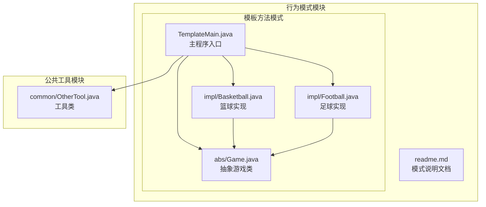
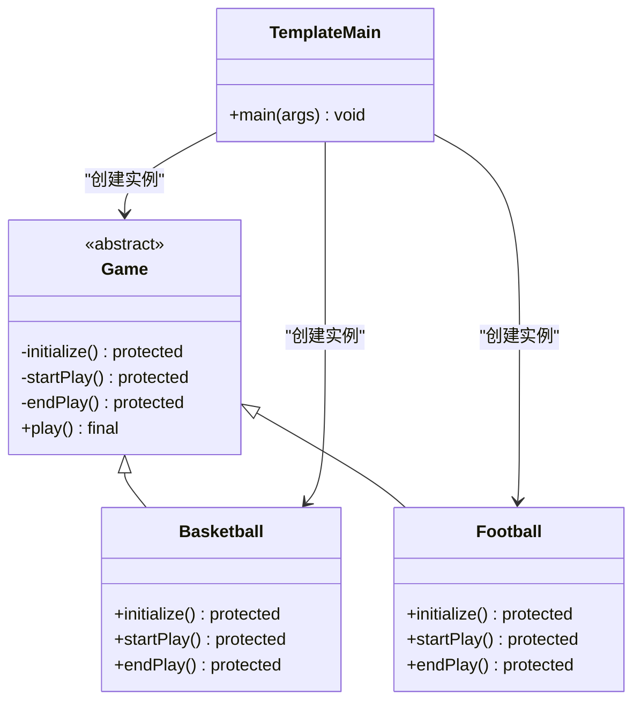
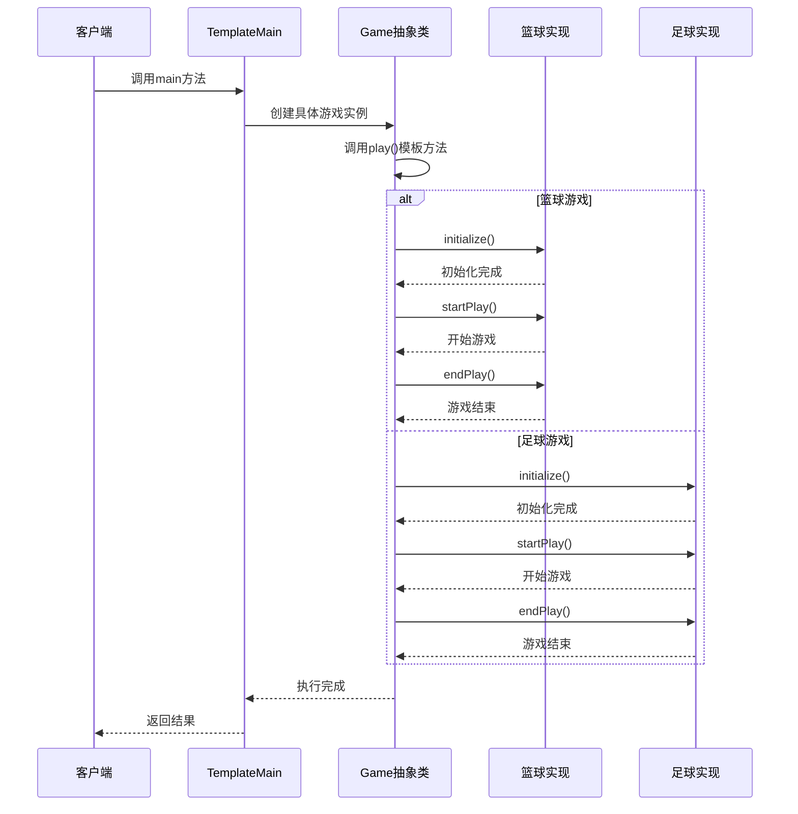
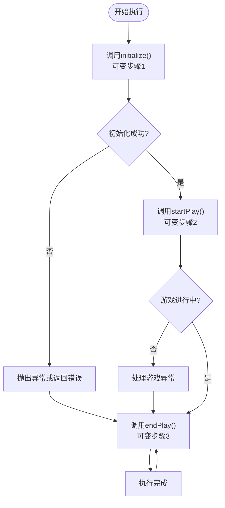
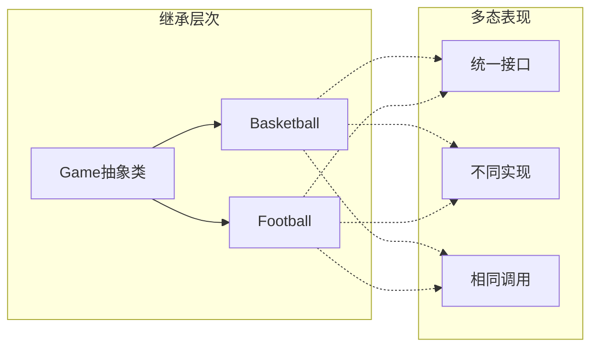
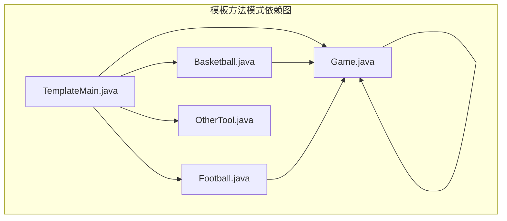

# 模板方法模式

<cite>
**本文档引用的文件**
- [Game.java](file://behavioral/template/src/main/java/com/future/rocket/gof23/template/abs/Game.java)
- [Basketball.java](file://behavioral/template/src/main/java/com/future/rocket/gof23/template/impl/Basketball.java)
- [Football.java](file://behavioral/template/src/main/java/com/future/rocket/gof23/template/impl/Football.java)
- [TemplateMain.java](file://behavioral/template/src/main/java/com/future/rocket/gof23/template/TemplateMain.java)
- [OtherTool.java](file://common/src/main/java/com/future/rocket/gof23/common/OtherTool.java)
- [readme.md](file://behavioral/template/readme.md)
</cite>

## 目录
1. [引言](#引言)
2. [项目结构](#项目结构)
3. [核心组件](#核心组件)
4. [架构概览](#架构概览)
5. [详细组件分析](#详细组件分析)
6. [依赖分析](#依赖分析)
7. [性能考虑](#性能考虑)
8. [故障排除指南](#故障排除指南)
9. [结论](#结论)
10. [附录](#附录)

## 引言

模板方法模式是行为型设计模式中最经典的设计模式之一，它通过在抽象类中定义算法的骨架，将一些步骤延迟到子类中实现，从而允许子类在不改变算法结构的情况下重新定义算法的特定步骤。这种模式在软件开发中具有重要的应用价值，特别是在需要标准化流程但允许差异化实现的场景中。

本项目以体育运动系统为例，展示了模板方法模式在实际应用中的完美体现。通过抽象出"游戏"的通用流程，具体实现类（篮球、足球）专注于各自独特的细节处理，既保证了算法结构的一致性，又提供了充分的扩展空间。

## 项目结构

该项目采用标准的Maven项目结构，遵循分层组织原则。模板方法模式相关的代码位于`behavioral/template`目录下，采用包名分层的方式组织代码结构。



**图表来源**
- [Game.java:1-14](file://behavioral/template/src/main/java/com/future/rocket/gof23/template/abs/Game.java#L1-L14)
- [Basketball.java:1-21](file://behavioral/template/src/main/java/com/future/rocket/gof23/template/impl/Basketball.java#L1-L21)
- [Football.java:1-21](file://behavioral/template/src/main/java/com/future/rocket/gof23/template/impl/Football.java#L1-L21)
- [TemplateMain.java:1-20](file://behavioral/template/src/main/java/com/future/rocket/gof23/template/TemplateMain.java#L1-L20)

**章节来源**
- [readme.md:1-17](file://behavioral/template/readme.md#L1-L17)
- [TemplateMain.java:1-20](file://behavioral/template/src/main/java/com/future/rocket/gof23/template/TemplateMain.java#L1-L20)

## 核心组件

### 抽象游戏类（Game）

抽象游戏类是模板方法模式的核心，定义了完整的算法骨架和可变步骤的声明。该类采用final修饰符确保模板方法不可被重写，同时暴露三个受保护的抽象方法供子类实现。

关键设计要点：
- **模板方法**：`play()`方法定义完整的执行流程
- **可变步骤**：三个受保护的抽象方法分别对应不同阶段
- **访问控制**：使用`protected`确保子类可见性但外部不可直接访问

### 具体实现类

#### 篮球类（Basketball）
篮球类实现了所有抽象方法，专注于篮球运动特有的初始化、开始和结束逻辑。每个方法都体现了篮球运动的独特性。

#### 足球类（Football）
足球类同样实现了所有抽象方法，但针对足球运动的特点进行了相应的实现。两个具体类共享相同的算法结构，但在细节上各有特色。

**章节来源**
- [Game.java:3-12](file://behavioral/template/src/main/java/com/future/rocket/gof23/template/abs/Game.java#L3-L12)
- [Basketball.java:5-20](file://behavioral/template/src/main/java/com/future/rocket/gof23/template/impl/Basketball.java#L5-L20)
- [Football.java:5-20](file://behavioral/template/src/main/java/com/future/rocket/gof23/template/impl/Football.java#L5-L20)

## 架构概览

模板方法模式的架构设计体现了"好莱坞原则"（Don't call us, we'll call you），通过抽象类控制流程，子类只负责具体的实现细节。



**图表来源**
- [Game.java:3-12](file://behavioral/template/src/main/java/com/future/rocket/gof23/template/abs/Game.java#L3-L12)
- [Basketball.java:5-20](file://behavioral/template/src/main/java/com/future/rocket/gof23/template/impl/Basketball.java#L5-L20)
- [Football.java:5-20](file://behavioral/template/src/main/java/com/future/rocket/gof23/template/impl/Football.java#L5-L20)
- [TemplateMain.java:8-18](file://behavioral/template/src/main/java/com/future/rocket/gof23/template/TemplateMain.java#L8-L18)

## 详细组件分析

### 模板方法执行流程

模板方法模式的核心在于定义稳定的算法骨架。让我们通过序列图展示完整的执行流程：



**图表来源**
- [TemplateMain.java:10-18](file://behavioral/template/src/main/java/com/future/rocket/gof23/template/TemplateMain.java#L10-L18)
- [Game.java:8-12](file://behavioral/template/src/main/java/com/future/rocket/gof23/template/abs/Game.java#L8-L12)
- [Basketball.java:7-19](file://behavioral/template/src/main/java/com/future/rocket/gof23/template/impl/Basketball.java#L7-L19)
- [Football.java:7-19](file://behavioral/template/src/main/java/com/future/rocket/gof23/template/impl/Football.java#L7-L19)

### 算法骨架与可变步骤

模板方法模式将算法分为稳定部分和可变部分：



**图表来源**
- [Game.java:8-12](file://behavioral/template/src/main/java/com/future/rocket/gof23/template/abs/Game.java#L8-L12)

### 继承与多态的应用

模板方法模式完美体现了面向对象的核心特性：



**图表来源**
- [Game.java:3-12](file://behavioral/template/src/main/java/com/future/rocket/gof23/template/abs/Game.java#L3-L12)
- [Basketball.java:5-20](file://behavioral/template/src/main/java/com/future/rocket/gof23/template/impl/Basketball.java#L5-L20)
- [Football.java:5-20](file://behavioral/template/src/main/java/com/future/rocket/gof23/template/impl/Football.java#L5-L20)

**章节来源**
- [Game.java:3-12](file://behavioral/template/src/main/java/com/future/rocket/gof23/template/abs/Game.java#L3-L12)
- [TemplateMain.java:10-18](file://behavioral/template/src/main/java/com/future/rocket/gof23/template/TemplateMain.java#L10-L18)

## 依赖分析

模板方法模式的依赖关系相对简单，体现了良好的内聚性和低耦合性：



**图表来源**
- [TemplateMain.java:3-6](file://behavioral/template/src/main/java/com/future/rocket/gof23/template/TemplateMain.java#L3-L6)
- [Basketball.java](file://behavioral/template/src/main/java/com/future/rocket/gof23/template/impl/Basketball.java#L3)
- [Football.java](file://behavioral/template/src/main/java/com/future/rocket/gof23/template/impl/Football.java#L3)

### 关键依赖关系说明

1. **主程序依赖**：TemplateMain依赖Game抽象类和具体实现类
2. **实现依赖**：Basketball和Football都依赖Game抽象类
3. **工具依赖**：主程序依赖OtherTool进行输出格式化

**章节来源**
- [TemplateMain.java:3-6](file://behavioral/template/src/main/java/com/future/rocket/gof23/template/TemplateMain.java#L3-L6)
- [OtherTool.java:8-10](file://common/src/main/java/com/future/rocket/gof23/common/OtherTool.java#L8-L10)

## 性能考虑

模板方法模式在性能方面具有以下特点：

### 时间复杂度
- **算法复杂度**：O(n)，其中n为步骤数量
- **调用开销**：每次方法调用都有一定的JVM开销
- **内存占用**：每个实例占用相应的内存空间

### 优化策略

1. **减少方法调用层级**
   - 合理设计步骤数量，避免过度细分
   - 对于简单操作，考虑直接实现而非抽象

2. **缓存机制**
   - 对于重复计算的结果进行缓存
   - 避免在循环中进行不必要的重复操作

3. **延迟初始化**
   - 将昂贵的对象初始化推迟到真正需要时
   - 使用懒加载模式优化启动时间

4. **避免过度抽象**
   - 只对确实需要复用的代码进行抽象
   - 避免为一次性使用的功能创建模板

## 故障排除指南

### 常见问题及解决方案

#### 1. 子类未正确实现抽象方法
**问题症状**：编译错误，提示抽象方法未实现
**解决方法**：确保所有受保护的抽象方法都被正确实现

#### 2. 模板方法被意外重写
**问题症状**：运行时行为异常，算法流程被打乱
**解决方法**：使用final修饰符确保模板方法不可被重写

#### 3. 访问权限问题
**问题症状**：子类无法访问父类的受保护方法
**解决方法**：确认方法的访问级别设置正确

#### 4. 多态调用错误
**问题症状**：调用的是父类方法而非子类方法
**解决方法**：检查实例化方式，确保使用正确的具体类

**章节来源**
- [Game.java:8-12](file://behavioral/template/src/main/java/com/future/rocket/gof23/template/abs/Game.java#L8-L12)

## 结论

模板方法模式通过"稳定算法骨架 + 可变步骤实现"的设计理念，为软件架构提供了优雅的解决方案。在本体育运动系统的实现中，我们看到了该模式的完美应用：

### 主要优势
1. **算法一致性**：确保所有具体实现遵循相同的执行流程
2. **代码复用性**：避免重复实现相同的算法结构
3. **扩展灵活性**：允许子类专注于差异化实现
4. **维护便利性**：修改算法结构只需在抽象类中进行

### 应用场景
- 框架设计中的标准流程控制
- 插件系统中的统一接口定义
- 数据处理管道中的标准化流程
- 工作流引擎中的任务调度

### 最佳实践
1. **合理划分步骤**：将稳定的逻辑放在模板方法中
2. **明确抽象边界**：只抽象那些确实需要复用的部分
3. **保持接口简洁**：避免过度复杂的抽象层次
4. **考虑性能影响**：评估方法调用开销对整体性能的影响

模板方法模式不仅是设计模式的经典案例，更是面向对象编程思想的完美体现。通过合理的抽象设计，我们能够在保证代码稳定性的同时，提供足够的灵活性来满足各种业务需求。

## 附录

### 模式扩展点设计

#### 1. 钩子方法（Hook Methods）
在算法骨架中添加可选的钩子方法，允许子类选择性地覆盖：

```java
// 示例：可选的后处理钩子
protected void postProcess() {
    // 默认空实现，子类可选择性覆盖
}
```

#### 2. 模板方法的变体
- **标准模板方法**：完全由抽象类控制流程
- **参数化模板方法**：通过参数影响算法执行
- **具体模板方法**：部分步骤在抽象类中实现

#### 3. 异常处理策略
- **统一异常处理**：在模板方法中集中处理异常
- **步骤级异常处理**：在具体步骤中处理特定异常
- **回滚机制**：在出现异常时执行清理操作

### 与其他设计模式的关系

#### 与策略模式的区别
- **模板方法**：关注算法结构的复用
- **策略模式**：关注算法实现的替换

#### 与工厂方法模式的结合
模板方法经常与工厂方法模式结合使用，通过工厂方法创建具体实例：

```java
// 在模板方法中调用工厂方法
protected final void createInstance() {
    setInstance(createProduct());
}

protected abstract Product createProduct();
```

### 实际应用场景

#### 1. Web框架中的请求处理
- 请求解析
- 权限验证
- 业务处理
- 响应生成

#### 2. 数据库连接池管理
- 连接建立
- 事务管理
- 连接回收

#### 3. 文件处理系统
- 文件打开
- 数据读取/写入
- 文件关闭

通过这些扩展和应用，模板方法模式能够适应更复杂的业务场景，为构建灵活而稳定的软件系统提供强有力的支持。