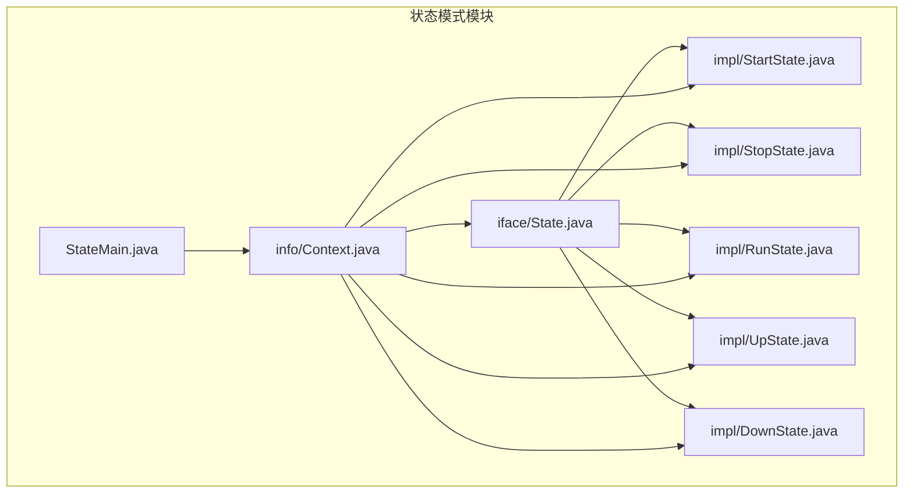
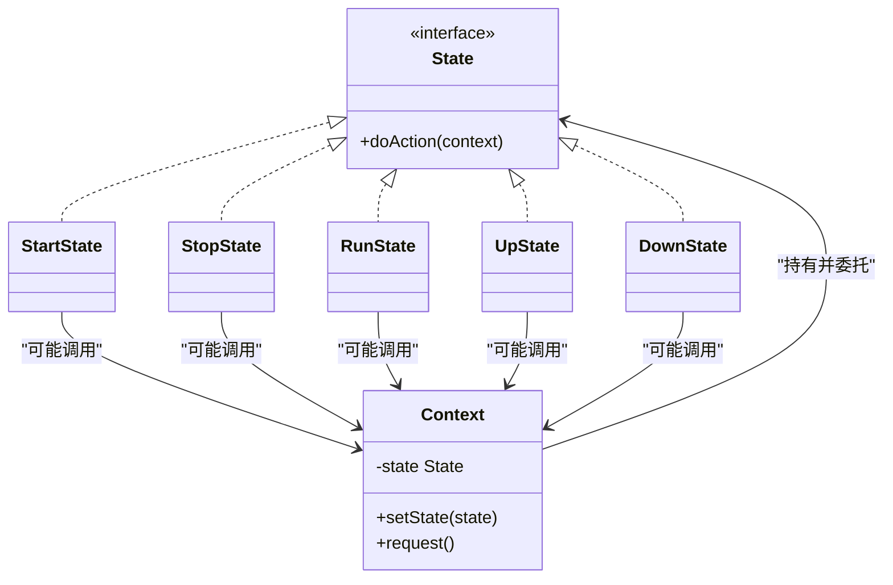
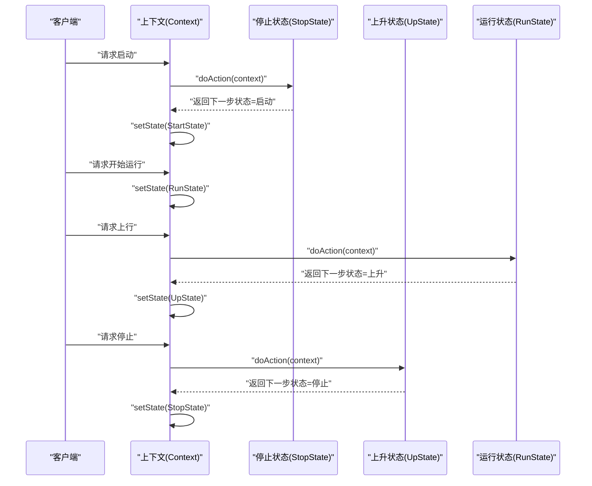
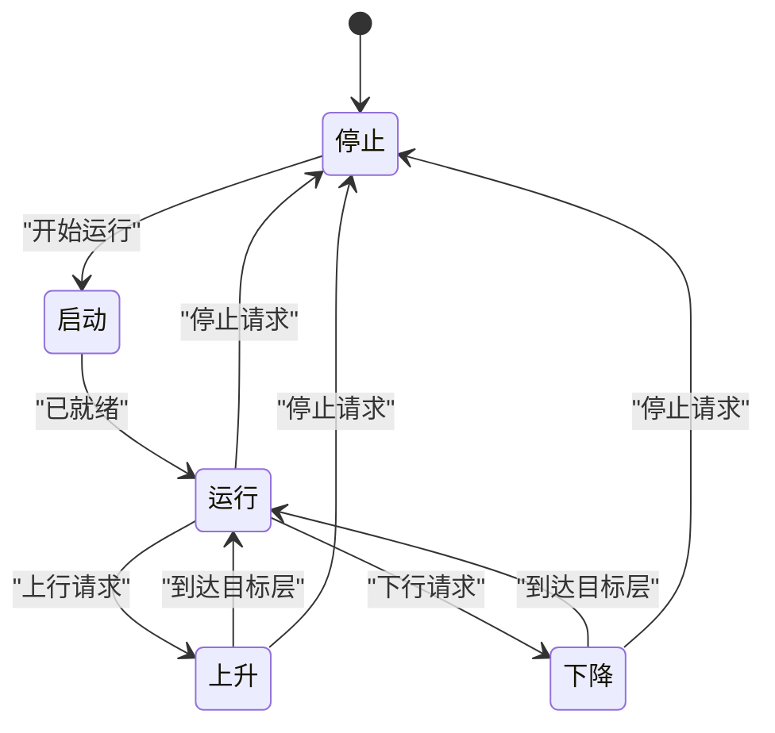
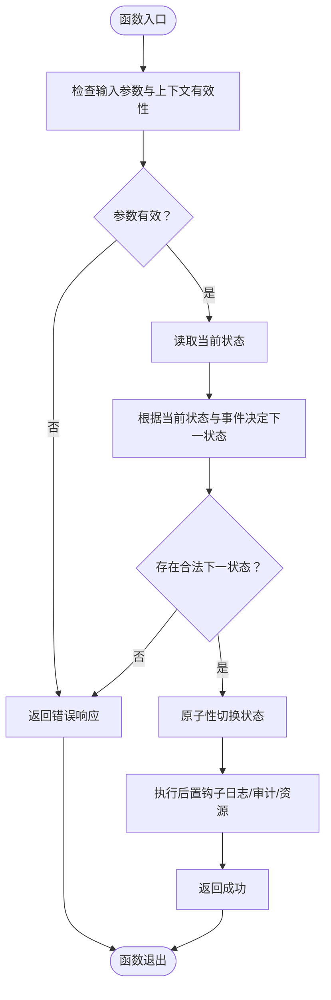
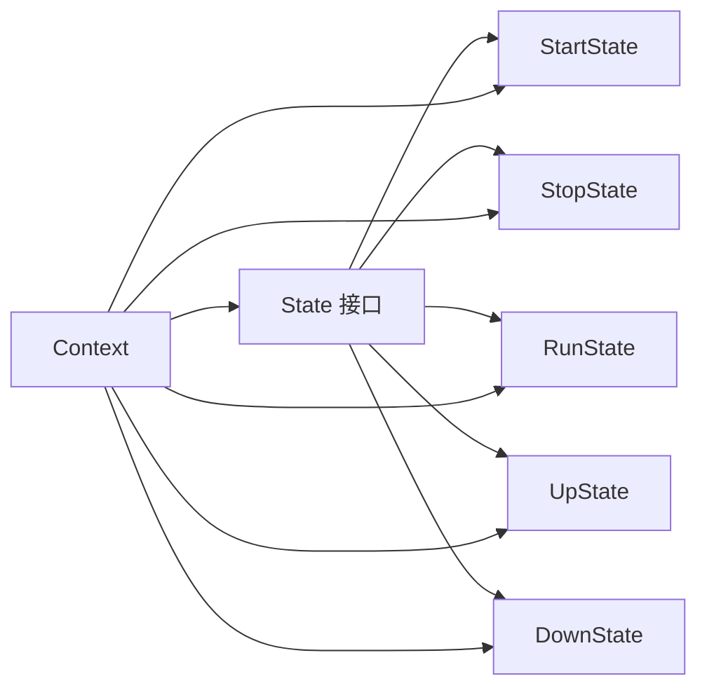

# 状态模式

<cite>
**本文引用的文件**
- [behavioral/state/src/main/java/com/future/rocket/gof23/state/iface/State.java](file://behavioral/state/src/main/java/com/future/rocket/gof23/state/iface/State.java)
- [behavioral/state/src/main/java/com/future/rocket/gof23/state/impl/StartState.java](file://behavioral/state/src/main/java/com/future/rocket/gof23/state/impl/StartState.java)
- [behavioral/state/src/main/java/com/future/rocket/gof23/state/impl/StopState.java](file://behavioral/state/src/main/java/com/future/rocket/gof23/state/impl/StopState.java)
- [behavioral/state/src/main/java/com/future/rocket/gof23/state/impl/RunState.java](file://behavioral/state/src/main/java/com/future/rocket/gof23/state/impl/RunState.java)
- [behavioral/state/src/main/java/com/future/rocket/gof23/state/impl/UpState.java](file://behavioral/state/src/main/java/com/future/rocket/gof23/state/impl/UpState.java)
- [behavioral/state/src/main/java/com/future/rocket/gof23/state/impl/DownState.java](file://behavioral/state/src/main/java/com/future/rocket/gof23/state/impl/DownState.java)
- [behavioral/state/src/main/java/com/future/rocket/gof23/state/info/Context.java](file://behavioral/state/src/main/java/com/future/rocket/gof23/state/info/Context.java)
- [behavioral/state/src/main/java/com/future/rocket/gof23/state/StateMain.java](file://behavioral/state/src/main/java/com/future/rocket/gof23/state/StateMain.java)
</cite>

## 目录
1. [引言](#引言)
2. [项目结构](#项目结构)
3. [核心组件](#核心组件)
4. [架构总览](#架构总览)
5. [详细组件分析](#详细组件分析)
6. [依赖关系分析](#依赖关系分析)
7. [性能考量](#性能考量)
8. [故障排查指南](#故障排查指南)
9. [结论](#结论)
10. [附录](#附录)

## 引言
本文件系统性阐述状态模式的设计原理与实践方法，围绕仓库中“状态”示例展开，重点覆盖以下方面：
- 设计动机：当对象内部状态变化时，其行为随之改变，仿佛对象修改了它的类。
- 电梯控制场景的状态建模：抽象状态接口、具体状态（启动、停止、运行、上升、下降）、上下文类及其交互。
- 完整状态转换图与触发条件分析。
- 在有限状态机、游戏AI、协议实现与业务流程控制中的应用建议。
- 原子性保证、状态持久化与并发状态管理的实现策略。
- 状态模式与策略模式的区别及选择原则。
- 面向初学者的状态思维培养与面向专家的复杂状态系统建模与优化指导。

## 项目结构
该示例位于 behavioral/state 模块，采用按职责分层的组织方式：
- iface：定义状态接口
- impl：实现具体状态
- info：上下文类
- StateMain：演示入口

图表来源
- [behavioral/state/src/main/java/com/future/rocket/gof23/state/iface/State.java](file://behavioral/state/src/main/java/com/future/rocket/gof23/state/iface/State.java)
- [behavioral/state/src/main/java/com/future/rocket/gof23/state/impl/StartState.java](file://behavioral/state/src/main/java/com/future/rocket/gof23/state/impl/StartState.java)
- [behavioral/state/src/main/java/com/future/rocket/gof23/state/impl/StopState.java](file://behavioral/state/src/main/java/com/future/rocket/gof23/state/impl/StopState.java)
- [behavioral/state/src/main/java/com/future/rocket/gof23/state/impl/RunState.java](file://behavioral/state/src/main/java/com/future/rocket/gof23/state/impl/RunState.java)
- [behavioral/state/src/main/java/com/future/rocket/gof23/state/impl/UpState.java](file://behavioral/state/src/main/java/com/future/rocket/gof23/state/impl/UpState.java)
- [behavioral/state/src/main/java/com/future/rocket/gof23/state/impl/DownState.java](file://behavioral/state/src/main/java/com/future/rocket/gof23/state/impl/DownState.java)
- [behavioral/state/src/main/java/com/future/rocket/gof23/state/info/Context.java](file://behavioral/state/src/main/java/com/future/rocket/gof23/state/info/Context.java)
- [behavioral/state/src/main/java/com/future/rocket/gof23/state/StateMain.java](file://behavioral/state/src/main/java/com/future/rocket/gof23/state/StateMain.java)

章节来源
- [behavioral/state/src/main/java/com/future/rocket/gof23/state/iface/State.java](file://behavioral/state/src/main/java/com/future/rocket/gof23/state/iface/State.java)
- [behavioral/state/src/main/java/com/future/rocket/gof23/state/info/Context.java](file://behavioral/state/src/main/java/com/future/rocket/gof23/state/info/Context.java)
- [behavioral/state/src/main/java/com/future/rocket/gof23/state/StateMain.java](file://behavioral/state/src/main/java/com/future/rocket/gof23/state/StateMain.java)

## 核心组件
- 状态接口（State）
  - 职责：定义统一的状态行为契约，供上下文调用以执行当前状态的动作。
  - 关键点：通过上下文传递必要的环境信息，避免状态对象持有过多外部状态。
- 上下文类（Context）
  - 职责：维护当前状态实例，对外暴露受控的状态切换接口；在状态切换前后可执行钩子逻辑。
  - 关键点：封装状态切换的原子性与一致性，确保状态转换过程不可被外部打断。
- 具体状态
  - 启动状态（StartState）
  - 停止状态（StopState）
  - 运行状态（RunState）
  - 上升状态（UpState）
  - 下降状态（DownState）

章节来源
- [behavioral/state/src/main/java/com/future/rocket/gof23/state/iface/State.java](file://behavioral/state/src/main/java/com/future/rocket/gof23/state/iface/State.java)
- [behavioral/state/src/main/java/com/future/rocket/gof23/state/info/Context.java](file://behavioral/state/src/main/java/com/future/rocket/gof23/state/info/Context.java)
- [behavioral/state/src/main/java/com/future/rocket/gof23/state/impl/StartState.java](file://behavioral/state/src/main/java/com/future/rocket/gof23/state/impl/StartState.java)
- [behavioral/state/src/main/java/com/future/rocket/gof23/state/impl/StopState.java](file://behavioral/state/src/main/java/com/future/rocket/gof23/state/impl/StopState.java)
- [behavioral/state/src/main/java/com/future/rocket/gof23/state/impl/RunState.java](file://behavioral/state/src/main/java/com/future/rocket/gof23/state/impl/RunState.java)
- [behavioral/state/src/main/java/com/future/rocket/gof23/state/impl/UpState.java](file://behavioral/state/src/main/java/com/future/rocket/gof23/state/impl/UpState.java)
- [behavioral/state/src/main/java/com/future/rocket/gof23/state/impl/DownState.java](file://behavioral/state/src/main/java/com/future/rocket/gof23/state/impl/DownState.java)

## 架构总览
状态模式将“状态”从上下文中抽离，形成独立的状态对象，使状态变化成为可组合、可替换的行为单元。上下文仅负责状态的委托与转换，具体行为由状态对象实现。

图表来源
- [behavioral/state/src/main/java/com/future/rocket/gof23/state/iface/State.java](file://behavioral/state/src/main/java/com/future/rocket/gof23/state/iface/State.java)
- [behavioral/state/src/main/java/com/future/rocket/gof23/state/info/Context.java](file://behavioral/state/src/main/java/com/future/rocket/gof23/state/info/Context.java)
- [behavioral/state/src/main/java/com/future/rocket/gof23/state/impl/StartState.java](file://behavioral/state/src/main/java/com/future/rocket/gof23/state/impl/StartState.java)
- [behavioral/state/src/main/java/com/future/rocket/gof23/state/impl/StopState.java](file://behavioral/state/src/main/java/com/future/rocket/gof23/state/impl/StopState.java)
- [behavioral/state/src/main/java/com/future/rocket/gof23/state/impl/RunState.java](file://behavioral/state/src/main/java/com/future/rocket/gof23/state/impl/RunState.java)
- [behavioral/state/src/main/java/com/future/rocket/gof23/state/impl/UpState.java](file://behavioral/state/src/main/java/com/future/rocket/gof23/state/impl/UpState.java)
- [behavioral/state/src/main/java/com/future/rocket/gof23/state/impl/DownState.java](file://behavioral/state/src/main/java/com/future/rocket/gof23/state/impl/DownState.java)

## 详细组件分析

### 状态接口（State）
- 设计要点
  - 统一的 doAction(context) 签名，确保所有状态具备一致的“响应上下文请求”的能力。
  - 将状态切换决策从具体状态中剥离，交由上下文根据当前状态与输入事件决定下一步状态。
- 复杂度与性能
  - 单次操作为 O(1)，状态切换成本低，适合高频状态转换场景。
- 错误处理
  - 若上下文传入非法或不完整，应在 doAction 内进行防御式校验，避免状态对象因外部错误而进入不确定态。

章节来源
- [behavioral/state/src/main/java/com/future/rocket/gof23/state/iface/State.java](file://behavioral/state/src/main/java/com/future/rocket/gof23/state/iface/State.java)

### 上下文类（Context）
- 设计要点
  - 维护当前状态引用，提供 setState 与 request 等受控接口。
  - 在状态切换前后可插入钩子（如日志、审计、资源释放/初始化），保证原子性与一致性。
- 数据结构与复杂度
  - 状态引用为 O(1) 访问；状态切换为 O(1)。
- 并发与原子性
  - 建议对 setState 与 request 的组合操作加锁，确保状态切换的原子性。
  - 对外暴露的 request 应在单线程内完成一次完整转换，避免跨线程共享可变状态。

章节来源
- [behavioral/state/src/main/java/com/future/rocket/gof23/state/info/Context.java](file://behavioral/state/src/main/java/com/future/rocket/gof23/state/info/Context.java)

### 具体状态：启动、停止、运行、上升、下降
- 启动状态（StartState）
  - 行为特征：通常负责初始化、准备运行、等待触发条件。
  - 可能的后续状态：运行、停止。
- 停止状态（StopState）
  - 行为特征：保持静止，等待重启或维护指令。
  - 可能的后续状态：启动、运行。
- 运行状态（RunState）
  - 行为特征：执行周期性任务或持续动作。
  - 可能的后续状态：上升、下降、停止。
- 上升状态（UpState）
  - 行为特征：向上移动，可能受楼层限制与安全约束。
  - 可能的后续状态：运行、停止。
- 下降状态（DownState）
  - 行为特征：向下移动，同样受约束。
  - 可能的后续状态：运行、停止。

章节来源
- [behavioral/state/src/main/java/com/future/rocket/gof23/state/impl/StartState.java](file://behavioral/state/src/main/java/com/future/rocket/gof23/state/impl/StartState.java)
- [behavioral/state/src/main/java/com/future/rocket/gof23/state/impl/StopState.java](file://behavioral/state/src/main/java/com/future/rocket/gof23/state/impl/StopState.java)
- [behavioral/state/src/main/java/com/future/rocket/gof23/state/impl/RunState.java](file://behavioral/state/src/main/java/com/future/rocket/gof23/state/impl/RunState.java)
- [behavioral/state/src/main/java/com/future/rocket/gof23/state/impl/UpState.java](file://behavioral/state/src/main/java/com/future/rocket/gof23/state/impl/UpState.java)
- [behavioral/state/src/main/java/com/future/rocket/gof23/state/impl/DownState.java](file://behavioral/state/src/main/java/com/future/rocket/gof23/state/impl/DownState.java)

### 状态转换序列（电梯控制场景）
以下序列展示从“停止”到“上升”再到“运行”的典型流程，以及触发条件与上下文交互。

图表来源
- [behavioral/state/src/main/java/com/future/rocket/gof23/state/info/Context.java](file://behavioral/state/src/main/java/com/future/rocket/gof23/state/info/Context.java)
- [behavioral/state/src/main/java/com/future/rocket/gof23/state/impl/StopState.java](file://behavioral/state/src/main/java/com/future/rocket/gof23/state/impl/StopState.java)
- [behavioral/state/src/main/java/com/future/rocket/gof23/state/impl/RunState.java](file://behavioral/state/src/main/java/com/future/rocket/gof23/state/impl/RunState.java)
- [behavioral/state/src/main/java/com/future/rocket/gof23/state/impl/UpState.java](file://behavioral/state/src/main/java/com/future/rocket/gof23/state/impl/UpState.java)

### 触发条件与状态转换图（电梯控制）
- 触发条件
  - 启动：收到“开始运行”请求且当前处于停止态。
  - 上升/下降：收到“上行/下行”请求且当前处于运行态。
  - 停止：收到“停止”请求，无论当前处于运行还是上升/下降态。
- 状态转换图

图表来源
- [behavioral/state/src/main/java/com/future/rocket/gof23/state/impl/StartState.java](file://behavioral/state/src/main/java/com/future/rocket/gof23/state/impl/StartState.java)
- [behavioral/state/src/main/java/com/future/rocket/gof23/state/impl/StopState.java](file://behavioral/state/src/main/java/com/future/rocket/gof23/state/impl/StopState.java)
- [behavioral/state/src/main/java/com/future/rocket/gof23/state/impl/RunState.java](file://behavioral/state/src/main/java/com/future/rocket/gof23/state/impl/RunState.java)
- [behavioral/state/src/main/java/com/future/rocket/gof23/state/impl/UpState.java](file://behavioral/state/src/main/java/com/future/rocket/gof23/state/impl/UpState.java)
- [behavioral/state/src/main/java/com/future/rocket/gof23/state/impl/DownState.java](file://behavioral/state/src/main/java/com/future/rocket/gof23/state/impl/DownState.java)

### 状态转换流程图（算法视角）

图表来源
- [behavioral/state/src/main/java/com/future/rocket/gof23/state/info/Context.java](file://behavioral/state/src/main/java/com/future/rocket/gof23/state/info/Context.java)
- [behavioral/state/src/main/java/com/future/rocket/gof23/state/iface/State.java](file://behavioral/state/src/main/java/com/future/rocket/gof23/state/iface/State.java)

## 依赖关系分析
- 耦合与内聚
  - 上下文与状态接口弱耦合，通过接口委托实现高内聚的状态对象。
  - 具体状态彼此独立，便于扩展与替换。
- 直接与间接依赖
  - 上下文直接依赖状态接口与各具体状态。
  - 具体状态间接依赖上下文以执行状态切换。
- 循环依赖
  - 无循环依赖：接口 -> 实现 -> 上下文，方向单一。
- 外部集成点
  - 可通过上下文注入日志、监控、持久化等外部服务。

图表来源
- [behavioral/state/src/main/java/com/future/rocket/gof23/state/iface/State.java](file://behavioral/state/src/main/java/com/future/rocket/gof23/state/iface/State.java)
- [behavioral/state/src/main/java/com/future/rocket/gof23/state/info/Context.java](file://behavioral/state/src/main/java/com/future/rocket/gof23/state/info/Context.java)
- [behavioral/state/src/main/java/com/future/rocket/gof23/state/impl/StartState.java](file://behavioral/state/src/main/java/com/future/rocket/gof23/state/impl/StartState.java)
- [behavioral/state/src/main/java/com/future/rocket/gof23/state/impl/StopState.java](file://behavioral/state/src/main/java/com/future/rocket/gof23/state/impl/StopState.java)
- [behavioral/state/src/main/java/com/future/rocket/gof23/state/impl/RunState.java](file://behavioral/state/src/main/java/com/future/rocket/gof23/state/impl/RunState.java)
- [behavioral/state/src/main/java/com/future/rocket/gof23/state/impl/UpState.java](file://behavioral/state/src/main/java/com/future/rocket/gof23/state/impl/UpState.java)
- [behavioral/state/src/main/java/com/future/rocket/gof23/state/impl/DownState.java](file://behavioral/state/src/main/java/com/future/rocket/gof23/state/impl/DownState.java)

章节来源
- [behavioral/state/src/main/java/com/future/rocket/gof23/state/iface/State.java](file://behavioral/state/src/main/java/com/future/rocket/gof23/state/iface/State.java)
- [behavioral/state/src/main/java/com/future/rocket/gof23/state/info/Context.java](file://behavioral/state/src/main/java/com/future/rocket/gof23/state/info/Context.java)

## 性能考量
- 时间复杂度
  - 状态查询与切换为 O(1)，适合高频状态转换。
- 空间复杂度
  - 每个状态对象轻量，内存占用主要取决于状态数量与上下文缓存。
- 优化建议
  - 使用享元思想减少重复状态对象（若多个状态行为相同）。
  - 对热点状态转换进行缓存或预计算，降低分支判断开销。
  - 在高并发场景下，优先使用无锁状态切换策略或细粒度锁。

## 故障排查指南
- 常见问题
  - 状态未正确切换：检查上下文的 setState 是否被调用，以及 doAction 返回的下一状态是否正确。
  - 并发竞态导致状态不一致：确认状态切换是否在原子块中执行，避免多线程同时写入状态。
  - 状态对象持有外部状态：违反单一职责，应通过上下文传递所需数据。
- 调试建议
  - 在 setState 前后打印状态快照，定位异常切换点。
  - 为每个状态添加日志埋点，记录 doAction 的输入与输出。
  - 使用单元测试覆盖关键状态转换路径，确保边界条件正确。

章节来源
- [behavioral/state/src/main/java/com/future/rocket/gof23/state/info/Context.java](file://behavioral/state/src/main/java/com/future/rocket/gof23/state/info/Context.java)
- [behavioral/state/src/main/java/com/future/rocket/gof23/state/iface/State.java](file://behavioral/state/src/main/java/com/future/rocket/gof23/state/iface/State.java)

## 结论
状态模式通过将状态行为封装为独立对象，显著提升了系统的可扩展性与可维护性。在电梯控制等实际场景中，它能够清晰表达状态间的转换关系与触发条件，便于团队协作与长期演进。结合原子性保证、状态持久化与并发控制策略，可在生产环境中稳定落地。

## 附录

### 状态模式与策略模式的区别与选择原则
- 区别
  - 策略模式：同一场景下替换算法或行为，强调“算法可替换”。
  - 状态模式：对象在不同状态下表现出不同行为，强调“行为随状态变化”。
- 选择原则
  - 当需要在一组相关算法间切换时，优先策略模式。
  - 当对象的行为随内部状态变化而变化，且状态间有明确转换关系时，优先状态模式。

### 在有限状态机、游戏AI、协议实现与业务流程控制中的应用
- 有限状态机（FSM）
  - 使用状态模式构建可组合的状态节点与转换边，支持复杂条件与权重。
- 游戏AI
  - 将角色行为（巡逻、追击、逃跑）建模为状态，依据环境状态动态切换。
- 协议实现
  - 将协议阶段（握手、传输、断开）建模为状态，确保协议有序推进。
- 业务流程控制
  - 将审批流、订单流等建模为状态机，提升流程可视化与可观测性。

### 状态转换的原子性保证、状态持久化与并发状态管理
- 原子性
  - 使用互斥锁或CAS保证 setState 与 request 的组合操作原子性。
- 状态持久化
  - 在状态切换时同步写入持久化存储，失败回滚至上一状态。
- 并发状态管理
  - 使用读写锁分离读写路径；对状态切换使用独占锁；对只读查询使用共享锁。

### 初学者状态思维建立与专家级建模与优化指导
- 初学者
  - 从简单场景入手（如开关灯），逐步引入条件与事件驱动。
  - 绘制状态图，明确状态、事件、动作与转换。
- 专家
  - 引入层次化状态机与复合状态，支持嵌套与并行状态。
  - 使用形式化验证工具（如模型检测）确保状态机正确性。
  - 结合可观测性（指标、日志、追踪）与自愈机制（超时、重试、熔断）。