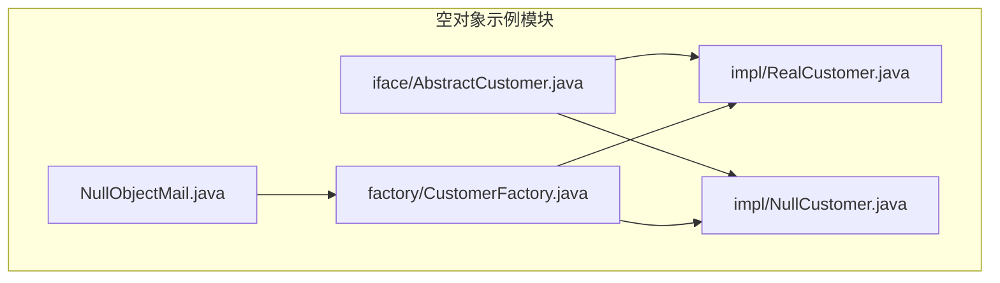
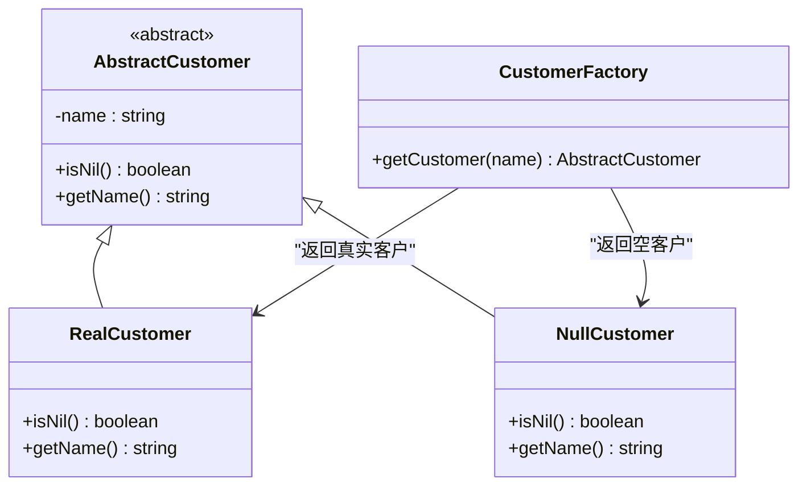
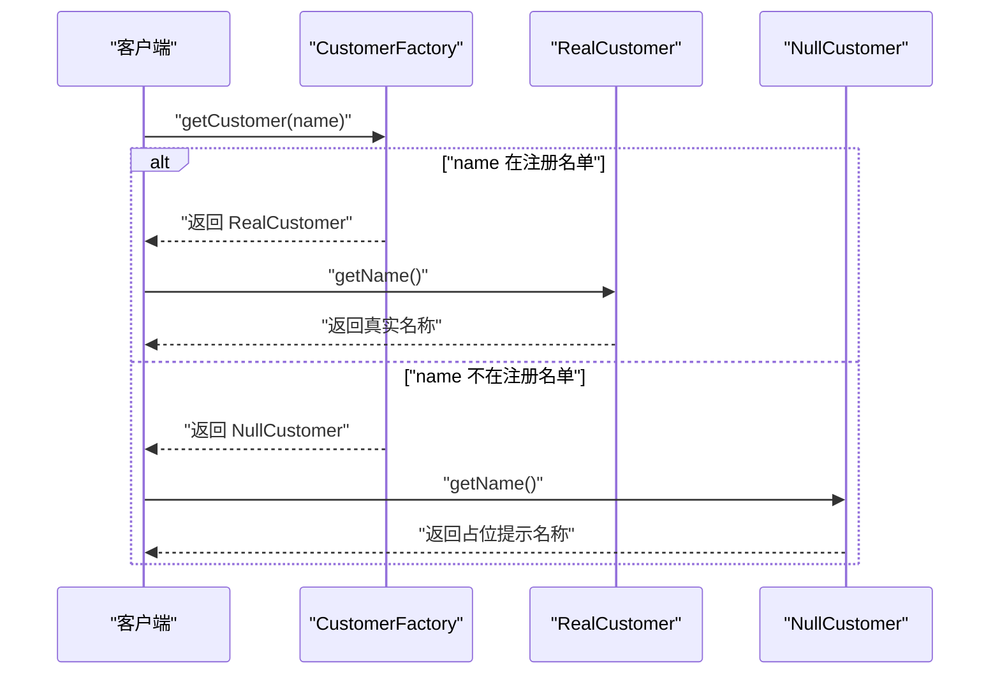
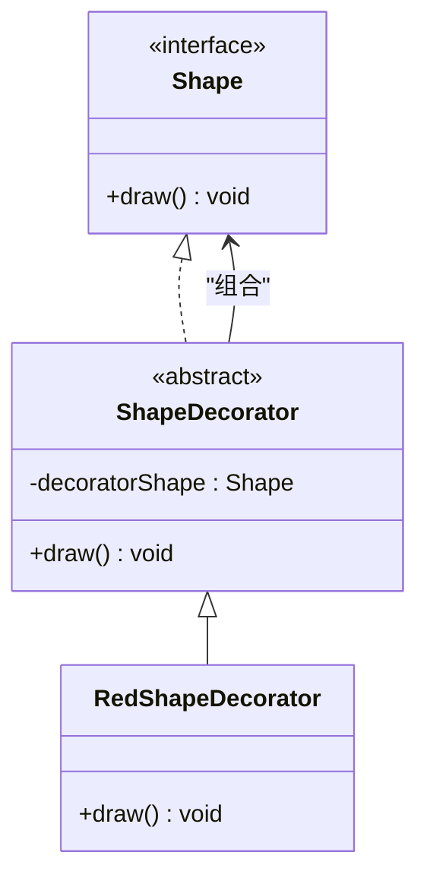
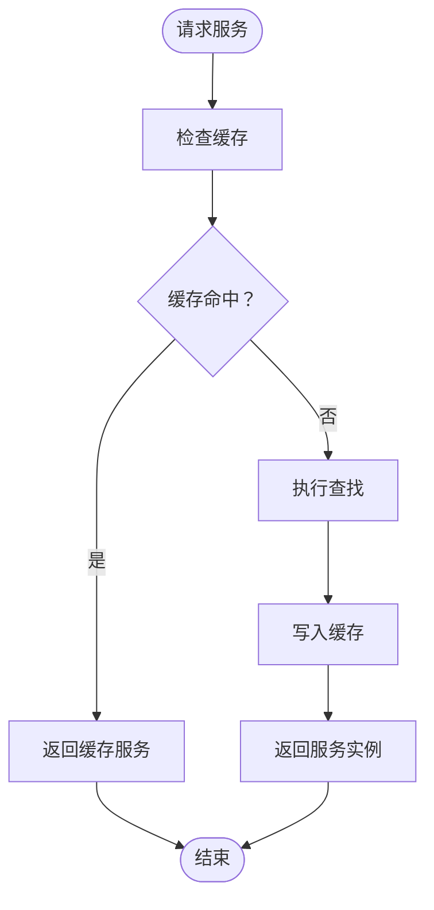
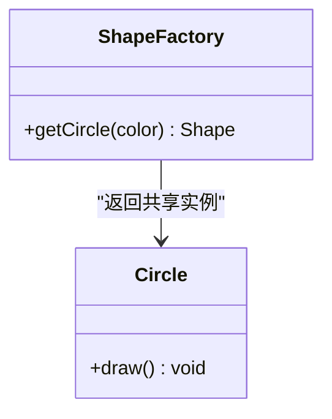
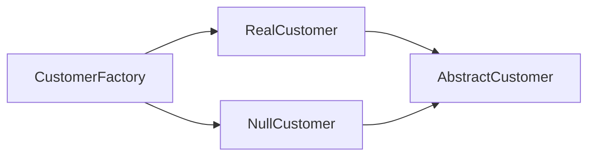

# 空对象模式

<cite>
**本文引用的文件**
- [AbstractCustomer.java](file://behavioral/nullobject/src/main/java/com/future/rocket/gof23/nullobject/iface/AbstractCustomer.java)
- [RealCustomer.java](file://behavioral/nullobject/src/main/java/com/future/rocket/gof23/nullobject/impl/RealCustomer.java)
- [NullCustomer.java](file://behavioral/nullobject/src/main/java/com/future/rocket/gof23/nullobject/impl/NullCustomer.java)
- [CustomerFactory.java](file://behavioral/nullobject/src/main/java/com/future/rocket/gof23/nullobject/factory/CustomerFactory.java)
- [NullObjectMail.java](file://behavioral/nullobject/src/main/java/com/future/rocket/gof23/nullobject/NullObjectMail.java)
- [readme.md](file://behavioral/nullobject/readme.md)
- [ShapeDecorator.java](file://structural/decorator/src/main/java/com/future/rocket/gof23/decorator/struct/ShapeDecorator.java)
- [RedShapeDecorator.java](file://structural/decorator/src/main/java/com/future/rocket/gof23/decorator/struct/RedShapeDecorator.java)
- [Shape.java](file://structural/decorator/src/main/java/com/future/rocket/gof23/decorator/iface/Shape.java)
- [ServiceLocator.java](file://structural/serviceLocator/src/main/java/com/future/rocket/gof23/service/locator/ServiceLocator.java)
- [ShapeFactory.java](file://structural/flyweight/src/main/java/com/future/rocket/gof23/flyweight/factory/ShapeFactory.java)
</cite>

## 目录
1. [引言](#引言)
2. [项目结构](#项目结构)
3. [核心组件](#核心组件)
4. [架构总览](#架构总览)
5. [详细组件分析](#详细组件分析)
6. [依赖分析](#依赖分析)
7. [性能考量](#性能考量)
8. [故障排查指南](#故障排查指南)
9. [结论](#结论)
10. [附录](#附录)

## 引言
本文件围绕空对象模式展开，系统阐述其设计理念与工程实践：以“零成本的空对象”替代 null 引用，提供统一的对象接口，避免空指针异常；并通过客户管理示例（抽象客户、真实客户、空客户与工厂）展示完整实现；进一步讨论在缓存系统、集合操作、装饰器模式与依赖注入中的应用；最后给出职责定义、扩展策略、与传统 null 检查的权衡分析，并为初学者与专家分别提供入门指导与深度优化建议。

## 项目结构
空对象模式示例位于 behavioral/nullobject 模块，采用分层组织：
- iface：抽象客户接口/基类
- impl：真实客户与空客户实现
- factory：客户工厂，负责根据注册名单返回真实或空对象
- NullObjectMail：演示入口，展示统一接口带来的简洁调用

**图示来源**
- [AbstractCustomer.java:1-8](file://behavioral/nullobject/src/main/java/com/future/rocket/gof23/nullobject/iface/AbstractCustomer.java#L1-L8)
- [RealCustomer.java:1-21](file://behavioral/nullobject/src/main/java/com/future/rocket/gof23/nullobject/impl/RealCustomer.java#L1-L21)
- [NullCustomer.java:1-21](file://behavioral/nullobject/src/main/java/com/future/rocket/gof23/nullobject/impl/NullCustomer.java#L1-L21)
- [CustomerFactory.java:1-22](file://behavioral/nullobject/src/main/java/com/future/rocket/gof23/nullobject/factory/CustomerFactory.java#L1-L22)
- [NullObjectMail.java:1-24](file://behavioral/nullobject/src/main/java/com/future/rocket/gof23/nullobject/NullObjectMail.java#L1-L24)

**章节来源**
- [readme.md:1-17](file://behavioral/nullobject/readme.md#L1-L17)

## 核心组件
- 抽象客户基类：定义统一接口（如名称获取、是否为空判断），确保子类与空对象具备一致行为契约。
- 真实客户：承载业务数据与行为，isNil 返回 false，getName 返回实际名称。
- 空客户：提供“无操作/默认行为”，isNil 返回 true，getName 返回占位提示信息，避免 null。
- 客户工厂：根据注册名单决定返回真实客户还是空客户，隐藏客户端对 null 的处理逻辑。
- 演示入口：通过工厂获取客户并直接调用 getName，无需判空。

上述组件共同实现“零成本空对象”：调用方无需分支判断，接口稳定统一，异常风险降低。

**章节来源**
- [AbstractCustomer.java:1-8](file://behavioral/nullobject/src/main/java/com/future/rocket/gof23/nullobject/iface/AbstractCustomer.java#L1-L8)
- [RealCustomer.java:1-21](file://behavioral/nullobject/src/main/java/com/future/rocket/gof23/nullobject/impl/RealCustomer.java#L1-L21)
- [NullCustomer.java:1-21](file://behavioral/nullobject/src/main/java/com/future/rocket/gof23/nullobject/impl/NullCustomer.java#L1-L21)
- [CustomerFactory.java:1-22](file://behavioral/nullobject/src/main/java/com/future/rocket/gof23/nullobject/factory/CustomerFactory.java#L1-L22)
- [NullObjectMail.java:1-24](file://behavioral/nullobject/src/main/java/com/future/rocket/gof23/nullobject/NullObjectMail.java#L1-L24)

## 架构总览
空对象模式在本仓库中的落地体现为“工厂 + 抽象基类 + 实现类 + 空对象”的分层架构。工厂屏蔽外部对 null 的感知，客户端只面向抽象接口编程，从而获得一致的调用体验。

**图示来源**
- [AbstractCustomer.java:1-8](file://behavioral/nullobject/src/main/java/com/future/rocket/gof23/nullobject/iface/AbstractCustomer.java#L1-L8)
- [RealCustomer.java:1-21](file://behavioral/nullobject/src/main/java/com/future/rocket/gof23/nullobject/impl/RealCustomer.java#L1-L21)
- [NullCustomer.java:1-21](file://behavioral/nullobject/src/main/java/com/future/rocket/gof23/nullobject/impl/NullCustomer.java#L1-L21)
- [CustomerFactory.java:1-22](file://behavioral/nullobject/src/main/java/com/future/rocket/gof23/nullobject/factory/CustomerFactory.java#L1-L22)

## 详细组件分析

### 客户管理实现（抽象、真实、空与工厂）
- 抽象基类：定义 isNil 与 getName 的统一契约，确保客户端调用一致性。
- 真实客户：isNil 返回 false，getName 返回真实名称，体现“有数据”的状态。
- 空客户：isNil 返回 true，getName 返回带提示的占位字符串，体现“无数据但可安全使用”的状态。
- 工厂：维护注册名单，命中则返回真实客户，否则返回空客户，对外屏蔽 null。

**图示来源**
- [CustomerFactory.java:1-22](file://behavioral/nullobject/src/main/java/com/future/rocket/gof23/nullobject/factory/CustomerFactory.java#L1-L22)
- [RealCustomer.java:1-21](file://behavioral/nullobject/src/main/java/com/future/rocket/gof23/nullobject/impl/RealCustomer.java#L1-L21)
- [NullCustomer.java:1-21](file://behavioral/nullobject/src/main/java/com/future/rocket/gof23/nullobject/impl/NullCustomer.java#L1-L21)

**章节来源**
- [AbstractCustomer.java:1-8](file://behavioral/nullobject/src/main/java/com/future/rocket/gof23/nullobject/iface/AbstractCustomer.java#L1-L8)
- [RealCustomer.java:1-21](file://behavioral/nullobject/src/main/java/com/future/rocket/gof23/nullobject/impl/RealCustomer.java#L1-L21)
- [NullCustomer.java:1-21](file://behavioral/nullobject/src/main/java/com/future/rocket/gof23/nullobject/impl/NullCustomer.java#L1-L21)
- [CustomerFactory.java:1-22](file://behavioral/nullobject/src/main/java/com/future/rocket/gof23/nullobject/factory/CustomerFactory.java#L1-L22)
- [NullObjectMail.java:1-24](file://behavioral/nullobject/src/main/java/com/future/rocket/gof23/nullobject/NullObjectMail.java#L1-L24)

### 装饰器模式中的空对象思想
装饰器模式通过组合“被装饰对象”实现行为增强。空对象思想可应用于装饰器链：当某一层不需要增强时，可用“空装饰器”替代，保持链路统一且避免判空。

**图示来源**
- [Shape.java:1-6](file://structural/decorator/src/main/java/com/future/rocket/gof23/decorator/iface/Shape.java#L1-L6)
- [ShapeDecorator.java:1-13](file://structural/decorator/src/main/java/com/future/rocket/gof23/decorator/struct/ShapeDecorator.java#L1-L13)
- [RedShapeDecorator.java:1-21](file://structural/decorator/src/main/java/com/future/rocket/gof23/decorator/struct/RedShapeDecorator.java#L1-L21)

**章节来源**
- [ShapeDecorator.java:1-13](file://structural/decorator/src/main/java/com/future/rocket/gof23/decorator/struct/ShapeDecorator.java#L1-L13)
- [RedShapeDecorator.java:1-21](file://structural/decorator/src/main/java/com/future/rocket/gof23/decorator/struct/RedShapeDecorator.java#L1-L21)
- [Shape.java:1-6](file://structural/decorator/src/main/java/com/future/rocket/gof23/decorator/iface/Shape.java#L1-L6)

### 依赖注入与服务定位中的空对象思想
服务定位器在缓存未命中时进行查找并写入缓存。空对象思想可演进为“空服务”或“默认服务”：当无法解析到具体服务时，返回一个不执行任何副作用的空服务对象，保证上层调用稳定。

**图示来源**
- [ServiceLocator.java:1-28](file://structural/serviceLocator/src/main/java/com/future/rocket/gof23/service/locator/ServiceLocator.java#L1-L28)

**章节来源**
- [ServiceLocator.java:1-28](file://structural/serviceLocator/src/main/java/com/future/rocket/gof23/service/locator/ServiceLocator.java#L1-L28)

### 飞享模式（享元）与空对象的协同
享元工厂通过共享内部状态减少对象数量。若需要表达“不存在的享元”，可返回一个“空享元”对象，保持工厂接口稳定，避免调用方判空。

**图示来源**
- [ShapeFactory.java:1-18](file://structural/flyweight/src/main/java/com/future/rocket/gof23/flyweight/factory/ShapeFactory.java#L1-L18)

**章节来源**
- [ShapeFactory.java:1-18](file://structural/flyweight/src/main/java/com/future/rocket/gof23/flyweight/factory/ShapeFactory.java#L1-L18)

## 依赖分析
- 组件内聚：空对象示例内部高度内聚，抽象与实现分离清晰，工厂仅承担创建职责。
- 外部耦合：工厂依赖注册名单（静态列表），在实际工程中可替换为配置中心或数据库查询。
- 可能的循环依赖：当前结构无循环依赖，抽象与实现单向依赖，工厂对实现类的依赖属于控制反转。

**图示来源**
- [CustomerFactory.java:1-22](file://behavioral/nullobject/src/main/java/com/future/rocket/gof23/nullobject/factory/CustomerFactory.java#L1-L22)
- [RealCustomer.java:1-21](file://behavioral/nullobject/src/main/java/com/future/rocket/gof23/nullobject/impl/RealCustomer.java#L1-L21)
- [NullCustomer.java:1-21](file://behavioral/nullobject/src/main/java/com/future/rocket/gof23/nullobject/impl/NullCustomer.java#L1-L21)
- [AbstractCustomer.java:1-8](file://behavioral/nullobject/src/main/java/com/future/rocket/gof23/nullobject/iface/AbstractCustomer.java#L1-L8)

## 性能考量
- 判空 vs 空对象
  - 传统 null 检查：每次调用前需分支判断，增加分支预测开销与代码复杂度。
  - 空对象：调用方无需判空，减少分支与异常处理成本，提升调用路径的一致性与可预测性。
- 对象创建
  - 空对象通常轻量且可复用，避免频繁创建与 GC 压力。
  - 工厂模式可结合缓存策略，进一步降低重复创建成本。
- 计算与 I/O
  - 空对象的 isNil 与 getName 为常量时间操作，对整体性能影响极小。
  - 在高并发场景，建议将空对象作为单例或池化对象使用，减少分配次数。

[本节为通用性能讨论，不直接分析具体文件]

## 故障排查指南
- 常见问题
  - 忘记在工厂中处理未注册名称，导致返回空对象但业务期望异常。
  - 空对象 getName 返回占位信息，但调用方误以为是真实数据。
- 排查步骤
  - 在工厂层打印日志，确认分支逻辑与返回类型。
  - 在调用端区分 isNil 语义，必要时记录日志或抛出业务异常。
  - 对于装饰器链或服务定位器，检查空服务/空装饰器是否正确插入，避免破坏链路。

**章节来源**
- [CustomerFactory.java:1-22](file://behavioral/nullobject/src/main/java/com/future/rocket/gof23/nullobject/factory/CustomerFactory.java#L1-L22)
- [NullCustomer.java:1-21](file://behavioral/nullobject/src/main/java/com/future/rocket/gof23/nullobject/impl/NullCustomer.java#L1-L21)

## 结论
空对象模式通过“零成本空对象”替代 null，提供统一接口与稳定行为，显著降低空指针风险与判空成本。在客户管理示例中，工厂屏蔽了 null 的存在，客户端只需面向抽象接口编程。该模式同样适用于装饰器链、服务定位器与享元工厂等场景。实践中应结合业务语义定义空对象职责，合理选择是否引入空对象，并在高并发与性能敏感场景中进行对象复用与缓存优化。

[本节为总结，不直接分析具体文件]

## 附录

### 空对象的职责定义与扩展策略
- 职责定义
  - 提供“无操作/默认行为”，确保调用安全且不产生副作用。
  - 明确标识自身为“空对象”（如 isNil 返回 true），便于上层决策。
- 扩展策略
  - 单例化空对象，减少内存占用与 GC 压力。
  - 将空对象与工厂/缓存结合，形成“空对象池”。
  - 在装饰器链中引入“空装饰器”，保持链路一致性。

[本节为概念性内容，不直接分析具体文件]

### 与传统 null 检查的权衡
- 优点
  - 空对象：减少分支与异常处理，提升可读性与稳定性。
  - null：语义明确，但在调用侧需要大量判空逻辑。
- 成本
  - 空对象：少量对象创建与方法调用开销。
  - null：分支预测失败与潜在异常处理成本。
- 适用场景
  - 高频调用且必须稳定的接口优先采用空对象。
  - 低频调用或强语义的可空值可保留 null 并配合严格注解与测试。

[本节为通用权衡分析，不直接分析具体文件]