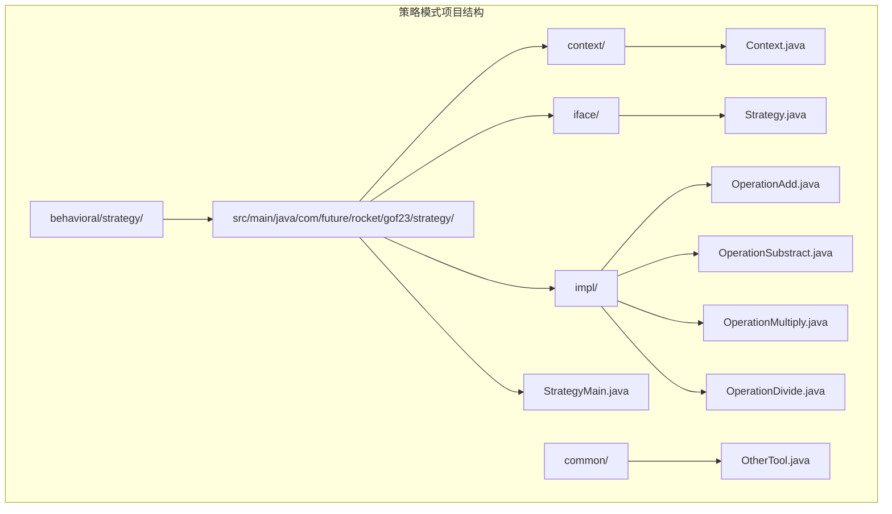
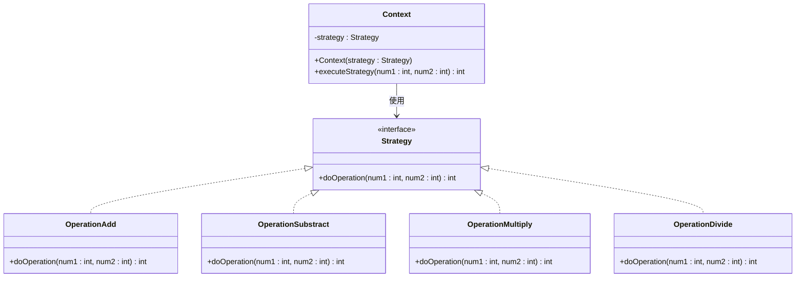
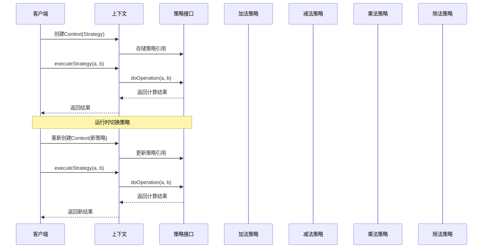
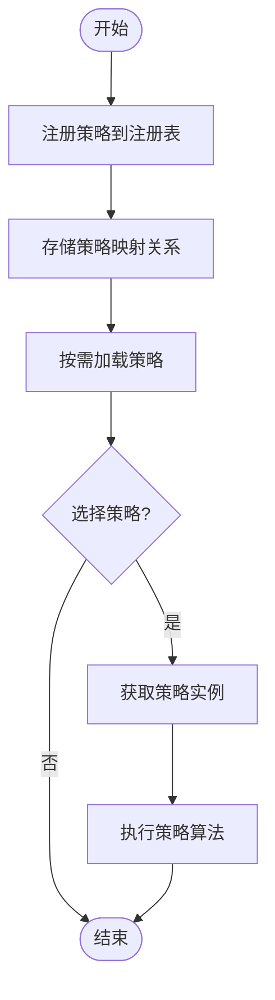
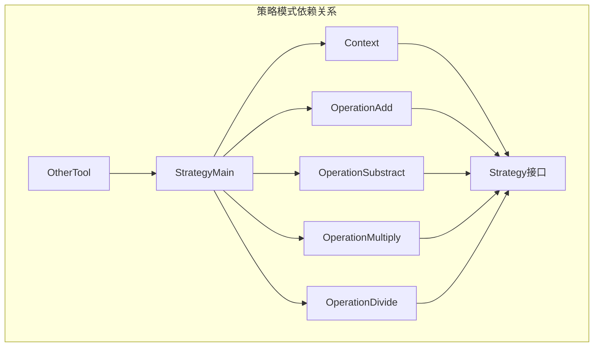

# 策略模式

<cite>
**本文档引用的文件**
- [StrategyMain.java](file://behavioral/strategy/src/main/java/com/future/rocket/gof23/strategy/StrategyMain.java)
- [Context.java](file://behavioral/strategy/src/main/java/com/future/rocket/gof23/strategy/context/Context.java)
- [Strategy.java](file://behavioral/strategy/src/main/java/com/future/rocket/gof23/strategy/iface/Strategy.java)
- [OperationAdd.java](file://behavioral/strategy/src/main/java/com/future/rocket/gof23/strategy/impl/OperationAdd.java)
- [OperationSubstract.java](file://behavioral/strategy/src/main/java/com/future/rocket/gof23/strategy/impl/OperationSubstract.java)
- [OperationMultiply.java](file://behavioral/strategy/src/main/java/com/future/rocket/gof23/strategy/impl/OperationMultiply.java)
- [OperationDivide.java](file://behavioral/strategy/src/main/java/com/future/rocket/gof23/strategy/impl/OperationDivide.java)
- [OtherTool.java](file://common/src/main/java/com/future/rocket/gof23/common/OtherTool.java)
- [readme.md](file://behavioral/strategy/readme.md)
</cite>

## 目录
1. [引言](#引言)
2. [项目结构](#项目结构)
3. [核心组件](#核心组件)
4. [架构概览](#架构概览)
5. [详细组件分析](#详细组件分析)
6. [依赖分析](#依赖分析)
7. [性能考虑](#性能考虑)
8. [故障排除指南](#故障排除指南)
9. [结论](#结论)
10. [附录](#附录)

## 引言

策略模式是GoF设计模式中的一种行为型模式，它允许在运行时选择不同的算法或行为，而无需修改使用算法的上下文类。这种模式将算法的定义和使用分离，使得代码更加灵活和易于维护。

在本项目中，我们通过一个简单的数学运算系统来演示策略模式的核心思想：定义一系列算法，把它们一个个封装起来，并且使它们可以相互替换。这个系统包含了策略接口、具体算法实现和上下文类的协调机制。

## 项目结构

策略模式示例项目采用标准的Java包结构组织，主要包含以下目录结构：

**图表来源**
- [StrategyMain.java:1-32](file://behavioral/strategy/src/main/java/com/future/rocket/gof23/strategy/StrategyMain.java#L1-L32)
- [Context.java:1-16](file://behavioral/strategy/src/main/java/com/future/rocket/gof23/strategy/context/Context.java#L1-L16)
- [Strategy.java:1-6](file://behavioral/strategy/src/main/java/com/future/rocket/gof23/strategy/iface/Strategy.java#L1-L6)

**章节来源**
- [StrategyMain.java:1-32](file://behavioral/strategy/src/main/java/com/future/rocket/gof23/strategy/StrategyMain.java#L1-L32)
- [readme.md:1-20](file://behavioral/strategy/readme.md#L1-L20)

## 核心组件

策略模式由三个核心组件构成，每个组件都有明确的职责分工：

### 策略接口（Strategy Interface）
策略接口定义了所有具体策略类必须实现的公共接口。它是算法的抽象定义，确保不同算法之间的一致性。

### 具体策略类（Concrete Strategy Classes）
具体策略类实现了策略接口，提供不同的算法实现。每个策略类都封装了一个特定的算法逻辑。

### 上下文类（Context Class）
上下文类持有策略接口的引用，根据具体策略执行相应的算法。它负责协调策略的选择和执行。

**章节来源**
- [Strategy.java:1-6](file://behavioral/strategy/src/main/java/com/future/rocket/gof23/strategy/iface/Strategy.java#L1-L6)
- [Context.java:1-16](file://behavioral/strategy/src/main/java/com/future/rocket/gof23/strategy/context/Context.java#L1-L16)

## 架构概览

策略模式的整体架构体现了"算法封装"和"运行时选择"的设计理念：

**图表来源**
- [Strategy.java:1-6](file://behavioral/strategy/src/main/java/com/future/rocket/gof23/strategy/iface/Strategy.java#L1-L6)
- [Context.java:1-16](file://behavioral/strategy/src/main/java/com/future/rocket/gof23/strategy/context/Context.java#L1-L16)
- [OperationAdd.java:1-12](file://behavioral/strategy/src/main/java/com/future/rocket/gof23/strategy/impl/OperationAdd.java#L1-L12)
- [OperationSubstract.java:1-11](file://behavioral/strategy/src/main/java/com/future/rocket/gof23/strategy/impl/OperationSubstract.java#L1-L11)
- [OperationMultiply.java:1-11](file://behavioral/strategy/src/main/java/com/future/rocket/gof23/strategy/impl/OperationMultiply.java#L1-L11)
- [OperationDivide.java:1-15](file://behavioral/strategy/src/main/java/com/future/rocket/gof23/strategy/impl/OperationDivide.java#L1-L15)

## 详细组件分析

### 数学运算系统的实现

数学运算系统是策略模式的经典应用场景，展示了如何将不同的数学运算封装为独立的策略：

#### 策略接口设计
策略接口定义了统一的算法调用方法，确保所有具体策略都遵循相同的行为规范。

#### 具体算法实现
四个具体的数学运算策略分别实现了加法、减法、乘法和除法运算：

**加法策略（OperationAdd）**
- 实现两个数的加法运算
- 返回num1 + num2的结果

**减法策略（OperationSubstract）**
- 实现两个数的减法运算  
- 返回num1 - num2的结果

**乘法策略（OperationMultiply）**
- 实现两个数的乘法运算
- 返回num1 * num2的结果

**除法策略（OperationDivide）**
- 实现两个数的除法运算
- 包含除零异常处理机制

#### 上下文类协调机制
Context类作为策略的协调者，负责：
- 接收并存储具体的策略实例
- 提供统一的算法执行接口
- 将具体的计算任务委托给当前策略

**章节来源**
- [OperationAdd.java:1-12](file://behavioral/strategy/src/main/java/com/future/rocket/gof23/strategy/impl/OperationAdd.java#L1-L12)
- [OperationSubstract.java:1-11](file://behavioral/strategy/src/main/java/com/future/rocket/gof23/strategy/impl/OperationSubstract.java#L1-L11)
- [OperationMultiply.java:1-11](file://behavioral/strategy/src/main/java/com/future/rocket/gof23/strategy/impl/OperationMultiply.java#L1-L11)
- [OperationDivide.java:1-15](file://behavioral/strategy/src/main/java/com/future/rocket/gof23/strategy/impl/OperationDivide.java#L1-L15)
- [Context.java:1-16](file://behavioral/strategy/src/main/java/com/future/rocket/gof23/strategy/context/Context.java#L1-L16)

### 算法选择和切换流程

策略模式的核心优势在于能够在运行时动态选择和切换算法。以下是完整的算法选择流程：

**图表来源**
- [StrategyMain.java:16-29](file://behavioral/strategy/src/main/java/com/future/rocket/gof23/strategy/StrategyMain.java#L16-L29)
- [Context.java:12-14](file://behavioral/strategy/src/main/java/com/future/rocket/gof23/strategy/context/Context.java#L12-L14)

### 策略注册和动态加载机制

虽然当前示例使用静态构造函数进行策略注入，但策略模式天然支持更灵活的注册和动态加载机制：

#### 策略注册表模式

#### 动态加载策略
- 基于配置文件的策略加载
- 反射机制自动发现策略类
- 策略缓存和复用机制

### 性能比较和选择策略

不同算法的性能特征和适用场景：

| 算法类型 | 时间复杂度 | 空间复杂度 | 适用场景 | 性能特点 |
|---------|-----------|-----------|----------|----------|
| 加法运算 | O(1) | O(1) | 基础数值计算 | 最快，无溢出风险 |
| 减法运算 | O(1) | O(1) | 基础数值计算 | 快速，可能产生负数 |
| 乘法运算 | O(1) | O(1) | 基础数值计算 | 较慢，易溢出 |
| 除法运算 | O(1) | O(1) | 基础数值计算 | 需要异常处理 |

**章节来源**
- [StrategyMain.java:12-30](file://behavioral/strategy/src/main/java/com/future/rocket/gof23/strategy/StrategyMain.java#L12-L30)

## 依赖分析

策略模式的依赖关系体现了清晰的层次结构：

**图表来源**
- [StrategyMain.java:3-8](file://behavioral/strategy/src/main/java/com/future/rocket/gof23/strategy/StrategyMain.java#L3-L8)
- [Context.java](file://behavioral/strategy/src/main/java/com/future/rocket/gof23/strategy/context/Context.java#L3)
- [Strategy.java:1-6](file://behavioral/strategy/src/main/java/com/future/rocket/gof23/strategy/iface/Strategy.java#L1-L6)

**章节来源**
- [StrategyMain.java:1-32](file://behavioral/strategy/src/main/java/com/future/rocket/gof23/strategy/StrategyMain.java#L1-L32)
- [Context.java:1-16](file://behavioral/strategy/src/main/java/com/future/rocket/gof23/strategy/context/Context.java#L1-L16)

## 性能考虑

### 算法性能优化
- **常量时间复杂度**：所有数学运算都是O(1)，性能稳定
- **内存效率**：策略对象轻量级，无额外内存开销
- **缓存友好**：策略对象可复用，减少GC压力

### 扩展性考虑
- **算法扩展**：新增算法只需实现Strategy接口
- **上下文扩展**：Context类可支持多参数算法
- **组合策略**：可通过组合多个策略实现复杂算法

## 故障排除指南

### 常见问题及解决方案

#### 除零异常处理
除法策略包含除零保护机制，防止运行时异常：

**问题症状**：执行除法运算时抛出ArithmeticException
**解决方案**：检查除数是否为零，在调用前进行验证

#### 类型转换问题
当处理不同数据类型时可能出现精度丢失：

**问题症状**：浮点数运算结果不准确
**解决方案**：使用BigDecimal进行高精度计算

#### 内存泄漏风险
策略对象生命周期管理不当可能导致内存泄漏：

**预防措施**：
- 及时释放不再使用的策略引用
- 使用弱引用管理策略缓存
- 避免在策略中持有外部对象的强引用

**章节来源**
- [OperationDivide.java:9-11](file://behavioral/strategy/src/main/java/com/future/rocket/gof23/strategy/impl/OperationDivide.java#L9-L11)

## 结论

策略模式通过将算法封装为独立的策略类，实现了算法的可插拔性和可扩展性。在数学运算系统中，策略模式展现了其在以下方面的优势：

1. **灵活性**：可以在运行时动态选择和切换算法
2. **可维护性**：算法变更不影响客户端代码
3. **可测试性**：每个算法都可以独立测试
4. **可扩展性**：轻松添加新的算法实现

对于初学者，建议从简单的算法封装开始，逐步掌握策略模式的核心概念；对于专家开发者，可以探索策略模式与工厂模式的结合使用，以及更复杂的动态策略调整机制。

## 附录

### 策略模式的应用场景

策略模式适用于以下场景：

#### 排序算法选择
- 快速排序、归并排序、堆排序等算法的动态选择
- 根据数据规模和特征选择最优排序策略

#### 支付方式选择
- 支付宝、微信支付、银联支付等支付方式的切换
- 根据用户偏好和业务规则选择支付策略

#### 压缩算法选择
- ZIP、GZIP、BZIP2等压缩算法的动态选择
- 根据文件类型和压缩需求选择合适算法

#### 缓存策略
- LRU、LFU、FIFO等缓存淘汰算法的实现
- 根据访问模式和内存限制选择最优缓存策略

### 学习路径建议

#### 初学者路径
1. 理解策略模式的基本概念和核心思想
2. 分析简单的数学运算示例
3. 实现基本的策略接口和具体策略类
4. 掌握上下文类的使用方法

#### 进阶学习路径
1. 探索策略模式与工厂模式的结合使用
2. 研究动态策略注册和加载机制
3. 分析复杂算法族的管理和调度
4. 学习性能优化和最佳实践

#### 专家级应用
1. 设计可扩展的策略框架
2. 实现智能策略选择和自适应算法
3. 探索分布式环境下的策略管理
4. 研究策略模式在机器学习和AI领域的应用