# 行为型模式详解

<cite>
**本文引用的文件**
- [behavioral/chain/src/main/java/com/future/rocket/gof23/chain/behavior/AbstractLogger.java](file://behavioral/chain/src/main/java/com/future/rocket/gof23/chain/behavior/AbstractLogger.java)
- [behavioral/chain/src/main/java/com/future/rocket/gof23/chain/impl/ConsoleLogger.java](file://behavioral/chain/src/main/java/com/future/rocket/gof23/chain/impl/ConsoleLogger.java)
- [behavioral/chain/src/main/java/com/future/rocket/gof23/chain/impl/ErrorLogger.java](file://behavioral/chain/src/main/java/com/future/rocket/gof23/chain/impl/ErrorLogger.java)
- [behavioral/chain/src/main/java/com/future/rocket/gof23/chain/impl/FileLogger.java](file://behavioral/chain/src/main/java/com/future/rocket/gof23/chain/impl/FileLogger.java)
- [behavioral/command/src/main/java/com/future/rocket/gof23/command/iface/Order.java](file://behavioral/command/src/main/java/com/future/rocket/gof23/command/iface/Order.java)
- [behavioral/command/src/main/java/com/future/rocket/gof23/command/impl/BuyStock.java](file://behavioral/command/src/main/java/com/future/rocket/gof23/command/impl/BuyStock.java)
- [behavioral/command/src/main/java/com/future/rocket/gof23/command/impl/SellStock.java](file://behavioral/command/src/main/java/com/future/rocket/gof23/command/impl/SellStock.java)
- [behavioral/command/src/main/java/com/future/rocket/gof23/command/invoker/Broker.java](file://behavioral/command/src/main/java/com/future/rocket/gof23/command/invoker/Broker.java)
- [behavioral/command/src/main/java/com/future/rocket/gof23/command/receiver/Stock.java](file://behavioral/command/src/main/java/com/future/rocket/gof23/command/receiver/Stock.java)
- [behavioral/interpreter/src/main/java/com/future/rocket/gof23/interpreter/iface/Expression.java](file://behavioral/interpreter/src/main/java/com/future/rocket/gof23/interpreter/iface/Expression.java)
- [behavioral/interpreter/src/main/java/com/future/rocket/gof23/interpreter/impl/TerminalExpression.java](file://behavioral/interpreter/src/main/java/com/future/rocket/gof23/interpreter/impl/TerminalExpression.java)
- [behavioral/interpreter/src/main/java/com/future/rocket/gof23/interpreter/impl/AndExpression.java](file://behavioral/interpreter/src/main/java/com/future/rocket/gof23/interpreter/impl/AndExpression.java)
- [behavioral/interpreter/src/main/java/com/future/rocket/gof23/interpreter/impl/OrExpression.java](file://behavioral/interpreter/src/main/java/com/future/rocket/gof23/interpreter/impl/OrExpression.java)
- [behavioral/iterator/src/main/java/com/future/rocket/gof23/iterator/iface/Aggregate.java](file://behavioral/iterator/src/main/java/com/future/rocket/gof23/iterator/iface/Aggregate.java)
- [behavioral/iterator/src/main/java/com/future/rocket/gof23/iterator/iface/Iterator.java](file://behavioral/iterator/src/main/java/com/future/rocket/gof23/iterator/iface/Iterator.java)
- [behavioral/iterator/src/main/java/com/future/rocket/gof23/iterator/impl/ConcreteAggregate.java](file://behavioral/iterator/src/main/java/com/future/rocket/gof23/iterator/impl/ConcreteAggregate.java)
- [behavioral/iterator/src/main/java/com/future/rocket/gof23/iterator/impl/CommonIteratorImpl.java](file://behavioral/iterator/src/main/java/com/future/rocket/gof23/iterator/impl/CommonIteratorImpl.java)
- [behavioral/mediator/src/main/java/com/future/rocket/gof23/mediator/colleague/User.java](file://behavioral/mediator/src/main/java/com/future/rocket/gof23/mediator/colleague/User.java)
- [behavioral/mediator/src/main/java/com/future/rocket/gof23/mediator/colleague/XUser.java](file://behavioral/mediator/src/main/java/com/future/rocket/gof23/mediator/colleague/XUser.java)
- [behavioral/mediator/src/main/java/com/future/rocket/gof23/mediator/iface/ChatMediator.java](file://behavioral/mediator/src/main/java/com/future/rocket/gof23/mediator/iface/ChatMediator.java)
- [behavioral/mediator/src/main/java/com/future/rocket/gof23/mediator/impl/ChatRoom.java](file://behavioral/mediator/src/main/java/com/future/rocket/gof23/mediator/impl/ChatRoom.java)
- [behavioral/memento/src/main/java/com/future/rocket/gof23/memento/Memento.java](file://behavioral/memento/src/main/java/com/future/rocket/gof23/memento/Memento.java)
- [behavioral/memento/src/main/java/com/future/rocket/gof23/memento/Originator.java](file://behavioral/memento/src/main/java/com/future/rocket/gof23/memento/Originator.java)
- [behavioral/memento/src/main/java/com/future/rocket/gof23/memento/Caretaker.java](file://behavioral/memento/src/main/java/com/future/rocket/gof23/memento/Caretaker.java)
- [behavioral/mvc/src/main/java/com/future/rocket/gof23/mvc/model/Student.java](file://behavioral/mvc/src/main/java/com/future/rocket/gof23/mvc/model/Student.java)
- [behavioral/mvc/src/main/java/com/future/rocket/gof23/mvc/view/StudentView.java](file://behavioral/mvc/src/main/java/com/future/rocket/gof23/mvc/view/StudentView.java)
- [behavioral/mvc/src/main/java/com/future/rocket/gof23/mvc/controller/StudentController.java](file://behavioral/mvc/src/main/java/com/future/rocket/gof23/mvc/controller/StudentController.java)
- [behavioral/nullobject/src/main/java/com/future/rocket/gof23/nullobject/iface/AbstractCustomer.java](file://behavioral/nullobject/src/main/java/com/future/rocket/gof23/nullobject/iface/AbstractCustomer.java)
- [behavioral/nullobject/src/main/java/com/future/rocket/gof23/nullobject/impl/NullCustomer.java](file://behavioral/nullobject/src/main/java/com/future/rocket/gof23/nullobject/impl/NullCustomer.java)
- [behavioral/nullobject/src/main/java/com/future/rocket/gof23/nullobject/impl/RealCustomer.java](file://behavioral/nullobject/src/main/java/com/future/rocket/gof23/nullobject/impl/RealCustomer.java)
- [behavioral/nullobject/src/main/java/com/future/rocket/gof23/nullobject/factory/CustomerFactory.java](file://behavioral/nullobject/src/main/java/com/future/rocket/gof23/nullobject/factory/CustomerFactory.java)
- [behavioral/observer/src/main/java/com/future/rocket/gof23/observer/impl1/Subject.java](file://behavioral/observer/src/main/java/com/future/rocket/gof23/observer/impl1/Subject.java)
- [behavioral/observer/src/main/java/com/future/rocket/gof23/observer/impl1/Observer.java](file://behavioral/observer/src/main/java/com/future/rocket/gof23/observer/impl1/Observer.java)
- [behavioral/observer/src/main/java/com/future/rocket/gof23/observer/impl1/BinaryObserver.java](file://behavioral/observer/src/main/java/com/future/rocket/gof23/observer/impl1/BinaryObserver.java)
- [behavioral/observer/src/main/java/com/future/rocket/gof23/observer/impl1/HexObserver.java](file://behavioral/observer/src/main/java/com/future/rocket/gof23/observer/impl1/HexObserver.java)
- [behavioral/observer/src/main/java/com/future/rocket/gof23/observer/impl1/OctalObserver.java](file://behavioral/observer/src/main/java/com/future/rocket/gof23/observer/impl1/OctalObserver.java)
- [behavioral/observer/src/main/java/com/future/rocket/gof23/observer/impl2/XSubject.java](file://behavioral/observer/src/main/java/com/future/rocket/gof23/observer/impl2/XSubject.java)
- [behavioral/observer/src/main/java/com/future/rocket/gof23/observer/impl2/XObserver.java](file://behavioral/observer/src/main/java/com/future/rocket/gof23/observer/impl2/XObserver.java)
- [behavioral/observer/src/main/java/com/future/rocket/gof23/observer/impl2/Subscriber.java](file://behavioral/observer/src/main/java/com/future/rocket/gof23/observer/impl2/Subscriber.java)
- [behavioral/observer/src/main/java/com/future/rocket/gof23/observer/impl2/NewsAgent.java](file://behavioral/observer/src/main/java/com/future/rocket/gof23/observer/impl2/NewsAgent.java)
- [behavioral/state/src/main/java/com/future/rocket/gof23/state/iface/State.java](file://behavioral/state/src/main/java/com/future/rocket/gof23/state/iface/State.java)
- [behavioral/state/src/main/java/com/future/rocket/gof23/state/impl/StartState.java](file://behavioral/state/src/main/java/com/future/rocket/gof23/state/impl/StartState.java)
- [behavioral/state/src/main/java/com/future/rocket/gof23/state/impl/StopState.java](file://behavioral/state/src/main/java/com/future/rocket/gof23/state/impl/StopState.java)
- [behavioral/state/src/main/java/com/future/rocket/gof23/state/impl/UpState.java](file://behavioral/state/src/main/java/com/future/rocket/gof23/state/impl/UpState.java)
- [behavioral/state/src/main/java/com/future/rocket/gof23/state/impl/DownState.java](file://behavioral/state/src/main/java/com/future/rocket/gof23/state/impl/DownState.java)
- [behavioral/state/src/main/java/com/future/rocket/gof23/state/impl/RunState.java](file://behavioral/state/src/main/java/com/future/rocket/gof23/state/impl/RunState.java)
- [behavioral/state/src/main/java/com/future/rocket/gof23/state/info/Context.java](file://behavioral/state/src/main/java/com/future/rocket/gof23/state/info/Context.java)
- [behavioral/strategy/src/main/java/com/future/rocket/gof23/strategy/context/Context.java](file://behavioral/strategy/src/main/java/com/future/rocket/gof23/strategy/context/Context.java)
- [behavioral/strategy/src/main/java/com/future/rocket/gof23/strategy/iface/Strategy.java](file://behavioral/strategy/src/main/java/com/future/rocket/gof23/strategy/iface/Strategy.java)
- [behavioral/strategy/src/main/java/com/future/rocket/gof23/strategy/impl/OperationAdd.java](file://behavioral/strategy/src/main/java/com/future/rocket/gof23/strategy/impl/OperationAdd.java)
- [behavioral/strategy/src/main/java/com/future/rocket/gof23/strategy/impl/OperationSubstract.java](file://behavioral/strategy/src/main/java/com/future/rocket/gof23/strategy/impl/OperationSubstract.java)
- [behavioral/strategy/src/main/java/com/future/rocket/gof23/strategy/impl/OperationMultiply.java](file://behavioral/strategy/src/main/java/com/future/rocket/gof23/strategy/impl/OperationMultiply.java)
- [behavioral/strategy/src/main/java/com/future/rocket/gof23/strategy/impl/OperationDivide.java](file://behavioral/strategy/src/main/java/com/future/rocket/gof23/strategy/impl/OperationDivide.java)
- [behavioral/template/src/main/java/com/future/rocket/gof23/template/abs/Game.java](file://behavioral/template/src/main/java/com/future/rocket/gof23/template/abs/Game.java)
- [behavioral/template/src/main/java/com/future/rocket/gof23/template/impl/Basketball.java](file://behavioral/template/src/main/java/com/future/rocket/gof23/template/impl/Basketball.java)
- [behavioral/template/src/main/java/com/future/rocket/gof23/template/impl/Football.java](file://behavioral/template/src/main/java/com/future/rocket/gof23/template/impl/Football.java)
- [behavioral/visitor/src/main/java/com/future/rocket/gof23/visitor/iface/ComputerPart.java](file://behavioral/visitor/src/main/java/com/future/rocket/gof23/visitor/iface/ComputerPart.java)
- [behavioral/visitor/src/main/java/com/future/rocket/gof23/visitor/iface/ComputerPartVisitor.java](file://behavioral/visitor/src/main/java/com/future/rocket/gof23/visitor/iface/ComputerPartVisitor.java)
- [behavioral/visitor/src/main/java/com/future/rocket/gof23/visitor/impl/Computer.java](file://behavioral/visitor/src/main/java/com/future/rocket/gof23/visitor/impl/Computer.java)
- [behavioral/visitor/src/main/java/com/future/rocket/gof23/visitor/impl/Keyboard.java](file://behavioral/visitor/src/main/java/com/future/rocket/gof23/visitor/impl/Keyboard.java)
- [behavioral/visitor/src/main/java/com/future/rocket/gof23/visitor/impl/Mouse.java](file://behavioral/visitor/src/main/java/com/future/rocket/gof23/visitor/impl/Mouse.java)
- [behavioral/visitor/src/main/java/com/future/rocket/gof23/visitor/impl/Monitor.java](file://behavioral/visitor/src/main/java/com/future/rocket/gof23/visitor/impl/Monitor.java)
- [behavioral/visitor/src/main/java/com/future/rocket/gof23/visitor/impl/ComputerPartDisplayVisitor.java](file://behavioral/visitor/src/main/java/com/future/rocket/gof23/visitor/impl/ComputerPartDisplayVisitor.java)
- [behavioral/businessDelegate/src/main/java/com/future/rocket/gof23/business/delegate/iface/BusinessService.java](file://behavioral/businessDelegate/src/main/java/com/future/rocket/gof23/business/delegate/iface/BusinessService.java)
- [behavioral/businessDelegate/src/main/java/com/future/rocket/gof23/business/delegate/impl/EJBService.java](file://behavioral/businessDelegate/src/main/java/com/future/rocket/gof23/business/delegate/impl/EJBService.java)
- [behavioral/businessDelegate/src/main/java/com/future/rocket/gof23/business/delegate/impl/JMSService.java](file://behavioral/businessDelegate/src/main/java/com/future/rocket/gof23/business/delegate/impl/JMSService.java)
- [behavioral/businessDelegate/src/main/java/com/future/rocket/gof23/business/delegate/enums/ServiceType.java](file://behavioral/businessDelegate/src/main/java/com/future/rocket/gof23/business/delegate/enums/ServiceType.java)
- [behavioral/businessDelegate/src/main/java/com/future/rocket/gof23/business/delegate/lookup/BusinessLookup.java](file://behavioral/businessDelegate/src/main/java/com/future/rocket/gof23/business/delegate/lookup/BusinessLookup.java)
- [behavioral/businessDelegate/src/main/java/com/future/rocket/gof23/business/delegate/delegate/BusinessDelegate.java](file://behavioral/businessDelegate/src/main/java/com/future/rocket/gof23/business/delegate/delegate/BusinessDelegate.java)
- [behavioral/businessDelegate/src/main/java/com/future/rocket/gof23/business/delegate/client/Client.java](file://behavioral/businessDelegate/src/main/java/com/future/rocket/gof23/business/delegate/client/Client.java)
- [behavioral/compositeEntity/src/main/java/com/future/rocket/gof23/composite/entity/composite/CompositeEntity.java](file://behavioral/compositeEntity/src/main/java/com/future/rocket/gof23/composite/entity/composite/CompositeEntity.java)
- [behavioral/compositeEntity/src/main/java/com/future/rocket/gof23/composite/entity/dependency/CoarseGrainedObject.java](file://behavioral/compositeEntity/src/main/java/com/future/rocket/gof23/composite/entity/dependency/CoarseGrainedObject.java)
- [behavioral/compositeEntity/src/main/java/com/future/rocket/gof23/composite/entity/dependency/DependentObject1.java](file://behavioral/compositeEntity/src/main/java/com/future/rocket/gof23/composite/entity/dependency/DependentObject1.java)
- [behavioral/compositeEntity/src/main/java/com/future/rocket/gof23/composite/entity/dependency/DependentObject2.java](file://behavioral/compositeEntity/src/main/java/com/future/rocket/gof23/composite/entity/dependency/DependentObject2.java)
- [behavioral/compositeEntity/src/main/java/com/future/rocket/gof23/composite/entity/client/Client.java](file://behavioral/compositeEntity/src/main/java/com/future/rocket/gof23/composite/entity/client/Client.java)
- [behavioral/interceptingFilter/src/main/java/com/future/rocket/gof23/interceptor/filter/iface/Filter.java](file://behavioral/interceptingFilter/src/main/java/com/future/rocket/gof23/interceptor/filter/iface/Filter.java)
- [behavioral/interceptingFilter/src/main/java/com/future/rocket/gof23/interceptor/filter/impl/AuthenticationFilter.java](file://behavioral/interceptingFilter/src/main/java/com/future/rocket/gof23/interceptor/filter/impl/AuthenticationFilter.java)
- [behavioral/interceptingFilter/src/main/java/com/future/rocket/gof23/interceptor/filter/impl/DebugFilter.java](file://behavioral/interceptingFilter/src/main/java/com/future/rocket/gof23/interceptor/filter/impl/DebugFilter.java)
- [behavioral/interceptingFilter/src/main/java/com/future/rocket/gof23/interceptor/filter/chain/FilterChain.java](file://behavioral/interceptingFilter/src/main/java/com/future/rocket/gof23/interceptor/filter/chain/FilterChain.java)
- [behavioral/interceptingFilter/src/main/java/com/future/rocket/gof23/interceptor/filter/manager/FilterManager.java](file://behavioral/interceptingFilter/src/main/java/com/future/rocket/gof23/interceptor/filter/manager/FilterManager.java)
- [behavioral/interceptingFilter/src/main/java/com/future/rocket/gof23/interceptor/filter/target/Target.java](file://behavioral/interceptingFilter/src/main/java/com/future/rocket/gof23/interceptor/filter/target/Target.java)
- [behavioral/interceptingFilter/src/main/java/com/future/rocket/gof23/interceptor/filter/client/Client.java](file://behavioral/interceptingFilter/src/main/java/com/future/rocket/gof23/interceptor/filter/client/Client.java)
</cite>

## 目录
1. [引言](#引言)
2. [项目结构](#项目结构)
3. [核心组件](#核心组件)
4. [架构总览](#架构总览)
5. [详细组件分析](#详细组件分析)
6. [依赖分析](#依赖分析)
7. [性能考虑](#性能考虑)
8. [故障排查指南](#故障排查指南)
9. [结论](#结论)
10. [附录](#附录)

## 引言
本文件系统梳理行为型模式模块中的15种模式：责任链、命令、解释器、迭代器、中介者、备忘录、观察者、状态、空对象、策略、模板方法、访问者、MVC、业务委托、复合实体与拦截过滤器。文档从行为特征、交互机制、职责分配入手，结合序列图与状态转换图，解释各模式在对象协作中的作用与适用场景，并给出并发、性能与扩展性方面的建议，帮助不同层次的读者建立从概念到实现的完整认知。

## 项目结构
行为型模式均采用按模式分模块的组织方式，每个模式独立目录下包含接口、实现、示例入口等文件，便于理解与复用。例如：
- 责任链：抽象日志器与具体日志器（控制台/文件/错误）构成链式处理。
- 命令：订单接口与买入/卖出命令，配合调用者Broker与接收者Stock。
- 解释器：表达式接口与终结符/与/或表达式组合解析。
- 迭代器：聚合接口与通用迭代器实现。
- 中介者：聊天室作为中介协调用户通信。
- 备忘录：发起人Originator、备忘录Memento与管理者Caretaker。
- 观察者：两种实现（二进制/十六进制/八进制观察者与新闻代理订阅模型）。
- 状态：上下文Context与多种状态（启动/停止/上升/下降/运行）。
- 空对象：抽象客户与真实/空客户工厂。
- 策略：上下文Context与加减乘除策略。
- 模板方法：游戏抽象类与篮球/足球实现。
- 访问者：硬件部件接口与显示访问者。
- MVC：模型-视图-控制器分离。
- 业务委托：客户端通过委托访问EJB/JMS服务。
- 复合实体：复合实体与粗粒度/细粒度对象。
- 拦截过滤器：过滤器链、管理器与目标。

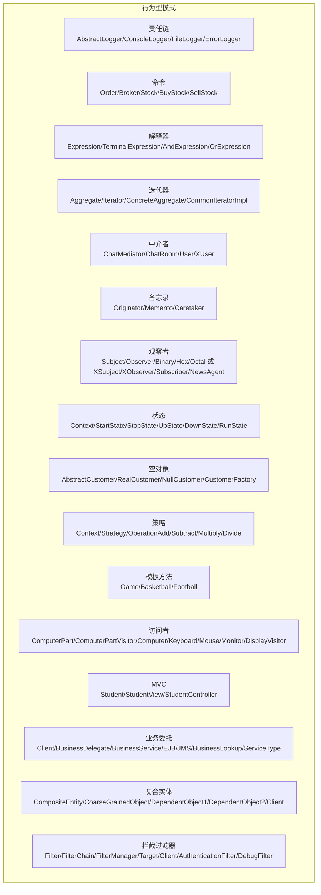
```mermaid
graph TB
subgraph "行为型模式"
CHAIN["责任链<br/>AbstractLogger/ConsoleLogger/FileLogger/ErrorLogger"]
CMD["命令<br/>Order/Broker/Stock/BuyStock/SellStock"]
INT["解释器<br/>Expression/TerminalExpression/AndExpression/OrExpression"]
IT["迭代器<br/>Aggregate/Iterator/ConcreteAggregate/CommonIteratorImpl"]
MED["中介者<br/>ChatMediator/ChatRoom/User/XUser"]
MEM["备忘录<br/>Originator/Memento/Caretaker"]
OBS["观察者<br/>Subject/Observer/Binary/Hex/Octal 或 XSubject/XObserver/Subscriber/NewsAgent"]
ST["状态<br/>Context/StartState/StopState/UpState/DownState/RunState"]
NOBJ["空对象<br/>AbstractCustomer/RealCustomer/NullCustomer/CustomerFactory"]
STR["策略<br/>Context/Strategy/OperationAdd/Subtract/Multiply/Divide"]
TMP["模板方法<br/>Game/Basketball/Football"]
VIS["访问者<br/>ComputerPart/ComputerPartVisitor/Computer/Keyboard/Mouse/Monitor/DisplayVisitor"]
MVC["MVC<br/>Student/StudentView/StudentController"]
BD["业务委托<br/>Client/BusinessDelegate/BusinessService/EJB/JMS/BusinessLookup/ServiceType"]
CE["复合实体<br/>CompositeEntity/CoarseGrainedObject/DependentObject1/DependentObject2/Client"]
FIL["拦截过滤器<br/>Filter/FilterChain/FilterManager/Target/Client/AuthenticationFilter/DebugFilter"]
end
```

**图表来源**
- [behavioral/chain/src/main/java/com/future/rocket/gof23/chain/behavior/AbstractLogger.java:1-28](file://behavioral/chain/src/main/java/com/future/rocket/gof23/chain/behavior/AbstractLogger.java#L1-L28)
- [behavioral/command/src/main/java/com/future/rocket/gof23/command/invoker/Broker.java:1-19](file://behavioral/command/src/main/java/com/future/rocket/gof23/command/invoker/Broker.java#L1-L19)
- [behavioral/interpreter/src/main/java/com/future/rocket/gof23/interpreter/iface/Expression.java:1-6](file://behavioral/interpreter/src/main/java/com/future/rocket/gof23/interpreter/iface/Expression.java#L1-L6)
- [behavioral/iterator/src/main/java/com/future/rocket/gof23/iterator/iface/Aggregate.java:1-6](file://behavioral/iterator/src/main/java/com/future/rocket/gof23/iterator/iface/Aggregate.java#L1-L6)
- [behavioral/mediator/src/main/java/com/future/rocket/gof23/mediator/impl/ChatRoom.java](file://behavioral/mediator/src/main/java/com/future/rocket/gof23/mediator/impl/ChatRoom.java)
- [behavioral/memento/src/main/java/com/future/rocket/gof23/memento/Originator.java](file://behavioral/memento/src/main/java/com/future/rocket/gof23/memento/Originator.java)
- [behavioral/observer/src/main/java/com/future/rocket/gof23/observer/impl1/Subject.java](file://behavioral/observer/src/main/java/com/future/rocket/gof23/observer/impl1/Subject.java)
- [behavioral/state/src/main/java/com/future/rocket/gof23/state/info/Context.java](file://behavioral/state/src/main/java/com/future/rocket/gof23/state/info/Context.java)
- [behavioral/nullobject/src/main/java/com/future/rocket/gof23/nullobject/iface/AbstractCustomer.java](file://behavioral/nullobject/src/main/java/com/future/rocket/gof23/nullobject/iface/AbstractCustomer.java)
- [behavioral/strategy/src/main/java/com/future/rocket/gof23/strategy/context/Context.java](file://behavioral/strategy/src/main/java/com/future/rocket/gof23/strategy/context/Context.java)
- [behavioral/template/src/main/java/com/future/rocket/gof23/template/abs/Game.java](file://behavioral/template/src/main/java/com/future/rocket/gof23/template/abs/Game.java)
- [behavioral/visitor/src/main/java/com/future/rocket/gof23/visitor/iface/ComputerPart.java](file://behavioral/visitor/src/main/java/com/future/rocket/gof23/visitor/iface/ComputerPart.java)
- [behavioral/mvc/src/main/java/com/future/rocket/gof23/mvc/model/Student.java](file://behavioral/mvc/src/main/java/com/future/rocket/gof23/mvc/model/Student.java)
- [behavioral/businessDelegate/src/main/java/com/future/rocket/gof23/business/delegate/client/Client.java](file://behavioral/businessDelegate/src/main/java/com/future/rocket/gof23/business/delegate/client/Client.java)
- [behavioral/compositeEntity/src/main/java/com/future/rocket/gof23/composite/entity/composite/CompositeEntity.java](file://behavioral/compositeEntity/src/main/java/com/future/rocket/gof23/composite/entity/composite/CompositeEntity.java)
- [behavioral/interceptingFilter/src/main/java/com/future/rocket/gof23/interceptor/filter/chain/FilterChain.java](file://behavioral/interceptingFilter/src/main/java/com/future/rocket/gof23/interceptor/filter/chain/FilterChain.java)

**章节来源**
- [behavioral/chain/src/main/java/com/future/rocket/gof23/chain/behavior/AbstractLogger.java:1-28](file://behavioral/chain/src/main/java/com/future/rocket/gof23/chain/behavior/AbstractLogger.java#L1-L28)
- [behavioral/command/src/main/java/com/future/rocket/gof23/command/invoker/Broker.java:1-19](file://behavioral/command/src/main/java/com/future/rocket/gof23/command/invoker/Broker.java#L1-L19)
- [behavioral/interpreter/src/main/java/com/future/rocket/gof23/interpreter/iface/Expression.java:1-6](file://behavioral/interpreter/src/main/java/com/future/rocket/gof23/interpreter/iface/Expression.java#L1-L6)
- [behavioral/iterator/src/main/java/com/future/rocket/gof23/iterator/iface/Aggregate.java:1-6](file://behavioral/iterator/src/main/java/com/future/rocket/gof23/iterator/iface/Aggregate.java#L1-L6)
- [behavioral/mediator/src/main/java/com/future/rocket/gof23/mediator/impl/ChatRoom.java](file://behavioral/mediator/src/main/java/com/future/rocket/gof23/mediator/impl/ChatRoom.java)
- [behavioral/memento/src/main/java/com/future/rocket/gof23/memento/Originator.java](file://behavioral/memento/src/main/java/com/future/rocket/gof23/memento/Originator.java)
- [behavioral/observer/src/main/java/com/future/rocket/gof23/observer/impl1/Subject.java](file://behavioral/observer/src/main/java/com/future/rocket/gof23/observer/impl1/Subject.java)
- [behavioral/state/src/main/java/com/future/rocket/gof23/state/info/Context.java](file://behavioral/state/src/main/java/com/future/rocket/gof23/state/info/Context.java)
- [behavioral/nullobject/src/main/java/com/future/rocket/gof23/nullobject/iface/AbstractCustomer.java](file://behavioral/nullobject/src/main/java/com/future/rocket/gof23/nullobject/iface/AbstractCustomer.java)
- [behavioral/strategy/src/main/java/com/future/rocket/gof23/strategy/context/Context.java](file://behavioral/strategy/src/main/java/com/future/rocket/gof23/strategy/context/Context.java)
- [behavioral/template/src/main/java/com/future/rocket/gof23/template/abs/Game.java](file://behavioral/template/src/main/java/com/future/rocket/gof23/template/abs/Game.java)
- [behavioral/visitor/src/main/java/com/future/rocket/gof23/visitor/iface/ComputerPart.java](file://behavioral/visitor/src/main/java/com/future/rocket/gof23/visitor/iface/ComputerPart.java)
- [behavioral/mvc/src/main/java/com/future/rocket/gof23/mvc/model/Student.java](file://behavioral/mvc/src/main/java/com/future/rocket/gof23/mvc/model/Student.java)
- [behavioral/businessDelegate/src/main/java/com/future/rocket/gof23/business/delegate/client/Client.java](file://behavioral/businessDelegate/src/main/java/com/future/rocket/gof23/business/delegate/client/Client.java)
- [behavioral/compositeEntity/src/main/java/com/future/rocket/gof23/composite/entity/composite/CompositeEntity.java](file://behavioral/compositeEntity/src/main/java/com/future/rocket/gof23/composite/entity/composite/CompositeEntity.java)
- [behavioral/interceptingFilter/src/main/java/com/future/rocket/gof23/interceptor/filter/chain/FilterChain.java](file://behavioral/interceptingFilter/src/main/java/com/future/rocket/gof23/interceptor/filter/chain/FilterChain.java)

## 核心组件
- 责任链：抽象日志器定义级别与链式传递；具体日志器按级别输出。
- 命令：订单接口统一执行语义；调用者维护命令队列；接收者执行动作。
- 解释器：表达式接口定义解释；终结符表达式匹配上下文；与/或表达式组合解析。
- 迭代器：聚合创建迭代器；迭代器推进与访问元素。
- 中介者：聊天室协调用户消息；用户通过中介转发。
- 备忘录：发起人保存内部状态；管理者持有备忘录；可回滚。
- 观察者：主题维护观察者列表；状态变化通知观察者；两种实现风格。
- 状态：上下文持有状态接口；状态决定行为与转移。
- 空对象：抽象客户返回真实或空实现；屏蔽空引用。
- 策略：上下文封装策略；策略切换算法。
- 模板方法：抽象游戏定义算法骨架；子类实现具体步骤。
- 访问者：硬件部件接受访问者；访问者对部件进行操作。
- MVC：模型承载数据；视图渲染；控制器协调。
- 业务委托：客户端通过委托访问服务；委托选择具体服务。
- 复合实体：复合实体组合粗/细粒度对象；统一管理生命周期。
- 拦截过滤器：过滤器链串联；请求/响应在链中处理。

**章节来源**
- [behavioral/chain/src/main/java/com/future/rocket/gof23/chain/behavior/AbstractLogger.java:1-28](file://behavioral/chain/src/main/java/com/future/rocket/gof23/chain/behavior/AbstractLogger.java#L1-L28)
- [behavioral/command/src/main/java/com/future/rocket/gof23/command/iface/Order.java:1-6](file://behavioral/command/src/main/java/com/future/rocket/gof23/command/iface/Order.java#L1-L6)
- [behavioral/interpreter/src/main/java/com/future/rocket/gof23/interpreter/iface/Expression.java:1-6](file://behavioral/interpreter/src/main/java/com/future/rocket/gof23/interpreter/iface/Expression.java#L1-L6)
- [behavioral/iterator/src/main/java/com/future/rocket/gof23/iterator/iface/Aggregate.java:1-6](file://behavioral/iterator/src/main/java/com/future/rocket/gof23/iterator/iface/Aggregate.java#L1-L6)
- [behavioral/mediator/src/main/java/com/future/rocket/gof23/mediator/impl/ChatRoom.java](file://behavioral/mediator/src/main/java/com/future/rocket/gof23/mediator/impl/ChatRoom.java)
- [behavioral/memento/src/main/java/com/future/rocket/gof23/memento/Originator.java](file://behavioral/memento/src/main/java/com/future/rocket/gof23/memento/Originator.java)
- [behavioral/observer/src/main/java/com/future/rocket/gof23/observer/impl1/Subject.java](file://behavioral/observer/src/main/java/com/future/rocket/gof23/observer/impl1/Subject.java)
- [behavioral/state/src/main/java/com/future/rocket/gof23/state/info/Context.java](file://behavioral/state/src/main/java/com/future/rocket/gof23/state/info/Context.java)
- [behavioral/nullobject/src/main/java/com/future/rocket/gof23/nullobject/iface/AbstractCustomer.java](file://behavioral/nullobject/src/main/java/com/future/rocket/gof23/nullobject/iface/AbstractCustomer.java)
- [behavioral/strategy/src/main/java/com/future/rocket/gof23/strategy/context/Context.java](file://behavioral/strategy/src/main/java/com/future/rocket/gof23/strategy/context/Context.java)
- [behavioral/template/src/main/java/com/future/rocket/gof23/template/abs/Game.java](file://behavioral/template/src/main/java/com/future/rocket/gof23/template/abs/Game.java)
- [behavioral/visitor/src/main/java/com/future/rocket/gof23/visitor/iface/ComputerPart.java](file://behavioral/visitor/src/main/java/com/future/rocket/gof23/visitor/iface/ComputerPart.java)
- [behavioral/mvc/src/main/java/com/future/rocket/gof23/mvc/model/Student.java](file://behavioral/mvc/src/main/java/com/future/rocket/gof23/mvc/model/Student.java)
- [behavioral/businessDelegate/src/main/java/com/future/rocket/gof23/business/delegate/client/Client.java](file://behavioral/businessDelegate/src/main/java/com/future/rocket/gof23/business/delegate/client/Client.java)
- [behavioral/compositeEntity/src/main/java/com/future/rocket/gof23/composite/entity/composite/CompositeEntity.java](file://behavioral/compositeEntity/src/main/java/com/future/rocket/gof23/composite/entity/composite/CompositeEntity.java)
- [behavioral/interceptingFilter/src/main/java/com/future/rocket/gof23/interceptor/filter/chain/FilterChain.java](file://behavioral/interceptingFilter/src/main/java/com/future/rocket/gof23/interceptor/filter/chain/FilterChain.java)

## 架构总览
以下图展示典型模式间的协作关系与职责边界，帮助理解“解耦-复用-扩展”的设计思想。

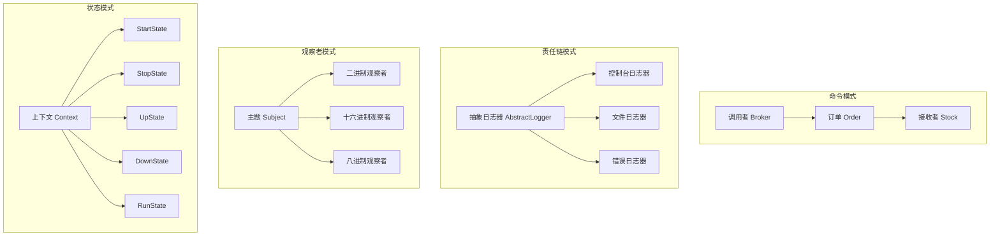
```mermaid
graph TB
subgraph "命令模式"
INV["调用者 Broker"]
ORD["订单 Order"]
REC["接收者 Stock"]
end
INV --> ORD
ORD --> REC
subgraph "责任链模式"
ABS["抽象日志器 AbstractLogger"]
CON["控制台日志器"]
FIL["文件日志器"]
ERR["错误日志器"]
end
ABS --> CON
ABS --> FIL
ABS --> ERR
subgraph "观察者模式"
SUB["主题 Subject"]
BIN["二进制观察者"]
HEX["十六进制观察者"]
OCT["八进制观察者"]
end
SUB --> BIN
SUB --> HEX
SUB --> OCT
subgraph "状态模式"
CTX["上下文 Context"]
S0["StartState"]
S1["StopState"]
S2["UpState"]
S3["DownState"]
S4["RunState"]
end
CTX --> S0
CTX --> S1
CTX --> S2
CTX --> S3
CTX --> S4
```

**图表来源**
- [behavioral/command/src/main/java/com/future/rocket/gof23/command/invoker/Broker.java:1-19](file://behavioral/command/src/main/java/com/future/rocket/gof23/command/invoker/Broker.java#L1-L19)
- [behavioral/command/src/main/java/com/future/rocket/gof23/command/iface/Order.java:1-6](file://behavioral/command/src/main/java/com/future/rocket/gof23/command/iface/Order.java#L1-L6)
- [behavioral/command/src/main/java/com/future/rocket/gof23/command/receiver/Stock.java:1-30](file://behavioral/command/src/main/java/com/future/rocket/gof23/command/receiver/Stock.java#L1-L30)
- [behavioral/chain/src/main/java/com/future/rocket/gof23/chain/behavior/AbstractLogger.java:1-28](file://behavioral/chain/src/main/java/com/future/rocket/gof23/chain/behavior/AbstractLogger.java#L1-L28)
- [behavioral/observer/src/main/java/com/future/rocket/gof23/observer/impl1/Subject.java](file://behavioral/observer/src/main/java/com/future/rocket/gof23/observer/impl1/Subject.java)
- [behavioral/state/src/main/java/com/future/rocket/gof23/state/info/Context.java](file://behavioral/state/src/main/java/com/future/rocket/gof23/state/info/Context.java)

## 详细组件分析

### 责任链模式
- 行为特征：按优先级顺序尝试处理请求，未处理则传递给下一个处理器。
- 交互机制：抽象日志器持有nextLogger，logMessage递归传递。
- 职责分配：具体日志器仅负责自身级别的处理与输出。
- 适用场景：日志分级、权限校验、请求过滤、异常处理链。
- 并发考虑：链路遍历为线性，注意避免阻塞；可将耗时操作异步化。
- 性能优化：合理设置链长度；避免重复计算；必要时缓存判定结果。
- 扩展性设计：新增处理器只需接入链尾；支持动态配置链顺序。

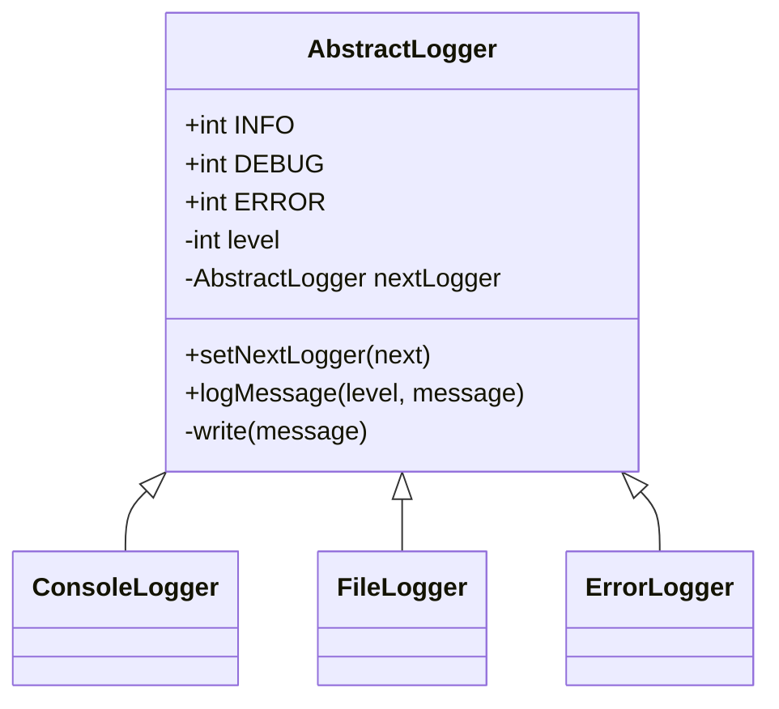
```mermaid
classDiagram
class AbstractLogger {
+int INFO
+int DEBUG
+int ERROR
-int level
-AbstractLogger nextLogger
+setNextLogger(next)
+logMessage(level, message)
-write(message)
}
class ConsoleLogger
class FileLogger
class ErrorLogger
AbstractLogger <|-- ConsoleLogger
AbstractLogger <|-- FileLogger
AbstractLogger <|-- ErrorLogger
```

**图表来源**
- [behavioral/chain/src/main/java/com/future/rocket/gof23/chain/behavior/AbstractLogger.java:1-28](file://behavioral/chain/src/main/java/com/future/rocket/gof23/chain/behavior/AbstractLogger.java#L1-L28)
- [behavioral/chain/src/main/java/com/future/rocket/gof23/chain/impl/ConsoleLogger.java:1-16](file://behavioral/chain/src/main/java/com/future/rocket/gof23/chain/impl/ConsoleLogger.java#L1-L16)
- [behavioral/chain/src/main/java/com/future/rocket/gof23/chain/impl/FileLogger.java:1-16](file://behavioral/chain/src/main/java/com/future/rocket/gof23/chain/impl/FileLogger.java#L1-L16)
- [behavioral/chain/src/main/java/com/future/rocket/gof23/chain/impl/ErrorLogger.java:1-16](file://behavioral/chain/src/main/java/com/future/rocket/gof23/chain/impl/ErrorLogger.java#L1-L16)

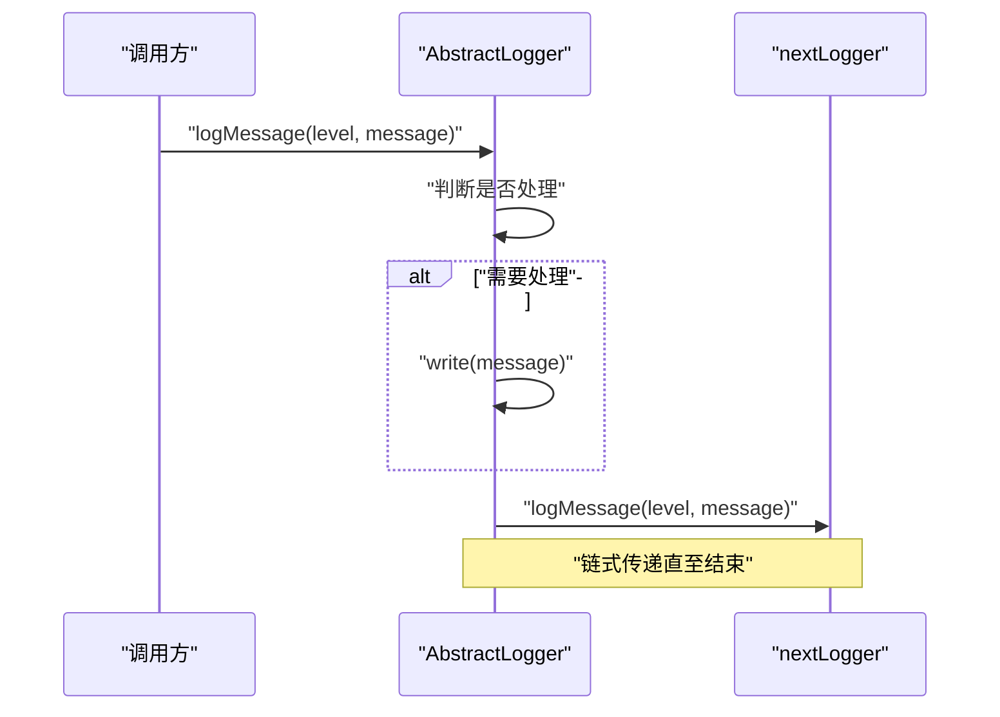
```mermaid
sequenceDiagram
participant C as "调用方"
participant L as "AbstractLogger"
participant N as "nextLogger"
C->>L : "logMessage(level, message)"
L->>L : "判断是否处理"
alt "需要处理"
L->>L : "write(message)"
end
L->>N : "logMessage(level, message)"
Note over L,N : "链式传递直至结束"
```

**图表来源**
- [behavioral/chain/src/main/java/com/future/rocket/gof23/chain/behavior/AbstractLogger.java:16-24](file://behavioral/chain/src/main/java/com/future/rocket/gof23/chain/behavior/AbstractLogger.java#L16-L24)

**章节来源**
- [behavioral/chain/src/main/java/com/future/rocket/gof23/chain/behavior/AbstractLogger.java:1-28](file://behavioral/chain/src/main/java/com/future/rocket/gof23/chain/behavior/AbstractLogger.java#L1-L28)
- [behavioral/chain/src/main/java/com/future/rocket/gof23/chain/impl/ConsoleLogger.java:1-16](file://behavioral/chain/src/main/java/com/future/rocket/gof23/chain/impl/ConsoleLogger.java#L1-L16)
- [behavioral/chain/src/main/java/com/future/rocket/gof23/chain/impl/FileLogger.java:1-16](file://behavioral/chain/src/main/java/com/future/rocket/gof23/chain/impl/FileLogger.java#L1-L16)
- [behavioral/chain/src/main/java/com/future/rocket/gof23/chain/impl/ErrorLogger.java:1-16](file://behavioral/chain/src/main/java/com/future/rocket/gof23/chain/impl/ErrorLogger.java#L1-L16)

### 命令模式
- 行为特征：将请求封装为对象，使你可用不同请求对客户进行参数化。
- 交互机制：调用者持有命令列表；批量执行；接收者执行具体动作。
- 职责分配：命令封装执行细节；调用者负责调度；接收者专注业务。
- 适用场景：队列任务、撤销重做、事务封装。
- 并发考虑：命令队列可多线程消费；注意命令幂等与一致性。
- 性能优化：批量提交减少开销；命令对象池化。
- 扩展性设计：新增命令无需修改调用者；支持宏命令组合。

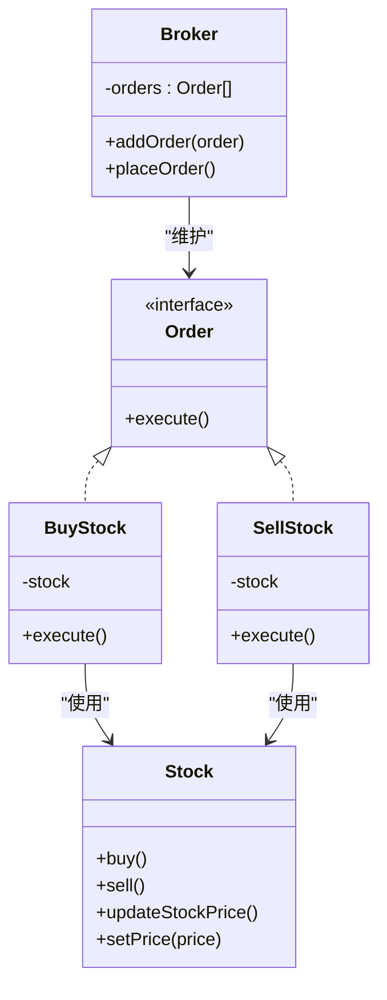
```mermaid
classDiagram
class Order {
<<interface>>
+execute()
}
class BuyStock {
-stock
+execute()
}
class SellStock {
-stock
+execute()
}
class Broker {
-orders : Order[]
+addOrder(order)
+placeOrder()
}
class Stock {
+buy()
+sell()
+updateStockPrice()
+setPrice(price)
}
Order <|.. BuyStock
Order <|.. SellStock
BuyStock --> Stock : "使用"
SellStock --> Stock : "使用"
Broker --> Order : "维护"
```

**图表来源**
- [behavioral/command/src/main/java/com/future/rocket/gof23/command/iface/Order.java:1-6](file://behavioral/command/src/main/java/com/future/rocket/gof23/command/iface/Order.java#L1-L6)
- [behavioral/command/src/main/java/com/future/rocket/gof23/command/impl/BuyStock.java:1-18](file://behavioral/command/src/main/java/com/future/rocket/gof23/command/impl/BuyStock.java#L1-L18)
- [behavioral/command/src/main/java/com/future/rocket/gof23/command/impl/SellStock.java:1-18](file://behavioral/command/src/main/java/com/future/rocket/gof23/command/impl/SellStock.java#L1-L18)
- [behavioral/command/src/main/java/com/future/rocket/gof23/command/invoker/Broker.java:1-19](file://behavioral/command/src/main/java/com/future/rocket/gof23/command/invoker/Broker.java#L1-L19)
- [behavioral/command/src/main/java/com/future/rocket/gof23/command/receiver/Stock.java:1-30](file://behavioral/command/src/main/java/com/future/rocket/gof23/command/receiver/Stock.java#L1-L30)

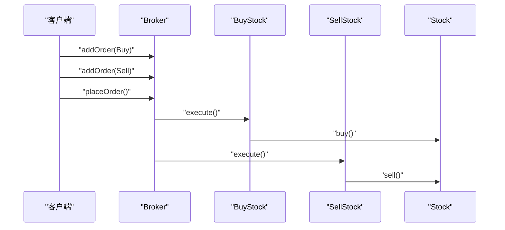
```mermaid
sequenceDiagram
participant Client as "客户端"
participant Broker as "Broker"
participant Buy as "BuyStock"
participant Sell as "SellStock"
participant Stock as "Stock"
Client->>Broker : "addOrder(Buy)"
Client->>Broker : "addOrder(Sell)"
Client->>Broker : "placeOrder()"
Broker->>Buy : "execute()"
Buy->>Stock : "buy()"
Broker->>Sell : "execute()"
Sell->>Stock : "sell()"
```

**图表来源**
- [behavioral/command/src/main/java/com/future/rocket/gof23/command/invoker/Broker.java:15-17](file://behavioral/command/src/main/java/com/future/rocket/gof23/command/invoker/Broker.java#L15-L17)
- [behavioral/command/src/main/java/com/future/rocket/gof23/command/impl/BuyStock.java:14-16](file://behavioral/command/src/main/java/com/future/rocket/gof23/command/impl/BuyStock.java#L14-L16)
- [behavioral/command/src/main/java/com/future/rocket/gof23/command/impl/SellStock.java:14-16](file://behavioral/command/src/main/java/com/future/rocket/gof23/command/impl/SellStock.java#L14-L16)
- [behavioral/command/src/main/java/com/future/rocket/gof23/command/receiver/Stock.java:14-20](file://behavioral/command/src/main/java/com/future/rocket/gof23/command/receiver/Stock.java#L14-L20)

**章节来源**
- [behavioral/command/src/main/java/com/future/rocket/gof23/command/iface/Order.java:1-6](file://behavioral/command/src/main/java/com/future/rocket/gof23/command/iface/Order.java#L1-L6)
- [behavioral/command/src/main/java/com/future/rocket/gof23/command/impl/BuyStock.java:1-18](file://behavioral/command/src/main/java/com/future/rocket/gof23/command/impl/BuyStock.java#L1-L18)
- [behavioral/command/src/main/java/com/future/rocket/gof23/command/impl/SellStock.java:1-18](file://behavioral/command/src/main/java/com/future/rocket/gof23/command/impl/SellStock.java#L1-L18)
- [behavioral/command/src/main/java/com/future/rocket/gof23/command/invoker/Broker.java:1-19](file://behavioral/command/src/main/java/com/future/rocket/gof23/command/invoker/Broker.java#L1-L19)
- [behavioral/command/src/main/java/com/future/rocket/gof23/command/receiver/Stock.java:1-30](file://behavioral/command/src/main/java/com/future/rocket/gof23/command/receiver/Stock.java#L1-L30)

### 解释器模式
- 行为特征：定义语言的文法表示，并定义一个解释器，根据该文法表示来解释语言中的句子。
- 交互机制：终结符表达式匹配上下文；与/或表达式组合求值。
- 职责分配：表达式接口定义解释契约；具体表达式实现解释逻辑。
- 适用场景：SQL子集、规则引擎、脚本解析。
- 并发考虑：解释过程通常为纯函数式，注意上下文共享安全。
- 性能优化：缓存中间结果；避免重复解释相同片段。
- 扩展性设计：新增语法通过实现Expression即可。

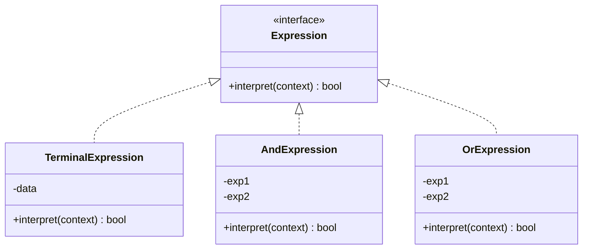
```mermaid
classDiagram
class Expression {
<<interface>>
+interpret(context) bool
}
class TerminalExpression {
-data
+interpret(context) bool
}
class AndExpression {
-exp1
-exp2
+interpret(context) bool
}
class OrExpression {
-exp1
-exp2
+interpret(context) bool
}
Expression <|.. TerminalExpression
Expression <|.. AndExpression
Expression <|.. OrExpression
```

**图表来源**
- [behavioral/interpreter/src/main/java/com/future/rocket/gof23/interpreter/iface/Expression.java:1-6](file://behavioral/interpreter/src/main/java/com/future/rocket/gof23/interpreter/iface/Expression.java#L1-L6)
- [behavioral/interpreter/src/main/java/com/future/rocket/gof23/interpreter/impl/TerminalExpression.java:1-17](file://behavioral/interpreter/src/main/java/com/future/rocket/gof23/interpreter/impl/TerminalExpression.java#L1-L17)
- [behavioral/interpreter/src/main/java/com/future/rocket/gof23/interpreter/impl/AndExpression.java:1-20](file://behavioral/interpreter/src/main/java/com/future/rocket/gof23/interpreter/impl/AndExpression.java#L1-L20)
- [behavioral/interpreter/src/main/java/com/future/rocket/gof23/interpreter/impl/OrExpression.java:1-19](file://behavioral/interpreter/src/main/java/com/future/rocket/gof23/interpreter/impl/OrExpression.java#L1-L19)

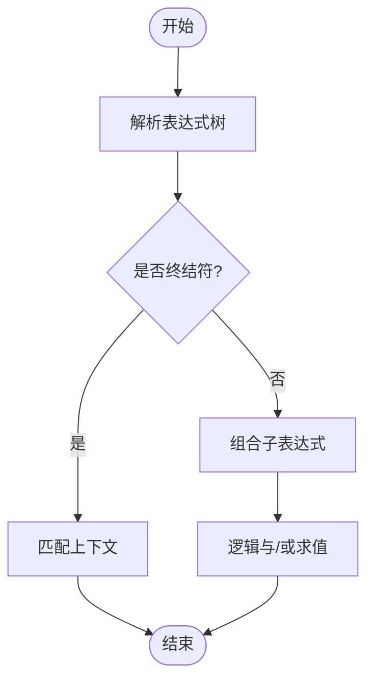
```mermaid
flowchart TD
Start(["开始"]) --> Parse["解析表达式树"]
Parse --> IsTerminal{"是否终结符?"}
IsTerminal --> |是| Match["匹配上下文"]
IsTerminal --> |否| Combine["组合子表达式"]
Combine --> Eval["逻辑与/或求值"]
Match --> Done(["结束"])
Eval --> Done
```

**图表来源**
- [behavioral/interpreter/src/main/java/com/future/rocket/gof23/interpreter/impl/AndExpression.java:15-18](file://behavioral/interpreter/src/main/java/com/future/rocket/gof23/interpreter/impl/AndExpression.java#L15-L18)
- [behavioral/interpreter/src/main/java/com/future/rocket/gof23/interpreter/impl/OrExpression.java:14-17](file://behavioral/interpreter/src/main/java/com/future/rocket/gof23/interpreter/impl/OrExpression.java#L14-L17)
- [behavioral/interpreter/src/main/java/com/future/rocket/gof23/interpreter/impl/TerminalExpression.java:12-15](file://behavioral/interpreter/src/main/java/com/future/rocket/gof23/interpreter/impl/TerminalExpression.java#L12-L15)

**章节来源**
- [behavioral/interpreter/src/main/java/com/future/rocket/gof23/interpreter/iface/Expression.java:1-6](file://behavioral/interpreter/src/main/java/com/future/rocket/gof23/interpreter/iface/Expression.java#L1-L6)
- [behavioral/interpreter/src/main/java/com/future/rocket/gof23/interpreter/impl/TerminalExpression.java:1-17](file://behavioral/interpreter/src/main/java/com/future/rocket/gof23/interpreter/impl/TerminalExpression.java#L1-L17)
- [behavioral/interpreter/src/main/java/com/future/rocket/gof23/interpreter/impl/AndExpression.java:1-20](file://behavioral/interpreter/src/main/java/com/future/rocket/gof23/interpreter/impl/AndExpression.java#L1-L20)
- [behavioral/interpreter/src/main/java/com/future/rocket/gof23/interpreter/impl/OrExpression.java:1-19](file://behavioral/interpreter/src/main/java/com/future/rocket/gof23/interpreter/impl/OrExpression.java#L1-L19)

### 迭代器模式
- 行为特征：提供一种方法顺序访问聚合对象的各个元素，而又不暴露其内部表示。
- 交互机制：聚合创建迭代器；迭代器推进位置并返回元素。
- 职责分配：聚合负责创建迭代器；迭代器负责遍历。
- 适用场景：集合遍历、树形结构遍历。
- 并发考虑：多线程遍历需保证快照一致性或加锁。
- 性能优化：避免在遍历过程中修改底层容器；惰性求值。
- 扩展性设计：新增聚合类型只需实现Aggregate与对应Iterator。

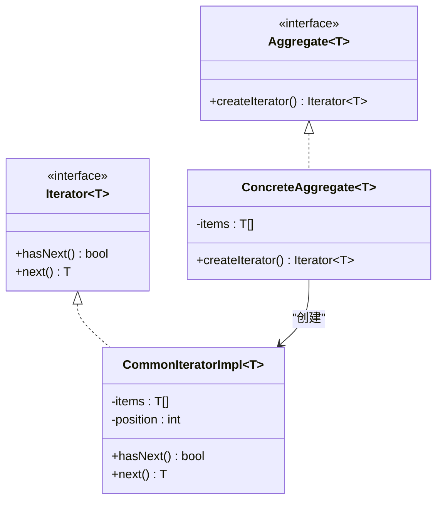
```mermaid
classDiagram
class Aggregate~T~ {
<<interface>>
+createIterator() Iterator~T~
}
class Iterator~T~ {
<<interface>>
+hasNext() bool
+next() T
}
class ConcreteAggregate~T~ {
-items : T[]
+createIterator() Iterator~T~
}
class CommonIteratorImpl~T~ {
-items : T[]
-position : int
+hasNext() bool
+next() T
}
Aggregate <|.. ConcreteAggregate
Iterator <|.. CommonIteratorImpl
ConcreteAggregate --> CommonIteratorImpl : "创建"
```

**图表来源**
- [behavioral/iterator/src/main/java/com/future/rocket/gof23/iterator/iface/Aggregate.java:1-6](file://behavioral/iterator/src/main/java/com/future/rocket/gof23/iterator/iface/Aggregate.java#L1-L6)
- [behavioral/iterator/src/main/java/com/future/rocket/gof23/iterator/iface/Iterator.java:1-7](file://behavioral/iterator/src/main/java/com/future/rocket/gof23/iterator/iface/Iterator.java#L1-L7)
- [behavioral/iterator/src/main/java/com/future/rocket/gof23/iterator/impl/ConcreteAggregate.java:1-18](file://behavioral/iterator/src/main/java/com/future/rocket/gof23/iterator/impl/ConcreteAggregate.java#L1-L18)
- [behavioral/iterator/src/main/java/com/future/rocket/gof23/iterator/impl/CommonIteratorImpl.java:1-23](file://behavioral/iterator/src/main/java/com/future/rocket/gof23/iterator/impl/CommonIteratorImpl.java#L1-L23)

**章节来源**
- [behavioral/iterator/src/main/java/com/future/rocket/gof23/iterator/iface/Aggregate.java:1-6](file://behavioral/iterator/src/main/java/com/future/rocket/gof23/iterator/iface/Aggregate.java#L1-L6)
- [behavioral/iterator/src/main/java/com/future/rocket/gof23/iterator/iface/Iterator.java:1-7](file://behavioral/iterator/src/main/java/com/future/rocket/gof23/iterator/iface/Iterator.java#L1-L7)
- [behavioral/iterator/src/main/java/com/future/rocket/gof23/iterator/impl/ConcreteAggregate.java:1-18](file://behavioral/iterator/src/main/java/com/future/rocket/gof23/iterator/impl/ConcreteAggregate.java#L1-L18)
- [behavioral/iterator/src/main/java/com/future/rocket/gof23/iterator/impl/CommonIteratorImpl.java:1-23](file://behavioral/iterator/src/main/java/com/future/rocket/gof23/iterator/impl/CommonIteratorImpl.java#L1-L23)

### 中介者模式
- 行为特征：用一个中介对象封装一系列对象的交互。
- 交互机制：同事通过中介转发消息；中介协调交互。
- 职责分配：中介集中管理交互；同事专注自身行为。
- 适用场景：聊天室、GUI组件交互、多对象协作。
- 并发考虑：中介需线程安全；避免阻塞关键路径。
- 性能优化：减少直接耦合；批量广播优化。
- 扩展性设计：新增同事只需实现Colleague接口；中介可插拔。

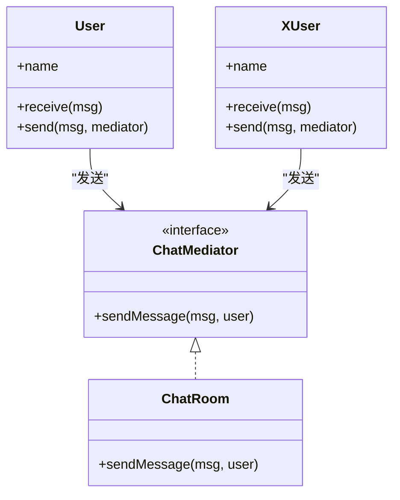
```mermaid
classDiagram
class ChatMediator {
<<interface>>
+sendMessage(msg, user)
}
class User {
+name
+receive(msg)
+send(msg, mediator)
}
class XUser {
+name
+receive(msg)
+send(msg, mediator)
}
class ChatRoom {
+sendMessage(msg, user)
}
ChatMediator <|.. ChatRoom
User --> ChatMediator : "发送"
XUser --> ChatMediator : "发送"
```

**图表来源**
- [behavioral/mediator/src/main/java/com/future/rocket/gof23/mediator/iface/ChatMediator.java](file://behavioral/mediator/src/main/java/com/future/rocket/gof23/mediator/iface/ChatMediator.java)
- [behavioral/mediator/src/main/java/com/future/rocket/gof23/mediator/colleague/User.java](file://behavioral/mediator/src/main/java/com/future/rocket/gof23/mediator/colleague/User.java)
- [behavioral/mediator/src/main/java/com/future/rocket/gof23/mediator/colleague/XUser.java](file://behavioral/mediator/src/main/java/com/future/rocket/gof23/mediator/colleague/XUser.java)
- [behavioral/mediator/src/main/java/com/future/rocket/gof23/mediator/impl/ChatRoom.java](file://behavioral/mediator/src/main/java/com/future/rocket/gof23/mediator/impl/ChatRoom.java)

**章节来源**
- [behavioral/mediator/src/main/java/com/future/rocket/gof23/mediator/colleague/User.java](file://behavioral/mediator/src/main/java/com/future/rocket/gof23/mediator/colleague/User.java)
- [behavioral/mediator/src/main/java/com/future/rocket/gof23/mediator/colleague/XUser.java](file://behavioral/mediator/src/main/java/com/future/rocket/gof23/mediator/colleague/XUser.java)
- [behavioral/mediator/src/main/java/com/future/rocket/gof23/mediator/iface/ChatMediator.java](file://behavioral/mediator/src/main/java/com/future/rocket/gof23/mediator/iface/ChatMediator.java)
- [behavioral/mediator/src/main/java/com/future/rocket/gof23/mediator/impl/ChatRoom.java](file://behavioral/mediator/src/main/java/com/future/rocket/gof23/mediator/impl/ChatRoom.java)

### 备忘录模式
- 行为特征：在不破坏封装性的前提下，捕获一个对象的内部状态，并把该状态保存在对象之外。
- 交互机制：发起人创建备忘录；管理者持有备忘录；可回滚到历史状态。
- 职责分配：Originator负责内部状态；Memento保存状态；Caretaker保管。
- 适用场景：撤销/恢复、检查点、快照。
- 并发考虑：避免跨线程共享可变状态；必要时深拷贝。
- 性能优化：控制备忘录数量；定期清理过期快照。
- 扩展性设计：支持增量快照与版本化存储。

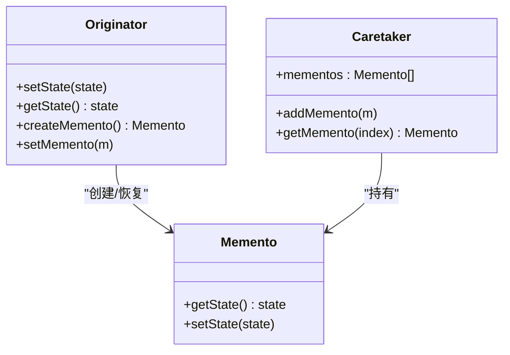
```mermaid
classDiagram
class Originator {
+setState(state)
+getState() state
+createMemento() Memento
+setMemento(m)
}
class Memento {
+getState() state
+setState(state)
}
class Caretaker {
+mementos : Memento[]
+addMemento(m)
+getMemento(index) Memento
}
Originator --> Memento : "创建/恢复"
Caretaker --> Memento : "持有"
```

**图表来源**
- [behavioral/memento/src/main/java/com/future/rocket/gof23/memento/Originator.java](file://behavioral/memento/src/main/java/com/future/rocket/gof23/memento/Originator.java)
- [behavioral/memento/src/main/java/com/future/rocket/gof23/memento/Memento.java](file://behavioral/memento/src/main/java/com/future/rocket/gof23/memento/Memento.java)
- [behavioral/memento/src/main/java/com/future/rocket/gof23/memento/Caretaker.java](file://behavioral/memento/src/main/java/com/future/rocket/gof23/memento/Caretaker.java)

**章节来源**
- [behavioral/memento/src/main/java/com/future/rocket/gof23/memento/Originator.java](file://behavioral/memento/src/main/java/com/future/rocket/gof23/memento/Originator.java)
- [behavioral/memento/src/main/java/com/future/rocket/gof23/memento/Memento.java](file://behavioral/memento/src/main/java/com/future/rocket/gof23/memento/Memento.java)
- [behavioral/memento/src/main/java/com/future/rocket/gof23/memento/Caretaker.java](file://behavioral/memento/src/main/java/com/future/rocket/gof23/memento/Caretaker.java)

### 观察者模式
- 行为特征：定义对象间一对多依赖，当一个对象状态改变时，通知所有依赖者。
- 交互机制：主题维护观察者列表；状态变化时逐一通知。
- 职责分配：主题负责注册/注销与通知；观察者负责响应。
- 适用场景：事件驱动、UI刷新、发布订阅。
- 并发考虑：通知过程可能触发新变更；注意死循环与重入。
- 性能优化：批量通知；弱引用避免内存泄漏。
- 扩展性设计：新增观察者无需修改主题；支持条件订阅。

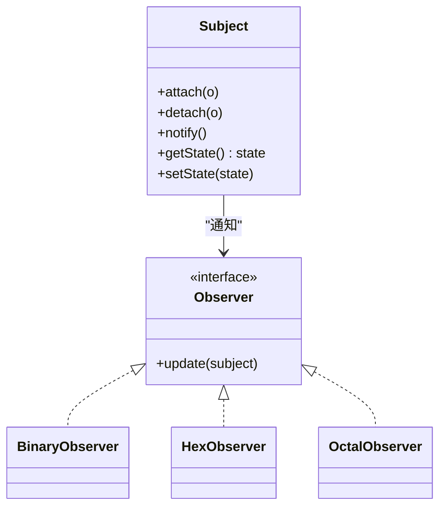
```mermaid
classDiagram
class Subject {
+attach(o)
+detach(o)
+notify()
+getState() state
+setState(state)
}
class Observer {
<<interface>>
+update(subject)
}
class BinaryObserver
class HexObserver
class OctalObserver
Observer <|.. BinaryObserver
Observer <|.. HexObserver
Observer <|.. OctalObserver
Subject --> Observer : "通知"
```

**图表来源**
- [behavioral/observer/src/main/java/com/future/rocket/gof23/observer/impl1/Subject.java](file://behavioral/observer/src/main/java/com/future/rocket/gof23/observer/impl1/Subject.java)
- [behavioral/observer/src/main/java/com/future/rocket/gof23/observer/impl1/Observer.java](file://behavioral/observer/src/main/java/com/future/rocket/gof23/observer/impl1/Observer.java)
- [behavioral/observer/src/main/java/com/future/rocket/gof23/observer/impl1/BinaryObserver.java](file://behavioral/observer/src/main/java/com/future/rocket/gof23/observer/impl1/BinaryObserver.java)
- [behavioral/observer/src/main/java/com/future/rocket/gof23/observer/impl1/HexObserver.java](file://behavioral/observer/src/main/java/com/future/rocket/gof23/observer/impl1/HexObserver.java)
- [behavioral/observer/src/main/java/com/future/rocket/gof23/observer/impl1/OctalObserver.java](file://behavioral/observer/src/main/java/com/future/rocket/gof23/observer/impl1/OctalObserver.java)

**章节来源**
- [behavioral/observer/src/main/java/com/future/rocket/gof23/observer/impl1/Subject.java](file://behavioral/observer/src/main/java/com/future/rocket/gof23/observer/impl1/Subject.java)
- [behavioral/observer/src/main/java/com/future/rocket/gof23/observer/impl1/Observer.java](file://behavioral/observer/src/main/java/com/future/rocket/gof23/observer/impl1/Observer.java)
- [behavioral/observer/src/main/java/com/future/rocket/gof23/observer/impl1/BinaryObserver.java](file://behavioral/observer/src/main/java/com/future/rocket/gof23/observer/impl1/BinaryObserver.java)
- [behavioral/observer/src/main/java/com/future/rocket/gof23/observer/impl1/HexObserver.java](file://behavioral/observer/src/main/java/com/future/rocket/gof23/observer/impl1/HexObserver.java)
- [behavioral/observer/src/main/java/com/future/rocket/gof23/observer/impl1/OctalObserver.java](file://behavioral/observer/src/main/java/com/future/rocket/gof23/observer/impl1/OctalObserver.java)

### 状态模式
- 行为特征：允许对象在内部状态改变时改变其行为，看起来好像对象修改了它的类。
- 交互机制：上下文持有当前状态；状态决定行为与转移。
- 职责分配：Context委派行为；各状态实现具体逻辑。
- 适用场景：有限状态机、工作流引擎。
- 并发考虑：状态切换需原子性；避免竞态条件。
- 性能优化：状态表/映射减少分支；内联热点状态。
- 扩展性设计：新增状态只需实现State接口；可插拔状态机。

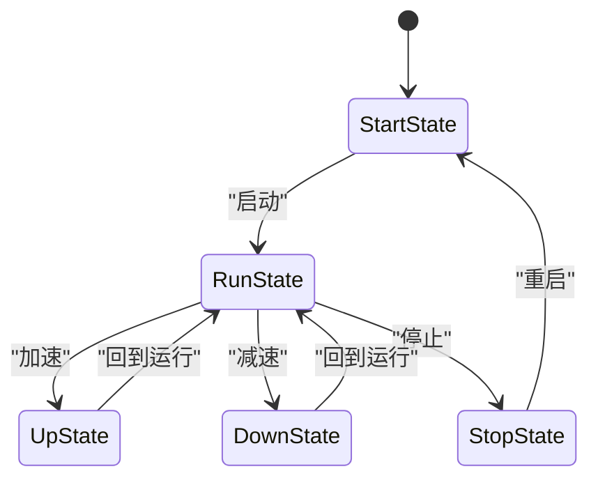
```mermaid
stateDiagram-v2
[*] --> StartState
StartState --> RunState : "启动"
RunState --> UpState : "加速"
RunState --> DownState : "减速"
RunState --> StopState : "停止"
UpState --> RunState : "回到运行"
DownState --> RunState : "回到运行"
StopState --> StartState : "重启"
```

**图表来源**
- [behavioral/state/src/main/java/com/future/rocket/gof23/state/info/Context.java](file://behavioral/state/src/main/java/com/future/rocket/gof23/state/info/Context.java)
- [behavioral/state/src/main/java/com/future/rocket/gof23/state/impl/StartState.java](file://behavioral/state/src/main/java/com/future/rocket/gof23/state/impl/StartState.java)
- [behavioral/state/src/main/java/com/future/rocket/gof23/state/impl/StopState.java](file://behavioral/state/src/main/java/com/future/rocket/gof23/state/impl/StopState.java)
- [behavioral/state/src/main/java/com/future/rocket/gof23/state/impl/UpState.java](file://behavioral/state/src/main/java/com/future/rocket/gof23/state/impl/UpState.java)
- [behavioral/state/src/main/java/com/future/rocket/gof23/state/impl/DownState.java](file://behavioral/state/src/main/java/com/future/rocket/gof23/state/impl/DownState.java)
- [behavioral/state/src/main/java/com/future/rocket/gof23/state/impl/RunState.java](file://behavioral/state/src/main/java/com/future/rocket/gof23/state/impl/RunState.java)

**章节来源**
- [behavioral/state/src/main/java/com/future/rocket/gof23/state/info/Context.java](file://behavioral/state/src/main/java/com/future/rocket/gof23/state/info/Context.java)
- [behavioral/state/src/main/java/com/future/rocket/gof23/state/impl/StartState.java](file://behavioral/state/src/main/java/com/future/rocket/gof23/state/impl/StartState.java)
- [behavioral/state/src/main/java/com/future/rocket/gof23/state/impl/StopState.java](file://behavioral/state/src/main/java/com/future/rocket/gof23/state/impl/StopState.java)
- [behavioral/state/src/main/java/com/future/rocket/gof23/state/impl/UpState.java](file://behavioral/state/src/main/java/com/future/rocket/gof23/state/impl/UpState.java)
- [behavioral/state/src/main/java/com/future/rocket/gof23/state/impl/DownState.java](file://behavioral/state/src/main/java/com/future/rocket/gof23/state/impl/DownState.java)
- [behavioral/state/src/main/java/com/future/rocket/gof23/state/impl/RunState.java](file://behavioral/state/src/main/java/com/future/rocket/gof23/state/impl/RunState.java)

### 空对象模式
- 行为特征：用一个行为“空”的对象替换null，避免频繁的null检查。
- 交互机制：工厂根据条件返回真实对象或空对象。
- 职责分配：抽象客户定义统一接口；真实/空对象实现一致行为。
- 适用场景：默认值、占位符、防御式编程。
- 并发考虑：空对象应不可变；线程安全。
- 性能优化：避免重复判空；常量空对象复用。
- 扩展性设计：新增类型只需实现抽象客户。

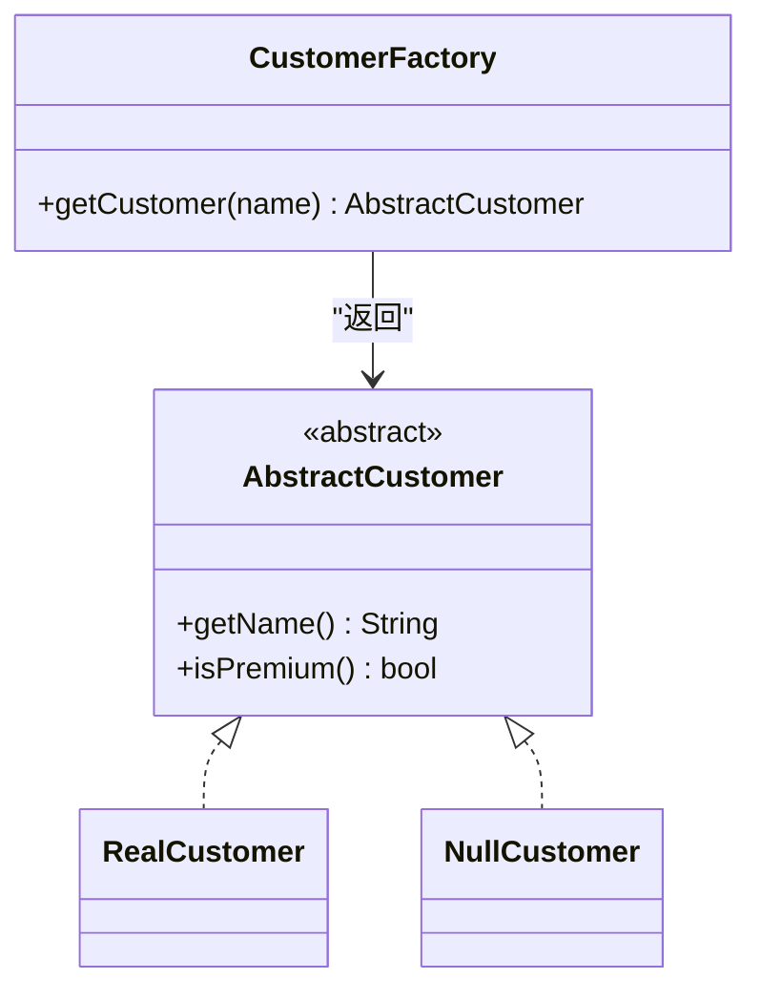
```mermaid
classDiagram
class AbstractCustomer {
<<abstract>>
+getName() String
+isPremium() bool
}
class RealCustomer
class NullCustomer
class CustomerFactory {
+getCustomer(name) AbstractCustomer
}
AbstractCustomer <|.. RealCustomer
AbstractCustomer <|.. NullCustomer
CustomerFactory --> AbstractCustomer : "返回"
```

**图表来源**
- [behavioral/nullobject/src/main/java/com/future/rocket/gof23/nullobject/iface/AbstractCustomer.java](file://behavioral/nullobject/src/main/java/com/future/rocket/gof23/nullobject/iface/AbstractCustomer.java)
- [behavioral/nullobject/src/main/java/com/future/rocket/gof23/nullobject/impl/RealCustomer.java](file://behavioral/nullobject/src/main/java/com/future/rocket/gof23/nullobject/impl/RealCustomer.java)
- [behavioral/nullobject/src/main/java/com/future/rocket/gof23/nullobject/impl/NullCustomer.java](file://behavioral/nullobject/src/main/java/com/future/rocket/gof23/nullobject/impl/NullCustomer.java)
- [behavioral/nullobject/src/main/java/com/future/rocket/gof23/nullobject/factory/CustomerFactory.java](file://behavioral/nullobject/src/main/java/com/future/rocket/gof23/nullobject/factory/CustomerFactory.java)

**章节来源**
- [behavioral/nullobject/src/main/java/com/future/rocket/gof23/nullobject/iface/AbstractCustomer.java](file://behavioral/nullobject/src/main/java/com/future/rocket/gof23/nullobject/iface/AbstractCustomer.java)
- [behavioral/nullobject/src/main/java/com/future/rocket/gof23/nullobject/impl/RealCustomer.java](file://behavioral/nullobject/src/main/java/com/future/rocket/gof23/nullobject/impl/RealCustomer.java)
- [behavioral/nullobject/src/main/java/com/future/rocket/gof23/nullobject/impl/NullCustomer.java](file://behavioral/nullobject/src/main/java/com/future/rocket/gof23/nullobject/impl/NullCustomer.java)
- [behavioral/nullobject/src/main/java/com/future/rocket/gof23/nullobject/factory/CustomerFactory.java](file://behavioral/nullobject/src/main/java/com/future/rocket/gof23/nullobject/factory/CustomerFactory.java)

### 策略模式
- 行为特征：定义一系列算法，把它们一个个封装起来，并且使它们可以相互替换。
- 交互机制：上下文持有策略；运行时切换策略。
- 职责分配：Context封装调用；Strategy定义算法。
- 适用场景：多算法选择、条件分支复杂。
- 并发考虑：策略应无状态或线程安全。
- 性能优化：策略对象池；热点策略内联。
- 扩展性设计：新增算法只需实现Strategy。

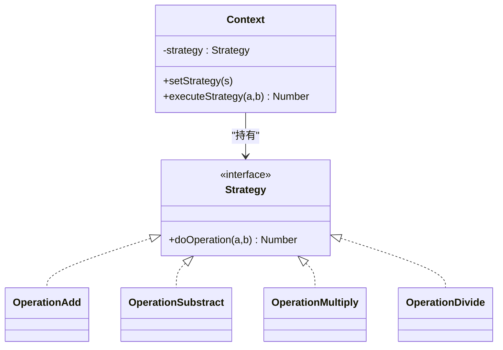
```mermaid
classDiagram
class Context {
-strategy : Strategy
+setStrategy(s)
+executeStrategy(a,b) Number
}
class Strategy {
<<interface>>
+doOperation(a,b) Number
}
class OperationAdd
class OperationSubstract
class OperationMultiply
class OperationDivide
Context --> Strategy : "持有"
Strategy <|.. OperationAdd
Strategy <|.. OperationSubstract
Strategy <|.. OperationMultiply
Strategy <|.. OperationDivide
```

**图表来源**
- [behavioral/strategy/src/main/java/com/future/rocket/gof23/strategy/context/Context.java](file://behavioral/strategy/src/main/java/com/future/rocket/gof23/strategy/context/Context.java)
- [behavioral/strategy/src/main/java/com/future/rocket/gof23/strategy/iface/Strategy.java](file://behavioral/strategy/src/main/java/com/future/rocket/gof23/strategy/iface/Strategy.java)
- [behavioral/strategy/src/main/java/com/future/rocket/gof23/strategy/impl/OperationAdd.java](file://behavioral/strategy/src/main/java/com/future/rocket/gof23/strategy/impl/OperationAdd.java)
- [behavioral/strategy/src/main/java/com/future/rocket/gof23/strategy/impl/OperationSubstract.java](file://behavioral/strategy/src/main/java/com/future/rocket/gof23/strategy/impl/OperationSubstract.java)
- [behavioral/strategy/src/main/java/com/future/rocket/gof23/strategy/impl/OperationMultiply.java](file://behavioral/strategy/src/main/java/com/future/rocket/gof23/strategy/impl/OperationMultiply.java)
- [behavioral/strategy/src/main/java/com/future/rocket/gof23/strategy/impl/OperationDivide.java](file://behavioral/strategy/src/main/java/com/future/rocket/gof23/strategy/impl/OperationDivide.java)

**章节来源**
- [behavioral/strategy/src/main/java/com/future/rocket/gof23/strategy/context/Context.java](file://behavioral/strategy/src/main/java/com/future/rocket/gof23/strategy/context/Context.java)
- [behavioral/strategy/src/main/java/com/future/rocket/gof23/strategy/iface/Strategy.java](file://behavioral/strategy/src/main/java/com/future/rocket/gof23/strategy/iface/Strategy.java)
- [behavioral/strategy/src/main/java/com/future/rocket/gof23/strategy/impl/OperationAdd.java](file://behavioral/strategy/src/main/java/com/future/rocket/gof23/strategy/impl/OperationAdd.java)
- [behavioral/strategy/src/main/java/com/future/rocket/gof23/strategy/impl/OperationSubstract.java](file://behavioral/strategy/src/main/java/com/future/rocket/gof23/strategy/impl/OperationSubstract.java)
- [behavioral/strategy/src/main/java/com/future/rocket/gof23/strategy/impl/OperationMultiply.java](file://behavioral/strategy/src/main/java/com/future/rocket/gof23/strategy/impl/OperationMultiply.java)
- [behavioral/strategy/src/main/java/com/future/rocket/gof23/strategy/impl/OperationDivide.java](file://behavioral/strategy/src/main/java/com/future/rocket/gof23/strategy/impl/OperationDivide.java)

### 模板方法模式
- 行为特征：定义算法的骨架，将一些步骤延迟到子类实现。
- 交互机制：抽象类定义模板；子类覆盖可变步骤。
- 职责分配：抽象类定义流程；子类实现细节。
- 适用场景：框架扩展、算法复用。
- 并发考虑：模板方法本身为线程安全；子类实现需注意。
- 性能优化：避免在模板中做重复计算；子类内联热点代码。
- 扩展性设计：新增子类无需修改父类。

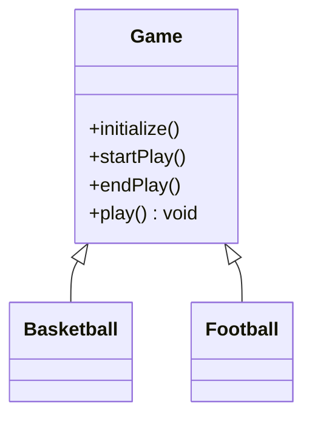
```mermaid
classDiagram
class Game {
+initialize()
+startPlay()
+endPlay()
+play() void
}
class Basketball
class Football
Game <|-- Basketball
Game <|-- Football
```

**图表来源**
- [behavioral/template/src/main/java/com/future/rocket/gof23/template/abs/Game.java](file://behavioral/template/src/main/java/com/future/rocket/gof23/template/abs/Game.java)
- [behavioral/template/src/main/java/com/future/rocket/gof23/template/impl/Basketball.java](file://behavioral/template/src/main/java/com/future/rocket/gof23/template/impl/Basketball.java)
- [behavioral/template/src/main/java/com/future/rocket/gof23/template/impl/Football.java](file://behavioral/template/src/main/java/com/future/rocket/gof23/template/impl/Football.java)

**章节来源**
- [behavioral/template/src/main/java/com/future/rocket/gof23/template/abs/Game.java](file://behavioral/template/src/main/java/com/future/rocket/gof23/template/abs/Game.java)
- [behavioral/template/src/main/java/com/future/rocket/gof23/template/impl/Basketball.java](file://behavioral/template/src/main/java/com/future/rocket/gof23/template/impl/Basketball.java)
- [behavioral/template/src/main/java/com/future/rocket/gof23/template/impl/Football.java](file://behavioral/template/src/main/java/com/future/rocket/gof23/template/impl/Football.java)

### 访问者模式
- 行为特征：表示一个作用于某对象结构中的各元素的操作，使你可以在不改变各元素类的前提下定义作用于这些元素的新操作。
- 交互机制：元素接受访问者；访问者对元素进行操作。
- 职责分配：元素定义accept；访问者定义visit。
- 适用场景：报表生成、编译器AST遍历。
- 并发考虑：访问者应无副作用；避免并发修改。
- 性能优化：避免深层递归；缓存访问结果。
- 扩展性设计：新增操作只需实现访问者。

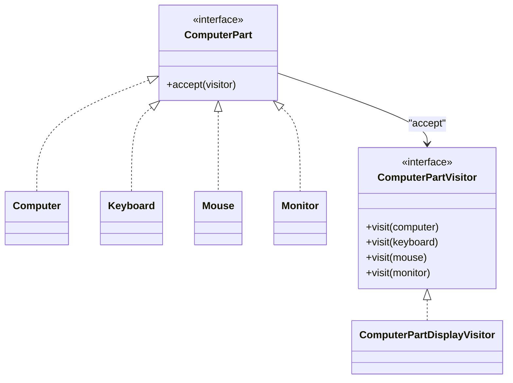
```mermaid
classDiagram
class ComputerPart {
<<interface>>
+accept(visitor)
}
class Computer
class Keyboard
class Mouse
class Monitor
class ComputerPartVisitor {
<<interface>>
+visit(computer)
+visit(keyboard)
+visit(mouse)
+visit(monitor)
}
class ComputerPartDisplayVisitor
ComputerPart <|.. Computer
ComputerPart <|.. Keyboard
ComputerPart <|.. Mouse
ComputerPart <|.. Monitor
ComputerPartVisitor <|.. ComputerPartDisplayVisitor
ComputerPart --> ComputerPartVisitor : "accept"
```

**图表来源**
- [behavioral/visitor/src/main/java/com/future/rocket/gof23/visitor/iface/ComputerPart.java](file://behavioral/visitor/src/main/java/com/future/rocket/gof23/visitor/iface/ComputerPart.java)
- [behavioral/visitor/src/main/java/com/future/rocket/gof23/visitor/impl/Computer.java](file://behavioral/visitor/src/main/java/com/future/rocket/gof23/visitor/impl/Computer.java)
- [behavioral/visitor/src/main/java/com/future/rocket/gof23/visitor/impl/Keyboard.java](file://behavioral/visitor/src/main/java/com/future/rocket/gof23/visitor/impl/Keyboard.java)
- [behavioral/visitor/src/main/java/com/future/rocket/gof23/visitor/impl/Mouse.java](file://behavioral/visitor/src/main/java/com/future/rocket/gof23/visitor/impl/Mouse.java)
- [behavioral/visitor/src/main/java/com/future/rocket/gof23/visitor/impl/Monitor.java](file://behavioral/visitor/src/main/java/com/future/rocket/gof23/visitor/impl/Monitor.java)
- [behavioral/visitor/src/main/java/com/future/rocket/gof23/visitor/iface/ComputerPartVisitor.java](file://behavioral/visitor/src/main/java/com/future/rocket/gof23/visitor/iface/ComputerPartVisitor.java)
- [behavioral/visitor/src/main/java/com/future/rocket/gof23/visitor/impl/ComputerPartDisplayVisitor.java](file://behavioral/visitor/src/main/java/com/future/rocket/gof23/visitor/impl/ComputerPartDisplayVisitor.java)

**章节来源**
- [behavioral/visitor/src/main/java/com/future/rocket/gof23/visitor/iface/ComputerPart.java](file://behavioral/visitor/src/main/java/com/future/rocket/gof23/visitor/iface/ComputerPart.java)
- [behavioral/visitor/src/main/java/com/future/rocket/gof23/visitor/impl/Computer.java](file://behavioral/visitor/src/main/java/com/future/rocket/gof23/visitor/impl/Computer.java)
- [behavioral/visitor/src/main/java/com/future/rocket/gof23/visitor/impl/Keyboard.java](file://behavioral/visitor/src/main/java/com/future/rocket/gof23/visitor/impl/Keyboard.java)
- [behavioral/visitor/src/main/java/com/future/rocket/gof23/visitor/impl/Mouse.java](file://behavioral/visitor/src/main/java/com/future/rocket/gof23/visitor/impl/Mouse.java)
- [behavioral/visitor/src/main/java/com/future/rocket/gof23/visitor/impl/Monitor.java](file://behavioral/visitor/src/main/java/com/future/rocket/gof23/visitor/impl/Monitor.java)
- [behavioral/visitor/src/main/java/com/future/rocket/gof23/visitor/iface/ComputerPartVisitor.java](file://behavioral/visitor/src/main/java/com/future/rocket/gof23/visitor/iface/ComputerPartVisitor.java)
- [behavioral/visitor/src/main/java/com/future/rocket/gof23/visitor/impl/ComputerPartDisplayVisitor.java](file://behavioral/visitor/src/main/java/com/future/rocket/gof23/visitor/impl/ComputerPartDisplayVisitor.java)

### MVC模式
- 行为特征：将数据、视图与控制器分离，降低耦合。
- 交互机制：控制器协调模型与视图；模型更新影响视图。
- 职责分配：Model承载数据；View渲染；Controller处理输入。
- 适用场景：Web应用、桌面应用界面。
- 并发考虑：视图与模型更新需同步；避免竞态。
- 性能优化：懒加载视图；批量更新。
- 扩展性设计：可替换视图/控制器实现。

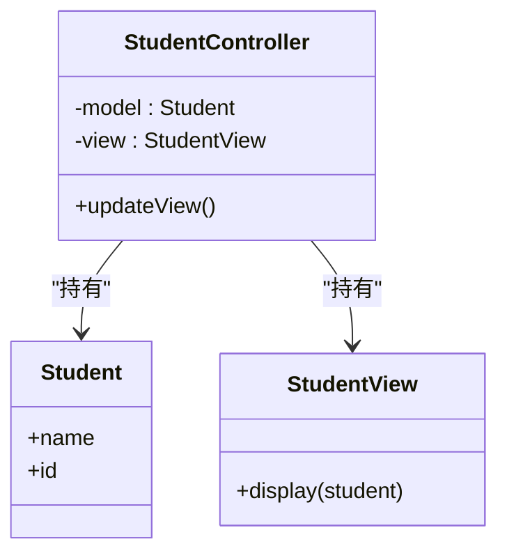
```mermaid
classDiagram
class Student {
+name
+id
}
class StudentView {
+display(student)
}
class StudentController {
-model : Student
-view : StudentView
+updateView()
}
StudentController --> Student : "持有"
StudentController --> StudentView : "持有"
```

**图表来源**
- [behavioral/mvc/src/main/java/com/future/rocket/gof23/mvc/model/Student.java](file://behavioral/mvc/src/main/java/com/future/rocket/gof23/mvc/model/Student.java)
- [behavioral/mvc/src/main/java/com/future/rocket/gof23/mvc/view/StudentView.java](file://behavioral/mvc/src/main/java/com/future/rocket/gof23/mvc/view/StudentView.java)
- [behavioral/mvc/src/main/java/com/future/rocket/gof23/mvc/controller/StudentController.java](file://behavioral/mvc/src/main/java/com/future/rocket/gof23/mvc/controller/StudentController.java)

**章节来源**
- [behavioral/mvc/src/main/java/com/future/rocket/gof23/mvc/model/Student.java](file://behavioral/mvc/src/main/java/com/future/rocket/gof23/mvc/model/Student.java)
- [behavioral/mvc/src/main/java/com/future/rocket/gof23/mvc/view/StudentView.java](file://behavioral/mvc/src/main/java/com/future/rocket/gof23/mvc/view/StudentView.java)
- [behavioral/mvc/src/main/java/com/future/rocket/gof23/mvc/controller/StudentController.java](file://behavioral/mvc/src/main/java/com/future/rocket/gof23/mvc/controller/StudentController.java)

### 业务委托模式
- 行为特征：客户端通过委托访问服务，隐藏服务查找与路由细节。
- 交互机制：客户端只依赖委托；委托选择具体服务（EJB/JMS）。
- 职责分配：Client依赖BusinessDelegate；Delegate依赖BusinessLookup与BusinessService。
- 适用场景：分布式服务、服务发现。
- 并发考虑：委托应无状态；服务端需线程安全。
- 性能优化：缓存服务实例；连接池化。
- 扩展性设计：新增服务只需实现BusinessService。

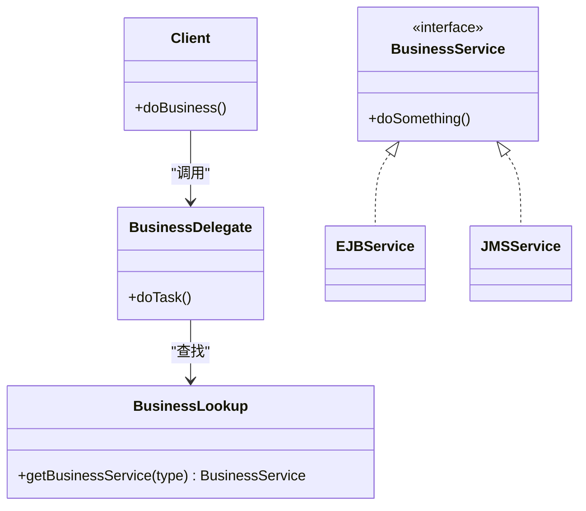
```mermaid
classDiagram
class Client {
+doBusiness()
}
class BusinessDelegate {
+doTask()
}
class BusinessLookup {
+getBusinessService(type) BusinessService
}
class BusinessService {
<<interface>>
+doSomething()
}
class EJBService
class JMSService
Client --> BusinessDelegate : "调用"
BusinessDelegate --> BusinessLookup : "查找"
BusinessService <|.. EJBService
BusinessService <|.. JMSService
```

**图表来源**
- [behavioral/businessDelegate/src/main/java/com/future/rocket/gof23/business/delegate/client/Client.java](file://behavioral/businessDelegate/src/main/java/com/future/rocket/gof23/business/delegate/client/Client.java)
- [behavioral/businessDelegate/src/main/java/com/future/rocket/gof23/business/delegate/delegate/BusinessDelegate.java](file://behavioral/businessDelegate/src/main/java/com/future/rocket/gof23/business/delegate/delegate/BusinessDelegate.java)
- [behavioral/businessDelegate/src/main/java/com/future/rocket/gof23/business/delegate/lookup/BusinessLookup.java](file://behavioral/businessDelegate/src/main/java/com/future/rocket/gof23/business/delegate/lookup/BusinessLookup.java)
- [behavioral/businessDelegate/src/main/java/com/future/rocket/gof23/business/delegate/iface/BusinessService.java](file://behavioral/businessDelegate/src/main/java/com/future/rocket/gof23/business/delegate/iface/BusinessService.java)
- [behavioral/businessDelegate/src/main/java/com/future/rocket/gof23/business/delegate/impl/EJBService.java](file://behavioral/businessDelegate/src/main/java/com/future/rocket/gof23/business/delegate/impl/EJBService.java)
- [behavioral/businessDelegate/src/main/java/com/future/rocket/gof23/business/delegate/impl/JMSService.java](file://behavioral/businessDelegate/src/main/java/com/future/rocket/gof23/business/delegate/impl/JMSService.java)

**章节来源**
- [behavioral/businessDelegate/src/main/java/com/future/rocket/gof23/business/delegate/client/Client.java](file://behavioral/businessDelegate/src/main/java/com/future/rocket/gof23/business/delegate/client/Client.java)
- [behavioral/businessDelegate/src/main/java/com/future/rocket/gof23/business/delegate/delegate/BusinessDelegate.java](file://behavioral/businessDelegate/src/main/java/com/future/rocket/gof23/business/delegate/delegate/BusinessDelegate.java)
- [behavioral/businessDelegate/src/main/java/com/future/rocket/gof23/business/delegate/lookup/BusinessLookup.java](file://behavioral/businessDelegate/src/main/java/com/future/rocket/gof23/business/delegate/lookup/BusinessLookup.java)
- [behavioral/businessDelegate/src/main/java/com/future/rocket/gof23/business/delegate/iface/BusinessService.java](file://behavioral/businessDelegate/src/main/java/com/future/rocket/gof23/business/delegate/iface/BusinessService.java)
- [behavioral/businessDelegate/src/main/java/com/future/rocket/gof23/business/delegate/impl/EJBService.java](file://behavioral/businessDelegate/src/main/java/com/future/rocket/gof23/business/delegate/impl/EJBService.java)
- [behavioral/businessDelegate/src/main/java/com/future/rocket/gof23/business/delegate/impl/JMSService.java](file://behavioral/businessDelegate/src/main/java/com/future/rocket/gof23/business/delegate/impl/JMSService.java)

### 复合实体模式
- 行为特征：将粗粒度与细粒度对象组合，统一管理生命周期。
- 交互机制：CompositeEntity协调CoarseGrainedObject与DependentObject。
- 职责分配：CompositeEntity封装组合；CoarseGrainedObject管理依赖对象。
- 适用场景：分布式对象、持久化对象。
- 并发考虑：粗粒度对象应线程安全；细粒度对象隔离。
- 性能优化：批量更新；延迟初始化。
- 扩展性设计：新增依赖对象只需实现DependentObject。

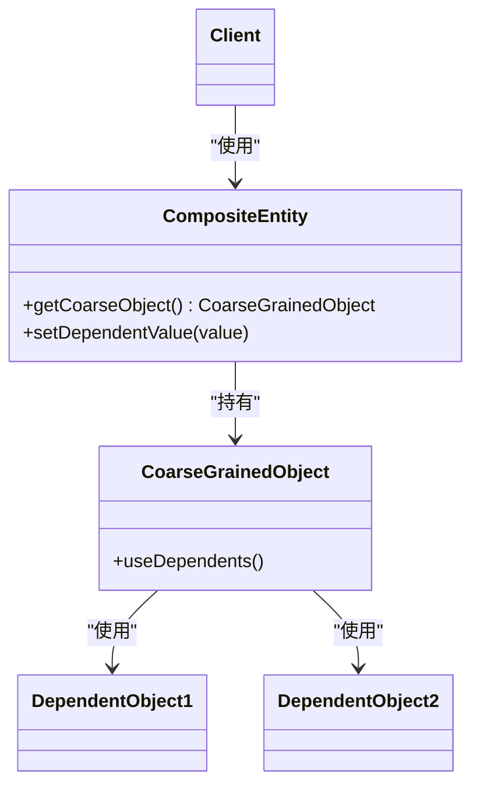
```mermaid
classDiagram
class CompositeEntity {
+getCoarseObject() CoarseGrainedObject
+setDependentValue(value)
}
class CoarseGrainedObject {
+useDependents()
}
class DependentObject1
class DependentObject2
class Client
CompositeEntity --> CoarseGrainedObject : "持有"
CoarseGrainedObject --> DependentObject1 : "使用"
CoarseGrainedObject --> DependentObject2 : "使用"
Client --> CompositeEntity : "使用"
```

**图表来源**
- [behavioral/compositeEntity/src/main/java/com/future/rocket/gof23/composite/entity/composite/CompositeEntity.java](file://behavioral/compositeEntity/src/main/java/com/future/rocket/gof23/composite/entity/composite/CompositeEntity.java)
- [behavioral/compositeEntity/src/main/java/com/future/rocket/gof23/composite/entity/dependency/CoarseGrainedObject.java](file://behavioral/compositeEntity/src/main/java/com/future/rocket/gof23/composite/entity/dependency/CoarseGrainedObject.java)
- [behavioral/compositeEntity/src/main/java/com/future/rocket/gof23/composite/entity/dependency/DependentObject1.java](file://behavioral/compositeEntity/src/main/java/com/future/rocket/gof23/composite/entity/dependency/DependentObject1.java)
- [behavioral/compositeEntity/src/main/java/com/future/rocket/gof23/composite/entity/dependency/DependentObject2.java](file://behavioral/compositeEntity/src/main/java/com/future/rocket/gof23/composite/entity/dependency/DependentObject2.java)
- [behavioral/compositeEntity/src/main/java/com/future/rocket/gof23/composite/entity/client/Client.java](file://behavioral/compositeEntity/src/main/java/com/future/rocket/gof23/composite/entity/client/Client.java)

**章节来源**
- [behavioral/compositeEntity/src/main/java/com/future/rocket/gof23/composite/entity/composite/CompositeEntity.java](file://behavioral/compositeEntity/src/main/java/com/future/rocket/gof23/composite/entity/composite/CompositeEntity.java)
- [behavioral/compositeEntity/src/main/java/com/future/rocket/gof23/composite/entity/dependency/CoarseGrainedObject.java](file://behavioral/compositeEntity/src/main/java/com/future/rocket/gof23/composite/entity/dependency/CoarseGrainedObject.java)
- [behavioral/compositeEntity/src/main/java/com/future/rocket/gof23/composite/entity/dependency/DependentObject1.java](file://behavioral/compositeEntity/src/main/java/com/future/rocket/gof23/composite/entity/dependency/DependentObject1.java)
- [behavioral/compositeEntity/src/main/java/com/future/rocket/gof23/composite/entity/dependency/DependentObject2.java](file://behavioral/compositeEntity/src/main/java/com/future/rocket/gof23/composite/entity/dependency/DependentObject2.java)
- [behavioral/compositeEntity/src/main/java/com/future/rocket/gof23/composite/entity/client/Client.java](file://behavioral/compositeEntity/src/main/java/com/future/rocket/gof23/composite/entity/client/Client.java)

### 拦截过滤器模式
- 行为特征：在请求/响应到达目标之前，对请求进行预处理与后处理。
- 交互机制：FilterChain串联多个Filter；FilterManager协调链与目标。
- 职责分配：Filter实现特定处理；FilterChain维护顺序；FilterManager装配。
- 适用场景：鉴权、日志、编码转换。
- 并发考虑：Filter应无状态；避免阻塞链路。
- 性能优化：短路返回；异步处理。
- 扩展性设计：新增Filter只需实现Filter接口。

```mermaid
classDiagram
class Filter {
<<interface>>
+execute(context)
}
class AuthenticationFilter
class DebugFilter
class FilterChain {
+addFilter(f)
+execute(context)
}
class FilterManager {
+filterChain : FilterChain
+setTarget(target)
+filterRequest(request)
}
class Target {
+execute(request)
}
class Client
Filter <|.. AuthenticationFilter
Filter <|.. DebugFilter
FilterChain --> Filter : "串联"
FilterManager --> FilterChain : "持有"
FilterManager --> Target : "设置"
Client --> FilterManager : "请求"
```

**图表来源**
- [behavioral/interceptingFilter/src/main/java/com/future/rocket/gof23/interceptor/filter/iface/Filter.java](file://behavioral/interceptingFilter/src/main/java/com/future/rocket/gof23/interceptor/filter/iface/Filter.java)
- [behavioral/interceptingFilter/src/main/java/com/future/rocket/gof23/interceptor/filter/impl/AuthenticationFilter.java](file://behavioral/interceptingFilter/src/main/java/com/future/rocket/gof23/interceptor/filter/impl/AuthenticationFilter.java)
- [behavioral/interceptingFilter/src/main/java/com/future/rocket/gof23/interceptor/filter/impl/DebugFilter.java](file://behavioral/interceptingFilter/src/main/java/com/future/rocket/gof23/interceptor/filter/impl/DebugFilter.java)
- [behavioral/interceptingFilter/src/main/java/com/future/rocket/gof23/interceptor/filter/chain/FilterChain.java](file://behavioral/interceptingFilter/src/main/java/com/future/rocket/gof23/interceptor/filter/chain/FilterChain.java)
- [behavioral/interceptingFilter/src/main/java/com/future/rocket/gof23/interceptor/filter/manager/FilterManager.java](file://behavioral/interceptingFilter/src/main/java/com/future/rocket/gof23/interceptor/filter/manager/FilterManager.java)
- [behavioral/interceptingFilter/src/main/java/com/future/rocket/gof23/interceptor/filter/target/Target.java](file://behavioral/interceptingFilter/src/main/java/com/future/rocket/gof23/interceptor/filter/target/Target.java)
- [behavioral/interceptingFilter/src/main/java/com/future/rocket/gof23/interceptor/filter/client/Client.java](file://behavioral/interceptingFilter/src/main/java/com/future/rocket/gof23/interceptor/filter/client/Client.java)

**章节来源**
- [behavioral/interceptingFilter/src/main/java/com/future/rocket/gof23/interceptor/filter/iface/Filter.java](file://behavioral/interceptingFilter/src/main/java/com/future/rocket/gof23/interceptor/filter/iface/Filter.java)
- [behavioral/interceptingFilter/src/main/java/com/future/rocket/gof23/interceptor/filter/impl/AuthenticationFilter.java](file://behavioral/interceptingFilter/src/main/java/com/future/rocket/gof23/interceptor/filter/impl/AuthenticationFilter.java)
- [behavioral/interceptingFilter/src/main/java/com/future/rocket/gof23/interceptor/filter/impl/DebugFilter.java](file://behavioral/interceptingFilter/src/main/java/com/future/rocket/gof23/interceptor/filter/impl/DebugFilter.java)
- [behavioral/interceptingFilter/src/main/java/com/future/rocket/gof23/interceptor/filter/chain/FilterChain.java](file://behavioral/interceptingFilter/src/main/java/com/future/rocket/gof23/interceptor/filter/chain/FilterChain.java)
- [behavioral/interceptingFilter/src/main/java/com/future/rocket/gof23/interceptor/filter/manager/FilterManager.java](file://behavioral/interceptingFilter/src/main/java/com/future/rocket/gof23/interceptor/filter/manager/FilterManager.java)
- [behavioral/interceptingFilter/src/main/java/com/future/rocket/gof23/interceptor/filter/target/Target.java](file://behavioral/interceptingFilter/src/main/java/com/future/rocket/gof23/interceptor/filter/target/Target.java)
- [behavioral/interceptingFilter/src/main/java/com/future/rocket/gof23/interceptor/filter/client/Client.java](file://behavioral/interceptingFilter/src/main/java/com/future/rocket/gof23/interceptor/filter/client/Client.java)

## 依赖分析
- 组件内聚：各模式内部类职责清晰，接口与实现分离良好。
- 组件耦合：命令与责任链通过接口解耦；观察者与状态通过接口解耦；中介者通过接口解耦。
- 外部依赖：无外部库依赖，纯Java实现，易于移植。
- 循环依赖：未发现循环依赖，结构稳定。

```mermaid
graph LR
Broker["Broker"] --> Order["Order"]
Order --> Stock["Stock"]
AbstractLogger --> ConsoleLogger
AbstractLogger --> FileLogger
AbstractLogger --> ErrorLogger
Subject --> Observer
Observer --> BinaryObserver
Observer --> HexObserver
Observer --> OctalObserver
Context --> State
State --> StartState
State --> StopState
State --> UpState
State --> DownState
State --> RunState
```

**图表来源**
- [behavioral/command/src/main/java/com/future/rocket/gof23/command/invoker/Broker.java:1-19](file://behavioral/command/src/main/java/com/future/rocket/gof23/command/invoker/Broker.java#L1-L19)
- [behavioral/command/src/main/java/com/future/rocket/gof23/command/iface/Order.java:1-6](file://behavioral/command/src/main/java/com/future/rocket/gof23/command/iface/Order.java#L1-L6)
- [behavioral/command/src/main/java/com/future/rocket/gof23/command/receiver/Stock.java:1-30](file://behavioral/command/src/main/java/com/future/rocket/gof23/command/receiver/Stock.java#L1-L30)
- [behavioral/chain/src/main/java/com/future/rocket/gof23/chain/behavior/AbstractLogger.java:1-28](file://behavioral/chain/src/main/java/com/future/rocket/gof23/chain/behavior/AbstractLogger.java#L1-L28)
- [behavioral/observer/src/main/java/com/future/rocket/gof23/observer/impl1/Subject.java](file://behavioral/observer/src/main/java/com/future/rocket/gof23/observer/impl1/Subject.java)
- [behavioral/observer/src/main/java/com/future/rocket/gof23/observer/impl1/Observer.java](file://behavioral/observer/src/main/java/com/future/rocket/gof23/observer/impl1/Observer.java)
- [behavioral/state/src/main/java/com/future/rocket/gof23/state/info/Context.java](file://behavioral/state/src/main/java/com/future/rocket/gof23/state/info/Context.java)

**章节来源**
- [behavioral/command/src/main/java/com/future/rocket/gof23/command/invoker/Broker.java:1-19](file://behavioral/command/src/main/java/com/future/rocket/gof23/command/invoker/Broker.java#L1-L19)
- [behavioral/command/src/main/java/com/future/rocket/gof23/command/iface/Order.java:1-6](file://behavioral/command/src/main/java/com/future/rocket/gof23/command/iface/Order.java#L1-L6)
- [behavioral/command/src/main/java/com/future/rocket/gof23/command/receiver/Stock.java:1-30](file://behavioral/command/src/main/java/com/future/rocket/gof23/command/receiver/Stock.java#L1-L30)
- [behavioral/chain/src/main/java/com/future/rocket/gof23/chain/behavior/AbstractLogger.java:1-28](file://behavioral/chain/src/main/java/com/future/rocket/gof23/chain/behavior/AbstractLogger.java#L1-L28)
- [behavioral/observer/src/main/java/com/future/rocket/gof23/observer/impl1/Subject.java](file://behavioral/observer/src/main/java/com/future/rocket/gof23/observer/impl1/Subject.java)
- [behavioral/observer/src/main/java/com/future/rocket/gof23/observer/impl1/Observer.java](file://behavioral/observer/src/main/java/com/future/rocket/gof23/observer/impl1/Observer.java)
- [behavioral/state/src/main/java/com/future/rocket/gof23/state/info/Context.java](file://behavioral/state/src/main/java/com/future/rocket/gof23/state/info/Context.java)

## 性能考虑
- 解耦与复用：通过接口与抽象类降低耦合，提升可测试性与可维护性。
- 并发安全：命令与状态模式需关注线程安全；中介者与过滤器链需避免阻塞。
- 资源管理：业务委托与拦截过滤器应避免资源泄露；及时释放连接与句柄。
- 扩展成本：策略与模板方法便于扩展；但需控制分支数量与复杂度。
- 缓存与池化：命令队列与过滤器链可引入池化与批处理优化吞吐。

## 故障排查指南
- 责任链：若请求未被处理，检查链路顺序与级别阈值；确认nextLogger是否正确设置。
- 命令：若执行失败，检查命令对象是否正确绑定接收者；确认批量执行顺序。
- 解释器：若解析异常，检查表达式组合与上下文数据；确保终结符匹配。
- 迭代器：若遍历异常，检查hasNext与next边界；避免并发修改容器。
- 中介者：若消息丢失，检查中介实现与用户注册；确认send/recv调用。
- 备忘录：若回滚失败，检查状态一致性；避免跨线程共享可变状态。
- 观察者：若通知缺失，检查attach/detach与notify时机；避免在通知中修改集合。
- 状态：若状态错乱，检查状态转移条件；确保原子性与可见性。
- 空对象：若行为异常，检查空对象实现是否覆盖关键方法。
- 策略：若算法错误，检查策略选择逻辑与参数传递。
- 模板：若流程异常，检查子类覆盖点与前置条件。
- 访问者：若访问失败，检查accept与visit匹配；避免重复访问。
- MVC：若视图不更新，检查控制器与模型更新；确认绑定关系。
- 业务委托：若服务不可达，检查BusinessLookup与ServiceType映射。
- 复合实体：若生命周期异常，检查CoarseGrainedObject与DependentObject协作。
- 拦截过滤器：若请求被阻断，检查Filter链顺序与短路条件。

**章节来源**
- [behavioral/chain/src/main/java/com/future/rocket/gof23/chain/behavior/AbstractLogger.java:16-24](file://behavioral/chain/src/main/java/com/future/rocket/gof23/chain/behavior/AbstractLogger.java#L16-L24)
- [behavioral/command/src/main/java/com/future/rocket/gof23/command/invoker/Broker.java:15-17](file://behavioral/command/src/main/java/com/future/rocket/gof23/command/invoker/Broker.java#L15-L17)
- [behavioral/observer/src/main/java/com/future/rocket/gof23/observer/impl1/Subject.java](file://behavioral/observer/src/main/java/com/future/rocket/gof23/observer/impl1/Subject.java)
- [behavioral/state/src/main/java/com/future/rocket/gof23/state/info/Context.java](file://behavioral/state/src/main/java/com/future/rocket/gof23/state/info/Context.java)
- [behavioral/businessDelegate/src/main/java/com/future/rocket/gof23/business/delegate/lookup/BusinessLookup.java](file://behavioral/businessDelegate/src/main/java/com/future/rocket/gof23/business/delegate/lookup/BusinessLookup.java)
- [behavioral/interceptingFilter/src/main/java/com/future/rocket/gof23/interceptor/filter/chain/FilterChain.java](file://behavioral/interceptingFilter/src/main/java/com/future/rocket/gof23/interceptor/filter/chain/FilterChain.java)

## 结论
行为型模式通过“封装变化”与“解耦协作”实现灵活与可扩展的系统设计。责任链、命令、解释器、迭代器、中介者、备忘录、观察者、状态、空对象、策略、模板方法、访问者、MVC、业务委托、复合实体与拦截过滤器共同构成了面向对象设计中的行为层。实践中应结合业务场景选择合适模式，并关注并发、性能与扩展性，以获得长期可维护的系统架构。

## 附录
- 模式选择建议：优先考虑职责单一与接口抽象；在高并发场景下优先选择无状态或线程安全的模式实现。
- 最佳实践：保持接口稳定；避免过度设计；在复杂场景下组合使用多种模式。
- 参考实现：各模式目录下的接口与实现文件提供了清晰的参考路径，便于迁移与扩展。