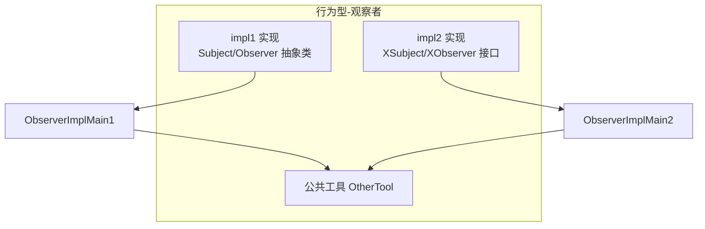
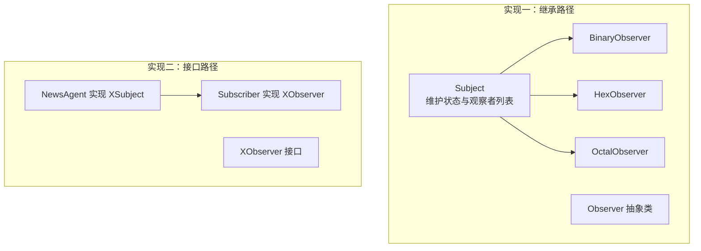
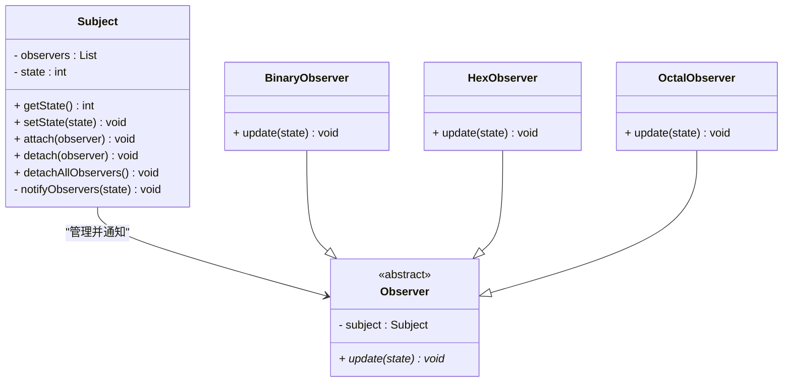
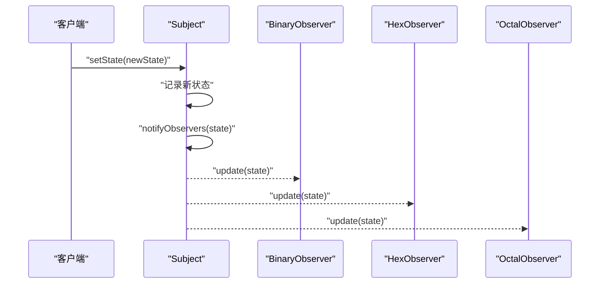
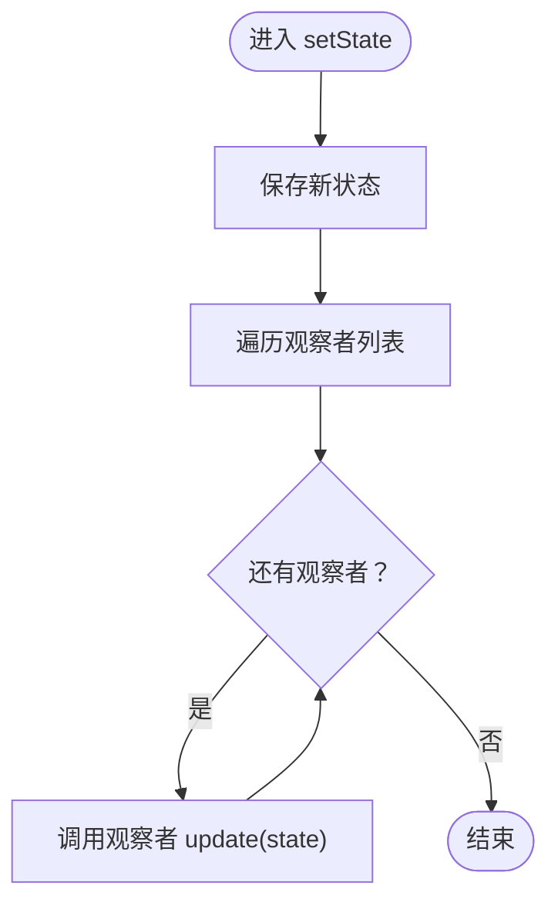
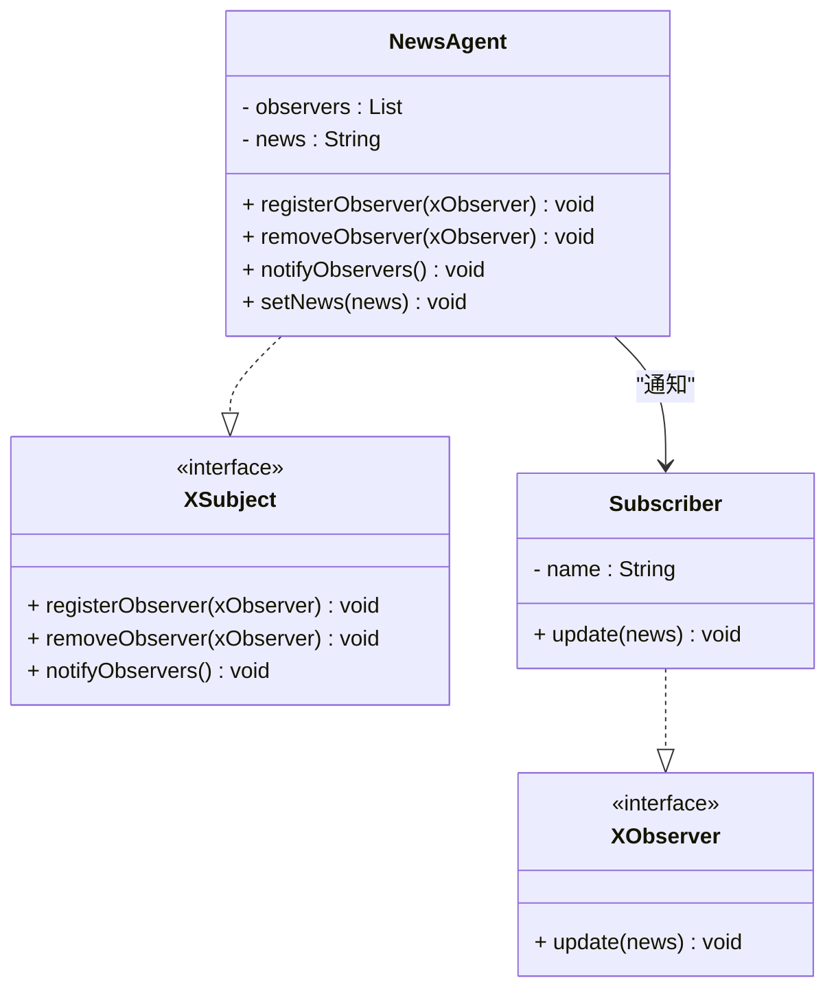
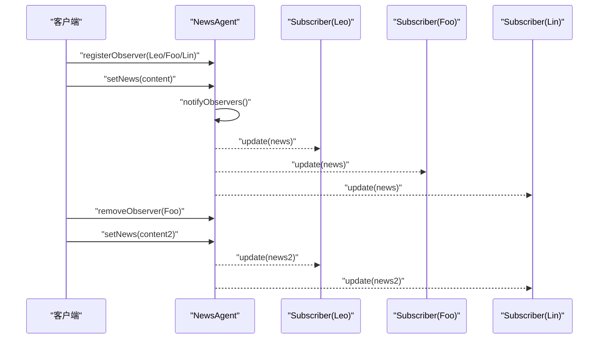
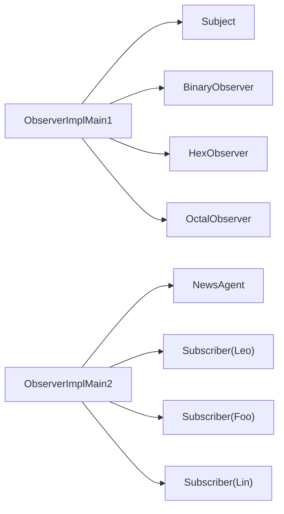

# 观察者模式

<cite>
**本文引用的文件**
- [Observer.java](file://behavioral/observer/src/main/java/com/future/rocket/gof23/observer/impl1/Observer.java)
- [Subject.java](file://behavioral/observer/src/main/java/com/future/rocket/gof23/observer/impl1/Subject.java)
- [BinaryObserver.java](file://behavioral/observer/src/main/java/com/future/rocket/gof23/observer/impl1/BinaryObserver.java)
- [HexObserver.java](file://behavioral/observer/src/main/java/com/future/rocket/gof23/observer/impl1/HexObserver.java)
- [OctalObserver.java](file://behavioral/observer/src/main/java/com/future/rocket/gof23/observer/impl1/OctalObserver.java)
- [ObserverImplMain1.java](file://behavioral/observer/src/main/java/com/future/rocket/gof23/observer/impl1/ObserverImplMain1.java)
- [XObserver.java](file://behavioral/observer/src/main/java/com/future/rocket/gof23/observer/impl2/iface/XObserver.java)
- [XSubject.java](file://behavioral/observer/src/main/java/com/future/rocket/gof23/observer/impl2/iface/XSubject.java)
- [NewsAgent.java](file://behavioral/observer/src/main/java/com/future/rocket/gof23/observer/impl2/NewsAgent.java)
- [Subscriber.java](file://behavioral/observer/src/main/java/com/future/rocket/gof23/observer/impl2/Subscriber.java)
- [ObserverImplMain2.java](file://behavioral/observer/src/main/java/com/future/rocket/gof23/observer/impl2/ObserverImplMain2.java)
- [OtherTool.java](file://common/src/main/java/com/future/rocket/gof23/common/OtherTool.java)
- [readme.md](file://behavioral/observer/readme.md)
- [pom.xml](file://behavioral/observer/pom.xml)
</cite>

## 目录
1. [引言](#引言)
2. [项目结构](#项目结构)
3. [核心组件](#核心组件)
4. [架构总览](#架构总览)
5. [详细组件分析](#详细组件分析)
6. [依赖分析](#依赖分析)
7. [性能考虑](#性能考虑)
8. [故障排查指南](#故障排查指南)
9. [结论](#结论)
10. [附录](#附录)

## 引言
本文件围绕观察者模式展开，系统性梳理其核心机制与两种典型实现路径：  
- 基于继承的观察者实现（二进制、十六进制、八进制观察者）  
- 基于接口的观察者实现（新闻代理与订阅者）  

文档将给出完整的发布-订阅流程图与状态变更传播机制，覆盖事件驱动系统、GUI 编程、数据绑定与微服务架构中的应用场景；同时讨论异步通知、异常处理、循环依赖规避与性能优化策略，并区分同步与异步观察者的实现差异。最后提供从简单通知到复杂事件系统的渐进式学习路径。

## 项目结构
观察者模式示例位于 behavioral/observer 模块中，分为两套实现：
- impl1：基于继承的 Subject 与 Observer 抽象类，派生出多种具体观察者
- impl2：基于接口 XSubject 与 XObserver 的解耦实现，NewsAgent 作为被观察者，Subscriber 作为观察者

图表来源
- [ObserverImplMain1.java:1-28](file://behavioral/observer/src/main/java/com/future/rocket/gof23/observer/impl1/ObserverImplMain1.java#L1-L28)
- [ObserverImplMain2.java:1-28](file://behavioral/observer/src/main/java/com/future/rocket/gof23/observer/impl2/ObserverImplMain2.java#L1-L28)
- [OtherTool.java:1-12](file://common/src/main/java/com/future/rocket/gof23/common/OtherTool.java#L1-L12)

章节来源
- [pom.xml:1-20](file://behavioral/observer/pom.xml#L1-L20)
- [readme.md:1-26](file://behavioral/observer/readme.md#L1-L26)

## 核心组件
- 被观察者（Subject/ConcreteSubject）：维护观察者集合，提供注册、移除、清空与通知方法；当内部状态变化时触发通知
- 观察者（Observer/ConcreteObserver）：定义统一的更新接口，接收被观察者状态或事件并执行相应动作
- 具体实现一（继承路径）：Subject 维护整型状态，观察者以不同进制格式打印；通过构造函数自动注册
- 具体实现二（接口路径）：XSubject/XObserver 定义职责边界，NewsAgent 管理字符串新闻内容，Subscriber 打印订阅信息

章节来源
- [Subject.java:1-43](file://behavioral/observer/src/main/java/com/future/rocket/gof23/observer/impl1/Subject.java#L1-L43)
- [Observer.java:1-8](file://behavioral/observer/src/main/java/com/future/rocket/gof23/observer/impl1/Observer.java#L1-L8)
- [BinaryObserver.java:1-15](file://behavioral/observer/src/main/java/com/future/rocket/gof23/observer/impl1/BinaryObserver.java#L1-L15)
- [HexObserver.java:1-15](file://behavioral/observer/src/main/java/com/future/rocket/gof23/observer/impl1/HexObserver.java#L1-L15)
- [OctalObserver.java:1-15](file://behavioral/observer/src/main/java/com/future/rocket/gof23/observer/impl1/OctalObserver.java#L1-L15)
- [XSubject.java:1-9](file://behavioral/observer/src/main/java/com/future/rocket/gof23/observer/impl2/iface/XSubject.java#L1-L9)
- [XObserver.java:1-7](file://behavioral/observer/src/main/java/com/future/rocket/gof23/observer/impl2/iface/XObserver.java#L1-L7)
- [NewsAgent.java:1-36](file://behavioral/observer/src/main/java/com/future/rocket/gof23/observer/impl2/NewsAgent.java#L1-L36)
- [Subscriber.java:1-18](file://behavioral/observer/src/main/java/com/future/rocket/gof23/observer/impl2/Subscriber.java#L1-L18)

## 架构总览
下图展示两类实现的总体交互：被观察者在状态变更后遍历观察者列表并调用更新接口；观察者各自完成本地化处理。

图表来源
- [Subject.java:1-43](file://behavioral/observer/src/main/java/com/future/rocket/gof23/observer/impl1/Subject.java#L1-L43)
- [Observer.java:1-8](file://behavioral/observer/src/main/java/com/future/rocket/gof23/observer/impl1/Observer.java#L1-L8)
- [BinaryObserver.java:1-15](file://behavioral/observer/src/main/java/com/future/rocket/gof23/observer/impl1/BinaryObserver.java#L1-L15)
- [HexObserver.java:1-15](file://behavioral/observer/src/main/java/com/future/rocket/gof23/observer/impl1/HexObserver.java#L1-L15)
- [OctalObserver.java:1-15](file://behavioral/observer/src/main/java/com/future/rocket/gof23/observer/impl1/OctalObserver.java#L1-L15)
- [XSubject.java:1-9](file://behavioral/observer/src/main/java/com/future/rocket/gof23/observer/impl2/iface/XSubject.java#L1-L9)
- [XObserver.java:1-7](file://behavioral/observer/src/main/java/com/future/rocket/gof23/observer/impl2/iface/XObserver.java#L1-L7)
- [NewsAgent.java:1-36](file://behavioral/observer/src/main/java/com/future/rocket/gof23/observer/impl2/NewsAgent.java#L1-L36)
- [Subscriber.java:1-18](file://behavioral/observer/src/main/java/com/future/rocket/gof23/observer/impl2/Subscriber.java#L1-L18)

## 详细组件分析

### 实现一：基于继承的观察者
- Subject 职责：持有状态与观察者列表，提供 setState/attach/detach/detachAllObservers；状态变化时遍历调用观察者 update
- Observer 抽象类：定义 update 接口，子类按需实现本地化处理
- 具体观察者：BinaryObserver/HexObserver/OctalObserver 在构造时自动 attach 到 Subject，并在 update 中进行格式化输出

图表来源
- [Subject.java:1-43](file://behavioral/observer/src/main/java/com/future/rocket/gof23/observer/impl1/Subject.java#L1-L43)
- [Observer.java:1-8](file://behavioral/observer/src/main/java/com/future/rocket/gof23/observer/impl1/Observer.java#L1-L8)
- [BinaryObserver.java:1-15](file://behavioral/observer/src/main/java/com/future/rocket/gof23/observer/impl1/BinaryObserver.java#L1-L15)
- [HexObserver.java:1-15](file://behavioral/observer/src/main/java/com/future/rocket/gof23/observer/impl1/HexObserver.java#L1-L15)
- [OctalObserver.java:1-15](file://behavioral/observer/src/main/java/com/future/rocket/gof23/observer/impl1/OctalObserver.java#L1-L15)

发布-订阅流程（实现一）

图表来源
- [Subject.java:16-41](file://behavioral/observer/src/main/java/com/future/rocket/gof23/observer/impl1/Subject.java#L16-L41)
- [BinaryObserver.java:10-13](file://behavioral/observer/src/main/java/com/future/rocket/gof23/observer/impl1/BinaryObserver.java#L10-L13)
- [HexObserver.java:10-13](file://behavioral/observer/src/main/java/com/future/rocket/gof23/observer/impl1/HexObserver.java#L10-L13)
- [OctalObserver.java:10-13](file://behavioral/observer/src/main/java/com/future/rocket/gof23/observer/impl1/OctalObserver.java#L10-L13)

状态变更传播机制（实现一）

图表来源
- [Subject.java:16-41](file://behavioral/observer/src/main/java/com/future/rocket/gof23/observer/impl1/Subject.java#L16-L41)

章节来源
- [ObserverImplMain1.java:1-28](file://behavioral/observer/src/main/java/com/future/rocket/gof23/observer/impl1/ObserverImplMain1.java#L1-L28)

### 实现二：基于接口的观察者
- XSubject：定义 registerObserver/removeObserver/notifyObservers 三要素
- XObserver：定义 update 回调
- NewsAgent：实现 XSubject，维护字符串新闻内容并在变更时通知所有观察者
- Subscriber：实现 XObserver，接收新闻并打印订阅信息

图表来源
- [XSubject.java:1-9](file://behavioral/observer/src/main/java/com/future/rocket/gof23/observer/impl2/iface/XSubject.java#L1-L9)
- [XObserver.java:1-7](file://behavioral/observer/src/main/java/com/future/rocket/gof23/observer/impl2/iface/XObserver.java#L1-L7)
- [NewsAgent.java:1-36](file://behavioral/observer/src/main/java/com/future/rocket/gof23/observer/impl2/NewsAgent.java#L1-L36)
- [Subscriber.java:1-18](file://behavioral/observer/src/main/java/com/future/rocket/gof23/observer/impl2/Subscriber.java#L1-L18)

发布-订阅流程（实现二）

图表来源
- [NewsAgent.java:14-34](file://behavioral/observer/src/main/java/com/future/rocket/gof23/observer/impl2/NewsAgent.java#L14-L34)
- [Subscriber.java:13-16](file://behavioral/observer/src/main/java/com/future/rocket/gof23/observer/impl2/Subscriber.java#L13-L16)
- [ObserverImplMain2.java:11-25](file://behavioral/observer/src/main/java/com/future/rocket/gof23/observer/impl2/ObserverImplMain2.java#L11-L25)

章节来源
- [ObserverImplMain2.java:1-28](file://behavioral/observer/src/main/java/com/future/rocket/gof23/observer/impl2/ObserverImplMain2.java#L1-L28)

### 同步与异步观察者差异
- 同步：被观察者在 setState/setNews 后立即遍历并调用观察者 update，等待所有回调完成再返回
- 异步：可引入线程池或事件队列，在 setState/setNews 后仅入队通知任务，由后台线程批量消费并调用观察者 update，提升吞吐与响应性

[本节为概念性说明，不直接分析具体文件]

### 应用场景与最佳实践
- 事件驱动系统：以 NewsAgent 为例，将业务事件抽象为“新闻”，观察者负责渲染或落库
- GUI 编程：窗口状态变化触发控件刷新；按钮点击触发菜单更新
- 数据绑定：模型状态变化触发视图更新
- 微服务架构：事件总线/消息中间件作为被观察者，订阅者为各服务模块

[本节为概念性说明，不直接分析具体文件]

## 依赖分析
- 两套实现均未引入外部第三方依赖，仅使用 Java 标准库容器与基础类型
- 两个入口主类分别演示两种实现的生命周期：注册观察者、触发通知、移除观察者、再次注册与通知

图表来源
- [ObserverImplMain1.java:11-25](file://behavioral/observer/src/main/java/com/future/rocket/gof23/observer/impl1/ObserverImplMain1.java#L11-L25)
- [ObserverImplMain2.java:11-25](file://behavioral/observer/src/main/java/com/future/rocket/gof23/observer/impl2/ObserverImplMain2.java#L11-L25)

章节来源
- [pom.xml:1-20](file://behavioral/observer/pom.xml#L1-L20)

## 性能考虑
- 时间复杂度：通知阶段为 O(N)，N 为当前观察者数量；可通过分组通知或批量处理降低抖动
- 内存占用：观察者列表增长导致内存线性增长；建议在高并发场景限制最大观察者数或采用弱引用
- 并发安全：在多线程环境下，遍历与增删操作需加锁或使用线程安全容器；异步实现中注意队列容量与背压
- 事件风暴：对高频事件进行合并（如去抖/节流）或降采样，避免观察者过载
- 反馈环路：避免观察者在 update 中直接修改被观察者状态，防止无限循环；必要时延迟处理或使用事件队列

[本节为通用指导，不直接分析具体文件]

## 故障排查指南
- 观察者未收到通知
  - 检查是否正确 attach/register
  - 确认状态变更路径是否触发 notifyObservers
  - 核对 update 参数类型与期望一致
- 观察者重复接收
  - 避免重复 attach/register
  - 移除旧引用后再重新注册
- 性能问题
  - 减少观察者数量或拆分关注点
  - 使用异步通知与批处理
  - 对热点事件进行限流与合并
- 异常处理
  - 在通知循环中捕获单个观察者异常，避免中断后续通知
  - 记录失败日志并支持重试或降级

[本节为通用指导，不直接分析具体文件]

## 结论
观察者模式通过“一对多”的依赖关系实现了松耦合的事件传播。继承路径实现简洁直观，适合小规模、强内聚场景；接口路径实现更灵活，便于扩展与跨模块协作。结合异步通知、异常隔离与性能优化策略，可在事件驱动系统、GUI、数据绑定与微服务中发挥重要作用。

## 附录
- 渐进学习路径
  - 第一步：实现一（继承）——理解状态变更与通知循环
  - 第二步：实现二（接口）——掌握解耦与扩展性
  - 第三步：异步通知——引入线程池与事件队列
  - 第四步：异常隔离与限流——构建生产级事件系统
- 参考文件
  - [readme.md:1-26](file://behavioral/observer/readme.md#L1-L26)