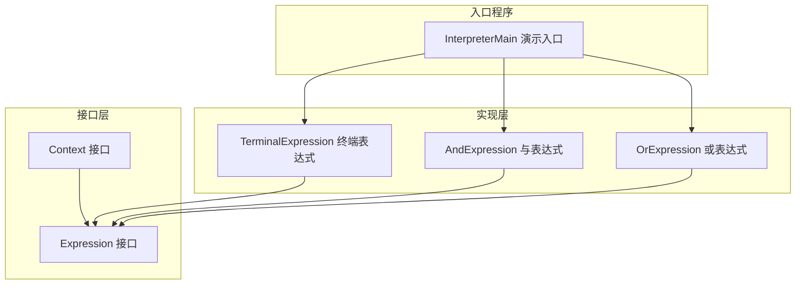
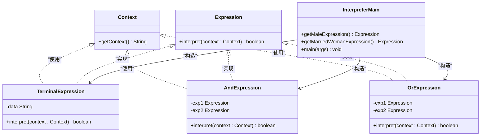
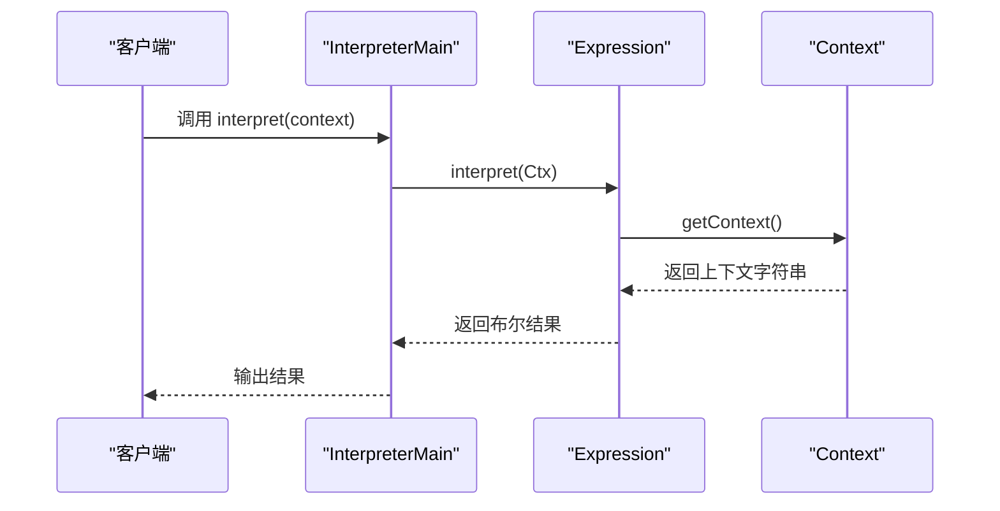
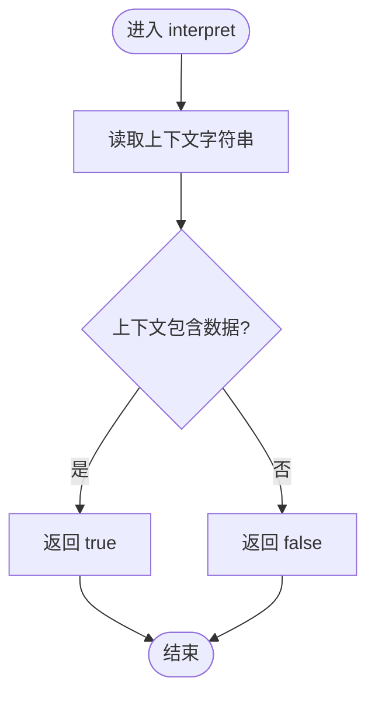
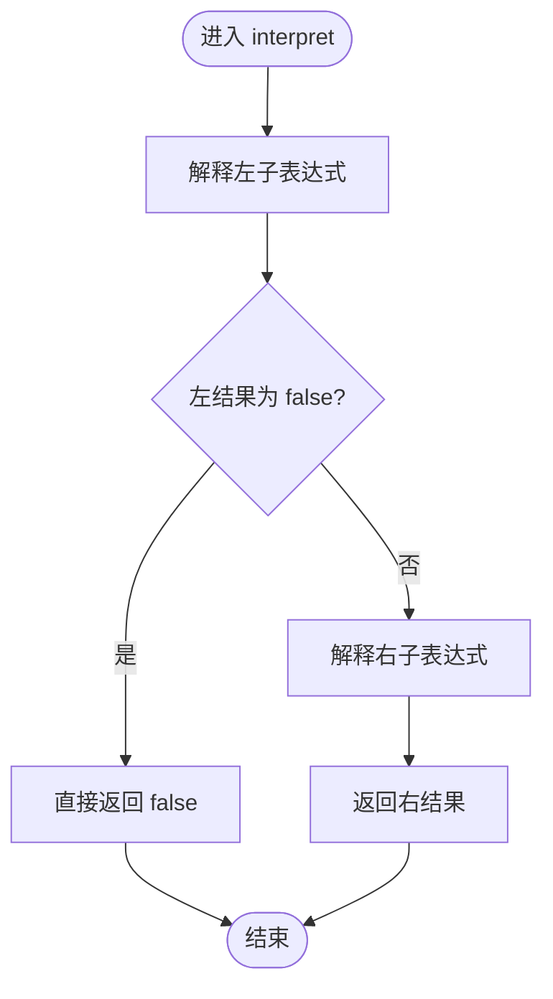
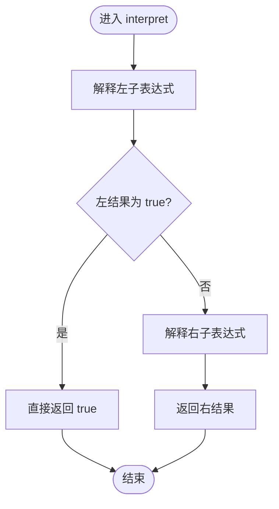
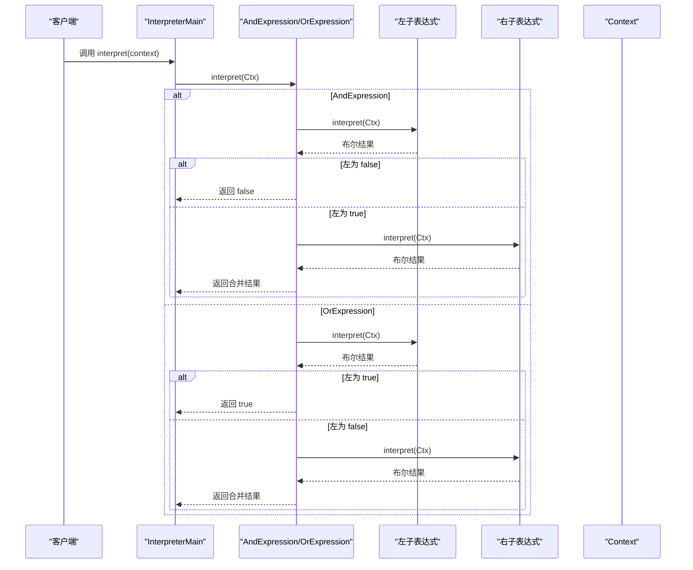
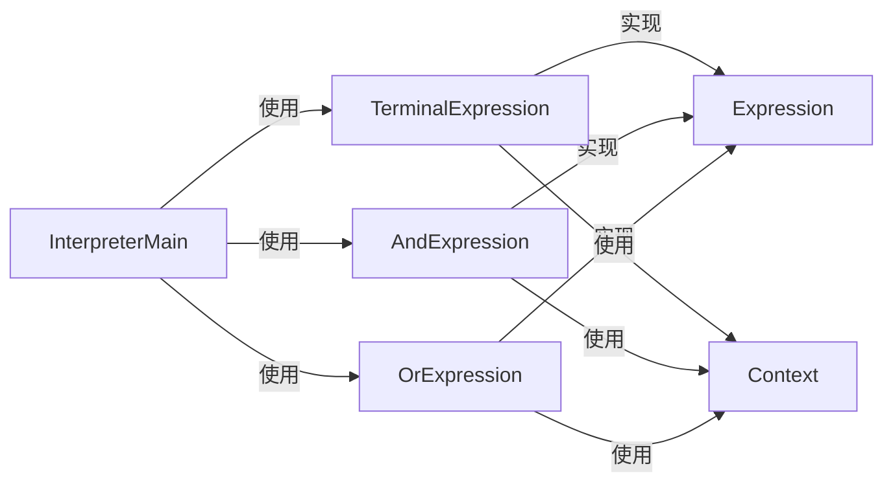

# 解释器模式

<cite>
**本文引用的文件**
- [Context.java](file://behavioral/interpreter/src/main/java/com/future/rocket/gof23/interpreter/iface/Context.java)
- [Expression.java](file://behavioral/interpreter/src/main/java/com/future/rocket/gof23/interpreter/iface/Expression.java)
- [AndExpression.java](file://behavioral/interpreter/src/main/java/com/future/rocket/gof23/interpreter/impl/AndExpression.java)
- [OrExpression.java](file://behavioral/interpreter/src/main/java/com/future/rocket/gof23/interpreter/impl/OrExpression.java)
- [TerminalExpression.java](file://behavioral/interpreter/src/main/java/com/future/rocket/gof23/interpreter/impl/TerminalExpression.java)
- [InterpreterMain.java](file://behavioral/interpreter/src/main/java/com/future/rocket/gof23/interpreter/InterpreterMain.java)
- [pom.xml](file://behavioral/interpreter/pom.xml)
- [readme.md](file://readme.md)
</cite>

## 目录
1. [简介](#简介)
2. [项目结构](#项目结构)
3. [核心组件](#核心组件)
4. [架构总览](#架构总览)
5. [详细组件分析](#详细组件分析)
6. [依赖分析](#依赖分析)
7. [性能考虑](#性能考虑)
8. [故障排查指南](#故障排查指南)
9. [结论](#结论)
10. [附录](#附录)

## 简介
本文件系统性阐述解释器模式的设计思想与实现细节，围绕“为语言中的句子或表达式定义一个表示，并定义一个解释器，通过该解释器来解释语言中的句子”这一核心理念展开。本文以仓库中的布尔表达式示例为基础，解析上下文接口、表达式接口以及具体表达式（与、或、终端）之间的组合机制；并给出语法树构建与表达式求值的完整流程图；最后讨论解释器模式在DSL（领域特定语言）、规则引擎与表达式计算中的应用、性能优化策略（如缓存解释结果）、内存管理与复杂表达式的处理技巧。

## 项目结构
解释器模式示例位于行为型模式模块下，采用接口+实现分层组织：
- 接口层：Context（上下文接口）、Expression（表达式接口）
- 实现层：TerminalExpression（终端表达式）、AndExpression（与表达式）、OrExpression（或表达式）
- 入口程序：InterpreterMain（演示如何构建表达式树并进行求值）

图表来源
- [Context.java:1-6](file://behavioral/interpreter/src/main/java/com/future/rocket/gof23/interpreter/iface/Context.java#L1-L6)
- [Expression.java:1-6](file://behavioral/interpreter/src/main/java/com/future/rocket/gof23/interpreter/iface/Expression.java#L1-L6)
- [TerminalExpression.java:1-17](file://behavioral/interpreter/src/main/java/com/future/rocket/gof23/interpreter/impl/TerminalExpression.java#L1-L17)
- [AndExpression.java:1-20](file://behavioral/interpreter/src/main/java/com/future/rocket/gof23/interpreter/impl/AndExpression.java#L1-L20)
- [OrExpression.java:1-19](file://behavioral/interpreter/src/main/java/com/future/rocket/gof23/interpreter/impl/OrExpression.java#L1-L19)
- [InterpreterMain.java:1-66](file://behavioral/interpreter/src/main/java/com/future/rocket/gof23/interpreter/InterpreterMain.java#L1-L66)

章节来源
- [pom.xml:1-20](file://behavioral/interpreter/pom.xml#L1-L20)
- [readme.md:1-9](file://readme.md#L1-L9)

## 核心组件
- 上下文接口 Context：提供解释所需的外部环境数据（例如字符串内容），供表达式解释时使用。
- 表达式接口 Expression：定义统一的解释方法，所有表达式实现该接口以支持递归解释。
- 终端表达式 TerminalExpression：最基础的叶子节点，直接基于上下文判断返回布尔值。
- 与表达式 AndExpression：复合表达式，对两个子表达式进行逻辑与运算。
- 或表达式 OrExpression：复合表达式，对两个子表达式进行逻辑或运算。
- 演示入口 InterpreterMain：构建表达式树并调用 interpret 执行求值。

章节来源
- [Context.java:1-6](file://behavioral/interpreter/src/main/java/com/future/rocket/gof23/interpreter/iface/Context.java#L1-L6)
- [Expression.java:1-6](file://behavioral/interpreter/src/main/java/com/future/rocket/gof23/interpreter/iface/Expression.java#L1-L6)
- [TerminalExpression.java:1-17](file://behavioral/interpreter/src/main/java/com/future/rocket/gof23/interpreter/impl/TerminalExpression.java#L1-L17)
- [AndExpression.java:1-20](file://behavioral/interpreter/src/main/java/com/future/rocket/gof23/interpreter/impl/AndExpression.java#L1-L20)
- [OrExpression.java:1-19](file://behavioral/interpreter/src/main/java/com/future/rocket/gof23/interpreter/impl/OrExpression.java#L1-L19)
- [InterpreterMain.java:1-66](file://behavioral/interpreter/src/main/java/com/future/rocket/gof23/interpreter/InterpreterMain.java#L1-L66)

## 架构总览
解释器模式通过“抽象语法树（AST）”将语言的句子/表达式表示为对象树，每个节点是一个表达式对象，叶子节点是终端表达式，内部节点是复合表达式。解释过程自顶向下递归执行，最终得到布尔结果。

图表来源
- [Context.java:1-6](file://behavioral/interpreter/src/main/java/com/future/rocket/gof23/interpreter/iface/Context.java#L1-L6)
- [Expression.java:1-6](file://behavioral/interpreter/src/main/java/com/future/rocket/gof23/interpreter/iface/Expression.java#L1-L6)
- [TerminalExpression.java:1-17](file://behavioral/interpreter/src/main/java/com/future/rocket/gof23/interpreter/impl/TerminalExpression.java#L1-L17)
- [AndExpression.java:1-20](file://behavioral/interpreter/src/main/java/com/future/rocket/gof23/interpreter/impl/AndExpression.java#L1-L20)
- [OrExpression.java:1-19](file://behavioral/interpreter/src/main/java/com/future/rocket/gof23/interpreter/impl/OrExpression.java#L1-L19)
- [InterpreterMain.java:1-66](file://behavioral/interpreter/src/main/java/com/future/rocket/gof23/interpreter/InterpreterMain.java#L1-L66)

## 详细组件分析

### 表达式接口与上下文接口
- Expression：定义 interpret 方法，要求所有表达式实现统一的解释协议。
- Context：提供解释所需的外部状态（如字符串内容），由具体表达式读取后进行判断。

图表来源
- [Expression.java:1-6](file://behavioral/interpreter/src/main/java/com/future/rocket/gof23/interpreter/iface/Expression.java#L1-L6)
- [Context.java:1-6](file://behavioral/interpreter/src/main/java/com/future/rocket/gof23/interpreter/iface/Context.java#L1-L6)
- [InterpreterMain.java:1-66](file://behavioral/interpreter/src/main/java/com/future/rocket/gof23/interpreter/InterpreterMain.java#L1-L66)

章节来源
- [Expression.java:1-6](file://behavioral/interpreter/src/main/java/com/future/rocket/gof23/interpreter/iface/Expression.java#L1-L6)
- [Context.java:1-6](file://behavioral/interpreter/src/main/java/com/future/rocket/gof23/interpreter/iface/Context.java#L1-L6)

### 终端表达式 TerminalExpression
- 作用：作为叶子节点，直接基于上下文字符串判断是否包含给定数据，返回布尔结果。
- 复杂度：单次判断的时间复杂度近似 O(n)，n 为上下文字符串长度；空间复杂度 O(1)。

图表来源
- [TerminalExpression.java:1-17](file://behavioral/interpreter/src/main/java/com/future/rocket/gof23/interpreter/impl/TerminalExpression.java#L1-L17)

章节来源
- [TerminalExpression.java:1-17](file://behavioral/interpreter/src/main/java/com/future/rocket/gof23/interpreter/impl/TerminalExpression.java#L1-L17)

### 与表达式 AndExpression
- 作用：对两个子表达式进行短路与运算。若左子表达式为 false，则不再评估右子表达式。
- 复杂度：整体复杂度取决于左右子表达式之和；短路可减少不必要的计算。

图表来源
- [AndExpression.java:1-20](file://behavioral/interpreter/src/main/java/com/future/rocket/gof23/interpreter/impl/AndExpression.java#L1-L20)

章节来源
- [AndExpression.java:1-20](file://behavioral/interpreter/src/main/java/com/future/rocket/gof23/interpreter/impl/AndExpression.java#L1-L20)

### 或表达式 OrExpression
- 作用：对两个子表达式进行短路或运算。若左子表达式为 true，则不再评估右子表达式。
- 复杂度：整体复杂度取决于左右子表达式之和；短路可减少不必要的计算。

图表来源
- [OrExpression.java:1-19](file://behavioral/interpreter/src/main/java/com/future/rocket/gof23/interpreter/impl/OrExpression.java#L1-L19)

章节来源
- [OrExpression.java:1-19](file://behavioral/interpreter/src/main/java/com/future/rocket/gof23/interpreter/impl/OrExpression.java#L1-L19)

### 语法树构建与表达式求值流程
- 构建阶段：通过组合 TerminalExpression 与 AndExpression/OrExpression 形成二叉或多叉表达式树。
- 求值阶段：自顶向下递归调用 interpret，遇到 TerminalExpression 直接判断，遇到 AndExpression/OrExpression 则递归子表达式并根据逻辑运算符合并结果。

图表来源
- [InterpreterMain.java:1-66](file://behavioral/interpreter/src/main/java/com/future/rocket/gof23/interpreter/InterpreterMain.java#L1-L66)
- [AndExpression.java:1-20](file://behavioral/interpreter/src/main/java/com/future/rocket/gof23/interpreter/impl/AndExpression.java#L1-L20)
- [OrExpression.java:1-19](file://behavioral/interpreter/src/main/java/com/future/rocket/gof23/interpreter/impl/OrExpression.java#L1-L19)
- [TerminalExpression.java:1-17](file://behavioral/interpreter/src/main/java/com/future/rocket/gof23/interpreter/impl/TerminalExpression.java#L1-L17)

章节来源
- [InterpreterMain.java:1-66](file://behavioral/interpreter/src/main/java/com/future/rocket/gof23/interpreter/InterpreterMain.java#L1-L66)

### 应用场景与实践建议
- DSL 设计：通过扩展 TerminalExpression 的匹配规则（如正则、词法分析）与复合表达式（如非、异或、优先级控制），可构建更丰富的领域语言。
- 规则引擎：将业务规则映射为表达式树，结合缓存与索引优化，提升大规模规则集的执行效率。
- 表达式计算：支持中缀/后缀转换、变量替换、函数调用等扩展，满足复杂表达式求值需求。

## 依赖分析
- 组件内聚：表达式接口与上下文接口职责清晰，实现类遵循单一职责原则。
- 组件耦合：实现类仅依赖接口，降低耦合；入口程序依赖具体实现以展示用法。
- 可能的循环依赖：当前结构无循环依赖风险。
- 外部依赖：示例工程未引入额外第三方库，保持轻量。

图表来源
- [InterpreterMain.java:1-66](file://behavioral/interpreter/src/main/java/com/future/rocket/gof23/interpreter/InterpreterMain.java#L1-L66)
- [Expression.java:1-6](file://behavioral/interpreter/src/main/java/com/future/rocket/gof23/interpreter/iface/Expression.java#L1-L6)
- [Context.java:1-6](file://behavioral/interpreter/src/main/java/com/future/rocket/gof23/interpreter/iface/Context.java#L1-L6)
- [TerminalExpression.java:1-17](file://behavioral/interpreter/src/main/java/com/future/rocket/gof23/interpreter/impl/TerminalExpression.java#L1-L17)
- [AndExpression.java:1-20](file://behavioral/interpreter/src/main/java/com/future/rocket/gof23/interpreter/impl/AndExpression.java#L1-L20)
- [OrExpression.java:1-19](file://behavioral/interpreter/src/main/java/com/future/rocket/gof23/interpreter/impl/OrExpression.java#L1-L19)

章节来源
- [pom.xml:1-20](file://behavioral/interpreter/pom.xml#L1-L20)

## 性能考虑
- 缓存解释结果：对于重复输入的表达式树，可在上下文中引入缓存键（如上下文哈希）与结果缓存，避免重复解释。
- 短路优化：与/或表达式已具备短路特性，可进一步在更高层合并相邻同类运算以减少递归深度。
- 内存管理：避免在表达式树中持有过大的上下文副本；必要时使用不可变上下文或共享只读数据。
- 复杂表达式处理：对深层嵌套的表达式树，建议限制最大递归深度并提供迭代式解释器替代方案，防止栈溢出。
- 并发安全：若多线程共享表达式树，需确保上下文与解释过程的线程安全，必要时使用不可变对象与本地化上下文。

## 故障排查指南
- 表达式未生效：检查上下文字符串是否包含预期数据；确认 TerminalExpression 的匹配逻辑与输入一致。
- 与/或表达式结果异常：核对短路逻辑是否被正确触发；逐步拆解表达式树定位问题节点。
- 性能瓶颈：观察是否存在重复解释相同上下文的情况；引入缓存与结果复用。
- 内存占用过高：检查表达式树规模与上下文大小；避免在表达式中保存冗余状态。

## 结论
解释器模式通过“抽象语法树 + 统一解释接口”的方式，将语言的句子/表达式转化为可递归解释的对象树。该示例以布尔表达式为载体，展示了终端表达式与复合表达式的组合机制，并提供了完整的求值流程。在实际工程中，可通过扩展匹配规则、引入缓存与短路优化、控制表达式树规模与深度等方式，将解释器模式应用于DSL、规则引擎与复杂表达式计算场景。

## 附录
- 学习路径建议
  - 初学者：先理解接口与实现的关系，再掌握终端表达式与复合表达式的组合。
  - 进阶者：尝试扩展匹配规则（如正则、函数调用）、引入缓存与短路优化。
  - 专家：研究表达式树的构建算法、并发安全与性能调优策略，探索与编译器前端技术的结合。