# 访问者模式

<cite>
**本文档引用的文件**
- [ComputerPart.java](file://behavioral/visitor/src/main/java/com/future/rocket/gof23/visitor/iface/ComputerPart.java)
- [ComputerPartVisitor.java](file://behavioral/visitor/src/main/java/com/future/rocket/gof23/visitor/iface/ComputerPartVisitor.java)
- [Keyboard.java](file://behavioral/visitor/src/main/java/com/future/rocket/gof23/visitor/impl/Keyboard.java)
- [Mouse.java](file://behavioral/visitor/src/main/java/com/future/rocket/gof23/visitor/impl/Mouse.java)
- [Monitor.java](file://behavioral/visitor/src/main/java/com/future/rocket/gof23/visitor/impl/Monitor.java)
- [Computer.java](file://behavioral/visitor/src/main/java/com/future/rocket/gof23/visitor/impl/Computer.java)
- [Line.java](file://behavioral/visitor/src/main/java/com/future/rocket/gof23/visitor/impl/Line.java)
- [ComputerPartDisplayVisitor.java](file://behavioral/visitor/src/main/java/com/future/rocket/gof23/visitor/impl/ComputerPartDisplayVisitor.java)
- [VisitorMain.java](file://behavioral/visitor/src/main/java/com/future/rocket/gof23/visitor/VisitorMain.java)
- [readme.md](file://behavioral/visitor/readme.md)
- [readme.md](file://readme.md)
</cite>

## 目录
1. [引言](#引言)
2. [项目结构](#项目结构)
3. [核心组件](#核心组件)
4. [架构概览](#架构概览)
5. [详细组件分析](#详细组件分析)
6. [双分派机制分析](#双分派机制分析)
7. [方法调用流程图](#方法调用流程图)
8. [应用场景分析](#应用场景分析)
9. [扩展策略](#扩展策略)
10. [性能考虑](#性能考虑)
11. [与其他模式的结合](#与其他模式的结合)
12. [优缺点分析](#优缺点分析)
13. [适用场景](#适用场景)
14. [结论](#结论)

## 引言

访问者模式是GoF（四人组）设计模式中的一种行为型模式，其核心设计理念是"表示一个作用于某对象结构中的各元素的操作，使您可以在不改变各元素类的前提下定义作用于这些元素的新操作"。

该模式通过引入访问者类，将操作逻辑从对象结构中分离出来，实现了操作逻辑的可扩展性。访问者模式特别适用于需要对复杂对象结构执行多种不同操作的场景，如AST（抽象语法树）处理、报表生成、XML解析和代码分析等。

## 项目结构

本项目采用标准的Maven目录结构，访问者模式的实现位于`behavioral/visitor`模块中。项目结构清晰地展示了访问者模式的四个核心组成部分：

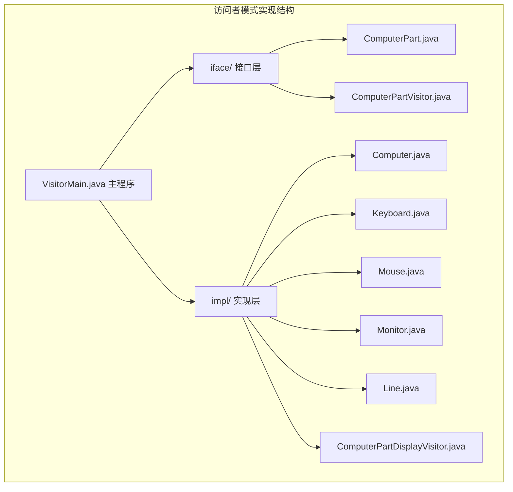

**图表来源**
- [ComputerPart.java:1-6](file://behavioral/visitor/src/main/java/com/future/rocket/gof23/visitor/iface/ComputerPart.java#L1-L6)
- [ComputerPartVisitor.java:1-12](file://behavioral/visitor/src/main/java/com/future/rocket/gof23/visitor/iface/ComputerPartVisitor.java#L1-L12)

**章节来源**
- [readme.md:1-9](file://readme.md#L1-L9)
- [readme.md:1-25](file://behavioral/visitor/readme.md#L1-L25)

## 核心组件

访问者模式的核心由四个主要组件构成，每个组件都有明确的职责和交互关系：

### 元素接口（Element Interface）
元素接口定义了`accept`方法，这是访问者模式的关键入口点。所有可访问的元素都必须实现此接口。

### 具体元素类（Concrete Element Classes）
具体的硬件部件类（键盘、鼠标、显示器、计算机总成、线条）都实现了元素接口，负责接受访问者并调用相应的访问者方法。

### 访问者接口（Visitor Interface）
访问者接口定义了针对不同类型元素的访问方法，每个具体元素都有对应的访问方法。

### 具体访问者类（Concrete Visitor Classes）
具体实现访问者接口的类，提供实际的操作逻辑，如显示硬件信息的访问者。

**章节来源**
- [ComputerPart.java:1-6](file://behavioral/visitor/src/main/java/com/future/rocket/gof23/visitor/iface/ComputerPart.java#L1-L6)
- [ComputerPartVisitor.java:1-12](file://behavioral/visitor/src/main/java/com/future/rocket/gof23/visitor/iface/ComputerPartVisitor.java#L1-L12)

## 架构概览

访问者模式的架构体现了"数据结构"与"操作逻辑"的分离原则。整个系统围绕着对象结构（硬件部件集合）和访问者（操作逻辑）之间的交互展开：

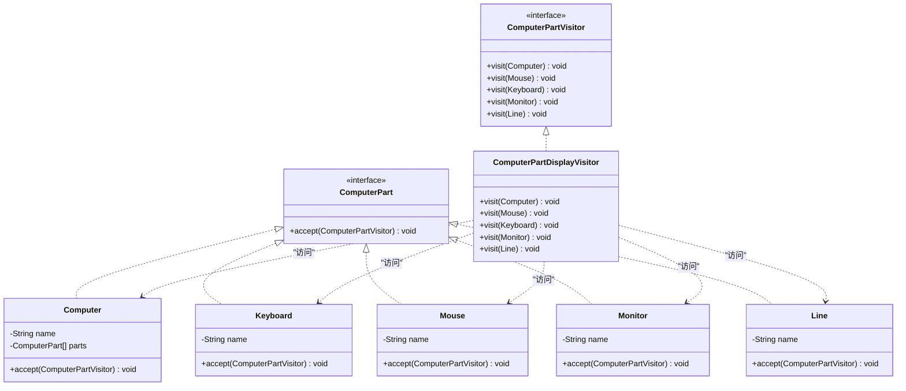

**图表来源**
- [ComputerPart.java:1-6](file://behavioral/visitor/src/main/java/com/future/rocket/gof23/visitor/iface/ComputerPart.java#L1-L6)
- [ComputerPartVisitor.java:1-12](file://behavioral/visitor/src/main/java/com/future/rocket/gof23/visitor/iface/ComputerPartVisitor.java#L1-L12)
- [Computer.java:1-32](file://behavioral/visitor/src/main/java/com/future/rocket/gof23/visitor/impl/Computer.java#L1-L32)
- [Keyboard.java:1-26](file://behavioral/visitor/src/main/java/com/future/rocket/gof23/visitor/impl/Keyboard.java#L1-L26)
- [Mouse.java:1-26](file://behavioral/visitor/src/main/java/com/future/rocket/gof23/visitor/impl/Mouse.java#L1-L26)
- [Monitor.java:1-26](file://behavioral/visitor/src/main/java/com/future/rocket/gof23/visitor/impl/Monitor.java#L1-L26)
- [Line.java:1-26](file://behavioral/visitor/src/main/java/com/future/rocket/gof23/visitor/impl/Line.java#L1-L26)
- [ComputerPartDisplayVisitor.java:1-32](file://behavioral/visitor/src/main/java/com/future/rocket/gof23/visitor/impl/ComputerPartDisplayVisitor.java#L1-L32)

## 详细组件分析

### 元素接口实现

元素接口作为访问者模式的基础契约，定义了所有可访问对象必须实现的accept方法。这个方法接收一个访问者参数，体现了访问者模式的核心思想——将操作委托给外部对象。

### 具体元素类分析

#### 键盘类（Keyboard）
键盘类是最简单的具体元素实现，包含名称属性和基本的accept方法实现。其accept方法直接调用访问者的visit方法，传入自身实例。

#### 鼠标类（Mouse）
鼠标类与键盘类类似，实现了相同的accept模式，但代表不同的硬件部件类型。

#### 显示器类（Monitor）
显示器类同样遵循统一的模式，展示了访问者模式在硬件设备抽象中的应用。

#### 计算机类（Computer）
计算机类是复合元素的典型实现，它不仅实现了accept方法，还包含了多个子部件的管理逻辑。在accept方法中，它会先遍历所有子部件，让每个子部件都接受访问者，然后才调用自身的访问方法。

#### 线条类（Line）
线条类作为额外的硬件部件类型，展示了访问者模式的可扩展性特点。

### 访问者接口实现

访问者接口定义了针对不同类型元素的访问方法，这种设计确保了访问者能够针对不同类型的元素执行相应的操作。接口中包含的方法数量与元素类型数量保持一致，体现了访问者模式的完整性。

### 具体访问者实现

#### 显示访问者（ComputerPartDisplayVisitor）
显示访问者是访问者模式的经典实现，它实现了访问者接口的所有方法，为每种元素类型提供了具体的显示逻辑。这种实现方式展示了如何在不修改元素类的情况下添加新的操作。

**章节来源**
- [Computer.java:1-32](file://behavioral/visitor/src/main/java/com/future/rocket/gof23/visitor/impl/Computer.java#L1-L32)
- [ComputerPartDisplayVisitor.java:1-32](file://behavioral/visitor/src/main/java/com/future/rocket/gof23/visitor/impl/ComputerPartDisplayVisitor.java#L1-L32)

## 双分派机制分析

访问者模式的核心在于其独特的双分派机制，这与传统的单分派（静态绑定）形成了鲜明对比：

### 单分派 vs 双分派

在传统的面向对象编程中，方法调用通常采用单分派机制：
- **编译时确定**：编译器根据接收者对象的静态类型决定调用哪个方法
- **运行时确定**：运行时根据接收者对象的实际类型进行多态选择

而访问者模式实现了真正的双分派：
- **第一次分派**：在元素上调用accept方法时，根据访问者的具体类型进行分派
- **第二次分派**：在访问者上调用visit方法时，根据元素的具体类型进行分派

### 双分派的实现原理

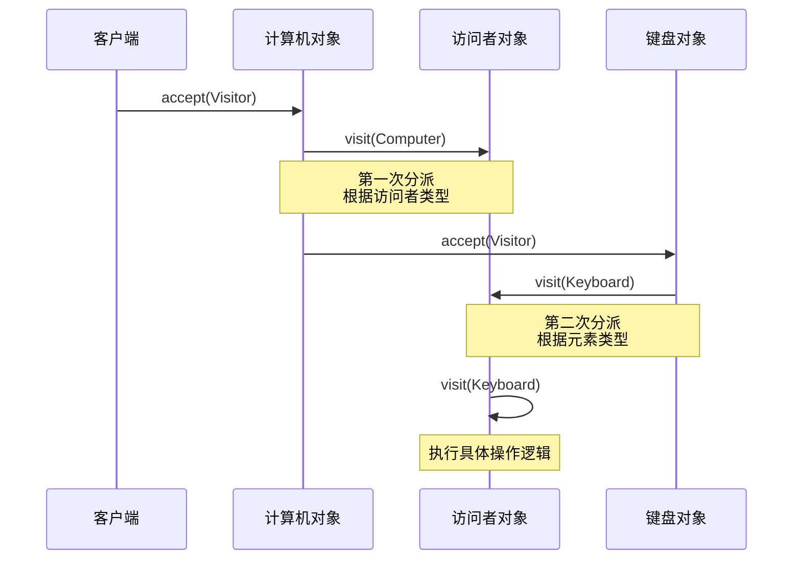

**图表来源**
- [Computer.java:17-23](file://behavioral/visitor/src/main/java/com/future/rocket/gof23/visitor/impl/Computer.java#L17-L23)
- [Keyboard.java:14-17](file://behavioral/visitor/src/main/java/com/future/rocket/gof23/visitor/impl/Keyboard.java#L14-L17)
- [ComputerPartDisplayVisitor.java:8-10](file://behavioral/visitor/src/main/java/com/future/rocket/gof23/visitor/impl/ComputerPartDisplayVisitor.java#L8-L10)

### 双分派的优势

1. **类型安全**：编译器可以验证访问者方法的正确性
2. **可扩展性**：可以在不修改现有元素类的情况下添加新的访问者
3. **操作分离**：将算法逻辑从数据结构中分离出来
4. **多态操作**：支持针对不同元素类型的不同操作

**章节来源**
- [ComputerPartVisitor.java:1-12](file://behavioral/visitor/src/main/java/com/future/rocket/gof23/visitor/iface/ComputerPartVisitor.java#L1-L12)
- [ComputerPartDisplayVisitor.java:1-32](file://behavioral/visitor/src/main/java/com/future/rocket/gof23/visitor/impl/ComputerPartDisplayVisitor.java#L1-L32)

## 方法调用流程图

下面的流程图详细展示了访问者模式的完整调用流程：

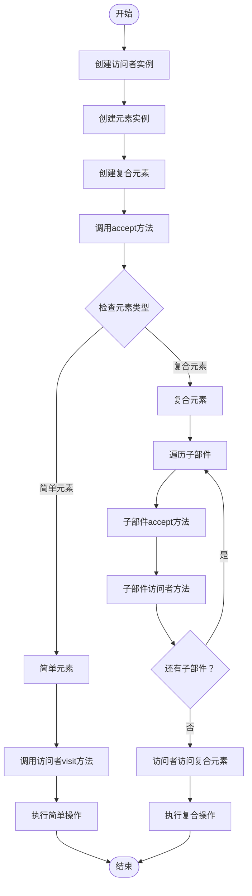

**图表来源**
- [VisitorMain.java:10-22](file://behavioral/visitor/src/main/java/com/future/rocket/gof23/visitor/VisitorMain.java#L10-L22)
- [Computer.java:17-23](file://behavioral/visitor/src/main/java/com/future/rocket/gof23/visitor/impl/Computer.java#L17-L23)

### 调用序列示例

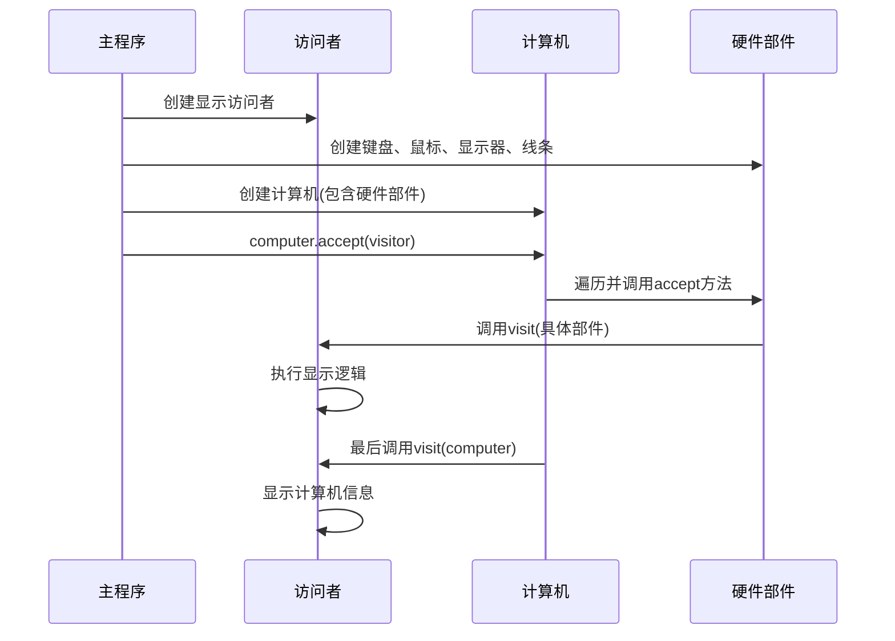

**图表来源**
- [VisitorMain.java:13-19](file://behavioral/visitor/src/main/java/com/future/rocket/gof23/visitor/VisitorMain.java#L13-L19)

**章节来源**
- [VisitorMain.java:1-24](file://behavioral/visitor/src/main/java/com/future/rocket/gof23/visitor/VisitorMain.java#L1-L24)

## 应用场景分析

访问者模式在多个领域都有广泛的应用，特别是在需要对复杂对象结构执行多种操作的场景中。

### AST（抽象语法树）处理

在编译器和解释器中，访问者模式被广泛应用于AST节点的处理：

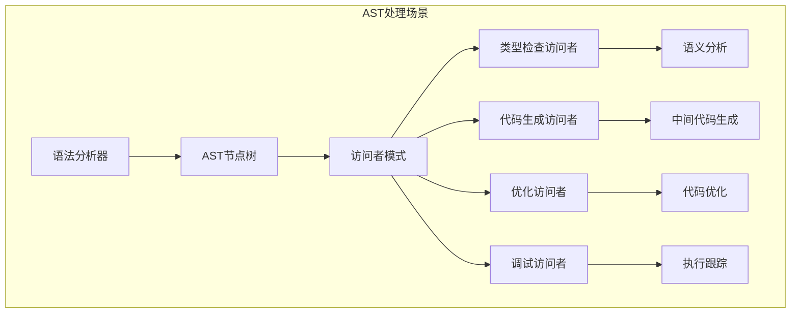

### 报表生成

在报表系统中，访问者模式可以实现数据的多格式输出：

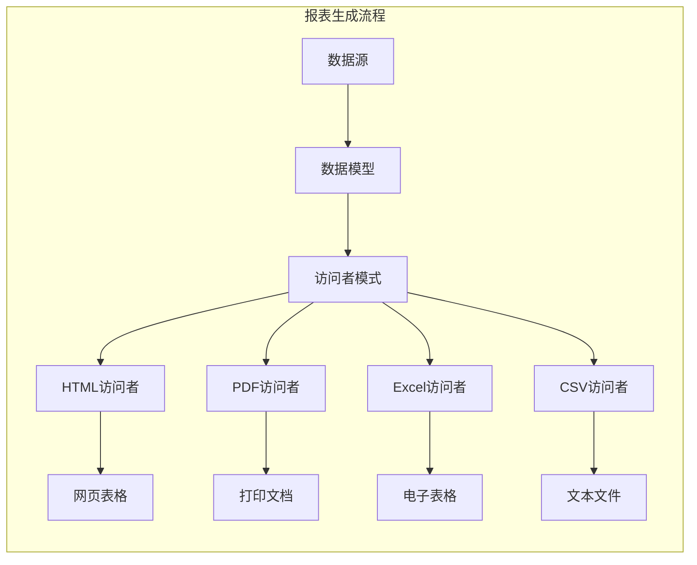

### XML解析

在XML处理中，访问者模式可以实现不同格式的数据转换：

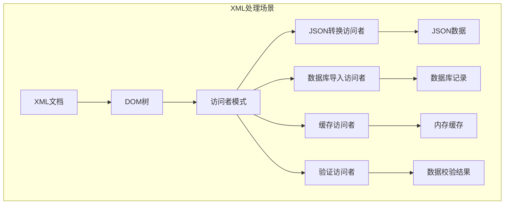

### 代码分析

在静态代码分析工具中，访问者模式可以实现多种代码质量检查：

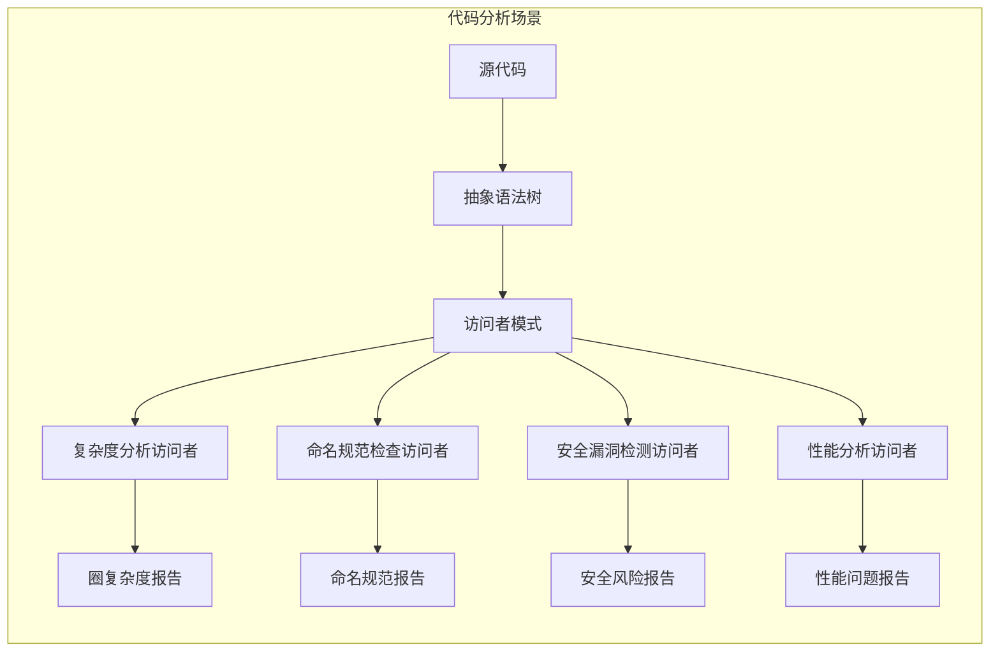

## 扩展策略

访问者模式提供了多种扩展策略，使其能够适应不断变化的需求。

### 新增元素类型

当需要支持新的元素类型时，只需实现元素接口并添加相应的访问者方法：

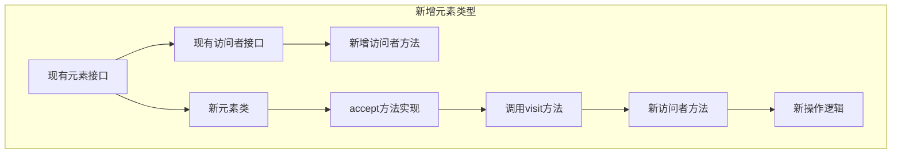

### 新增访问者类型

当需要添加新的操作逻辑时，只需实现访问者接口：

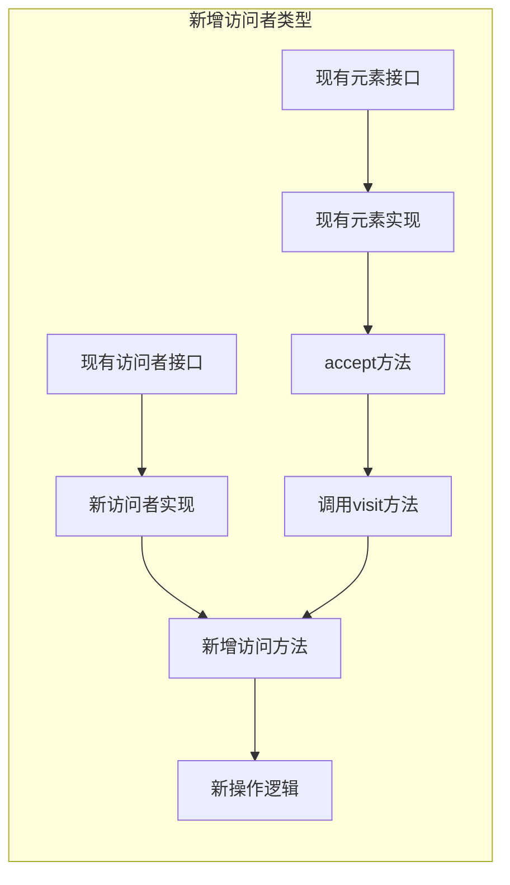

### 访问者组合

可以创建复合访问者来组合多个操作：

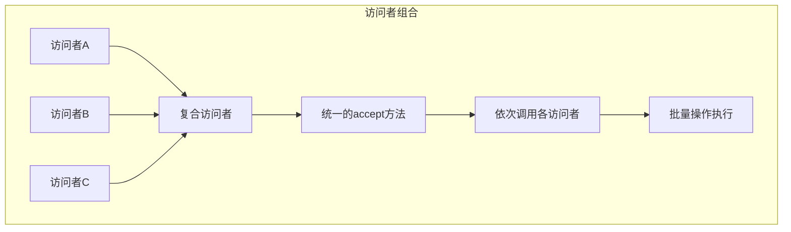

## 性能考虑

访问者模式在性能方面具有以下特点：

### 时间复杂度

- **单次访问**：O(n)，其中n是元素数量
- **多次访问**：O(m×n)，其中m是访问者数量
- **深度遍历**：对于树形结构，通常是O(h)，其中h是树的高度

### 空间复杂度

- **内存占用**：主要取决于元素数量和访问者数量
- **递归深度**：对于深度嵌套的对象结构，需要注意栈溢出风险

### 优化建议

1. **避免不必要的遍历**：在访问者中实现短路逻辑
2. **缓存计算结果**：对于重复计算的操作，考虑结果缓存
3. **批量处理**：将多个相关操作合并到一个访问者中
4. **延迟加载**：对于昂贵的操作，考虑延迟执行

## 与其他模式的结合

访问者模式经常与其他设计模式结合使用，以解决更复杂的场景。

### 与组合模式结合

访问者模式与组合模式的结合是其最经典的应用之一：

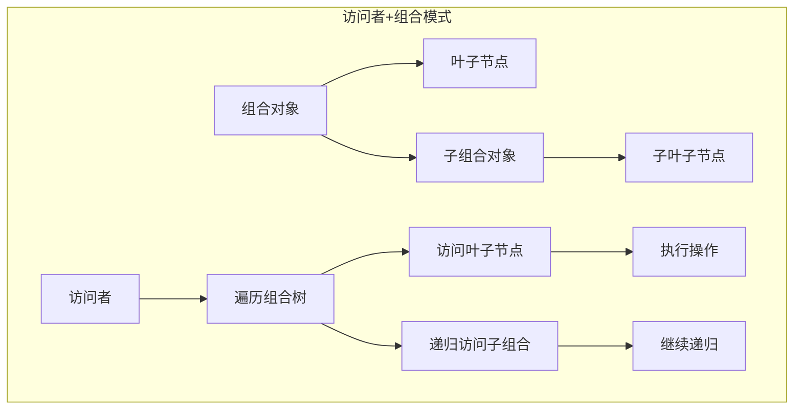

### 与工厂模式结合

访问者模式可以与工厂模式结合，动态创建访问者实例：

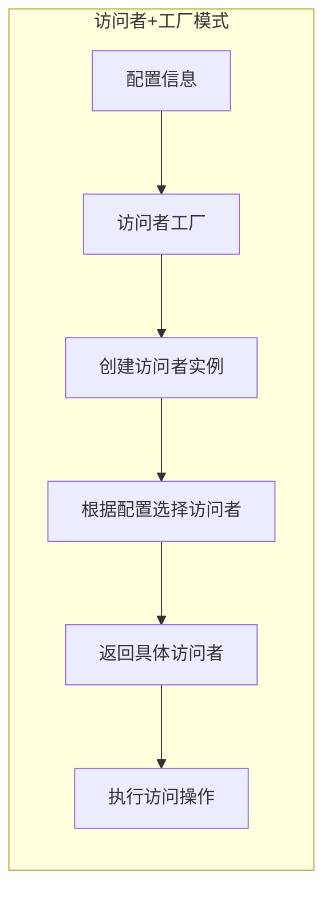

### 与模板方法模式结合

访问者模式可以与模板方法模式结合，定义访问的标准流程：

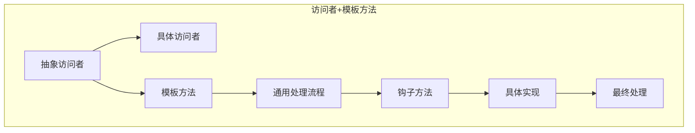

## 优缺点分析

### 优点

1. **操作分离**：将算法逻辑从数据结构中分离，提高了代码的内聚性
2. **可扩展性**：可以在不修改现有代码的情况下添加新的操作
3. **类型安全**：编译器可以验证访问者方法的正确性
4. **多态操作**：支持针对不同元素类型的不同操作
5. **关注点分离**：不同的访问者处理不同的业务需求

### 缺点

1. **复杂性增加**：需要维护访问者接口和多个实现类
2. **违反封装**：访问者需要了解元素的内部结构
3. **维护成本**：当元素类型发生变化时，需要更新访问者接口
4. **性能开销**：双分派机制带来一定的性能损失
5. **设计难度**：需要仔细设计访问者接口以支持未来的扩展

## 适用场景

访问者模式最适合以下场景：

### 数据结构稳定但操作多样

当对象结构相对稳定，但需要频繁添加新的操作时，访问者模式是理想的选择。

### 需要对复杂对象结构执行多种操作

对于包含多种不同类型元素的复杂对象结构，访问者模式可以提供统一的操作接口。

### 需要分离算法和数据结构

当算法逻辑比较复杂，且希望将其与数据结构分离时，访问者模式提供了清晰的解决方案。

### 需要支持多种输出格式

在需要将同一数据结构转换为多种格式的场景中，访问者模式可以提供优雅的解决方案。

## 结论

访问者模式作为一种强大的行为型设计模式，通过实现双分派机制，成功地将操作逻辑从数据结构中分离出来。在本项目的硬件系统实现中，我们看到了访问者模式在实际场景中的优雅应用。

访问者模式的核心价值在于其提供的"在不改变元素类的前提下定义新操作"的能力。这种设计使得系统具有了极强的可扩展性和可维护性，特别适合处理复杂的对象结构和多样化的操作需求。

然而，访问者模式也并非万能药。它需要在复杂性、性能和维护成本之间找到平衡。在选择使用访问者模式时，应该仔细考虑具体的业务场景和长期维护需求。

对于初学者而言，理解访问者模式的关键是从静态分派的思维模式转向动态分派的思考方式。对于专家而言，访问者模式提供了处理复杂对象结构的高级设计指导，特别是在与组合模式等其他模式结合使用时，可以构建出既灵活又高效的系统架构。