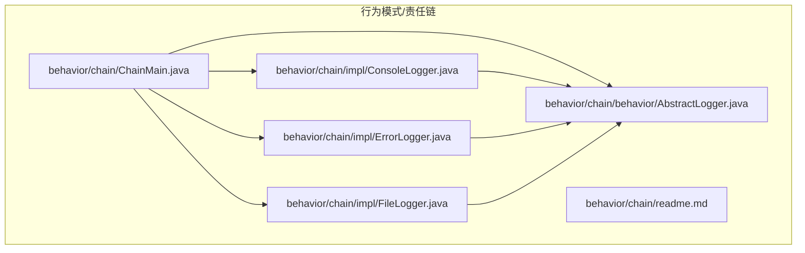
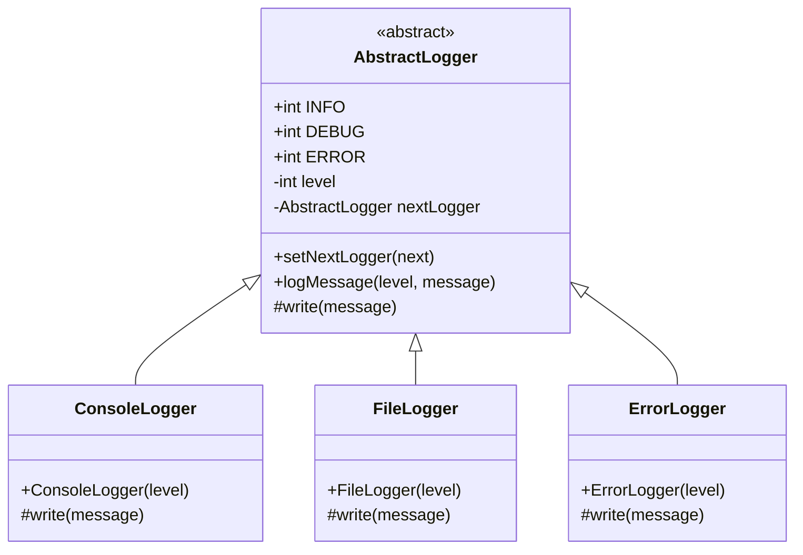
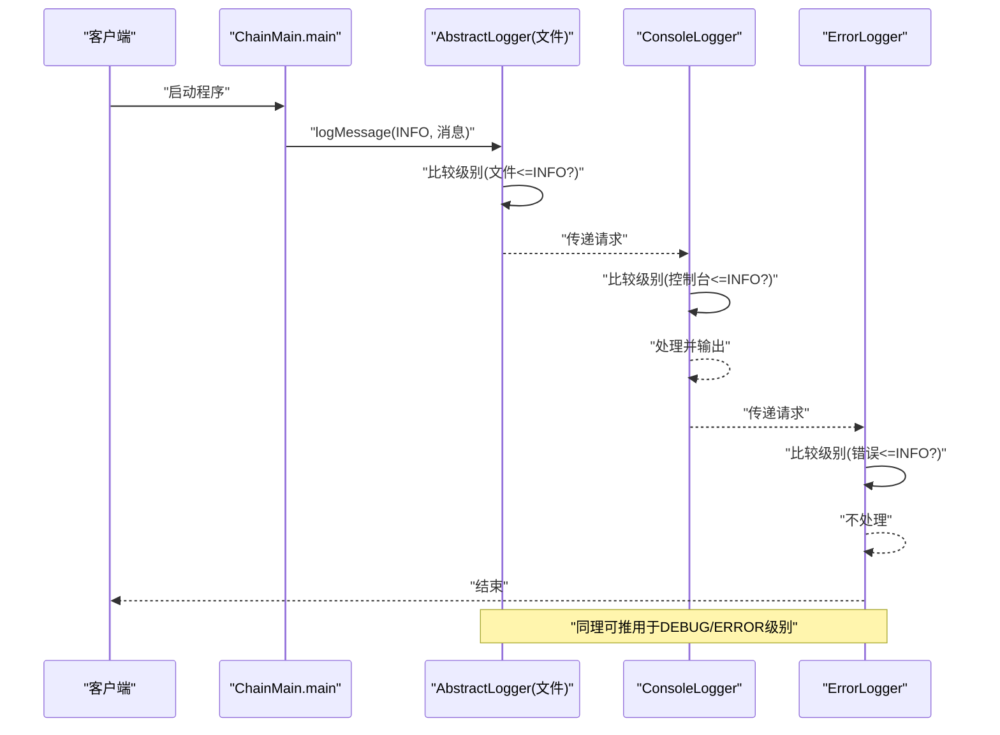
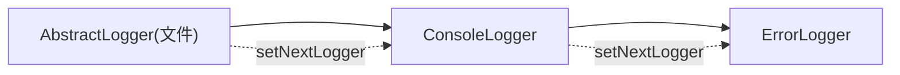

# 责任链模式

<cite>
**本文档引用的文件**
- [behavior/chain/behavior/AbstractLogger.java](file://behavioral/chain/src/main/java/com/future/rocket/gof23/chain/behavior/AbstractLogger.java)
- [behavior/chain/impl/ConsoleLogger.java](file://behavioral/chain/src/main/java/com/future/rocket/gof23/chain/impl/ConsoleLogger.java)
- [behavior/chain/impl/ErrorLogger.java](file://behavioral/chain/src/main/java/com/future/rocket/gof23/chain/impl/ErrorLogger.java)
- [behavior/chain/impl/FileLogger.java](file://behavioral/chain/src/main/java/com/future/rocket/gof23/chain/impl/FileLogger.java)
- [behavior/chain/ChainMain.java](file://behavioral/chain/src/main/java/com/future/rocket/gof23/chain/ChainMain.java)
- [behavior/chain/readme.md](file://behavioral/chain/readme.md)
</cite>

## 目录
1. [引言](#引言)
2. [项目结构](#项目结构)
3. [核心组件](#核心组件)
4. [架构总览](#架构总览)
5. [详细组件分析](#详细组件分析)
6. [依赖关系分析](#依赖关系分析)
7. [性能与并发](#性能与并发)
8. [故障排查指南](#故障排查指南)
9. [结论](#结论)
10. [附录](#附录)

## 引言
本文件围绕责任链（Chain of Responsibility）模式展开，结合仓库中的日志记录系统示例，系统阐述请求在链式处理器中的传递机制、处理器的动态组合与职责分离原则。文档提供完整的类图与序列图，解释如何通过配置不同处理器实现灵活的日志级别控制，并给出线程安全、性能优化与扩展最佳实践，帮助初学者循序渐进理解，同时为专家提供深入的架构设计参考。

## 项目结构
责任链模式示例位于 behavioral/chain 模块，采用“行为抽象 + 具体实现”的分层组织方式：
- behavior/AbstractLogger.java 定义抽象日志器与通用处理流程
- impl/ConsoleLogger.java、ErrorLogger.java、FileLogger.java 实现具体日志处理器
- ChainMain.java 展示链式组装与调用示例
- readme.md 提供模式简介与图示

图表来源
- [behavior/chain/ChainMain.java:1-31](file://behavioral/chain/src/main/java/com/future/rocket/gof23/chain/ChainMain.java#L1-L31)
- [behavior/chain/behavior/AbstractLogger.java:1-28](file://behavioral/chain/src/main/java/com/future/rocket/gof23/chain/behavior/AbstractLogger.java#L1-L28)
- [behavior/chain/impl/ConsoleLogger.java:1-16](file://behavioral/chain/src/main/java/com/future/rocket/gof23/chain/impl/ConsoleLogger.java#L1-L16)
- [behavior/chain/impl/ErrorLogger.java:1-16](file://behavioral/chain/src/main/java/com/future/rocket/gof23/chain/impl/ErrorLogger.java#L1-L16)
- [behavior/chain/impl/FileLogger.java:1-16](file://behavioral/chain/src/main/java/com/future/rocket/gof23/chain/impl/FileLogger.java#L1-L16)

章节来源
- [behavior/chain/readme.md:1-9](file://behavioral/chain/readme.md#L1-L9)

## 核心组件
- 抽象日志器 AbstractLogger
  - 职责：定义日志级别常量、持有下一个处理器引用、统一处理入口 logMessage、抽象写入接口 write
  - 关键点：通过比较当前处理器级别与请求级别决定是否处理；若未处理且存在后继处理器，则继续传递
- 具体日志处理器
  - ConsoleLogger：面向控制台输出
  - FileLogger：面向文件输出
  - ErrorLogger：面向错误输出
  - 各自通过构造函数设置处理级别，实现 write 将消息输出到对应介质

章节来源
- [behavior/chain/behavior/AbstractLogger.java:1-28](file://behavioral/chain/src/main/java/com/future/rocket/gof23/chain/behavior/AbstractLogger.java#L1-L28)
- [behavior/chain/impl/ConsoleLogger.java:1-16](file://behavioral/chain/src/main/java/com/future/rocket/gof23/chain/impl/ConsoleLogger.java#L1-L16)
- [behavior/chain/impl/ErrorLogger.java:1-16](file://behavioral/chain/src/main/java/com/future/rocket/gof23/chain/impl/ErrorLogger.java#L1-L16)
- [behavior/chain/impl/FileLogger.java:1-16](file://behavioral/chain/src/main/java/com/future/rocket/gof23/chain/impl/FileLogger.java#L1-L16)

## 架构总览
责任链模式通过“处理器链”实现请求的逐级传递与选择性处理。请求从链首进入，按处理器顺序判断是否处理；若不处理则传递给下一个处理器，直至链尾或被某处理器处理。

图表来源
- [behavior/chain/behavior/AbstractLogger.java:1-28](file://behavioral/chain/src/main/java/com/future/rocket/gof23/chain/behavior/AbstractLogger.java#L1-L28)
- [behavior/chain/impl/ConsoleLogger.java:1-16](file://behavioral/chain/src/main/java/com/future/rocket/gof23/chain/impl/ConsoleLogger.java#L1-L16)
- [behavior/chain/impl/ErrorLogger.java:1-16](file://behavioral/chain/src/main/java/com/future/rocket/gof23/chain/impl/ErrorLogger.java#L1-L16)
- [behavior/chain/impl/FileLogger.java:1-16](file://behavioral/chain/src/main/java/com/future/rocket/gof23/chain/impl/FileLogger.java#L1-L16)

## 详细组件分析

### 处理器链构建与调用流程
- 链构建：在 ChainMain 中创建三个具体处理器并建立 nextLogger 链接，形成“文件 -> 控制台 -> 错误”的处理顺序
- 请求传递：调用链首处理器的 logMessage，内部根据级别判断是否处理；若未处理且存在后继处理器则递归传递

图表来源
- [behavior/chain/ChainMain.java:11-29](file://behavioral/chain/src/main/java/com/future/rocket/gof23/chain/ChainMain.java#L11-L29)
- [behavior/chain/behavior/AbstractLogger.java:16-24](file://behavioral/chain/src/main/java/com/future/rocket/gof23/chain/behavior/AbstractLogger.java#L16-L24)

章节来源
- [behavior/chain/ChainMain.java:11-29](file://behavioral/chain/src/main/java/com/future/rocket/gof23/chain/ChainMain.java#L11-L29)

### 日志级别与职责分离
- 级别常量：INFO、DEBUG、ERROR 在抽象类中定义，作为处理器的阈值
- 职责分离：各处理器仅负责自身级别的处理与输出；通过链式传递实现多级日志的组合输出
- 可配置性：通过调整处理器的级别与链接顺序，即可灵活控制日志输出策略

章节来源
- [behavior/chain/behavior/AbstractLogger.java:4-6](file://behavioral/chain/src/main/java/com/future/rocket/gof23/chain/behavior/AbstractLogger.java#L4-L6)
- [behavior/chain/behavior/AbstractLogger.java:16-24](file://behavioral/chain/src/main/java/com/future/rocket/gof23/chain/behavior/AbstractLogger.java#L16-L24)

### 处理器实现细节
- ConsoleLogger：在 write 中将消息输出到控制台
- FileLogger：在 write 中将消息输出到文件（示例中同样输出到控制台）
- ErrorLogger：在 write 中将消息输出到错误通道（示例中同样输出到控制台）

章节来源
- [behavior/chain/impl/ConsoleLogger.java:11-14](file://behavioral/chain/src/main/java/com/future/rocket/gof23/chain/impl/ConsoleLogger.java#L11-L14)
- [behavior/chain/impl/FileLogger.java:11-14](file://behavioral/chain/src/main/java/com/future/rocket/gof23/chain/impl/FileLogger.java#L11-L14)
- [behavior/chain/impl/ErrorLogger.java:11-14](file://behavioral/chain/src/main/java/com/future/rocket/gof23/chain/impl/ErrorLogger.java#L11-L14)

## 依赖关系分析
- 继承关系：ConsoleLogger、FileLogger、ErrorLogger 均继承自 AbstractLogger
- 组合关系：各处理器通过 setNextLogger 形成单向链表结构
- 调用关系：ChainMain 创建链并发起请求，请求沿链路逐级传递

图表来源
- [behavior/chain/ChainMain.java:16-17](file://behavioral/chain/src/main/java/com/future/rocket/gof23/chain/ChainMain.java#L16-L17)
- [behavior/chain/behavior/AbstractLogger.java:11-13](file://behavioral/chain/src/main/java/com/future/rocket/gof23/chain/behavior/AbstractLogger.java#L11-L13)

章节来源
- [behavior/chain/ChainMain.java:11-19](file://behavioral/chain/src/main/java/com/future/rocket/gof23/chain/ChainMain.java#L11-L19)

## 性能与并发
- 时间复杂度
  - 单次请求的处理复杂度为 O(n)，n 为链长度；每个处理器最多执行一次 write
- 空间复杂度
  - 递归调用栈深度为 O(n)，迭代实现可避免栈溢出风险
- 并发与线程安全
  - 当前实现未使用同步机制；若链中处理器涉及共享资源（如文件句柄），需在 write 或外部加锁
  - 建议：对共享资源访问使用互斥锁或无锁数据结构；对只读配置（级别、链结构）可在构建阶段固定以避免运行时竞争
- 性能优化建议
  - 减少链长度：合并相近级别的处理器
  - 缓存与批处理：对频繁日志进行缓冲批量写入
  - 异步化：将耗时写入操作异步化，避免阻塞主业务线程
  - 过滤前置：在链首增加快速过滤器，减少无效传播

## 故障排查指南
- 现象：日志未输出
  - 排查：确认请求级别是否达到处理器阈值；检查链路是否正确设置 nextLogger
- 现象：日志重复输出
  - 排查：确认链中是否存在重复处理器；检查是否在多个处理器中均执行了 write
- 现象：链路中断
  - 排查：定位第一个未处理但未传递的处理器；确保 logMessage 的递归传递逻辑未被重写破坏
- 现象：并发问题导致资源竞争
  - 排查：检查 write 是否访问共享资源；必要时引入同步或原子操作

章节来源
- [behavior/chain/behavior/AbstractLogger.java:16-24](file://behavioral/chain/src/main/java/com/future/rocket/gof23/chain/behavior/AbstractLogger.java#L16-L24)
- [behavior/chain/ChainMain.java:11-19](file://behavioral/chain/src/main/java/com/future/rocket/gof23/chain/ChainMain.java#L11-L19)

## 结论
责任链模式通过“处理器链”实现了请求处理的解耦与可扩展性。在日志系统中，它允许以声明式的方式组合不同级别的处理器，从而灵活地控制日志输出策略。通过合理设计链结构、注意线程安全与性能优化，并遵循职责分离原则，可构建高内聚、低耦合且易于维护的责任链系统。

## 附录

### 学习路径建议
- 初学者
  - 理解责任链的基本思想与适用场景
  - 分析现有示例，掌握抽象类与具体处理器的职责划分
  - 修改链顺序与级别，观察输出差异
- 进阶者
  - 扩展新的处理器类型（如网络日志、数据库日志）
  - 设计异步与批处理策略，提升吞吐
  - 引入过滤器与拦截器，增强链的灵活性
- 专家
  - 探索动态链构建与运行时配置
  - 引入可观测性（埋点、指标、追踪）
  - 考虑跨进程/分布式场景下的链式传递

### 最佳实践
- 明确职责边界：每个处理器专注于单一职责
- 保持链的稳定性：在应用启动时构建并冻结链结构
- 谨慎使用递归：长链场景建议采用迭代实现
- 资源管理：对共享资源进行显式生命周期管理
- 可测试性：为每个处理器编写单元测试，覆盖处理与传递分支