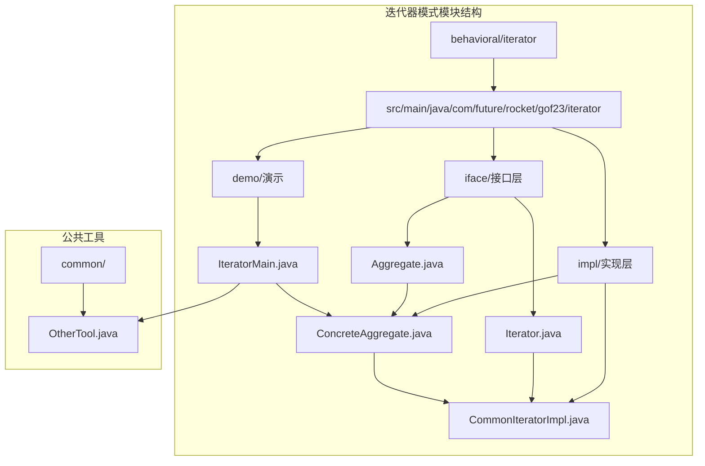
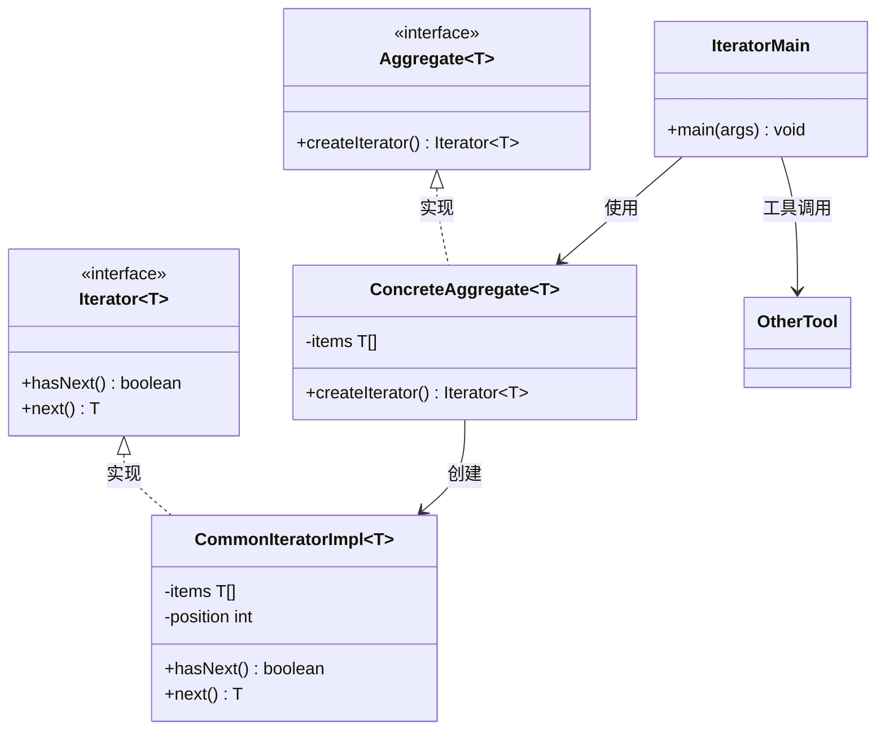
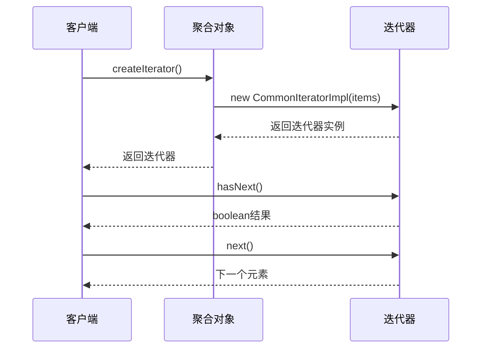
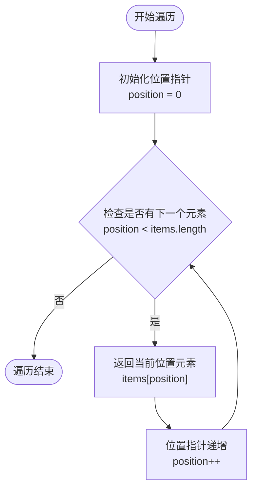
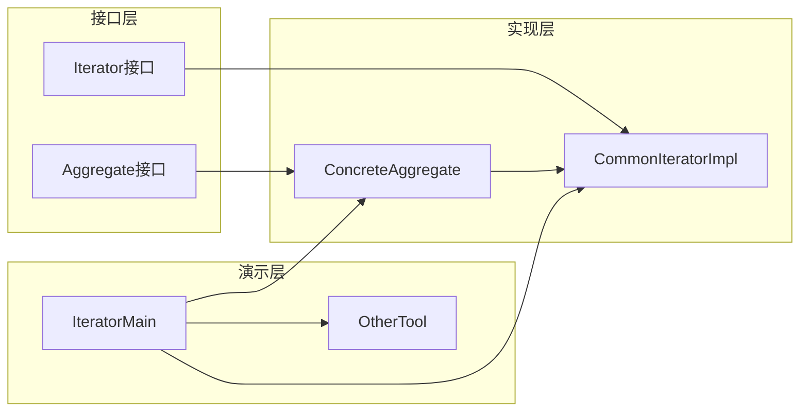
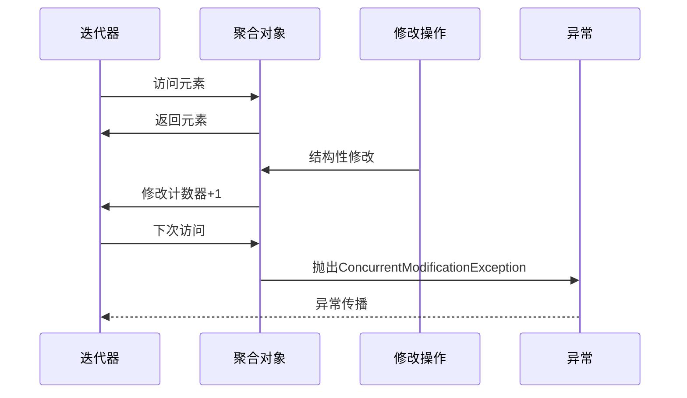

# 迭代器模式

<cite>
**本文档引用的文件**
- [Aggregate.java](file://behavioral/iterator/src/main/java/com/future/rocket/gof23/iterator/iface/Aggregate.java)
- [Iterator.java](file://behavioral/iterator/src/main/java/com/future/rocket/gof23/iterator/iface/Iterator.java)
- [ConcreteAggregate.java](file://behavioral/iterator/src/main/java/com/future/rocket/gof23/iterator/impl/ConcreteAggregate.java)
- [CommonIteratorImpl.java](file://behavioral/iterator/src/main/java/com/future/rocket/gof23/iterator/impl/CommonIteratorImpl.java)
- [IteratorMain.java](file://behavioral/iterator/src/main/java/com/future/rocket/gof23/iterator/IteratorMain.java)
- [OtherTool.java](file://common/src/main/java/com/future/rocket/gof23/common/OtherTool.java)
- [readme.md](file://behavioral/iterator/readme.md)
</cite>

## 目录
1. [引言](#引言)
2. [项目结构](#项目结构)
3. [核心组件](#核心组件)
4. [架构概览](#架构概览)
5. [详细组件分析](#详细组件分析)
6. [依赖关系分析](#依赖关系分析)
7. [性能考虑](#性能考虑)
8. [并发处理与fail-fast机制](#并发处理与fail-fast机制)
9. [Java集合框架中的应用](#java集合框架中的应用)
10. [最佳实践](#最佳实践)
11. [故障排除指南](#故障排除指南)
12. [结论](#结论)

## 引言

迭代器模式（Iterator Pattern）是GoF设计模式中行为型模式的重要组成部分。该模式的核心设计目标是提供一种方法顺序访问聚合对象的各个元素，而又不暴露其内部的表示。这种设计实现了遍历算法与数据结构的解耦，提高了代码的可维护性和灵活性。

在现代软件开发中，迭代器模式被广泛应用于各种集合框架和数据结构中，如Java集合框架、数据库游标、文件系统遍历等场景。通过抽象出统一的遍历接口，开发者可以编写与具体数据结构无关的遍历逻辑。

## 项目结构

本项目采用标准的Maven多模块结构，迭代器模式示例位于`behavioral/iterator`模块中。项目结构清晰地分离了接口定义、具体实现和演示代码。



**图表来源**
- [Aggregate.java:1-6](file://behavioral/iterator/src/main/java/com/future/rocket/gof23/iterator/iface/Aggregate.java#L1-L6)
- [Iterator.java:1-7](file://behavioral/iterator/src/main/java/com/future/rocket/gof23/iterator/iface/Iterator.java#L1-L7)
- [ConcreteAggregate.java:1-18](file://behavioral/iterator/src/main/java/com/future/rocket/gof23/iterator/impl/ConcreteAggregate.java#L1-L18)
- [CommonIteratorImpl.java:1-23](file://behavioral/iterator/src/main/java/com/future/rocket/gof23/iterator/impl/CommonIteratorImpl.java#L1-L23)
- [IteratorMain.java:1-26](file://behavioral/iterator/src/main/java/com/future/rocket/gof23/iterator/IteratorMain.java#L1-L26)

**章节来源**
- [readme.md:1-10](file://behavioral/iterator/readme.md#L1-L10)
- [pom.xml:1-20](file://behavioral/iterator/pom.xml#L1-L20)

## 核心组件

迭代器模式由四个核心组件构成：聚合接口（Aggregate）、迭代器接口（Iterator）、具体聚合类（ConcreteAggregate）和具体迭代器类（CommonIteratorImpl）。这些组件协同工作，实现了对聚合对象的统一遍历访问。

### 聚合接口（Aggregate）

聚合接口定义了创建迭代器的标准方法，确保所有聚合对象都提供一致的遍历能力。该接口采用泛型设计，支持任意类型的元素遍历。

### 迭代器接口（Iterator）

迭代器接口提供了标准化的遍历操作方法，包括检查下一个元素是否存在和获取下一个元素。这种抽象使得遍历逻辑与具体的数据结构实现完全解耦。

### 具体聚合类（ConcreteAggregate）

具体聚合类实现了聚合接口，负责管理实际的数据存储和迭代器的创建。它封装了数据的内部表示，只通过迭代器暴露访问接口。

### 具体迭代器类（CommonIteratorImpl）

具体迭代器类实现了迭代器接口，持有聚合对象的引用和当前遍历位置。它提供了具体的遍历算法实现。

**章节来源**
- [Aggregate.java:1-6](file://behavioral/iterator/src/main/java/com/future/rocket/gof23/iterator/iface/Aggregate.java#L1-L6)
- [Iterator.java:1-7](file://behavioral/iterator/src/main/java/com/future/rocket/gof23/iterator/iface/Iterator.java#L1-L7)
- [ConcreteAggregate.java:1-18](file://behavioral/iterator/src/main/java/com/future/rocket/gof23/iterator/impl/ConcreteAggregate.java#L1-L18)
- [CommonIteratorImpl.java:1-23](file://behavioral/iterator/src/main/java/com/future/rocket/gof23/iterator/impl/CommonIteratorImpl.java#L1-L23)

## 架构概览

迭代器模式的架构设计体现了面向对象设计的基本原则：抽象、封装和多态。整个系统通过接口隔离了实现细节，通过组合关系建立了聚合与迭代器之间的关联。



**图表来源**
- [Aggregate.java:1-6](file://behavioral/iterator/src/main/java/com/future/rocket/gof23/iterator/iface/Aggregate.java#L1-L6)
- [Iterator.java:1-7](file://behavioral/iterator/src/main/java/com/future/rocket/gof23/iterator/iface/Iterator.java#L1-L7)
- [ConcreteAggregate.java:1-18](file://behavioral/iterator/src/main/java/com/future/rocket/gof23/iterator/impl/ConcreteAggregate.java#L1-L18)
- [CommonIteratorImpl.java:1-23](file://behavioral/iterator/src/main/java/com/future/rocket/gof23/iterator/impl/CommonIteratorImpl.java#L1-L23)
- [IteratorMain.java:1-26](file://behavioral/iterator/src/main/java/com/future/rocket/gof23/iterator/IteratorMain.java#L1-L26)

## 详细组件分析

### 聚合接口设计

聚合接口采用简洁的设计理念，只定义了一个核心方法用于创建迭代器。这种设计遵循了单一职责原则，将遍历责任委托给专门的迭代器类。



**图表来源**
- [IteratorMain.java:12-23](file://behavioral/iterator/src/main/java/com/future/rocket/gof23/iterator/IteratorMain.java#L12-L23)
- [ConcreteAggregate.java:13-16](file://behavioral/iterator/src/main/java/com/future/rocket/gof23/iterator/impl/ConcreteAggregate.java#L13-L16)

### 迭代器实现分析

迭代器的具体实现采用了简单的数组索引机制，通过维护当前位置指针来控制遍历过程。这种设计简单高效，适用于线性数据结构。

#### 遍历算法流程



**图表来源**
- [CommonIteratorImpl.java:13-21](file://behavioral/iterator/src/main/java/com/future/rocket/gof23/iterator/impl/CommonIteratorImpl.java#L13-L21)

### 演示程序分析

演示程序展示了迭代器模式的实际应用场景，通过创建不同类型的聚合对象来演示统一的遍历接口。

**章节来源**
- [IteratorMain.java:1-26](file://behavioral/iterator/src/main/java/com/future/rocket/gof23/iterator/IteratorMain.java#L1-L26)
- [OtherTool.java:1-12](file://common/src/main/java/com/future/rocket/gof23/common/OtherTool.java#L1-L12)

## 依赖关系分析

迭代器模式的依赖关系体现了清晰的分层架构，各层之间通过接口进行交互，避免了紧耦合。



**图表来源**
- [Aggregate.java:1-6](file://behavioral/iterator/src/main/java/com/future/rocket/gof23/iterator/iface/Aggregate.java#L1-L6)
- [Iterator.java:1-7](file://behavioral/iterator/src/main/java/com/future/rocket/gof23/iterator/iface/Iterator.java#L1-L7)
- [ConcreteAggregate.java:1-18](file://behavioral/iterator/src/main/java/com/future/rocket/gof23/iterator/impl/ConcreteAggregate.java#L1-L18)
- [CommonIteratorImpl.java:1-23](file://behavioral/iterator/src/main/java/com/future/rocket/gof23/iterator/impl/CommonIteratorImpl.java#L1-L23)
- [IteratorMain.java:1-26](file://behavioral/iterator/src/main/java/com/future/rocket/gof23/iterator/IteratorMain.java#L1-L26)

**章节来源**
- [Aggregate.java:1-6](file://behavioral/iterator/src/main/java/com/future/rocket/gof23/iterator/iface/Aggregate.java#L1-L6)
- [Iterator.java:1-7](file://behavioral/iterator/src/main/java/com/future/rocket/gof23/iterator/iface/Iterator.java#L1-L7)
- [ConcreteAggregate.java:1-18](file://behavioral/iterator/src/main/java/com/future/rocket/gof23/iterator/impl/ConcreteAggregate.java#L1-L18)
- [CommonIteratorImpl.java:1-23](file://behavioral/iterator/src/main/java/com/future/rocket/gof23/iterator/impl/CommonIteratorImpl.java#L1-L23)

## 性能考虑

迭代器模式在性能方面具有以下特点：

### 时间复杂度
- **遍历操作**：O(n)，其中n为元素数量
- **单次访问**：O(1)，每次next()调用都是常数时间
- **内存使用**：O(1)，只需要维护当前位置指针

### 空间复杂度
- **迭代器实例**：O(1)，只存储必要的状态信息
- **聚合对象**：O(n)，存储所有元素

### 性能优化建议

1. **避免重复创建迭代器**：复用现有的迭代器实例
2. **批量处理**：对于大量数据，考虑批量处理策略
3. **延迟加载**：对于大数据集，考虑延迟加载机制
4. **缓存策略**：对频繁访问的数据建立缓存

## 并发处理与fail-fast机制

### fail-fast机制原理

fail-fast（快速失败）机制是Java集合框架中重要的并发保护机制。当检测到集合在迭代过程中被结构性修改时，迭代器会立即抛出异常，而不是在后续操作中产生不确定的结果。



**图表来源**
- [CommonIteratorImpl.java:13-21](file://behavioral/iterator/src/main/java/com/future/rocket/gof23/iterator/impl/CommonIteratorImpl.java#L13-L21)

### 线程安全迭代器设计

为了支持并发访问，需要设计线程安全的迭代器。主要策略包括：

1. **读写分离**：使用读写锁分离读操作和写操作
2. **快照机制**：创建数据结构的快照供迭代使用
3. **无锁设计**：使用原子操作保证数据一致性
4. **复制-粘贴**：在迭代前复制数据结构

### 自定义迭代策略

除了基本的顺序遍历，还可以实现多种自定义迭代策略：

- **反向迭代**：从后向前遍历元素
- **条件过滤**：只遍历满足特定条件的元素
- **范围迭代**：只遍历指定范围内的元素
- **深度优先**：对树形结构进行深度优先遍历
- **广度优先**：对树形结构进行广度优先遍历

## Java集合框架中的应用

### 标准集合类的迭代器实现

Java集合框架中的所有集合类都实现了统一的迭代器接口：

```mermaid
classDiagram
class Iterable~T~ {
<<interface>>
+iterator() Iterator~T~
}
class Collection~T~ {
<<interface>>
+size() int
+isEmpty() boolean
+contains(Object) boolean
+iterator() Iterator~T~
}
class T[] {
<<interface>>
+get(int) T
+iterator() Iterator~T~
}
class Set~T~ {
<<interface>>
+iterator() Iterator~T~
}
class Map~K,V~ {
<<interface>>
+entrySet() Set~Map.Entry<K,V>~
}
class HashMap~K,V~ {
+iterator() Iterator~Map.Entry<K,V>~
}
class ArrayList~T~ {
+iterator() Iterator~T~
}
class HashSet~T~ {
+iterator() Iterator~T~
}
Iterable <|.. Collection
Collection <|.. List
Collection <|.. Set
Map <|.. HashMap
List <|.. ArrayList
Set <|.. HashSet
```

**图表来源**
- [Iterator.java:1-7](file://behavioral/iterator/src/main/java/com/future/rocket/gof23/iterator/iface/Iterator.java#L1-L7)

### 迭代器模式在集合框架中的优势

1. **统一接口**：所有集合类型提供相同的遍历接口
2. **解耦设计**：遍历逻辑与数据结构实现分离
3. **扩展性**：易于添加新的集合类型和遍历策略
4. **安全性**：通过fail-fast机制保护数据一致性

## 最佳实践

### 设计原则

1. **单一职责**：迭代器只负责遍历，不参与数据存储
2. **开闭原则**：对扩展开放，对修改关闭
3. **里氏替换**：子类可以替换父类而不影响程序正确性
4. **依赖倒置**：面向接口编程，不依赖具体实现

### 实现建议

1. **泛型设计**：使用泛型支持任意类型元素
2. **异常处理**：合理处理边界情况和异常状态
3. **资源管理**：及时释放迭代器占用的资源
4. **性能优化**：避免不必要的对象创建和内存分配

### 使用场景

1. **数据遍历**：对集合进行顺序访问
2. **数据转换**：将数据从一种格式转换为另一种格式
3. **数据过滤**：筛选满足条件的数据元素
4. **数据聚合**：对数据进行统计和汇总计算

## 故障排除指南

### 常见问题及解决方案

#### 1. ConcurrentModificationException异常

**问题描述**：在迭代过程中修改了集合结构导致异常

**解决方案**：
- 使用集合提供的安全修改方法
- 在迭代前创建集合副本
- 使用并发集合类如CopyOnWriteArrayList

#### 2. NoSuchElementException异常

**问题描述**：调用next()时没有剩余元素

**解决方案**：
- 始终先检查hasNext()再调用next()
- 正确处理空集合的情况

#### 3. 内存泄漏问题

**问题描述**：迭代器长时间持有集合引用导致内存无法回收

**解决方案**：
- 及时释放迭代器引用
- 使用try-with-resources语句管理资源

**章节来源**
- [IteratorMain.java:12-23](file://behavioral/iterator/src/main/java/com/future/rocket/gof23/iterator/IteratorMain.java#L12-L23)

## 结论

迭代器模式作为设计模式的经典代表，成功地解决了数据结构与遍历算法的耦合问题。通过抽象出统一的遍历接口，该模式实现了：

1. **解耦设计**：遍历逻辑与数据结构实现完全分离
2. **统一接口**：提供一致的遍历体验
3. **扩展性**：支持新的数据结构和遍历策略
4. **安全性**：通过fail-fast机制保护数据一致性

在实际开发中，迭代器模式不仅存在于理论层面，在Java集合框架等成熟库中也有广泛应用。理解并掌握迭代器模式的设计思想和实现技巧，对于提高代码质量和开发效率具有重要意义。

随着软件系统复杂性的增加，迭代器模式仍然保持着强大的生命力，为解决各种遍历和访问问题提供了优雅的解决方案。无论是基础的数据遍历还是高级的并发处理，迭代器模式都能提供可靠的支撑。