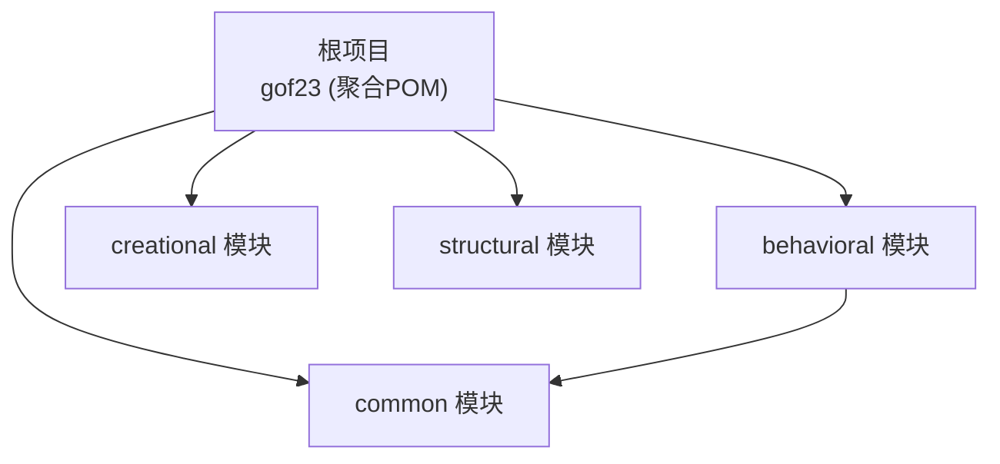
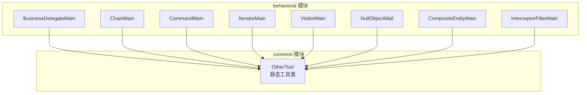
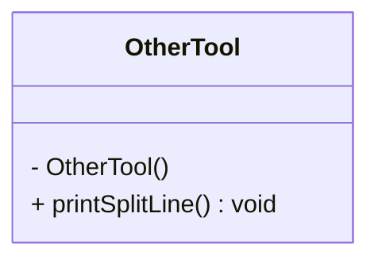
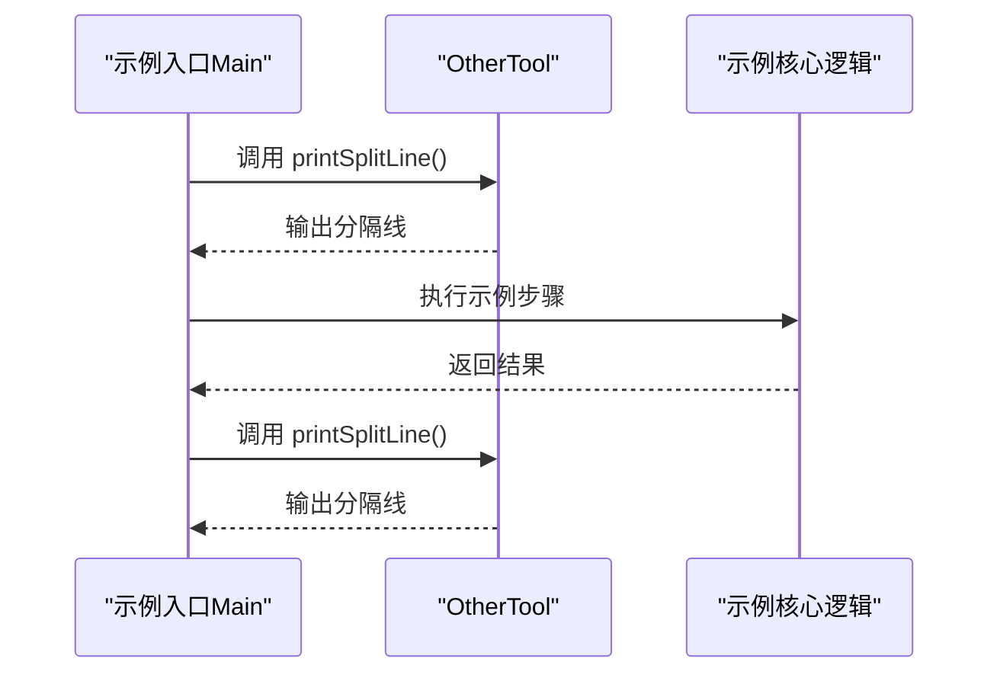
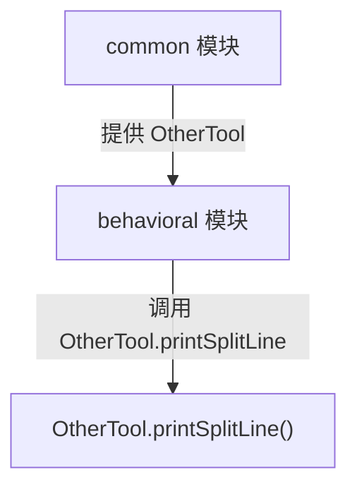

# 通用工具模块

<cite>
**本文档引用的文件**
- [OtherTool.java](file://common/src/main/java/com/future/rocket/gof23/common/OtherTool.java)
- [pom.xml（common模块）](file://common/pom.xml)
- [pom.xml（根项目）](file://pom.xml)
- [pom.xml（behavioral模块）](file://behavioral/pom.xml)
- [BusinessDelegateMain.java](file://behavioral/businessDelegate/src/main/java/com/future/rocket/gof23/business/delegate/BusinessDelegateMain.java)
- [ChainMain.java](file://behavioral/chain/src/main/java/com/future/rocket/gof23/chain/ChainMain.java)
- [CommandMain.java](file://behavioral/command/src/main/java/com/future/rocket/gof23/command/CommandMain.java)
- [IteratorMain.java](file://behavioral/iterator/src/main/java/com/future/rocket/gof23/iterator/IteratorMain.java)
- [VisitorMain.java](file://behavioral/visitor/src/main/java/com/future/rocket/gof23/visitor/VisitorMain.java)
- [NullObjectMail.java](file://behavioral/nullobject/src/main/java/com/future/rocket/gof23/nullobject/NullObjectMail.java)
- [CompositeEntityMain.java](file://behavioral/compositeEntity/src/main/java/com/future/rocket/gof23/composite/entity/CompositeEntityMain.java)
- [InterceptorFilterMain.java](file://behavioral/interceptingFilter/src/main/java/com/future/rocket/gof23/interceptor/filter/InterceptorFilterMain.java)
</cite>

## 目录
1. [引言](#引言)
2. [项目结构](#项目结构)
3. [核心组件](#核心组件)
4. [架构总览](#架构总览)
5. [详细组件分析](#详细组件分析)
6. [依赖分析](#依赖分析)
7. [性能考量](#性能考量)
8. [故障排查指南](#故障排查指南)
9. [结论](#结论)
10. [附录](#附录)

## 引言
本文件围绕通用工具模块（common）展开，重点介绍OtherTool工具类的设计目的、在项目中的定位与作用、接口设计原则与代码复用机制、在各设计模式中的应用场景与最佳实践、模块间依赖关系与集成方式，以及扩展与自定义指南。该模块目前仅包含一个静态工具类OtherTool，提供统一的分隔线输出能力，作为演示性通用工具，服务于行为型模式示例程序的输出格式化。

## 项目结构
common模块位于顶层多模块Maven工程中，作为独立模块存在；behavioral等模块通过依赖声明引入common模块，以便在各自的示例入口类中调用OtherTool进行输出分隔。

图表来源
- [pom.xml（根项目）:11-16](file://pom.xml#L11-L16)
- [pom.xml（common模块）](file://common/pom.xml#L12)
- [pom.xml（behavioral模块）:40-46](file://behavioral/pom.xml#L40-L46)

章节来源
- [pom.xml（根项目）:11-16](file://pom.xml#L11-L16)
- [pom.xml（common模块）](file://common/pom.xml#L12)
- [pom.xml（behavioral模块）:40-46](file://behavioral/pom.xml#L40-L46)

## 核心组件
- OtherTool：提供静态方法printSplitLine，用于在控制台输出统一格式的分隔线，便于区分不同示例或阶段的输出。
- 设计特征
  - 静态工具类：通过static方法提供功能，无需实例化。
  - 私有构造函数：防止外部实例化，确保纯工具性质。
  - 单一职责：专注于输出格式化，避免功能膨胀。

章节来源
- [OtherTool.java:3-11](file://common/src/main/java/com/future/rocket/gof23/common/OtherTool.java#L3-L11)

## 架构总览
common模块在项目中扮演“横切关注点”的角色，为行为型模式示例提供一致的输出风格。behavioral模块通过依赖声明引入common，示例入口类在关键流程处调用OtherTool.printSplitLine进行分隔，形成统一的演示体验。

图表来源
- [OtherTool.java:8-10](file://common/src/main/java/com/future/rocket/gof23/common/OtherTool.java#L8-L10)
- [BusinessDelegateMain.java](file://behavioral/businessDelegate/src/main/java/com/future/rocket/gof23/business/delegate/BusinessDelegateMain.java#L6)
- [ChainMain.java](file://behavioral/chain/src/main/java/com/future/rocket/gof23/chain/ChainMain.java#L7)
- [CommandMain.java](file://behavioral/command/src/main/java/com/future/rocket/gof23/command/CommandMain.java#L8)
- [IteratorMain.java](file://behavioral/iterator/src/main/java/com/future/rocket/gof23/iterator/IteratorMain.java#L3)
- [VisitorMain.java](file://behavioral/visitor/src/main/java/com/future/rocket/gof23/visitor/VisitorMain.java#L3)
- [NullObjectMail.java](file://behavioral/nullobject/src/main/java/com/future/rocket/gof23/nullobject/NullObjectMail.java#L3)
- [CompositeEntityMain.java](file://behavioral/compositeEntity/src/main/java/com/future/rocket/gof23/composite/entity/CompositeEntityMain.java#L3)
- [InterceptorFilterMain.java](file://behavioral/interceptingFilter/src/main/java/com/future/rocket/gof23/interceptor/filter/InterceptorFilterMain.java#L3)

## 详细组件分析

### OtherTool 工具类
- 类型：静态工具类
- 关键方法：printSplitLine（无参，无返回值）
- 设计要点
  - 私有构造函数：防止实例化，保证工具类纯粹性。
  - 静态方法：直接通过类名调用，降低调用成本。
  - 输出格式：统一的分隔线样式，便于阅读与调试。

图表来源
- [OtherTool.java:3-11](file://common/src/main/java/com/future/rocket/gof23/common/OtherTool.java#L3-L11)

章节来源
- [OtherTool.java:3-11](file://common/src/main/java/com/future/rocket/gof23/common/OtherTool.java#L3-L11)

### 使用场景与最佳实践
- 典型场景
  - 在每个示例入口类的关键步骤之间插入分隔线，提升可读性。
  - 在循环、条件分支或多阶段处理后输出分隔线，帮助观察执行流程。
- 最佳实践
  - 将分隔线调用集中在入口类或展示逻辑处，避免在业务核心代码中散布。
  - 统一分隔线样式，保持跨模块一致性。
  - 如需扩展，建议新增静态方法而非改变现有签名，遵循开闭原则。

章节来源
- [BusinessDelegateMain.java](file://behavioral/businessDelegate/src/main/java/com/future/rocket/gof23/business/delegate/BusinessDelegateMain.java#L12)
- [ChainMain.java:24-28](file://behavioral/chain/src/main/java/com/future/rocket/gof23/chain/ChainMain.java#L24-L28)
- [CommandMain.java](file://behavioral/command/src/main/java/com/future/rocket/gof23/command/CommandMain.java#L14)
- [IteratorMain.java](file://behavioral/iterator/src/main/java/com/future/rocket/gof23/iterator/IteratorMain.java#L11)
- [VisitorMain.java](file://behavioral/visitor/src/main/java/com/future/rocket/gof23/visitor/VisitorMain.java#L12)
- [NullObjectMail.java](file://behavioral/nullobject/src/main/java/com/future/rocket/gof23/nullobject/NullObjectMail.java#L10)
- [CompositeEntityMain.java](file://behavioral/compositeEntity/src/main/java/com/future/rocket/gof23/composite/entity/CompositeEntityMain.java#L11)
- [InterceptorFilterMain.java](file://behavioral/interceptingFilter/src/main/java/com/future/rocket/gof23/interceptor/filter/InterceptorFilterMain.java#L14)

### 调用序列（以某入口类为例）

图表来源
- [BusinessDelegateMain.java](file://behavioral/businessDelegate/src/main/java/com/future/rocket/gof23/business/delegate/BusinessDelegateMain.java#L12)
- [OtherTool.java:8-10](file://common/src/main/java/com/future/rocket/gof23/common/OtherTool.java#L8-L10)

## 依赖分析
- 模块依赖
  - behavioral模块显式声明对common模块的依赖，版本与根项目保持一致。
  - common模块自身无对外依赖，处于纯工具层。
- 示例入口类对OtherTool的使用
  - 多个behavioral示例入口类均导入并调用OtherTool.printSplitLine，体现common的横切复用价值。

图表来源
- [pom.xml（behavioral模块）:40-46](file://behavioral/pom.xml#L40-L46)
- [OtherTool.java:8-10](file://common/src/main/java/com/future/rocket/gof23/common/OtherTool.java#L8-L10)

章节来源
- [pom.xml（behavioral模块）:40-46](file://behavioral/pom.xml#L40-L46)
- [pom.xml（common模块）](file://common/pom.xml#L12)
- [pom.xml（根项目）:11-16](file://pom.xml#L11-L16)

## 性能考量
- 当前实现为轻量级静态方法，调用开销极低，适合频繁调用。
- 控制台输出受I/O限制，建议在大量日志输出场景下结合日志框架使用，避免阻塞主线程。
- 若未来扩展为带参数的分隔线（如长度、字符、颜色等），应评估字符串拼接与格式化成本，优先采用不可变常量与预分配策略。

## 故障排查指南
- 常见问题
  - 导入失败：确认示例入口类正确导入OtherTool包路径。
  - 版本不匹配：确保behavioral模块依赖的common版本与根项目一致。
  - 输出异常：检查控制台编码设置，确保特殊字符正常显示。
- 排查步骤
  - 确认pom.xml中对common的依赖已生效。
  - 在入口类中验证printSplitLine调用是否被执行。
  - 如需差异化输出，可在扩展方法中增加参数校验与异常提示。

章节来源
- [pom.xml（behavioral模块）:40-46](file://behavioral/pom.xml#L40-L46)
- [OtherTool.java:8-10](file://common/src/main/java/com/future/rocket/gof23/common/OtherTool.java#L8-L10)

## 结论
common模块通过简洁的静态工具类OtherTool，为行为型模式示例提供了统一的输出分隔能力。其设计遵循单一职责与不可变工具类原则，配合Maven模块化依赖，在不侵入业务逻辑的前提下实现了横切复用。未来可在此基础上按需扩展更多静态工具方法，持续提升演示与调试体验。

## 附录

### 扩展与自定义指南
- 新增工具方法
  - 建议保持静态方法与私有构造函数不变，确保工具类特性。
  - 方法命名遵循语义化，避免与Java标准库冲突。
- 参数化与国际化
  - 可扩展为带参数的分隔线方法，支持长度、字符、对齐方式等。
  - 若涉及多语言，建议引入资源文件与Locale配置。
- 安全与健壮性
  - 对外部输入进行边界检查与空值保护（如参数校验）。
  - 在并发环境下，确保静态方法的无状态性与线程安全。

### 设计模式中的应用建议
- 适配器/装饰器：在包装或装饰过程中使用分隔线标记阶段转换。
- 观察者/命令：在事件触发或命令执行前后输出分隔线，便于追踪。
- 迭代器/访问者：在遍历开始/结束或访问不同元素前后输出分隔线，增强可视化。