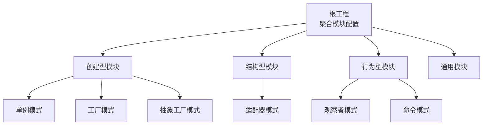
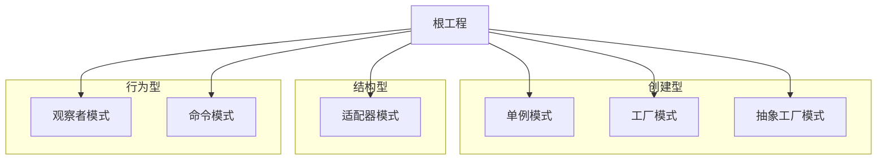
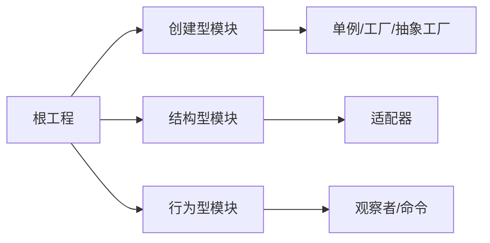

# 学习路径指导

<cite>
**本文引用的文件**
- [工程说明](file://readme.md)
- [聚合模块配置](file://pom.xml)
- [单例模式说明](file://creational/singleton/readme.md)
- [工厂模式说明](file://creational/factory/readme.md)
- [抽象工厂模式说明](file://creational/abstractfactory/readme.md)
- [适配器模式说明](file://structural/adapter/readme.md)
- [观察者模式说明](file://behavioral/observer/readme.md)
- [单例对象实现](file://creational/singleton/src/main/java/com/future/rocket/gof23/singleton/SingletonObject.java)
- [工厂实现](file://creational/factory/src/main/java/com/future/rocket/gof23/factory/build/ShapeFactory.java)
- [适配器实现](file://structural/adapter/src/main/java/com/future/rocket/gof23/adapter/struct/MediaAdapter.java)
- [主题实现（观察者模式）](file://behavioral/observer/src/main/java/com/future/rocket/gof23/observer/impl1/Subject.java)
- [命令接口](file://behavioral/command/src/main/java/com/future/rocket/gof23/command/iface/Order.java)
</cite>

## 目录
1. [引言](#引言)
2. [项目结构](#项目结构)
3. [核心组件](#核心组件)
4. [架构总览](#架构总览)
5. [详细组件分析](#详细组件分析)
6. [依赖分析](#依赖分析)
7. [性能考量](#性能考量)
8. [故障排查指南](#故障排查指南)
9. [结论](#结论)
10. [附录](#附录)

## 引言
本项目围绕 GoF23 设计模式构建，按“创建型”“结构型”“行为型”三大类别组织，每个模式均提供清晰的示例实现与说明文档，便于学习者循序渐进掌握面向对象设计思想与常见设计套路。本文将基于仓库现有实现，给出面向不同层次学习者的个性化学习路径、阶段性目标、优先级排序、实践建议与评估标准。

## 项目结构
- 聚合工程通过 Maven 管理四大模块：创建型、结构型、行为型与通用工具模块。
- 每个模式在对应模块下拥有独立子目录，包含接口、实现、枚举与入口主程序等，便于对照理解。
- 顶层说明文档指出三大模式分类，帮助学习者建立整体认知框架。

图表来源
- [聚合模块配置:11-16](file://pom.xml#L11-L16)

章节来源
- [工程说明:1-9](file://readme.md#L1-L9)
- [聚合模块配置:1-24](file://pom.xml#L1-L24)

## 核心组件
- 创建型模式：关注对象创建过程，强调“如何产生对象”，降低耦合度，提升可扩展性。
- 结构型模式：关注类与对象组合，强调“如何组合形成更大结构”，常用于解耦接口与实现。
- 行为型模式：关注对象间交互与职责分配，强调“如何协作完成任务”，提升系统灵活性与可维护性。

章节来源
- [工程说明:4-6](file://readme.md#L4-L6)

## 架构总览
本仓库采用“按类型分模块”的工程化组织方式，便于学习者按“创建—结构—行为”的顺序逐步深入；同时，每个模式内部的接口与实现分离，有利于理解“面向接口编程”的思想。

图表来源
- [聚合模块配置:11-16](file://pom.xml#L11-L16)
- [单例模式说明:1-9](file://creational/singleton/readme.md#L1-L9)
- [工厂模式说明:1-5](file://creational/factory/readme.md#L1-L5)
- [抽象工厂模式说明:1-10](file://creational/abstractfactory/readme.md#L1-L10)
- [适配器模式说明:1-8](file://structural/adapter/readme.md#L1-L8)
- [观察者模式说明:1-26](file://behavioral/observer/readme.md#L1-L26)

## 详细组件分析

### 单例模式（创建型）
- 学习要点
  - 理解单例的核心价值：全局唯一实例、避免重复创建。
  - 掌握典型实现思路与注意事项（构造私有化、静态访问方法、线程安全等）。
- 典型实现参考
  - [单例对象实现:1-17](file://creational/singleton/src/main/java/com/future/rocket/gof23/singleton/SingletonObject.java#L1-L17)
- 实践建议
  - 对照实现文件，尝试添加线程安全版本与延迟初始化版本。
  - 思考单例在测试中的可替换方案（如依赖注入）。

章节来源
- [单例模式说明:1-9](file://creational/singleton/readme.md#L1-L9)
- [单例对象实现:1-17](file://creational/singleton/src/main/java/com/future/rocket/gof23/singleton/SingletonObject.java#L1-L17)

### 工厂模式（创建型）
- 学习要点
  - 明确“谁来决定创建哪个具体对象”，将选择权从调用方剥离。
  - 理解简单工厂与面向接口的扩展性差异。
- 典型实现参考
  - [工厂实现:1-22](file://creational/factory/src/main/java/com/future/rocket/gof23/factory/build/ShapeFactory.java#L1-L22)
- 实践建议
  - 在工厂中增加新的产品类型，验证开闭原则是否得到体现。
  - 尝试将工厂方法抽取为接口，为后续“抽象工厂”打基础。

章节来源
- [工厂模式说明:1-5](file://creational/factory/readme.md#L1-L5)
- [工厂实现:1-22](file://creational/factory/src/main/java/com/future/rocket/gof23/factory/build/ShapeFactory.java#L1-L22)

### 抽象工厂模式（创建型）
- 学习要点
  - 理解“产品族”的概念，强调同一风格下的多个产品协同。
  - 区分“工厂方法”与“抽象工厂”：前者专注单一产品等级，后者专注产品族。
- 典型实现参考
  - [抽象工厂模式说明:1-10](file://creational/abstractfactory/readme.md#L1-L10)
- 实践建议
  - 基于现有工厂结构，新增一个“圆角系列”产品族，观察抽象工厂带来的扩展收益。

章节来源
- [抽象工厂模式说明:1-10](file://creational/abstractfactory/readme.md#L1-L10)

### 适配器模式（结构型）
- 学习要点
  - 理解“桥接两个不兼容接口”的动机，掌握对象适配器与类适配器的区别。
  - 关注封装与复用：通过适配器屏蔽底层差异。
- 典型实现参考
  - [适配器实现:1-33](file://structural/adapter/src/main/java/com/future/rocket/gof23/adapter/struct/MediaAdapter.java#L1-L33)
- 实践建议
  - 在适配器中加入日志与异常处理，模拟真实场景的健壮性需求。

章节来源
- [适配器模式说明:1-8](file://structural/adapter/readme.md#L1-L8)
- [适配器实现:1-33](file://structural/adapter/src/main/java/com/future/rocket/gof23/adapter/struct/MediaAdapter.java#L1-L33)

### 观察者模式（行为型）
- 学习要点
  - 明确“一对多”的依赖关系，掌握主题与观察者的解耦方式。
  - 理解同步通知与异步通知的差异及适用场景。
- 典型实现参考
  - [主题实现（观察者模式）:1-43](file://behavioral/observer/src/main/java/com/future/rocket/gof23/observer/impl1/Subject.java#L1-L43)
- 实践建议
  - 扩展多个具体观察者，验证状态变更时的通知一致性。
  - 尝试引入“推/拉”两种数据传递方式，对比优劣。

章节来源
- [观察者模式说明:1-26](file://behavioral/observer/readme.md#L1-L26)
- [主题实现（观察者模式）:1-43](file://behavioral/observer/src/main/java/com/future/rocket/gof23/observer/impl1/Subject.java#L1-L43)

### 命令模式（行为型）
- 学习要点
  - 将“请求”封装为对象，实现调用者与接收者的解耦。
  - 支持撤销、重做、日志等横切能力。
- 典型实现参考
  - [命令接口:1-6](file://behavioral/command/src/main/java/com/future/rocket/gof23/command/iface/Order.java#L1-L6)
- 实践建议
  - 基于接口扩展多种命令实现，配合调用者进行统一调度。

章节来源
- [命令接口:1-6](file://behavioral/command/src/main/java/com/future/rocket/gof23/command/iface/Order.java#L1-L6)

## 依赖分析
- 模块内聚与耦合
  - 各模式在独立子模块中实现，内聚度高、耦合度低，适合按需学习。
- 外部依赖
  - 根工程使用 Java 8，无额外外部依赖，便于快速运行与演示。
- 可能的循环依赖
  - 当前结构为单向依赖（示例代码），未见循环依赖迹象。

图表来源
- [聚合模块配置:11-16](file://pom.xml#L11-L16)

章节来源
- [聚合模块配置:18-22](file://pom.xml#L18-L22)

## 性能考量
- 对象创建成本
  - 单例避免重复创建，适合频繁使用的共享资源。
- 分发与通知
  - 观察者模式在观察者数量较多时，通知成本上升，可考虑异步化或分组通知。
- 适配器封装
  - 适配器引入一层间接调用，通常开销极小，但应避免过度嵌套导致链路过长。

## 故障排查指南
- 常见问题
  - 未支持的文件类型或产品类型：检查构造参数与分支逻辑，确保边界条件覆盖。
  - 状态未正确通知：核对主题状态变更与通知流程，确认观察者注册与去注册逻辑。
- 定位方法
  - 使用最小可复现示例，逐步缩小范围。
  - 在关键节点打印日志或断点调试，验证控制流与数据流。

章节来源
- [适配器实现:19-21](file://structural/adapter/src/main/java/com/future/rocket/gof23/adapter/struct/MediaAdapter.java#L19-L21)
- [主题实现（观察者模式）:16-20](file://behavioral/observer/src/main/java/com/future/rocket/gof23/observer/impl1/Subject.java#L16-L20)

## 结论
本仓库以“三大类型+多模式”的结构提供了系统而清晰的学习入口。建议学习者遵循“创建—结构—行为”的主线，先掌握创建型的单例与工厂，再过渡到结构型的适配器，最后进入行为型的观察者与命令等。通过对照实现文件与阅读说明文档，结合实践练习与项目应用，可稳步达成从入门到精通的能力跃迁。

## 附录

### 学习阶段划分与能力要求
- 初学者
  - 目标：理解三大类型与常见模式的动机与角色，能识别并运行示例。
  - 能力要求：掌握基本语法、面向接口编程思想、模块化思维。
- 进阶开发者
  - 目标：能独立扩展模式实现，理解开闭原则与依赖倒置。
  - 能力要求：具备重构意识、单元测试思维、异常处理与日志记录。
- 高级架构师
  - 目标：能在复杂业务中选择合适模式组合，平衡性能、可维护性与可扩展性。
  - 能力要求：具备领域建模能力、跨模块协调能力、技术选型与演进规划能力。

### 学习顺序与优先级
- 建议顺序
  - 创建型：单例 → 工厂 → 抽象工厂
  - 结构型：适配器
  - 行为型：观察者 → 命令
- 优先级考虑
  - 先易后难：单例最简，工厂次之，抽象工厂更复杂但收益明显。
  - 先内后外：先掌握单一模式，再理解模式间的组合与协作。

### 各模式之间的关联性与学习依赖
- 单例与工厂：单例强调唯一性，工厂强调创建策略；可结合使用于服务注册与获取。
- 工厂与抽象工厂：抽象工厂是对工厂的横向扩展，强调产品族的一致性。
- 适配器与观察者：适配器用于对接外部系统，观察者用于内部解耦；两者可并用以增强系统的扩展性。
- 命令与观察者：命令模式可与观察者结合实现事件驱动与回放机制。

### 实践练习建议
- 单例：实现线程安全版本与延迟初始化版本，比较差异。
- 工厂：新增产品类型，验证开闭原则；尝试将工厂方法接口化。
- 适配器：在适配器中加入日志与异常处理，模拟真实场景。
- 观察者：扩展多个具体观察者，验证通知一致性；尝试“推/拉”两种数据传递方式。
- 命令：基于接口扩展多种命令实现，配合调用者进行统一调度。

### 项目应用指导
- 选择模式的原则
  - 明确痛点：是创建成本高、接口不兼容、还是交互复杂？
  - 评估代价：引入模式是否带来额外复杂度？是否符合当前演进阶段？
- 组合使用
  - 例如：使用工厂创建服务，使用单例管理共享资源，使用适配器对接第三方接口，使用观察者实现事件分发，使用命令实现操作的可追溯性。

### 技能评估标准
- 能力维度
  - 理解深度：能否准确描述模式动机、结构与适用场景。
  - 应用广度：能否在不同场景中选择合适模式并组合使用。
  - 实践质量：实现是否满足可扩展、可测试、可维护的要求。
- 评估方法
  - 自测清单：是否覆盖边界条件、异常处理、日志与可观察性。
  - 代码评审：是否遵循接口隔离、依赖倒置、最少知识等原则。
  - 场景迁移：能否将示例迁移到实际业务中并保持一致性。