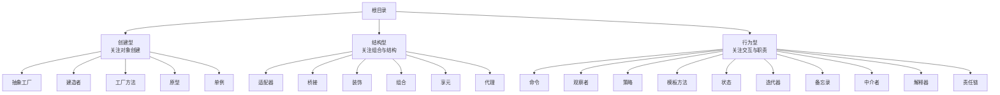
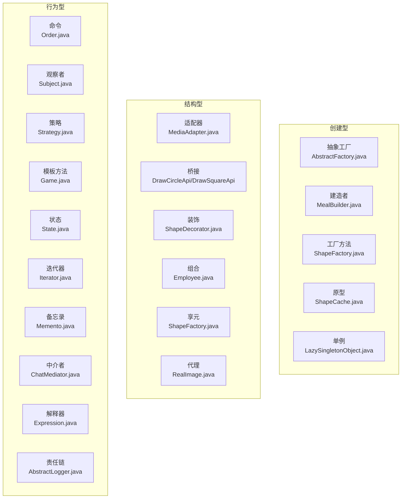
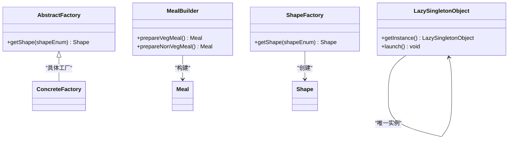
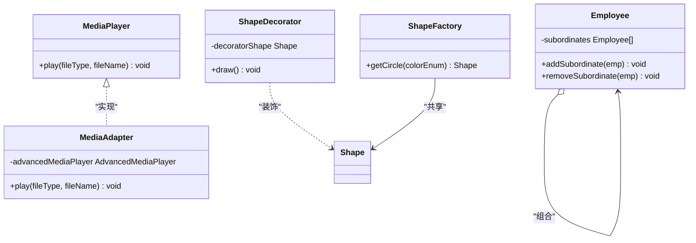
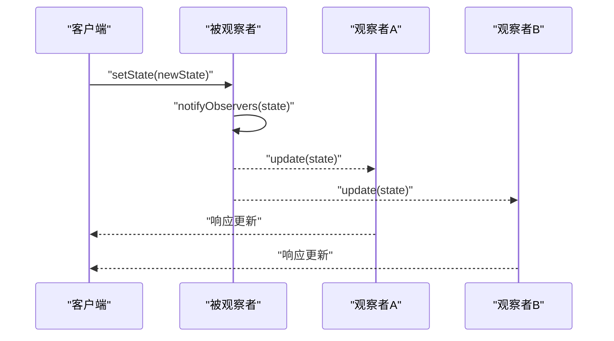
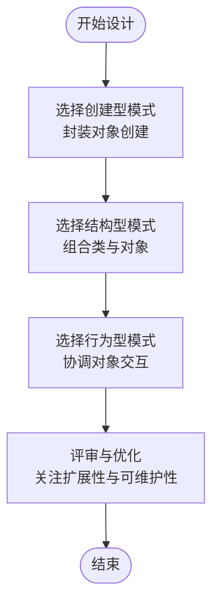
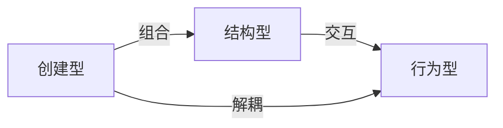

# 设计模式分类体系

<cite>
**本文引用的文件**
- [工程说明](file://readme.md)
- [抽象工厂模式说明](file://creational/abstractfactory/readme.md)
- [适配器模式说明](file://structural/adapter/readme.md)
- [观察者模式说明](file://behavioral/observer/readme.md)
- [抽象工厂-抽象工厂类](file://creational/abstractfactory/src/main/java/com/future/rocket/gof23/abs/factory/build/AbstractFactory.java)
- [适配器-适配器类](file://structural/adapter/src/main/java/com/future/rocket/gof23/adapter/struct/MediaAdapter.java)
- [观察者-被观察者类](file://behavioral/observer/src/main/java/com/future/rocket/gof23/observer/impl1/Subject.java)
- [单例-懒汉式单例](file://creational/singleton/src/main/java/com/future/rocket/gof23/singleton/LazySingletonObject.java)
- [装饰-装饰器抽象类](file://structural/decorator/src/main/java/com/future/rocket/gof23/decorator/struct/ShapeDecorator.java)
- [命令-命令接口](file://behavioral/command/src/main/java/com/future/rocket/gof23/command/iface/Order.java)
- [建造者-建造者类](file://creational/builder/src/main/java/com/future/rocket/gof23/builder/build/MealBuilder.java)
- [组合-员工类](file://structural/composite/src/main/java/com/future/rocket/gof23/composite/Employee.java)
- [模板-游戏抽象类](file://behavioral/template/src/main/java/com/future/rocket/gof23/template/abs/Game.java)
- [工厂-工厂类](file://creational/factory/src/main/java/com/future/rocket/gof23/factory/build/ShapeFactory.java)
- [享元-享元工厂类](file://structural/flyweight/src/main/java/com/future/rocket/gof23/flyweight/factory/ShapeFactory.java)
- [状态-状态接口](file://behavioral/state/src/main/java/com/future/rocket/gof23/state/iface/State.java)
</cite>

## 目录
1. [引言](#引言)
2. [项目结构](#项目结构)
3. [核心组件](#核心组件)
4. [架构总览](#架构总览)
5. [详细组件分析](#详细组件分析)
6. [依赖分析](#依赖分析)
7. [性能考虑](#性能考虑)
8. [故障排查指南](#故障排查指南)
9. [结论](#结论)
10. [附录](#附录)

## 引言
本仓库以“三大设计模式分类体系”为主线组织内容：创建型、结构型与行为型。该分类体系由 GoF 提出，旨在帮助开发者从“对象创建”“类与对象组合”“对象交互与职责分配”三个维度系统化地思考与复用软件设计经验。通过本仓库中各模式的示例实现，读者可以理解每类模式的关注点、典型场景与相互关系，并获得可操作的学习路径与实践建议。

## 项目结构
仓库按照三大类组织目录，每个子目录下包含若干具体模式示例，辅以简要说明文档与主程序入口，便于快速定位与学习。

- 创建型（Creational）：关注对象的创建过程，包括工厂方法、抽象工厂、建造者、原型、单例等。
- 结构型（Structural）：关注类与对象的组合，包括适配器、桥接、装饰、组合、外观、享元、代理等。
- 行为型（Behavioral）：关注对象间的交互与职责分配，包括策略、模板方法、观察者、迭代器、命令、备忘录、状态、访问者、中介者、解释器、责任链等。

章节来源
- [工程说明:1-9](file://readme.md#L1-L9)

## 核心组件
本节从分类视角总结三大类的核心关注点与典型代表：

- 创建型（Creational）
  - 关注点：封装对象创建细节，隐藏实例化过程，提升扩展性与可维护性。
  - 典型代表：工厂方法、抽象工厂、建造者、原型、单例。
  - 学习要点：理解“谁来创建”“何时创建”“如何扩展”，掌握延迟初始化、统一接口与共享复用等技巧。

- 结构型（Structural）
  - 关注点：处理类与对象的组合，解决“如何将不同部分组合成更大结构”的问题。
  - 典型代表：适配器、桥接、装饰、组合、外观、享元、代理。
  - 学习要点：把握“解耦接口差异”“分离抽象与实现”“透明增强”“共享细粒度对象”等思想。

- 行为型（Behavioral）
  - 关注点：管理对象间的交互与职责分配，强调“如何协作完成任务”。
  - 典型代表：策略、模板方法、观察者、迭代器、命令、备忘录、状态、访问者、中介者、解释器、责任链。
  - 学习要点：理解“算法可替换”“流程可复用”“事件驱动”“状态迁移”等机制。

章节来源
- [工程说明:1-9](file://readme.md#L1-L9)

## 架构总览
下图展示了三大类模式在仓库中的组织关系与代表性文件映射，体现“分类—模块—实现”的层级结构。

图表来源
- [抽象工厂-抽象工厂类:1-9](file://creational/abstractfactory/src/main/java/com/future/rocket/gof23/abs/factory/build/AbstractFactory.java#L1-L9)
- [建造者-建造者类:1-25](file://creational/builder/src/main/java/com/future/rocket/gof23/builder/build/MealBuilder.java#L1-L25)
- [工厂-工厂类:1-22](file://creational/factory/src/main/java/com/future/rocket/gof23/factory/build/ShapeFactory.java#L1-L22)
- [单例-懒汉式单例:1-22](file://creational/singleton/src/main/java/com/future/rocket/gof23/singleton/LazySingletonObject.java#L1-L22)
- [适配器-适配器类:1-33](file://structural/adapter/src/main/java/com/future/rocket/gof23/adapter/struct/MediaAdapter.java#L1-L33)
- [装饰-装饰器抽象类:1-13](file://structural/decorator/src/main/java/com/future/rocket/gof23/decorator/struct/ShapeDecorator.java#L1-L13)
- [组合-员工类:1-40](file://structural/composite/src/main/java/com/future/rocket/gof23/composite/Employee.java#L1-L40)
- [享元-享元工厂类:1-18](file://structural/flyweight/src/main/java/com/future/rocket/gof23/flyweight/factory/ShapeFactory.java#L1-L18)
- [命令-命令接口:1-6](file://behavioral/command/src/main/java/com/future/rocket/gof23/command/iface/Order.java#L1-L6)
- [观察者-被观察者类:1-43](file://behavioral/observer/src/main/java/com/future/rocket/gof23/observer/impl1/Subject.java#L1-L43)
- [模板-游戏抽象类:1-14](file://behavioral/template/src/main/java/com/future/rocket/gof23/template/abs/Game.java#L1-L14)
- [状态-状态接口:1-8](file://behavioral/state/src/main/java/com/future/rocket/gof23/state/iface/State.java#L1-L8)

## 详细组件分析

### 创建型模式分析
- 抽象工厂（Abstract Factory）
  - 特点：围绕“超级工厂”创建其他工厂，屏蔽产品族的创建细节。
  - 关注重点：产品族一致性、扩展新族别。
  - 典型场景：跨平台 UI 组件、数据库驱动切换、多主题皮肤。
  - 实现要点：抽象工厂声明创建接口；具体工厂返回具体产品；客户端只依赖抽象。

- 建造者（Builder）
  - 特点：将复杂对象的构建与表示分离，使同样的构建过程可以创建不同表示。
  - 关注重点：分步骤构建、顺序控制、可选部件。
  - 典型场景：配置对象、文档生成、复杂对象组装。
  - 实现要点：建造者聚合部件；指挥者控制流程；返回最终产品。

- 工厂方法（Factory Method）
  - 特点：延迟到子类决定实例化哪一个具体类。
  - 关注重点：扩展性、多态创建。
  - 典型场景：插件系统、跨平台组件创建。
  - 实现要点：抽象工厂声明工厂方法；具体工厂返回具体产品。

- 原型（Prototype）
  - 特点：通过复制现有实例来创建新对象，避免重复构造。
  - 关注重点：克隆成本低、初始化开销大。
  - 典型场景：高性能对象池、复杂对象复制。
  - 实现要点：实现克隆接口；缓存原型实例；深拷贝/浅拷贝策略。

- 单例（Singleton）
  - 特点：确保一个类仅有一个实例，并提供全局访问点。
  - 关注重点：线程安全、延迟加载、序列化与反射防护。
  - 典型场景：配置中心、日志记录器、资源管理器。
  - 实现要点：私有构造函数；静态实例；双重检查锁定；枚举单例。

图表来源
- [抽象工厂-抽象工厂类:1-9](file://creational/abstractfactory/src/main/java/com/future/rocket/gof23/abs/factory/build/AbstractFactory.java#L1-L9)
- [建造者-建造者类:1-25](file://creational/builder/src/main/java/com/future/rocket/gof23/builder/build/MealBuilder.java#L1-L25)
- [工厂-工厂类:1-22](file://creational/factory/src/main/java/com/future/rocket/gof23/factory/build/ShapeFactory.java#L1-L22)
- [单例-懒汉式单例:1-22](file://creational/singleton/src/main/java/com/future/rocket/gof23/singleton/LazySingletonObject.java#L1-L22)

章节来源
- [抽象工厂模式说明:1-10](file://creational/abstractfactory/readme.md#L1-L10)
- [抽象工厂-抽象工厂类:1-9](file://creational/abstractfactory/src/main/java/com/future/rocket/gof23/abs/factory/build/AbstractFactory.java#L1-L9)
- [建造者-建造者类:1-25](file://creational/builder/src/main/java/com/future/rocket/gof23/builder/build/MealBuilder.java#L1-L25)
- [工厂-工厂类:1-22](file://creational/factory/src/main/java/com/future/rocket/gof23/factory/build/ShapeFactory.java#L1-L22)
- [单例-懒汉式单例:1-22](file://creational/singleton/src/main/java/com/future/rocket/gof23/singleton/LazySingletonObject.java#L1-L22)

### 结构型模式分析
- 适配器（Adapter）
  - 特点：作为两个不兼容接口之间的桥梁，使原本因接口不匹配而不能一起工作的类可以协同工作。
  - 关注重点：复用已有类、隔离接口差异。
  - 典型场景：第三方库集成、遗留系统对接。
  - 实现要点：目标接口 + 适配器实现；内部持有被适配对象；在适配器中转换调用。

- 装饰（Decorator）
  - 特点：在不改变原对象接口的前提下，动态地给对象添加职责。
  - 关注重点：透明增强、职责叠加。
  - 典型场景：IO 流处理、权限控制、缓存包装。
  - 实现要点：装饰器实现统一接口；持有一个被装饰对象；在调用前后附加行为。

- 组合（Composite）
  - 特点：将对象组合成树形结构以表示“部分-整体”的层次结构，使得用户对单个对象和组合对象的使用具有一致性。
  - 关注重点：统一访问、递归遍历。
  - 典型场景：文件系统、组织架构、UI 组件树。
  - 实现要点：抽象构件定义公共接口；叶子节点直接实现；容器节点聚合子节点。

- 享元（Flyweight）
  - 特点：运用共享技术有效地支持大量细粒度对象。
  - 关注重点：内蕴状态共享、外蕴状态外部化。
  - 典型场景：文本编辑器字符渲染、连接池。
  - 实现要点：享元工厂缓存内蕴状态；客户端传入外蕴状态。

- 代理（Proxy）
  - 特点：为其他对象提供一种代理以控制对这个对象的访问。
  - 关注重点：远程代理、保护代理、延迟加载。
  - 典型场景：远程服务代理、虚拟代理、缓存代理。
  - 实现要点：抽象接口 + 真实对象 + 代理对象；代理负责前置/后置处理。

图表来源
- [适配器-适配器类:1-33](file://structural/adapter/src/main/java/com/future/rocket/gof23/adapter/struct/MediaAdapter.java#L1-L33)
- [装饰-装饰器抽象类:1-13](file://structural/decorator/src/main/java/com/future/rocket/gof23/decorator/struct/ShapeDecorator.java#L1-L13)
- [组合-员工类:1-40](file://structural/composite/src/main/java/com/future/rocket/gof23/composite/Employee.java#L1-L40)
- [享元-享元工厂类:1-18](file://structural/flyweight/src/main/java/com/future/rocket/gof23/flyweight/factory/ShapeFactory.java#L1-L18)

章节来源
- [适配器模式说明:1-8](file://structural/adapter/readme.md#L1-L8)
- [适配器-适配器类:1-33](file://structural/adapter/src/main/java/com/future/rocket/gof23/adapter/struct/MediaAdapter.java#L1-L33)
- [装饰-装饰器抽象类:1-13](file://structural/decorator/src/main/java/com/future/rocket/gof23/decorator/struct/ShapeDecorator.java#L1-L13)
- [组合-员工类:1-40](file://structural/composite/src/main/java/com/future/rocket/gof23/composite/Employee.java#L1-L40)
- [享元-享元工厂类:1-18](file://structural/flyweight/src/main/java/com/future/rocket/gof23/flyweight/factory/ShapeFactory.java#L1-L18)

### 行为型模式分析
- 观察者（Observer）
  - 特点：定义对象间一对多依赖，当一个对象状态改变时，其所有依赖者都会得到通知并自动更新。
  - 关注重点：解耦发布与订阅、动态绑定。
  - 典型场景：事件系统、数据绑定、消息广播。
  - 实现要点：Subject 维护观察者列表；Observer 定义更新接口；具体观察者实现更新逻辑。

- 命令（Command）
  - 特点：将请求封装为对象，使你可用不同请求对客户进行参数化，对请求排队或记录日志，以及支持可撤销操作。
  - 关注重点：请求/动作封装、解耦调用者与接收者。
  - 典型场景：宏命令、撤销重做、异步调度。
  - 实现要点：命令接口 + 具体命令 + 接收者 + 调用者。

- 模板方法（Template Method）
  - 特点：在父类中定义算法骨架，将一些步骤延迟到子类，使得子类可以不改变算法结构即可重定义特定步骤。
  - 关注重点：复用不变逻辑、扩展可变步骤。
  - 典型场景：框架扩展点、通用流程定制。
  - 实现要点：抽象类定义模板方法；子类覆盖可变步骤。

- 状态（State）
  - 特点：允许对象在内部状态改变时改变其行为，看起来对象似乎修改了它的类。
  - 关注重点：状态机建模、行为随状态转移。
  - 典型场景：工作流引擎、协议栈、UI 状态。
  - 实现要点：状态接口 + 具体状态 + 上下文维护当前状态。

图表来源
- [观察者-被观察者类:1-43](file://behavioral/observer/src/main/java/com/future/rocket/gof23/observer/impl1/Subject.java#L1-L43)

章节来源
- [观察者模式说明:1-26](file://behavioral/observer/readme.md#L1-L26)
- [命令-命令接口:1-6](file://behavioral/command/src/main/java/com/future/rocket/gof23/command/iface/Order.java#L1-L6)
- [模板-游戏抽象类:1-14](file://behavioral/template/src/main/java/com/future/rocket/gof23/template/abs/Game.java#L1-L14)
- [状态-状态接口:1-8](file://behavioral/state/src/main/java/com/future/rocket/gof23/state/iface/State.java#L1-L8)
- [观察者-被观察者类:1-43](file://behavioral/observer/src/main/java/com/future/rocket/gof23/observer/impl1/Subject.java#L1-L43)

### 概念总览
- 分类依据与意义
  - 创造型：解决“如何产生对象”的问题，强调封装创建过程、提升扩展性。
  - 结构型：解决“如何组合对象”的问题，强调接口适配、职责透明增强与共享。
  - 行为型：解决“如何协作与交互”的问题，强调算法替换、流程复用与状态迁移。
- 三者关系与层次
  - 三类模式并非孤立存在，而是互补：先“创建对象”，再“组合结构”，最后“协调行为”。
  - 结构型常与创建型配合（如工厂+适配器），行为型常与结构型配合（如观察者+组合）。

## 依赖分析
- 模块内聚与耦合
  - 同一分类内的模式通常围绕同一抽象维度，内聚度高；跨分类组合时需注意边界与职责划分。
- 外部依赖与集成
  - 结构型模式常用于隔离外部系统差异（如适配器），行为型模式常用于解耦调用方与实现方（如命令、观察者）。
- 循环依赖规避
  - 避免模式之间出现循环依赖；若出现，应通过引入抽象层或引入中间层来打破。

## 性能考虑
- 创建型
  - 单例的线程安全与延迟加载会影响启动时间与内存占用；工厂与建造者在频繁创建对象时需考虑缓存与池化。
- 结构型
  - 适配器与代理会带来额外调用开销；装饰器叠加层数过多可能影响性能；享元通过共享显著降低内存。
- 行为型
  - 观察者在观察者数量巨大时通知成本上升；命令模式的撤销栈会增加空间开销；状态模式的状态表查询需平衡查找效率。

## 故障排查指南
- 常见问题
  - 创建型：单例未正确实现导致多实例；工厂分支遗漏导致空返回；建造者步骤缺失导致对象不完整。
  - 结构型：适配器未覆盖全部文件类型导致异常；装饰器未转发必要方法导致功能缺失；组合未处理空子节点导致 NPE。
  - 行为型：观察者未及时移除导致内存泄漏；命令未实现撤销导致回滚失败；状态切换条件错误导致死循环。
- 排查建议
  - 使用单元测试覆盖关键分支与边界条件；
  - 在关键路径打印日志或埋点，追踪对象生命周期与调用链；
  - 对多线程场景进行并发测试，验证线程安全与竞态条件。

## 结论
三大设计模式分类体系提供了系统化的软件设计视角：从“创建对象”到“组合结构”，再到“协调行为”。通过本仓库的示例与分析，学习者可以建立清晰的分类框架、掌握典型模式的适用场景与实现要点，并在实际项目中灵活组合使用，提升系统的可扩展性、可维护性与可测试性。

## 附录
- 学习路径建议
  - 先掌握创建型（工厂、单例）与结构型（适配器、装饰、组合）的基础用法；
  - 再深入行为型（观察者、命令、模板方法）的交互机制；
  - 最后尝试跨分类组合（如工厂+适配器、观察者+组合）以应对复杂场景。
- 进一步阅读
  - 可结合各模式的 README 与主程序入口，深入理解示例运行流程与关键实现细节。