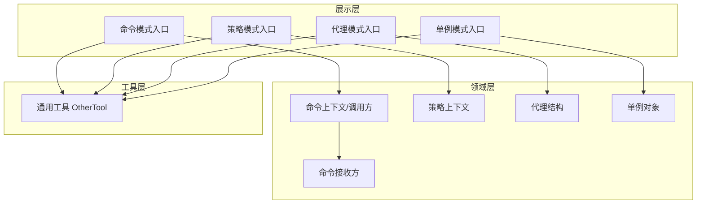
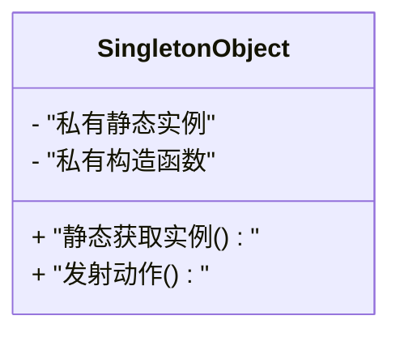
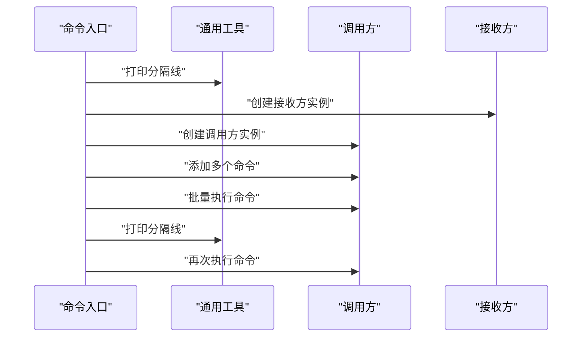
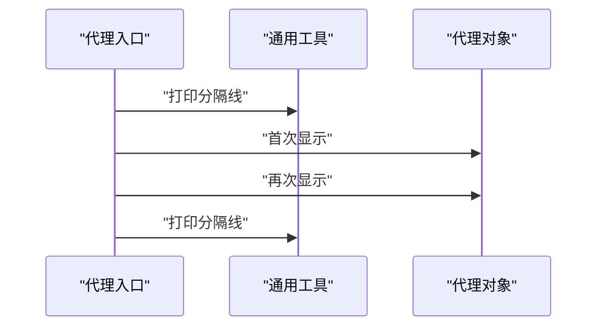
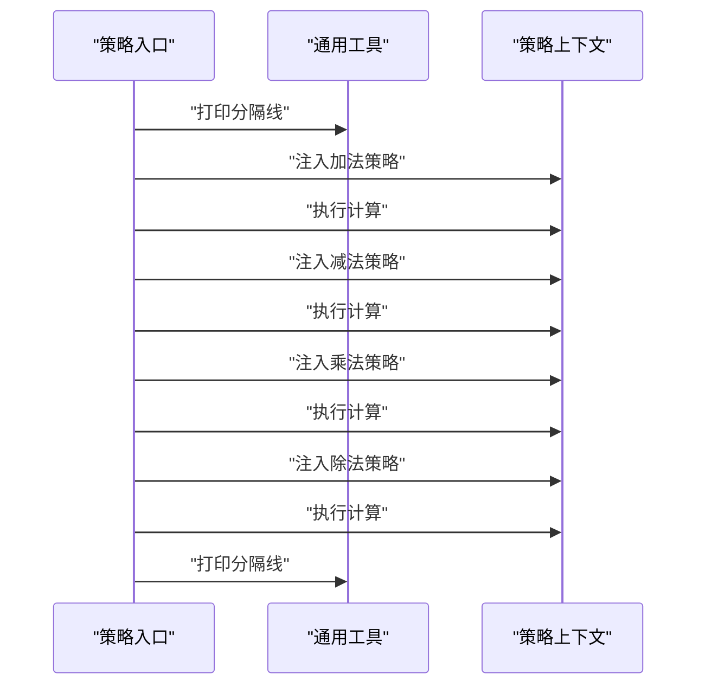
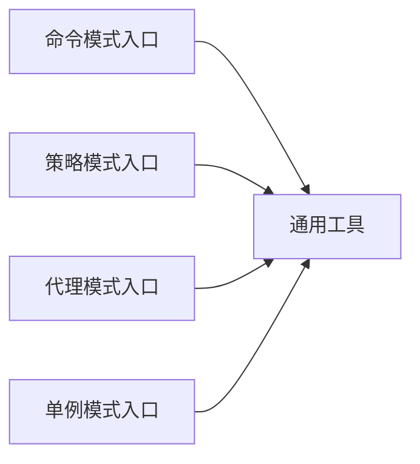

# 项目介绍

<cite>
**本文引用的文件**
- [pom.xml](file://pom.xml)
- [readme.md](file://readme.md)
- [creational/abstractfactory/readme.md](file://creational/abstractfactory/readme.md)
- [behavioral/observer/readme.md](file://behavioral/observer/readme.md)
- [structural/adapter/readme.md](file://structural/adapter/readme.md)
- [common/OtherTool.java](file://common/src/main/java/com/future/rocket/gof23/common/OtherTool.java)
- [creational/singleton/SingletonObject.java](file://creational/singleton/src/main/java/com/future/rocket/gof23/singleton/SingletonObject.java)
- [behavioral/command/CommandMain.java](file://behavioral/command/src/main/java/com/future/rocket/gof23/command/CommandMain.java)
- [structural/proxy/ProxyMain.java](file://structural/proxy/src/main/java/com/future/rocket/gof23/proxy/ProxyMain.java)
- [behavioral/strategy/StrategyMain.java](file://behavioral/strategy/src/main/java/com/future/rocket/gof23/strategy/StrategyMain.java)
</cite>

## 目录
1. [引言](#引言)
2. [项目结构](#项目结构)
3. [核心组件](#核心组件)
4. [架构总览](#架构总览)
5. [详细组件分析](#详细组件分析)
6. [依赖分析](#依赖分析)
7. [性能考虑](#性能考虑)
8. [故障排除指南](#故障排除指南)
9. [结论](#结论)
10. [附录](#附录)

## 引言
gof23Rockets 是一个以“火箭发射”为主题的教学项目，系统性地覆盖了面向对象设计模式中的23种经典模式。项目通过模块化组织、统一的入口与输出风格，以及贯穿始终的主题化命名，帮助学习者在轻松的氛围中掌握设计模式的原理与实践。

本项目的核心目标与教育价值体现在：
- 系统性：按创建型、结构型、行为型三大类组织，便于建立知识体系与检索路径。
- 实践性：每种模式均提供独立可运行的示例模块，配合统一工具输出分隔线，便于对比与复现。
- 趣味性：以“火箭发射”为主线命名与输出，降低学习门槛，提升参与感。
- 可扩展性：采用 Maven 多模块结构，便于新增模式与扩展教学内容。

与传统设计模式教学方式相比，gof23Rockets 的优势在于：
- 将抽象概念具象化到可执行示例，减少“只看不练”的学习盲区。
- 提供一致的输出风格与工具，强化学习节奏与反馈。
- 通过主题化包装，使学习过程更富趣味与记忆点。

## 项目结构
项目采用 Maven 聚合工程结构，顶层 POM 声明四大模块：creational（创建型）、structural（结构型）、behavioral（行为型）、common（通用工具）。各模块下按模式名称进一步细分源码与文档，形成清晰的“模式-代码-说明”一体化布局。

```mermaid
graph TB
Root["gof23 根工程<br/>聚合四大模块"] --> C["创建型模块"]
Root --> S["结构型模块"]
Root --> B["行为型模块"]
Root --> U["通用工具模块"]
C --> CF["抽象工厂"]
C --> BF["建造者"]
C --> FF["工厂方法"]
C --> PR["原型"]
C --> SG["单例"]
S --> AD["适配器"]
S --> BR["桥接"]
S --> CM["组合"]
S --> DAO["数据访问对象"]
S --> DC["装饰器"]
S --> FL["过滤器"]
S --> FW["享元"]
S --> FC["前端控制器"]
S --> PX["代理"]
S --> SL["服务定位器"]
S --> TO["值对象传输"]
B --> BD["业务委托"]
B --> CH["责任链"]
B --> CO["命令"]
B --> CE["组合实体"]
B --> IF["拦截过滤器"]
B --> IN["解释器"]
B --> IT["迭代器"]
B --> MD["中介者"]
B --> ME["备忘录"]
B --> MVC["MVC"]
B --> NO["空对象"]
B --> OB["观察者"]
B --> ST["状态"]
B --> SR["策略"]
B --> TM["模板方法"]
B --> VS["访问者"]
```

图表来源
- [pom.xml:11-16](file://pom.xml#L11-L16)

章节来源
- [pom.xml:1-24](file://pom.xml#L1-L24)
- [readme.md:1-7](file://readme.md#L1-L7)

## 核心组件
- 通用工具 OtherTool：提供统一的分隔线打印能力，贯穿各模式示例，确保输出风格一致，便于对比与阅读。
- 主题化输出：各模式入口类在启动时打印欢迎语与当前场景提示，配合分隔线，形成“进入模式世界”的沉浸式体验。
- 示例入口：每个模式均提供独立的 main 入口类，直接运行即可观察该模式的行为特征与交互流程。

章节来源
- [common/OtherTool.java:8-11](file://common/src/main/java/com/future/rocket/gof23/common/OtherTool.java#L8-L11)
- [behavioral/command/CommandMain.java:12-14](file://behavioral/command/src/main/java/com/future/rocket/gof23/command/CommandMain.java#L12-L14)
- [structural/proxy/ProxyMain.java:8-10](file://structural/proxy/src/main/java/com/future/rocket/gof23/proxy/ProxyMain.java#L8-L10)
- [behavioral/strategy/StrategyMain.java:12-14](file://behavioral/strategy/src/main/java/com/future/rocket/gof23/strategy/StrategyMain.java#L12-L14)

## 架构总览
从教学视角看，gof23Rockets 的“架构”由三层构成：
- 展示层：各模式的 main 入口负责演示与输出，统一使用工具类进行格式化展示。
- 领域层：各模式的接口、实现、上下文与调用方，体现该模式的结构与交互。
- 工具层：通用工具模块提供跨模式的共享能力（如分隔线打印），保证一致性与可读性。

图表来源
- [behavioral/command/CommandMain.java:12-29](file://behavioral/command/src/main/java/com/future/rocket/gof23/command/CommandMain.java#L12-L29)
- [behavioral/strategy/StrategyMain.java:16-30](file://behavioral/strategy/src/main/java/com/future/rocket/gof23/strategy/StrategyMain.java#L16-L30)
- [structural/proxy/ProxyMain.java:12-15](file://structural/proxy/src/main/java/com/future/rocket/gof23/proxy/ProxyMain.java#L12-L15)
- [creational/singleton/SingletonObject.java:10-16](file://creational/singleton/src/main/java/com/future/rocket/gof23/singleton/SingletonObject.java#L10-L16)
- [common/OtherTool.java:8-11](file://common/src/main/java/com/future/rocket/gof23/common/OtherTool.java#L8-L11)

## 详细组件分析

### 单例模式（创建型）
- 设计要点：通过私有构造与静态获取实例，确保全局唯一；在本项目中以“火箭发射”语义呈现。
- 教学价值：理解延迟初始化、线程安全考量与应用场景边界。
- 示例入口：直接运行入口类，观察单例对象的生命周期与调用行为。

图表来源
- [creational/singleton/SingletonObject.java:3-16](file://creational/singleton/src/main/java/com/future/rocket/gof23/singleton/SingletonObject.java#L3-L16)

章节来源
- [creational/singleton/SingletonObject.java:1-17](file://creational/singleton/src/main/java/com/future/rocket/gof23/singleton/SingletonObject.java#L1-L17)

### 命令模式（行为型）
- 设计要点：将请求封装为对象，支持参数化、队列化与撤销操作；通过调用方与接收方解耦。
- 教学价值：掌握命令的封装、调用与批量执行思想。
- 示例流程：创建多个命令对象，交由调用方集中处理，随后再次执行以验证状态变更。

图表来源
- [behavioral/command/CommandMain.java:12-29](file://behavioral/command/src/main/java/com/future/rocket/gof23/command/CommandMain.java#L12-L29)
- [common/OtherTool.java:8-11](file://common/src/main/java/com/future/rocket/gof23/common/OtherTool.java#L8-L11)

章节来源
- [behavioral/command/CommandMain.java:1-32](file://behavioral/command/src/main/java/com/future/rocket/gof23/command/CommandMain.java#L1-L32)

### 代理模式（结构型）
- 设计要点：在不改变真实对象接口的前提下，引入代理对象控制访问与附加行为。
- 教学价值：理解代理的缓存、权限与延迟加载等典型用途。
- 示例流程：首次访问触发真实加载，后续访问复用结果，体现代理的透明性与性能收益。

图表来源
- [structural/proxy/ProxyMain.java:8-15](file://structural/proxy/src/main/java/com/future/rocket/gof23/proxy/ProxyMain.java#L8-L15)
- [common/OtherTool.java:8-11](file://common/src/main/java/com/future/rocket/gof23/common/OtherTool.java#L8-L11)

章节来源
- [structural/proxy/ProxyMain.java:1-18](file://structural/proxy/src/main/java/com/future/rocket/gof23/proxy/ProxyMain.java#L1-L18)

### 策略模式（行为型）
- 设计要点：将算法族封装为独立策略，运行期可切换，避免条件分支膨胀。
- 教学价值：掌握算法封装与上下文解耦，理解开闭原则的实践。
- 示例流程：在不同上下文中注入不同策略，依次执行并输出结果，直观对比策略差异。

图表来源
- [behavioral/strategy/StrategyMain.java:16-30](file://behavioral/strategy/src/main/java/com/future/rocket/gof23/strategy/StrategyMain.java#L16-L30)
- [common/OtherTool.java:8-11](file://common/src/main/java/com/future/rocket/gof23/common/OtherTool.java#L8-L11)

章节来源
- [behavioral/strategy/StrategyMain.java:1-32](file://behavioral/strategy/src/main/java/com/future/rocket/gof23/strategy/StrategyMain.java#L1-L32)

### 观察者模式（行为型）
- 模式简介：定义对象间一对多依赖，当主体状态变化时，通知所有依赖者自动更新。
- 教学价值：理解发布-订阅思想与松耦合通信机制。
- 学习要点：区分主体与观察者角色、关注注册与通知流程、体会状态同步的自动化。

章节来源
- [behavioral/observer/readme.md:1-26](file://behavioral/observer/readme.md#L1-L26)

### 抽象工厂模式（创建型）
- 模式简介：围绕超工厂创建其他工厂，属于“工厂的工厂”，强调产品族的统一构建。
- 教学价值：掌握产品族与产品等级的抽象分离，理解多工厂协同的扩展性。
- 学习要点：识别工厂族、产品族与具体实现的关系，关注扩展新族时的改动范围。

章节来源
- [creational/abstractfactory/readme.md:1-10](file://creational/abstractfactory/readme.md#L1-L10)

### 适配器模式（结构型）
- 模式简介：作为两个不兼容接口之间的桥梁，将一个接口转换为客户端期望的另一个接口。
- 教学价值：理解接口适配与兼容性改造的常见手段。
- 学习要点：区分对象适配器与类适配器、关注适配后的能力边界与性能影响。

章节来源
- [structural/adapter/readme.md:1-8](file://structural/adapter/readme.md#L1-L8)

## 依赖分析
- 模块内依赖：各模式模块内部遵循“接口-实现-上下文-入口”的层次化组织，入口类依赖工具类与模式实现。
- 模块间依赖：通用工具模块被各模式入口类依赖，形成“横切关注点”的统一输出风格。
- 构建依赖：顶层 POM 聚合四大模块，确保编译与测试的统一管理。

图表来源
- [behavioral/command/CommandMain.java:3-8](file://behavioral/command/src/main/java/com/future/rocket/gof23/command/CommandMain.java#L3-L8)
- [behavioral/strategy/StrategyMain.java:3-8](file://behavioral/strategy/src/main/java/com/future/rocket/gof23/strategy/StrategyMain.java#L3-L8)
- [structural/proxy/ProxyMain.java:3-4](file://structural/proxy/src/main/java/com/future/rocket/gof23/proxy/ProxyMain.java#L3-L4)
- [creational/singleton/SingletonObject.java:10-16](file://creational/singleton/src/main/java/com/future/rocket/gof23/singleton/SingletonObject.java#L10-L16)
- [common/OtherTool.java:8-11](file://common/src/main/java/com/future/rocket/gof23/common/OtherTool.java#L8-L11)

章节来源
- [pom.xml:11-16](file://pom.xml#L11-L16)

## 性能考虑
- 输出开销：统一的分隔线打印仅在关键节点执行，对整体性能影响极小，但显著提升可读性。
- 运行时成本：各模式示例均为轻量级演示，适合快速迭代与反复验证，不涉及复杂 IO 或网络调用。
- 扩展建议：若引入真实外部资源（如数据库、远程服务），可在工具层增加可配置的日志与统计开关，以便在教学演示与生产环境间切换。

## 故障排除指南
- 运行入口缺失：确认已选择对应模式的入口类运行，例如命令模式入口、策略模式入口等。
- 输出不一致：检查是否正确调用了通用工具的分隔线方法，确保输出风格统一。
- 编译错误：确认 Java 版本与 Maven 配置一致，顶层 POM 已声明源码与目标版本。

章节来源
- [common/OtherTool.java:8-11](file://common/src/main/java/com/future/rocket/gof23/common/OtherTool.java#L8-L11)
- [pom.xml:18-22](file://pom.xml#L18-L22)

## 结论
gof23Rockets 以模块化、主题化与可复现为核心设计理念，将23种经典设计模式拆解为独立可运行的示例，辅以统一的输出规范与工具支持，形成“可看、可听、可做”的完整学习闭环。它既适合初学者建立系统认知，也便于有经验的开发者快速回顾与对比，同时为教师提供易于组织与扩展的教学素材。

## 附录
- 适用人群
  - 初学者：通过主题化示例与统一输出，降低入门门槛，建立对设计模式的整体感知。
  - 开发者：以模式为索引快速查阅实现思路与最佳实践，便于在实际项目中迁移应用。
  - 教师与培训师：基于模块化结构组织课程，按需组合不同模式进行专题讲授与实操演练。
- 预期学习成果
  - 熟悉23种经典设计模式的动机、结构与适用场景。
  - 掌握模式在 Java 中的典型实现与扩展方法。
  - 具备在真实项目中识别问题域并选择合适模式的能力。
- 创新点与特色
  - 主题化命名与输出：以“火箭发射”贯穿始终，增强代入感与记忆点。
  - 统一工具与风格：通过通用工具保障输出一致性，便于对比与总结。
  - 分层入口与模块化：每个模式独立入口，便于单独学习与组合教学。