# 项目架构设计

<cite>
**本文引用的文件**
- [根 POM 文件](file://pom.xml)
- [公共模块 POM](file://common/pom.xml)
- [创建型模块 POM](file://creational/pom.xml)
- [结构型模块 POM](file://structural/pom.xml)
- [行为型模块 POM](file://behavioral/pom.xml)
- [README 工程说明](file://readme.md)
- [公共工具类 OtherTool](file://common/src/main/java/com/future/rocket/gof23/common/OtherTool.java)
- [抽象工厂抽象类 AbstractFactory](file://creational/abstractfactory/src/main/java/com/future/rocket/gof23/abs/factory/build/AbstractFactory.java)
- [观察者主题 Subject](file://behavioral/observer/src/main/java/com/future/rocket/gof23/observer/impl1/Subject.java)
- [适配器适配类 MediaAdapter](file://structural/adapter/src/main/java/com/future/rocket/gof23/adapter/struct/MediaAdapter.java)
- [命令调用者 Broker](file://behavioral/command/src/main/java/com/future/rocket/gof23/command/invoker/Broker.java)
- [单例类 SingletonObject](file://creational/singleton/src/main/java/com/future/rocket/gof23/singleton/SingletonObject.java)
- [DAO 接口 StudentDao](file://structural/daoPattern/src/main/java/com/future/rocket/gof23/dao/iface/StudentDao.java)
- [业务委托入口 BusinessDelegateMain](file://behavioral/businessDelegate/src/main/java/com/future/rocket/gof23/business/delegate/BusinessDelegateMain.java)
- [前端控制器 FrontController](file://structural/frontController/src/main/java/com/future/rocket/gof23/frontController/controller/FrontController.java)
</cite>

## 目录
1. [引言](#引言)
2. [项目结构](#项目结构)
3. [核心组件](#核心组件)
4. [架构总览](#架构总览)
5. [详细组件分析](#详细组件分析)
6. [依赖分析](#依赖分析)
7. [性能考虑](#性能考虑)
8. [故障排查指南](#故障排查指南)
9. [结论](#结论)
10. [附录](#附录)

## 引言
本项目以“设计模式”为核心目标，系统化呈现 GoF23 种经典设计模式的 Java 实现。项目采用 Maven 多模块架构，按模式类型划分为创建型、结构型、行为型三大类，并通过一个公共模块提供跨模块共享能力。整体设计理念强调：
- 分层清晰：按模式类型分层，便于学习与检索
- 模块独立：每个模式作为独立子模块，降低耦合、提升可维护性
- 可扩展：新增模式仅需在对应模块下添加实现，无需改动其他模块
- 可演示：每个模块均提供主程序入口用于运行与验证

## 项目结构
项目采用 Maven 聚合工程结构，顶层 POM 声明四大模块（创建型、结构型、行为型、公共模块），并通过模块间依赖实现能力复用。

```mermaid
graph TB
Root["根 POM<br/>gof23"] --> C["创建型模块聚合<br/>creational"]
Root --> S["结构型模块聚合<br/>structural"]
Root --> B["行为型模块聚合<br/>behavioral"]
Root --> Common["公共模块<br/>common"]
C --> C_AbstractFactory["抽象工厂模块<br/>abstractfactory"]
C --> C_Factory["工厂模块<br/>factory"]
C --> C_Singleton["单例模块<br/>singleton"]
C --> C_Builder["建造者模块<br/>builder"]
C --> C_Prototype["原型模块<br/>prototype"]
S --> S_Adapter["适配器模块<br/>adapter"]
S --> S_Bridge["桥接模块<br/>bridge"]
S --> S_Filter["过滤器模块<br/>filter"]
S --> S_Composite["组合模块<br/>composite"]
S --> S_Decorator["装饰器模块<br/>decorator"]
S --> S_Flyweight["享元模块<br/>flyweight"]
S --> S_Proxy["代理模块<br/>proxy"]
S --> S_DAO["DAO 模式模块<br/>daoPattern"]
S --> S_FrontController["前端控制器模块<br/>frontController"]
S --> S_ServiceLocator["服务定位器模块<br/>serviceLocator"]
S --> S_TransferObject["数据传输对象模块<br/>transferObject"]
B --> B_Chain["责任链模块<br/>chain"]
B --> B_Command["命令模块<br/>command"]
B --> B_Interpreter["解释器模块<br/>interpreter"]
B --> B_Iterator["迭代器模块<br/>iterator"]
B --> B_Mediator["中介者模块<br/>mediator"]
B --> B_Memento["备忘录模块<br/>memento"]
B --> B_Observer["观察者模块<br/>observer"]
B --> B_State["状态模块<br/>state"]
B --> B_NullObject["空对象模块<br/>nullobject"]
B --> B_Strategy["策略模块<br/>strategy"]
B --> B_Template["模板方法模块<br/>template"]
B --> B_Visitor["访问者模块<br/>visitor"]
B --> B_MVC["MVC 模块<br/>mvc"]
B --> B_BusinessDelegate["业务委托模块<br/>businessDelegate"]
B --> B_CompositeEntity["复合实体模块<br/>compositeEntity"]
B --> B_InterceptingFilter["拦截过滤器模块<br/>interceptingFilter"]
```

图表来源
- [根 POM 文件:11-16](file://pom.xml#L11-L16)
- [创建型模块 POM:14-20](file://creational/pom.xml#L14-L20)
- [结构型模块 POM:14-26](file://structural/pom.xml#L14-L26)
- [行为型模块 POM:15-32](file://behavioral/pom.xml#L15-L32)

章节来源
- [根 POM 文件:1-24](file://pom.xml#L1-L24)
- [README 工程说明:1-9](file://readme.md#L1-L9)

## 核心组件
- 公共模块（common）
  - 提供跨模块共享的工具类，如统一输出分隔线等，避免重复代码。
  - 所有具体模式模块均依赖该模块，确保一致的工具使用体验。
- 模式模块（各子模块）
  - 每个模式模块包含该模式的完整实现与演示入口，遵循单一职责原则，便于独立学习与测试。
  - 模块内部通过包名区分角色（如 iface、impl、struct 等），体现分层与职责分离。

章节来源
- [公共模块 POM:1-20](file://common/pom.xml#L1-L20)
- [公共工具类 OtherTool:1-12](file://common/src/main/java/com/future/rocket/gof23/common/OtherTool.java#L1-L12)

## 架构总览
项目采用“分层+多模块”的架构设计，顶层 POM 统一管理版本与编译属性；各类型模块聚合管理具体模式；公共模块提供横切能力。模块间通过依赖关系解耦，实现高内聚、低耦合。

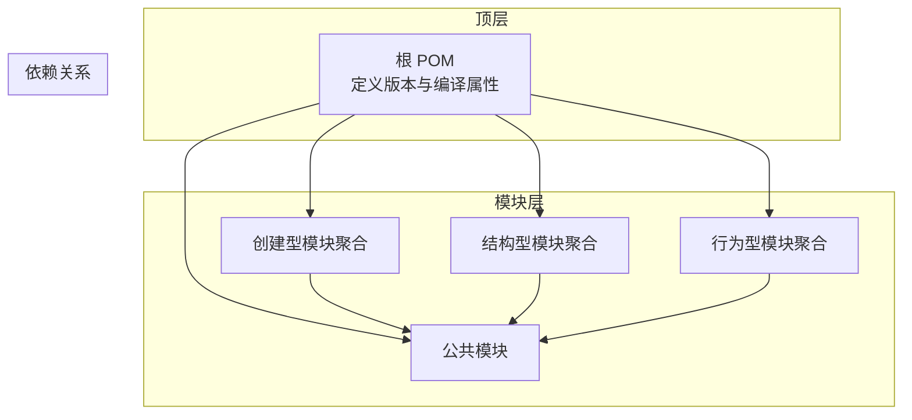

图表来源
- [根 POM 文件:18-22](file://pom.xml#L18-L22)
- [创建型模块 POM:28-34](file://creational/pom.xml#L28-L34)
- [结构型模块 POM:34-40](file://structural/pom.xml#L34-L40)
- [行为型模块 POM:40-46](file://behavioral/pom.xml#L40-L46)

## 详细组件分析

### 创建型：抽象工厂
- 设计要点
  - 抽象工厂定义创建产品族的接口，客户端通过工厂接口获取具体产品，隐藏创建细节。
  - 通过枚举控制产品类型，保证扩展时的可控性。
- 依赖关系
  - 依赖公共模块，使用统一工具进行输出分隔。
- 可扩展性
  - 新增产品族只需新增工厂与产品实现，并在工厂中注册映射。

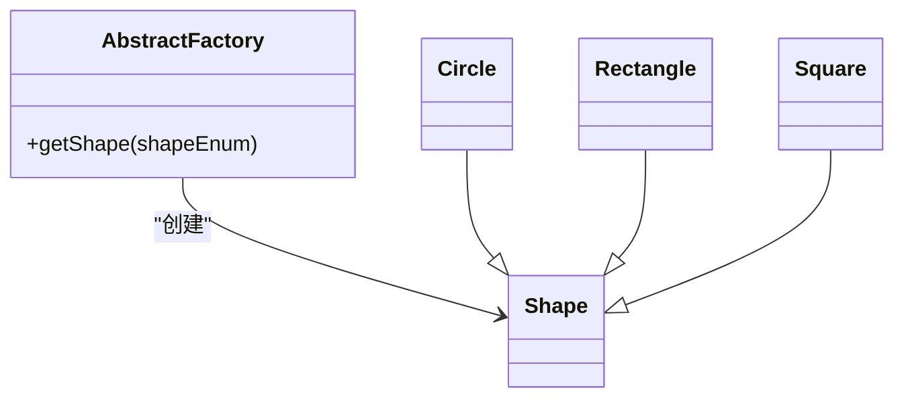

图表来源
- [抽象工厂抽象类 AbstractFactory:1-9](file://creational/abstractfactory/src/main/java/com/future/rocket/gof23/abs/factory/build/AbstractFactory.java#L1-L9)

章节来源
- [创建型模块 POM:1-36](file://creational/pom.xml#L1-L36)

### 结构型：适配器
- 设计要点
  - 适配器将不兼容接口转换为目标接口，屏蔽第三方播放器差异。
  - 通过构造函数根据文件类型选择具体播放器实现。
- 可扩展性
  - 新增媒体类型只需扩展播放器与适配器分支逻辑。

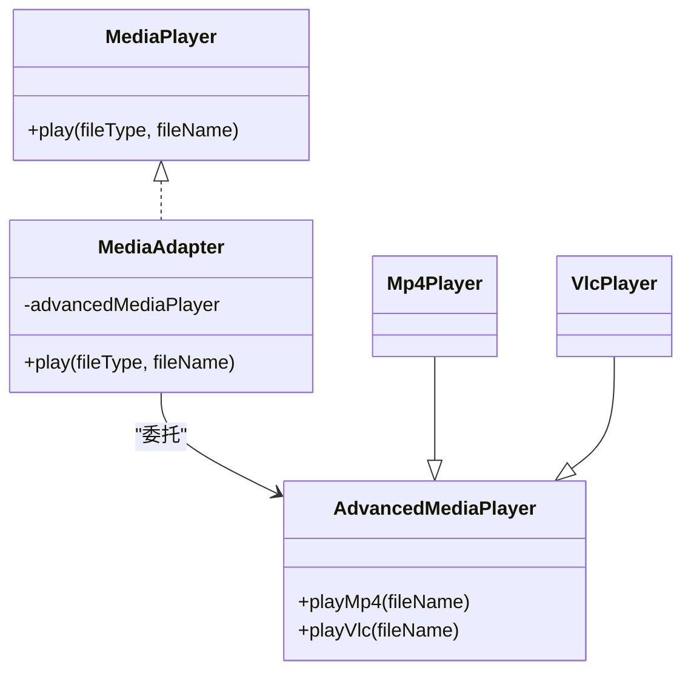

图表来源
- [适配器适配类 MediaAdapter:1-33](file://structural/adapter/src/main/java/com/future/rocket/gof23/adapter/struct/MediaAdapter.java#L1-L33)

章节来源
- [结构型模块 POM:1-42](file://structural/pom.xml#L1-L42)

### 行为型：观察者
- 设计要点
  - 主题维护观察者列表，在状态变化时通知所有观察者。
  - 支持附加、移除与批量清理观察者。
- 可扩展性
  - 新增观察者类型只需实现统一接口并注册到主题。

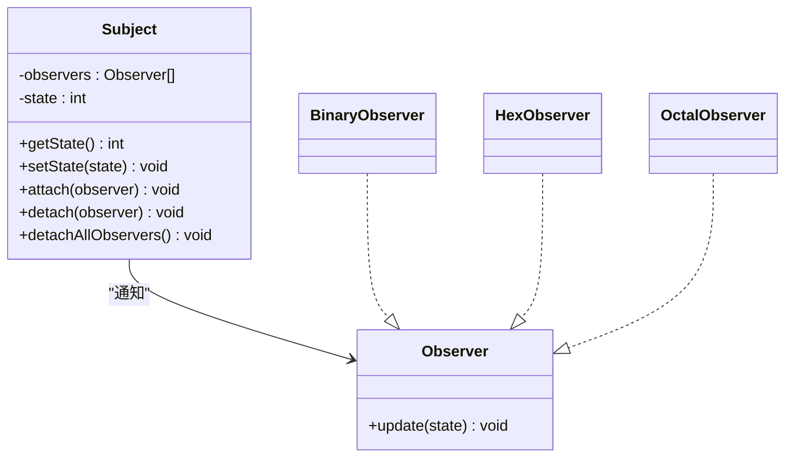

图表来源
- [观察者主题 Subject:1-43](file://behavioral/observer/src/main/java/com/future/rocket/gof23/observer/impl1/Subject.java#L1-L43)

章节来源
- [行为型模块 POM:1-48](file://behavioral/pom.xml#L1-L48)

### 行为型：命令
- 设计要点
  - 命令模式将请求封装为对象，使你可用不同请求对客户进行参数化。
  - 调用者持有命令列表并在合适时机执行。
- 可扩展性
  - 新增命令只需实现命令接口并加入调用者队列。

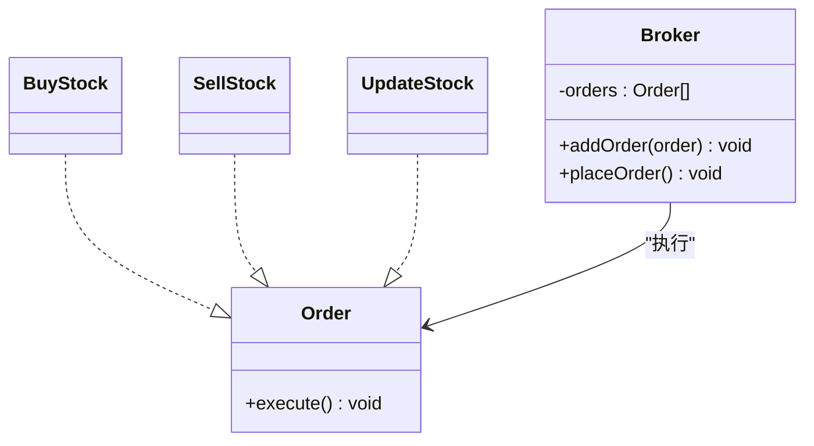

图表来源
- [命令调用者 Broker:1-19](file://behavioral/command/src/main/java/com/future/rocket/gof23/command/invoker/Broker.java#L1-L19)

章节来源
- [行为型模块 POM:1-48](file://behavioral/pom.xml#L1-L48)

### 创建型：单例
- 设计要点
  - 饿汉式单例在类加载时即创建实例，简单可靠。
  - 提供统一入口方法获取实例并执行业务逻辑。
- 可扩展性
  - 单例类可作为其他模式的基础设施使用。

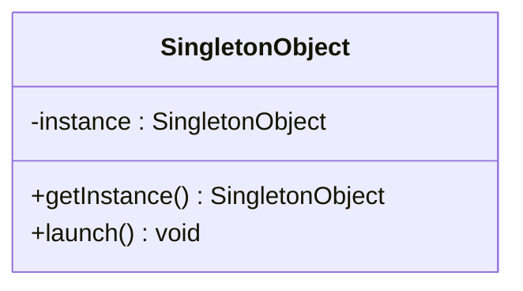

图表来源
- [单例类 SingletonObject:1-17](file://creational/singleton/src/main/java/com/future/rocket/gof23/singleton/SingletonObject.java#L1-L17)

章节来源
- [创建型模块 POM:1-36](file://creational/pom.xml#L1-L36)

### 结构型：DAO 模式
- 设计要点
  - DAO 将数据访问逻辑与业务逻辑分离，接口定义标准 CRUD 操作。
  - 实现类负责具体的数据源操作。
- 可扩展性
  - 新增数据源或表只需实现接口并替换配置。

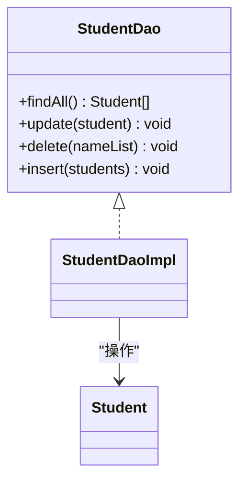

图表来源
- [DAO 接口 StudentDao:1-17](file://structural/daoPattern/src/main/java/com/future/rocket/gof23/dao/iface/StudentDao.java#L1-L17)

章节来源
- [结构型模块 POM:1-42](file://structural/pom.xml#L1-L42)

### 行为型：业务委托
- 设计要点
  - 客户端通过业务委托访问服务，委托根据类型动态选择具体服务。
  - 使用公共工具类输出分隔线，增强演示效果。
- 可扩展性
  - 新增服务类型只需扩展枚举与服务实现，并在委托中注册。

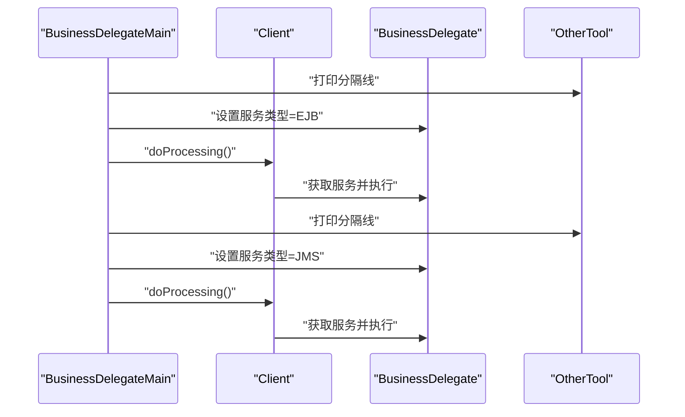

图表来源
- [业务委托入口 BusinessDelegateMain:1-22](file://behavioral/businessDelegate/src/main/java/com/future/rocket/gof23/business/delegate/BusinessDelegateMain.java#L1-L22)

章节来源
- [行为型模块 POM:1-48](file://behavioral/pom.xml#L1-L48)

### 结构型：前端控制器
- 设计要点
  - 前端控制器集中处理请求，先进行鉴权与追踪，再分发到相应视图。
  - 通过枚举区分请求类型，便于扩展新的请求类型。
- 可扩展性
  - 新增请求类型只需扩展枚举与分发逻辑。

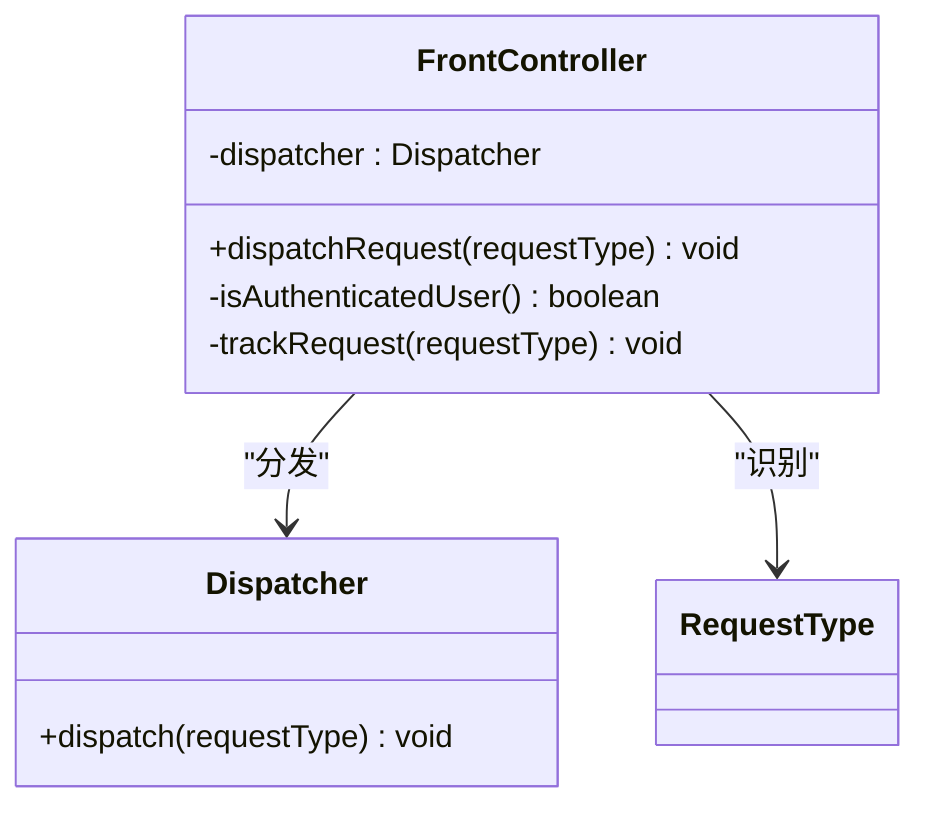

图表来源
- [前端控制器 FrontController:1-29](file://structural/frontController/src/main/java/com/future/rocket/gof23/frontController/controller/FrontController.java#L1-L29)

章节来源
- [结构型模块 POM:1-42](file://structural/pom.xml#L1-L42)

## 依赖分析
- 顶层 POM
  - 定义统一的编译属性与模块清单，确保构建一致性。
- 模块依赖
  - 创建型、结构型、行为型三大模块均依赖公共模块，实现工具与规范的统一。
  - 各模式模块内部保持最小依赖，仅引入必要的接口与工具类。
- 依赖可视化

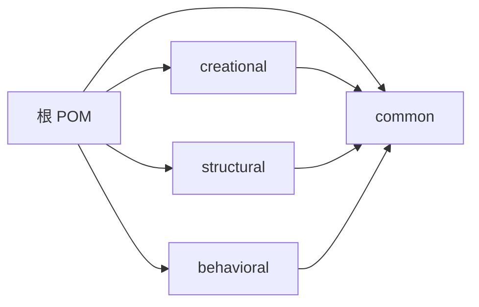

图表来源
- [根 POM 文件:11-16](file://pom.xml#L11-L16)
- [创建型模块 POM:28-34](file://creational/pom.xml#L28-L34)
- [结构型模块 POM:34-40](file://structural/pom.xml#L34-L40)
- [行为型模块 POM:40-46](file://behavioral/pom.xml#L40-L46)

章节来源
- [根 POM 文件:1-24](file://pom.xml#L1-L24)
- [创建型模块 POM:1-36](file://creational/pom.xml#L1-L36)
- [结构型模块 POM:1-42](file://structural/pom.xml#L1-L42)
- [行为型模块 POM:1-48](file://behavioral/pom.xml#L1-L48)

## 性能考虑
- 模块化带来的构建性能优势
  - 模块独立编译与测试，减少全量构建时间；增量构建时仅受影响模块重新编译。
- 运行时性能
  - 模式实现以演示为主，未涉及复杂算法，性能开销极低。
  - 通过接口与抽象类实现的解耦，有利于后续引入缓存或延迟初始化等优化手段。
- 可维护性
  - 清晰的包结构与职责划分，便于定位问题与快速修复。
  - 公共模块集中管理工具类，避免重复实现导致的维护成本上升。

## 故障排查指南
- 构建失败
  - 检查 Java 版本是否与 POM 中的编译属性一致（Java 8）。
  - 确认模块清单与实际目录一致，避免缺失模块导致的解析错误。
- 运行异常
  - 若出现未支持的操作类型或服务类型，检查枚举值与工厂/委托中的分支逻辑。
  - 对于适配器场景，确认文件类型与播放器实现的映射关系。
- 日志与输出
  - 使用公共工具类输出分隔线，有助于快速定位不同模式演示的边界。

章节来源
- [根 POM 文件:18-22](file://pom.xml#L18-L22)
- [适配器适配类 MediaAdapter:14-21](file://structural/adapter/src/main/java/com/future/rocket/gof23/adapter/struct/MediaAdapter.java#L14-L21)
- [业务委托入口 BusinessDelegateMain:12-20](file://behavioral/businessDelegate/src/main/java/com/future/rocket/gof23/business/delegate/BusinessDelegateMain.java#L12-L20)

## 结论
本项目以 Maven 多模块架构为基础，围绕 GoF23 设计模式构建了高内聚、低耦合的学习与演示体系。通过公共模块统一工具与规范，模块间依赖清晰，扩展与维护成本低。建议在二次开发中遵循现有包结构与依赖约定，新增模式时优先考虑接口抽象与统一入口，以保持整体架构的一致性与可演进性。

## 附录
- 构建与运行
  - 使用 Maven 在根目录执行构建，会自动递归构建所有模块。
  - 每个模式模块提供主程序入口，直接运行即可查看演示效果。
- 版本管理
  - 当前版本为快照版本，适合本地开发与学习；发布时建议升级为稳定版本号并引入版本管理策略。
- 开发建议
  - 新增模式时，优先抽取公共接口与抽象类，减少重复代码。
  - 保持模块独立性，避免跨模块强耦合。