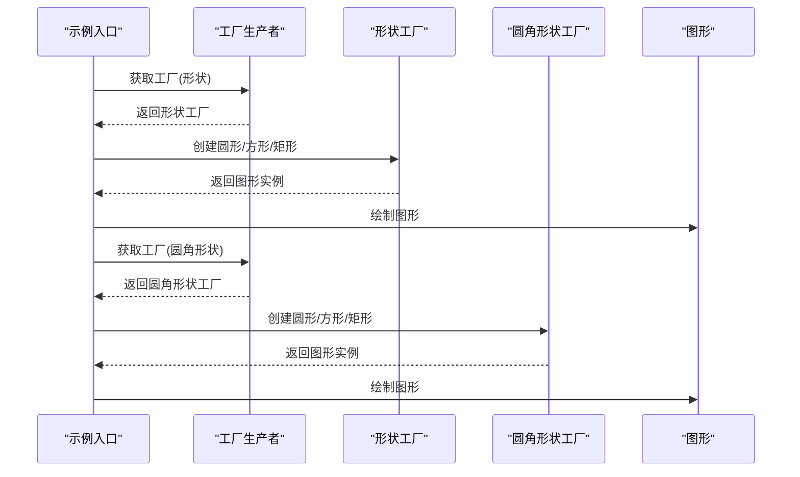
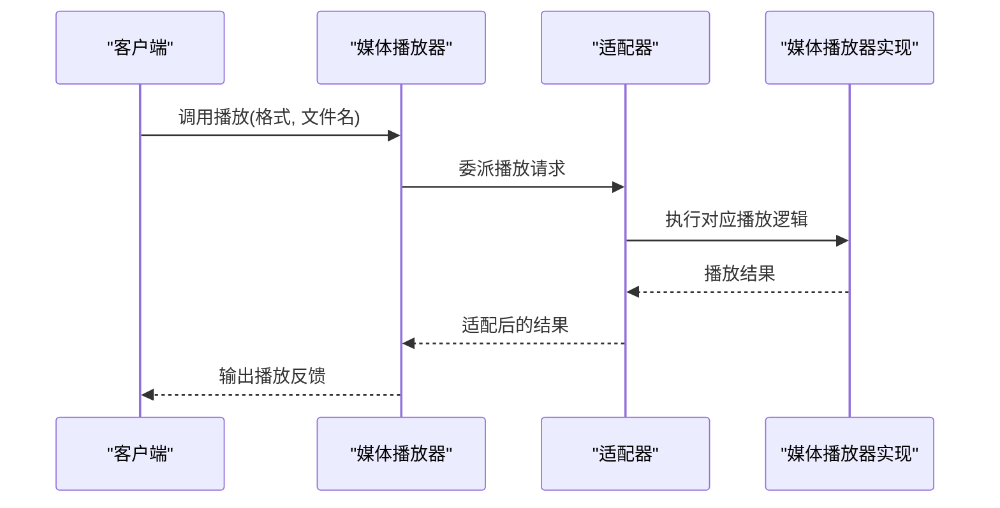
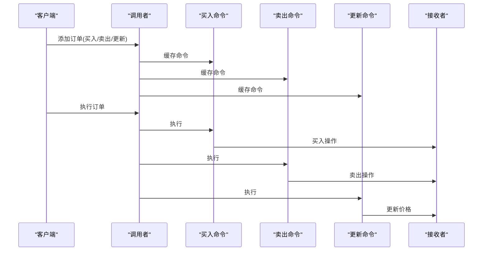
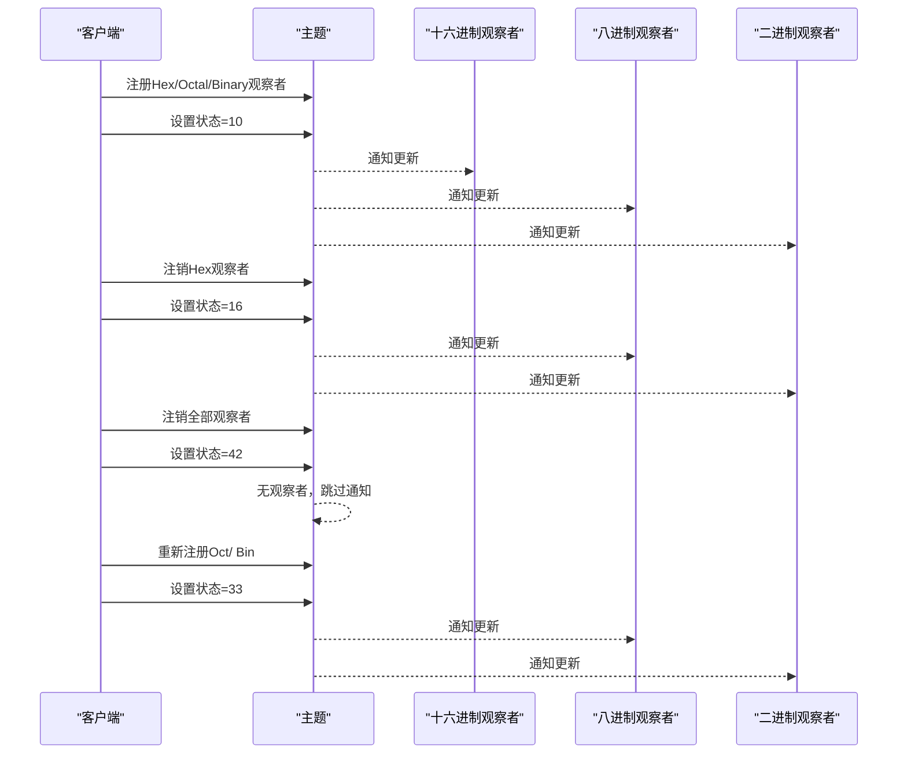
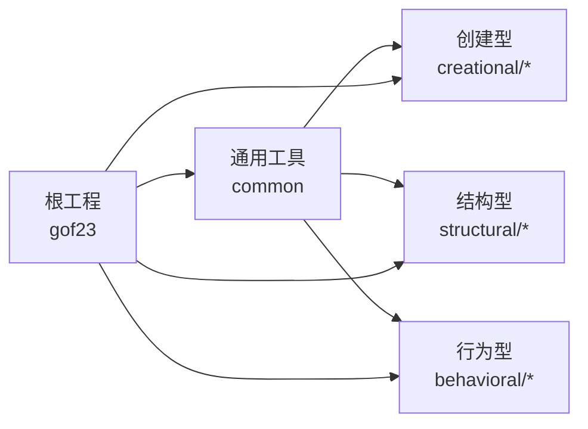

# 项目概述

<cite>
**本文档引用的文件**
- [pom.xml](file://pom.xml)
- [readme.md](file://readme.md)
- [creational/abstractfactory/readme.md](file://creational/abstractfactory/readme.md)
- [structural/adapter/readme.md](file://structural/adapter/readme.md)
- [behavioral/observer/readme.md](file://behavioral/observer/readme.md)
- [behavioral/command/readme.md](file://behavioral/command/readme.md)
- [behavioral/chain/readme.md](file://behavioral/chain/readme.md)
- [creational/abstractfactory/src/main/java/com/future/rocket/gof23/abs/factory/AbstractFactoryPatternMain.java](file://creational/abstractfactory/src/main/java/com/future/rocket/gof23/abs/factory/AbstractFactoryPatternMain.java)
- [behavioral/observer/src/main/java/com/future/rocket/gof23/observer/impl1/ObserverImplMain1.java](file://behavioral/observer/src/main/java/com/future/rocket/gof23/observer/impl1/ObserverImplMain1.java)
- [structural/adapter/src/main/java/com/future/rocket/gof23/adapter/AdapterMain.java](file://structural/adapter/src/main/java/com/future/rocket/gof23/adapter/AdapterMain.java)
- [behavioral/command/src/main/java/com/future/rocket/gof23/command/CommandMain.java](file://behavioral/command/src/main/java/com/future/rocket/gof23/command/CommandMain.java)
- [creational/singleton/src/main/java/com/future/rocket/gof23/singleton/SingletonMain.java](file://creational/singleton/src/main/java/com/future/rocket/gof23/singleton/SingletonMain.java)
</cite>

## 目录
1. [引言](#引言)
2. [项目结构](#项目结构)
3. [核心组件](#核心组件)
4. [架构总览](#架构总览)
5. [详细组件分析](#详细组件分析)
6. [依赖分析](#依赖分析)
7. [性能考虑](#性能考虑)
8. [故障排除指南](#故障排除指南)
9. [结论](#结论)
10. [附录](#附录)

## 引言
本项目“gof23Rockets”是围绕经典 GoF（Gang of Four）23 种设计模式构建的系统化学习工程，旨在帮助开发者以模块化、可运行的方式深入理解与实践面向对象设计模式。项目通过 Maven 多模块组织，将 23 种模式划分为三大类：创建型、结构型与行为型；每类下包含若干独立子模块，每个子模块均提供完整的示例入口类，演示模式的典型场景与交互流程。

项目目标与价值：
- 系统性掌握 23 种设计模式的动机、结构与适用场景，提升面向对象建模能力。
- 通过“可运行示例 + 模块化结构”的方式，降低从理论到实践的门槛。
- 提供清晰的学习路径：先从创建型建立对象思维，再过渡到结构型组合与解耦，最后进入行为型的交互与职责分配。
- 为初学者与进阶开发者提供可复用的教学范式与最佳实践参考。

## 项目结构
项目采用 Maven 聚合工程结构，顶层 POM 定义了四大模块：creational（创建型）、structural（结构型）、behavioral（行为型）与 common（通用工具）。每个子模块内部遵循“src/main/java + pom.xml + readme.md + 示例入口类”的标准组织方式，便于独立编译与演示。

```mermaid
graph TB
Root["根工程<br/>gof23"] --> C["创建型<br/>creational"]
Root --> S["结构型<br/>structural"]
Root --> B["行为型<br/>behavioral"]
Root --> U["通用工具<br/>common"]
C --> CAF["抽象工厂<br/>abstractfactory"]
C --> CB["建造者<br/>builder"]
C --> CF["工厂方法<br/>factory"]
C --> CP["原型<br/>prototype"]
C --> CS["单例<br/>singleton"]
S --> SA["适配器<br/>adapter"]
S --> SB["桥接<br/>bridge"]
S --> SC["组合<br/>composite"]
S --> SDao["数据访问对象<br/>daoPattern"]
S --> SDc["装饰器<br/>decorator"]
S --> SF["过滤器<br/>filter"]
S --> SFw["享元<br/>flyweight"]
S --> SFC["前端控制器<br/>frontController"]
S --> SP["代理<br/>proxy"]
S --> SSL["服务定位器<br/>serviceLocator"]
S --> STO["传输对象<br/>transferObject"]
B --> BC["业务委托<br/>businessDelegate"]
B --> BCH["责任链<br/>chain"]
B --> CMD["命令<br/>command"]
B --> CE["组合实体<br/>compositeEntity"]
B --> BIF["拦截过滤器<br/>interceptingFilter"]
B --> BI["解释器<br/>interpreter"]
B --> BIT["迭代器<br/>iterator"]
B --> BM["中介者<br/>mediator"]
B --> BMem["备忘录<br/>memento"]
B --> BMvc["MVC<br/>mvc"]
B --> BNO["空对象<br/>nullobject"]
B --> BObs["观察者<br/>observer"]
B --> BST["状态<br/>state"]
B --> BS["策略<br/>strategy"]
B --> BT["模板方法<br/>template"]
B --> BV["访问者<br/>visitor"]
```

图表来源
- [pom.xml:11-16](file://pom.xml#L11-L16)

章节来源
- [pom.xml:1-24](file://pom.xml#L1-L24)
- [readme.md:1-7](file://readme.md#L1-L7)

## 核心组件
- 创建型模式：关注对象的创建过程，强调在不指定具体类的情况下创建对象，提升灵活性与可扩展性。代表性模式包括抽象工厂、建造者、工厂方法、原型与单例。
- 结构型模式：关注类与对象的组合，通过将不同接口或类组合成更大结构，实现功能扩展与接口适配。代表性模式包括适配器、桥接、组合、装饰器、过滤器、享元、前端控制器、代理、服务定位器与传输对象。
- 行为型模式：关注对象之间的交互与职责分配，描述对象或类之间如何协作完成任务。代表性模式包括业务委托、责任链、命令、组合实体、拦截过滤器、解释器、迭代器、中介者、备忘录、MVC、空对象、观察者、状态、策略、模板方法与访问者。

学习价值与应用：
- 在复杂系统中，行为型模式常用于解耦请求发送方与接收方（如命令、责任链），或统一对外接口（如适配器、外观）。
- 结构型模式用于在不修改既有代码的前提下扩展功能（如装饰器、代理），或在不同接口间进行桥接（如适配器、桥接）。
- 创建型模式用于控制对象创建细节，避免分散的构造逻辑，提高一致性与可测试性（如单例、工厂、建造者）。

章节来源
- [readme.md:2-7](file://readme.md#L2-L7)

## 架构总览
项目采用分层模块化架构，顶层聚合工程统一管理版本与编译属性，四大子模块分别承载一类设计模式的示例与说明。每个子模块内含：
- 接口与实现：清晰分离抽象与具体实现，体现开闭原则与依赖倒置。
- 示例入口类：集中展示模式的使用方式与运行效果。
- 模块级 README：简述模式动机、结构与要点，便于快速理解。

```mermaid
graph TB
subgraph "创建型"
CAF["抽象工厂"]
CB["建造者"]
CF["工厂方法"]
CP["原型"]
CS["单例"]
end
subgraph "结构型"
SA["适配器"]
SB["桥接"]
SC["组合"]
SDc["装饰器"]
SF["过滤器"]
SFw["享元"]
SFC["前端控制器"]
SP["代理"]
SSL["服务定位器"]
STO["传输对象"]
end
subgraph "行为型"
BC["业务委托"]
BCH["责任链"]
CMD["命令"]
CE["组合实体"]
BIF["拦截过滤器"]
BI["解释器"]
BIT["迭代器"]
BM["中介者"]
BMem["备忘录"]
BMvc["MVC"]
BNO["空对象"]
BObs["观察者"]
BST["状态"]
BS["策略"]
BT["模板方法"]
BV["访问者"]
end
Root["根工程"] --> CAF & CB & CF & CP & CS
Root --> SA & SB & SC & SDc & SF & SFw & SFC & SP & SSL & STO
Root --> BC & BCH & CMD & CE & BIF & BI & BIT & BM & BMem & BMvc & BNO & BObs & BST & BS & BT & BV
```

图表来源
- [pom.xml:11-16](file://pom.xml#L11-L16)

## 详细组件分析

### 创建型模式：抽象工厂
- 模块说明：通过“工厂的工厂”概念，提供一组相互关联或相互依赖的对象族的创建，避免硬编码具体类。
- 示例入口：AbstractFactoryPatternMain 展示如何获取形状工厂与圆角形状工厂，并创建多种图形实例进行绘制。
- 教学要点：理解“产品族”与“产品等级”的区别，掌握工厂选择与产品创建的解耦。

图表来源
- [creational/abstractfactory/src/main/java/com/future/rocket/gof23/abs/factory/AbstractFactoryPatternMain.java:11-32](file://creational/abstractfactory/src/main/java/com/future/rocket/gof23/abs/factory/AbstractFactoryPatternMain.java#L11-L32)

章节来源
- [creational/abstractfactory/readme.md:1-10](file://creational/abstractfactory/readme.md#L1-L10)
- [creational/abstractfactory/src/main/java/com/future/rocket/gof23/abs/factory/AbstractFactoryPatternMain.java:1-34](file://creational/abstractfactory/src/main/java/com/future/rocket/gof23/abs/factory/AbstractFactoryPatternMain.java#L1-L34)

### 结构型模式：适配器
- 模块说明：在不修改现有接口的前提下，将一个接口转换为客户期望的另一个接口，常用于兼容旧系统或第三方库。
- 示例入口：AdapterMain 展示如何通过音频播放器适配不同媒体格式，统一对外播放接口。
- 教学要点：理解目标接口、适配器与被适配者的角色划分，掌握透明适配与扩展点设计。

图表来源
- [structural/adapter/src/main/java/com/future/rocket/gof23/adapter/AdapterMain.java:9-15](file://structural/adapter/src/main/java/com/future/rocket/gof23/adapter/AdapterMain.java#L9-L15)

章节来源
- [structural/adapter/readme.md:1-8](file://structural/adapter/readme.md#L1-L8)
- [structural/adapter/src/main/java/com/future/rocket/gof23/adapter/AdapterMain.java:1-17](file://structural/adapter/src/main/java/com/future/rocket/gof23/adapter/AdapterMain.java#L1-L17)

### 行为型模式：命令
- 模块说明：将请求封装为命令对象，使你可用不同请求对客户进行参数化，以及支持请求排队、记录日志与撤销操作。
- 示例入口：CommandMain 展示 Broker 如何接收多个订单（买入、卖出、更新），并在合适时机统一执行。
- 教学要点：命令接口、具体命令、接收者与调用者之间的解耦，以及命令队列与事务式执行。

图表来源
- [behavioral/command/src/main/java/com/future/rocket/gof23/command/CommandMain.java:12-29](file://behavioral/command/src/main/java/com/future/rocket/gof23/command/CommandMain.java#L12-L29)

章节来源
- [behavioral/command/readme.md:1-11](file://behavioral/command/readme.md#L1-L11)
- [behavioral/command/src/main/java/com/future/rocket/gof23/command/CommandMain.java:1-32](file://behavioral/command/src/main/java/com/future/rocket/gof23/command/CommandMain.java#L1-L32)

### 行为型模式：观察者
- 模块说明：定义对象间一对多的依赖关系，当一个对象状态改变时，其所有依赖者都会收到通知并自动更新。
- 示例入口：ObserverImplMain1 展示主题对象的状态变化与观察者的动态增删、批量更新。
- 教学要点：主题与观察者接口设计、注册/注销机制、通知传播与状态一致性。

图表来源
- [behavioral/observer/src/main/java/com/future/rocket/gof23/observer/impl1/ObserverImplMain1.java:11-26](file://behavioral/observer/src/main/java/com/future/rocket/gof23/observer/impl1/ObserverImplMain1.java#L11-L26)

章节来源
- [behavioral/observer/readme.md:1-26](file://behavioral/observer/readme.md#L1-L26)
- [behavioral/observer/src/main/java/com/future/rocket/gof23/observer/impl1/ObserverImplMain1.java:1-28](file://behavioral/observer/src/main/java/com/future/rocket/gof23/observer/impl1/ObserverImplMain1.java#L1-L28)

### 行为型模式：责任链
- 模块说明：将多个可能处理请求的对象连成一条链，沿着这条链传递请求，直到有对象处理它为止。有助于消除请求发送者与接收者之间的紧耦合。
- 教学要点：处理器链的构建、职责判断与默认处理策略、链路顺序与优先级设计。

章节来源
- [behavioral/chain/readme.md:1-9](file://behavioral/chain/readme.md#L1-L9)

### 创建型模式：单例
- 模块说明：保证一个类仅有一个实例，并提供一个全局访问点，常用于配置中心、线程池等共享资源。
- 示例入口：SingletonMain 展示懒汉式与饿汉式两种单例的获取与使用。
- 教学要点：线程安全、延迟加载、反射与序列化攻击的防护思路。

章节来源
- [creational/singleton/src/main/java/com/future/rocket/gof23/singleton/SingletonMain.java:1-16](file://creational/singleton/src/main/java/com/future/rocket/gof23/singleton/SingletonMain.java#L1-L16)

## 依赖分析
- 模块内聚与解耦：各模式模块内部通过清晰的包结构与接口隔离，降低模块内耦合度；示例入口类作为单一职责的触发点，便于演示与测试。
- 通用工具模块：common 模块提供跨模块的通用工具类（如打印分割线），减少重复代码，提升演示一致性。
- 运行时依赖：顶层 POM 统一声明 Java 版本与字符集，确保各模块编译环境一致。

图表来源
- [pom.xml:11-16](file://pom.xml#L11-L16)

章节来源
- [pom.xml:18-22](file://pom.xml#L18-L22)

## 性能考虑
- 对象创建成本：创建型模式（尤其是工厂与建造者）可通过缓存与对象池降低频繁创建带来的开销。
- 调用链深度：行为型模式（如责任链、命令）在链路过长时可能增加调用栈深度与调度成本，应合理拆分与限流。
- 内存占用：结构型模式（如装饰器、享元）在装饰层次过深或享元对象过多时需注意内存与缓存策略。
- 并发安全：单例与全局缓存需考虑并发访问与初始化顺序，避免竞态条件。

## 故障排除指南
- 编译失败：检查顶层 POM 的 Java 版本属性是否与本地环境匹配。
- 模块缺失：确认子模块目录存在且包含正确的 pom.xml 与源码结构。
- 运行异常：核对示例入口类的包名与类名是否正确，确保主类可执行。
- 日志与输出：利用通用工具类提供的统一输出格式，便于定位问题与对比不同模式的运行差异。

## 结论
gof23Rockets 以模块化、可运行的方式系统呈现了 23 种 GoF 设计模式，既适合初学者循序渐进地建立设计模式思维，也便于有经验的开发者检索与复用最佳实践。通过“模式讲解 + 示例演示 + 可运行代码”的闭环，项目有效降低了从理论到实践的距离，具备良好的教学意义与实用价值。

## 附录
- 适用人群：软件开发入门者、需要系统补强设计模式知识的工程师、高校计算机相关专业学生与教师。
- 学习建议：
  - 建议按“创建型 → 结构型 → 行为型”的顺序学习，先理解对象创建与组合，再掌握交互与职责分配。
  - 每个模块先阅读 README，再运行示例入口类，最后对照源码理解关键接口与实现。
  - 尝试在现有示例基础上扩展新场景（如为命令模式增加撤销栈、为观察者添加异步通知等），加深理解。
- 技术特点：模块化、可编译、可演示、可扩展，适合课堂讲授、自学与团队分享。