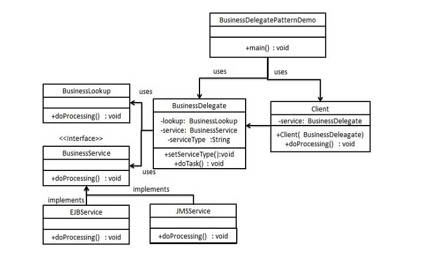

## businessDelegate模式

### 模式简介
```
Business Delegate Pattern 是一种用于解耦展示层（Presentation Tier）与业务层（Business Tier）的设计模式。它的核心目的是简化展示层与业务层的交互，减少直接通信的复杂性，并隐藏远程查找的实现细节。

核心组件和职责
- Client（客户端）
通常是展示层代码，比如JSP、Servlet或用户界面的Java代码。
通过调用Business Delegate来访问业务服务，而不直接与业务层交互。

- Business Delegate（业务代理）
是客户端访问业务服务的单一入口。
通过使用 LookUp Service 来查找具体的业务服务。
提供了对客户端屏蔽底层查找和调用复杂性的能力，简化了客户端的代码逻辑。

- LookUp Service（查找服务）
负责从注册中心或服务目录中找到对应的业务服务实现。
它可以通过查找的方式获取实际的业务对象，并将其返回给 Business Delegate。

- Business Service（业务服务）
是业务层的接口，定义了业务操作。
由具体的类实现，用于提供实际的业务逻辑。
```

