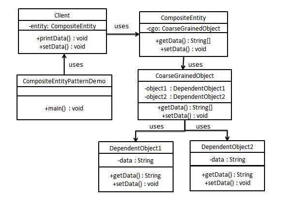

## compositeEntity模式

### 模式简介
```
Composite Entity Pattern 是一种用于持久化机制的设计模式，主要在 EJB（Enterprise JavaBeans）中使用。它旨在通过一个主实体（Composite Entity）管理一组相关的依赖对象（Dependent Objects），从而优化性能并减少数据库访问次数。

结构
- Composite Entity (复合实体)
这是一个主 EJB 实体 Bean，代表一个对象图的根。
它直接与数据库交互，并管理其依赖对象。
当复合实体被更新时，其管理的依赖对象也会自动更新。

- Dependent Object (依赖对象)
是被复合实体管理的对象。
不直接与数据库交互，所有的持久化操作均由复合实体代理。
当复合实体进行增删改操作时，这些依赖对象的状态会被同步更新。

- Key Object (键对象)
用于标识复合实体及其依赖对象。
通常一个键对象与复合实体的主键对应。
```

