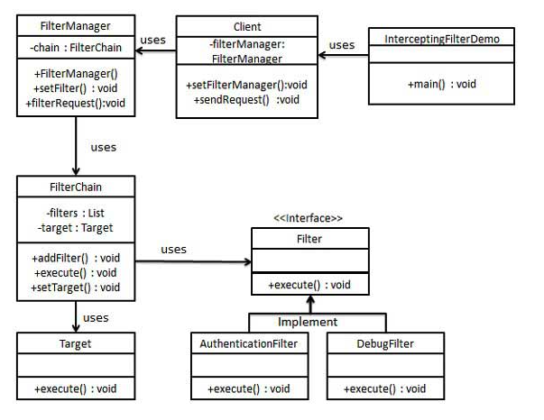

## interceptingFilter模式

### 模式简介
```
Intercepting Filter Design Pattern 是一种 行为型设计模式，用于在请求到达目标对象之前或者响应返回客户端之前，对请求和响应进行 预处理 和 后处理。这种模式通过引入过滤器链，可以将日志记录、认证、授权等通用功能与业务逻辑分离，从而提高代码的可维护性和复用性。

设计模式的核心思想
Intercepting Filter 模式通过一组 可配置的过滤器链，对客户端请求或服务端响应进行处理，而不需要在具体的业务逻辑中重复实现这些功能。过滤器可以按顺序执行，或基于某些条件选择性执行。

结构
- Filter（过滤器）
执行预处理或后处理逻辑。
通常是独立的功能模块，如日志记录、认证、数据压缩等。

- FilterChain（过滤器链）
管理过滤器的集合，并按顺序调用它们。

- Target（目标对象）
代表最终处理请求的业务逻辑。

- FilterManager（过滤器管理器）
用于管理过滤器链并触发执行。

- Client（客户端）
发起请求，并通过 FilterManager 执行过滤器链。

```
