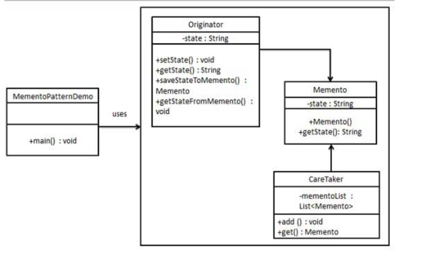

## 备忘录(memento)模式

### 模式简介
```
备忘录模式（Memento Pattern）用于在不破坏封装性的前提下，捕获一个对象的内部状态，并在该对象需要时将其还原到之前的状态。

-组成
* Memento（备忘录）
存储对象的内部状态。
提供恢复功能。
通常是一个封装类，不允许外界直接修改其内容。

* Originator（发起者）
创建备忘录以记录其当前状态。
使用备忘录来恢复之前的状态。
它是状态的管理者，决定什么时候创建或恢复备忘录。

* Caretaker（负责人）
负责保存备忘录对象。
不会修改或操作备忘录的内容。
提供一个存储机制，例如栈或列表，用于存放多个备忘录。
```

