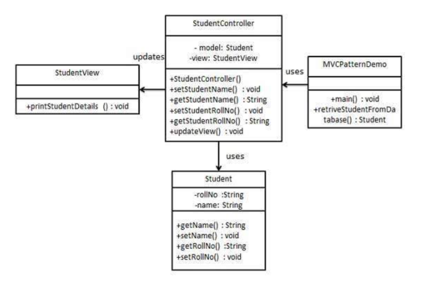

## mvc模式

### 模式简介
```
MVC 模式是Model-View-Controller的缩写，中文译为模型-视图-控制器模式。它是一种架构设计模式，旨在将应用程序的不同关注点（concerns）分离开来，以提高代码的可维护性、可扩展性和复用性。

MVC 模式通过将应用程序分为以下三部分来实现关注点分离：

* Model（模型）：
负责管理应用程序的数据和业务逻辑。
通常处理与数据库的交互（如查询、插入、更新等）。
通知 View 数据的变化。

* View（视图）：
负责展示数据给用户。
仅仅关注如何显示数据，而不处理业务逻辑。
监听 Controller 的指令，响应用户的交互。

* Controller（控制器）：
负责处理用户输入。
将用户的操作转换为模型的操作或视图的更新。
```
